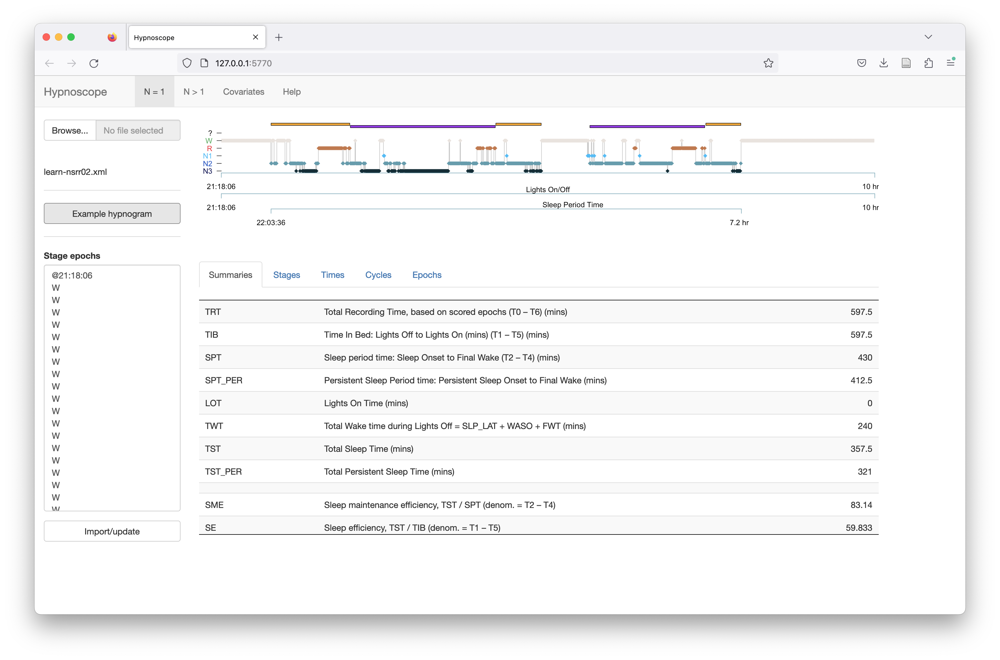
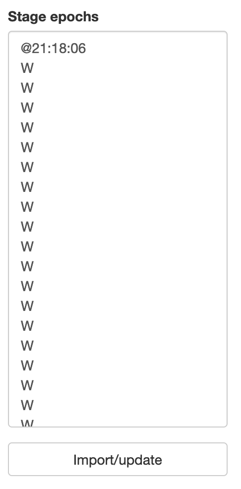
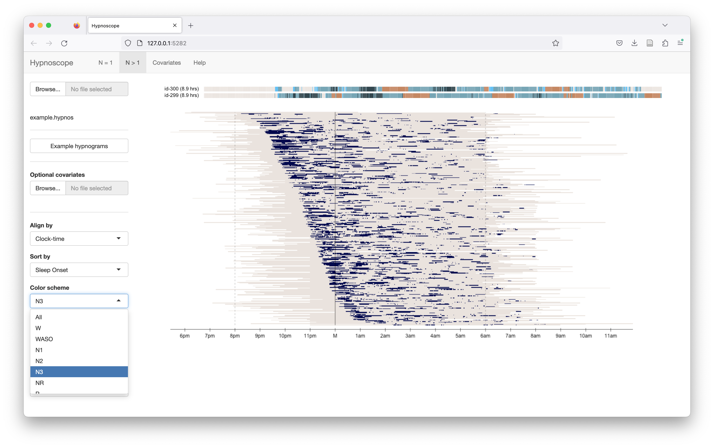

# Hypnoscope

<!---
%   M-:  (setq make-backup-files nil)
--->


## Overview

_Hypnoscope_ is a simple utility for viewing one or many hypnograms,
available either online ([https://remnrem.net/](https://remnrem.net/))
for [local download](#access).  It operates in two modes:

 - __N=1__ : given sleep stages for one individual, generate a
   hypnogram image and various summary statistics

 - __N>1__ : given many hypnograms (hundreds or thousands), align,
 sort and filter a condensed visual summary of these hypnograms

!!! hint "Uses of N>1 hypnoscope viewing"
    The N>1 mode can be useful
    for exposing various properties of the staging and timing of
    studies in a whole cohort: for example, if all recordings are
    truncated at a particular clock time. See [this
    vignette](vignettes/dataplots.md) for motivations and examples, as
    well as the [gallery](#gallery) below.


## Basic usage

See the [Inputs](#inputs) section below for a description of required input formats
and notes on how Luna can generate them.

<h3>N=1 mode</h3>

You can upload a staging [annotation file](ref/annotations.md) that
follows sleep stage conventions as described
[here](ref/hypnograms.md).  Alternatively, click _Example hypnogram_
to load single example dataset.

{:width="25%"}

Alternatively, you can cut-and-paste whitespace-delimited plaintext
into the _Stage epochs_ window, and then click _Import/update_ below.
This assumes the following stage labels: `W`, `N1`, `N2`, `N3`, `R`,
`?` and `L` (for _lights on_ epochs).  Optionally, you can specify the
start time (i.e clock-time for when the first epoch is, in 24-hour
format prepending a `@` character: e.g. `@22:30:00`).

{:width="25%"}

After loading a valid hypnogram via either means, you should see
something like the following:



After uploading the data, the _Stage epochs_ box will be populated with the extracted stages.  You
can make edits here and click _Import/update_ to recalculate statistics:

{:width="25%"}

The metrics and summaries are described on this
[Luna](ref/hypnograms.md) and [Moonlight](moonlight.md) pages.

<h3>N>1 mode</h3>

Either upload a file directly, or select _Load example hypnograms_
to see _Hypnoscope_ with examples from the NSRR:

{ width="200px" }

After clicking to load the example data, it will take a little while
to load and pre-process the data, especially for large studies.

!!! info "Example data"
     The example hypnograms bundled with
    _Hypnoscope_ are from 300 individuals selected randomly from six
    different NSR R studies.  All data have been anonymized (with IDs
    obfuscated from original NSRR IDs).  Individuals are ordered by
    cohort (i.e. the row order of the plots reflect 50 individuals
    from each of the six cohorts).
    
As shown below, by default all hypnograms are aligned by clock-time. Each
individual is shifted so that the black line at `M` corresponds to
midnight for all individuals (even if studies start after midnight).
If you hover the mouse over the image, a standard hypnogram will be
plotted at the top of the screen for that individual.


A _banding_ of studies is evident is the above plot, as individuals
are ordered by the six cohorts (N=50 from each), e.g. the cohort at
the bottom tends to have studies that end at the same clock-time
(around 6:45am).  Some cohorts are composed of children, some of older
individuals - clear differences in the structure of sleep (i.e. more
N3, less fragmentation, etc) can be seen between different cohorts, as
well as technical differences (e.g. in whether wake periods before and
after the sleep period were exported).  Hypnoscope plots can be useful ways to point to general properties of
cohorts including oddities that might not be evident from statistical
analysis of hypnogram statistics.

!!! info "Color schemes"
    Note that unlike Luna's standard color scheme (used in the _N=1_
    mode), here (under the default view) REM is orange rather than red;
    also, wake is gray/cream rather than green.  These changes were made
    to enchance the visual qualities of the condensed hypnogram plots.

To change the x-axis alignment, select the _Align by_ control and pick
_Elapsed-time_.  Now all studies are aligned such that sleep onset occurs at the same point (0 hours):


__Ordering rows/individuals:__

The _Sort by_ control can be used to change the order of the main plot.  The options will include

 - Unsorted (actually individuals will be sorted alphanumerically -
 the default), by sleep onset (clock-time), and by the start of the
 recording (clock-time).

 - Additionally, if any covariates have been attached, the columns of
 the file will appear as menu items here, e.g.  to order individuals
 by age, etc, or other (pre-computed) hypnogram properties (e.g. sleep
 efficiency).

In this example (which uses clock-time alignment), the rows are sorted
by sleep onset (i.e.  individuals with later sleep onsets are plotted
below those with earlier sleep onset times:
 


<h4>Restricting stage/color palettes</h4>

Selecting options from the _Color scheme_ list (left panel), here we restrict to viewing the same data/view, but only `N3` epochs highlighted:



<h4>Sorting individuals</h4>

By default, the _Sort By_ list can select to order individuals by either _sleep onset clock-time_ or _recording start clock-time_.  If
other covariates are attached, these will additionally populate the _Sort By_ tool:

{:width="30%"}

This view sorts the individuals (rows) by REM latency, aligning recordings by elapsed-time (rather than clock-time)
and


The same plot, but now selecting only REM epochs to be shown:


After sorting the individuals, this changes the corresponding table in the _Covariates_ panel too:


<h4>Generating individual hypnogram metrics</h4>

You can hover over the main plot with the mouse and it will show
hypnograms at the top of the page. (Note - a glitch not yet fixed
means the alignments can be slightly off, however, in terms of which individuals are shown; if the
rows are sorted, they should be representative of hypnograms in/near that region however.).

To look at one individual in more detail, go to the lower-left panel and select that person: 

{:width="25%"}

Clicking _Generate hypnogram stats_ will pass the hypnogram for that person to the _N=1_ panel,
in which the hypnogram statistics are then calculated.

## Large studies

For studies with more observations than fit into the single window,
the page will let you scroll up and down.  Alternatively, you can
right click and _Open Image in New Tab_ (or similar, depending on your
browser) or save it to a file, to view a zoomed-out version.
Naturally the details of individual studies will be lost if there are
more recordings than pixels on the screen: given appropriate
sorting/filtering, the any marked global patterns should still be
visible.

For smaller studies, Hypnoscope will expand the height of each bar
to fill more of the display.

## Known issues

 - resolving early/late start time

 - the mouse-over to select individual hypnograms from the main _N>1_ plot may be slightly miscalibrated

 - this issue will be fixed, but currently, ensure that any covariate file contains observations for all individuals
 in the `.hypnos` file
 

## Access

See [these notes](hypnoscope-install.md) on how to access _Hypnoscope_
directly, e.g.  to run locally rather than use the instance at
[http://remnrem.net/](http://remnrem.net/).


## Inputs

### Single hypnograms 

In individual hypnogram _N=1_ mode,  _Hypnoscope_ accepts the same formats as Luna to represent sleep staging 
annotations.  General annotation file formats are described
[here](ref/annotations.md).  Sleep stage conventions are described
[here](ref/hypnograms.md).

The simplest format is `.eannot` - a basic plaintext file with one
label per line for each (30-second) epoch, using stage labels: `N1`
`N2` `N3` `R` `W` `L` and `?`.  This format does not contain any
clock-time information: Hypnoscope will arbitrarily set the recording
start to midnight.

Alternatively, `.annot` and `.XML` formats are supported (see the
above links for details), which can contain clock-time
information. The Luna [tutorial data](tut/tut1.md) contains
examples of XML annotation files the specify sleep stage information.

### Multiple hypnograms

To run in multiple hypnogram _N>1_ mode, you need to make a ".hypnos" file beforehand.
_Hypnoscope_ expects a single file with staging information for
multiple individuals, one line per individual/epoch.  As well as a
stage label, this file must contain the clock time of each epoch, as
this will be used to align stages between different individuals.

!!! warning "Gapped recordings"
    Currently, Hypnoscope does not support
    staging that contains gaps or variable epochs durations other than
    30 seconds, although this constraint may be relaxed in future releases.

The input data for the _N>1_ mode should be a tab-delimited file with
either 4 or 5 columns, with the latter format including sleep cycle information:

 - 4-column format: _ID_, _epoch_, _time_, _stage_

 - 5-column format: _ID_, _epoch_, _time_, _cycle_, _stage_

For example, some data in the 4-column format:

```
 ID     E     CLOCK_TIME    STAGE
 id1    1     23:23:02      W
 id1    2     23:23:32      W
 id1    3     23:24:02      N1
 ...
 id2    1     20:07:00      W
 id2    2     20:07:30      W
 ...
```

Specifically,

  - each row is one epoch for one individual

  - the first column must be `ID` (individual identifier)

  - the second colum must be `E` (epoch count, always starting at epoch 1)

  - the entire file should have __either 4 or 5 tab-delimited columns for all rows__

  - if four columns: the third column should be clock-time and the
  fourth should be stage; these columns can have any label however
  (e.g. `Time` or `CLOCK_TIME` etc). That is, the information is
  specified by column position rather than variable name

  - if five columns: columns three through five are clock-time, cycle
    and stage respectively; as above, columns three onwards can have
    any variable name in the header

  - clock-times should be 24-hour format, encoded as `hh:mm:ss`

  - valid stages labels are `N1` `N2` `N3` `R` `W` as well as `L` (lights on) and `?` (unknown)

  - alternatively, `NREM1` `NREM2` `NREM3` `REM` and `wake` can be
    used (also with `U` instead of `?`)

  - sleep cycle number should be `1`, `2` etc if the epoch belongs to
  the first, second, etc cycle; if an epoch is not assigned to a
  cycle, it should be `NA`, `.` or `0`
  

By convention, these files should be saved with a `.hypnos` extension
(or `.hypnos.gz` if gzip-compressed) but it can also have a `.txt` extension.


### Covariates

In _N>1_ mode, you can attach extra covariate information which can be
used to set the row order of hypnograms (i.e. sorting the rows of the
individual by epoch matrix).  The _Example_ dataset includes a set of
covariates previously calculated for those individuals.

To attach a new set, click on the _Optional covariates_ form:

{ width="200" }

Covariate files should be plaintext

 - tab-delimited

 - `ID` as the first field and header column (individual identifier)

 - all subsequent rows contain arbitrary numeric data
 
 - missing values should be encoded `NA` or `.`
 
The _Covariates_ panel will show a table after a covariate file has been attached: 


In the example dataset, as well as some basic demographics (age, sex)
the covariate file contains a set of metrics calculated _based on the
hypnogram data themselves_ (i.e. from Luna's `HYPNO` command).  This
will be a common scenario, i.e. to enable sorting the rows by relevant
features such as total sleep time (TST) or other measures.  The
covariates can be any feature however (e.g. disease groups), but
should be encoded numerically.


## Making .hypnos files

To use Luna to generate a `.hypnos` file:  assuming a sample list `s.lst` that contains
annotations with stage data:

```
luna s.lst -o out.db -s HYPNO epoch
```

then extract the epoch-level outputs (here including NREM cycle number also):

```
destrat out.db +HYPNO -r E -v CLOCK_TIME CYCLE OSTAGE > data.hypnos
```

!!! info "Original staging"
    Note that above we extract `OSTAGE`
    (_original_ stage) rather than `STAGE`, as the latter may be
    slightly editted by Luna (e.g. setting lights out for
    leading/trailing epochs, or setting some epochs to `?` if they
    imply excessive WASO (e.g. a single sleep epoch followed by
    several hours of wake before the main sleep period).  Either
    variable can be used for Hypnoscope.


If `CYCLE` is dropped above, a 4-column dataset is exported (i.e. no
cycle information).  Note that `destrat` outputs variables in
alphabetical order, thus _clock-time_, _cycle_ and _stage_
information, as required by _Hypnoscope_.

To output a compressed file:

```
destrat out.db +HYPNO -r E -v CLOCK_TIME CYCLE OSTAGE | gzip > data.hypnos.gz
```
