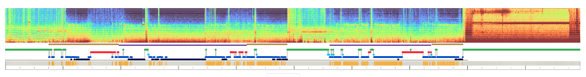
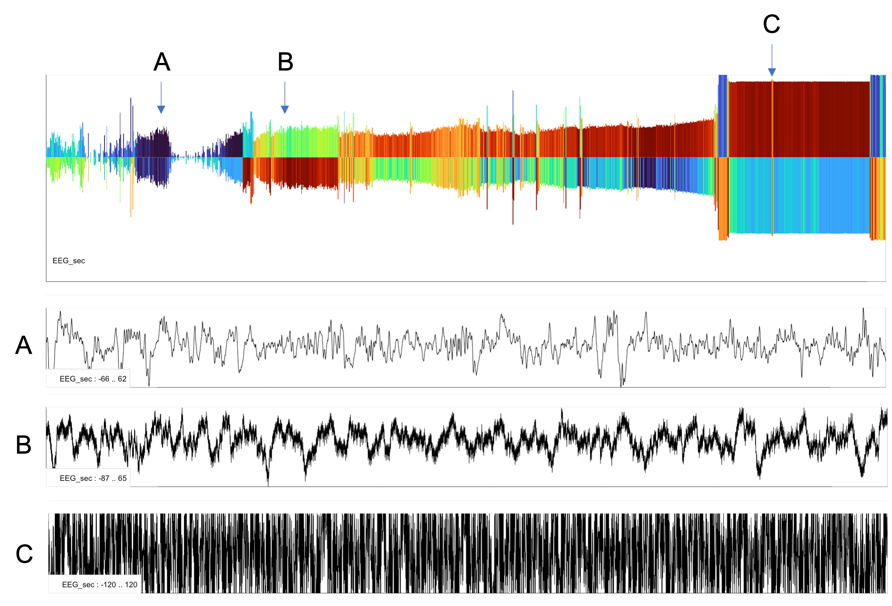

# Moonlight 


## Overview

_Moonlight_ is a Luna-based interactive viewer for EDF signal and
annotation data, specifically designed for polysomnographic data.  As
well as visualization, _Moonlight_ supports basic analyses and
manipulation of sleep data, a range of summary statistics, and
hypnogram-based analyses including automated staging using
[POPS](../ref/pops.md).  Below we give a brief tour of the current main
components.

!!! info "Moonbeam & National Sleep Research Resource Data"
    _Moonlight_ also includes the [_Moonbeam_](moonbeam.md) extension that
    allows [NSRR](sleepdata.org) users to directly pull NSRR signal data into _Moonlight_ via the web,
    described [here](moonbeam.md)


!!! warning "Moonlight development and scope"
     _Moonlight_ is actively
     under development - please let us know of any rough edges or
     missing functionality.  Note that _Moonlight_ is __not__ designed
     to be a performant, general purpose EDF viewer, although it does
     support basic viewing abilities.  The niche _Moonlight_ attempts
     to fill is to provide some sleep-specific functionality
     (including hypnogram statistics and automated staging) as well as
     tight coupling of Luna analyses, i.e. the ability to actively
     manipulate PSG data in this context.  It also provides tools for
     viewing [annotation data](../ref/annotations.md) alongside signal
     data.
     
## Access

See [these notes](moonlight-install.md) on how to access _Moonlight_.  Briefly, you can:

 - use our AWS hosted instances at [http://remnrem.net/](http://remnrem.net/).  _Advantages:_
   no installation. _Disadvantages:_ slower to upload EDFs to the cloud,
   limited number of instances available at any one time

 - pull our Dockerized version of luna and run from
   there. _Advantages:_ runs on all platforms that can support Docker
   Desktop (see [here](download/docker.md)). _Disadvantages:_
   requires Docker set up; some Docker versions can currently have slow I/O under default configurations
   on certain platforms

 - run directly from a local version of [_lunaR_](ext/R/index.md): _Advantages_: most
   flexible and fastest option. _Disadvantages_: requires 
   installation of R and _lunaR_

## Basic principles

_Moonlight_ is designed to upload a _single EDF (or EDF+)_ at a time, optionally
along with one or more [annotation files](../ref/annotations.md).  You
can then view basic properties of the data, including viewing raw
signals.  The window contains a number of _panels_, all
of which show some aspect of the uploaded EDF:

 - [_Left panel_](#left-panel) : select files to upload and which channels/annotations to view

 - [_Headers_](#headers) : basic EDF headers

 - [_Structure_](#structure) : epoch level structure of the data, showing discontinuities (from masking or EDF+D)

 - [_Hypnogram_](#hypnogram) : hypnogram-based summaries as well as automated staging (POPS) and stage evaluation (SOAP)

 - [_Annots_](#annots) : visualization and tabulation of annotations

 - [_Signals_](#signals) : raw signal viewer (including annotations) 

 - [_Stats_](#stats) : basic signal summary statistics (e.g. means, skewness, etc)

 - [_Time/freq_](#time-freq) : several whole-night representations: multi-taper spectrograms, Hjorth-plots, and epoch-level time-series clustering

 - [_Manips_](#manips) : manipulations of the attached signals: resampling, rereferencing, filtering, copying, renaming, etc

 - [_Models_](#models) : prototypes of predictive models and population-based norms model for EEG and other metrics

 - [_Luna_](#luna) : evaluation of arbitrary Luna commands  

The easiest way to learn is to open an instance at
[http://remnrem.net/](http://remnrem.net/) and load the _Example
data_ (one of the NSRR _tutorial_ individuals from the SHHS) and/or
follow [this tutorial](../tut/tut5.md) which uses _Moonlight_ to step through
the the _Luna_ and _lunaR_ tutorial pages.

## Left panel

### Load data

To attach an EDF (and optionally annotation files) select _Load data_
from the top of the left panel. Note that depending how _Moonlight_ is
configured (e.g. running locally versus on the web), the load
button/dialog box may look slightly different (either left or right
boxes):


{ width="200" }  { width="200" }

With either dialog box, you can upload:

 - a single EDF or EDF+ files (which must end in the extension
   `.edf`).  If multiple EDFs are selected, only the first will be
   uploaded.

 - annotation files in Luna [.annot](../ref/annotations.md#annot-files)
   format, Luna [.eannot](../ref/annotations.md#eannot-files) or
   NSRR-style [XML](../ref/annotations.md#nsrr-xml-files) formats (ending
   either `.annot`, `.eannot` or `.xml`).  If multiple files are
   selected, all will be uploaded (and assumed to match the uploaded
   EDF).

 - All files need to be uploaded at the same time: this means that
   currently, all files must be in the same folder, in order that they
   can be concurrently selected.

### Example data

Instead of uploading your own data, to try out _Moonlight_ you can
alternatively click _Example data_ to attach the NSRR tutorial
(`learn-nsrr02`) file along with the associated XML annotation file:

{ width="200" } 

### Channels

After uploading, the EDF channels will be available in the list box
_Channels_. Multiple channels can be selected.  Selected channels
indicate those that will be shown in the _Signals_ tab, and for cetain
other panels (e.g. _Stats_).  Note that some panels have their own
channel selection method (e.g. the _Manips_ panel, or the multi-taper
spectrogram panel), and so they ignore this box. When signals are
added to (or removed from) the dataset, this list will be updated.

The image below shows the _Channels_ list box, along with other widgets described below.

{ width="250" }


### Annotations

As above, this list mirrors the _Channels_ list, and determines which
annotations are shown in the _Annots_ and _Signals_ panels.  Multiple
annotations can be selected.

### Spectrogram

This list selects a _single_ channel (typically an EEG) to be used to
generate the _Spectrogram_ at the top of the main window.  Note one
wrinkle: this doesn't automatically update after masking/restructuring
a dataset (deleting epochs).  To update it, one currently must select
a second channel, then go back to the first.

### Listed annotations

Whereas the top _Annotations_ list indicates which annotations will be
shown, this second box determines which annotation events are listed
in the _Instances_ box below.

### Instances

If _Listed Annotations_ are selected, any events will be listed in
this box.  Clicking on an entry when viewing the _Signals_ panel will
move the window to the epoch(s) containing that event.  For events
less than 10 seconds in duration, a single 30-second window is
selected.  For longer events, multiple epochs will be shown, centered
around the selected event.


### Re-epoch

{ width="200" }

After _masking_ epochs (e.g. via the _Manips/Mask_ panel, or directly
running `MASK` via the _Luna_ panel), this button will effectively run
a `RESTRUCTURE` command, to actually remove those masked epochs from
the (in-memory) dataset.  

### Refresh

Clicking _Refresh_ returns the in-memory dataset to as it was when the
files were first uploaded.  i.e. any masks, new channels and other
changes are dropped.  It should be the same as _reloading_ a file (but
will be quicker).

## Spectrogram/hypnogram 

Based on the channel selected in the _Spectrogam_ list (left panel),
_Moonlight_ generates a spectrogram using Welch's method and Luna's
`PSD` command.  The x-axis is all currently included epochs; the
y-axis is 0.5 to 25 Hz; the z-axis (color) is the log-scaled spectral
power.  Note that only signals with a sample rate of 50 Hz or more are
included in the _Spectrogram_ list.



Below the spectrogram, if sleep stage are available, Luna will output
a hypnogram (red=REM, green=wake, yellow=Lights, gray=unknown,
light-dark blue=N1, N2 and N3) in 30-second epochs.  NREM cycles are
estimated and shown as alternating orange/purple bars above the
hypnogram.

You can select a range by clicking and dragging on the hypnogram to
define the _Lights Out_ range - all epochs before and after will be
set to `L` internally - these changes will be respected by the POPS
stager - i.e. only epochs within the _Lights Out_ interval will be
staged.

Finally, Below the hypnogram, a small bar plot shows which epochs are
currently _masked_ (gray) or not (orange).  Running _Re-epoch_ (or
`RESTRUCTURE`) will remove gray epochs (and plot them as white,
i.e. gaps) in this plot.  If a dataset has been _masked_ and _re-epoched_ in this way, the
spectrogram will only show included epochs:


In contrast, (unless different Lights Off/on markers are set) the
hypnogram is only calculated once, when first uploading the data and
based on all epochs.


## Headers


The first panel in the main window gives a simple tabulation of the
main EDF header values: overall (left) and per channel (right).


Note that the tables are scrollable (e.g. if the number of rows is too
great to display) and can be copied to the Clipboard by clicking the
_Copy_ button.


## Structure


This panel shows the epoch-level structure of a dataset.

### Segments

This panel is only useful for EDF+D files (i.e. those with
_discontinuities_, i.e. _gaps_.  Internally, this runs Luna's
`SEGMENTS` command and graphs the output.  If epochs have subsequently
been dropped (from either an EDF/EDF+C or EDF+D) then the lower
figures show these selected epochs - i.e. what constitutes the current
in-memory dataset, which may contain gaps, e.g. after selecting only
_N2_ epochs.


The table below the plot shows actual times of segments/gaps in the data.

### Epochs

This panel shows three tables of the epochs in the dataset
(30-seconds): 1) for the initial dataset, aligned to the EDF start, 2)
for the initial dataset, aligned to sleep staging, 3) for the current
in-memory dataset, aligned to staging annotations.  See the
[tutorial](../tut/tut5.md) for an example.


## Hypnogram


As well as generating the hypnogram in the top of the display,
_Moonlight_ derives numerous statistics based on the hypnogram, shown
in various sub-panels as described below.  All metrics are based on
the staging uploaded at the study start (i.e. rather than SOAP/POPS
staging).

### Summaries

Basic summaries from Luna's `HYPNO` command, including TST, WASO, sleep efficiency, etc.

### Times

Key times from `HYPNO` annotated in elapsed seconds, epochs and clock-time:

 - X0: recording start

 - X1: lights out (or start of recording)

 - X2: sleep onset

 - X3: sleep midpoint

 - X4: final wake

 - X5: lights on (or end of recording)

 - X6: end of recording

### Stages

Stage duration (minutes, epochs and % of sleep) as well as the number
of bouts and the median bout length (minutes).  Stages are defined as
`N1`, `N2`, `N3`, `R` and `W`. In addition, `S` is any sleep, `WASO`
is wake afetr sleep onset, and `?` denotes unknown epochs.


### Cycles

For NREM cycles inferred from the hypnogram, this sub-panel enumerates their start/stop times and extent of REM and NREM epochs.

### Epochs

This sub-panel shows an epoch-level tabulation of sleep stages alongside some other key metrics from `HYPNO`: e.g. a marker of _persistent sleep_ and WASO, as well as counts of elasped (cumulative) sleep.

### Stage annotations

If the annotations present in the dataset aren't recognized by Luna
(i.e. are mapped to `N1`, `N2`, `N3`, ...) then the corresponding
labels can be selected explicitly here.  Click _Assign_ to recalculate
the hypnogram and metrics in this case.  Often Luna will be able to
guess, e.g. `Stage N2` is remapped to the standard label `N2`
internally.


### SOAP

This sub-panel implements a simple single-channel instance of the SOAP
model, described [here](../ref/soap.md). Select a channel (typically EEG,
but it does not need to be - although it should have a minimal 50 Hz
sample rate and be expected to vary with sleep stage) and then click
_Run SOAP_.  After a few seconds, a plot like the following will
appear:


In all these plots, the x-axis corresponds to epochs - and will align
with the top spectrogram, hypnogram and mask plots.  The upper plot
shows the posterior probabilities from SOAP (same color scheme as
above).  The middle plot shows the most likely SOAP stage for each
epoch.  The lower plot shows the original hypnogram in the same
condensed form. The tables beneath gives the SOAP kappa values and
estimates of stage duration, all as generated by the `SOAP` command.
In the SOAP context, low kappa values (e.g. less than 0.5) indicate
likely problems with the consistency of the signal and/or stage
annotations provided.

If no stage annotations are uploaded, then the SOAP module will not be
available.

### POPS

_Moonlight_ currently supports two precomputed POPS models for automated sleep staging.   POPS can be run whether or not any original stage
annotations are present.  

 - `M1` : single EEG model - expects a central EEG, contra-lateral
   mastoid referenced (although, in practice, the model is likely to
   be reasonably robust to other channels, e.g. frontal, or with
   linked-mastoid referencing used, etc)

 - `M2` : similar to `M1`, except expecting two central EEGs
   (i.e. `C3-M2` and `C4-M1` typically).  This uses POPS channel
   _equivalance_ options to fit two single-EEG models and select the
   most _confident_ predictions automatically (i.e. highest posterior
   for that epoch).

Both models expect signals to have been band-pass filtered 0.3 - 35 Hz
-- you can check the _Pre-filter_ button if the signals have not been
filtered, and then _Moonlight_ will perform the filtering on-the-fly.
(After running, filtered and normalized versions of the signal(s) used
will appear as new channels in the dataset, with `_FLT` and `_NORM`
extensions.)

Checking `SHAP` will produce SHAP information content scores for
different features used: this is an advanced feature that will not be
of use for most users and will slow down POPS also.

After clicking _Run POPS_, it can take around 5 to 10 seconds
typically (depending on recording duration and original sample rate)
to generate the predictions, which will appear as below:


Above, the _Summaries_ sub-panel shows a plot that is similar in
structure to the SOAP plot described above (i.e. top two rows show
POPS predictions, the bottom row shows any original staging).  Beneath
this, measures such as kappa and implied stage durations are shown,
similar to SOAP.

The _Epochs_ sub-panel lists the predicted stages along with the
posterior probabilties and the original stages (if present).  This can
be copied to the Clipboard and saved.


The POPS panel also contains buttons to:

 - automatically perform contra-lateral mastoid referencing on the selected central EEGs (assuming that either `A1` and `A2`, or `M1` and `M2` exist)

 - export the POPS staging to a file

 - two buttons to determine whether the primary hypnogram (i.e. Moonlight's awareness of sleep stage) should be based on any original staging (observed) versus the new POPS staging

## Annots


This panel shows any annotations selected in the left panel _Annotations_ list, in a
whole-night plot (x-axis elapsed hours from EDF start), as below.

### Summary

Benath the plot, the _Summary_ sub-panel shows metrics for _all_ annotations (not just those selected).


### Instances

The _Instances_ sub-panel shows the actual events for _selected annotations only_.  This table can be sorted by different columns by clicking on the header; as with other _Moonlight_ tables, it can be copied to the Clipboard.  


## Signals

For selected signals and annotations (from the left panel), this panel shows the raw data, e.g. here for several channels and annotations for a 30-second epoch (the default window size):


One can zoom out with the _Out_ button (i.e. 1->3->5 epochs, etc) and back in with the _In_ button.   If the range is too large, raw signals will not be displayed.

You can click on the condensed hypnogram above the plot to move to that postiion (a small black dot under indicates the current location).  You can also move the window forward and backward in time with the _Next_ and _Prev_ buttons. As noted above, you can also navigate around the recording by clicking on _Listed annotations_ in the left panel.   (To also see those annotations in the plot, they must also be selected in the upper _Annotations_ list in the left panel.)

_Filter_  toggles on/off a bandpass filter to all displayed signals (in the view only, this does not impact the underlying signal data).

You can also select a region (holding down left mouse button) of the main window to zoom in - e.g. to look at only a few seconds of recording, as below:


## Stats


The _Stats_ window takes the channels as selected in the left _Channels_ tab, and for the current set of unmasked epochs calculates basic statistics (e.g. mean, min, max, etc).  

### Channel

Channel-level statistics are based on the _median_ of epoch-level statistics, and are shown under the _Stats/Channels_ sub-panel.


### Epoch

Epoch-level statistics are also available under the _Stats/Epochs_ sub-panel.


## Time/frequency analyses


This tab contains a number of more advanced summaries and metrics. 

### Spectrogram

The _Spectrogram_ sub-panel applies the `MTM` multi-taper spectrogram command.  This is quite instence for a long/high-sample rate signal, i.e. it may take 5-10 seconds to complete.  It is based _not_ on the channel(s) in the left _Channels_ box, but rather has its own _Channel_ tab.   You must hit _Run MTM_ to generate the top level spectrogram.


Note that the min/max frequency controls, as well as the winsorization (i.e. of the heatmap) can be altered _after_ running the MTM - these modify the plot _on-the-fly_ which can be useful for visualization. Here are the same data but with these parameters changed:   
 


If you click anywhere within the top (whole-night) spectrogram, then (after a few seconds) two lower spectrograms will appear.  The middle is a window of 1 minute, using a segment size of 6 seconds (with 0.25s increments) and `tw` parameter of 3.  In contrast, the top spectrogram has a segment size of 30, no overlap, and `tw` of 15.

Clicking on the middle window re-centers the lower spectrogram, which is a 10-second window, using a segment size of 2.5s (increment 0.05 seconds) and `tw` of 5.  The raw signal is also shown beneath for this interval:

The plot below shows the four windows:


### Hjorth

The _Hjorth_ panel shows a series of so-called "Hjorth plots" for the signals selected by the left _Channels_ tab.

Briefly, each line is one epoch, the x-axis is time across the night.
The height of each bar is proportional to the first Hjorth parameter
(activity / RMS).  The color/heat of the top half of each line is
proportional to the second Hjorth parameter, which basically tracks
modal frequency.  Thus blue means slower activity, reds mean faster
activity.  The lower half of each line is proportional to the third
Hjorth parameter (complexity).  Thus blues indicate signals that do
not change markedly (in terms of their typical frequency of
oscillation), whereas reds indicates more changeable/complex signals. A bottom panel will show the raw signal (30s epoch)
for which channel/epoch the mouse is currently hovering over:


The plot below gives a three example epochs of raw signal (A, B and C) corresponding to various parts of the night for a single EEG. 

 - A : both sides dark blue, meaning slower oscillations and consistent signals

 - B : a faster and more variable signal (i.e. reflecting interference) 

 - C : a highly corrupt, clipped large-amplitude signal




These types of plots can provide convenient summaries to show broad patterns of structure/gross artifacts in signls - in particular for signals where
the typical time/frequency spectrograms may not be as convenient or readily interpretable (as they are for the EEG).


### EXE

The _EXE_ panel provides an implementation of the [`EXE representative`](../ref/clustering.md#representative-epochs) command.

Select a single channel using the box in this panel (i.e. not the left _Channels_ tab).  The `m`, `t` and _Splits_ parameters control
aspects of the clustering heuristic.  After clicking _Run ExE_, you will see a) a heatmap of the epoch-by-epoch distance matrix on the left, b) five (by default)
exemplar epochs, along with an indication of the other epochs that are similar to it.

If you hover with the mouse over the heatmap, the corresponding raw signals will be shown at the top (left/right = row/column).  Overall, this can provide a
quick way to see the overall structure of a signal, and to zoom in on aberrant epochs, etc.


## Manips


This panel provies a series of sub-panels to perform basic
manipulations of signals, most of which are self-explantory wrappers
around a corresponding Luna command (e.g. `REFERENCE`, `FILTER`,
`MASK`, `RESAMPLE`, etc)

### Rereference

Reference channels specified selected in the left _Channels_ box by the signal(s) in the _Reference(s)_ box, then selecting _Re-reference_ button.  If more than one _reference_
channel is selected, the average of those signals is taken first (i.e. to support linked-mastoid referencing, or common average referencing).

The _CM-reference_ button will automatically look for the channels
`C3`, `C4`, `F3`, `F4`, `O1` and `O2` as well as `M1`/`M2` (or
`A1`/`A2`) and perform the appropriate rereferencing, e.g. `C3`-`M2`,
`C4`-`M1`, etc.

Note that rereferencing does not change the label of the signal, so the user is responsible for tracking which signals have or have not been rereferenced. 

### Resample

The channels selected in the _Channels_ box are resampled to sample rate as specified in the _Sample rate (Hz)_ box (after clicking _Resample_)

### Bandpass filter

Applies a FIR (Kaiser-window) bandpass filter to one or more signals selected in _Channel(s)_.  

### Rename

Renames a single channel to a new label.

### Drop

Drops one or more channels.

### Copy

Copies a single channel and assigns a new label.

### Transform

An advanced feature, this applies an arbitrary [_Eval_ transform](../ref/evals.md#trans) expression to a single channel.

### Mask

Applies a [mask](../ref/masks.md#mask) to the current data, by selecting
one or more annotations, indicating whether epochs with those
annotations should be included (i.e. `MASK mask-ifnot`) or excluded
(i.e. `MASK mask-if`) and then pressing the _Set_ button.   Here is an
example of a mask used to include on N2 epochs - after running, note how the track
at the top changes (just under the hypnogram) to reflect masked (gray) versus unmasked (orange)
epochs:


Alternative options (that do not use use the _Mask_ or _Annotations_
boxes are a) the _Flip_ button, which simply flips the current mask,
and b) the ability to write a generic [mask](../ref/masks.md#mask)
argument (and then click _Set_ to apply it).

### Map channels

This is a wrapper around the [`CANONICAL`](../ref/canonical.md) command,
to map channel labels to a common standard.  The current NSRR
canonical mapping file can be read in automatically  via _Insert NSRR defaults_ button.

### Map annots

This is a wrapper around the [`REMAP`](../ref/annotations.md#remap) command,
to map annotationns to a common standard.  The current NSRR
annotation mapping file can be read in automatically via _Insert NSRR defaults_ button.

## Models


This tab is designed to host an hopefully growing set of predictive
models and other resources, including population norm data for common
sleep metrics.  The _models_ are initially based around Luna's
[`PREDICT`](../ref/predict.md) command and the models therein.

### SUN2019: Adult age prediction

This is a wrapper around the [`PREDICT`](../ref/predict.md) command for
the [SUN2019](https://pubmed.ncbi.nlm.nih.gov/30448611/) model to
predict adult "brain age" from the sleep EEG.  It requires sleep
staging to be present (either from attached annotations, or previously
generated by the Moonlight/Luna POPS stager (see above).

The model assumes at least one central EEG: one or more central EEGs
can be selected from the _Central channel(s)_ box.  The individuals
observed (chronological) age should be specified in the top box.
Also, the threshold to flag outliers can be changed (default of 5 SD
units).  After pressing _Predict_ and waiting 10-20 seconds, the
output tables as shown below should be generated.  The primary output
for this model is `Y1`, a bias-corrected estimate of biological/brain
age based on the sleep EEG.  The difference between this and observed
age can be interpreted as a _brain age index_, see the above
manuscript for rationale and applications.


!!! hint "Processing many samples"
    If working with multiple recordings, this analysis can be automated by running directly on the command line
    as shown [here](../ref/predict.md#sun2019).

_We thank Drs. Sun, Westover and colleagues for sharing their work to support this implementation of their model._

### Population norms

This tab presents normative data for several sleep EEG metrics based
on the publication of [Sun et
al](https://pubmed.ncbi.nlm.nih.gov/36739622/).  Given an attached EDF
with staging and appropriate channels (frontal, central or occipital),
it calculates several metrics in the same manner as the original
paper, and then plots the results against the normative dataset as
used in the above study.
  


_We thank Drs. Sun, Westover and colleagues for sharing their work to support this implementation of their ._

## Luna


This panel allows arbitrary [Luna commands](ref.md) to be executed on
the currently attached EDF/annotation dataset, as well as providing a
simple graphical viewer.

!!! warning "Limits of use and practical considerations"
    Although it can be convenient to use this feature to run specific one-off Luna commands in a flexible manner,
    this is __not__ designed as a mature "front-end" for Luna.  Learning to use Luna via the standard command-line
    is by far the best (most efficient and most reproducible) approach.  Certain errors may not always be well caught
    by Moonlight, leading a a grayed-out screen: it can usually be more informative to see the whole console outputs
    from the command line.   Alternatively, if running Moonlight locally via R or a Docker container, at least then one
    will be able to see Luna's console output directly, which can be helpful to assist debugging, etc.

### Commands

As one simple example, given an attached dataset (the _Example_ dataset) here we run the [`TABULATE`](../ref/summaries.md#tabulate) command, i.e.
equivalent to running
```
luna s.lst -o out.db -s ' TABULATE sig=POSITION ' 
```

assuming the `s.lst` pointed to the appropriate EDF/annotation pair. After clicking _Execute_,
the console output appers in the gray window, and any output tables (i.e. what would have been the
contents of `out.db`) are listed in the _Tables_ tab. Selecting one of those will display it
in the table in the lower half of the panel:


As a second example, here we run a spectral analysis using the [`PSD`](../ref/power-spectra.md#psd) command, running a multi-part command,
with commands separated either by new-lines, or by `&` symbols (i.e. the same as when using the standard command-line version of Luna):
```
MASK ifnot=N2
RE
PSD sig=EEG,EEG_sec spectrum dB max=65
```

which gives the output in the console:


Looking at the first table: band power (i.e. outputs stratified by band (`B`) and channel (`CH`), we see this table:


If outputs are better digested visually, one can either copy the table (at the bottom, each table with have a _Copy_ button that copies it to the clipboard),
or select the adjacent _Plots_ subpanel after running a Luna command. 

### Plots

The _Plots_ subpanel is designed to view any previously executed command from the _Commands_ subpanel of _Luna_.  Assuming the
above example has just been performed, we could select the power spectra which is the table stratified by both frequency bin (`F`)
and channel (`F`).    See the main [Luna documentation](../ref/index.md) for a description of the outputs of each command.

This tab provides a limited but potentially still convenient way to visualize some of the Luna outputs, in the form of scatter plots.  To
see a power spectra emitted from the previous command, select `F` for the _X-axis_, and `PSD` for the _Y-axis_.  You should then see the following
plots:


Here it is plotting values for both channels in the same plot, which is not what is desired (especially as it draws the line back between channels).
That is, remember that this _Plot_ function is completely generic, and so does not understand what a particular plot should look like.   We can however
select a _Stratifier_ as channel (`CH`) which means that separate scatter plots will be made for each level (unique value) of the stratifier.  This gives
two plots, one per channel, that show clearer results:


In this case, if you wanted to restrict the range of frequencies,
you'd need to re-run the Luna command changing `max` to something
higher or lower.  Obviously for more advanced/fine-grained
manipulation, one should use a proper statistical/graphics package,
however: this is designed for situations where a quick view of some
results can be of use.


_This concludes our Moonlight tour_

