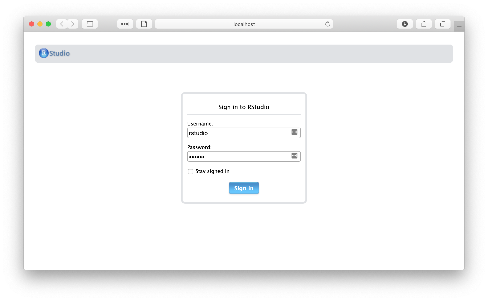
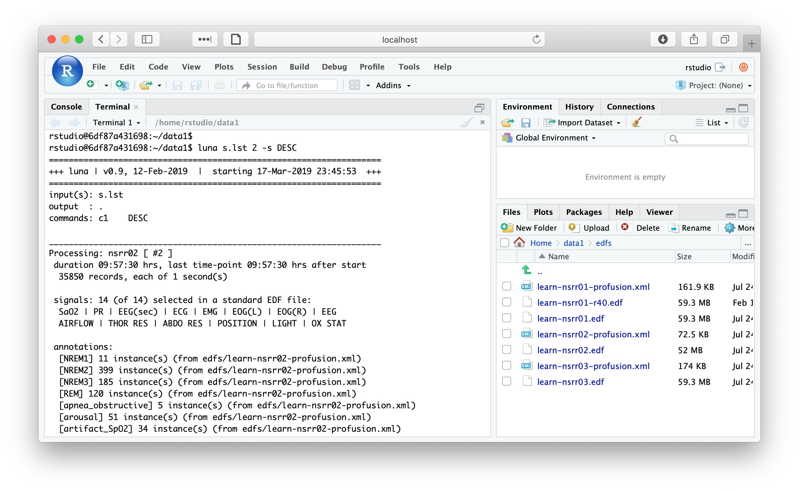
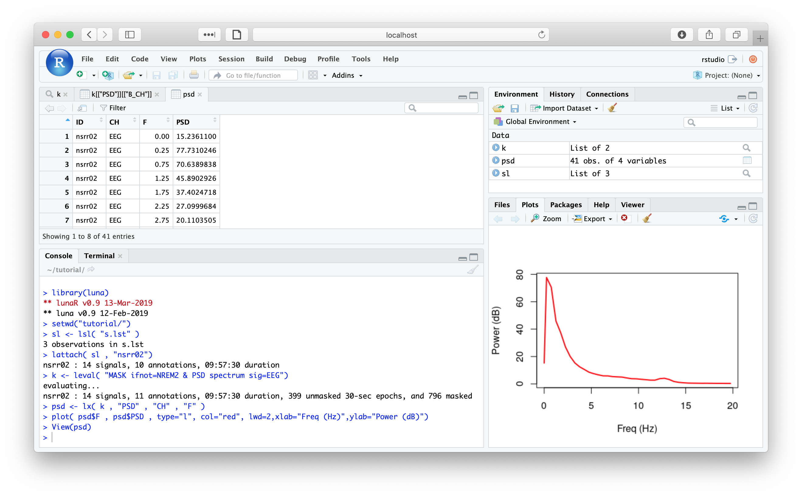

# Docker

The [Docker](https://www.docker.com/) distribution of Luna is designed
to allow users to test both the [_lunaC_](../luna/args.md) and [_lunaR_](../ext/R/index.md), that is, the
C/C++ command-line and the R package versions of Luna.  Although
beyond the scope of this documentation, Docker containers can also
facilitate using Luna in a cloud computing environment, such as [Amazon
Web Services EC2](https://aws.amazon.com/ec2/).

!!! hint "What is Docker?"  
    Docker is a popular tool, increasingly used in cloud-computing, 
    that is used to deploy and run applications on diverse host platforms (i.e. including your computer).
    These [Getting Started](https://docs.docker.com/get-started/) pages will help to
    orient you, although most users of Luna need not read past the
    first page.  From the perspective of a _user_ of Luna, all you'll
    need to do is download the free Desktop version of Docker CE
    (Community Edition) and then use one or two commands to launch the
    _containerized_ version of Luna (which includes a full Linux
    environment comprising [_lunaC_](../luna/args.md),
    [_lunaR_](../ext/R/index.md), the [tutorial data](../tut/tut1.md) as
    well as [R](https://www.r-project.org/) or
    [RStudio](https://www.rstudio.com/).  For those interested in
    learning more about Docker, [this
    tutorial](https://docker-curriculum.com) is a good place to start.


## Getting Docker

[Docker](https://www.docker.com/) provides a quick way to run Luna on
any system capable of installing Docker.  Docker containers are
similar in principle to virtual machines that can run on any platform
Docker is installed on.  

Desktop versions of Docker can also be installed (for free) on both
[Mac](https://hub.docker.com/editions/community/docker-ce-desktop-mac)
and
[Windows](https://hub.docker.com/editions/community/docker-ce-desktop-windows) by following 
either one of those links.  Note that the latter requires Windows 10 Professional or Enterprise
64-bit. Follow the extensive documentation on the Docker website to
get up-and-running with Docker.

Docker is available for most Linux machines: for example, here
using `apt-get` on an Amazon Linux EC2 instance:

```
sudo apt-get install docker
```

!!! hint
    Versions of Docker for older Windows or Mac machines are also
    [available](https://docs.docker.com/toolbox/overview/), although we have not 
    tried these and cannot give advice.


## Pulling luna 

Once you have Docker running on your system (the start up can take a
minute or two after installation), the following command (typed in a
terminal/command prompt) will download an _image_ (from [Docker
Hub](https://hub.docker.com)) and create a containerized version of
Luna:

```
docker run --rm -it remnrem/luna /bin/bash
``` 

The `remnrem/luna` Docker image contains luna pre-installed within a
Linux environment.  It also includes R with [lunaR](../ext/R/index.md)
pre-installed: both base R and [RStudio](http://www.rstudio.com), as
described [below](#luna-and-rstudio).

You should see something like the following:

```
Unable to find image 'remnrem/luna:latest' locally
latest: Pulling from remnrem/luna
6cf436f81810: Pull complete 
987088a85b96: Pull complete 
b4624b3efe06: Pull complete 
d42beb8ded59: Pull complete 
166613f8d770: Pull complete 
d22664acc861: Pull complete 
dc715f416e3a: Pull complete 
4cb433a57b07: Pull complete 
02ec624d4949: Pull complete 
Digest: sha256:95da9c1a6e2cc7d88123c3bc53776768605fc4e94ae6d058e078b437eb2efd1b
Status: Downloaded newer image for remnrem/luna:latest
root@82bcf5c52204:/data# 
```

The last line of the output above is in fact a prompt running
_inside_ a newly created _container_.  (In Docker terminology, a
_container_ is a particular instantiation of an _image_.)  This container provides a
Linux command line (based on Ubuntu Linux), which has Luna pre-installed.   That is, if 
you type `luna` at the command line, you should see:

```
root@82bcf5c52204:/data# luna
===================================================================
+++ luna | v0.9, 12-Feb-2019  |  starting 11-Mar-2019 19:46:07  +++
===================================================================
usage: luna [sample-list|EDF] [n1] [n2] [@parameter-file] [sig=s1,s2] [v1=val1] < command-file
```

This Luna image also has the [tutorial datasets](../tut/tut1.md) under
the `/tutorial/` folder:

```
root@82bcf5c52204:/data# ls /tutorial/
edfs  s.lst
```

The `s.lst` file is the [sample-list](../luna/args.md#sample-lists)
that describes a project consisting of the three tutorial individuals:


```
root@82bcf5c52204:/data# cat  /tutorial/s.lst 
nsrr01	edfs/learn-nsrr01.edf	edfs/learn-nsrr01-profusion.xml
nsrr02	edfs/learn-nsrr02.edf	edfs/learn-nsrr02-profusion.xml
nsrr03	edfs/learn-nsrr03.edf	edfs/learn-nsrr03-profusion.xml
```

You can run Luna and perform the tutorial actions within this environment:  (note: as the 
`s.lst` file uses [relative paths](../luna/args.md#search-paths) you need to add the `path` 
on the command line):

```
root@82bcf5c52204:/data# luna /tutorial/s.lst 1 path=/tutorial -s DESC
```

```
===================================================================
+++ luna | v0.9, 12-Feb-2019  |  starting 11-Mar-2019 20:00:14  +++
===================================================================
input(s): /tutorial/s.lst
output  : .
commands: c1	DESC	
path    : /tutorial/

___________________________________________________________________
Processing: nsrr01 [ #1 ]
 total duration 11:22:00, with last time-point at 11:22:00
  40920 records, each of 1 second(s)

 signals: 14 (of 14) selected in a standard EDF file:
  SaO2 | PR | EEG(sec) | ECG | EMG | EOG(L) | EOG(R) | EEG
  AIRFLOW | THOR RES | ABDO RES | POSITION | LIGHT | OX STAT

 annotations:
  [NREM1] 109 instance(s) (from /tutorial/edfs/learn-nsrr01-profusion.xml)
  [NREM2] 523 instance(s) (from /tutorial/edfs/learn-nsrr01-profusion.xml)
  [NREM3] 16 instance(s) (from /tutorial/edfs/learn-nsrr01-profusion.xml)
  [NREM4] 1 instance(s) (from /tutorial/edfs/learn-nsrr01-profusion.xml)
  [REM] 238 instance(s) (from /tutorial/edfs/learn-nsrr01-profusion.xml)
  [apnea_obstructive] 37 instance(s) (from /tutorial/edfs/learn-nsrr01-profusion.xml)
  [arousal] 194 instance(s) (from /tutorial/edfs/learn-nsrr01-profusion.xml)
  [artifact_SpO2] 59 instance(s) (from /tutorial/edfs/learn-nsrr01-profusion.xml)
  [desat] 254 instance(s) (from /tutorial/edfs/learn-nsrr01-profusion.xml)
  [hypopnea] 361 instance(s) (from /tutorial/edfs/learn-nsrr01-profusion.xml)
  [wake] 477 instance(s) (from /tutorial/edfs/learn-nsrr01-profusion.xml)
 ..................................................................
 CMD #1: DESC
EDF filename      : /tutorial/edfs/learn-nsrr01.edf
ID                : nsrr01
Duration          : 11:22:00
# signals         : 14
Signals           : SaO2 PR EEG(sec) ECG EMG EOG(L) EOG(R) EEG AIRFLOW THOR RES ABDO RES POSITION LIGHT OX STAT


___________________________________________________________________
...processed 1 EDFs, done.
...processed 1 command set(s),  all of which passed
-------------------------------------------------------------------
+++ luna | finishing 11-Mar-2019 20:00:14                       +++
===================================================================
```


This container also provides the R package with the _lunaR_ library pre-installed.  To start R:

```
root@82bcf5c52204:/data# R
```

To attach the _lunaR_ library:

```
> library(luna)
** lunaR v0.2 1-Mar-2019
** luna v0.9 12-Feb-2019
```

To attach the tutorial project: 

```
> sl <- lsl( "/tutorial/s.lst" , path = "/tutorial/" ) 
3 observations in /tutorial/s.lst 
```

To attach, for example, the second individual `nsrr02`:
```
> lattach( sl , 2 )
nsrr02 : 14 signals, 10 annotations, 09:57:30 duration
```

## Container contents

- _mount points:_ `/data/`, `/data1/` and `/data2/` allow different
  folders on the host machine to be mapped to these folders within the
  container

- _text editors:_ `emacs` (powerful but complicated to use if you
  are not familiar with it) and `nano` (simple) are pre-installed

- _build directory:_ `/build/`, this folder container the source code used to build
   _lunaC_ and _lunaR_, and can be ignored by most users


## Luna and RStudio

As well as the basic container `remnrem/luna`, we also have generated
an image that bundles RStudio with a pre-installed version of _lunaC_
and _lunaR_.  To obtain this:

```
docker run  -e PASSWORD=abc123 -p 8787:8787 remnrem/luna
```

If this command is successful, then after it downloads and installs, you will be able 
to go to you web browser and visit the URL: `localhost:8787`

{width="100%"}

Log in with username name `rstudio` and the password you specified above (i.e. `abc123`).   You will 
then have an interactive environment, for which both the command prompt (for _lunaC_) and R (for _lunaR_) 
are available, along with the tutorial data.  For example, we can run _lunaC_ in the terminal:

{width="100%"}

Likewise, we can use _lunaR_ to query the tutorial data:

{width="100%"}

The commands for mapping local folders to the Docker container
(i.e. so that your own data are visible whilst in the container, and
so that your output will be saved back on the host machine) are the
same as for the standard Luna image.

## _luna.docker_ 

For Linux and Mac OS machines with the
[bash](https://en.wikipedia.org/wiki/Bash_(Unix_shell)) shell
installed, we provide a convenience wrapper script to help starting
new Luna containers (i.e. instead of running `docker run` etc).  See
Docker [documentation](https://docs.docker.com/get-started/) for full
details on using Docker.

Download the script `luna.docker` from
[here](https://raw.githubusercontent.com/remnrem/luna-docker/master/luna.docker), save it in
your path (e.g. see `echo $PATH`) and set permissions to be executable, e.g.:
```
chmod +x /usr/local/bin/luna.docker
```

Note that, depending where you place it and your operating system, you
may need to prefix this (and subsequent) docker command with `sudo`.

Typing `luna.docker` will then show the usage of this script:
```
new instance               : luna.docker /path/data/ /path/data1/ /path/data2/
new RStudio instance       : luna.docker -rs password /path/data/ /path/data1/ /path/data2/
list instances             : luna.docker -l
attach to running instance : luna.docker -a {container-ID}
delete instance            : luna.docker -d [container-ID|all]
pull latest luna image     : luna.docker --pull
```

To start a new instance, specify between one and three paths, that
will be mounted to `/data/`, `/data1/` and `/data2/` respectively (or,
with RStudio, in `/home/rstudio/data/`, etc).


!!! hint 
    Although the paths should generally be full/absolute paths
    (i.e. starting `/`), for the first argument only, the period (`.`)
    can be used to mount `/data/` to the current working directory.

For example, if on the host system we are in the folder `test`:
```
$ pwd
/Users/joe/test
```
which contains three files:
```
$ ls
a.txt  b.txt  c.txt
```
then running:
```
luna.docker .
```
will give a message:
```
mounting /Users/joe/test to /data/
```
The container starts in the `/data/` folder;  therefore, running `ls` will show the contents of `/Users/joe/test/` but from _inside_ the container:
```
root@ab8e676352ec:/data# pwd
/data
```

```
root@ab8e676352ec:/data# ls
a.txt  b.txt  c.txt
```

Any new files you create in `/data/` from within the container will
also be visible in `/Users/joe/test/` after leaving the container
(with Control-D) or typing `exit`. For example, from within the container
```
root@ab8e676352ec:/data# echo "Hello World!" > d.txt
```
Then, after we exit the container and return to the host system's prompt, we will now see the new file:
```
$ ls
a.txt	    b.txt  c.txt	d.txt
```
```
cat d.txt
```
```
Hello World!
```

In this way, you can map inputs (i.e. EDFs and annotation files) to
outputs (e.g. destrat databases or extracted plain-text files) between
your host system and the container.  Being able to specify multiple
mounted volumes (on `/data/`, `/data1/` and `/data2/`) is convenient
if you have different EDFs in different locations, or if you want
output to be written to a different folder than contains the input
EDFs, etc.


### Other options

You can initiate multiple containers at the same time.  Under standard
conditions, different containers are completely isolated: i.e. new
files generated in one container will not be present in other
containers, etc.

Running with the `-l` flag will list the currently active containers:

```
luna.docker -l
```
```
CONTAINER ID  IMAGE         COMMAND      CREATED         NAMES
e07c4e1adca2  remnrem/luna  "/bin/bash"  3 seconds ago   serene_bartik
```

To attach a new shell on an _existing_ running container, use the `-a`
option, along with the container `ID` or `NAME`.  In the above case,
the `ID` is `e07c4e1adca2` and the `NAME` is `serene_bartik` (Docker
automatically generates cute names.) For example, this will open a new
terminal command prompt for the running container:
 
```
luna.docker -a serene_bartik
```

This can be useful if you have a long-running process in one container
and want to check its output, or if you want to have a text-editor
open in one window and cut-and-paste to run those commands in another
window, for example.   

To delete an active container, use the `-d` flag, followed by either
the `ID` or `NAME` of that container. For example:

```
luna.docker -d e07c4e1adca2
```
```
removing e07c4e1adca2...
e07c4e1adca2
```
Re-running with the `-l` option now shows that there are no running containers:
```
luna.docker -l
```

```
CONTAINER ID  IMAGE         COMMAND      CREATED         NAMES
```

As noted, this doesn't even begin to scratch the surface of using
Docker containers, a full treatment of which is well beyond the scope
of this documentation.  For example, you are able to control the
memory and CPU cores available for each Docker container (simply via
the `Preferences...` menu of the Desktop versions of Docker).  This
will likely be important if running larger analysis jobs with Luna.

We provide a containerized version of Luna as an experimental feature,
but have not yet used it extensively ourselves: please let us know if you
encounter limitations or if you think there are better ways to set
things up...

## Windows machines

It is possible to run Docker on recent Windows machines, although you
may need to consult the Docker website for exact information.  As the
`luna.docker` script above will not work for Windows/DOS, you'll need
to type the exact Docker commands, including mapping any volumes or
ports between the host and the container, as detailed below.

__LunaR__

At the Command Prompt, to open a new container and map the `D:\luna`
folder on the host to `/data/` in the container, and `C:\mydata\work` to `/data1` type:

```
docker run --rm -it -v D:/luna:/data -v C:/mydata/work:/data1 remnrem/luna /bin/bash
```

By default, the container has folders `/data`, `/data1` and `/data2`
to allow three volumes to be mounted, i.e.  folders on the host machine
to be shared with the Luna container.

__LunaRStudio__ 

At the Command Prompt, to open a new container and map the `D:\luna`
folder on the host to `/data/` in the container, type:

```
docker run --rm -e PASSWORD=abc123 -p 8787:8787 -v D:/luna:/data remnrem/luna 
```

and then open your web-browser at `http://localhost:8787` and enter
username `rstudio` and password `abc123`.


__Listing/killing/attaching to containers__

To list all containers:
```
docker ps
```

To clean up everything:
```
docker system prune
```

To kill a particular container, e.g. with name `kind_herschel`
```
docker container rm -f kind_herschel
```

To open another terminal/connection to an existing container, e.g. called `kind_herschel`

```
docker exec -i -t kind_herschel bash -l
```


__Hints__

- Docker takes a while (minutes) to start running, so be sure that it
  is running before you try to launch Luna

- anecdotally, on Windows I've had issues getting any Docker command
  to run that were solved by simply restarting Docker (i.e. look to
  the Docker small icon in your task bar)

- if you have problems, try Docker's
  [hello-world](https://docs.docker.com/get-started/) example/tutorial

- expect to run into issues if your institution/machine has particular
  firewalls or other types of network security features, of if you are
  trying to to mount folders on access-protected shared volumes, etc.
  These types of issues are completely beyond the scope of Luna and
  this documentation, and things you'll need to work with your IT team
  to fix

- the whole point of Luna Docker is that it is _meant_ to provide a
  quick, out-of-the-box way to run/test Luna.  If you are having trouble
  trying using a binary version, or a different operating system.

- in general, you'll likely have a better Luna experience if you use a
  Unix-like operating system, i.e. macOS or Linux.  Of course, use
  whatever works best for you, but if you're working with large
  amounts of data there are numerous reasons to consider alternatives
  to Windows that may work better...


## Reference: Dockerfile

This [github repository](https://github.com/remnrem/luna-docker)
contains the latest version of the `Dockerfile`, and the corresponding
`luna.docker` wrapper.  Pre-built images are sent to the
``remnrem/luna` [Docker Hub page](https://hub.docker.com/u/remnrem)
for distribution.
