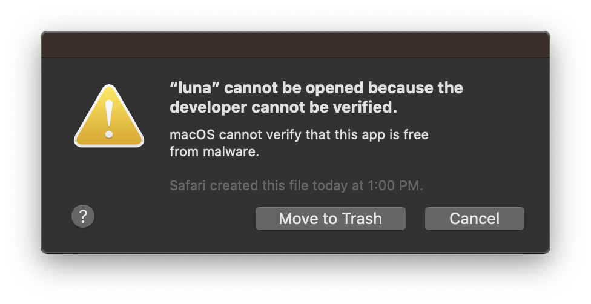
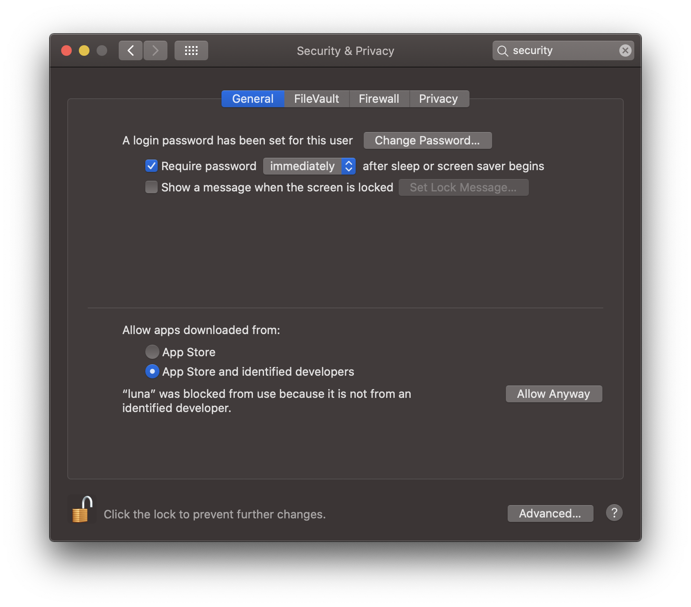

# Executables

This page describes how to obtain precompiled executable files
(command-line `luna` and the `destrat` utility) for macOS, Windows and
Linux.

Please first read the [overview](index.md) describing installation options
to find the best option for your platform.

As decribed below, the latest stable binary release is available from
this URL: <https://github.com/remnrem/luna-base/releases>.

## Preliminaries

Prior to installing Luna binary executables, we strongly recommend
that you figure out how to do the following:

- figure out to how use your machine's __command prompt__: for macOS, this is the 
 [Terminal](https://www.wikihow.com/Get-to-the-Command-Line-on-a-Mac); for Windows, this is 
 the [Command Prompt](https://www.wikihow.com/Open-the-Command-Prompt-in-Windows).  The tutorials and 
 examples assume you are running a [bash](https://en.wikipedia.org/wiki/Bash_(Unix_shell)) shell.

- get a __text editor__: ensure you have a text editor that works with
  plain-text files (i.e. __not__ a word processor), either old-school
  (e.g. `emacs`, `nano`, both of which are in the standard luna Docker container)
  or new-school (e.g. [Atom](https://atom.io/), which is free, or
  [Sublime Text](https://www.sublimetext.com/), which is not)

- get __R__ : the [R project for statistical
  computing](https://www.r-project.org/) is obviously necessary to use
  _lunaR_ -- but even if you don't plan to use _lunaR_, it will help when
  working with Luna output.


## _lunaC_

1. Visit <https://github.com/remnrem/luna-base/releases> and select the folder appropriate platform: macOS, Windows or Linux (Ubuntu x86_64)

2. Go the the command line on your machine, i.e. [Terminal] for macOS.

3. Fourth unzip/untar the archive, which will extract three files
(`luna`, `destrat` and `behead`) into the _current directory_.  (For
the Windows download, there will be an additional file,
`libfftw3-3.dll.)`

4. Test if it works by typing `luna` or `./luna`.  You should see something like:
```
usage: luna [sample-list|EDF] [n1] [n2] [@parameter-file] [sig=s1,s2] [v1=val1] < command-file
```
To get the version numnber:
```
luna -v
```
```
luna-base version v0.24.1 (release date 28-Aug-2020)
luna-base build date/time Aug 28 2020 09:58:53
```

5. To enable you to run luna from any folder, place all three
(or four) files in a folder that is in your command path
(e.g. `/usr/local/bin/` or `'C:\Program Files\` for Windows.  Alternatively, add 
the folder containing these files to your _Path_ environment variable. 

6. Mac users may get a security message about running executables downloaded from the web.
See [below](#macos-installation-notes) to fix this.

<!---

## _lunaR_

__For Mac users only__, there will be a second file named `luna_0.2.tgz`.
This is a binary version of [_lunaR_](../ext/R.md) package.  After
downloading, type this on the Terminal command line:

```
R CMD INSTALL luna_0.2.tgz
```

This should install the `luna` library for R, which can be started
with the following command (from the R prompt):

```
library(luna)
```

See [_lunaR_](../ext/R.md) for more details.

--->


## macOS installation notes

When first running Luna, you may encounter the following:



This is a standard message, and does not mean that Luna (or the other executables) pose any risk.  To fix, go
to System Settings / Security & Privacy tab and click the _Open Anyway_ button, and then click on the lock (bottom left) to make the changes:



You'll then see a further dialog box pop up, where you should click "Open".  This will allow luna to run on the command line.   
Do likewise for destrat (and behead).  You only need to do this once per new installation.
Alternatively, you could always [compile from source](source.md), or use [Docker](docker.md) instead.

