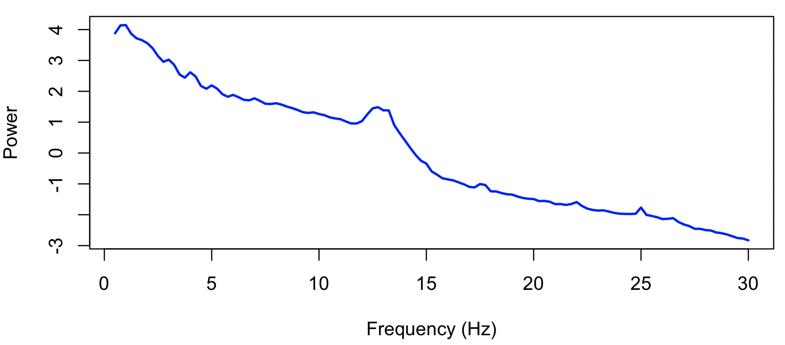

# lunaR : example usage

Here, we will briefly step through some of the same steps of the
[tutorial](../../tut/tut3.md#spectral-and-spindle-analyses) using _lunaR_
instead of `luna`.  See also [this tutorial page](../../tut/tut4.md) for a
fuller application of _lunaR_ to the tutorial data.

We assume that you are running R and the current working directory is
the one where `tutorial.zip` was unzipped.

```
library(luna)
```

Attach the sample-list with [`lsl()`](#lsl):
```
sl <- lsl("s.lst")
```
```
3 observations in s.lst 
```

Attach just the second individual, `nsrr02`, with [`lattach()`](#lattach):
```
lattach( sl , "nsrr02" ) 
```
```
nsrr02 : 14 signals, 10 annotations, 09:57:30 duration
```

We will then use sequential [`leval()`](#leval) commands, to restrict
analysis to N2 epochs only, band-pass filter the EEG signal,
automatically scan for epochs with high levels of artifact, and then
estimate the PSD.  First, we mask out all epochs that are not N2 sleep:

```
leval( "MASK ifnot=N2" )
```
```
nsrr02 : 14 signals, 10 annotations, 09:57:30 duration, 399 unmasked 30-sec epochs, and 796 masked
```
Next, we [restructure](../../ref/masks.md#restructure) the dataset, to actually remove the non-N2 epochs:
```
leval( "RE" )
```
```
nsrr02 : 14 signals, 10 annotations, 03:19:30 duration, 399 unmasked 30-sec epochs, and 0 masked
```
Next, we restrict analyses to the EEG channel, by dropping all other channels:
```
leval( "SIGNALS keep=EEG" )
```
```
nsrr02 : 1 signals, 10 annotations, 03:19:30 duration, 399 unmasked 30-sec epochs, and 0 masked
```
Next, we apply a 0.3-35 Hz bandpass filter:
```
leval( "FILTER bandpass=0.3,35 ripple=0.02 tw=0.5" )
```

Next, we scan for artifacts.  Note, for the prior [`leval()`](#leval) commands,
we have not been explicitly saving any returned values, as the prior
commands typically do not return values of interest.  Here we will
save return values (in a list named `k0`) for future use, however:

```
k0 <- leval( "ARTIFACTS mask & CHEP-MASK ep-th=3,3,3 & CHEP epochs" ) 
```
```
nsrr02 : 1 signals, 10 annotations, 03:19:30 duration, 368 unmasked 30-sec epochs, and 31 masked
```

We see that 31 epochs have been masked (out of 399).  You can examine
the returned `k0` list (with [`lx()`](#lx) or just directly), to see
the other output of these commands.  We next restructure the dataset one
more time to remove these masked epochs:
 
```
leval( "RE" )
```
```
nsrr02 : 1 signals, 10 annotations, 03:04:00 duration, 368 unmasked 30-sec epochs, and 0 masked
```
Finally, we run the [`PSD`](../../ref/power-spectra.md#psd) command, with the `spectrum` option:

```
k <- leval( "PSD spectrum max=30" ) 
```
The returned list has three distinct strata, or data-frames:
```
lx(k)
```
```
PSD : CH B_CH CH_F 
```

Of primary interest, is spectral power (`PSD` variable) stratified by
frequency (`F`) and channel (`CH`, although note that in this
particular analysis we only have a single channel, `EEG`):

```
k$PSD$CH_F
```
```
        ID  CH     F         PSD
1   nsrr02 EEG  0.50 48.48646744
2   nsrr02 EEG  0.75 62.55672251
3   nsrr02 EEG  1.00 63.13289104
4   nsrr02 EEG  1.25 47.72029434
5   nsrr02 EEG  1.50 41.14412948
6   nsrr02 EEG  1.75 38.76472567
7   nsrr02 EEG  2.00 35.13171657
8   nsrr02 EEG  2.25 29.76887124
9   nsrr02 EEG  2.50 23.13801428
10  nsrr02 EEG  2.75 19.24464783
11  nsrr02 EEG  3.00 20.59488426
12  nsrr02 EEG  3.25 17.46907997
13  nsrr02 EEG  3.50 12.77704547
14  nsrr02 EEG  3.75 11.49771701
15  nsrr02 EEG  4.00 13.68299939
16  nsrr02 EEG  4.25 11.95281293
17  nsrr02 EEG  4.50  8.79124308
18  nsrr02 EEG  4.75  8.02781760
19  nsrr02 EEG  5.00  8.94853303
20  nsrr02 EEG  5.25  8.07366985
21  nsrr02 EEG  5.50  6.72716982
22  nsrr02 EEG  5.75  6.19444000
23  nsrr02 EEG  6.00  6.56810384
24  nsrr02 EEG  6.25  6.10237343
25  nsrr02 EEG  6.50  5.60697017
...
```
Plotting this:
```
d <- k$PSD$CH_F
plot( d$F , log(d$PSD) , xlab = "Frequency (Hz)" , ylab = "Power" , col="blue" , lwd=2 , type="l" )
```




That completes our simple introduction to using _lunaR_.  As noted
above, see the final [tutorial page](../../tut/tut4.md) for a fuller set
of examples of using _lunaR_.  The [next page](ref.md) contains
reference documentation for each _lunaR_ function.


