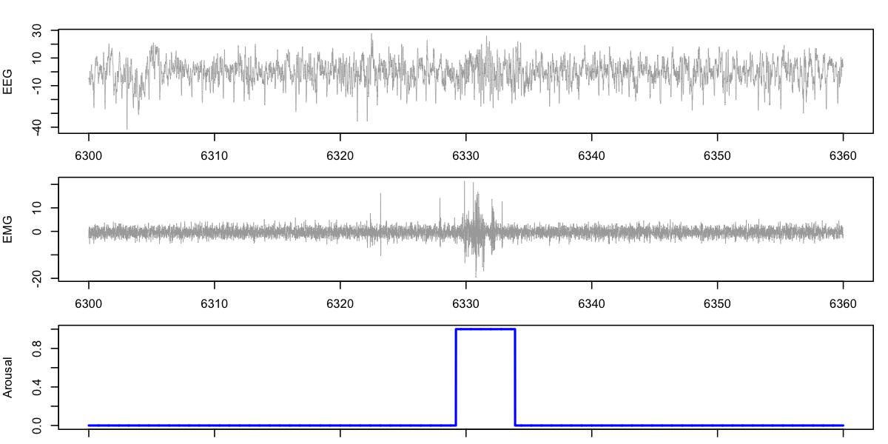

# lunaR command reference

## Attaching EDFs

### `lsl()`

_Imports a Luna [_sample-list_](../../luna/args.md#sample-lists) into R_

__Syntax:__ `sl <- lsl( file , path = "" )`

- `file` is a required argument, giving the name of the sample-list file 

- the optional `path` argument mirrors Luna's [`path` command-line option](../../luna/args.md#search-paths)
```
> sl <- lsl("s.lst")
3 observations in s.lst 
```

__Returns:__ a named-list representing the sample-list 

 - `names(sl)` gives a list of IDs (i.e. first column) in the sample list:
```

> names(sl)
[1] "nsrr01" "nsrr02" "nsrr03"
```

 - `EDF` and `ANNOT` elements are the EDF and annotation filename(s) (sample lists can contain 0 or multiple annotation files):
```
> str(sl)
List of 3
 $ nsrr01:List of 2
  ..$ EDF  : chr "edfs/learn-nsrr01.edf"
  ..$ ANNOT: chr "edfs/learn-nsrr01-profusion.xml"
 $ nsrr02:List of 2
  ..$ EDF  : chr "edfs/learn-nsrr02.edf"
  ..$ ANNOT: chr "edfs/learn-nsrr02-profusion.xml"
 $ nsrr03:List of 2
  ..$ EDF  : chr "edfs/learn-nsrr03.edf"
  ..$ ANNOT: chr "edfs/learn-nsrr03-profusion.xml"
```

____


### `lattach()`

_Loads an EDF and any associated annotation files from a
[_sample-list_](../../luna/args.md#sample-lists) loaded by
[`lsl()`](#lsl)._

__Syntax:__ `lattach( sl , idx )` 

- `sl` is a sample-list as loaded by [`lsl()`](#lsl)

- `idx` is _either_ an integer number (in which case, it means to
  attach the EDF/annotations specified on that row of the
  sample-list), _or_ a string value (in which case, it is interpreted as
  the ID of the individual/EDF to be attached)

__Returns:__ no explicit return value: this command sets the _in-memory_ EDF representation to reflect this EDF header/file, by calling [`ledf()`](#ledf)

- as well as attaching that EDF, this calls `lstat()` to display some
  basic information about it; for example, to attach the second
  individual in the sample-list, one could use either:
```
> lattach( sl , 2 ) 
nsrr02 : 14 signals, 10 annotations, of 09:57:30 duration
```
or:
```
> lattach( sl , "nsrr02" ) 
nsrr02 : 14 signals, 10 annotations, of 09:57:30 duration
```

- if the index or ID is out-of-range/not found, this command will give an error


!!! note 
    Unlike many R functions, `lattach()` does not return an
    object that represents the data (i.e. the EDF).  Rather, _lunaR_
    is designed to operate on one EDF at a time; attached EDFs can be
    displayed with the `lstat()` function.  Attaching a new EDF
    effectively detaches any previously attached EDF.

____


### `ledf()`

_Directly attaches an EDF_

__Syntax:__ `ledf( edffile , id = "." , annots = character(0) )`

- `edffile` is a required filename for the to-be-attached EDF

- `id` is an optional ID that will be associated with this EDF 

- `annots` is an optional vector of one or more annotation filenames (`.xml`, `.ftr`, `.annot` or `.eannot` files, as described [here](../../ref/annotations.md))

__Returns:__ Similar to `lattach()`, which is just a wrapper around the `ledf()` function

For example, here we use `ledf()` to directly achieve what we did with `lattach()` above:
```
> ledf("edfs/learn-nsrr02.edf" , "nsrr02" , "edfs/learn-nsrr02-profusion.xml" ) 
nsrr02 : 14 signals, 10 annotations, of 09:57:30 duration
```


____

### `lstat()`    

_One line description to console of the currently-attached EDF_

__Syntax:__ `lstat()` 

__Returns:__ no explicit return values, other than output to console

This command is automatically called after each `leval()` or
`lattach()` command.


____

### `ldrop()`    

_Detaches the current EDF_

__Syntax:__ `ldrop()` 

__Returns:__ no explicit return value


____


### `lrefresh()`

_Reattaches the currently attached EDF_

__Syntax:__ `lrefresh()` 

__Returns:__ no explicit return value

When `lrefresh()`-ing an attached EDF, any previous _in-memory_
modifications (i.e. from masking, filtering, or other manipulations)
are effectively reset.


## Extracting data


### `lchs()`

_Returns the EDF channel names_

__Syntax:__ `lchs()` 

__Returns:__ a vector of channel names for the attached EDF:

```
> lchs()
 [1] "SaO2"     "PR"       "EEG(sec)" "ECG"      "EMG"      "EOG(L)"  
 [7] "EOG(R)"   "EEG"      "AIRFLOW"  "THOR RES" "ABDO RES" "POSITION"
[13] "LIGHT"    "OX STAT" 
```

----


### `ldata()`

_Returns a data frame of signals and annotations for requested epochs_

__Syntax:__ `ldata( e , chs , annots = character(0) )` 

- `e` is a required vector of 1-based epoch numbers corresponding to the _current epoch numbering_ of the attached EDF
 
- `chs` is a required vector of channel names to be returned, i.e. as from `lchs()`, _all of which are required to have the same sampling rate_

- `annots` is an optional vector of annotation names to be returned, i.e. as from `lannots()`

__Returns:__ a data frame where each row is one sample point, containing the raw signal (and annotation) data and the following columns:

- epoch number `E` 
- elapsed time since the start of the current first epoch `SEC`
- any signals, in alphabetical order, where column/variable names are the channel labels, potentially [_sanitized_](#lsanitize) 
if need be to remove special characters with an underscore (e.g. here `EEG(sec)` becomes `EEG_sec_`): 
- any annotations, where `1` and `0` indicate the presence/absence of that annotation at that time-point

For example, here we request EEG and EMG channels for epochs 211 and
212, along with the `arousal` annotation from the tutorial dataset for
`nsrr02`:

```
d <- ldata( 211:212 , chs = c("EEG", "EMG") , annots = "arousal" )   
```

```
> head(d)
    E      SEC       EEG        EMG arousal
1 211 6300.000 -4.411765 -2.8411765       0
2 211 6300.008 -5.392157  0.8647059       0
3 211 6300.016 -4.411765 -1.6058824       0
4 211 6300.024 -4.411765 -2.8411765       0
5 211 6300.032 -6.372549  1.3588235       0
6 211 6300.040 -6.372549 -0.1235294       0
```
Plotting the the two signals and annotation:
```
par(mfcol=c(3,1),mar=c(1,4,2,1))
plot( d$SEC , d$EEG , type="l" , lwd=0.5 , col="darkgray",ylab="EEG") 
plot( d$SEC , d$EMG , type="l" , lwd=0.5 , col="darkgray",ylab="EMG") 
plot( d$SEC , d$arousal , type="l" , col="blue" , lwd=2,ylab="Arousal") 
```
{width="100%"}


!!! warning
    The following command 
    would request __all__ the data in an EDF (assuming that all channels have similar sampling rates) and all 
    associated annotation information:
    ```
    ne <- lepoch()
    d <- ldata( 1:ne , lchs() , lannots() )
    ```
    That is, for long EDFs, with a large number of channels and/or high
    sampling rates, the size of the data frame returned by `ldata()`
    may be large (i.e. _too_ large), if many epochs, channels and/or annotations are requested... 


If different channels have different sampling rates, use the [`RESAMPLE`](../../ref/manipulations.md#resample) command to 
resample one or more channels first.  For example, if the EEG, ECG and EMG have different sampling rates, then this: 
```
d <- ldata( 211:212 , c("EEG" , "ECG" , "EMG" ) , "arousal" )
```
will yield an error:__
```
Error in ldata(211:212, c("EEG", "ECG", "EMG"), "arousal") :
   requires uniform sampling rate across signals
```
__

We can first confirm the different sampling rates, by running
(_"evaluating"_) the Luna [`HEADERS`](../../ref/summaries.md#headers)
command with [`leval()`](#leval):

```    
k <- leval( "HEADERS" )
```
and looking at the per-channel output with [`lx()`](#lx):
``` 
lx( k , "HEADERS" , "CH" ) 
```      	
The `SR` column shows sampling rates of 250, 125 and 125 Hz for ECG, EEG and EMG respectively:
```
         CH  DMAX   DMIN PDIM   PMAX    PMIN  SR
1  ABDO RES   127   -128       -1.00    1.00  10
2   AIRFLOW   127   -128       -1.00    1.00  10
3       ECG   127   -128   mV   1.25   -1.25 250 
4       EEG   127   -128   uV 125.00 -125.00 125
5  EEG(sec)   127   -128   uV 125.00 -125.00 125
6       EMG   127   -128   uV  31.50  -31.50 125
7    EOG(L)   127   -128   uV 125.00 -125.00  50
8    EOG(R)   127   -128   uV 125.00 -125.00  50
9     LIGHT     1      0        1.00    0.00   1
10  OX STAT     3      0        3.00    0.00   1
11 POSITION     3      0        3.00    0.00   1
12       PR 32767 -32768  BPM 200.00    0.00   1
13     SaO2 32767 -32768    % 100.00    0.00   1
14 THOR RES   127   -128       -1.00    1.00  10
```
We can then downsample the ECG:
```
leval("RESAMPLE sig=ECG sr=125")
```  		   
Now the [`ldata()`](#ldata) function will work:    			   
```    
d <- ldata( 211:212 , c("EEG" , "ECG" , "EMG" ) , "arousal" )
```
```
> head(d)
    E      SEC       EEG        ECG        EMG arousal
1 211 6300.000 -4.411765 0.05936309 -2.8411765       0
2 211 6300.008 -5.392157 0.06401207  0.8647059       0
3 211 6300.016 -4.411765 0.06290266 -1.6058824       0
4 211 6300.024 -4.411765 0.05973290 -2.8411765       0
5 211 6300.032 -6.372549 0.06279700  1.3588235       0
6 211 6300.040 -6.372549 0.06448754 -0.1235294       0
```


____

### `ldata.intervals()`    

_Returns raw signal and annotation data for requested intervals_

__Syntax:__ `ldata.intervals( i , chs , annots = character(0) , w = 0 )` 

- `i` is a required list of _intervals_ (in seconds), e.g. as returned by [`lannots(annot)`](#lannots)

- `chs` is a required vector of channel names to be returned, i.e. as
from lchs(), all of which are required to have the same sampling rate
is a required vector of channel names

- `annots` is an optional vector of annotation names to be returned,
  i.e. as from [`lannots()`](#lannots)

- `w` is an optional _window_ (in seconds) the specifies whether the
returned region should also contain a window of up to `w` seconds each
side of the specified interval(s).  For example, if the intervals
represented individual sleep spindles, then adding `w=10` would return
windows of approximately 20 seconds, with the spindle centered in the
middle.

__Returns:__ a data frame where each row is one sample point,
containing the raw signal (and annotation) data.  See the description
of [`ldata`](#ldata)'s output for more information.  columns

This command is effectively the same as [`ldata()`](#ldata) except
that the regions of interest are specified as _intervals_ rather than
in terms of epoch numbers.  Intervals are defined as half-open
intervals [_a_,_b_), meaning all sample-points equal to or greater
than _a_, but less than _b_.


## Annotations


### `lannots()`

_Returns a vector of annotation class names, _or_ all intervals for a given annotation class_

__Syntax:__ `lannots( a = "" )` 

- `a` is an optional annotation name, i.e. matching one value returned by `lannots()`

__Returns:__ if no specific annotation is specified, this returns a
vector of annotation class names for the attached dataset:

```
> lannots()
 [1] "NREM1"             "NREM2"             "NREM3"            
 [4] "REM"               "apnea_obstructive" "arousal"          
 [7] "artifact_SpO2"     "desat"             "hypopnea"         
[10] "wake"             
```

Alternatively, if `a` is a valid annotation class name for that individual, this function instead returns a list of intervals (two-element vectors) 
for each _instance_ of that annotation class:

```
head( lannots("wake") )
```
```
[[1]]
[1]  0 30

[[2]]
[1] 30 60

[[3]]
[1] 60 90

[[4]]
[1]  90 120

[[5]]
[1] 120 150

[[6]]
[1] 150 180
```

____


### `lepoch()`   

_Sets epochs for the current EDF_

__Syntax:__ `lepoch( dur=30 , inc=dur )`

 - the epoch duration (`dur`) defaults to 30 seconds if `lepoch()` is called with no arguments

 - the epoch increment (`inc`) defaults to `dur` (i.e. non-overlapping epochs) unless otherwise specified

__Returns:__ when assigned to another variable, this function returns the number of epochs set:
```
> ne <- lepoch()
evaluating...
nsrr02 : 14 signals, 10 annotations, of 09:57:30 duration, 1195 unmasked 30-sec epochs, and 0 masked
> ne
[1] 1195
```

!!! note
    `lepoch(30)` is identical to using the `leval()` function to evaluate/execute an [`EPOCH`](../../ref/epochs.md#epoch) command:
    ```
    leval( "EPOCH dur=30" )
    ```

----


### `letable()`

_Returns an epoch-level data frame with time, mask and annotation information_

__Syntax:__ `d <- letable( annots = character(0) )`

- `annots` is an optional vector of annotation class names, as returned by `lannots()`

__Returns:__ a data frame with at least six columns:

- `E` epoch number of the current unmasked dataset
- `SEC` elapsed seconds for the current unmasked dataset
- `E1` epoch number for the original dataset
- `SEC1` elapsed seconds based on the original data
- `HMS` clock-time for epoch start
- `M` flag to indicate whether this epoch is [_masked_](../../ref/masks.md) (`1`) or not (`0`)
- any additional columns will be labeled based on the specified annotations, with a flag (`1` or `0`) to indicate whether or not that epoch contains at least one of that annotation class

For example, to look at the first few epochs:

```
d <- letable( annots=c("wake" , "NREM1" , "NREM2" ) )
```
This returns a data-frame with 1195 rows, i.e. `dim(d)`:
```
[1] 1195    9
```
The structure of the data frame is as follows:	
```
head(d)
```
```
  E SEC E1 SEC1      HMS M NREM1 NREM2 wake
1 1   0  1    0 21:18:06 0     0     0    1
2 2  30  2   30 21:18:36 0     0     0    1
3 3  60  3   60 21:19:06 0     0     0    1
4 4  90  4   90 21:19:36 0     0     0    1
5 5 120  5  120 21:20:06 0     0     0    1
6 6 150  6  150 21:20:36 0     0     0    1
```

Using [`leval()`](#leval), we can set a
[_mask_](../../ref/masks.md#mask), for example, to mask everything except
epochs 2 to 5:


```
leval( "MASK epoch=2-5" ) 
```
```
evaluating...
nsrr02 : 14 signals, 10 annotations, of 09:57:30 duration, 4 unmasked 30-sec epochs, and 1191 masked
```

This masking would then be evident in the epoch-table (run here
without additional annotation columns):

```
> head( letable() )
   E SEC E0 SEC0      HMS M
1 NA  NA  1    0 21:18:06 1
2  1   0  2   30 21:18:36 0
3  2  30  3   60 21:19:06 0
4  3  60  4   90 21:19:36 0
5  4  90  5  120 21:20:06 0
6 NA  NA  6  150 21:20:36 1
```

That is, the `M` column indicates which epochs are masked with a `1`;
the current epoch-numbering `E` (of the 4 unmasked epochs) therefore
starts are what was epoch number `E1` of 2 up to epoch number 5.  (The
leftmost column of numbers are just the row numbers for the data
frame.)  One might next [_restructure_](../../ref/masks.md#restructure) the dataset, i.e. to actually remove 
masked epochs:
```
leval( "RESTRUCTURE" )
```
```
evaluating...
nsrr02 : 15 signals, 10 annotations, of 00:02:00 duration, 4 unmasked 30-sec epochs, and 0 masked
```
We now see that the entire _in-memory_ dataset is only four epochs:
```
letable()
```
```
  E SEC E0 SEC0      HMS M
1 1   0  2   30 21:18:36 0
2 2  30  3   60 21:19:06 0
3 3  60  4   90 21:19:36 0
4 4  90  5  120 21:20:06 0
```
If one were to [`lrefresh()`](#lrefresh) the dataset however:
```
lrefresh()
```
```
nsrr02 : 14 signals, 10 annotations, of 09:57:30 duration
```
and reset the epochs
```
lepoch()
```
```
evaluating...
nsrr02 : 14 signals, 10 annotations, of 09:57:30 duration, 1195 unmasked 30-sec epochs, and 0 masked
```
then we'd be back to the original epoch-table:
```
> head( letable() ) 
  E SEC E0 SEC0      HMS M
1 1   0  1    0 21:18:06 0
2 2  30  2   30 21:18:36 0
3 3  60  3   60 21:19:06 0
4 4  90  4   90 21:19:36 0
5 5 120  5  120 21:20:06 0
6 6 150  6  150 21:20:36 0
```


____

### `lstages()`

_Returns a vector of sleep stages based on annotation data_

__Syntax:__ `lstages()` 

__Returns:__ this convenience function gives a vector of sleep stage
labels, i.e. based on attached annotations. For NSRR and other data,
Luna expects a standard format for stage names, although this can be
modified.  See [here](../../ref/hypnograms.md#stage) for more
information. This command is identical to running: 
```
leval("STAGE")$STAGE$E$STAGE 
```

____

### `ladd.annot()`

_Adds new annotations to the currently attached EDF given an interval list_

__Syntax:__ `ladd.annot( annot , intervals )` 

- `annot` is a required annotation class name for the new annotation
- `intervals` is a required list of intervals, in the same format as returned by `lannots(annot)`

__Returns:__ no explicit return value

Added annotations will be visible with subsequent [`lannots()`](#lannots) commands.

____

### `ladd.annot.file()`

_Adds new annotations to the currently attached EDF from a file_

__Syntax:__ `ladd.annot.file( a )` 

- `a` is a required annotation file name

__Returns:__ no explicit return value


This command is similar to specifying an annotation file in a
sample-list.  Epoch annotation (.eannot) files must match the attached
EDF in terms of the number of current epochs.


## Running Luna commands


### `leval()`    

_Evaluates a set of Luna commands for the current attached dataset_

__Syntax:__ `k <- leval( command )`

- `command` is a single string or character vector of [Luna
  commands](../../ref/index.md), or the return value of [`lcmd()`](#lcmd)

- as for commands following `-s` when using the command line version
  of luna, different commands must be separated by a `&` character

- alternatively, multiple commands can be specified as elements of a
  vector: that is, the following are identical:
```
k <- leval( "MASK ifnot=NREM2 & RE & PSD" ) 
```
```
cmds <- c( "MASK ifnot=NREM2" , "RE" , "PSD" )
k <- leval( cmds )
```

__Returns:__ a list of data-frames, in which list items are _commands_
and sub-items are output _strata_, i.e. a similar organization to
[_destrat_](../../luna/args.md#destrat) output (_lout_) databases.  The
[`lx()`](#lx) function is designed to facilitate working with these lists, as
shown below.

For example, here we estimate the PSD for all N2 epochs (for tutorial individual `nsrr02`):

```
k <- leval( "EPOCH & MASK ifnot=NREM2 & RE & PSD epoch spectrum sig=EEG" ) 
```

The overall structure of the returned list (`k`) can be viewed with R's `str()` function:
```
> str(k)
List of 4
 $ EPOCH:List of 1
  ..$ BL:'data.frame':	1 obs. of  3 variables:
  .. ..$ DUR: num 30
  .. ..$ INC: num 30
  .. ..$ NE : num 399
 $ MASK :List of 1
  ..$ EPOCH_MASK:'data.frame':	1 obs. of  7 variables:
  .. ..$ EPOCH_MASK  : chr "NREM2"
  .. ..$ N_MASK_SET  : num 0
  .. ..$ N_MASK_UNSET: num 0
  .. ..$ N_MATCHES   : num 399
  .. ..$ N_RETAINED  : num 399
  .. ..$ N_TOTAL     : num 399
  .. ..$ N_UNCHANGED : num 399
 $ PSD  :List of 4
  ..$ CH    :'data.frame':	1 obs. of  2 variables:
  .. ..$ CH: chr "EEG"
  .. ..$ NE: num 399
  ..$ B_CH  :'data.frame':	10 obs. of  4 variables:
  .. ..$ B     : chr [1:10] "ALPHA" "BETA" "DELTA" "FAST_SIGMA" ...
  .. ..$ CH    : chr [1:10] "EEG" "EEG" "EEG" "EEG" ...
  .. ..$ PSD   : num [1:10] 15.65 5.12 108.24 3.08 5.4 ...
  .. ..$ RELPSD: num [1:10] 0.0709 0.0232 0.4903 0.0139 0.0245 ...
  ..$ CH_F  :'data.frame':  41 obs. of  3 variables:
  .. ..$ CH : chr [1:41] "EEG" "EEG" "EEG" "EEG" ...
  .. ..$ F  : num [1:41] 0 0.25 0.75 1.25 1.75 2.25 2.75 3.25 3.75 4.25 ...
  .. ..$ PSD: num [1:41] 15.2 77.7 70.6 45.9 37.4 ...
  ..$ B_CH_E:'data.frame':    3990 obs. of  5 variables:
  .. ..$ B     : chr [1:3990] "ALPHA" "ALPHA" "ALPHA" "ALPHA" ...
  .. ..$ CH    : chr [1:3990] "EEG" "EEG" "EEG" "EEG" ...
  .. ..$ E     : int [1:3990] 92 93 98 99 100 101 102 118 119 120 ...
  .. ..$ PSD   : num [1:3990] 29.5 37.5 33.5 22.7 17.8 ...
  .. ..$ RELPSD: num [1:3990] 0.159 0.131 0.12 0.141 0.1 ...
 $ RE   :List of 1
  ..$ BL:'data.frame':	1 obs. of  4 variables:
  .. ..$ DUR1: num 11970
  .. ..$ DUR2: num 11970
  .. ..$ NR1 : num 11970
  .. ..$ NR2 : num 11970
```

That is, this performs exactly the same set of operations as the following
command-line _lunaC_ statement (i.e. when working with the same
[tutorial](../../tut/tut1.md) dataset):

```
luna s.lst 2 -o out.db -s "EPOCH & MASK ifnot=NREM2 & RE & PSD sig=EEG epoch spectrum" 
```

The contents of the resulting `out.db` file from the _lunaC_ command
will be similar to the `k` list in R (except baseline strata are
represented by `BL` rather than a period (`.`) character):

```
--------------------------------------------------------------------------------
distinct strata group(s):
  commands      : factors           : levels        : variables 
----------------:-------------------:---------------:---------------------------
  [EPOCH]       : .                 : 1 level(s)    : DUR INC NE
                :                   :               : 
  [RE]          : .                 : 1 level(s)    : DUR1 DUR2 NR1 NR2
                :                   :               : 
  [PSD]         : CH                : 1 level(s)    : NE
                :                   :               : 
  [MASK]        : EPOCH_MASK        : 1 level(s)    : N_MASK_SET N_MASK_UNSET N_MATCHES
                :                   :               : N_RETAINED N_TOTAL N_UNCHANGED
                :                   :               :
                :                   :               : 
  [PSD]         : F CH              : 41 level(s)   : PSD
                :                   :               : 
  [PSD]         : B CH              : 10 level(s)   : PSD RELPSD
                :                   :               : 
  [PSD]         : E B CH            : (...)         : PSD RELPSD
                :                   :               : 
----------------:-------------------:---------------:---------------------------
```

In R, the [`lx()`](#lx) function provides a concise summary of
the returned list (`k` in this case), which shows the four commands,
and the _strata_ (or _virtual tables_) associated with each command's
output:

```
lx(k)
```
```
EPOCH : BL 
MASK : EPOCH_MASK 
PSD : CH B_CH CH_F B_CH_E 
RE : BL 
```

Note how the factors that define each virtual table (e.g. `B` and
`CH`) are concatenated together (e.g. `B_CH`). To extract the actual
results from a particular strata, e.g. for `PSD` results defined by
both spectral band (`B`) and channel (`CH`), we can use an augmented
version of [`lx()`](#lx), with extra parameters:

```
lx(k,"PSD","B","CH")
```
```
            B  CH        PSD     RELPSD
1       ALPHA EEG  15.654212 0.07091026
2        BETA EEG   5.123496 0.02320835
3       DELTA EEG 108.239902 0.49030380
4  FAST_SIGMA EEG   3.078775 0.01394620
5       GAMMA EEG   5.403482 0.02447663
6       SIGMA EEG   8.440213 0.03823237
7        SLOW EEG  38.865512 0.17605253
8  SLOW_SIGMA EEG   5.361438 0.02428618
9       THETA EEG  31.416015 0.14230789
10      TOTAL EEG 220.760887 1.00000000
```

To confirm that similar results were obtained from _lunaC_, this is
equivalent to running the following `destrat` command (nb. output is
formatted differently, e.g. in _lunaR_ all factor levels are sorted
alphabetically):

```
destrat out.db +PSD -r B CH 
```
```
ID       B           CH     PSD          RELPSD
nsrr02   SLOW        EEG    38.86551     0.17605
nsrr02   DELTA       EEG    108.23990    0.49030
nsrr02   THETA       EEG    31.41602     0.14231
nsrr02   ALPHA       EEG    15.65421     0.07091
nsrr02   SIGMA       EEG    8.44021      0.03823
nsrr02   SLOW_SIGMA  EEG    5.36144      0.02429
nsrr02   FAST_SIGMA  EEG    3.07877      0.01395
nsrr02   BETA        EEG    5.12350      0.02321
nsrr02   GAMMA       EEG    5.40348      0.02448
nsrr02   TOTAL       EEG    220.76089    1.00000
```


!!! note

    Each time _lunaC_ (the command-line version of Luna) is run, it is
    applied to a "fresh" version of the data, i.e. the EDF on disk.
    In contrast, `leval()` statements within the same R session will
    have _cumulative effects_ on the internal EDF, which will persist
    until either [`lrefresh()`](#lrefresh) is called to re-attach a
    "fresh" version of the data, or it is dropped (with
    [`ldrop()`](#ldrop)), or a different EDF is attached (with
    [`lattach()`](#lattach) or [`ledf()`](#ledf)).

    In other words, if the EDF file has 14 signals, then running _lunaC_
    from the command line will still show 14 signals from 
    the second `DESC` command:

    ```
    luna s.lst 2 -s "SIGNALS keep=EEG"
    luna s.lst 2 -s "DESC"
    ```	 

    In R, with the same EDF [`lattach()`](#lattach()-ed, the second `DESC` statement 
    will report only 1 signal (not 14):
 
    ```    
    leval( "SIGNALS keep=EEG" )
    leval( "DESC" ) 
    ```
    That is, even though separate `leval()` statements are made, they are really equivalent to the following command line (i.e. which would also show that only 1 signal is present from `DESC`):
    ```
    luna s.lst 2 -s "SIGNALS keep=EEG & DESC"
    ```


____

### `lcmd()`

_Reads Luna commands from a file_

__Syntax:__ `lcmd( filename )` 

- `filename` is a required parameter, the name of the file to read

__Returns:__ a vector of Luna commands, parsed from the [command
file](../../luna/args.md#command-files) in a manner that is suitable for
[`leval()`](#leval) (and [`leval.project()`](#levalproject).  That
is, blank lines and comments (starting with `%`) are stripped away,
and multi-line statements are concatenated into a single line.
Typical use will be in the form:

```
k <- leval( lcmd( "/path/to/command.txt" ) ) 
```

____

### `leval.project()`

_Evaluates a Luna commands for all individuals in a sample-list_

__Syntax:__ `leval.project( sl , command )` 

- `sl` is a required sample-list, as returned by [`lsl()`](#lsl)

- `command` is a single string or character vector of [Luna
  commands](../../ref/index.md), or the return value of [`lcmd()`](#lcmd)

__Returns:__ the same list-of-data-frames as returned by
[`leval()`](#leval), except each data-frame will now contain all
individuals in the project specified by sample list `sl`.

The `leval.project()` function basically works in the same way as _lunaC_.  In other words, 
the following:
```
k <- leval.project( lsl( "s.lst" ) , lcmd( "cmd.txt" ) ) 
```
will do the same as the _lunaC_ command:
```
luna s.lst -o out.db < cmd.txt
```

Indeed, you can subsequently read `out.db` into _lunaR_ with the
[`ldb()`](#ldb) function:
```
k2 <- ldb( "out.db" )
```
You should find that `k` and `k2` are effectively identical. 

!!! Note "Differences between `leval()` and `leval.project()`"
    Unlike [`leval()`](#leval), the [`leval.project()`](#levalproject) function
    attaches _and then drops_ each EDF in the sample list, iteratively.  This means that 
    any changes to the internal EDFs will not persist across different runs of `leval.project()` in the way 
    they do for `leval()`.   In other words, if the first individual from `s.lst` is currently attached, then: 
    ```
    leval( "MASK ifnot=NREM1" ) 
    leval( "MASK ifnot=NREM2" ) 
    leval( "RE" )
    leval( "PSD" )
    ```
    is effectively the same as: 
    ```
    luna s.lst 1 -s "MASK ifnot=NREM1 && MASK ifnot=NREM2 && RE && PSD" 
    ```
    In contrast:
    ```
    leval.project( sl , "MASK ifnot=NREM1" ) 
    leval.project( sl , "MASK ifnot=NREM2" ) 
    leval.project( sl , "RE" ) 
    leval.project( sl , "PSD" )
    ```
    is effectively the same as: 
    ```
    luna s.lst -s "MASK ifnot=NREM1"
    ```
    ```
    luna s.lst -s "MASK ifnot=NREM2"
    ```
    ```
    luna s.lst -s "RE"
    ```
    ```
    luna s.lst -s "PSD"
    ```


____


### `literate()` 

_Applies an arbitrary R function to each epoch_

__Syntax:__ `literate( func , chs = lchs() , annots= lannots() , by.annot = character(0) , w = 0 )`

- `func` is a required argument, which specifies a user-defined R function to be evaluated per-epoch (or per interval)
- optionally, `chs` is a vector of channel names to be extracted each epoch (by default, all are)
- optionally, `annots` is a vector of annotation class names to be extracted each epoch (by default, all are)
- optionally, `by.annot` is a single annotation class name, in which case this function iterates over
each instance of that annotation class, rather than each epoch
- optionally, `w` is a window (in seconds) added to each annotation instance, if `by.annot` has been specified


__Returns:__ no explicit return value: it is expected that the user
will craft the function `func` in a way to capture relevant
information

The `literate()` function aims to make _lunaR_ somewhat extensible, by
allowing users to add their own functions, in a way that can take
advantage of the masking, filtering and intersection with annotation
data afforded by the core Luna engine.  This function iterates either
one _epoch_ or one _interval_ (based on annotation instances) at a
time.  If not based on annotation intervals (with `by.annot`), you
therefore need to set epochs (with with [`lepoch()`](#lepoch)) prior
to running `literate()`.

For each epoch, _lunaR_ creates a data-frame in the same format as
returned by the [`ldata()`](#ldata) and
[`ldata.intervals()`](#ldataintervals) commands, and passes it to the
user-defined function specified in `literate()`.  The user's function
must therefore a) know what input to expect, b) appropriately perform
any calculations and c) store results as desired.

As an example: say that Luna did not have the root mean square (RMS)
function available in [`SIGSTATS`](../../ref/artifacts.md#sigstats), but
we wanted to calculate it, epoch-by-epoch for `nsrr02`'s EEG channel.
We can define a new R function `rms()` that takes a vector `x` and
returns the root mean square:
 
```
rms <- function(x) { sqrt(mean(x^2)) } 
```
Checking it works as expected:
```
> rms( c( 1,2,3 ) )
[1] 2.160247
> sqrt( ( 1 + 4 + 9 ) / 3 ) 
[1] 2.160247
```

We cannot just pass this function to `literate()`, as it would not
appropriately handle the data-frames passed by `literate()` and, also, it
does not save any output.  In this case, we must therefore create a _wrapper_
function `f1()`, to call `rms()` appropriately and save the output, in
a new R [_environment_](https://adv-r.hadley.nz/environments.html) called
`e`.  

That is, we first create a new environment, which contains an empty
vector `ret` in which we can store the epoch-per-epoch output:

``` 
e <- new.env() 
e$ret <- numeric()
``` 

Next, we create the wrapper function `f1()`, to take the `EEG`
variable from its input, `x`, where `x` will be a data-frame with the
same format as generated by [`ldata()`](#ldata):

``` 
f1 <- function(x) { epoch = x$E[1]; e$ret[ epoch ] <- rms( x$EEG - mean(x$EEG) ) } 
```

For correspondence with Luna's `SIGSTATS`, the above function also
mean-centers the signal prior to calculating the RMS.  The `f1()`
function takes the epoch number as the first element in the `E` field, and
populates that entry of `e$ret` with the RMS.  Naturally, there are
many other -- and probably better -- ways of achieving this goal using
R, but for now the above approach should work.

If the attached EDF is not already epoched, you must run `lepoch()`
first, as by default `literate()` iterates over epochs.  We can then
call `literate()`, and pass `f1()` as the function to call:

```
literate( f1 , chs="EEG" , annots="" ) 
```
```
........................................ 40 epochs
........................................ 80 epochs
........................................ 120 epochs
........................................ 160 epochs
........................................ 200 epochs
........................................ 240 epochs
........................................ 280 epochs
........................................ 320 epochs
........................................ 360 epochs
........................................ 400 epochs
........................................ 440 epochs
........................................ 480 epochs
........................................ 520 epochs
........................................ 560 epochs
........................................ 600 epochs
........................................ 640 epochs
........................................ 680 epochs
........................................ 720 epochs
........................................ 760 epochs
........................................ 800 epochs
........................................ 840 epochs
........................................ 880 epochs
........................................ 920 epochs
........................................ 960 epochs
........................................ 1000 epochs
........................................ 1040 epochs
........................................ 1080 epochs
........................................ 1120 epochs
........................................ 1160 epochs
................................... 1195 epochs, done
```

When this completes, there will be a newly-populated `ret` vector in the `e` environment:
```
> ls(e)
[1] "ret"
```
This vector contains the per-epoch RMS values:
```
> head( e$ret ) 
[1] 11.97071 15.87002 12.46824 11.34265 12.28683 15.23002
```

To confirm this worked as expected, we can compare this to the
epoch-level output from the actual `SIGSTATS` command, which
calculates RMS (it also mean-centers each epoch prior to calculating
this and Hjorth parameters, etc, which is why we added the step in
`f1()` above).  Using [`leval()`](#leval):

```
> k <- leval( "SIGSTATS epoch sig=EEG" ) 
```

```
> lx(k)
SIGSTATS : CH CH_E 
```

```
> head( k$SIGSTATS$CH_E ) 
   CH E        CLIP       H1        H2        H3      RMS
1 EEG 1 0.000000000 143.2979 0.6700231 0.9386154 11.97071
2 EEG 2 0.000000000 251.8576 0.6238226 1.0286470 15.87002
3 EEG 3 0.000000000 155.4571 0.6035006 0.9897814 12.46824
4 EEG 4 0.000000000 128.6557 0.5528684 0.9927338 11.34265
5 EEG 5 0.000266809 150.9661 0.4067636 0.9666429 12.28683
6 EEG 6 0.000000000 231.9535 0.4652896 1.0428972 15.23002
```
We can extract the `RMS` field from the above table:
```
luna.rms <-  k$SIGSTATS$CH_E$RMS
```
and this should equal the vector of values calculated using the `literate()` approach:
```
> all.equal( e$ret ,  k$SIGSTATS$CH_E$RMS ) 
[1] TRUE
```


## Working with output


### `ldb()`      

_Imports the contents of a [_lout_](../../luna/args.md#destrat) database_

__Syntax:__ `k <- ldb( dbfilename , id = "" )`

- `dbfilename` is the name of a [_lout_](../../luna/args.md#destrat) database

- optionally, if `id` is a vector of individual/EDF IDs, then only these individuals will be extracted from the database

__Returns:__ a named-list R object, in the same format as
[`leval()`](#leval)

For example, based on the [tutorial](../../tut/tut1.md) data, consider
the following `out.db` file, which will contain results for three
individuals:

```
luna s.lst -o out.db -s "HEADERS"
```

In R, this file can be directly imported with `ldb()`:

```
k <- ldb( "out.db" )
```
```
read data on 3 individuals
```

The returned list `k` now contains the information from `out.db`:

```
k
```
```
$HEADERS
$HEADERS$BL
      ID    NR NS REC.DUR TOT.DUR.HMS TOT.DUR.SEC
1 nsrr01 40920 14       1    11:22:00       40920
2 nsrr02 35850 14       1    09:57:30       35850
3 nsrr03 40920 14       1    11:22:00       40920

$HEADERS$CH
       ID       CH  DMAX   DMIN PDIM   PMAX    PMIN  SR
1  nsrr01 ABDO RES   127   -128       -1.00    1.00  10
2  nsrr02 ABDO RES   127   -128       -1.00    1.00  10
3  nsrr03 ABDO RES   127   -128       -1.00    1.00  10
4  nsrr01  AIRFLOW   127   -128       -1.00    1.00  10
5  nsrr02  AIRFLOW   127   -128       -1.00    1.00  10
6  nsrr03  AIRFLOW   127   -128       -1.00    1.00  10
7  nsrr01      ECG   127   -128   mV   1.25   -1.25 250
8  nsrr02      ECG   127   -128   mV   1.25   -1.25 250
9  nsrr03      ECG   127   -128   mV   1.25   -1.25 250
10 nsrr01      EEG   127   -128   uV 125.00 -125.00 125
11 nsrr02      EEG   127   -128   uV 125.00 -125.00 125
12 nsrr03      EEG   127   -128   uV 125.00 -125.00 125
... (cont'd) ...
```

As noted, the returned value is in the same format as is generated by
[`leval()`](#leval) and can be parsed with [`lx()`](#lx) and
[`lid()`](#lid).


____


### `lx()`       

_Extract the levels/table(s) from an output list generated by `leval()`, `leval.project()` or `ldb()`_

__Syntax:__ `d <- lx( lst , cmd , f , ... )`

- `lst` is a required named-list object, as generated by [`leval()`](#leval), [`leval.project()`](#levalproject) or [`ldb()`](#ldb) 

- optionally, `cmd` names a command (i.e. a first-level item of `lst`) 

- optionally, `f` (and all other following arguments: `...`) specify a specific _strata_ to return (i.e. the second-level items of `lst`)

__Returns:__ depending on the arguments given, either a data-frame, a list of data-frames or only a message to the console

For example, consider the example given above for the
[`leval()`](#leval) command, which performed power spectral density
estimation for the EEG channel, for all N2 sleep for the `nsrr02`
individual.  Assuming you have the [tutorial](../../tut/tut1.md) data in
the current folder, this is generated as follows:

```
sl <- lsl( "s.lst" ) 
lattach( sl , 2 )
k <- leval( "EPOCH & MASK ifnot=NREM2 & RE & PSD epoch spectrum sig=EEG" ) 
```
We can then use `lx()` to work with this returned list `k`.   In the first form, `lx()` just returns a message to the console 
that lists the commands and strata present:
```
lx(k)
```
```
EPOCH : BL 
MASK : EPOCH_MASK 
PSD : CH B_CH CH_F B_CH_E 
RE : BL 
```

Note that _lunaR_ appends factor names together with an underscore
(`_`) character (after sorting them in alphabetical order).
Therefore, `B_CH` means output that is stratified by both band (`B`)
and channel (`CH`) and will therefore contain these two variables in
the associated data-frame.

The above output corresponds to the structure as evident in the
`str()` function, e.g.:

```
str( k , max.level=2 )
```
```
List of 4
 $ EPOCH:List of 1
  ..$ BL:'data.frame':	1 obs. of  4 variables:
 $ MASK :List of 1
  ..$ EPOCH_MASK:'data.frame':	1 obs. of  8 variables:
 $ PSD  :List of 4
  ..$ CH    :'data.frame':	1 obs. of  3 variables:
  ..$ B_CH  :'data.frame':	10 obs. of  5 variables:
  ..$ CH_F  :'data.frame':	41 obs. of  4 variables:
  ..$ B_CH_E:'data.frame':	3990 obs. of  6 variables:
 $ RE   :List of 1
  ..$ BL:'data.frame':	1 obs. of  5 variables:
```


The second form of `lx()` additionally specifies a _command_, which then
extracts all data-frames associated with that command.  Running this
for the `EPOCH` command (which only has a single strata/data-frame),
we see the following:

```
lx(k,"EPOCH")
```
```
$BL
  DUR INC   NE
1  30  30 1195
```

In contrast, the `PSD` command has four associated strata/data-frames
(here, we are using R's `str()` function to summarize a large amount
of output):

```
str( lx( k , "PSD" )  ) 
```
```
List of 4
 $ CH    :'data.frame':	1 obs. of  2 variables:
  ..$ CH: chr "EEG"
  ..$ NE: num 399
 $ B_CH  :'data.frame':	10 obs. of  4 variables:
  ..$ B     : chr [1:10] "ALPHA" "BETA" "DELTA" "FAST_SIGMA" ...
  ..$ CH    : chr [1:10] "EEG" "EEG" "EEG" "EEG" ...
  ..$ PSD   : num [1:10] 15.65 5.12 108.24 3.08 5.4 ...
  ..$ RELPSD: num [1:10] 0.0709 0.0232 0.4903 0.0139 0.0245 ...
 $ CH_F  :'data.frame':	 41 obs. of  3 variables:
  ..$ CH : chr [1:41] "EEG" "EEG" "EEG" "EEG" ...
  ..$ F  : num [1:41] 0 0.25 0.75 1.25 1.75 2.25 2.75 3.25 3.75 4.25 ...
  ..$ PSD: num [1:41] 15.2 77.7 70.6 45.9 37.4 ...
 $ B_CH_E:'data.frame':	   3990 obs. of  5 variables:
  ..$ B     : chr [1:3990] "ALPHA" "ALPHA" "ALPHA" "ALPHA" ...
  ..$ CH    : chr [1:3990] "EEG" "EEG" "EEG" "EEG" ...
  ..$ E     : int [1:3990] 92 93 98 99 100 101 102 118 119 120 ...
  ..$ PSD   : num [1:3990] 29.5 37.5 33.5 22.7 17.8 ...
  ..$ RELPSD: num [1:3990] 0.159 0.131 0.12 0.141 0.1 ...
```


Finally, to extract just one of multiple associated strata/data-frames
(as in the `PSD` example), we specify an additional set of arguments
to define that strata: 

```
lx( k , "PSD" , "B" , "CH" )
```
```
            B  CH        PSD     RELPSD
1       ALPHA EEG  15.654212 0.07091026
2        BETA EEG   5.123496 0.02320835
3       DELTA EEG 108.239902 0.49030380
4  FAST_SIGMA EEG   3.078775 0.01394620
5       GAMMA EEG   5.403482 0.02447663
6       SIGMA EEG   8.440213 0.03823237
7        SLOW EEG  38.865512 0.17605253
8  SLOW_SIGMA EEG   5.361438 0.02428618
9       THETA EEG  31.416015 0.14230789
10      TOTAL EEG 220.760887 1.00000000
```

Equivalently, we could also have specified:
```
lx( k , "PSD" , "B_CH" )
```

!!! hint 
    If a command only contains one strata, it is not necessary to
    specify that factor(s) to get a data-frame returned (instead of a
    1-item list containing a data-frame).  For example, if `EPOCH`
    only has the baseline `BL` strata, then `lx(k,"EPOCH")` would
    return the data-frame (i.e. no need to specify
    `lx(k,"EPOCH","BL")` explicitly).

Of course, rather than use `lx()` you can always just directly refer
to the data-frame of interest (and tab-completion after typing `k$`
will conveniently list the commands/strata contained in `k`):

```
k$PSD$B_CH
```
```
            B  CH        PSD     RELPSD
1       ALPHA EEG  15.654212 0.07091026
2        BETA EEG   5.123496 0.02320835
3       DELTA EEG 108.239902 0.49030380
4  FAST_SIGMA EEG   3.078775 0.01394620
5       GAMMA EEG   5.403482 0.02447663
6       SIGMA EEG   8.440213 0.03823237
7        SLOW EEG  38.865512 0.17605253
8  SLOW_SIGMA EEG   5.361438 0.02428618
9       THETA EEG  31.416015 0.14230789
10      TOTAL EEG 220.760887 1.00000000
```


____

### `lx2()`

_A version of `lx()` designed to work with lists of returned lists_

__Syntax:__ `lx2(lst , cmd , f , ... )`

- same syntax as [`lx()`](#lx), described above

__Returns:__ same output as `lx()`

This function is designed to work like `lx()` but in the case where
multiple returned values from `leval()` or similar have been assembled
as a list of lists. See [this section of the
tutorial](../../tut/tut4.md#putting-it-together) for an explicit example
of using `lx2()`.  For example:

```
k <- list()
k[[ "S1" ]] <- leval( some-commands-go-here )
k[[ "S2" ]] <- leval( some-more-commands-go-here )
```
Then instead of using `lx(k)`, one could use `lx2(k)`, to take account
of this initial higher-level structure.

For reference, the `lx2()` function is implemented as:

```
function (k, ...) 
{
    do.call(rbind, lapply(k, lx, ...))
}
```


____

### `lid()`

_Extracts one or more particular individual(s) from a data-frame returned by `lx()`_

__Syntax:__ `lid( d , id )`

- `d` is a data-frame in the format returned by `lx()`
- `id` is a vector of one or more string `ID` of the individual(s) to filter

__Returns:__ the row-subset of the data-frame for individual(s) in `id`

For example, to read a simple multi-individual database created by _lunaC_ as follows:

```
luna s.lst -o out.db -s EPOCH
```

In R, this can be read in with `ldb()`:
```
k <- ldb( "out.db" ) 
```
```
read data on 3 individuals
```
Using `lx()` gives the structure of the database (i.e. one command with one baseline strata):
``` 
lx(k)
```
```
EPOCH : BL 
```
Using the augmented form of `lx()` returns a data-frame with the actual information, on all individuals:
```
lx(k,"EPOCH")
```
```
      ID DUR INC   NE
1 nsrr01  30  30 1364
2 nsrr02  30  30 1195
3 nsrr03  30  30 1364
```

Using `lid()` to wrap around `lx()`, we can extract information for `nsrr02` alone, for example:
```
lid( lx(k,"EPOCH") , "nsrr02" ) 
```
```
      ID DUR INC   NE
2 nsrr02  30  30 1195
```
Similarly, we could specify that multiple individuals should be extracted:
```
lid( lx(k,"EPOCH") , c("nsrr02","nsrr03") ) 
```
```
      ID DUR INC   NE
2 nsrr02  30  30 1195
3 nsrr03  30  30 1364
```


____

### `ltxttab()`

_Loads and concatenates text-table format Luna (`-t` mode) output_

__Syntax:__ `ltxttab( root , f , ids = dir( root ) , silent = F )`

- `root` is a required parameter, the folder containing the output
- `f` (optionally) is the name of the file to load from each subfolder of `root`
- `ids` is an optional parameter, to specify that only a subset of individuals are loaded (subfolder names are expected to correspond to IDs)
- `silent` is an optional parameter, which if set to true makes this function runs silently (not output to console) 

__Returns:__ a `data.frame` containing row-concatenated data from the subfolders of `root`

When using the text-table output form, say `-t out1`, Luna will
generate a subfolder called `out1`, instead of a [_lout_ database](../../luna/destrat.md).  In this folder, each individual/EDF
processed will have its own subfolder; the results of any commands
will reside in each subfolder.  For example: 

```
luna s.lst -t out1 -s 'MASK ifnot=NREM2 & RE & PSD spectrum sig=EEG'
```
Applied to the tutorial data, this would create the following subfolders:

```
ls out1/
```
```
 nsrr01  nsrr02  nsrr03
```
Each subfolder will contain identical files:
```
ls out1/nsrr01
```
``` 
 MASK-EPOCH_MASK.txt  PSD-B,CH.txt  PSD-CH.txt  PSD-F,CH.txt  RE.txt 
```
Each file is a tab-delimited, tabular file, i.e. that can be loaded into R:
```
d <- read.table( "out1/nsrr01/PSD-B,CH.txt" , header=T )
```
```
head(d)
```
```
      ID          B  CH      PSD    RELPSD
1 nsrr01       SLOW EEG 22.63600 0.1967790
2 nsrr01      DELTA EEG 61.23440 0.5323230
3 nsrr01      THETA EEG 14.96980 0.1301360
4 nsrr01      ALPHA EEG  6.12576 0.0532524
5 nsrr01      SIGMA EEG  2.38216 0.0207086
6 nsrr01 SLOW_SIGMA EEG  1.31707 0.0114495
```

To load the same output for all individuals, and concatenate into a
single R data frame, use the `ltxttab()` function.  First, you can get
an enumeration all files by not specifying `f`:

```
ltxttab( "out1" ) 
```
```
MASK-EPOCH_MASK.txt        PSD-B,CH.txt          PSD-CH.txt        PSD-F,CH.txt 
                  3                   3                   3                   3 
             RE.txt 
                  3 
```

That is, this shows that each file occurs three times (i.e. for the
three individuals in the tutorial dataset). The file names correspond
to the _command_ (e.g. `PSD`) followed by any stratifying _factors_
(e.g. `B,CH`).

To load all `PSD-B,CH.txt` files: 
```
d <- ltxttab( "out1" , "PSD-B,CH.txt" ) 
```
```
table( d$ID )
```
```
nsrr01 nsrr02 nsrr03 
    10     10     10 
```

That is, the 30 rows in `d` correspiond to the ten frequency bands
used by `PSD` (`B` equals `SLOW`, `DELTA`, `THETA`, `ALPHA`, `SIGMA`,
`SLOW_SIGMA`, `FAST_SIGMA`, `BETA`, `GAMMA` and `TOTAL`) for each of the three individuals.   

!!! hint
    Working with `-t` and `ltxttab()` can be much more efficient for
    large output files, e.g. output from `PSD epoch-spectrum`,
    compared to `-o` and `ldb()`.

!!! hint
    You can use R packages such as `data.table`:
    ```
    d <- setDF( dcast( setDT( d ) , ID ~ B + CH , value.var = "PSD" ) ) 
    ```
    where `d` is now in this format:
    ```
            ID ALPHA_EEG BETA_EEG DELTA_EEG FAST_SIGMA_EEG GAMMA_EEG SIGMA_EEG SLOW_EEG
      1 nsrr01   6.12576  4.55931   61.2344        1.06509  0.553444   2.38216  22.6360
      2 nsrr02  15.65420  5.12350  108.2400        3.07877  0.926638   8.44021  38.8655
      3 nsrr03   7.65391  6.25678   95.7358        1.37002  1.368810   3.09460  68.3005
        SLOW_SIGMA_EEG THETA_EEG TOTAL_EEG
      1        1.31707   14.9698   115.032
      2        5.36144   31.4160   216.284
      3        1.72458   17.7022   218.450
    ```


## Variables


### `lset()`

_Sets a (special) variable, similar to lunaC command-line options_

__Syntax:__ `lset( var , val = NULL )` 

- `var` is a required parameter that is _either_ a [_variable_](../../luna/args.md#variables) name (if `val` is non-`NULL`), 
 _or_ a list of variable/value pairs, _or_ a filename of a [parameter file](../../luna/args.md#parameter-files)
- if `val` is non-`NULL`, then `var` is interpreted as the variable name, which is set to the value of `val`; if `val` equals `"."` this erases the variable `var`
 
__Returns:__ No return value

Use `lset()` to specify variables that are needed for command files,
in the same way one would on the _lunaC_ command line.  For example,
consider the _lunaC_ command, where `${stage}` and `${excl}` are two
variables that feature in `cmd.txt`:

```
luna s.lst stage=N2 excl=arousal_standard sig=C3,C4 < cmd.txt 
```
In _lunaR_, we could write:
```
lset( "stage" , "N2" )
lset( "excl" , "arousal_standard" )
lset( "sig" , "C3,C4" )
k <- leval( lcmd( "cmd.txt" ) )
```

!!! hint 
    Variables specified in this way persist until a `lreset()`
    command is issued. Therefore, if re-`lattach()`-ing or
    `lrefresh()`-ing a new EDF, remember that any previously
    `lset()`-defined variables will still be in effect.  Therefore, it
    is typically a good idea to call `lreset()` when switching between
    analyses in _lunaR_.  (These variables persist when dropping and
    attaching EDFs, as we want them to be similarly defined across
    different individuals when running
    [`leval.project()`](#levalproject).  Also, some variables
    (e.g. `sig`) will impact how an EDF is `lattach()`-ed.)

Alternatively, using the list syntax form, one could write:
```
lset( list( stage="N2" , excl="arousal_standard" , sig="C3,C4" ) )
```
Alternatively, if these variables were specified in a [parameter file](../../luna/args.md#parameter-files), and so 
the _lunaC_ command was:
```
luna s.lst @files/param.txt < cmd.txt
```
we could instead use the file-based form of `lset()`:
```
lset( "files/param.txt" )
```

!!! hint "`sig` and `alias` special variables"
    The special variables `sig` and `alias` operate slightly differently
    with `lset()`, in that new values are appended to the list, rather than over-writing 
    the existing value.  That is, 

    ```
    lset( "sig" , "C3" )
    lset( "sig" , "C4" )
    ```
    would achieve the same effect as specifying `C3,C4` in one go.   To reset any variable (including `sig` and `alias`) set the value equal to `.`:
    ```
    lset( "sig" , "." )
    ```

    The `lreset()` function clears _all_ variables, and resets all special
    variables to their default values.


____

### `lvar()`

_Returns the value of a user-defined variable_

__Syntax:__ `lvar(v)` 

- `v` is a required parameter, the variable name

__Returns:__ the variable value, or `NULL` if the variable is not defined, or if it is a special variable (e.g. `sig` or `alias`) 

From the [`lset()`](#lset) example above, to get the value of `${stage}`:
```
lvar( "stage" ) 
```
```
[1] "N2"
```

The `lvar()` function only applies to user-defined variables such as
`${stage}`.  Special variables (e.g. `sig`, `annots`, etc) will currently return
`NULL` here. 

```
lvar( "sig" ) 
```
```
NULL
```

This doesn't mean they are not defined. Whilst not a bug exactly, this
"feature" is not particularly convenient; future releases of _lunaR_
will be fixed to return the actual values of all variables.

____

### `lreset()`

_Clears all previously `lset()` variables_

__Syntax:__ `lreset()` 

__Returns:__ no return value

This function clears all variables (both user-defined and special
variables).  It does not effect any currently attached EDF however.
(In contrast, `ldrop()` or `lrefresh()` will alter the
currently-attached EDF, but do not effect any variable definitions.)


## Convenience functions


### `llog()`

_Turns on or off Luna's console message_

__Syntax:__ `llog(x)`

- `x` is either `1` or `0` to turn console messaging on or off, respectively

__Returns:__ no explicit return value

By default, _lunaR_ evaluates Luna commands more or less "silently".
By running `llog(1)`, you'll get more output, which can be useful to
diagnose errors, or check the progress of long-running jobs.  For
example, under the default (`llog(0)`) output mode:

```
> llog(0)  
> lattach(sl,2)
nsrr02 : 14 signals, 10 annotations, of 09:57:30 duration
```
Repeating the above under the `llog(1)` verbose mode:
```
> llog(1)
> lattach(sl,2)
 total duration 09:57:30, with last time-point at 09:57:30
  35850 records, each of 1 second(s)

 signals: 14 (of 14) selected in a standard EDF file:
  SaO2 | PR | EEG(sec) | ECG | EMG | EOG(L) | EOG(R) | EEG
  AIRFLOW | THOR RES | ABDO RES | POSITION | LIGHT | OX STAT
nsrr02 : 14 signals, 10 annotations, of 09:57:30 duration
```

____

### `le2i()`

_Returns an interval list corresponding to epochs_

__Syntax:__ `le2i( e , dur=30 , inc=30 )` 

- `e` is a required parameter, a vector of 1-based epochs 
- optionally, `dur` sets the epoch length to be used (default 30 seconds)
- optionally, `inc` set the epoch increment to be used (default 30 seconds)

__Returns:__ an interval list, in the format used by `lannots(annot)`
and `ldata.intervals()`, for example

As illustrated in the _lunaR_ [tutorial](../../tut/tut4.md), it is sometimes convenient to express epochs 
interval lists.  This simple function generates the interval list that matches the specified epochs.  For example, 
the first four (i.e. `1:4`) epochs assuming default parameters are:

```
le2i(1:4)
```
```
[[1]]
[1]  0 30

[[2]]
[1] 30 60

[[3]]
[1] 60 90

[[4]]
[1]  90 120
```
____

### `lsanitize()`

_Replaces potentially troublesome characters with an underscore_

__Syntax:__ `lsanitize(s)` 

- `s` is a string to be cleaned

__Returns:__ a cleaned string

This function is a wrapper for the R command `gsub("[^[:alnum:]]",
"_", s)`, which replaces all non-alpha-numeric characters with an
underscore.  See the Luna _lunaR_ [tutorial](../../tut/tut4.md) for a
motivating example.

```
lsanitize( "C3/M1" ) 
```
```
[1] "C3_M1"
```

____

### `lstgcols()`

_Convenience function to return colors for stage labels, to be used in plotting_

__Syntax:__ `lstgcols(s)` 

- `s` is a required parameter, a vector of stage label, that should be in the format `NREM1`, `NREM2`, `NREM3`, `NREM4`, `REM` and `wake`.

__Returns:__ a corresponding vector of colors

A common use-case may be along the lines of:
```
ss <- lstages()
plot( d$E , col = lstgcols( ss ) )
```

Light blue, blue, dark navy and black represent NREM1, NREM2, NREM3 and NREM4 respectively.  Red is REM; gray is wake; green is unknown/other.

```
lstgcols( c( "NREM1" , "NREM2" , "NREM3" , "NREM4" , "REM" , "wake" , "?" ) ) 
```
```
[1] "#00BEFAFF" "#0050C8FF" "#000050FF" "#000032FF" "#FA1432FF" "#646464FF"
[7] "#14A01464"
```

____

### `lbands()`

_Convenience function to generate five new band-filtered signals given a raw EEG channel_

__Syntax:__ `lbands( l )` 

- `l` is a required parameter, which should be a single channel name, e.g. matching one from [`lchs()`](#lchs)

__Returns:__ if the channel `l` exists, this command will generate five new EDF channels that are band-pass filtered versions of the original, for delta, theta, alpha, sigma and beta bands. 

See the [tutorial](../../tut/tut4.md#spectral-and-spindle-analyses) for
an example of the `lbands()` function.  It is simply a wrapper around
a series of [`COPY`](../../ref/manipulations.md#copy) and
[`FILTER`](../../ref/fir-filters.md#filter) commands.  You'll need to edit the function definition, or supply a 
new one, to get different bands, etc.  (Just type `lbands` at the R command line to see the function definition.)

____

### `ldenoise()`

_Applies a 1D total variation denoiser_

__Syntax:__ `ldenoise(x , lambda)` 

__Returns:__ a denoised version of `x`

This is a wrapper around the method implemented by the
[`TV`](../../ref/power-spectra.md#tv) command.  See that page for a
description of the method and parameters.

____

