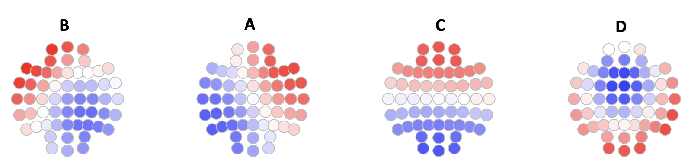
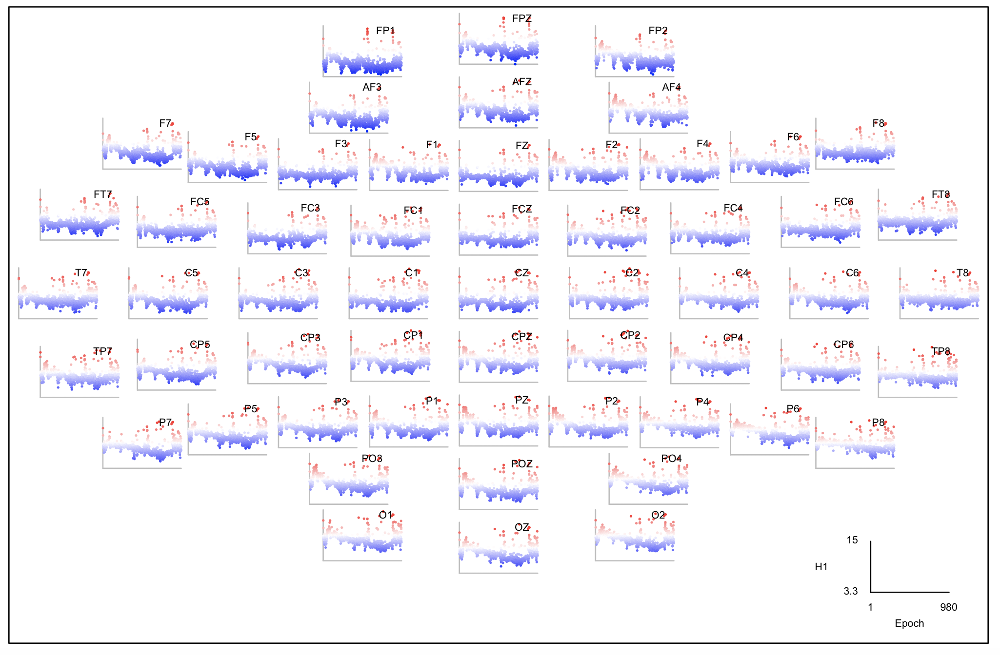

# lunaR plotting functions

!!! warning
    This page is a placeholder and will be completed in due course.

<!---
```
psd    <- read.table("out1/id1/PSD_F_CH.txt",header=T,stringsAsFactors=F)
coh    <- read.table("out1/id1/COH_B_CH1_CH2.txt" , header =T , stringsAsFactors=F)
hjorth <- read.table("out1/id1/SIGSTATS_E_CH.txt" , header=T,stringsAsFactors=F )
mtm    <- read.table("out1/id1/MTM_F_CH_SEG.txt.gz" , header=T , stringsAsFactors=F ) 
```
---->

## `lheatmap()`

_A simple heatmap_

__Syntax:__ `lheatmap(x, y , z)` 

- `x`, `y` and `z` are three similarly-sized vectors where `x` and `y` define a rectangular grid of values, and `z` is the _heat_ (i.e. plotted value)

__Returns:__ a heatmap image

This simple wrapper will likely need editing to produce high-quality
figures, but it might provide a good starting point.  It is designed
to work with data in the format as returned by `epoch-spectrum` from
[`PSD`](../../ref/power-spectra.md#psd) and
[`MTM`](../../ref/power-spectra.md#mtm), for example:  

```
d <- lx( k , "PSD" , "CH" , "E", "F" ) 
lheatmap( mtm$SEG , mtm$F , mtm$MTM ) 
```

{width="100%"}

## `ltopo.heat()`

```
ltopo.heat( psd$CH , psd$PSD , flt = psd$F == 15  , sz = 3 , zlab = "Power 15 Hz", mt = "Plot 1" ) 
```


<!---
c=         flt=       mt=        show.leg=  sz=        th.z=      th=        z=         zeroed=    zlab=      zlim=      
--->


## `ltopo.rb()`

As `ltopo.heat()` except using a blue (negative) and red (positive) color scale, with 0 as white.  This is the
same `zeroed=T` and with a different color scheme.  




## `ltopo.xy()`


```
ltopo.xy( c = hj$CH , x = hj$E , y = log( hj$H1 ) , xlab = "Epoch" , ylab = "H1"  ) 
```


```
ltopo.xy( c = hj$CH , x = hj$E , y = log( hj$H1 ) , xlab = "Epoch" , ylab = "H1" , z = log( hj$H1 ) , pch=20  , col=rbpal , cex = 0.2   ) 
```




<!---
## `ltopo.heat2()`
--->


## `ltopo.conn()`


```
ltopo.conn( chs1 = coh$CH1 , chs2 = coh$CH2 , z = coh$COH , flt = coh$B == "DELTA" & coh$COH > 0.8 , w = 3 , zr = c(-1 , 1 ) ) 
```


```
ltopo.conn( chs1 = coh$CH1 , chs2 = coh$CH2 , z = coh$ICOH , flt = coh$B == "SIGMA" & coh$COH > 0.7 , w = 5 , signed = T ) 
```


## `ltopo.dconn()`

```
ltopo.dconn( ch = "C3" , chs1 = coh$CH1 , chs2 = coh$CH2 , z = coh$COH , flt = coh$B == "SIGMA" ) 
```


## `ltopo.topo()`

```
ltopo.topo( c = c( coh$CH1 , coh$CH2 )  , c2 = c( coh$CH2 , coh$CH1 ) , z = c( coh$ICOH , -1 * coh$ICOH )  , f = rep( coh$B == "SIGMA" , 2 )   , sz=0.08, sz2=0.6 )
```


## `ldefault.xy()`

_Default channel co-ordinates for plotting_

## `ldefault.coh.xy()`

_Default channel co-ordinates for plotting connectivity maps_