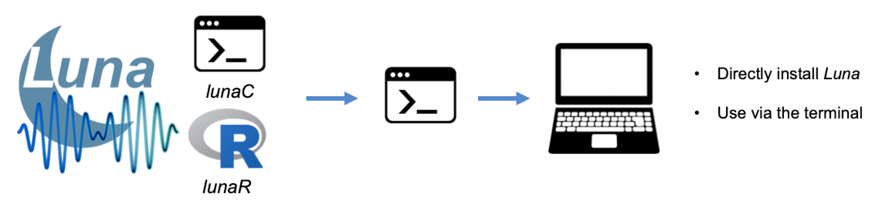

# Luna: software for the analysis of sleep signal data

Luna is an open-source C/C++ software package for manipulating and
analyzing polysomnographic recordings, with a focus on the sleep EEG.
Primarily oriented around command-line scripting
([_lunaC_](luna/args.md)), we are developing various _extensions_,
including a package for the [R](https://www.r-project.org/)
statistical package ([_lunaR_](ext/R/index.md)). We have also
recently developed an interactive viewer and web-based frontend, [_Moonlight_](moonlight.md).
The __current release is v0.28__ (10-Apr-2023): see [here](updates.md) for
a list of changes/additions.   
    
## Getting started
 
After [downloading](download/index.md) Luna, the best place to start
is the [tutorial](tut/tut1.md).  Then work your way through the pages
listed in the left-hand side menu.  (On devices with smaller screens
this may be minimized: if so, click the top left three horizontal bars
icon.)  In particular, the [_lunaC_](luna/args.md) describes many key
concepts and conventions (many of which are also relevant for the R
package).

The Luna package comprises a number of components, primarily:

- [_Luna_](ref/index.md), the underlying C/C++ library

- [_lunaC_](luna/args.md), a command-line interface to the Luna C/C++ library

- [_lunaR_](ext/R/index.md), a package for the [R statistical software](https://www.r-project.org/)

- [_Moonlight_](moonlight.md), an interactive viewer built on top of _lunaR_ and _lunaC_

!!! Note
    Both _lunaC_ and _lunaR_ are based on the same underlying Luna
    library: see the [reference overview](ref/index.md) for
    detailed descriptions of Luna's commands.
    In this documentation, we often refer to _lunaC_ simply as
    _Luna_: `luna` is the filename of both the actual command line
    executable and the R package, and so we use the terms _lunaC_ to
    _lunaR_ to disambiguate where necessary, but most material is
    common to both (i.e. as both are based on the same basic Luna
    library).

## Installation options

You can install Luna in a number of ways.  The easiest approach is to
download [binary executables](download/exec.md); you
can also compile [from source](download/source.md)):

{width="100%"}

An alternative is to run Luna in a [Docker container](download/docker.md).
If you can install Docker on your machine, this may be a good route to
test-drive Luna.  We've generated a Docker container that includes
_lunaC_, _lunaR_ and also _Moonlight_, and can be deployed in either in the
classic R environment, or via [RStudio](https://www.rstudio.com):

{width="100%"}
    
## Things Luna aims to do

The [reference](ref/index.md) pages list all currently-supported
commands. Main areas are summarized below.
 
!!! success "Primary use cases"    
    * Read, manipulate and write large sets of EDF and EDF+ signals 
    * Filter, resample and re-reference signals
    * Generate a variety of (per-epoch) summary statistics
    * Statistical artifact detection for EEG channels
    * Annotate and mask/filter epochs
    * Estimate key features of sleep macro-architecture
    * Automated sleep staging
    * Spectral analyses
    * Spindle and slow oscillation detection
    * Coherence and cross-frequency coupling 
    * Multi-channnel, topographical analyses
    * Visual data exploration via _Moonlight_

## Things Luna _doesn't_ aim to do

Luna was originally designed to work with the large number of
polysomnograms at the [NSRR](http://sleepdata.org/), with a focus on
intersecting sleep EEG signals with other annotations.  As such, some
areas are not well supported, or effectively outside of Luna's scope.

!!! failure "Areas outside of Luna's primary focus"

    
    * _Methods development platform_: although the R extension can support
    methods development, other tools (including general purpose Matlab
    packages such as [EEGLAB](https://sccn.ucsd.edu/eeglab/index.php))
    will naturally be better suited for expert users interested in
    flexibly altering and developing new analyses
    
    * _Online signal processing_: Luna is set up for all analyses
      being done offline, i.e. on the entire recording

    * _Support for multiple formats_: currently, Luna is mainly based
      around EDF and EDF+ files (as well as plain text)  
 
    * _Analyses of cardiac and respiratory events_: most of Luna's specialized sleep analyses are
    currently focused on EEG signals (e.g. spindles and slow oscillations)

