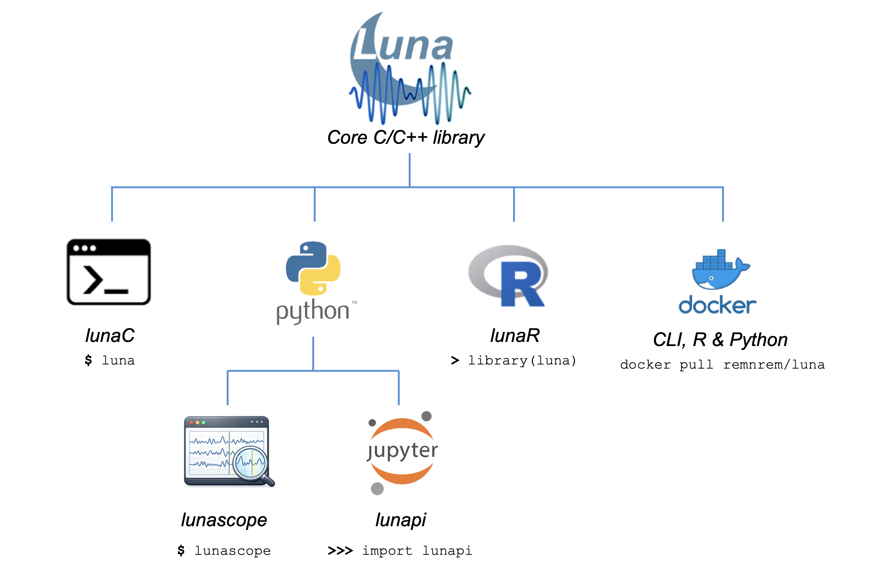

# Luna: software for the analysis of sleep signal data

Luna is an open-source C/C++ software package for manipulating and
analyzing polysomnographic recordings, with a focus on the sleep EEG.
Originally oriented around command-line scripting
([_lunaC_](luna/args.md)), we are developing various _extensions_,
including the [Python](http://python.org) module
[_lunapi_](lunapi/index.md) and the [_lunaR_](ext/R/index.md) library
for the [R](https://www.r-project.org/) statistical package. The
__current release is v1.3.4__ (27-Feb-2026): see [here](updates.md) for
a list of changes/additions. Please direct any questions to `luna.remnrem@gmail.com`. For
background on the project itself, see [About](about.md).

!!! tip "LunaScope"
     <a href="https://zzz.nyspi.org/lunascope/">LunaScope</a> is a new interactive GUI for Luna,
     built on top of <em>lunapi</em>. It provides a more full-featured point-and-click
     environment for visual review and interactive analysis.

## A family of Luna tools

{width="100%"}

The Luna package comprises a number of related components, all of
which are oriented around the same core C/C++ library.  The core library
implements all the [commands](ref/index.md) for working with sleep
signal data. There are three main ways to use the library, all of which
provide fundamentally the same basic functionality:

 - via [_LunaScope_](https://zzz.nyspi.org/lunascope/), an interactive
   point-and-click GUI built on top of _lunapi_: this is often the easiest
   entry point for visual review and exploratory analysis

 - via [_scope_](lunapi/scope.md), an interactive viewer for JupyterLab
   using _lunapi_: this is a lighter-weight embedded viewing option inside
   Python notebooks

 - via the [_lunaC_](luna/args.md) command-line tool: this is the
   _original_ interface, and is still the best approach for working with
   large datasets, ideally with scripted analyses and using a Unix-like
   cluster-computing environment

 - via the [_lunapi_](lunapi/index.md) Python package: this is the
   best approach for interactive analyses and for those familiar with
   Python

 - via the [_lunaR_](ext/R/index.md) R library: users more familiar
   with R may prefer this option, although current development emphasis is on
   the Python interface and related GUI tools

These tools can either be [installed individually](download/index.md)
or they can be accessed via prebuilt [Docker containers](download/docker.md)

!!! Note
    In this documentation, we often refer to _lunaC_ simply as
    _Luna_.  Also, `luna` is the filename of both the actual command line
    executable and the R package, and so we use the terms _lunaC_ to disambiguate it from
    _lunapi_ or _lunaR_ where necessary. Most material is
    common to all packages, as they are based on the same basic C/C++ Luna
    library.

## Getting started

For the recommended newcomer route through the documentation, start with
[__Path__](path.md). That page lays out the suggested order through the
tutorial, concepts, walk-through, and reference pages for command-line Luna,
_lunapi_, and _LunaScope_.
    
## Things Luna aims to do

The [Commands](ref/index.md) pages list all supported functionality; main areas are summarized below.
 
!!! success "Primary use cases"    
    * Read, manipulate and write large sets of EDF and EDF+ signals 
    * Filter, resample and re-reference signals
    * Generate a variety of (per-epoch) summary statistics
    * Statistical artifact detection for EEG channels
    * Annotate and mask/filter epochs
    * Estimate key features of sleep macro-architecture
    * Automated sleep staging
    * Spectral analyses
    * Spindle and slow oscillation detection
    * Coherence and cross-frequency coupling 
    * Multi-channel, topographical analyses
    * Interval-based analyses of event timing
    * Sample-level linear association models
    * Manipulating annotation data and meta-data
    * Visual data exploration via _LunaScope_ or _scope_

!!! info "Areas of ongoing development"
    * Multi-day recordings and actigraphy metrics
    * HRV metrics
    * Automated PSG QC
    * Predictive modeling, including biological age

## Things Luna _doesn't_ aim to do

Luna was originally designed to work with the large number of
polysomnograms at the [NSRR](http://sleepdata.org/), with a focus on
intersecting sleep EEG signals with other annotations.  As such, some
areas are not well supported, or effectively outside of Luna's scope.

!!! failure "Areas outside of Luna's primary focus"
    
    * _Methods development platform_: although the Python/R extensions
      can support methods development, other tools (including general
      purpose Matlab packages such as
      [EEGLAB](https://sccn.ucsd.edu/eeglab/index.php)) will be better
      suited for expert users interested in flexibly altering
      and developing new analyses
    
    * _Analyses of cardiac and respiratory events_: most of Luna's
    specialized sleep analyses are currently focused on EEG signals
    (e.g. spindles and slow oscillations)

    * _Online signal processing_: Luna is set up for all analyses
      being done offline, i.e. on the entire recording

    * _Support for multiple formats_: currently, Luna is mainly based
      around EDF and EDF+ files (as well as plain text)  
 
