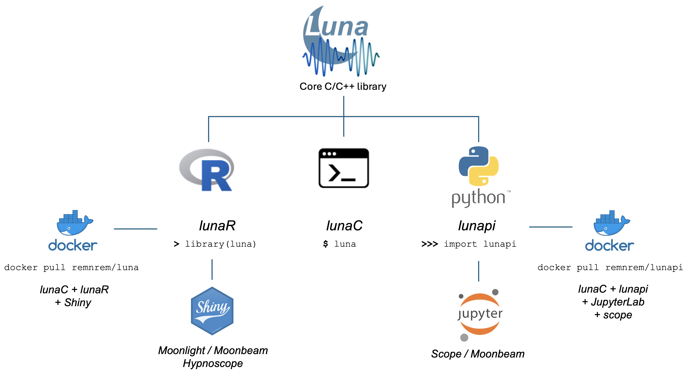

# Luna: software for the analysis of sleep signal data

Luna is an open-source C/C++ software package for manipulating and
analyzing polysomnographic recordings, with a focus on the sleep EEG.
Originally oriented around command-line scripting
([_lunaC_](luna/args.md)), we are developing various _extensions_,
including the [Python](http://python.org) module
[_lunapi_](lunapi/index.md) and the [_lunaR_](ext/R/index.md) library
for the [R](https://www.r-project.org/) statistical package. The
__current release is v1.2.0__ (3-Jan-2025): see [here](updates.md) for
a list of changes/additions. Please direct any questions to `luna.remnrem@gmail.com`.
    
## A family of Luna tools

{width="100%"}

The Luna package comprises a number of related components, all of
which are oriented around the same core C/C++ library.  The core library
implements all the [commands](ref/index.md) for working with sleep
signal data. There are three main ways to use the library, all of which
provide fundamentally the same basic functionality:

 - via the [_lunaC_](luna/args.md) command-line tool: this is the
   _original_ interface, and is still the best approach for working with
   large datasets, ideally with scripted analyses and using a Unix-like
   cluster-computing environment

 - via the [_lunapi_](lunapi/index.md) Python package: this is the
   best approach for interactive analyses and for those familiar with
   Python

 - via the [_lunaR_](ext/R/index.md) R library: users more familiar
   with R may prefer this option (_although note that although we plan to maintain this as is, in the future more effort will be put into developing the Python interface_)
   
!!! Note
    In this documentation, we often refer to _lunaC_ simply as
    _Luna_.  Also, `luna` is the filename of both the actual command line
    executable and the R package, and so we use the terms _lunaC_ to disambiguate it from
    _lunapi_ or _lunaR_ where necessary. Most material is
    common to all packages, as they are based on the same basic C/C++ Luna
    library.

On top of these components, we have also developed a few interactive tools:

 - [_Moonlight_](apps/moonlight.md), an interactive viewer and web-based frontend, based on _lunaR_ (and also available via [http://remnrem.net](https://remnrem.net)

 - [_scope_](lunapi/scope.md), an interactive viewer designed for the JupyterLab environment using _lunapi_

 - [_Moonbeam_](apps/moonbeam.md), a connector to [NSRR](http://sleepdata.org) data, available in either _lunapi_ or _lunaR_

These tools can either be [installed individually](download/index.md)
or they can be accessed via prebuilt [Docker containers](download/docker.md)

## Getting started

__1.__ After [__downloading__](download/index.md) one or more of the Luna
interfaces, the best place to start is the
[__tutorial__](tut/tut1.md). The tutorial is initially couched in terms of
the command-line tool, but versions are available for both R and
Python interfaces.

__2.__ You might then want to step through the
[__walk-through__](https://zzz.bwh.harvard.edu/luna-walkthrough/),
referencing this main documentation throughout (although note that completing
the multi-part walk-through may take several sessions).

__3.__ Then work your way through the pages listed in the left-hand side
menu.  (On devices with smaller screens this may be minimized: if so,
click the top left three horizontal bars icon.) In particular, the
[__Concepts__](luna/args.md) page describes many key ideas and
conventions, that are relevant for all implementations of Luna.  The
[__Commands__](ref/index.md) page tabulates all primary Luna commands
(these are common across command-line, R and Python implementations).
    
## Things Luna aims to do

The [Commands](ref/index.md) pages list all supported functionality; main areas are summarized below.
 
!!! success "Primary use cases"    
    * Read, manipulate and write large sets of EDF and EDF+ signals 
    * Filter, resample and re-reference signals
    * Generate a variety of (per-epoch) summary statistics
    * Statistical artifact detection for EEG channels
    * Annotate and mask/filter epochs
    * Estimate key features of sleep macro-architecture
    * Automated sleep staging
    * Spectral analyses
    * Spindle and slow oscillation detection
    * Coherence and cross-frequency coupling 
    * Multi-channnel, topographical analyses
    * Interval-based analyses of event timing
    * Sample-level linear association models
    * Manipulating annotation data and meta-data
    * Visual data exploration via _Moonlight_ or _scope_

## Things Luna _doesn't_ aim to do

Luna was originally designed to work with the large number of
polysomnograms at the [NSRR](http://sleepdata.org/), with a focus on
intersecting sleep EEG signals with other annotations.  As such, some
areas are not well supported, or effectively outside of Luna's scope.

!!! failure "Areas outside of Luna's primary focus"
    
    * _Methods development platform_: although the Python/R extensions
      can support methods development, other tools (including general
      purpose Matlab packages such as
      [EEGLAB](https://sccn.ucsd.edu/eeglab/index.php)) will be better
      suited for expert users interested in flexibly altering
      and developing new analyses
    
    * _Analyses of cardiac and respiratory events_: most of Luna's
    specialized sleep analyses are currently focused on EEG signals
    (e.g. spindles and slow oscillations)

    * _Online signal processing_: Luna is set up for all analyses
      being done offline, i.e. on the entire recording

    * _Support for multiple formats_: currently, Luna is mainly based
      around EDF and EDF+ files (as well as plain text)  
 

