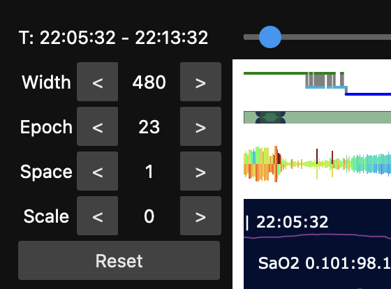
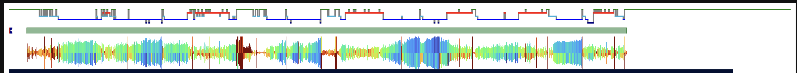

# scope

_lunapi_ provides a simple viewer utility for EDFs, `scope`, designed to work
in the JupyterLab environment.  Key features include:

 - it compresses and downsamples signals to allow viewing of large
   files over long periods

 - it can handle and visualize _gapped_ EDFs (i.e. either EDF+D files,
   or any internal dataset after a _mask_ has been applied,
   e.g. restricted to N2 epochs, etc)

 - it shows annotations as well as signals; one can also jump to
   locations in the recording based on selecting annotation events

 - it displays the current _in-memory_ version of the data (not just
   the EDF file _as is_), meaning one can view derived or transformed
   signals, etc

 - it provides whole-night hypnogram and Hjorth plot summaries as well as granular signal-level views


## Usage

Given a _instance_ object (i.e. a recording) named `p`, the _scope_ viewer is initiated as follows:

```
lp.scope( p ) 
```

This should return a cell with an interactive _widget_:


By default, this will show the first 30 seconds of the recording.
In the image above, the left panel contains a series of controls to
select the window position, as well as the channels and annotations.
Either single or multiple channels/annotations can be selected (by
holding down either shift or control when selecting multiple items).

The top bar has a slider which can be used to move the viewing window
over the recording.  Below it are visual indications of a) whether
epochs are masked or not, and the current window, b) a hypnogram (if
the recording has associated staging), and c) by default, a "Hjorth
plot" for the first EEG channel.   (Hjorth plots are [described here](../apps/moonlight.md#hjorth).)

Below, we zoom into the main controls (top left of the window): the
main control is _Width_ which controls the width of the display window
in seconds (i.e. here 480 seconds = 8 minutes = 16 epochs).  Above it,
the clock-time of the window is shown.  The _Epoch_ button can be used
to control window position as well as the top slider.  The _Space_ and
_Scale_ controls can be used to change the y-axis scaling (for most
cases, these can be ignored.)



Setting _Width_ to 240 seconds we see a zoomed-out signal view:


Setting _Width_ to 7680 (over 2 hours), we see a further zoomed-out signal view: 


Zooming out this much is not particularly useful for viewing
signals, but a) it can be useful when looking at annotations, and b)
it can be useful to show the gap-structure of recordings.

### Annotations

In the example below, we've selected a subset of channels as well as
selecting some annotations (obstructure apnea).  The top annotation box selects
which are displayed in the main window.   The lower annotation box provides a list
of events: selecting those events shifts the window to that position.   Here we see the canonical disturbance
in breathing and respiratory effort:


The _Fixed int._ check box at the bottom left can be set, in which
case the width of the window will be kept constant when centering on
new annotations (otherwise, by default the window width will adjust
relative to the size of the selected annotation).

### Masking 

As noted, the viewer can handle EDF+D and masked recordings.   In this example, the input is a standard (continuous) EDF, but we
can make a gapped recording, e.g. by running a `p.mask()` command - here to select only `N2` epochs by `p.mask( 'ifnot=N2' )`:


Note that the _scope_ viewer will not automatically update, because of the pre-processing step involved when executing the original `lp.scope()` command.   Therefore, after making some change to the in-memory/attached recording, it is necessary to re-execute the cell that calls `lp.scope()` (i.e. just press Shift+Enter in Jupyter lab).  This will recreate the _scope_ window, but now based on the altered in-memory dataset.  (A similar logic applies if, e.g. adding new channels/annotations or filtering/transforming signals, etc).   We now see the masked (non-N2) regions are grayed out: 


Note that it can often be useful to reduce recordings (or mask artifactual epochs) to make the summary (Hjorth) plots clearer.
For example, this is the original whole-night Hjorth for the `EEG_sec` channel:


If we mask the leading and trailing high-artifact wake epochs (e.g. here with the
[EDGER](../ref/artifacts.md#edger) command) we see a slightly improved visualization (i.e. due to the smaller dynamic range of the plot):



In this particular dataset, this is not a large effect, but such trimming can have a large impact in other cases. 


### Band summaries

Unchecking the _Hjorth_ box and selecting a new channel, the Hjorth
plot instead shows a band-power plot: from bottom to top, there are
six bands (slow, delta, theta, alpha, sigma and beta), for each
30-second epoch:


As above for Hjorth plots, trimming the recording (e.g. via `EDGER` or
similar) makes the ultradian structure of the recording clearer:


The band-power summaries provide a simple reflection of the fuller
spectrogram: in this case can can obtain it (separately from _scope_)
via the `p.sec( 'EEG_sec' )` command:


## Known issues

Scope is still under development:

 - although likely not as smooth as some dedicated EDF viewers, `scope`
   can nonetheless be useful for quickly reviewing signals

 - there are not currently options for fixing y-axis units for
   specific channels, etc, or for quick on-the-fly filtering of
   signals

 - it is limited to the JupyterLab environment
 
 - at the maximum window size, some channels may flatline (will be fixed in future releases)

 - recordings over 24 hours may not render correctly

 - toggling the _Hjorth_ checkbox does not update the top plot by itself, as it should (i.e. one needs to select a new channel as well)


