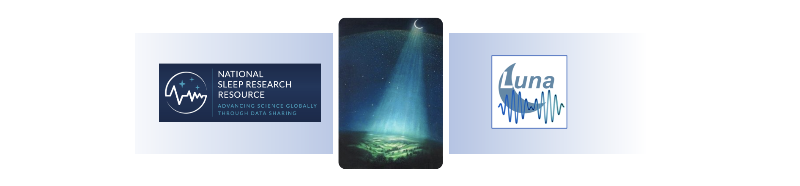
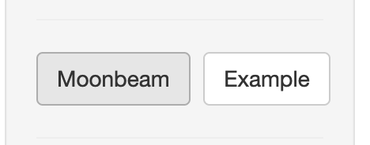
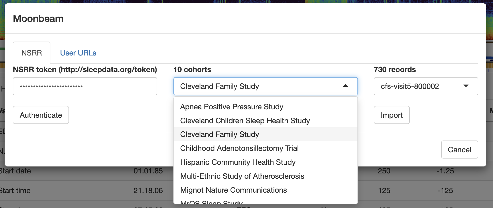
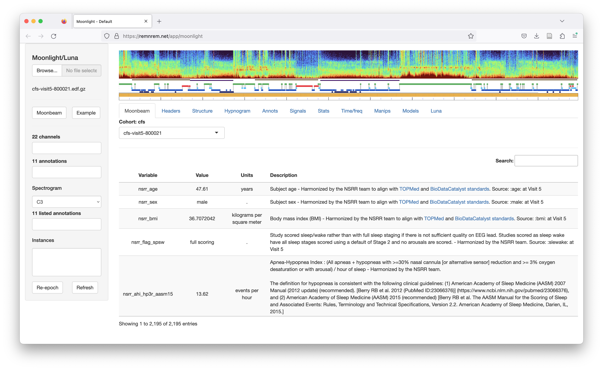
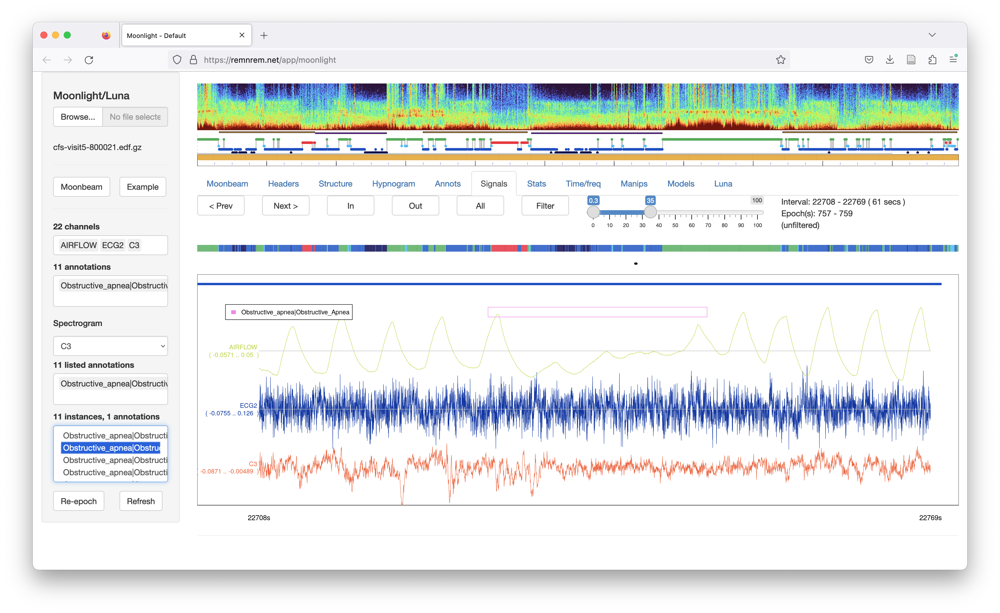
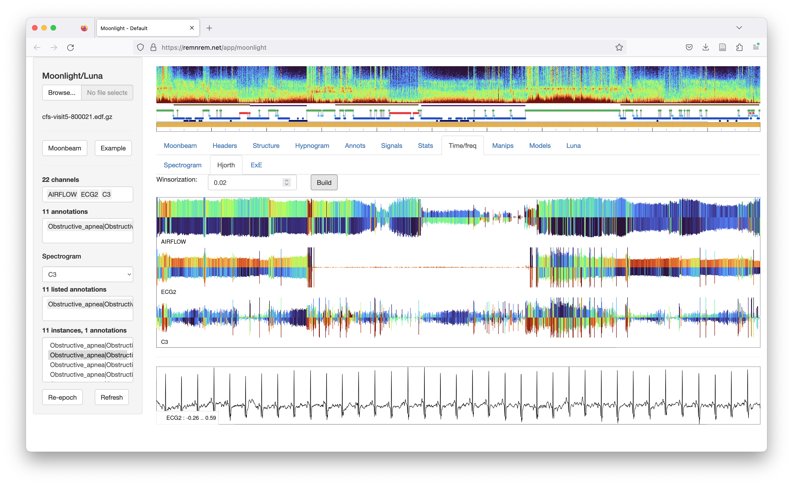
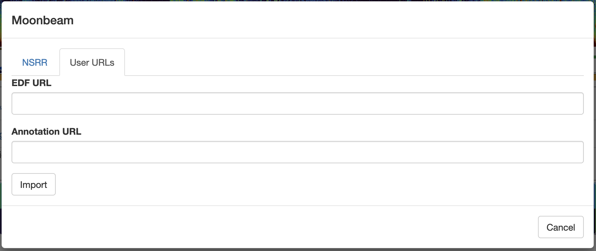

# Moonbeam

_Moonbeam provides a conduit to connect [NSRR](https://sleepdata.org) data with Luna
tools._

Whereas [Moonlight](moonlight.md) was originally designed for use with
data located on your own, local machine, _Moonbeam_ is an extension to
directly pull web-based datasets into _Moonlight_, including those in
the [National Sleep Research Resource
(NSRR)](https://sleepdata.org). [NSRR](sleepdata.org) can click on the
_Moonbeam_ button (on the left panel of the main _Moonlight_ page) and
it will bring up this type of dialog box:

{:width="25%"}

As an NSRR user, you can obtain your personalized token by visiting
[http://sleepdata.org/token]() (This is the same token you’d use for the
NSRR Ruby download gem, which is fixed but specific to each NSRR
user.) After pasting in your token and clicking Authenticate, you will
see a list of available cohorts. The exact list will depend on which
NSRR cohorts you have permission to access.

After selecting the cohort, the rightmost menu will be populated with
the IDs of all recordings. Select one and click Import and after a
little while the EDF and annotation data will be imported into
Moonlight. As below, a new Moonbeam panel shows any covariate data for
that individual, taken from the associated .csv files, in a searchable
table that also lists the definitions of each variable:

By selecting the Signals tab, you can view the raw signals, aligned to any annotations:

Moonlight supports numerous other visualization and data manipulation
options. For example, here is a whole-night visualization of some
signals based on epoch-level Hjorth parameters, which shows drop-out
of the ECG for the middle part of the night:

See the main [Moonlight](moonlight.md) and [Luna](ref/index.md) pages for more
detailed descriptions of the various functions.

## Uploading your own data

As well as viewing NSRR data, _Moonlight_ can also be used to view your own EDF/annotation files:

 - upload files directly from your local machine (top left menu item
   from the main page)

 - via the _User URLs_ option on the _Moonbeam_ tab, that allows you
    to enter two links (HTTP URLs): 1) for an EDF and 2) optionally, an
    annotation file (NSRR XML format, or Luna .annot/.eannot
    format, as described [here](ref/annotations.md)).

{:width="80%"}

The ability for _Moonbeam_ to transmit datasets from generic public
URLs can be convenient, for example, if you have files stored on
Dropbox or a similar cloud-based service that allows the creation
of shareable links to files.  This can be quicker than uploading a large
file from your own machine, particularly if you have a slow local
internet connection. It can also be used to allow others to view your
data by simply sharing the links rather than having to share
the original files.  

## Notes and caveats

 - Moonbeam/Moonlight are designed to view single recordings: it is
   not the right tool for downloading entire cohorts.

 - Downloads typically take roughly 5-15 seconds, but this may vary
    depending on the recording, current load on the server and your
    web connection. If the [remnrem.net]() host is busy, you are
    likely to get better performance by using the local (Docker)
    version. If a download fails (the page grays out with a spinning
    wheel that lasts for longer than 20 or so seconds), close out the
    page and restart the app. If the issue persists, please contact
    us.

 - This first release of _Moonbeam_ does not include all NSRR
   datasets. All datasets that have signal data will be incorporated
   in the near future. Please contact us if a desired NSRR dataset if
   currently missing.

 - Luna recognizes `lights_off` and `lights_on` annotations and calculates
   hypnogram statistics appropriately. However, lights on/off times
   are not currently integrated into NSRR annotations, so take care
   when interpreting metrics such as SOL and TIB.

 - We will monitor usage and interest in Moonlight/Moonbeam and
   potentially expand capacity of the AWS-hosted instance at
   [https://remnrem.net]()
 