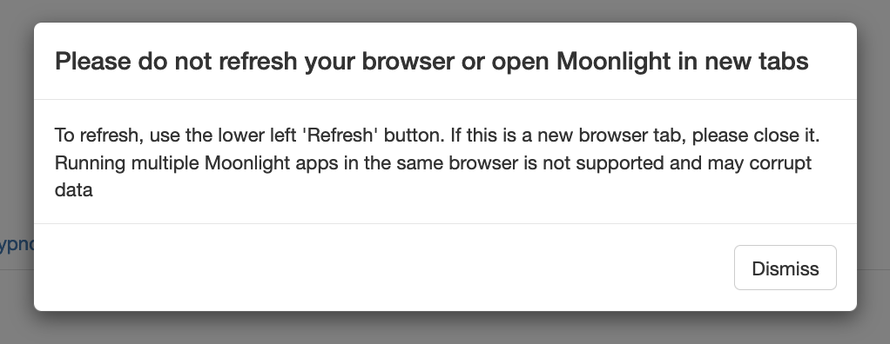

# Accessing Moonlight

## http://remnrem.net

A __limited__ number of instances are available for free use, hosted
at [`http://remnrem.net`](http://remnrem.net).  Simply click on the
link and then click the _Moonlight_ link to generate a new instance.
These are hosted in the cloud (AWS) but are currently not designed to
scale broadly.  If you get a message saying that no further instances
are available (or words to that effect) please try again later, or try
one of the options below.

Although this is the easiest and likely quickest option in many regards, upload
of EDFs can be slow (depending on your connection).

Please note that no data are stored in the cloud: __everything is deleted after you end the sessions__.
Nonetheless, it is your responsibility as a user to ensure that no private data are uploaded.

## Docker

With Docker Desktop installed, pull the latest `remnrem/luna` image, as described [here](download/docker.md).

If using RStudio via the Docker container, the easiest way to initiate _Moonlight_ is to run the single command:
```
source("http://zzz.bwh.harvard.edu/dist/luna/ml.R")
```
This will a) change the current directory to `/build/moonlight/` (which is where it is installed on the image) and b) kick off the app.

Note - to update _Moonlight_ on the Docker app - in the container's terminal:
```
cd /build/moonlight/
git pull
```


## Local installation

If you have installed _lunaR_ locally, you can get the current version of Moonlight as follows:

```
git clone https://github.com/remnrem/moonlight.git
cd moonlight
```
Then open R, and run the following in the `moonlight` folder:
```
library(shiny)
runApp()
```
This should open a browser window with _Moonlight_ up and running.

## Local vs host filesystems

As a technical point: _Moonlight_ can run (via the web) locally or on
a server.  An environment variable (`MOONLIGHT_SERVER_MODE`)
determines where _Moonglight_ will search when opening a new set of
files - either on the local (user's) filesystem, or on the host
(server) filesystem:

 - if this is _null_ (i.e. an empty string), then it will look for
   files locally (via the `shinyFiles` library)

 - if this is _non-null_ (e.g. set to `1`), then it will use a
   standard HTML file selection tool, which will look to the local
   filesystem (i.e. not the server) and copy the file to the server,
   then read it into the app

 - in the context of Docker, it is possible to specify either mode; in
   particular, if a local volume has been mounted to the container,
   then you'll be able to access local files either way.  Depending on
   the exact set up, one approach may be more efficient than the
   other.
 

## Multiple Moonlights

Please note that within a single R process, you can only run a single
instance of _Moonlight_.  If you try to open multiple windows from the
same instance, you will see the following error message:



This is typically harmless - it just means that you've swapped browser
windows, and if you simply continue working in that new window,
everything will be fine.  If you explicitly try to load different
files in different windows and repeatedly switch between them
(ignoring this message), then you are likely to get confusing results,
i.e. as only a single dataset will be uploaded for that R process at
any one moment in time.

Therefore, if you want to run multiple _Moonlight_ instances on the
same machine, please use separate R processes (or open separate Docker
containers).

