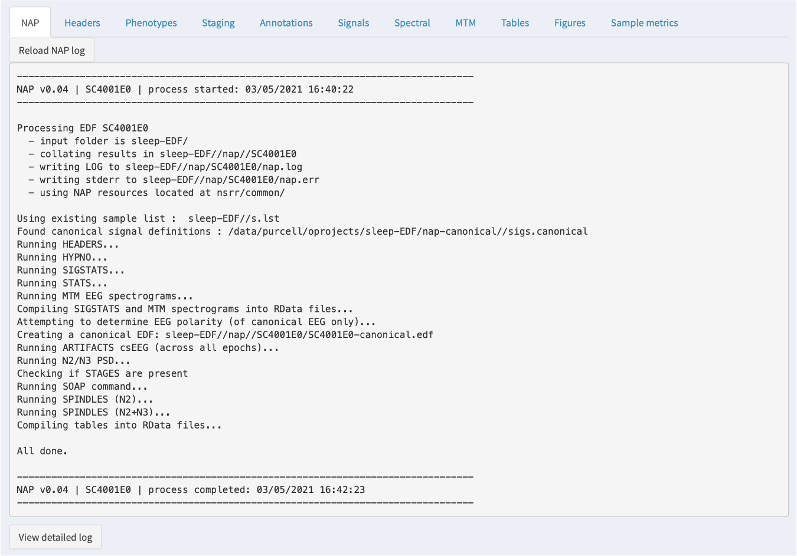
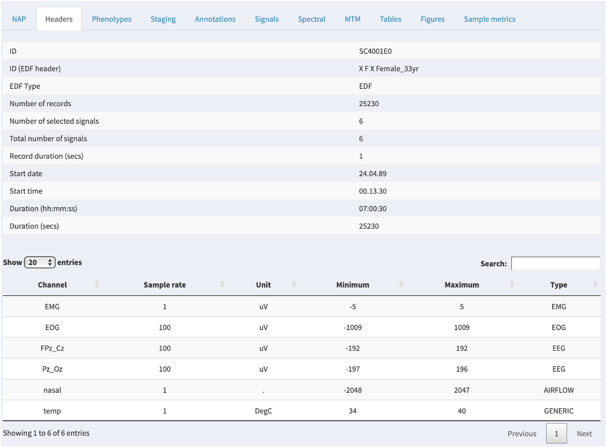
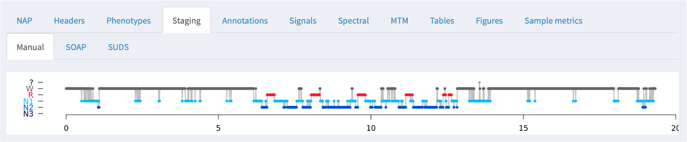

# NAP portal

<!---
 required linkes from the app:
https://zzz.bwh.harvard.edu/luna/nap/
https://zzz.bwh.harvard.edu/luna/nap/#uploading-edfs
https://zzz.bwh.harvard.edu/luna/nap/#signal-definitions
https://zzz.bwh.harvard.edu/luna/nap/#attaching-other-phenotypes
--->


A _beta-version_ of our [NSRR](https://sleepdata.org) Automated Pipeline (NAP) that hosts
the [Sleep-EDF Expanded](https://physionet.org/content/sleep-edfx/1.0.0/) dataset 
is available for testing at the URL below:

_NAP URL:_ [http://remnrem.net/nap/](http://remnrem.net/nap/)

!!! info
    The fully operational version (that allows external users
    to upload their own EDFs for processing and visualization) is not yet public.  Please contact us if you are interested
    in beta-testing [this](#uploading-edfs) particular component of NAP. 

## Overview

NAP processes and displays sleep signal data, with a focus on EEG
signals from whole-night polysomnography.

NAP comprises two main components:

 - a [backend](#nap-backend) processing pipeline for individual sleep studies (EDFs),
   deriving a set of metrics that describe sleep
   macro-architecture and EEG micro-architecture

 - a web-based [frontend](#nap-frontend) for viewing signals, annotations
   and any associated derived metrics

NAP has two main entry points:

 - using the [NAP frontend](#nap-frontend) to view 
   previously processed cohorts assembled by us (i.e. the Purcell lab/NSRR).  _Currently,
   the only public dataset freely accessible via NAP is the Sleep EDF dataset._

 - alternatively, the [EDF uploader](#uploading-edfs) can be used
   to upload one's own studies, after which the [NAP backend](#nap-backend) is
   triggered and the signals along with the NAP-derived metrics can
   be viewed via the [NAP frontend](#nap-frontend) as above. _Currently, this option
   is still being developed and is not open to the public._

!!! info
    NAP is hosted in the AWS cloud and powered by [Luna](https://zzz.bwh.harvard.edu/luna/).
    The frontend viewer uses [lunaR](ext/R/index.md) and [Shiny](https://shiny.rstudio.com) R packages.


!!! info
    This page is written from the perspective of a user of the NAP frontend; in future posts, we will describe
    in more detail 1) the steps of the NAP QC process, and 2) notes on how to host your own NAP instance.

## NAP backend

Currently, the NAP backend supports the following:

 - EDF validation and description
 - visualization of signals and any associated annotations
 - sleep stage (macro-architecture) metrics
 - automated sleep staging
 - multitaper spectrograms 
 - EEG spindle/slow oscillation detection

These procedures are implemented using
[Luna](http://zzz.bwh.harvard.edu/luna/); in the future, we hope to
add further domains of functionality, including respiratory signal
analysis.


## NAP frontend

Below we step through some of the panels and features of the NAP
frontend (using the public Sleep-EDF dataset as an example).

### Portal view

The NAP frontend is arranged as below:


Key features are that:

 - the left panel is used to select the cohorts, individuals, channels
   and/or annotations one is interested in

 - the top panel has various tabs (e.g. _NAP_, _Headers_, etc), which
   bring up various images and/or statistics in the main window area

 - the NAP frontend works mostly one individual (EDF) at a time: that is, all
   results shown in the tabs are for that selected individual
   (i.e. whichever EDF is selected in the _Samples_ combo box to the left).

 - one exception to the above principle is the _Sample Metrics_ tab, which gives
   summary statistics for all individuals in a given cohort

Depending on the exact configuration and context for using NAP, some
tabs may not appear (e.g. _NAP_, _Phenotypes_, _Sample Metrics_).

!!! info
    The current example instance of NAP (at [http://remnrem.net/nap](http://remnrem.net/nap])
    is pre-populated with the Sleep-EDF cohort only. 

### Selecting individuals

To select the individual (EDF) to be viewed, use the _Samples_ combo box on the left panel: 


You can either select the individual via the list, or you can also
just start typing in the box, and the list will autocomplete with the
matching selections.

### Tabs

Once an individual is selected, the information on the subsequent tabs will relate to that selected individual. 
As mentioned above, not all tabs may appear (depending on the configuration of the project, and whether certain
fields have been pre-populated, i.e. additional phenotypic information association with a given individual). 

The core tabs are shown here, each of which is further described below.


### NAP 

If the NAP [backend](#nap-backend) has been initiated or previously
run, then a NAP tab will show the log information from that process.
This is most relevant if something has gone wrong: the information
here may be useful in diagnosing the issue.  In particular, the bottom
of the tab has a _View detailed log_ button: when clicked, this
expands a longer log with more detailed error messages.



!!! info
    NAP is nonetheless a work-in-progress: we will be actively working on better diagnosing why a given study failed or not. 

### Headers

The _Headers_ tab shows information read directly from the EDF header.
Note that the main ID used by NAP is the Luna ID, which may (as in
this example) differ from the "internal" ID within the EDF header.  It
will either be based on a supplied _sample list_ or be based on the
filename of the EDF; see [here](luna/args.md) for more information on
how Luna structures projects.



### Phenotypes

If additional phenotypic information has been attached to a project,
the relevant row for that individual will be shown in this tab.  If
there are no extra phenoypes, this panel will not show.


### Staging

If NAP detects sleep stage information in an associated
[annotation](luna/args.md#annotations) file, it will be displayed
here, along with the summary statistics obtained from the
[HYPNO](#ref/hypnograms.md#hypno) command:


If a _canonical EEG_ (or other signals) have been designated and match the current NAP training data (as will be
described in future posts) then NAP will also perform two extra steps:

 - SOAP (Single Observation Accuracies and Probabilities): this fits
   a model based on the signal data to the observed staging data,
   trying to spot potential staging errors and/or assess the general
   consistency of the signals and stages

 - SUDS (Staging Using the Dynamics of Sleep): full prediction of sleep
   stages based on prior training data (i.e. as one might want if there were no 
   manual staging available)

Describing SOAP and SUDS is beyong the scope of this page: these will
soon be described in more detail in the next release of the Luna
software and documentation.

In these cases where manual staging was available, both SOAP and SUDS
tabs show the original (manual) staging hypnogram at the top (i.e. the
same of the _Manual_ tab), and below the model-based/predicted
staging.  In between, epochs that are discordant between observed and
predicted have an orange tick mark; further, epochs that are
discordant with respect to the three-way NREM versus REM versus wake
classification have a red tick.

Below the hypnograms, the area plot shows the posterior probabilities
stacked (i.e. the y-axis represents the probabilty, which sum to
1.0 for each epoch).  The amount of each color is therefore proportional to
the confidence in that stage assignment.


At the bottom of the panel, the bar plots show the estimated (top/solid) and
observed (lower/hatched) stage durations in minutes.

Tabular output from SOAP and SUDS is also available in the
[_Tables_](#nap-derived-metrics-table) tab, described below, including
the accuracy (ACC) and kappa (K) values.

For this particualr individual (the first individual in the cohort,
SC4001E0) staging using the default parameters has done a reasonable
job.  If you go to the _Tables_ tab (described below) and look at the
_SUDS_ group of tables, then select the _luna_suds_SUDS_ table, you
will see the accuracy (ACC) and kappa (K) are 0.825 and 0.77, which
are comparable to manual staging.  (The 3-class values for NR/R/wake
classification are higher still: 0.945 and 0.90).

!!! note
    The exact parameterization and training data used for SUDS will greatly impact its performance: the
    values here are from a default run without extensive tuning.  In general, automated staging performs
    less well for the older individuals in this dataset, but is in most cases quite good.   Note that we have
    removed the extensive leading and trailing wake periods in the Sleep-EDF data prior to populating this NAP
    instance. 

### Annotations

Any annotations -- either as generated by the NAP backend, or that
were paired with the original EDF, e.g. via an XML or .annot file, as
described [here](ref/annotations/#luna-annotations) -- can be viewed
under the _Annotations_ tab.  This just shows a box corresponding to
the occurrence of the annotations, for the set of annotations selected
in the left _Annotations_ combo box.  All annotations starting with
`NAP` have been added by the NAP pipeline: as the NAP backend evolves,
we expect a much richer set of annotations to be generated by default.


### Signals

The _Signals_ tab allows one to view the raw EDF channel data, showing
both selected signals (e.g. EEG) and any selected annotations (i.e. as selected
by the _Channels_ and _Annotations_ combo boxes on the left):


By default, the signal viewer will show a 30 second interval/epoch.
You can zoom out by clicking on the hypnogram bar at the top (holding
down the mouse button and selecting an interval).  If you select a
large interval, rather than attemptiong to show the original signal data (i.e.
which may be millions of sample points), the viewer will show an epoch-level summary, as below:


The top of the plot shows the part of the hypnogram that is selected
in the top hypnogram, i.e. and so aligns with the zoomed-out
signal/annotation data.

For signals with sample rates above 50, NAP will by default show the
signal mean amplitude (actually the first Hjorth parameter, activity)
as the height of the line; the color of the line represents the second
Hjorth parameter, which reflects the frequency of the signal
(normalized within channel).  These views can be useful for spotting
if a signal drops out entirely, or shows major discontinuities over
the course of the recording.

For signals with slower sample rates, NAP will instead show the mean
of the signal (i.e. as typically those signals will reflect heart
rate, temperative, oxygen levels, light, etc - i.e. things where the
epoch level average is a meaningful summary, unlike an EEG, EOG, EMG
or ECG.

The _Signals_ panel also can use an additional feature of the left
panel: the so-called _Annotations (list instances)_.  Whereas the top
_Annotations_ combo box will determine whether or not an annotation is
shown in the display, if you select an annotation in this lower box,
it will then list all instances of that annotation class in the box
below: for example, here showing 490 `NAP_spin-N2` instances, which
are spindles detected during N2 sleep by NAP.  (In future NAP documentation,
we will enumerate all annotations created by NAP.)  Clicking on one of those
instances (or using the cursor keys to move up and down) will make the main signals
viewing panel move to the epoch in which that annotation starts. 


Alternatively, you can click on the inner signal window and select a
region to zoom in, i.e. such that the entire window spans only, say, 1
second instead of 30 seconds.  To get back to the standard 30-second
view, click any signal point on the top hypnogram. In the plot below we've zoomed
into a 3-second span (the x-axis of the plot shows seconds elapsed from the start of the EDF),
during which a spindle was detected (the green bar).


!!! warning
    The main purpose of NAP is to display the metrics derived from the NAP backend, and try to connect them
    to the original signal data.  That is, the NAP signal viewer is __not__ designed to be a truly
    flexible, interactive experience, as one might expect, e.g., in a tool for manually scoring sleep studies.
    There are plenty of other EDF viewing tools for that purpose. 


### Spectral analysis

For QC purposes, the NAP frontend provides on-the-fly spectral analysis of signals in the _Spectral_ tab, estimating power spectra
based on the Welch method (as described [here](ref/power-spectra/#psd)).  The slider at the top controls the frequency range shown
(which will only go as high as half the sample rate for any given spectrum).   


If any annotations are selected (in the leftmost _Annotations_ combo),
then these power spectra are calculated _only_ for epochs with those
annotations.  This provides a quick way, for example, to select only
N2 epochs (as in this example) and check that the power spectra look
broadly consistent with clean data (i.e. here showing a peak in the
sigma/spidle range, but otherwise showing a typical 1/_f_ distribution
(plotted here on the log-scale).


### Multitaper spectrograms

The NAP backend precomputes multitaper spectrograms for all channels with a sample rate of 50 or more, and shows the images.  Unlike
the previous _Spectral_ tab, the spectrograms in the _MTM_ tab are fixed (i.e. will not change based on selecting channels and/or annotations). 


By default, the y-axis is from 0.5 to 25 Hz, the x-axis corresponds to all epochs across the entire recording. 

For this example, you can line up the hypnogram (from the _Staging_
tab) and the EEG multitaper spectrograms, and clearly see the
correspondence between wake and sleep in the occipital alpha rhythms
in the Pz/Oz channel.


!!! note
    TODO: In the future, we may add the default hypnogram to the top of this page, scaled to the same size of the spectrograms.

### NAP derived metric tables

If the NAP backend has been run for the study in question, any resultant tabular outputs will be given in the _Tables_ tab. 


Based on the NAP backend, these are organized by group
(i.e. macro-architecture, spindle analysis, etc) and each group
contains 1 or more tables.  Selecting a table from the second
combo box will then display that table below.  As the NAP backend evovles,
we will add links to describe the sets of metrics computed.  As is, these are
automatically compiled by the pipline, in the following form:

```
 tool_domain_command{_strata}
```

In the examples given, the `tool` is always `luna`; the `domain`
corresponds to the broad class of analysis (i.e. here automated
staging, so `suds`).  In this particular case, the command that
generated these tables was the Luna `SOAP` command.  Thus, the table
is called `luna_suds_SOAP`.

Any further underscore-delimited values indicate that the output is
stratified by that factor: e.g. for the SOAP command there are
additional tables: `luna_suds_SOAP_E` (which shows epoch-level output,
`E`) and `luna_suds_SOAP_SS` (which shows output for each sleep stage,
`SS`). For all Luna output, these stratifications directly match the _factors_
and _levels_ in the output of different commands, as extensively described in
the Luna documentation.

The variables in the table (i.e. `ACC`, `ACC3`, etc) can be determined by
looking at the documentation for the relevant tool and command. 

!!! note
    As mentioned above, these tables are currently programmatrically
    generated and so have this type of labelling, rather than plain
    English: in future, we will be adding more decriptive links/titles to
    each table (along with links to the Luna or other documentation that
    describes what the particular variables mean).


### NAP figures

The _Figures_ tab parallels the _Tables_ tab, showing any images generated by the NAP backend
instead of tables.   Currently, there are only a few images generated, but we expect this to increase over time.


### Sample-level derived metrics

Finally, outside of the NAP backend, it is possible to compile one or
more sample/cohort-level datasets and attach them to the NAP frontend,
in which case they will be displayed via the _Sample metrics_ tab.
That is, in contrast to all other tabs/panels, which only show the
single, selected individual/EDF, this tab can show information for
multiple individuals.

In the example below, there are several _groups_ (here, macro-architecture and micro-architecture),
and each group has several tables.  Each table then has several variables; selecting a variable will
show the distribution of that variable (if it is numeric) in the upper-right plot.  The red line indicates
where the currently selected individual falls for that variable.


Here we've selected `TIB` (Time In Bed) and can see that the selected individual (the top gray row, and the red line in the plot) has a relatively low value (420.5 minutes).  

!!! hint
    Although in this example, the _Sample metrics_ data happen to
    have come from the NAP backend, in principle these tables could be
    _any_ type of data (i.e. genetic, imaging, questinnaire, etc).
    That is, these are specified as R data frames, that if found in
    the folder, are automatically uploaded.  The data here are linked
    to the sleep signal data only by the ID, otherwise these values
    are completely independent of NAP _per se_.  This means that the Sample metrics
    data could contain individuals not even present in the main
    cohort, if so desired.


It is possible to sort the table by either ascending or descending order of a given metric by clicking on that column header: e.g. here clicking on the `TIB` column, we now see the top row is for `SC4732E0`:


If you click on the row in the table, then _if that person is present in the attached sleep/EDF data_, that person will be selected (i.e. the same as if manually selecting that individual from the _Samples_ combo box):


If you then click on the other tabs, the information displayed will be for that newly-selected individual: i.e. here because
we selected the individual with the longest time in bed, we might want to look at their hypnogram to confirm, and so we can select the _Staging_ tab:




<!---

## Uploading EDFs

!!! warning
    This component of NAP is currently under-development and not open to the public.   Please contact us if you are interested
    in beta-testing.  

As well as being a front end for sleep studies that have already been
processed, we ultimately aim to make the NAP backend accessible to
external users, by them simply uploaded an EDF (and optionally any
associated annotations).

### Signal definitions

_to be completed_

In order to perform certain analyses, the NAP backend needs to know
which signals the user designates as the _canonical_ ones (e.g. for
spindle analyses, or for automated staging).  This information is
specified in this section.

### Attaching other phenotypes

_to be completed_

Optionally, you can upload additional phenotypic data here.

### Data retention, security and privacy policies

All uploaded data (EDFs, annotations and phenotypes) are treated as
private.  Anybody using this service can expect that:

 - uploaded data will never be redistributed beyond the NAP portal

 - uploaded data will not be used in any analyses beyond what is presented in the NAP portal

 - uploaded data will be permanently deleted when a user deactivates his or her account

The above notwithstanding, it is the user's responsibility to avoid
uploading data containing personal details or PHI (Protected Health
Information), i.e. in the EDF headers or annotations.

Uploaded data are stored using Amazon Web Services' (AWS) S3 (Simply
Storage Service).  The following security measures:

_to be completed_
 - X
 - Y
 - Z
 
We (the NSRR) retain the right to:

 - review datasets and derived metrics for trouble-shooting purposes and general, technical evaluation of the pipeline

 - delete uploaded files after 3 months of account inactivity

 - deactivate a user's account 

 - suspend or cancel this service
 
This service is provided "as is" and should be used for academic
research purposes only.  Please note that technical details of the
pipeline may change at any time.  Further, also note that any
automated analyses of complex data may be susceptibe to error or
inaccuracy, and so any results should be interpreted in that light.


### Usage limitations

The current _beta-testing_ version of NAP has the following restrictions on usage:

 - at any given time, a maximum of 10 uploads (one or more EDFs) are allowed

 - any one upload has a maximum filesize of 250Mb

### Registering for an account

For current _beta-testing_, please first e-mail `sagarwal12@bwh.harvard.edu` requesting a trial user account.
After approval, you can proceed to the login page and create a new account with your e-mail address.

When signing up for a new account, please note that passwords should
have at least: one upper-case letter, one lower-case letter, one
number, one symbol (`!@#$%^&*`) and be at least 8 characters long.

### Usage

_to be completed_

Users can upload one or more files; the portal designed to start the
NAP backend after each EDF is uploaded. Currently, uploads can only be
in EDF format; annotations must be in Luna-compatible XML or .annot or
.eannot formats, as described in the Luna documentation.

--->


