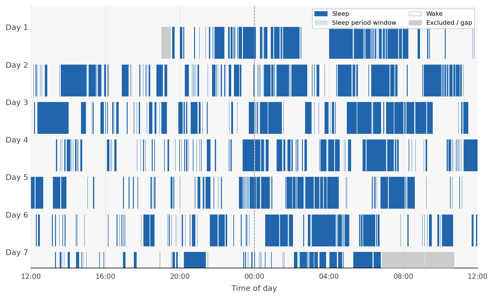
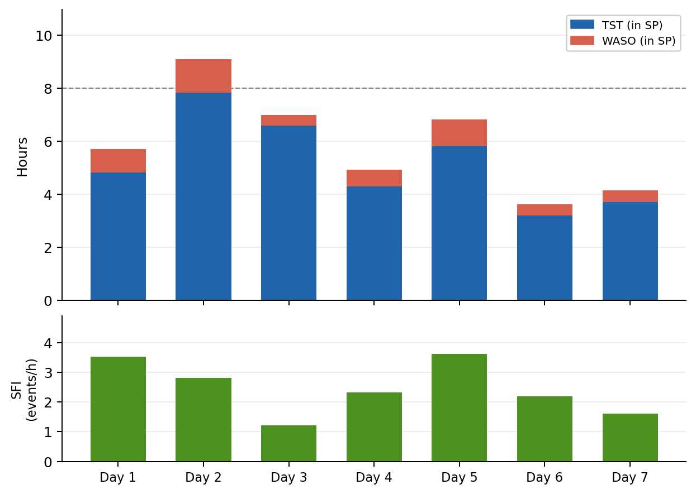

# Actigraphy

_Commands for multi-day actigraphy analysis_

These commands support analysis of wrist or waist actigraphy recordings spanning multiple days. `DAYS` creates structured day and clock-time annotations (calendar days, hourly windows, and AM/PM halves) across the recording, providing the temporal scaffolding needed for circadian analyses. `ACTIG` computes non-parametric circadian rhythm metrics (IS, IV, RA, L5/M10, and related measures) and applies a simple threshold-based wake/sleep scoring algorithm to the actigraphy signal.

| Command | Description |
|---|---|
| [`DAYS`](#days) | Create day and clock-time annotations for multi-day recordings |
| [`ACTIG`](#actig) | Non-parametric circadian metrics and wake/sleep scoring |

---

## DAYS

_Create day and clock-time annotations for multi-day recordings_

`DAYS` creates annotation intervals marking calendar days and optionally hourly
clock-time windows across a multi-day recording. It is primarily designed to be
used before [`ACTIG`](#actig) or other analyses that benefit from
day-indexed stratification.

Day annotations (`day01`, `day02`, …) span successive 24-hour anchored windows
starting from the last anchor-hour at or before the recording start. By default
days begin at noon (`anchor=12`); set `anchor=0` for midnight-anchored days.
With `hours`, hourly annotations (`00h`–`23h`) are also written. With `halves`,
`AM` and `PM` annotations are written spanning midnight-to-noon and noon-to-midnight.

<h3>Parameters</h3>

| Parameter | Default | Description |
|---|---|---|
| `anchor` | `12` | Hour (0–23) at which each ACTIG day begins (default: noon) |
| `prefix` | `day` | Prefix for day annotation labels |
| `hours` | — | Also create hourly annotations (`00h`, `01h`, …, `23h`) |
| `hour-prefix` | — | Prefix for hourly annotation labels |
| `halves` | — | Also create `AM` and `PM` annotations |
| `weekend` | — | Also create a `WEEKEND` annotation for anchored days falling on Saturday or Sunday |
| `weekend-label` | `WEEKEND` | Label for weekend annotations |
| `verbose` | — | Emit day-level details to the output database |

<h3>Example</h3>

```
luna s.lst -s 'DAYS anchor=12 hours weekend'
```

---

## ACTIG

_Non-parametric circadian metrics and wake/sleep scoring from actigraphy_

!!! warning "Active development"
    `ACTIG` is under active development and expansion. Defaults, scoring
    options, QC behavior, and output details may still evolve.

`ACTIG` analyses a continuously sampled activity channel — actigraphy counts,
ENMO, or any other non-negative movement metric — recorded over multiple days.
It computes standard non-parametric circadian rhythm metrics, performs
epoch-by-epoch sleep/wake scoring, and produces per-day summaries with
optional day-level quality control.

---

<h3>Overview</h3>

ACTIG operates in layers:

1. **Epoch binning** — the activity signal is averaged (or summed) into
   fixed-length epoch bins (default 60 s).
2. **Gap detection** — epochs with fewer than `gap-min-pct`% of their expected
   samples are flagged as gaps and excluded from all downstream calculations.
3. **NP circadian metrics** — computed from the full epoch time series regardless
   of scoring mode.
4. **Scoring** — optional epoch-level or period-window scoring using one of three
   methods.
5. **Fragmentation and sleep summaries** — computed within SP/WP period windows.
6. **Day-level QC** — a second pass that flags technically unreliable days.

---

<h3>Input signal and epochs</h3>

ACTIG reads a single activity channel and bins it into non-overlapping epochs
of equal length anchored to recording time.

| Parameter | Default | Description |
|---|---|---|
| `sig` | _required for scoring_ | Activity channel name. Omit (or use wildcard `sig=*`) when using pre-existing annotations (`prescored` or implicit prescored mode) |
| `epoch` | `60` | Epoch length in seconds. The `luna` method accepts any length; `cole` and `threshold` require exactly 60 s |
| `bin` | `60` | Bin size in minutes for non-parametric circadian metrics |
| `sum` | off | Use the sum rather than the mean when binning raw samples into epochs (useful for counts-like signals) |
| `day-anchor` | `12` | Clock hour (0–23) at which ACTIG days begin. The default noon keeps a typical overnight sleep episode within one ACTIG day |

---

<h3>Gaps (EDF+D)</h3>

A **gap** in ACTIG means missing or invalid signal samples — either EDF+D
discontinuities or intervals masked beforehand with `MASK` and `RE`.

| Parameter | Default | Description |
|---|---|---|
| `gap-min-pct` | `50` | Minimum percentage of expected samples required for a valid epoch |

Gap epochs are excluded from circadian metrics, sleep/wake summaries, and
scoring. ACTIG scores each contiguous non-gap block independently and never
bridges across a gap.

!!! note "EDF+D holes vs within-record gaps"
    After `MASK` + `RE`, the EDF becomes discontinuous (EDF+D). ACTIG detects
    these holes from the EDF record structure and excludes them from
    `SCORE_GAP_MIN` — they are already marked by `EXCLUDED` annotations from
    `MASK`. This ensures `TST + TWT + GAP_MIN = valid retained-record minutes`
    in both signal-based and annotation-based runs.

---

<h3>Non-parametric circadian metrics</h3>

NP circadian metrics are always computed when a signal is available, regardless
of scoring mode. They summarise the shape, stability, and strength of the
rest-activity rhythm.

| Variable | Description |
|---|---|
| `NP_IS` | **Interdaily Stability** — regularity of the rest/activity rhythm across days (0–1; higher = more regular) |
| `NP_IV` | **Intradaily Variability** — within-day fragmentation of the rhythm (0–2; higher = more fragmented) |
| `NP_RA` | **Relative Amplitude** — contrast between most-active and least-active windows: (M10 − L5) / (M10 + L5) |
| `NP_L5` | Mean activity in the least-active 5 h window |
| `NP_L5_ONSET` | Clock time at which the L5 window begins (HH:MM:SS) |
| `NP_L5_ONSET_MIN` | L5 onset as decimal minutes from midnight |
| `NP_M10` | Mean activity in the most-active 10 h window |
| `NP_M10_ONSET` | Clock time at which the M10 window begins |
| `NP_M10_ONSET_MIN` | M10 onset as decimal minutes from midnight |

| Parameter | Default | Description |
|---|---|---|
| `l` | `5` | Window size in hours for the least-active period (L5) |
| `m` | `10` | Window size in hours for the most-active period (M10) |
| `np-step` | `1` | Sliding-window step size in minutes for L5/M10 onset search |
| `np-traditional` | off | Use the classic 60-minute onset search step |
| `np-full-days` | `T` | Restrict NP metrics to complete 24 h recording days |

---

<h3>Annotation label scheme</h3>

ACTIG uses a two-level annotation scheme:

- **Period-window annotations** (coarse, written by `score-period`): `SP` and `WP` mark the overall sleep opportunity and wake windows across each day.
- **Epoch-level annotations** (granular, written by `score`): `S` and `W` label every individual epoch.

| Label | Type | Written by | Meaning |
|---|---|---|---|
| `SP` | Period window | `score-period` | Sleep period window |
| `WP` | Period window | `score-period` | Wake period window |
| `GP` | Gap run | `score-period` | Gap epochs within period scoring |
| `S`  | Epoch label  | `score`        | Sleep epoch |
| `W`  | Epoch label  | `score`        | Wake epoch  |
| `G`  | Gap run      | `score`        | Gap epochs within granular scoring |

All labels can be overridden with `sleep=`, `wake=`, `gap-out=`, `sleep-period=`, `wake-period=`.

!!! warning "Pre-existing label collision"
    `score` halts if `S` or `W` annotations already exist; `score-period` halts
    if `SP` or `WP` exist. Use `DROP-ANNOTS annot=SP,WP,S,W,G,GP` to clear
    stale labels before re-running.

---

<h3>Operating modes</h3>

ACTIG selects its operating mode based on the parameters provided:

| Mode | Invocation | Signal required? | Output |
|---|---|---|---|
| **NP only** | `ACTIG sig=activity` | Yes | NP circadian metrics only |
| **score-period** | `ACTIG sig=activity score-period` | Yes | Writes SP/WP period-window annotations. No metrics emitted. |
| **score** | `ACTIG sig=activity score` | Yes | Writes S/W epoch annotations; NP metrics, sleep summaries, fragmentation |
| **prescored (explicit)** | `ACTIG prescored` | No | Uses existing S/W annotations; computes TST and fragmentation |
| **prescored (implicit)** | `ACTIG` (S/W exist) | No | Automatically detects S/W in memory and proceeds as prescored |

<h4>score-period</h4>

`score-period` runs the luna scoring algorithm with **coarse** defaults designed
to produce large, contiguous period windows rather than epoch-by-epoch decisions.
It only writes `SP`/`WP` annotations and suppresses all metric output — it is
purely an annotation-writing pass.

Default parameters for `score-period` vs `score`:

| Parameter | `score-period` | `score` | Rationale |
|---|---|---|---|
| `smooth` | 30 min | 1 min | Wide smoothing collapses brief movement bursts into the sleep window |
| `burst` | 10 min | 3 min | Wider burst window avoids triggering on isolated bouts |
| `min-sleep` | 60 min | 5 min | Only long sustained quiet periods qualify as a sleep period window |
| `max-gap` | 10 min | 1 min | Short wake intrusions are bridged for contiguous SP windows |
| `min-wake` | 20 min | 1 min | Long sustained wake closes the sleep period window |

<h4>score</h4>

`score` uses granular defaults that preserve every brief awakening. The
asymmetric persistence rule — `min-wake=1` but `min-sleep=5` — means the scorer
is quicker to detect wake than to call new sleep, so fragmentation metrics are
sensitive to brief arousals.

<h4>prescored / implicit prescored</h4>

Use `prescored` when epoch annotations come from PSG, a sleep diary, or another
algorithm. Pass custom label names with `prescored=SLEEP,WAKE`. If no mode is
specified and `S`/`W` already exist in memory, ACTIG automatically enters
implicit prescored mode.

!!! tip
    If neither `S` nor `W` annotations are found and no mode is specified, ACTIG
    returns silently without output.

---

<h3>Recommended two-run workflow</h3>

The standard pipeline combines `score-period` and `score`:

```
luna s.lst -o out.db -s '
  DROP-ANNOTS annot=SP,WP,S,W,G,GP &
  MASK if=EXCLUDED &
  RE &
  ACTIG sig=activity score-period &
  ACTIG sig=activity score'
```

1. **`DROP-ANNOTS`** — clear any stale labels from a previous run.
2. **`MASK if=EXCLUDED` + `RE`** — remove non-wear / bad intervals; the EDF
   becomes EDF+D with the masked records as gaps.
3. **`ACTIG score-period`** — coarse pass: writes SP/WP period windows.
4. **`ACTIG score`** — granular pass: writes S/W epoch labels, computes all
   metrics using the SP/WP windows from step 3.

To extract results:

```
# Individual-level (cross-day averages)
destrat out.db +ACTIG -r ""

# Per-day
destrat out.db +ACTIG -r DAY
```

To use sleep diary period windows instead of `score-period`:

```
luna s.lst -o out.db -s '
  ADD-ANNOTS file=diary.annot &
  ACTIG sig=activity score sleep-period=DIARY_SP wake-period=DIARY_WP'
```

---

<h3>Scoring methods</h3>

| Method | Epoch size | Device-agnostic? | Best for |
|---|---|---|---|
| `luna` | Any | Yes | Default choice. Works with ENMO, counts, or any non-negative activity metric. Robust to device and scale differences. |
| `cole` | Exactly 60 s | No | Exact replication of the Cole–Kripke 1992 weighted-average algorithm. Requires counts-calibrated device data. |
| `threshold` | Exactly 60 s | No | Simple fixed-count threshold. Useful for device-specific thresholds or quick comparisons. |

Use `method=luna` (default), `method=cole`, or `method=threshold`.

<h4>Luna method</h4>

The luna method is device- and epoch-size-agnostic. Rather than comparing raw
counts to a fixed threshold, it asks: _is this epoch relatively quiet, locally
non-bursty, and part of a sustained low-activity period?_

**Algorithm:**

1. **Log transform** — `log(1 + activity)` compresses extreme bursts so quiet, moderate, and highly active epochs can be compared on the same relative scale.
2. **Robust normalisation** — centre and scale using recording-wide median and MAD. Makes the method insensitive to extreme epochs and between-device scale differences.
3. **Moving-median smoothing** — centred moving median of width `smooth` minutes captures the local quiet/active background.
4. **Burst density** — for each epoch, estimate the fraction of recent epochs exceeding `burst-z`. A quiet epoch inside a restless window should not typically be scored as sleep.
5. **Candidate sleep** — an epoch qualifies only if smoothed z-score < `quiet-z` AND burst density < `active-frac`.
6. **Pass 1 — fill short wake interruptions** — wake gaps shorter than `max-gap` minutes inside a sleep run are relabelled sleep.
7. **Pass 2 — minimum sleep run** — sleep runs shorter than `min-sleep` minutes are removed.
8. **Pass 3 — wake persistence** — once wake runs for `min-wake` consecutive minutes, the current sleep bout ends.

All passes operate independently within each contiguous non-gap block.

| Parameter | `score` default | `score-period` default | Description |
|---|---|---|---|
| `smooth` | 1 min | 30 min | Moving-median smoothing window |
| `burst` | 3 min | 10 min | Burst-density estimation window |
| `burst-z` | 0.5 | 0.5 | Z-score threshold for burst counting |
| `quiet-z` | −0.5 | −0.5 | Max smoothed z-score for candidate sleep |
| `active-frac` | 0.20 | 0.20 | Max burst density for candidate sleep |
| `min-sleep` | 5 min | 60 min | Minimum sleep run to retain |
| `max-gap` | 1 min | 10 min | Max within-sleep wake gap to fill |
| `min-wake` | 1 min | 20 min | Consecutive wake minutes to end a sleep bout |
| `channels` | off | off | Write diagnostic intermediate channels to the EDF |

<h4>Cole–Kripke method</h4>

A direct implementation of the Cole–Kripke 1992 weighted moving-average
algorithm for 60-second counts. Requires `epoch=60` and counts-calibrated data.

```
weighted score = 0.001 × Σ(weight × activity of neighbouring epoch)
wake if score ≥ cole-thresh; sleep otherwise
```

| Parameter | Default | Description |
|---|---|---|
| `cole-thresh` | `1.0` | Wake/sleep cutoff for Cole–Kripke scoring |

<h4>Threshold method</h4>

Simple fixed-count threshold: epochs at or above `thresh` are wake; below is sleep. Defaults to the median of all valid epochs.

| Parameter | Default | Description |
|---|---|---|
| `thresh` | median | Activity threshold. Defaults to the recording median of valid epochs |

Both `cole` and `threshold` require `epoch=60`.

---

<h3>Diagnostic channels</h3>

When `channels` is specified with the `luna` method, ACTIG writes the
intermediate processing stages back to the EDF as new signal channels. These are
useful for visualising the algorithm in a signal viewer.

| Suffix | Step | Content |
|---|---|---|
| `_Z` | Robust z-score | Log-activity centred/scaled by median and MAD |
| `_L` | Smoothed z-score | Moving-median output |
| `_D` | Burst density | Local fraction of burst epochs (0–1) |
| `_CS` | Candidate sleep | Binary flag (1 = candidate sleep) |
| `_SW` | Final scored trace | 1 = sleep, 0 = wake (gap epochs omitted) |

```
luna actig.edf -s 'ACTIG sig=activity score channels'
# Adds: activity_Z  activity_L  activity_D  activity_CS  activity_SW
```

---

<h3>Fragmentation metrics</h3>

Fragmentation metrics are computed when scoring or prescored mode is active.
All metrics are calculated **separately** within the sleep-period window (SP)
and within the wake-period window (WP). If no SP/WP annotations are present,
ACTIG uses an empirical definition (span from first to last sleep epoch, and its complement).

| Parameter | Default | Description |
|---|---|---|
| `sleep-period` | `SP` | Annotation label for sleep-period windows |
| `wake-period` | `WP` | Annotation label for wake-period windows |
| `tp-lambda` | `1.0` | Bayesian smoothing λ for transition probability estimates (uniform prior) |

<h4>Standard fragmentation indices</h4>

| Variable | Units | Description |
|---|---|---|
| `FRAG_SFI` | events/h | **Sleep Fragmentation Index** — sleep-to-wake transitions per hour of sleep time within the SP window |
| `FRAG_MI_ACT` | % | **Movement Index** — percentage of SP epochs scored as wake |
| `FRAG_FI_ACT` | % | **Fragmentation Index** — percentage of sleep bouts ≤ 1 epoch long within SP |
| `FRAG_SFI_ACT` | index | **Actigraphy FI** — composite: `MI_ACT + FI_ACT` (mirrors traditional Actiwatch FI) |

<h4>Transition probabilities</h4>

Epoch-to-epoch transition probabilities use a Bayesian maximum-likelihood
estimator with a uniform Dirichlet prior controlled by `tp-lambda`.

```
P̂(sleep→wake) = (N_SW + λ) / (N_SS + N_SW + 2λ)
P̂(wake→sleep) = (N_WS + λ) / (N_WW + N_WS + 2λ)
```

| Variable | Period | Description |
|---|---|---|
| `FRAG_TP_SW_S` | SP | P(sleep→wake) within sleep period |
| `FRAG_TP_WS_S` | SP | P(wake→sleep) within sleep period |
| `FRAG_TP_SW_W` | WP | P(sleep→wake) within wake period |
| `FRAG_TP_WS_W` | WP | P(wake→sleep) within wake period |

<h4>Entropy metrics</h4>

Shannon entropy metrics capture the irregularity of the sleep/wake sequence beyond what transition counts can express.

```
Conditional transition entropy:
H(X_t | X_{t-1}) = − Σ_{a,b} P(a,b) · log₂ P(b|a)

Run-length entropy:
H(run-length) = − Σ_k p(k) · log₂ p(k)
```

| Variable | Period | Description |
|---|---|---|
| `FRAG_TRANS_ENT_S` | SP | Conditional transition entropy within sleep period (bits) |
| `FRAG_TRANS_ENT_W` | WP | Conditional transition entropy within wake period (bits) |
| `FRAG_RL_ENT_SE_S` | SP | Run-length entropy of sleep bouts within sleep period (bits) |
| `FRAG_RL_ENT_WE_S` | SP | Run-length entropy of wake bouts within sleep period (bits) |
| `FRAG_RL_ENT_SE_W` | WP | Run-length entropy of sleep bouts within wake period (bits) |
| `FRAG_RL_ENT_WE_W` | WP | Run-length entropy of wake bouts within wake period (bits) |

<h4>Bout duration statistics</h4>

| Variable | Description |
|---|---|
| `FRAG_SLEEP_BOUT_MED_MIN` | Median sleep bout duration within SP (minutes) |
| `FRAG_SLEEP_BOUT_P10_MIN` | P10 sleep bout duration within SP (minutes) |
| `FRAG_SLEEP_BOUT_MAX_MIN` | Maximum sleep bout duration within SP (minutes) |
| `FRAG_WAKE_BOUT_MED_MIN` | Median wake bout duration within SP (minutes) |
| `FRAG_WAKE_BOUT_P90_MIN` | P90 wake bout duration within SP (minutes) |
| `FRAG_WAKE_BOUT_MAX_MIN` | Maximum wake bout duration within SP (minutes) |

---

<h3>Output</h3>

<h4>Root stratum (individual-level)</h4>

Variables written when `score`, `prescored`, or implicit prescored mode is active.
These are cross-day averages over days that pass both coverage and QC inclusion.

| Variable | Units | Description |
|---|---|---|
| `SCORE_TST_MIN` | min | Total sleep time across all valid epochs |
| `SCORE_TWT_MIN` | min | Total wake time across all valid epochs |
| `SCORE_GAP_MIN` | min | Total within-record gap time |
| `SCORE_SLEEP_PCT` | % | Percent of valid scored epochs called sleep |
| `SCORE_TST_DAYAVG_MIN` | min | Mean TST across post-QC included days |
| `SCORE_TWT_DAYAVG_MIN` | min | Mean TWT across post-QC included days |
| `SCORE_TST_SP_DAYAVG_MIN` | min | Mean TST **within SP window** across post-QC included days |
| `SCORE_TWT_SP_DAYAVG_MIN` | min | Mean WASO within SP window across post-QC included days |
| `SCORE_TST_WP_DAYAVG_MIN` | min | Mean TST within WP window (daytime sleep / napping) |
| `SCORE_TWT_WP_DAYAVG_MIN` | min | Mean TWT within WP window |
| `SCORE_SLEEP_PCT_DAYAVG` | % | Mean sleep percentage across post-QC included days |
| `DAY_N` | | Total number of days |
| `DAY_N_INCLUDED` | | Days meeting the `day-min-valid` coverage threshold |
| `DAY_N_QC_OK` | | Included days with no QC flags |
| `DAY_N_QC_WARN` | | Included days flagged with warnings only |
| `DAY_N_QC_EXCLUDED` | | Days excluded after coverage + QC |
| `DAY_N_INCLUDED_POSTQC` | | Days contributing to cross-day averages |
| `FRAG_SFI` | events/h | Day-averaged sleep fragmentation index within SP |
| `FRAG_MI_ACT` | % | Day-averaged movement index within SP |
| `FRAG_FI_ACT` | % | Day-averaged fragmentation index within SP |
| `FRAG_SFI_ACT` | index | Day-averaged actigraphy FI = `MI_ACT + FI_ACT` |
| `FRAG_TRANS_ENT_S` | bits | Day-averaged conditional entropy within SP |
| `FRAG_RL_ENT_SE_S` | bits | Day-averaged run-length entropy of sleep bouts within SP |
| `FRAG_RL_ENT_WE_S` | bits | Day-averaged run-length entropy of wake bouts within SP |
| `FRAG_TP_SW_S` | prob | Day-averaged P(sleep→wake) within SP |
| `FRAG_TP_WS_S` | prob | Day-averaged P(wake→sleep) within SP |
| `FRAG_SLEEP_BOUT_MED_MIN` | min | Day-averaged median sleep bout duration within SP |
| `FRAG_SLEEP_BOUT_P10_MIN` | min | Day-averaged P10 sleep bout duration within SP |
| `FRAG_SLEEP_BOUT_MAX_MIN` | min | Day-averaged maximum sleep bout duration within SP |
| `FRAG_WAKE_BOUT_MED_MIN` | min | Day-averaged median wake bout duration within SP |
| `FRAG_WAKE_BOUT_P90_MIN` | min | Day-averaged P90 wake bout duration within SP |
| `FRAG_WAKE_BOUT_MAX_MIN` | min | Day-averaged maximum wake bout duration within SP |

<h4>DAY stratum (per-day)</h4>

Output strata: `DAY`

| Variable | Description |
|---|---|
| `SCORE_TST_MIN` | Total sleep time for this day (all valid epochs) |
| `SCORE_TWT_MIN` | Total wake time for this day |
| `SCORE_TST_SP_MIN` | Sleep time within SP window (main-sleep TST) |
| `SCORE_TWT_SP_MIN` | Wake time within SP window (WASO) |
| `SCORE_TST_WP_MIN` | Sleep time within WP window (nap / daytime sleep) |
| `SCORE_TWT_WP_MIN` | Wake time within WP window |
| `SCORE_GAP_MIN` | Within-record gap time for this day |
| `VALID_MIN` | Valid non-gap minutes for this day |
| `VALID_PCT` | Percent of day with valid data |
| `INCLUDED` | Coverage flag: 1 if `VALID_MIN ≥ day-min-valid` |
| `SCORE_SLEEP_PCT` | Percent of valid scored epochs called sleep |
| `SCORE_EPOCH_N` | Valid epoch count for this day |
| `QC_DAY_OK` | 1 if day is included and has no QC flags |
| `QC_DAY_WARN` | 1 if day is included but warning-flagged |
| `QC_DAY_EXCLUDED` | 1 if day is excluded by coverage + QC |
| `QC_TECH_FLAG_N` | Number of technical QC flags triggered this day |
| `FRAG_SFI` | Daily SFI (sleep→wake transitions/h within SP) |
| `FRAG_MI_ACT` | Daily movement index: % wake epochs within SP |
| `FRAG_FI_ACT` | Daily fragmentation index: % sleep bouts ≤ 1 epoch within SP |
| `FRAG_SFI_ACT` | Daily actigraphy FI |
| `FRAG_TP_SW_S` | Daily P(sleep→wake) within SP |
| `FRAG_TP_WS_S` | Daily P(wake→sleep) within SP |
| `FRAG_TRANS_ENT_S` | Daily conditional entropy within SP (bits) |
| `FRAG_RL_ENT_SE_S` | Daily run-length entropy of sleep bouts within SP (bits) |
| `FRAG_RL_ENT_WE_S` | Daily run-length entropy of wake bouts within SP (bits) |
| `FRAG_SLEEP_BOUT_MED_MIN` | Daily median sleep bout duration within SP (min) |
| `FRAG_SLEEP_BOUT_P10_MIN` | Daily P10 sleep bout duration within SP (min) |
| `FRAG_SLEEP_BOUT_MAX_MIN` | Daily maximum sleep bout duration within SP (min) |
| `FRAG_WAKE_BOUT_MED_MIN` | Daily median wake bout duration within SP (min) |
| `FRAG_WAKE_BOUT_P90_MIN` | Daily P90 wake bout duration within SP (min) |
| `FRAG_WAKE_BOUT_MAX_MIN` | Daily maximum wake bout duration within SP (min) |

---

<h3>Day-level QC</h3>

Day-level QC is a second pass applied after scoring. It distinguishes three
concepts:

- **Gap** — missing or invalid signal samples.
- **QC exclusion** — the day appears technically unreliable (flatline, collapsed variability, stuck-low signal).
- **QC warning** — the day looks unusual but may be biologically real (e.g. very high sleep fraction, hospitalisation, bedrest).

A day is excluded from cross-day averages when it fails the **coverage**
threshold (`VALID_MIN < day-min-valid`) OR when it has **≥ 2 technical flags**.
Single-flag days remain included but are visible in `QC_TECH_FLAG_N`.

<h4>Technical exclusion flags</h4>

| Flag | Criterion | Interpretation |
|---|---|---|
| `QC_FLAG_FLAT` | Too many adjacent valid epochs barely change | Device freeze, transmission collapse, or near-flat trace |
| `QC_FLAG_LOWVAR` | Whole-day variability is collapsed and active structure is sparse | Technically weak or collapsed signal |
| `QC_FLAG_NEARFLOOR` | Most valid epochs sit near the day-specific floor | Non-wear, sensor collapse, or stuck-low recording |

<h4>Warning flags</h4>

| Warning | Description |
|---|---|
| `QC_WARN_HIGHSLEEP` | Very high fraction of valid epochs scored as sleep (default threshold: 0.85) |
| `QC_WARN_LONGSLEEP` | Very long contiguous sleep bout (default: > 16 h) |
| `QC_WARN_LOWWAKERUNS` | Too few wake runs in the day (default: < 1) |
| `QC_WARN_IMPLAUSIBLE` | Combined implausibility: high sleep + long sleep + few wake runs |

<h4>QC parameters</h4>

| Parameter | Default | Description |
|---|---|---|
| `qc-day` | `T` | Enable day-level QC |
| `qc-exclude-out` | `ACTIG_QC_EXCLUDED` | Annotation label for QC-excluded day windows |
| `day-min-valid` | `960` | Minimum valid minutes per day for coverage inclusion (default: 16 h) |
| `qc-flat-frac-th` | `0.80` | Flatline threshold: fraction of adjacent pairs with minimal change |
| `qc-flat-delta-th` | `0.0` | Delta threshold for flatline pair comparisons |
| `qc-lowvar-frac-th` | `0.80` | Low-variability rolling-window occupancy threshold |
| `qc-lowvar-cv-th` | `0.05` | Day-level coefficient of variation threshold |
| `qc-nearfloor-frac-th` | `0.85` | Near-floor occupancy threshold |
| `qc-nearfloor-q-th` | `0.05` | Quantile used to define the day-specific near-floor reference (P05) |
| `qc-min-active-epochs` | `24` | Minimum active epochs to avoid low-structure technical flags |
| `qc-warn-sleep-pct` | `0.85` | Warning threshold on sleep fraction (0–1) |
| `qc-warn-longsleep-h` | `16` | Warning threshold for longest sleep bout (hours) |
| `qc-warn-low-wakeruns` | `1` | Warning threshold on daily wake-run count |

---

<h3>Sleep debt</h3>

The optional sleep-debt analysis compares the nights immediately before a
chosen target night to the same person's own prior baseline — a within-person
comparison, not a population norm.

**Window structure:**

```
[—— Baseline window (B nights) ——] [— Recent (R nights) —] [Target]
```

| Parameter | Default | Description |
|---|---|---|
| `debt` | off | Enable sleep debt analysis |
| `debt-target` | _required_ | Target night: 1-based day number or date (`YYYY-MM-DD` or `DD.MM.YY`) |
| `debt-recent` | `2` | Nights in the recent window immediately before target |
| `debt-base` | `7` | Nights in the baseline window before the recent window |
| `debt-min-base` | `3` | Minimum baseline nights for delta and relative TST |
| `debt-min-z` | `5` | Minimum baseline nights for z-scores and composite index |
| `debt-w` | `0.5` | Weight for TST in `DEBT_INDEX` (fragmentation weight = 1 − w) |

| Variable | Description |
|---|---|
| `DEBT_MAPPED` | 1 if the target falls within the recording |
| `DEBT_TARGET_DAY` | Target day number (1-based) |
| `DEBT_N_RECENT` | Valid included nights in the recent window |
| `DEBT_N_BASE` | Valid included nights in the baseline window |
| `DEBT_TST_RECENT` | Mean TST over recent nights |
| `DEBT_TST_BASE` | Median TST over baseline nights |
| `DEBT_TST_DELTA` | Baseline median minus recent mean TST (positive = deficit) |
| `DEBT_TST_REL` | Fractional TST deficit relative to baseline |
| `DEBT_TST_Z` | Z-score of recent TST relative to baseline distribution |
| `DEBT_FRAG_Z` | Z-score of recent fragmentation relative to baseline |
| `DEBT_INDEX` | Composite debt index: w × (−TST_Z) + (1−w) × FRAG_Z |

---

<h3>All parameters — quick reference</h3>

| Parameter | Mode/Method | Default | Description |
|---|---|---|---|
| `sig` | score / score-period | _required_ | Activity channel |
| `epoch` | all | `60 s` | Epoch length in seconds |
| `bin` | all | `60` | NP metric bin size in minutes |
| `sum` | all | off | Use sum (not mean) when binning |
| `day-anchor` | all | `12` | Clock hour for ACTIG day boundary |
| `score` | | flag | Granular epoch-level scoring; writes S/W/G |
| `score-period` | | flag | Coarse period-window scoring; writes SP/WP/GP only |
| `prescored` | | flag/value | Use existing epoch annotations |
| `sleep-period` | | `SP` | Sleep-period window annotation label |
| `wake-period` | | `WP` | Wake-period window annotation label |
| `sleep` | | `S` / `SP` | Output label for sleep epochs |
| `wake` | | `W` / `WP` | Output label for wake epochs |
| `gap-out` | | `G` / `GP` | Output label for gap runs |
| `method` | | `luna` | Scoring method: `luna`, `cole`, or `threshold` |
| `smooth` | luna | `1` / `30` min | Moving-median window (min) |
| `burst` | luna | `3` / `10` min | Burst-density window (min) |
| `burst-z` | luna | `0.5` | Z-threshold for burst counting |
| `quiet-z` | luna | `−0.5` | Max smoothed z-score for candidate sleep |
| `active-frac` | luna | `0.20` | Max burst density for candidate sleep |
| `min-sleep` | luna | `5` / `60` min | Minimum sleep run to retain |
| `max-gap` | luna | `1` / `10` min | Max within-sleep wake gap to fill |
| `min-wake` | luna | `1` / `20` min | Consecutive wake minutes to end a sleep bout |
| `channels` | luna | off | Write diagnostic channels to EDF |
| `cole-thresh` | cole | `1.0` | Wake/sleep cutoff for Cole–Kripke scoring |
| `thresh` | threshold | median | Activity threshold |
| `tp-lambda` | | `1.0` | Bayesian smoothing λ for transition probabilities |
| `gap-min-pct` | | `50` | Min % samples for a valid epoch |
| `day-min-valid` | | `960` | Min valid minutes for coverage inclusion |
| `np-step` | | `1` | L5/M10 onset search step (minutes) |
| `np-traditional` | | off | Classic 60-min L5/M10 onset search |
| `np-full-days` | | `T` | Restrict NP to complete 24 h recording days |
| `qc-day` | | `T` | Enable day-level QC |
| `qc-exclude-out` | | `ACTIG_QC_EXCLUDED` | Annotation label for QC-excluded day windows |
| `debt` | | off | Enable sleep debt analysis |
| `debt-target` | | _required_ | Target night (day number or date string) |
| `debt-recent` | | `2` | Recent window nights |
| `debt-base` | | `7` | Baseline window nights |
| `debt-w` | | `0.5` | TST weight in composite debt index |

---

<h3>Examples</h3>

NP circadian metrics only (no scoring):
```
luna actig.edf -s 'ACTIG sig=activity'
```

<h4>Two-run workflow</h4>

The recommended approach runs `score-period` first to establish coarse SP/WP windows,
then `score` to assign epoch-level S/W labels and compute all metrics.
Non-wear or bad intervals should be masked beforehand with `MASK if=EXCLUDED` + `RE`
so that the EDF becomes discontinuous (EDF+D) and ACTIG treats those intervals as gaps.

```
luna s.lst -o out.db -s '
  DROP-ANNOTS annot=SP,WP,S,W,G,GP &
  MASK if=EXCLUDED &
  RE &
  ACTIG sig=activity score-period &
  ACTIG sig=activity score'
```

Extract results:
```
destrat out.db +ACTIG          # individual-level (root stratum)
destrat out.db +ACTIG -r DAY   # per-day
```

Individual-level output (selected variables):
```
ID       NP_IS  NP_IV  NP_RA  NP_L5_ONSET  NP_M10_ONSET  DAY_N  DAY_N_INCLUDED_POSTQC  SCORE_TST_SP_DAYAVG_MIN  SCORE_TWT_SP_DAYAVG_MIN  FRAG_SFI  FRAG_TP_SW_S  FRAG_TP_WS_S
subject1 0.265  1.792  0.359  23:48:00     09:39:00       7      7                      311                      43.3                     2.470     0.043         0.313
```

Per-day output (selected variables):
```
ID       DAY  SCORE_TST_SP_MIN  SCORE_TWT_SP_MIN  SCORE_SLEEP_PCT  FRAG_SFI  QC_DAY_OK  QC_DAY_EXCLUDED
subject1   1               289              54.0             47.3      3.53          1                0
subject1   2               470              76.0             46.8      2.81          1                0
subject1   3               396              24.0             46.0      1.21          1                0
subject1   4               258              38.0             33.5      2.33          1                0
subject1   5               349              60.0             34.3      3.61          1                0
subject1   6               192              25.0             33.5      2.19          1                0
subject1   7               223              26.0             32.4      1.61          1                0
```

The corresponding actogram and per-day summary for this recording are shown below.
Each actogram row spans one noon–noon ACTIG day. The coarse SP window (pale blue) is
placed by `score-period`; epoch-level sleep scoring (dark blue) is placed by `score`.
Non-wear periods masked before running ACTIG appear as grey bands.



The per-day panel shows TST and WASO stacked within the SP window (upper) and the
sleep fragmentation index SFI (lower). QC-excluded days would appear in grey.



!!! tip "Visualising actigraphy data"
    [LunaScope](https://zzz.nyspi.org/lunascope/) can visualise actigraphy signal
    data alongside ACTIG annotations. See the actigraphy section of the LunaScope
    documentation (coming soon) for details.

<h4>Other examples</h4>

Implicit prescored — recompute metrics without re-running scoring:
```
# S/W/SP/WP were already written by a previous run
luna s.lst -o metrics.db -s 'ACTIG'
```

Explicit prescored with custom annotation labels:
```
luna s.lst -o out.db -s 'ACTIG prescored=SLEEP,WAKE'
```

Cole–Kripke replication (60-second epochs):
```
luna actig.edf -s 'ACTIG sig=activity epoch=60 score method=cole'
```

Write diagnostic channels for visualisation:
```
luna actig.edf -s 'ACTIG sig=activity score channels'
# New channels: activity_Z  activity_L  activity_D  activity_CS  activity_SW
```

Sleep debt analysis:
```
luna actig.edf -s '
  ACTIG sig=activity score
  debt debt-target=2024-03-15 debt-recent=2 debt-base=7'
```

Period windows from a sleep diary:
```
luna s.lst -o out.db -s '
  ADD-ANNOTS file=diary.annot &
  ACTIG sig=activity score sleep-period=DIARY_SP wake-period=DIARY_WP'
```
