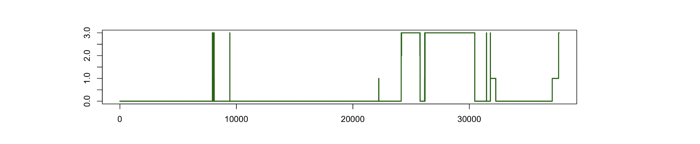

# Interval annotations

_Here we describe the formats of annotation files, how to attach them
to EDFs, and how to view and summarize their contents._


| Command  | Description |
|---|---|
| [Luna annotations](#luna-annotations) | Overview of annotations in Luna | 
| [.annot files](#annot-files) | `.annot` file format (_the preferred Luna annotation format_) |
| [.eannot files](#eannot-files) | `.eannot` file format |
| [NSRR XML files](#nsrr-xml-files) | NSRR XML annotation files |
| [`--xml`](#-xml) & [`--xml2`](#-xml2) | View NSRR XML annotation files |
| [`REMAP`](#remap) | Apply annotation remappings after loading | 
| [`ANNOTS`](#annots)       | Tabulate all annotations |
| [`MAKE-ANNOTS`](#make-annots) | Make new annotations |
| [`WRITE-ANNOTS`](#write-annots) | Write annotations as `.annot` or `.xml` |
| [`META`](#meta) | Add meta-data to annotations |
| [`SPANNING`](#spanning)   | Report on _coverage_ of annotations |
| [`ESPAN`](#espan) | Epoch-based annotation coverage | 			    
| [`A2S`](#a2s)  | Add a 0/1 signal based on an annotation |
| [`S2A`](#s2a)  | Add an annotation based on ranged values of a signal |
| [`ALIGN-ANNOTS`](#align-annots) | Align epochs (paired with `ALIGN-EPOCHS`) | 


## Luna annotations

Annotations are a key part of Luna, and in combination with the
[`MASK`](masks.md#mask) command and so-called [_eval_
expressions](evals.md), provide a flexible way to manipulate EDFs.
 
Luna can represent a number of different types of annotation.
Annotations may be represented as arbitrary intervals of time (defined
with respect to the start of the EDF), or can be specified at the
per-epoch level in a number of ways.  First, we introduce some terminology:

A _class_ of annotations is a set of arbitrary time intervals
(e.g. such as "spindles")

Each _instance_ of a _class_ (e.g. one particular spindle) is defined
by a time interval and an identifier (which may or may not be unique).

Optionally, each _instance_ can also have associated meta-data, stored
as typed key/value pairs.

This table summarizes these levels of annotation:

| Type | Level | Example concept | Specific example |
| ---  | ---- | --- | --- | 
| _class_ name | Generic set of annotations   | All spindles |     `spindles` |
| _instance_ | Specific instance of a _class_<br> defined by a time interval | A single spindle |  873.2 to 874.1 seconds | 
| _instance_ names | ID (or non-unique label) for each instance | Spindle number <br>(or type of spindle) | `spindle-1, spindle-2`, ... <br>(or `fast-spindle`, `slow-spindle`) | 
| _instance meta data_ | Associated information | Duration, amplitude, etc,<br> for an individual spindle | `dur=0.88` `amp=12.2` `frq=11.1` |

Annotations can be represented in a number of different file formats, all described below:

- [`.annot`](#annot-files) files, where each row describes an event/interval and any associated meta-data (including times, channels, etc)
- [`.eannot`](#eannot-files) files containing simple per-epoch labels, where each distinct label is treated as a distinction annotation _class_ 
- [EDF+ Annotations](#edf-annotations-channel), where annotations are embedded in the EDF as separate channels
- [Luna-format XML](#luna-xml-files) files 
- [NSRR-format XML](#nsrr-xml-files) files, where each _ScoredEvent_ parent node in one XML is treated as a distinct annotation _class_

!!! note 
    Currently masks only operate on _class_ and _instance_ level
    data, not _meta-data_. That is, annotation _meta-data_ is currently
    not used by Luna.
    Also, including or excluding certain annotations with the
    [`annot`](../luna/args.md#selecting-annotations) option works at the _class_ level
    only.  That is, either all _instances_ of a given _class_ are
    loaded in, or none are.

## .annot files 

_Generic annotation files_

This is the preferred (and most flexible) annotation format for
generic event/interval-based annotations. These are text-based,
tab-delimited files that containing _interval-level_ annotations.

!!! note
    `.annot` files should be plain-text but need not have the
    `.annot` file extension.  Any annotation file that is neither
    `.xml` nor `.eannot` is assumed to be of generic `.annot`
    file format.

An `.annot` file can describe one or more annotations _classes_. Each
class can have one or more _instances_, where each _instance_
corresponds to an interval of time and a single row of the `.annot`
file.

The standard `.annot` specification involves at least six
tab-delimited fields (optionally allowing whitespace delimiters
instead). There are numerous options and alternatives the supplement
this basic format, as outlined below:

 - [Column formats](#columnformats) : full (six-column) versus reduced (3 or 4 column) formats
 - [Headers](#headers) : optional rows prior to data rows
 - [Time-encoding specifications](#time-encoding) : different ways to specify the start/stop times of intervals/events

### Columns

The standard definition specifies at least six fields, as described below.

The full (internal) representation of annotation data as is follows:

| Column | Description | Default |
|---- | ---- | ---- | 
| `class` | Annotation class | Required |
| `instance` | Instance ID | If not used, specify `.` |
| `channel` | Channel(s) | If not applicable, specify `.` |
| `start` | [Start time](#time-encoding) | Required: see [time-encoding specifications](#time-encoding) below |
| `stop` | [Stop time](#time-encoding) |  See [time-encoding specifications](#time-encoding) below |
| `meta` | [Meta-data](#meta-data) | Values or key-value pairs; if not present, specfiy `.` |

This six-column format is the recommended format, and is what is
written (by default) by `WRITE-ANNOTS`.

__Extra fields:__  any additional fields (seven onwards) are interpreted as additional
_meta-data_ values, i.e. conceptually the same as the _key=value_ pairs in the sixth
`meta` column, but allowing for a different format, as described below.

__Reduced forms:__  For convenience, Luna also allows reduced __3-column__ and __4-column variant formats__
that skip certain columns. If only four columns are present, they must be as follows:

| Column | Description | Default |
|---- | ---- | ---- | 
| `class` | Annotation class | Required |
| `instance` | Instance ID | If not used, specify `.` |
| `start` | Start time | Required: see [time-encoding specifications](#time-encoding) below |
| `stop` | Stop time |  See [time-encoding specifications](#timeencoding) below |

If only three columns are present, they must be as follows:

| Column | Description | Default |
|---- | ---- | ---- | 
| `class` | Annotation class | Required |
| `start` | Start time | Required: see [time-encoding specifications](#timeencoding) below |
| `stop` | Stop time |  See [time-encoding specifications](#timeencoding) below |

At its 3-column minimal, the `.annot` format is simply an annotation class and start/stop times: e.g.
```
annot1   10.20    12.50
```

In this example, this _data-rows_ specifies an annotation of class
`annot1` that starts at 10.2 seconds (elapsed time from EDF start) and
lasts 2.3 seconds, ending at 12.5 seconds.

Technically, a single annotation file can contain different rows with
different variants of these 6/4/3 column formats: we do not advise
this, however, as it means that the file will not be easily readable
by tools such as R that expect regular formats (although a regular
version can be easily generated with `WRITE-ANNOTS`).

Rows with 1, 2 or 5 columns will be reported as errors.  Further, if
there is a header field that specifies additional _tabular meta-data_
columns (i.e. columns 7 onwards), then all rows must have the same
number of fields as specified in the header.

### Headers

Optionally, `.annot` files can have multiple header rows (the _preamble_) that define the
classes in that file.  Each of these header rows starts with a `#` character and
contains between one to three `|`-delimited fields, which are class
_name_, _description_ and _meta-data types_ respectively. For example

```
# a1 
# a2 | Unlike the first, this annotation has a description field
# a3 | This one also specifies meta-data types | val1[txt] val2[num] val3[bool]
```

In the contrived example above, there are three annotation classes:
`a1`, `a2` and `a3`.  Only `a2` and `a3` have description fields. If
an annotation class includes [meta-data](#meta-data) (i.e. `a3`), it
must be first defined in a header row.


Optionally, `.annot` files can also contain a second type of header row, 
prior to any _data-row_, which specifies and labels the subsequent columns.
_If_ this row exists, it must __exactly__ conform to one of the following
(which also acts as an internal check on the ordering of columns and
general correctness of the file):

For the six-column format:
```
class  instance  channel  start  stop  meta
```
For the four-column format:
```
class  instance  start  stop
```
For the three-column format:
```
class  start  stop
```

If including optional tabular meta-data fields (columns 7 onwards), those labels can be
any unique valid key labels (e.g. no special characters or spaces, etc): for example,
here we add three extra meta-data tags with keys `AMP`, `dur_sec` and `F1`:
```
class  instance  channel  start  stop  meta   AMP   dur_sec   F1
```

As noted above, It is advised that subsequent data rows adopt the same column format.
This then allows R (or other packages) to read the `.annot` file as a
tab/whitespace-delimited table, with the columns given these variable
names, e.g. using the `read.table()` function.  As, by default,
`read.table()` ignores comment lines beginning with `#`, this will
skip the preamble:

```
d <- read.table( "file.annot" , header=T )
```

### Time encoding

The `.annot` file recognizes various ways to specify start and stop
times for each annotation. These formats can be mixed-and-matched
within a single `.annot` file.

 - __Elapsed seconds:__ this is the default - any numerical value is
   interpreted as seconds elapsed relative from the EDF start time
   (i.e. as specified in the EDF header)

 - __Clock-time:__ any times with the format _hh:mm:ss_ or _hh.mm.ss_
   are assumed to be 24-hour clock-times. These can include fractions
   of a second, e.g. `23:03:01.524` (which is also the same as
   `23.03.01.524`, i.e. if the EDF `.` character is used to delimit
   hours, minutes and seconds insted of the colon (`:`) character). It is also possible to
   specify dates as well as clock-times, i.e. as is necessary for long recordings, [see below](#date-encoding)

 - __Elapsed hh:mm:ss:__ any time starting `0+` is assumed to be an
   elapsed time specified in _hh:mm:ss_ format rather than a
   clock-time, e.g. `0+00:00:30`, `0+00:01:00` corresponds to 30 and
   60 seconds past the EDF start

 - __Epoch-encoding:__ instead of elapsed or clock times, it is also
   possible to specify start and stop times in terms of epochs by
   starting entries with the `e` character: see below for more details
 
Further, __stop times__ can take one of two additonal encodings: 

 - __Durations:__ if the stop time starts with `+` it is interpreted
   as the duration of the interval, rather than the end.  This can be
   used for any type of start time (elapsed seconds or
   clock-time). i.e.

 ```
 annot1   10.00   +5
 ```
 is the same as
 ```
 annot1   10.00  15.00
 ```

 - __Until next annotation:__ if the stop time is an ellipsis (`...`), this means that this annotation spans until the start of the next annotation _listed in that file_ (or the end of the EDF, if this is the last row).   Naturally, this assumes the annotation in the next row starts after the start of the current row.  This can be convenient if only changes in sleep stage are specified at irregular intervals: i.e. 
 ```
 annot1   10.00   ...
 annot1   15.00   ...
 annot2   22.00   30.30
 ```
 is the same as
 ```
 annot1   10.00   15.00
 annot1   15.00   22.00
 annot2   22.00   30.00
 ```


<h5>Order of annotations</h5>

The order of annotations is generally irrelevant in `.annot`
files. (The one exception is when using the `...` stop-time encoding,
which relies on the next row in that same file, irrespective of what
annotation class it is, or whether there is another intervening
annotation elsewhere in the file).

Luna can read from multiple annotation files for a given individual;
further, the same annotation classes can be present in more than one
file.  Internally, all annotations will be merged into a single set of
annotations, irrespective of which file they were read from.


<h5>Interval encoding</h5>

Intervals are defined to be inclusive of the _start_ but exclusive of
the _stop_, i.e. the interval from _a_ to _b_ is _[a,b)_.  In other
words, _b_ is the first point just past the end of the interval. Interval
duration is therefore defined as _b-a_.  This means that two 30-second
epochs specified below are non-overlapping epochs: rather, they are
contiguous despite `30.00` appearing in both definitions:

``` 
class1	interval1   0.00 30.00 
class1 	interval2  30.00 60.00 
``` 


<h5>Epoch encoding</h5>

_Epoch encoding_ is provided as a convenience feature as many
annotations are in fact specified in terms of regular-sized epochs and
it might be awkward to always have to list the start and stop times of
each epoch.  These codes (that start with the characters `e:` to
distinguish them from times in seconds) are converted to the
equivalent _interval_ when reading the file. 
 
If the value in the start or stop column begins with the characters
`e:`, then Luna assumes that epoch-notation is being used to specify the
interval.  By default, Luna assumes non-overlapping 30-second epochs,
whereby `e:1`, `e:2`, `e:3`, etc, refer to the first, second, third,
etc, epochs.   If the stop column also starts `e:` then Luna assumes the interval is 
from the start for the first epoch to the end of the second epoch.  Otherwise, the stop column
should be set to missing (`.`) 

For example, the following three lines specify identical intervals:
```
class1       instance1       0        30
class1       instance1       e:1      .
```
Similarly, these two lines are equivalent to each other:
```
class1       instance1       30       120
class1       instance1       e:2      e:4
```

Different epochs definitions can be specified by explicitly appending the epoch
duration (in seconds) and increment (in seconds) as colon-delimited
values, as shown in the Table below.  

| Example | Description | Implied interval (sec) |
| ---- | ---- | -----|
| `e:2` | Second epoch; non-overlapping 30-second epochs | _[30.0,60.0)_ |
| `e:2:20` | Second epoch; non-overlapping 20-second epochs | _[20.0,40.0)_ |
| `e:2:30:15` | Second epoch; 50% overlapping 30-second epochs | _[15.0,45.0)_ |

If not specified, the increment is assumed to be the same as the epoch
duration, i.e. no overlap of consecutive epochs.

!!! note 
    As epochs are defined within the `.annot` file itself, the
    actual EDF need not be epoched (i.e. from the
    [`EPOCH`](epochs.md#epoch) command). In fact, the EDF may even
    have epochs of a different duration specified. Also, unlike
    [`.eannot`](#eannot-files) files, not every epoch needs to be
    specified in an `.annot` file, i.e. if there are 1200 epochs, you
    do not need to have exactly 1200 rows in this file. This is
    because instances specified with epoch-encoding are automatically
    converted to interval-encoding upon loading.


<h5>Time resolution and floating-point accuracy</h5>

By default, Luna rounds all times read in annotation files to seconds
with 4 decimal places. This level of temporal resolution (which should
be sufficient for all PSG/EEG contexts) is imposed in order to avoid
precision issues that are inherent in representing floating-point numbers digitally.

That is, unlike integers, many real number do not have an exact
internal floating-point representation: for example, 15.24 seconds may
internally be represented as 15.23333333333339 or (depending on the
platform or what prior conversions were done) 15.2400000000001, etc.
Internally, Luna uses a 64-bit integer time-track (in which each
time-point by default reflects 1e-9 seconds) to determine, e.g.,
whether intervals overlap or not.  In both cases, 15.23333333333339
and 15.2400000000001 will therefore be mapped to the same time-point
up to 4 decimal places accuracy: i.e. `15240000000` rather than
`15239999999`, etc.  This makes downstream handling of intervals more
robust.


### Date-encoding 

When using _clock-time_ encoding, it is also possible to specify dates. The default
form uses _European_ date format (following EDF specifications) and so expects
something in the form _dd-mm-yy-hh:mm:ss_, i.e. `31-12-99-23:59:59`.

__Delimiters:__ Alternatively, one can use `/` for the date, and/or a space instead of
`-` to separate the date and time, e.g. `31/12/99 23:59:59`.

__Month labels:__ it also also allowed to use the following
three-character codes (case-insensitive) instead of the numbers 1
through 12: `Jan`, `Feb`, `Mar`, `Apr`, `May`, `Jun`, `Jul`, `Aug`,
`Sep`, `Oct`, `Nov` and `Dec`.

__M/D/Y and Y/M/D formats:__ By setting the [special
variable](../luna/args.md#special-variables) `date-format` to either
`MDY` or `YMD` (versus the default value of `DMY`) you can instruct
Luna to assume these alternate date formats.  Note, this implies that _all_ annotation
files will have the same date format.   All outputs (e.g. from `WRITE-ANNOTS` or `HEADERS` etc, will
always use European formats for dates, however.    Although the EDF specification requires European dates
in the EDF header, if this is wrongly specified, you can use `edf-date-format` with the same convention.

__Day offsets:__ Alternatively, you can use the special codes `d1`,
`d2` etc in place of a full date to mean the first day, second day,
where day one is specified by the start date in the EDF header.

If a date is too far from the EDF start date (e.g. 100 days), the Luna
will give an error.  Annotations that start _before_ the EDF start
date will be ignored.


### Data rows

Subsequent _data_ rows of the `.annot` file specify instances of one
of these three classes, along with the necessary meta-data in the case
of `a3`. For example, in six-column format, the full file might read:

```
# a1 
# a2 | Unlike the first, this annotation has a description field
# a3 | This one also specifies meta-data types | val1[txt] val2[num] val3[bool]
class  instance  channel   start    stop     meta
a1     i1        .         10.00    15.00    .
a1     i2        .         92.10    105.22   .
a1     i3        .         108.5    123.11   .
a2     .         .         e:2      .        .
a2     .         .         e:7      .        .
a2     .         .         e:10     e:12     .
a3     A         C3        0        +30      W;0.88;Y
a3     A         C3,C4     30       +30      W;0.98;Y
a3     B         C4        60       +30      N1;0.23;N
```

That is, each _data_ row specifies one annotation of the previously
defined classes `a1`, `a2`, and `a3`.

- first column: _class name_ matches one of the header rows (i.e. `a1`, `a2` or `a3` in this example); if a new class is encountered, it is added on-the-fly
- second column: _instance ID_ that can be unique or not with respect to its annotation class (or even missing, as for `a2`)
- third column: _channel IDs_ can be optinally specified, if they are relevant. e.g. for events detected on a given channel(s).
- fourth and fifth column(s): these define the interval for this annotation instance, as described above
- sixth column: either missing (period, `.`) or, if the header specified _meta-data_ for that annotation _class_ (as for `a3` above), then these must be listed in a pipe-delimited format, in
  the same order as they were declared in the header/preamble.  

As noted above, this example also uses different ways to specify start/stop times. You can mix and match these different formats with the same annotation
class. (In the example above, we map them to `a1`, `a2`, and `a3` simply to make the example clearer.)

The same information could also be represented in a reduced format (i.e. without header rows or extra columns) but of course some information would be lost (e.g. meta-data and channels for `a3`, and instance IDs):

```
a1   10.00    15.00
a1   92.10    105.22
a1   108.5    123.11
a2   e:2      .
a2   e:7      .
a2   e:10     e:12
a3   0        +30
a3   30       +30
a3   60       +30
```

### Meta-data

Meta-data are _typed_ user-defined attributes of individual annotation
instances.  For example, annotations for spindle events may have an
_amplitude_ or _frequency_ meta-data attribute. The `.annot` format
provides a few ways to specify annotation meta-data, in column six (or
beyond):

 - __key-value pairs:__ this is the default used by `WRITE-ANNOTS`, to specify meta-data as `key=value` pairs in the sixth `meta` field.

 - __values:__ if a full [header](#headers) has been specified with meta-data fields, then values in the sxith `meta` field are assumed to correspond to those tags, as shown below

 - __tabular meta-data:__ given a header row that specifies columns beyond the sixth, values in those columns are treated as meta-data

That is, here are the three ways of specifying the same information: _key-value pairs_, which don't require any prior specification of the types:

```
a   .   .   10    20   v1=abc;v2=22
a   .   .   20    30   . 
b   .   .   40    80   . 
```

Stating the meta-fields in the extended header that describes annotation class `a`:
```
# a | annotation 'a' | v1[txt] v2[num]
...
a   .   .   10    20   abc;22
a   .   .   20    30   .    (?? check) 
b   .   .   40    80   . 
```

Third, as _tabular meta-data_ where the standard header row specifies the fields (which must be defined explicitly as missing for all annotation classes):
```
class instance channel start stop meta  v1    v2
...
a     .        .       10    20   .     abc   22
a     .        .       20    30   .     .     .
b     .        .       40    80   .     .     . 
```


As illustrated above, in the original example the `a3` class also expects some _meta-data_ for
each _instance_: three variables named `var1`, `var2` and `var3`, each with a specified _type_.

<h5>Meta-data types</h5>

The following types are currently available in Luna:

| Type | Description |
| ---- | ---- | 
| `num` | Numeric (i.e. any floating point number) |
| `int` | Integer |
| `bool` | Boolean yes/no, true/false (with values `y`, `yes`, `Y` or `1` versus `n`, `N`, `no` or `0`) |
| `txt` | Any text string |

Types can be defined on a file-by-file basis in the header rows, as
described above.

You can also explicitly set meta-data keys to a given with the options
`num-atype`, `int-atype`, `txt-atype` and `bool-atype`, all of which
take a comma-delimited list of key labels.  These apply to all files. 

If no type if specified, all annotations are assumed to be
numeric. This behavior can be changed by setting the special variable
`annot-meta-default-num` to `F`.

Meta-data types primarily matter only for the [DERIVE](evals.md#derive) command currently.


<h5>Formats</h5>

Key-value meta-data should be delimited by either `;` or `|` characters.   e.g.

```
a   .   .   10    20   v1=abc;v2=22
a   .   .   20    30   v1=ced|v2=33
```

These defaults can be changed with the `annot-meta-delim1` and `annot-meta-delim2` special options. 

The assignment symbol (which is `=` by default) can also be changed
(but has to be a single character): e.g. `annot-keyval=:` to allow

```
a   .   .   10    20   v1:abc;v2:22
a   .   .   20    30   v1:ced|v2:33
```

Note that these options apply to _all_ annotations files read: if you
have a mixture of formats, you should use `WRITE-ANNOTS` first to make
a uniform set.


!!! Note
    Annotation meta-data are currently used only by the Luna [`META`]() and [`DERIVE`]() commands.


### Standard format

The `.annot` file is designed to support a range of input formats, for
flexibility.  As described below, no matter what the form of inputs,
any valid .annot file will be output in a more limited, standardized
manner by the `WRITE-ANNOTS` command, [as described
below](#write-annots).


## .eannot files 

This is the simplest format for epoch-level annotations.  Epoch
annotations in `.eannot` files are simple labels attached to
individual epochs.  The format is as follows:

- one row per epoch
- each row contains a single label, that is attached to that epoch
- for each distinct label in the file, a new annotation _class_ is generated
- each _instance_ is assigned the same ID as the label name (i.e. same as the _class_ name)

When an `.eannot` is specified in the
[_sample-list_](#../luna/args.md#sample-lists), it is attached prior
to loading the EDF.  By default, Luna assumes epochs are 30-seconds in
duration and do not overlap when using `.eannot` files.

!!! hint
    To work with `.eannot` files but use different epoch definitions, you have three options: 

    1. use the [`EPOCH`](epochs.md#epoch) and
    [`EPOCH-ANNOT`](epochs.md#epoch-annot) commands to attach the file
    _after_ initially attaching the EDF (i.e. instead of specifying
    the `.eannot` file in the sample-list)

    2. Set the special variable
    [`epoch-len`](../luna/args.md#epochs-and-sleep-staging) variable if the `.eannot`
    is specified in the sample list (i.e. and so loaded when the EDF
    is first attached, prior to running any `EPOCH` command)
    
    3. Use the `e:` epoch encoding notation in a generic `.annot` file instead, as described above.


Unlike other types of annotation, these can be loaded via a Luna
command, [`EPOCH-ANNOT`](epochs.md#epoch-annot), potentially _after_
the EDF has been loaded and manipulated.  In that case, i.e. when using the
`EPOCH-ANNOT` command, the number of rows (epochs) in the `.eannot`
file must match the number of epochs that currently exist in the
in-memory representation of the EDF (i.e. which may be different from
the on-disk version).

A common use of an `.eannot` file could be to store manually-scored sleep stages: 

```
wake
wake
N1
N1
wake
N1
N1
N2
N2
... (etc) ...
```
where the number of rows of this file corresponds to the number of 30-second epochs in the EDF.  One could then use these annotations in a [`MASK`](masks.md#mask) command, such as:
```
MASK if=wake
RESTRUCTURE
```
to exclude `wake` epochs from analysis.


## Luna XML files

Luna uses a version of the NSRR annotation format that is similar to
the NSRR XML format, but is designed to be completely interchangeable
with the `.annot` format. This is the format generated by the
[`WRITE-ANNOTS`](#write-annots) command when the `xml` option is
specified.

First, the preamble, with all information encapsulated in an `Annotations` parent node:

```
<?xml version="1.0" encoding="UTF-8" standalone="no"?>

<Annotations>

 <SoftwareVersion>luna-v0.25</SoftwareVersion>

 <StartTime> xxx </StartTime>
 <Duration> xxx </Duration>
 <DurationSeconds> xxx </DurationSeconds>
 <EpochLength>30</EpochLength>
```

Second, the definition of each annotation class present in the `Classes` and `Class` tags:

```
<Classes>

<Class>
   <Name>Annotation Class Name</Name>
   <Description>Annotation Description</Description>
    <Variable name="name1" type="num">Numeric variable label</Variable>
    <Variable name="name2" type="num">Numeric variable label</Variable>
    <Variable name="name3" type="num">Numeric variable label</Variable>
</Class>

</Classes>
```

Finally, each instance is listed in the next `Instances` and `Instance` tags:

```
<Instances>

 <Instance>
  <Class>Recording Start Time</Class>
    <Name>Recording Start Time</Name>
    <Start>0</Start>
    <Duration>32820.0</Duration>
    <Channel>Optional channel label(s)</Channel>
    <Value var="name1">0.1</Value>
    <Value var="name2">0.2</Value>
    <Value var="name3">0.3</Value>
 </Instance>

</Instances>

</Annotations>
```


## NSRR XML files

Luna accepts [XML](https://en.wikipedia.org/wiki/XML) annotation
files, as used by the [National Sleep Research
Resource](http://sleepdata.org).  These are based on Compumedics
Profusion files, as described
[here](https://github.com/nsrr/edf-editor-translator/wiki/Compumedics-Annotation-Format).
Any files that end in a `.xml` or `.XML` extension are assumed to be
in this format, and Luna will attempt to read it as an annotation
file. Luna maps each _ScoredEvent_ node to a single annotation
_class_.


## `--xml`

To quickly view the _Scored Events_ in a single NSRR `XML` file (sorted by clock time):

```
luna --xml my-annotations.xml
```
```
.    .	    EpochLength	30
0 - 30	    (30 secs)	SleepStage	Wake
30 - 60	    (30 secs)	SleepStage	Wake
60 - 90	    (30 secs)	SleepStage	Wake
90 - 120    (30 secs)	SleepStage	Wake
120 - 150   (30 secs)	SleepStage	Wake
150 - 180   (30 secs)	SleepStage	NREM1
180 - 210   (30 secs)	SleepStage	Wake
210 - 240   (30 secs)	SleepStage	Wake
... (etc) ...
```

## `--xml2`

Alternatively, use `--xml2` to report _all_ entries in any XML, along
with the full, original XML document tree structure:


## EDF+ Annotations

<!---
for -s ' MASK ... '
  note c( 'aa' , 'bb' )   is same as c( {aa} , {bb} ) "
  can use { and } instead of ', when can be convenient if using -s on the command line
--->


Using a test EDF+ file that contains some annotations
(one posted on Teunis van Beelen's website, which can be accessed [here](https://www.teuniz.net/edf_bdf_testfiles/)), 
Luna will automatically extract the annotations (by convention, from channels named `EDF Annotations`) and include 
these alongside any other annotations (e.g. from XML or `.annot` files).  For this example EDF+ file:

```
luna ma0844az_1-1+.edf -o out.db  -s ANNOTS
```
The console output notes that an `EDF Annotations` channel is present, and is being extracted:
```
 signals: 38 (of 38) selected in an EDF+ file:
  EEG_FP1 | EEG_FP2 | EEG_F3 | EEG_F4 | EEG_C3 | EEG_C4 | EEG_P3 | EEG_P4
  EEG_O1 | EEG_O2 | EEG_F7 | EEG_F8 | EEG_T3 | EEG_T4 | EEG_T5 | EEG_T6
  EEG_FZ | EEG_CZ | EEG_PZ | EEG_E | EEG_PG1 | EEG_PG2 | EEG_A1 | EEG_A2
  EEG_T1 | EEG_T2 | EEG_X1 | EEG_X2 | EEG_X3 | EEG_X4 | EEG_X5 | EEG_X6
  EEG_X7 | DC01 | DC02 | DC03 | DC04 | EDF Annotations
  extracting 'EDF Annotations' track
```
Further, the log also notes the number of annotations, 41 in this case:

```
 annotations:
  edf_annot (x41)
```

By default, note that all annotations from an EDF+ file are assigned the
_annotation class_ of `edf_annot`; the _annotation instance_ ID is
assigned to whatever value is present in the EDF+ (annotation instance
IDs need not be unique).  See above for a description of annotation
_class_ versus _instances_.

!!! hint "Assigning class-level annotations from EDF+ explicitly"

    Exceptions to the rule can be added with the `edf-annot-class` special variable, to give a list of annotations that are their own _classes_: e.g. 

    ``` 
    luna ma0844az_1-1+.edf -o out.db edf-annot-class=HVT_START,HVT_END -s ANNOTS 
    ```

    The console now shows these explicitly listed:
    ```
    annotations:
      HVT_END (x1) | HVT_START (x1) | edf_annot (x39)
    ```
    This means they will be separately represented in the `ANNOTS` output, and can more easily be used as annotations in 
    masks, etc.   Typically this might be done to pull out sleep stage annotations: e.g. to pull out stages from an EDF+
    (assuming these are the labels) and save as a simple `.annot` file:

    ```
    luna edfplus.edf edf-annot-class=N1,N2,N3,R,W,? \
         -s ' WRITE-ANNOTS file=a.annot annot=N1,N2,N3,R,W,? '
    ```
    Subsequently, one would likley then add `skip-edf-annots=T` as a special variable to ignore annotations from an EDF+ 
    that have already been extracted to a separate file and attached (and linked via a sample-list to the original EDF+).  
    It can be slow to scan an entire EDF+ to pull out 
    annotations, and so performing these steps initially (i.e. to extract all desired annotations as an `.annot`) is 
    the best workflow in Luna.

If the `verbose` special variable is set to true, then (surprisingly...) you'd see more verbose output
in the log, that lists some of these _instance_ IDs too:
```
 annotations:
  [edf_annot] 41 instance(s) (from ma0844az_1-1+.edf)
   36 instance IDs:  A1+A2_OFF HVT_00:30 HVT_01:00 HVT_01:30 HVT_02:00 ...
```

The `ANNOTS` command can be used to tabulate these annotations.  

```
luna ma0844az_1-1+.edf -o out.db  -s ANNOTS
```

```
destrat out.db +ANNOTS -r ANNOT INST T
```

(nb. below, omitting some columns for clarity of output, and just listing the first three annotations:)
```
ANNOT     INST              START START_ELAPSED_HMS START_HMS
edf_annot PAT_IIB_EEG       0     00.00.00          10.18.42
edf_annot REC_START_IIB_CAL 0     00.00.00          10.18.42
edf_annot A1+A2_OFF         1     00.00.01          10.18.43
...
```

For each annotaton that _start_ (and _stop_) times are given: in seconds elapsed since start of the EDF (`START`), 
the same information but in _hh:mm:ss_ format (`START_ELAPSED_HMS`) and as clock-time (`START_HMS`).

!!! note "Spaces in annotation labels"
    In the original EDF+, the annotation labels are actually `PAT IIB
    EEG`, `REC START IIB CAL`, etc.  Note that Luna has autoamtically
    converted spaces to underscore characters (`_`), to make working
    with these annotations easier on the command line (i.e. `PAT_IIB_EEG`, etc).   If for some reason this was 
    not desired, set the special variable `keep-annot-spaces=T` (or `keep-spaces=T` to do
    this for both channel and annotation labels.

Luna [masks](masks.md#masks) typically refer to annotation _class_ labels to work, but can also use annotation _instance_ identifiers, which
will typically be necessary with EDF+ annotations (i.e. unless every annotation in the EDF meant the same thing, in which case the `edf_annot` 
class label could be used). 

For example, we see overall this EDF+ is just over 30 minutes in duration, so 60 30-second epochs:
```
Processing: ma0844az_1-1+.edf [ #1 ]
 duration: 00.30.18 ( clocktime 10.18.42 - 10.49.00 )
```

We'll use two of the annotations in this file to extract only the
epochs containing those annotations: `HVT_00:30` and `HVT_01:00`,
which occur at `00.21.32` and `00.22.02` (elapsed time) respectively,
as one can see from looking at the full output as the above `ANNOTS`
command, for example.


To mask epochs based on these two labels, we can use the following, using the 
```
 class[instance|instance]
```
form (i.e. with instance IDs are specified as a `|`-delimited list, within square brackets `[` and `]` following the class ID).

``` 
luna ma0844az_1-1+.edf -o out.db  -s  ' MASK mask-ifnot=edf_annot[HVT_00:30|HVT_01:00] '
```


!!! note "Using eval expressions instead"
    This is a digression, but to illustrate a difference way to use Luna masks in this instance, 
    and to point to a common problem/solution.  Instead of the above form, to mask epochs based on these two labels, we could also use the following:

    ```
    luna ma0844az_1-1+.edf 
       -o out.db  
       -s ' MASK expr=" edf_annot =~ c( {HVT_00:30} , {HVT_01:00} ) " '
    ```
    ```
     CMD #1: MASK
     options: expr=" edf_annot =~ c( {HVT_00:30} , {HVT_01:00} ) " sig=*
     set epochs, to default length 30, 60 epochs
      set masking mode to 'force'
       based on eval expression [edf_annot =~ c( {HVT_00:30} , {HVT_01:00} )]
       2 true, 58 false and 0 invalid return values
       2 epochs match; 2 newly masked, 0 unmasked, 58 unchanged
        total of 58 of 60 retained
    ```

    Expressing the above `MASK` command on the command line in this way, we used `-s` to write it out.  To stop the (bash) shell from interpreting special characters that
    can often occur (e.g. `&` to separate Luna commands) we
    placed all text within single quotes (`'`).  We also had to place the eval expression with double quotes, so that Luna could correctly parse the entire expression.
    This means we could not also use single quotes easily to specify string literals on the command line (e.g. `HVT_00:30`).  We therefore used Luna's alternate way of
    specifying string literals in eval expressions, using braces `{` and `}` -- so we have:    
    ```
    edf_annot =~ c( {HVT_00:30} , {HVT_01:00} )     
    ```
    instead of:
    ```
    edf_annot =~ c( 'HVT_00:30' , 'HVT_01:00' )     
    ```
    Note that if the whole command was in a separate file (rather than following `-s` and therefore already enclosed in single quotes), 
    we would be able to use this second (more readable) form.   Neither quotes nor braces are needed in the simpler format first given above.


## REMAP

_Remap annotation labels after loading_

This command replicates the functionality of the [`remap`](#../luna/args.md#remapping-annotations) command, but can be applied _after_
a dataset is first attached.  It also allows for some flexibility in the format of the remapping file.

<h3>Parameters</h3>

|  Parameter | Example | Description |
| --- | --- | --- |
| `file` | `f1.txt` | Required file with mappings |
| `remap-col` | `T` or `F` | Optionally, specify whether a `remap` column is present |  
| `optional-remap-col` | | Allows but does not require a `remap` column | 
| `allow-spaces` | | Optionally, allow space as well as tab delimiters |
| `verbose` | | Verbose output to the console | 

<h3>Output</h3>

No direct output, except for messages to the console log if `verbose` is specified.

Any remappings will be available for output via the [`ALIASES`](summaries.md#aliases) command however.

<h3>Example</h3>

If `f.txt` is a tab-delimited file containing:
```
remap    A|B|C
remap	 Y|Z
```

then the following command would map any annotations `B` or `C` to
`A`, and any annotations `Z` to `Y`:

```
luna s.lst -s ' REMAP file=f.txt remap-col=T & ANNOTS ' 
```

This is equivalent to _including_ the file as follows:
```
luna s.lst @f.txt -s ' ANNOTS ' 
```

Alternatively, if `f.txt` was instead space-delimited and as follows:
```
A B|C
Y Z
```
then
```
luna s.lst -s ' REMAP file=f.txt remap-col=F allow-spaces & ANNOTS '
```
would have the same effect as above.   It is also possible to write `f.txt` as:
```
A|B|C
Y|Z
```
In all cases, `A` and `Y` will be the primary annotation labels used.

Standard rules apply with respect to spaces, capitalization and
special characters (i.e. this is not case-sensitive by default, etc)


## ANNOTS

_Tabulate and summarize annotation information_ 

Produces information about the number and total duration of
annotations in an EDF, at the whole-file level and optionally per-epoch.

By default, `ANNOTS` will only show annotations that span at least one
unmasked epoch. The definition of whether or not an annotation
instance is masked or not can be varied.  Depending on the context,
this can be useful to generate different types of summaries, e.g. the
number of respiratory events in REM versus NREM sleep.

<h3>Parameters</h3>

|  Parameter &nbsp; &nbsp; &nbsp; &nbsp; &nbsp; &nbsp; &nbsp; | Example &nbsp; &nbsp; &nbsp; &nbsp; &nbsp; &nbsp; &nbsp; | Description |
| --- | --- | --- |
| `epoch` | `epoch` | Show epoch-level summaries | 
| `show-masked` | `show-masked` | Show masked annotations (default is not to do so) | 
| `any` | `any` | Keep annotations that have _any overlap_ with one or more unmasked epochs (default) |
| `all` | `all` | Only keep annotations that are _completely within_ unmasked epochs |
| `start` | `start` | Keep annotations that _start_ in an unmasked epoch  |

The `epoch` option lists, for each epoch, all the annotations
that overlap with that epoch, given the specified overlap definition
(`any`, `all` or `start`).  If the `show-masked` option is given as well,
all epochs and annotations are shown; otherwise, only unmasked epochs
and annotations are shown.  The output contains two variables
(`EPOCH_MASK` and `ANN_MASK`) that indicate whether a given annotation
instance is masked or not.

<h3>Output</h3>

_Class-level_ annotation summary (strata: `ANNOT`)

| Variable | Description |
| --- | --- |
| `COUNT` | Number of instances of that annotation class |
| `DUR` | Combined duration (seconds) of all instances of that annotation class (does not account for potential overlap) |

_Instance-level_ annotation summary (strata: `ANNOT` x `INST`)

| Variable | Description |
| --- | --- |
| `COUNT` | Number of instances of that annotation class and instance ID |
| `DUR` | Combined duration (seconds) of all instances of that annotation class and instance ID (does not account for potential overlap) |
 
_Instance-level_ annotation tabulation (strata: `ANNOT` x `INST` x `T`) 

| Variable | Depends on | Description |
| --- | --- | ---- | 
| `START`         |   |   Start time (seconds) of this instance | 
| `STOP`          |  | Stop time (seconds) of this instance |
| `VAL`           |  | The _meta-data_ for this instance, if any exists (otherwise missing `NA`) |
| `ALL_MASKED`    | `show-masked` | |
| `ALL_UNMASKED`  | `show-masked` |  |
| `SOME_MASKED`   | `show-masked` | |
| `SOME_UNMASKED` | `show-masked` | |
| `START_MASKED`  | `show-masked` | |


Per-epoch _instance-level_ annotation tabulation (strata: `E` x `INTERVAL` x `INST`)

| Variable &nbsp; &nbsp; &nbsp; &nbsp; &nbsp; &nbsp; &nbsp; | Depends on | Description |
| --- | ---- | ---- | 
| `ANNOT_MASK` | `epoch` | Flag whether this annotation instance is included or excluded (`1` means _masked_ or excluded) 
| `EPOCH_MASK` | `epoch` | Flag whether this epoch is included or excluded (`1` means _masked_ or excluded) 


## MAKE-ANNOTS

_Create new annotations on-the-fly_

This command makes new annotations, typically based on pairwise
comparisons of existing annotations, that are:

 - union of two annotations

 - intersection of two annotations

 - only annotations _A_ that overlap annotation _B_

 - only annotations _A_ that do not overlap annotation _B_

Also, there are special cases to

 - add annotations corresponding to epochs (and optionally, delimiting the boundaries of those epochs) (`epoch`)

 - simply add a numbered annotation corresponding to each epoch (`epoch-num`)

 - merge contiguous or overlapping annotations of a single class (`flatten`)

 - cut up longer annotations along the lines of epoch boundaries (`split`)


<h3>Parameters</h3>

Primary parameters

|  Parameter | Example | Description |
| --- | --- | --- |
| `annot` | `annot=N` | Name of the new annotation |
| `expr` | `expr=A+B` | A pairwise expression of two existing annotations `A` and `B` in form `A*B`, `A|B`, `A+B`, `A-B` |
| `epoch` | `epoch=E` | Add a flattened annotation for all epochs | 
| `epoch-num` | `epoch-num=E` | Add annotations of numbered epochs |
| `flatten` | `flatten=A` | Merge contiguous or overlapping epochs ( i.e. `A|A`)
| `split` | `split=A` | Split longer annotations into parts no longer than the underlying epochs | 

_Specify_ `annot` _and either_ `expr`, `flatten`, `split`; _alternatively, specify either_ `epoch` _or_ `epoch-num`

Pairwise expressions (arguments for `expr`)

| Expression | Description|
|---------|--------|
| `A*B`   | New annotation is the intersection of `A` and `B` (AND) |
| `A|B`   | New annotation is the union of `A` and `B` (OR) |
| `A+B`   | New annotation is events in `A` that are overlapped by `B` |
| `A-B`   | New annotation is events in `A` that are not overlapped by `B` |

Misc. options for `epoch`

| Expression | Description|
|---------|--------|
| `w` | One or more edge window sizes (seconds) |
| `collapse-edges` | Do not distinguish left and right edges |
| `edge` | Optional replacement for `edge` string for edge annotation label |


<h4>Examples</h4>


_Pairwise operations_

Staring with the four-column (headerless) annotation file `a.annot`:
```
A	.	10	20
A	.	30	40
B	.	32	38
A	.	50	60
B	.	45	65
```
The following commands would produce annotation `C` as follows: the intersection of `A` and `B`:
```
MAKE-ANNOTS annot=C expr=A*B 
```
```
class  start   stop
C      32.000  38.000
C      50.000  60.000
```
The union of `A` or `B`:
```
MAKE-ANNOTS annot=C expr=A|B
```
```
class  start    stop
C      10.000   20.000
C      30.000   40.000
C      45.000   65.000
```
Events from `A` that are overlapped by at least one `B`:
```
MAKE-ANNOTS annot=C expr=A+B
```
```
class  start    stop
C      30.000   40.000
C      50.000   60.000
```
Events from `A` that are not overlapped by any `B`:
```
MAKE-ANNOTS annot=C expr=A-B
```
```
class  start    stop
C      10.000   20.000
```

_Flattening and splitting epochs_

If `a.annot` is the following:
```
A	.	10	20
A	.	20	30
A	.	30	40
A	.	35	45
A	.	60	180
```
then
```
MAKE-ANNOTS annot=C flatten=A
```
yields
```
class   start   stop
C       10.000  45.000
C       60.000  180.000
```

Conversely, if attaching annotation `C` (as above) and running `split` to generate `S`:
```
MAKE-ANNOTS annot=S flatten=C
```
```
class start    stop
S     10.000   30.000
S     30.000   45.000
S     60.000   90.000
S     90.000   120.000
S     120.000  150.000
S     150.000  180.000
```

That is, given (default) 30-second epochs, the annotations `C` are
split at epoch boundaries to make separate events.  Note that the
second epoch only spans half an epoch (30 - 45 seconds).


_Epoch numbering_

To add a new annotation for each epoch starting `EP_`: 
```
luna s.lst -s ' MAKE-ANNOTS epoch-num=EP & WRITE-ANNOTS file=a.annot ' 
```

```
class           instance  channel  start    stop       meta
EP_0001         .         .        0.000    30.000     .
W               .         .        0.000    10020.000  .
SpO2_artifact   .         SpO2     17.300   56.400     .
EP_0002         .         .        30.000   60.000     .
EP_0003         .         .        60.000   90.000     .
EP_0004         .         .        90.000   120.000    .
EP_0005         .         .        120.000  150.000    .
...
```

_Epoch annotations_

To demonstrate using `epoch`:  for this EDF, when run on a standard (gapless) EDF it will
give a single annotation that encompasses all epochs:

```
MAKE-ANNOTS epoch=E
```
```
class  start   stop   
E      0.000   41220.000
```
Here, the EDF duration happens to be exactly 41220 seconds (i.e. a multiple of 30 seconds) but if
the EDF duration was (e.g. 5 seconds longer), then that additional 5 seconds would not be spanned by
an epoch (assuming standard, non-overlapping 30-second epochs): in that case, the `E` annotation would
still reflect the same as above (i.e. 41220, not 41225 seconds duration).

If the EDF had gaps, this would be reflected in multiple `E` annotations:
```
MASK epoch=1-10,100-200 & RE & MAKE-ANNOTS epoch=E
```
```
class  start     stop
E      0.000     300.000
E      2970.000  6000.000
```

Considering a second scenario with more complex epoch structure:
as a demonstation, we select the first 30 seconds of an EDF and then
set 7-second epochs with 2-second increment, followed by `MAKE-ANNOTS epoch`: 
```
MASK epoch=1 & RE & EPOCH len=7 inc=2 & RE & MAKE-ANNOTS epoch=E
```
```
class   start   stop
E       0.000   29.000
```
This spans 0 to 29 seconds, reflecting the epoch structure.  To confirm, we
could add `verbose` to the `EPOCH` command as described [here](epochs.md#epoch);
alternatively, here we can use `MAKE-ANNOTS epoch-num` to make new annotations corresponding
to each epoch:
```
class   start   stop
E_0001  0.000	7.000
E_0002  2.000	9.000
E_0003  4.000	11.000
E_0004  6.000	13.000
E_0005  8.000	15.000
E_0006  10.000	17.000
E_0007  12.000	19.000
E_0008  14.000	21.000
E_0009  16.000	23.000
E_0010  18.000	25.000
E_0011  20.000	27.000
E_0012  22.000	29.000
```
i.e. this shows the total epoch span to 0 to 29 seconds.

_Other options for `epoch`_

As secondary options (designed for some niche use cases, but presented here for completeness)

```
MASK epoch=1-10,20-30 & RE & MAKE-ANNOTS epoch=E w=5 
```
(columns removed and rows separated for clarity):
```
class       start   stop
edge_left   0.000   5.000
E           0.000   300.000
edge_right  295.000 300.000

edge_left   570.000 575.000
E           570.000 900.000
edge_right  895.000 900.000
```
i.e. additional `edge` annotations are added to demarcate the edges of each
`epoch` annotation - i.e. regions near the bounadaries of the currently included
analytic interval.   The label `edge` can be changed with the `edge` option; left
and right edges can be collapsed to one class with `collapse-edges`.

## WRITE-ANNOTS

_Output annotations in full Luna-format_

Luna assumes that annotation data may arrive in subtly different
formats: the generic `.annot` format tries to make some allowances for
this, by making it easier to convert to .annot, for example:
 
 - using (clock-time or elapsed) _hh:mm:ss_ versus _elapsed second_ versus _epoch encoding_
 - ellipses to indicate that start continues until the next point
 - the _class_ versus _instance_ ID distinction
 - optional headers and columns (e.g. for channels or meta-data)
 - ability to include dates in various formats for longer recordings
 - meta-data for events allowed in various formats

When writing `.annot` files, Luna adheres to a standard, full default: 
 
 - standard six-column format
 - extended eaders absent 
 - explicit start and stop times for annotations in elapsed seconds
 - ordered by time of occurrence 
 - multiple annotation combined into a single `.annot` file
 - can output only a subset of annotations (via the `annot` option)

Optionally, one can instead write variations on the standard .annot form:

 - use clock-times instead of elapsed seconds (with `hms`)

 - dates and clock-times (with `dhms`)

 - tabular meta-data (with `tab-meta`) 

Alternatively, one can write XML files (with `xml`) instead of .annot,
although we suggest you use `.annot` format as the most practical
default.

<h3>Parameters</h3>

|  Parameter | Example | Description |
| --- | --- | --- |
| `file` | `a.annot` | File name - should end if `.annot` (unless XML) | 
| `annot` | `N1,N2,N3,R,W` | Only output these options (versus all), this accepts wildcard `*` |
| `hms` | | Write in _hh:mm:ss_ output rather than elapsed seconds |
| `dhms` | | Write in _dd-mm-yyyy-hh:mm:ss_ output rather than elapsed seconds |
| `tab-meta` | `T` | Write meta-data in _tabular_ format |
| `meta` | `F` | Do or don't write `meta` column 6 (writes `.` if `F`) |
| `xml` | | Write to XML annotation format instead of `.annot` |

Secondary parameters

|  Parameter | Example | Description |
| --- | --- | --- |
| `headers` | | Include verbose header rows in `.annot` |
| `minimal` | | Do not include main `class...` header row ( or `min`) |
| `specials` | | Add _special_ internal annotatons: e.g. `epoch_len`, etc | |
| `collapse` | | For a discontinuous EDF, collapse annotation times |
| `add-ellipsis` | | For zero-duration annotations, add `...` as the second field, i.e. extend to the next annotation |
| `min-dur` | 1 | Set a minimum duration of events (in seconds) for them to be output |  
| `offset` | -0.22 | Apply an offset of, e.g. -0.22 seconds, to all annotations when writing out |

<h3>Output</h3>

A new annotation file, saved to disk, as either [`.annot`](#annot-files) or [XML](#luna-xml-files) formats.

<h3>Example</h3>

Importantly, in the context of multi-sample processing, the `^`
wildcard character (which substitutes the individual's ID) will
typically be necessary:

```
WRITE-ANNOTS file=annots/^.annot 
```

will write `annots/p01.annot`, `annots/p02.annot`, etc, for samples
with IDs `p01`, `p02`, etc.

---

If there are other annotations (e.g. `B1`, `B2`, etc) but you only
want `WRITE-ANNOTS` to output a subset, you can write

```
WRITE-ANNOTS file=a.annot annot=A1,A2,A3
```

or equivalently in this case, using a wildcard to match all annotations starting with `A`:

```
WRITE-ANNOTS file=a.annot annot=A*
```

Note: wildcards can only come at the _end_ of annotation names:
e.g. `annot=A_*_X` would not be parsed as a wildcard, whereas
`annot=A_X_*` would be.


---

_Collapsing EDF+D annotations_: If the current data are in EDF+D
*(with gaps), adding the `collapse` option will splice out those gaps,
as shown in this
[vignette](../vignettes/merge/#edfd-to-edf-conversion).  Note that if
combined in the same Luna run as a `WRITE` command, you should place
`WRITE-ANNOTS collapse` first, as if the EDF+D isn't truly
discontinuous (i.e. it may skip initial epochs, but is still a single
contiguous interval), then `WRITE` will convert the record to a
standard EDF in memory (without changing the annotation times).   


## META

_Add meta-data to annotations based on other annotations or signals_

This flexible command can add [meta-data](#meta-data) tags to existing
(in-memory) annotations based on either the properties of signals or
other annotations.

It operates in one of two primary modes: appending new values based on 1)
other annotations (e.g. overlap or distinance to other annotation
classes) or 2) the EDF signals that span those annotations (e.g. the
mean value of a window around each annotation).  A further special mode
can add meta-data based on the _duration_ of annotations.

Added annotation meta-data can be exported (with
[WRITE-ANNOTS](#write-annots)) or used to [derive](evals.md#derive)
other summary metrics.

<h3>Parameters</h3>

Annotation mode options (`other`, i.e. meta-data reflect overlaps with other annotations):

|  Parameter | Example | Description |
| --- | --- | --- |
| `annot` | `X`	| add meta-data to annotation X | 
| `other` | `A,B,C` | one or more other annotations |
| `md` | `D` | key name for metadata (i.e. the main _output_ of `META`)| 
| `w` | 10 | optional window size around X | 
| `w-left` | 10 | optional window size before X | 
| `w-right` | 10 | optional window size after X | 
| `flatten` | | make union (& join contiguous) `other` annotations | 

Annotation mode functions: _one_ of these to be selected, determines values of meta-data:

| Parameter | Description |
| --- | --- |
|`overlap` | any overlap with 1+ other annotation  (0/1) | 
|`complete-overlap` | is `X` completely spanned by 1+ other annotation (0/1)
|`whole-other` | completely other completely spanned by `X` (0/1) 
|`count` | count number of instances of other (N) | 
|`nearest` | distance (time in sec) to nearest other (0 if overlap) | 
|`nearest-midpoint` | as above, but based on annotation mid-points | 
|`nearest-start` | as above, but based on annotation starts | 
|`nearest-stop` | as above, but based on annotation stops | 

Signal mode options: (`sig`, i.e. meta-data reflect summaries of spanned signals):

| Parameter | Example | Description |
|---|---|---|
|`annot` | `X` | add meta-data to annotation `X` | 
|`sig` | `S1` | a single signal | 
|`md` | `D` | key name for metadata | 
|`w` | 10 | optional window size around `X` | 
|`w-left` | 10 | optional window size before `X` |
|`w-right` | 10 | optional window size after `X` |


Signal mode functions (_one_ of these to be selected, determines values of meta-data):

| Parameter | Description |
| --- | --- |
|`mean` | mean of signal interval spanned by annotation `X` |
|`min` | min of signal interval spanned by annotation `X` | 
|`max` | max of signal interval spanned by annotation `X` |
|`range` | range of signal interval spanned by annotation `X` |

Special duration mode (`dur`, i.e. meta reflects event duration)

|  Parameter | Example | Description |
| --- | --- | --- |
| `annot` | `X` | Add meta-data to annotation `X` | 
| `dur` | | Sets special mode, to add _event duration_ as the meta-data value |
| `md` | `D` | Use key name `D` for meta-data |


<h3>Output</h3>

No output is generated (other than appending meta-data tags to existing in-memory annotations).


<h3>Example</h3>

Consider these partial example annotation files (all belonging to the same recording):

```
head *annot
```

Some respiratory events in `a.annot` __with meta-data__: 
```
==> a.annot <==
H. Obstructive  4    .    85171.386     85186.474    SpO2DeltaE=4;ArE=0
H. Obstructive  4    .    85338.220     85356.166    SpO2DeltaE=2;ArE=0
A. Obstructive  2    .    85393.791     85406.958    SpO2DeltaE=6;ArE=1
H. Obstructive  4    .    85621.544     85632.661    SpO2DeltaE=4;ArE=0
H. Obstructive  4    .    85803.149     85814.584    SpO2DeltaE=3;ArE=0
H. Obstructive  4    .    85934.409     85975.542    SpO2DeltaE=3;ArE=0
A. Obstructive  2    .    85981.168     85995.404    SpO2DeltaE=4;ArE=0
A. Obstructive  2    .    86138.694     86152.374    SpO2DeltaE=6;ArE=1
A. Obstructive  2    .    86668.490     86682.708    SpO2DeltaE=7;ArE=0
H. Obstructive  4    .    86761.592     86772.709    SpO2DeltaE=3;ArE=1
```

Some staging in `stages.annot` (note, using a different date/time format):
```
==> stages.annot <==
Wake    .       .       20-Jun-2023 23:00:30    20-Jun-2023 23:01:00    .
Wake    .       .       20-Jun-2023 23:01:00    20-Jun-2023 23:01:30    .
Wake    .       .       20-Jun-2023 23:01:30    20-Jun-2023 23:02:00    .
Wake    .       .       20-Jun-2023 23:02:00    20-Jun-2023 23:02:30    .
Wake    .       .       20-Jun-2023 23:02:30    20-Jun-2023 23:03:00    .
Wake    .       .       20-Jun-2023 23:03:00    20-Jun-2023 23:03:30    .
Wake    .       .       20-Jun-2023 23:03:30    20-Jun-2023 23:04:00    .
Wake    .       .       20-Jun-2023 23:04:00    20-Jun-2023 23:04:30    .
Wake    .       .       20-Jun-2023 23:04:30    20-Jun-2023 23:05:00    .
Wake    .       .       20-Jun-2023 23:05:00    20-Jun-2023 23:05:30    .
```

And some position information in `pos.annot`:
```
==> pos.annot <==
Supine  .       .       20-Jun-2023 23:00:05    20-Jun-2023 23:35:45    .
Left    .       .       20-Jun-2023 23:35:45    20-Jun-2023 23:35:50    .
Prone   .       .       20-Jun-2023 23:35:50    20-Jun-2023 23:35:55    .
Supine  .       .       20-Jun-2023 23:35:55    21-Jun-2023 00:06:35    .
Right   .       .       21-Jun-2023 00:06:35    21-Jun-2023 00:06:40    .
Upright .       .       21-Jun-2023 00:06:40    21-Jun-2023 00:06:50    .
Supine  .       .       21-Jun-2023 00:06:50    21-Jun-2023 00:06:55    .
Left    .       .       21-Jun-2023 00:06:55    21-Jun-2023 00:07:00    .
Supine  .       .       21-Jun-2023 00:07:00    21-Jun-2023 00:07:30    .
Left    .       .       21-Jun-2023 00:07:30    21-Jun-2023 00:07:35    .
```

The respiratory event annotations include two _meta-data_ tags:
`SpO2DeltaE` and `ArE`.  At this point, it doesn't matter what these
are: the `META` command is generic.  Consider we have a sample list
`s.lst` linking these annotation files:

```
id1   .      a.annot,pos.annot,stages.annot
```

Note that in this particular example the EDF field happens to be blank
(`.`), meaning that Luna will create an _empty_ EDF; although this
won't have any signal data, it allows working with annotation files,
although we'll need to specify some start-times and dates below.  This
is just to illustrate that is is possible to apply Luna to
annotation-only style datasets.

Also consider we have a _remapping_ file `param` to give new annotation labels, which is necessary
to work with them programmatically, as below.
```
remap   apnea|A. Obstructive
remap   hypopnea|H. Obstructive
```
That is, the two annotations will be remapped to `apnea` and `hypopnea` (i.e. omitting spaces).

Here we attach and merge the annotations (in this example case,
fixing a dummy EDF start time and length, etc);  we then add the _duration_ (tag `DUR`) of each event
as a meta-data tag, for `apnea`, `hypopnea` and `N2` and export those to the file `f.annot`. We
also use `DERIVE` (described [elsewhere](evals.md#derive)) to calculate the sum of all newly added
apnea event durations, and save this in the individual-level variable `ADUR`, which can then be output
by `DERIVE`:

```
luna s.lst @param -o out.db \
     --date=20-Jun-2023 --time=00:00:00 --nr=500000 --rs=100 \
 -s ' META annot=apnea,hypopnea,N2 dur md=DUR
      WRITE-ANNOTS file=f.annot
      DERIVE var=ADUR expr=" ADUR = sum( apnea.DUR ) " '
```

Here are some rows of `f.annot`, that now have all events merged into a single file
and with the `DUR` tag added to the requested annotations: 
```
N1       .    .    85020.000    85050.000   .
N1       .    .    85050.000    85080.000   .
N2       .    .    85080.000    85110.000   DUR=30
N2       .    .    85110.000    85140.000   DUR=30
N2       .    .    85140.000    85170.000   DUR=30
N2       .    .    85170.000    85200.000   DUR=30
hypopnea 4    .    85171.386    85186.474   ArE=0;DUR=15.088;SpO2DeltaE=4
N2       .    .    85200.000    85230.000   DUR=30
N2       .    .    85230.000    85260.000   DUR=30
N2       .    .    85260.000    85290.000   DUR=30
N2       .    .    85290.000    85320.000   DUR=30
N2       .    .    85320.000    85350.000   DUR=30
hypopnea 4    .    85338.220    85356.166   ArE=0;DUR=17.946;SpO2DeltaE=2
N2       .    .    85350.000    85380.000   DUR=30
N2       .    .    85380.000    85410.000   DUR=30
apnea    2    .    85393.792    85406.959   ArE=1;DUR=13.167;SpO2DeltaE=6
N2       .    .    85410.000    85440.000   DUR=30
```

The final `ADUR` value is just over 3600 seconds (i.e. ~one hour).

```
destrat out.db +DERIVE
```
```
ID      ADUR
id1     3628.389
```

Note that if we added `meta=F` the meta-data would not be written as key=value pairs to the sixth field;
also, adding `tab-meta` adds .annot fields after the sixth, for these meta-data values, which can be
easier to parse in some circumstances:
```
class    instance  channel  start       stop        meta  ArE   DUR     SpO2DeltaE
   ...
N1       .         .        84990.000   85020.000   .     .     .       .
N1       .         .        85020.000   85050.000   .     .     .       .
N1       .         .        85050.000   85080.000   .     .     .       .
N2       .         .        85080.000   85110.000   .     .     30      .
N2       .         .        85110.000   85140.000   .     .     30      .
N2       .         .        85140.000   85170.000   .     .     30      .
N2       .         .        85170.000   85200.000   .     .     30      .
hypopnea 4         .        85171.386   85186.474   .     0     15.088  4
N2       .         .        85200.000   85230.000   .     .     30      .
N2       .         .        85230.000   85260.000   .     .     30      .
N2       .         .        85260.000   85290.000   .     .     30      .
N2       .         .        85290.000   85320.000   .     .     30      .
N2       .         .        85320.000   85350.000   .     .     30      .
hypopnea 4         .        85338.220   85356.166   .     0     17.946  2
N2       .         .        85350.000   85380.000   .     .     30      .
N2       .         .        85380.000   85410.000   .     .     30      .
apnea    2         .        85393.792   85406.959   .     1     13.167  6
N2       .         .        85410.000   85440.000   .     .     30      .
...
```

---

As a second example, we'll add meta-data to indicate whether respiratory
events are NREM/REM, and supine or not, using `META` in annotation-overlap mode:

```
luna s.lst @param \
     --date=20-Jun-2023 --time=00:00:00 --nr=500000 --rs=100 \
  -s ' META annot=apnea,hypopnea flatten complete-overlap other=N1,N2,N3 md=NR
       META annot=apnea,hypopnea         complete-overlap other=Supine   md=Supine
       WRITE-ANNOTS file=f.annot '
```

The first `META` statement specifies all NREM epochs and "flattens" them, i.e. makes
a single event for all contiguous (or overlapping) instances of the listed `other` annotations.
This means that when we ask for `complete-overlap` (i.e. that the respiratory event is completely
spanned by NREM, this will include cases that span, e.g. N2 and N3 epochs, as otherwise
the respiratory event would not be defined as being _completely_ spanned by a single _other_ event).
This sets the tag to `NR` which will have a 0 or 1 value for each respiratory event, depending on
whether it is NREM or not, based on this definition.

The second `META` statement does the same for supine events; here we
don't need to flatten annotations, as there is only a single class
(`Supine`) and these position annotations aren't epoched (i.e. split
into smaller periods, as the staging data are, i.e. as separate
30-second events).

Now if we look at rows of `f.annot` we see the new `NR` and `Supine` tags: e.g. 

```
R        .   .   107310.000  107340.000   .
hypopnea 4   .   107320.156  107355.889   ArE=0;NR=0;SpO2DeltaE=9;Supine=1
R        .   .   107340.000  107370.000   .
hypopnea 4   .   107362.718  107394.640   ArE=0;NR=0;SpO2DeltaE=8;Supine=1
R        .   .   107370.000  107400.000   .
W        .   .   107400.000  107430.000   .
W        .   .   107430.000  107460.000   .
N1       .   .   107460.000  107490.000   .
apnea    2   .   107462.050  107488.069   ArE=0;NR=1;SpO2DeltaE=11;Supine=1
N1       .   .   107490.000  107520.000   .
apnea    2   .   107508.588  107537.016   ArE=1;NR=1;SpO2DeltaE=13;Supine=1
N1       .   .   107520.000  107550.000   .
```

---

As a final more complex example of `DERIVE`: here we calculate the AHI
(count of apnea events per hour) for events that are a) in N2, b)
associated with an arousal (as in this particular case, an `ArE` of 1
indicates this, and c) are associated with a desaturation of at least
4% (here, the precalculated `SpO2DeltaE` of 4 or more):

```
luna s.lst @param -o out.db \
    --date=20-Jun-2023 --time=00:00:00 --nr=500000 --rs=100 \
 -s ' META annot=apnea,hypopnea,N2 dur md=DUR
      META annot=apnea,hypopnea flatten complete-overlap other=N2 md=N2
      META annot=apnea,hypopnea         complete-overlap other=Supine   md=Supine
      DERIVE var=my_ahi expr=" D = sum(N2.DUR) / 3600.0 ;
                               N = length(apnea[apnea.N2==1 && apnea.ArE==1 && apnea.SpO2DeltaE>=4 ] ) ;
                               my_ahi = N / D  " '
```

The `META` commands add the tags as above, that can be used in the subsequent `DERIVE` expression:

 - `DUR` - duration of each annotation

 - `NR`  - a flag (0/1) for whether the respiratory event was NREM

 - `Supine` - a flag (0/1) for whether the event was during a supine position


The `DERIVE` expression has three parts:

 - `D = sum(N2.DUR)/3600 ;` creates a new variable `D` which is the total N2 duration in hours; note how these expressions can access the meta-data values of
 annotations uses the `class.meta` syntax

 - `N = length(apnea[apnea.NR == 1 && apnea.ArE == 1 && apnea.SpO2DeltaE >= 4 ] ) ;` counts the number of apnea events that are flagged as N2 (here `NR`),
  have an arousal (here `ArE` meta-tag of 1) and `SpO2DeltaE` tag of at least 4

 - `my_ahi = N / D` create a final (scalar) variable which is the count per hour (i.e. AHI under this definition). 

The final output `my_ahi` as requested by the option `var=my_ahi` to `DERIVE` can be accessed in the output:
```
destrat out.db +DERIVE
```
```
ID    my_ahi
id1   2.70198675496689
```

Although this particular example uses an empty EDF with fixed start
times, etc, the `META` and `DERIVE` commands can be used in the usual
multi-sample project-based manner, i.e. these derived metrics could be
calculated across large numbers of studies with a single command.

One thing to watch out for when working with expressions and
annotation meta-data is the treatment of missing values - `DERIVE` in
principle detects and handles missing values, but the logic of the
expression may not be as expected under some conditions.  See the page
on [eval expressions](eval.md) for more details.


## SPANNING

_Summarize the coverage of an EDF by one or more annotations_

Produces information about the coverage of an EDF by a group of one or
more annotations.  This can be used to check whether sleep stage
annotations cover the whole recording or not; it will also report on
annotations that are outside the duration of the EDF, and whether any
of the annotations in the group overlap each other.

The report treats all annotations in the group as identical, asking
what proportion of the EDF is spanned by _one or more_ of the
specified annotations.

!!! note 
    Currently, this command can only be applied to continuous,
    unmasked EDFs (i.e. not discontinuous EDF+ files, not EDFs after
    running the `MASK` or `RE` commands.

<h3>Parameters</h3>

|  Parameter | Example | Description |
| --- | --- | --- |
| `annot` | `annot=N1,N2,N3,R,W` | Annotation(s) to group and report on |


<h3>Output</h3>

_Class-level_ annotation summary (strata: _none_ )

| Variable | Description |
| --- | --- |
|`REC_HMS` |  EDF recording duration (hh:mm:ss)
|`REC_SEC` |   EDF recording duration (seconds)
|`ANNOT_N` |  Number of annotations in group
|`ANNOT_SEC` | Total (potentially overlapping) annotation duration (secs)
|`ANNOT_HMS` | Total (potentially overlapping) annotation duration (hh:mm:ss)
|`ANNOT_OVERLAP` | Do any annotations in group overlap w/ one another (0/1)?
|`VALID_N` |  Number of valid annotations, ANNOT_N - INVALID_N
|`INVALID_N` | Number of annotations that over-extend EDF duration
|`INVALID_SEC` |  Total duration of all annotation beyond EDF end
|`SPANNED_SEC` |  Duration of EDF spanned by 1+ of these annotations (secs)
|`SPANNED_HMS` |  Duration of EDF spanned by 1+ of these annotations (hh:mm:ss)
|`SPANNED_PCT` |  % of EDF spanned by 1+ of these annotations
|`UNSPANNED_SEC` |  Duration of EDF unspanned by 1+ of these annotations (secs)
|`UNSPANNED_HMS` | Duration of EDF unspanned by 1+ of these annotations (hh:mm:ss)
|`UNSPANNED_PCT` |  % of EDF unspanned by 1+ of these annotations


List of _invalid_ annotations (strata: `N` )

| Variable | Description |
| --- | --- |
| `ANNOT` | Annotation class |
| `INST` | Annotation instance ID |
| `START`| Start (seconds) |
| `STOP` | Stop (seconds) |


<h3>Example</h3>

Here we use `SPANNING` on the first [tutorial](../tut/tut1.md)
individual.  For example, given the sleep stage annotations, we might
want to check that all epochs are spanned by one (and only one) stage
annotation:

```
luna s.lst 1 -o out.db -s SPANNING annot=NREM1,NREM2,NREM3,REM,wake
```
```
destrat out.db +SPANNING | behead
```
```
                       ID   nsrr01              
                ANNOT_HMS   11:21:30            
                  ANNOT_N   1363                
            ANNOT_OVERLAP   0                   
                ANNOT_SEC   40890               
                INVALID_N   0                   
              INVALID_SEC   0                   
                  REC_HMS   11:22:00            
                  REC_SEC   40920               
              SPANNED_HMS   11:21:30            
              SPANNED_PCT   99.9266862170088    
              SPANNED_SEC   40890               
            UNSPANNED_HMS   00:00:30            
            UNSPANNED_PCT   0.0733137829912023  
            UNSPANNED_SEC   30.0                
                  VALID_N   1363                
```

The above tells us that 99.93% (`SPANNED_PCT`) of the EDF is spanned
by one of these annotations.  Furthermore, there is no overlap among
this set of annotations (`ANNOT_OVERLAP` is 0).  See do we do see
there is 30 seconds (i.e. one epoch) not covered by any of these
annotations (`UNSPANNED_SEC`, i.e. 0.07% as noted by `UNSPANNED_PCT`).

Looking at the console/log output, we can see why this is the case: we omitted `NREM4` 
which is also present as a staging annotation in this case:
```
  [NREM1] 109 instance(s) (from edfs/learn-nsrr01-profusion.xml)
  [NREM2] 523 instance(s) (from edfs/learn-nsrr01-profusion.xml)
  [NREM3] 16 instance(s) (from edfs/learn-nsrr01-profusion.xml)
  [NREM4] 1 instance(s) (from edfs/learn-nsrr01-profusion.xml)
  [REM] 238 instance(s) (from edfs/learn-nsrr01-profusion.xml)
```

Re-running with this included now shows that these annoations a)
completely span the EDF (`SPANNED_PCT` is 100%) without any overlap
(`ANNOT_OVERLAP` is 0):

```
luna s.lst 1 -o out.db -s SPANNING annot=NREM1,NREM2,NREM3,NREM4,REM,wake
```
```
                       ID   nsrr01              
                ANNOT_HMS   11:22:00            
                  ANNOT_N   1364                
            ANNOT_OVERLAP   0                   
                ANNOT_SEC   40920               
                INVALID_N   0                   
              INVALID_SEC   0                   
                  REC_HMS   11:22:00            
                  REC_SEC   40920               
              SPANNED_HMS   11:22:00            
              SPANNED_PCT   100                 
              SPANNED_SEC   40920               
            UNSPANNED_HMS   00:00:00            
            UNSPANNED_PCT   0                   
            UNSPANNED_SEC   0                   
                  VALID_N   1364                
```

As an alternative (and to demonstrate using Luna in different ways), we
could have identified the "unspanned" epoch and its annotations as
follows, using the `ANNOTS` command (described [above](#annots)) on the
EDF after excluding epochs with one of the above five annotations:

```
luna s.lst 1 -o out.db -s 'MASK mask-if=NREM1,NREM2,NREM3,REM,wake & RE & ANNOTS'
```
Looking at the output, we see a `NREM4` annotation:
```
destrat out.db +ANNOTS -r ANNOT 
```

``` 
ID      ANNOT     COUNT   DUR
nsrr01  NREM4     1       30
nsrr01  hypopnea  1       15.3
```


## ESPAN

_Epoch-based annotation coverage summaries_

Produces information about the epoch-by-epoch coverage one or more
annotations.  This gives output for both individual annotation
classes, as well as the group of annotations as a whole.  It can output the following:

  - number of seconds spanned by an annotation (per epoch)
  - an indicator for whether any annotation spans that epoch
  - the proportion of the epoch spanned by annotations
  - the count of unqiue events spanning that epoch

Outputs are generated both per annotation class, and as a single, combined set (pooling all annotation classes).

Annotations are "flattened" (i.e. overlapping events merged) when
calculating these statistics.


<h3>Parameters</h3>

|  Parameter | Example | Description |
| --- | --- | --- |
| `annot` | `annot=N1,N2,N3,R,W` | Annotation(s) to report on |
| `sec` | `F` | Report seconds of coverage (default: `T`) |
| `pct` | `F` | Report percent of coverage (default: `F`) |
| `cnt` | `F` | Report number of spanning annotations(default: `F`) |
| `has` | `F` | Report presence/absence (0/1) (default: `F`) |


<h3>Output</h3>

_Epoch-level_ summary (strata: `E`)

| Variable | Description |
| --- | --- |
| `SEC` | Total duration (seconds) (default, unless `sec=F`) |
| `PCT` | Proportion of epoch spanned by any of the listed annotations (if `pct` set) |
| `HAS` | Absence/presence (0/1) for any event spanning this epoch (if `has` set) |
| `CNT` | Count of any events spanning this epoch (if `cnt` set) |

_Class-level_ annotation summary (strata: `E` x `ANNOT` )


| Variable | Description |
| --- | --- |
| `SEC` | Total duration (seconds) (default, unless `sec=F`) |
| `PCT` | Proportion of epoch spanned by this annotation class (if `pct` set) |
| `HAS` | Absence/presence (0/1) for any event spanning this epoch (if `has` set) |
| `CNT` | Count of events spanning this epoch (if `cnt` set) |


_Event-level_ annotation output (option: `verbose`; strata: `E` x `ANNOT` x `INST` )

| Variable | Description |
| --- | --- |
| `DUR` | Event duration |
| `START` | Event start (seconds) |
| `STOP` | Event stop (seconds) |
| `XDUR` | Duration of event _within this epoch_ |
| `XSTART` | Start of event _within this epoch_ |
| `XTOP` | Stop of event _within this epoch_ |


<h3>Example</h3>

```
luna s.lst -o out.db -s ESPAN annot=hypopnea,arousal,desat
```

```
destrat out.db +ESPAN -r E -c ANNOT
```
```
ID   E    SEC.ANNOT_arousal  SEC.ANNOT_desat  SEC.ANNOT_hypopnea
...
id0  650  0                  0                0      
id0  651  0                  0                0     
id0  652  0                  0                0     
id0  653  0                  0                0.2  
id0  654  0                  28               12.5 
id0  655  6.4                22               14.5 
id0  656  0                  30.0             2.5  
id0  657  0                  2                0     
id0  658  0                  0                0     
id0  659  0                  0                0     
id0  660  0                  0                0     
id0  661  0                  0                0    
...
```

Re-running with additional options to a) give the three other outputs, and b) output event-instance information:

```
luna s.lst -o out.db \
  -s ESPAN annot=hypopnea,arousal,desat pct sec cnt has verbose 
```

Here showing epoch/annotation level output (just for a few epochs, and
here only for `hypopnea`):

```
destrat out.db +ESPAN -r E ANNOT
```

```
ID    ANNOT     E    INST DUR   START    STOP     XDUR  XSTART   XSTOP
 ...
id0   hypopnea  653  1    12.7  19589.8  19602.5  0.2   19589.8  19590
id0   hypopnea  654  1    12.7  19589.8  19602.5  12.5  19590    19602.5
id0   hypopnea  655  1    17    19635.5  19652.5  14.5  19635.5  19650
id0   hypopnea  656  1    17    19635.5  19652.5  2.5   19650    19652.5
 ...
 
```

Here is some epoch-level output, combined across all three annotation classes:

```
destrat out.db +ESPAN -r E 
```
```
ID     E      CNT  HAS  PCT    SEC
 ...
id0    650    0    0    0      0
id0    651    0    0    0      0
id0    652    0    0    0      0
id0    653    1    1    0.0066 0.2
id0    654    2    1    1      30.0
id0    655    4    1    0.96   28.8
id0    656    2    1    1      30.0
id0    657    1    1    0.0666 2
id0    658    0    0    0      0
id0    659    0    0    0      0
id0    660    0    0    0      0
id0    661    0    0    0      0
 ...
```

The four events that span epoch 655 (`CNT` above) can be obtained from
the `E` x `ANNOT` x `INST` event-level output: e.g.

```
ID   ANNOT     E     INST   DUR  START    STOP     XDUR   XSTART    XSTOP
id0  arousal   655   1      6.4  19627.9  19634.3  6.4    19627.9   19634.3
id0  hypopnea  655   1      17   19635.5  19652.5  14.5   19635.5   19650
id0  desat     655   1      38   19592    19630    10     19620     19630
id0  desat     655   2      44   19638    19682    12     19638     19650
```

!!!hint "Combining EPOCH and ESPAN"
    It can often be helpful to also
    run `EPOCH verbose` (or, if epochs are already defined and you
    just want to list them, not change/set them, `EPOCH table`) prior
    to `ESPAN`: this will dump the start/stop times of the epochs,
    that can be linked to the output of `ESPAN` via the shared `E`
    field per individual.


Looking at the outputs of this will often correspond to how
annotation-based [mask](masks.md#mask) commands would work. As a
contrived example, if we wanted to select only epochs with all three
annotations:

```
luna s.lst -o out.db \
  -s 'ESPAN annot=hypopnea,arousal,desat has=T sec=F'
```
```
ID  E    HAS.ANNOT_arousal  HAS.ANNOT_desat  HAS.ANNOT_hypopnea
... 
id0 650  0                  0                 0
id0 651  0                  0                 0
id0 652  0                  0                 0
id0 653  0                  0                 1
id0 654  0                  1                 1
id0 655  1                  1                 1
id0 656  0                  1                 1
id0 657  0                  1                 0
id0 658  0                  0                 0
id0 659  0                  0                 0
id0 660  0                  0                 0
...
```


Separately running the implied mask command and looking at the epoch information afterwards:
```
luna s.lst -o out.db \
  -s ' MASK ifnot-all=hypopnea,arousal,desat & RE & EPOCH table ' 
```
```
 CMD #1: MASK
   options: ifnot-all=hypopnea,arousal,desat sig=*
  set epochs, to default length 30, 1346 epochs
  set masking mode to 'force'
  annots: arousal desat hypopnea
  applied annotation mask for 3 annotation(s) (using and-matching across multiple annotations)
  1 epochs match; 1345 newly masked, 0 unmasked, 1 unchanged
  total of 1 of 1346 retained
```

Pulling the epoch information (not showing all columns below) we see that only
epoch 655 is retained, consistent with it being the only epoch from `ESPAN` to have (`HAS`==1)
for all three annotation classes:
```
destrat out.db +EPOCH -r E
```
```
ID   E     DUR   E1   HMS            START   STOP  
id0  655   30    1    02:13:03.000   19620   19650   
```

## A2S

_Add a signal based on an annotation_

The `A2S` command, by default, makes a binary (0/1) EDF channel
corresponding to one or more annotation(s), i.e. whether that
sample-point is spanned by that annotation or not.  Alternatively, it
can use the instance ID if it is a numeric value (instead of always
1).


| Option | Example | Description |
| ---- | ---- | ---- |
| `annot` | `arousal` | Name of annotation to select |
| `sr`    | `100` | Sample rate of new signal |
| `label` | `A` | Optionally, a name for the signal (otherwise is set to `annot` value) |
| `numeric-inst` | | Sets signal to numeric value of the annotation _instance IDs_ , not just 0/1 | 


## S2A

_Add an annotation based on a signal_

The complement to `A2S`, the `S2A` command makes an annotation
corresponding to ranged intervals in an EDF channel.  For example,
sometimes body position is encoded as a signal with values `0`,
`1`, `2` or `3`, e.g. for supine, non-supine, left, right.  The `S2A`
command can make an annotation that represents the same information
(e.g. and be saved with `WRITE-ANNOTS` or used in a `MASK`, etc.)

<h3>Parameters</h3>

| Option | Example | Description |
| ---- | ---- | ---- |
| `sig` | `C3` | Name of signal |
| `encoding` | `S,0,NS,1,L,2,R,3` | Signal encoding (see below) |
| `encoding2` | `X,5,10,Y,20,30` | Alternate encoding (see below ) |
| `class` | `position` | Make one annotation class (e.g. `position`) w/ labels as instance IDs |
| `span-gaps` | | How to handle signal discontinuities |

<h3>Output</h3>

A new annotation is added to the internal store for this individual;
otherwise, no explicit output is generated except for some notes to
the log/console.


<h3>Example</h3>

In the NSRR [CFS](http://sleepdata.org/datasets/cfs/) dataset, body
position is encoded as an EDF channel called `POSITION`.  In
contrast, some other NSRR studies encode body position as an
[annotation](#luna-annotations) separate from the EDF.

First, to confirm the contents of this channel, we might extract `POSITION`
to a text file for one individual:

```
luna cfs.lst 1 -s MATRIX min file=pos.txt sig=POSITION
```

Plotting the values in `pos.txt`, we see that this signal contains
only 4 discrete values, here plotted across the night:

{width="100%"}

as tabulated here:

```
cat pos.txt | sort | uniq -c
```

```
30655 0
 1059 1 
   66 2
 5930 3
```

(i.e. the `uniq -c` command counts 30,655 instances of `0`, 1,059
instances of `1`, etc).

Let's say the CFS encoded body positions supine, non-supine, left and
right as 0, 1, 2 and 3 respectively.  To generate annotations based on this signal, 
we can use the `S2A` command:
```
luna cfs.lst -s ' S2A sig=POSITION encoding=S,0,NS,1,L,2,R,3
                  WRITE-ANNOTS file=pos-^.annot '
```

The generated `.annot` file(s) (note: using `^` swaps in the
individual's ID to make a filename unique to that individual) might
look like:

```
# L
# NS
# R
# S
class  instance   channel     start       stop        meta
S      .          POSITION    0.000       7939.000    .
R      .          POSITION    7939.000    7940.000    .
S      .          POSITION    7940.000    7941.000    .
R      .          POSITION    7941.000    7943.000    .
... cont'd ...
```

That is: four new annotations (`S`, `NS`, `L` and `R`) have been generated from the values of the `POSITION` channel, as specified by 
the `encoding` argument of `S2A`, which takes one or more label/value pairs as above (i.e. _S=0_, _NS=1_, etc).

Note that EDF is a floating-point numeric format, and depending on the
encoding of the EDF (physical and digital min/max in the headers), or
whether the channel has been processed or copied, etc, then the values
`0`, `1`, `2` and `3` might not be numerically exactly 0.0, 1.0, etc
(i.e. given finite, 16-bit resolution of EDFs, where it typically is
irrelevant whether an EEG signal amplitude is, say, 15.08 microvolts
versus 15.07995 microvolts, as this level of numerical difference is
below the measurement accuracy of the original data).

In this type of scenario, where categorical (integer) information is
being represented by an inherently floating-point format, these
numerical differences might matter, however.  Because of this, for a
value such as `1`, the default `encoding` actually matches on a window
of `1.00` plus or minus `0.05` (i.e. `0.95` to `1.05`). This is clear
in the output sent to the log file:

```
CMD #1: S2A
   options: encoding=S,0,NS,1,L,2,R,3 sig=POSITION  
  encoding 4 annotation instances
  added 9 intervals for L based on 1.95 <= POSITION <= 2.05
  added 19 intervals for NS based on 0.95 <= POSITION <= 1.05
  added 26 intervals for R based on 2.95 <= POSITION <= 3.05
  added 37 intervals for S based on -0.05 <= POSITION <= 0.05
```

If for some reason this is not appropriate, or if you wish to match
larger intervals to a given annotation, then you can use the alternate
encoding specification, via the `encoding2` option (instead of
`encoding`).  The `encoding2` argument takes two forms; the first takes 
triplets of _{label, value, window}_:

```
encoding2=S,0,+0.05,NS,1,+0.05,L,2,+0.05,R,3,+0.05’
```
The above is identical to the first example that used `encoding`
above; the point of this form is that you can specify values other
than 0.05 as the window size (note the use of `+` is necessary to
invoke this mid-point, window width encoding, i.e. `+0.05` and not
just `0.05`).
 
The second form of `encoding2` takes a lower and upper bound (rather
than a mid-point and window width).  For example, to give a different
example:

```
encoding2=X,5,10,Y,20,30’
```

which implies _X_ maps to values between 5.0 and 10.0, whereas _Y_
maps to values between 20.0 and 30.0.  Note that not all values have
to be covered (i.e. those points, such as a value of 15, 
would have neither an `X` nor `Y` annotation assigned to span that point).  
Note that the above form would of course be
identical to:
```
encoding2=X,7.5,+2.5,Y,15,+5
```

---

In the first example, `S2A` will by default add four new annotation
classes: `S`, `NS`, `L` and `R` corresponding to the labels in the
`encoding`.  As noted in the example above, the instance IDs
will be blank (`.`).  If you instead added:

```
class=pos
```
then only a single `pos` annotation would be added, and the instance
IDs would encode the _type_ of position. i.e. the above example would
become:

```
# pos
class  instance   channel     start       stop        meta
pos    S          POSITION    0.000       7939.000    .
pos    R          POSITION    7939.000    7940.000    .
pos    S          POSITION    7940.000    7941.000    .
pos    R          POSITION    7941.000    7943.000    .
...
```
Which you choose is simply a matter of preference over how you like annotations to be structured.

Finally, by default if an EDF contains gaps (i.e. if it is an EDF+D,
or if it has been internally restructured via `MASK/RE` commands, etc)
then any new annotations will also stop/restart at those gaps.  If the
`span-gaps` option is given, then the generated annotations will not
stop/restart at gaps, but will (guess what...)  span those gaps
instead. For example, consider a dummy signal `S` with these time
points (`T`) and a gap (discontinuity) between time-points 4 and 8
(i.e. no valid values for `S`):

```
 T = 1 2 3 4 5 6 7 8 9 
 S = 1 1 3 3 . . . 3 3
```

If `1` maps to `NS` and `3` maps to `R` as above, then by default the annotations generated would be: 
```
 class  start   stop
 NS     1       2
 R      3       4
 R      8       9
```
However, with `span-gaps` addded, then we would see:
```
 class  start   stop
 NS     1       2
 R      3       9
```


## ALIGN-ANNOTS

