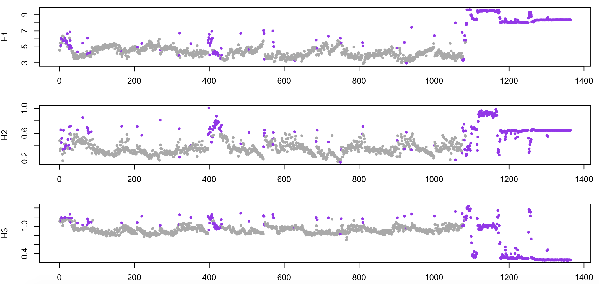

# Artifact detection

_Commands to perform artifact detection/correction_

|Command |Description | 
|---|---|
| [`CHEP-MASK`](#chep-mask)   | CHannel/EPoch (CHEP) outlier detection |
| [`ARTIFACTS`](#artifacts)   | Per-epoch Buckelmueller et al. (2006) artifact detection | 
| [`LINE-DENOISE`](#line-denoise) | Line denoising via spectrum interpolation |
| [`SUPPRESS-ECG`](#suppress-ecg) | Correct cardiac artifact based on ECG | 

## `CHEP-MASK`

_Epoch-wise Hjorth parameters and other statistics_

_CHEP_ masks indicate whether particular CHannel/EPoch pairs are
unusual or likely artifacts. As explained in [this
vignette](../vignettes/chep.md), the `CHEP-MASK` is designed to work
hand-in-hand with [`CHEP`](masks.md#chep) and potentially (in the
context of hdEEG sleep data) [`INTERPOLATE`](spatial.md#interpolate)
commands.

This command calculates and reports per-epoch [Hjorth parameters](https://en.wikipedia.org/wiki/Hjorth_parameters)
and (optionally) other statistics: signal root mean square (RMS), indices of signal
clipping (the proportion of points that equal the minimum or maximum
for that epoch), absolute maximum absolute values and flatness
(proportion of points of a similar value to the preceding value).

Luna will mask channel/epoch pairs (called _cheps_ here) that are (statistical) outliers
(i.e. potentially indicative of signal artifacts) for these measures.
For Hjorth parameters, thresholds for outlier detection can be set
iteratively: for example, first, to flag epochs more than 2 standard
deviations (SD) from the mean, and then second, to flag more epochs
that are more than 2 SDs from the mean _based on the epochs that
survived round 1_, etc.  This iterative heuristic can be useful if
some epochs are outliers by many orders of magnitude, as those can
effectively hide other epochs that are less pronounced but outliers
nonetheless.

A few notes on using `CHEP-MASK` to detect outlying epochs:

- `CHEP-MASK` respects previously set _CHEP_ masks and does
  not include them in the outlier detection process, i.e. as they have
  already been removed.  To alter this behavior use `ep-th0`, `ch-th0` and
  `chep-th0` options in place of `ep-th`, `ch-th` and `chep-th` (described below).

- You can set a __smaller epoch size__ such as `EPOCH len=4` for
  finer-grained artifact detection.

- As well as Hjorth parameters, `CHEP-MASK` can flag epochs based on the proportion of sample points
  in a given epoch that are a) above a certain absolute value (`max`), that are clipped (`clipped`)
  or flat (`flat`). 

<h5>Parameters</h5>

Core parameters:

| Parameter | Example | Description |
| --- | --- | --- |
| `sig`     | `sig=C3,F3` | Restrict analysis to these channels | 
| `ep-th` | `ep-th=3,3` | SD-unit threshold(s) for Hjorth within-channel/between-epoch outlier detection |x
| `ch-th` | `ch-th=2` | SD-unit threshold(s) for Hjorth between-channel/within-epoch outlier detection |x
| `chep-th` | `chep-th=5` | SD-unit threshold(s) for Hjorth general outlier detection |


Additional options:

| Parameter | Example | Description |
| --- | --- | --- |
| `clipped` | `clipped=0.05` | Flag epochs with this proportion of _clipped_ sample points |
| `flat` | `flat=0.05` | Flag epochs with this proportion of _flat_ sample points (optionally `flat=0.05,1e-4`) |
| `max` | `max=200,0.05` | Flag epochs with this proportion of points with absolute value above 200 |


<h5>Output</h5>

The `CHEP-MASK` command only alters the _CHEP_ mask and writes some
information to the console.  No other output is generated.  Use the
[`CHEP` command](masks.md#chep) following `CHEP-MASK` to produce
summary statistics on the number of epochs/channels masked, etc.


<h5>Example</h5>

See [this vignette](../vignettes/chep.md) for an application of `CHEP-MASK` to hdEEG data.

Here, we'll consider a simpler application in the context of a PSG
recording with only two central EEG channels.  Taking the first
individual from the [tutorial](../tut/tut1.md), here we calculate
epoch-level metrics for the first EEG channel, and flag outliers that
are greater than 2 standard deviations from the mean (performed twice,
iteratively).

```
luna s.lst 1 sig=EEG -o out.db -s 'CHEP-MASK sig=EEG ep-th=2,2 '
```

```
 CMD #1: CHEP-MASK
   options: ep-th=2,2 sig=EEG
  set epochs to default 30 seconds, 1364 epochs
  within-channel/between-epoch outlier detection, ep-th = 2,2
   iteration 1: removed 261 channel/epoch pairs this iteration (261 in total)
   iteration 2: removed 115 channel/epoch pairs this iteration (376 in total)
```

By itself, `CHEP-MASK` only alters the internal _CHEP_ mask: to actually remove these
potentially aberrant epochs, we need to pair this commadn with `CHEP`, which sets the
epoch-level mask based on the current _CHEP_ mask:

```
luna s.lst 1 sig=EEG -o out.db -s ' CHEP-MASK sig=EEG ep-th=2,2
                                  & CHEP epochs
                                  & DUMP-MASK
                                  & RE '

```

Here we see output from `CHEP` which shows that we are now dropping those flagged epochs, by
setting the [epoch-level mask](masks.md):

```
 CMD #2: CHEP
   options: epochs=T sig=EEG
  masking epochs with >0% masked channels: 376 epochs
  CHEP summary:
   376 of 1364 channel/epoch pairs masked (28%)
   376 of 1364 epochs with 1+ masked channel, 376 with all channels masked
   1 of 1 channels with 1+ masked epoch, 0 with all epochs masked
```

Finally, the [`RESTRUCTURE` (or `RE`)](masks.md#RESTRUCTURE) takes the epoch-level mask
and actually drops those epochs permanently from the internal representation of the data - i.e. any subsequent
analysis would be based on this subset of 988 epochs, not the full set.

```
 CMD #3: RE
   options: sig=EEG
  restructuring as an EDF+:   keeping 29640 records of 40920, resetting mask
  retaining 988 epochs
```

The intervening [`DUMP-MASK`](masks.md#dump-mask) command outputs the current
state of the epoch-level mask (as used below).

The reason for separating out the steps of flagging channel/epoch
pairs as outliers (`CHEP-MASK`), to setting particular epochs as
outliers (for all channels, via `CHEP`), to actually removing the
flagged epochs (with `RE`) is that it provides more flexibility to
design artifact detection workflows that are suitable to different
types of data/different modes of artifact.

Finally, the see the underlying Hjorth statistics used in the outlier
detection, you would need to use the
[`SIGSTATS`](summaries.md#sigstats) command:

```
luna s.lst 1 sig=EEG -o hjorth.db -s 'SIGSTATS sig=EEG epoch'
```

We first extract epoch-level output (i.e. stratified by `E` as well as
`CH`) into a plain-text file `stats.txt`:

```
destrat hjorth.db +SIGSTATS -r CH E > stats.txt
```

We can also pull the epochs actually masked, from the above run: ```
destrat out.db +DUMP-MASK -r E > masked.txt ``` Both these files have
1364 rows (plus a header), corresponding to the number of epochs in
the original data.  We can then use a package such as R to load and
plot these data.  For example, from the R command line:

```
d <- read.table( "stats.txt", header = T )
m <- read.table( "masked.txt", header = T )
```
```
head(d)
```
```
      ID  CH E        H1        H2       H3
1 nsrr01 EEG 1  98.45154 0.4807507 1.105732
2 nsrr01 EEG 2 234.34135 0.3164355 1.152268
3 nsrr01 EEG 3 159.33651 0.3511658 1.089591
4 nsrr01 EEG 4 181.39586 0.6554725 1.115427
```

Below, still using R, we plot four epoch-level metrics (`H1` (log-scaled), 
`H2` and `H3`), with the epochs set as outliers in purple:

```
f <- function(x) { ifelse(x,"purple","darkgray") } 
par(mfcol=c(3,1), mar=c(3,4,1,2) )
plot(d$E,log(d$H1) ,pch=20,cex=0.8,col=f(m$EMASK),xlab="Epoch",ylab="H1")
plot(d$E,d$H2      ,pch=20,cex=0.8,col=f(m$EMASK),xlab="Epoch",ylab="H2")
plot(d$E,d$H3      ,pch=20,cex=0.8,col=f(m$EMASK),xlab="Epoch",ylab="H3")
```



As noted above, all epochs past epoch 1100 or so are wake, essentially
containing nothing but noise (e.g. if recording continued after
electrodes were removed from the scalp). As expected, these have been
flagged as likely artifact.


## `ARTIFACTS`

_Applies an artifact detection algorithm for EEG data_

This command applies the method described in [Buckelmueller et
al](https://www.ncbi.nlm.nih.gov/pubmed/16388912), to detect likely
artifacts in an EEG channel. Briefly, the method takes 10 4-second
windows for each 30-second epoch to estimates delta (0.6 to 4.6 Hz)
and beta (40-60Hz) spectral power, using 
[Welch's method](https://en.wikipedia.org/wiki/Welch%27s_method).  Based
on a sliding window of 15 epochs (i.e. seven either side of each
epoch), an epoch is flagged to be masked if either the delta power is
more than 2.5 times the local average (from the sliding window) or the
beta power is more than 2.0 times the local average.

<h5>Parameters</h5>

| Parameter | Example | Description |
| --- | --- | --- |
| `sig`     | `sig=C3,F3` | Restrict analysis to these channels | 
| `verbose` | `verbose` | Report epoch-level statistics |
| `no-mask` | `no-mask` | Run, but do not set any masks |

<h5>Output</h5>

Channel-level output (strata: `CH`):

| Variable | Description |
| ---- | ---- |
|`FLAGGED_EPOCHS`| Number of epochs failing Buckelmueller |
|`ALTERED_EPOCHS`| Number of epochs actually masked |
|`TOTAL_EPOCHS`  | Number of epochs tested | 


Epoch-level output (option: `verbose`, strata: `CH` x `E`):

| Variable | Description |
|---- | ---- |
|`DELTA` | Delta power |
|`DELTA_AVG` | Local average delta power |
|`DELTA_FAC` | Relative delta power factor |
|`BETA` | Beta power | 
|`BETA_AVG` | Local average beta power |
|`BETA_FAC` | Relative beta power factor |
|`DELTA_MASK` | Masked based on delta power? |
|`BETA_MASK` | Masked based on beta power? |
|`MASK` | Whether the epoch is masked |

<h5>Example</h5>

Taking the same EEG channel from the first tutorial EDF as in the
`SIGSTATS` example above:
```
luna s.lst 1 sig=EEG -o out.db -s "ARTIFACTS verbose" 
```

We see this command flags 60 epochs as potentially containing artifact:

```
masked 60 of 1364 epochs, altering 60
```
We can extract the epoch-level statistics from this analysis:

``` 
destrat out.db +ARTIFACTS -r E CH > d.txt 
``` 

We can then use R to show the results, for delta (left column) and
beta (right column) separately, showing log-scaled power per epoch
(top row), the local average (middle row) and the epoch/local relative
factor (bottom row), where purple points indicate that epoch was
flagged as an outlier (by either delta or beta criterion).


```
d <- read.table("d.txt",header=T)
par(mfcol=c(3,2), mar=c(4,4,2,2) )
plot( log(d$DELTA)     , type="l" , ylab="Delta avg" )
plot( log(d$DELTA_AVG) , type="l" , ylab="Delta local")
plot( d$DELTA_FAC , pch=20 , col = f( d$MASK ) , ylab="Beta fac") 
plot( log(d$BETA)     , type="l" , ylab="Beta avg" )
plot( log(d$BETA_AVG) , type="l" , ylab="Beta local")
plot( d$BETA_FAC , pch=20 , col = f( d$MASK ) , ylab="Beta fac") 
```


Comparing the results to the [`SIGSTATS`](#sigstats) method described
above, which is applied to the same data, we see that this approach
does a good job of flagging individual epochs with unusual artifacts,
but does not flag the very extended stretches of gross artifact
towards the end of the recording (i.e. because the entire local window
is itself aberrant) .  This latter type of artifact is, of course,
easier to spot by eye, and is flagged by `SIGSTATS`. In practice,
running multiple artifact detection/correction routines is usually
warranted.

## LINE-DENOISE

_Attempt to attenuate electrical line noise at fixed frequencies, via spectrum interpolation_

This command implements a spectrum interpolation approch to correcting
certain types of line noise in EEG or other signals, following the
approach described
[here](https://www.ncbi.nlm.nih.gov/pmc/articles/PMC6456018/).

Briefly, this approach works as follows:

 - obtain the amplitude spectrum via FFT

 - for fixed frequency windows, interpolate amplitude with mean of flanking regions

 - with phases unchanged, use Euler’s formula to obtain complex Fourier spectrum but with modified amplitudes

 - apply the inverse FFT to obtain a corrected time-domain signal


<h5>Parameters</h5>

| Parameter | Example | Description |
| ---- | ----- | ----- |
| `sig` | `${eeg}` | Specify which signals to apply this method to |
| `f` | `20,40,60` | One or more target frequencies to set to missing and interpolate |
| `w` | `1,0.5`     | Bandwidth of noise and neighbour intervals |

<h5>Output</h5>

No output, just modifies the internal signals.

<h5>Example</h5>

Here is one example recording with considerable line noise: the raw
signal (left panel) for a single epoch, and the equivalent frequency
spectrum up to 128 Hz (right panel).  As well as line noise at 60 Hz, there are
clear sub-harmonics at 4 Hz intervals, from which extend down into the
regions typically considered of high physiological relevance for the
sleep EEG, i.e. < 20 Hz.


Zooming into the <25 Hz range, here we see the mean PSD for the entire sample (in this case, hundreds of individuals,
many of whom turn out to share the same signature of electrical line noise, as was evident when looking at the full sample-level spectra up to 128 Hz):


Although the impact on sample-level mean power in this frequency range is not extreme, in terms of individual differences, we see a clear and disturbing
pattern, whereby the presence or absence of line-noise seems to drive clear spikes in the variance of power, and these seem to overwhelm physiological sources
of between-individual variation.  Naturally, this represents a rather large source of potential confounding.

We can apply the `LINE-DENOISE` approach to this sample, as follows (showing here just targetted frequencies up to 24 Hz); (nb.
normally, one would add other commands, e.g. `PSD` or `WRITE` out new EDFs after running `LINE-DENOISE`):
```
luna s.lst –s LINE-DENOISE sig=${eeg} f=4,8,12,16,20,24 w=1,0.5
```

!!! warning
    In this particular case, we observed relatively clear fixed-frequency artifacts across many individuals: naturally, in different samples, different
    individuals (or different portions of the recording) may show different patterns, and so this simple, one-size-fits-all approach may not be optimal.
    
In this particular case, this simple approach to removing line noise works quite well on this one individual:


Perhaps more significantly, when looking at the whole sample
(i.e. applying the above to all individuals in this sample), we see a
flatter mean PSD, but also greatly reduced _variance_ at these 4 Hz
intervals, suggesting that we've done a reasonable job at removing
individual differences in power due to individual differences in the
extent of line noise (e.g. especially at 16 Hz). Note that the mean
PSD does show a few 'notches' suggesting that it has over-corrected in
some cases.


!!! warning
    Correcting the EEG signal in this manner naturally entails
    changing the data in a complex way, which partially attenuates the
    suspected artifactual signal sources, but potentially also induces
    subtle (or not so subtle) new confounds.  Some downstream analyses
    may be more or less sensitive to these issues, and so these corrections
    may or may not be necessary or desirable. All steps here
    must be performed with care (using different approaches, or compared to the raw data, and
    checking for convergence with respect to the final, substantive
    results, if restricting analyses to clean data is not an option).


## SUPPRESS-ECG

_Given an ECG channel, detect R peaks and subtract cardiac-related contamination from the EEG_

This command applies a modified
[Pan-Tompkins](https://www.ncbi.nlm.nih.gov/pubmed/3997178) algorithm
to detect QRS in the ECG.  Based on the detected R-peaks, it estimates
the average signature for other channels based on 2-second intervals
time-locked with each R-peak.  This is subtracted from the EEG, as
described [here](https://www.ncbi.nlm.nih.gov/pubmed/28649997). It
also estimates heart rate per-epoch, and flags values likely to
represent artifact. If needed, channels will be resampled to have
similar sampling rates (to be set to the value of the parameter `sr`).

<h5>Parameters</h5>

| Parameter | Example | Description |
| ---- | ----- | ----- |
| `ecg` | `ecg=ECG` | Specify which channel is the ECG |
| `sr` | `sr=125` | Set the sample rate that all channels should to resampled to |
| `no-suppress` | `no-suppress` | Run the command but do not alter any EEG channels |

<h5>Output</h5>

Individual-level summaries (strata: _none_):

| Variable | Description |
| --- | --- |
| `BPM` | Mean heart rate (bpm) |
| `BPM_L95` | Lower 95% confidence interval for mean HR |
| `BPM_U95` | Upper 95% confidence interval for mean HR |
| `BPM_N_REMOVED` | Number of epochs flagged as having invalid HR estimates |
| `BPM_PCT_REMOVED` | Proportion of epochs flagged as having invalid HR estimates |

Epoch-level metrics (strata: `E`):

| Variable | Description |
| --- | --- |
| `BPM` | Heart rate for this epoch (bpm) |
| `BPM_MASK` | Was this epoch invalid? | 

Channel-level summaries (strata: `CH`):

| Variable | Description |
| --- | --- |
| `ART_RMS` | Root mean square of correction signature |

Details of artifact signature (strata: `CH` x `SP`) 
 
| Variable | Description |
| --- | --- |
| `ART` | For each sample point in a 2-second window, the estimated correction factor |


<h5>Example</h5>

Here we look at individual `nsrr02` from the
[tutorial](../tut/tut1.md) data, to identify and remove possible 
cardiac contamination in the EEG:

```
luna s.lst nsrr02 sig=EEG,ECG -o out.db < cmd.txt
```

The command file `cmd.txt` restricts analysis to NREM2 sleep,
estimates EEG/ECG [coherence](cc.md#coh) (and
[spectral power](power-spectra.md#psd)), then estimates and corrects for
cardiac contamination in the EEG, and finally, repeats the coherence
and spectral analyses:

```
MASK ifnot=NREM2 
RE 
TAG R/pre 
COH 
PSD spectrum 
SUPPRESS-ECG ecg=ECG 
TAG R/post 
PSD spectrum 
COH
```

!!! hint
    Note how we've used the [`TAG`](summaries.md#tag) command to structure the output, by adding a factor `R` to denote
    whether the coherence and spectral analysis was performed `pre` or `post` the `SUPPRESS-ECG` command.

We can extract the per-epoch estimates of heart rate (bpm) and plot as follows:

```
destrat out.db +SUPPRESS-ECG -r R E > hr.txt
```

Plotting the `BPM` field of `hr.txt` against epoch (`E`), e.g. in R: 

```
plot(d$E,d$BPM,pch=20,col="red",ylim=c(50,80),ylab="HR (bpm)",xlab="NREM2 epoch")
```


Second, we can extract the estimates of coherence between EEG and ECG as follows:

```
destrat out.db +COH -r F -c R -r CHS -v COH > d.txt
```

Plotting the `pre` (black) and `post` (blue) coherence values, for
frequencies up to 20 Hz, we see that a non-trivial association between
ECG and EEG channels has effectively been removed based on these
metrics:

```
plot( d$F , d$COH.R.pre , ylim=c(0,1) , type="b" , pch=20, ylab="Coherence" , xlab="Frequency (Hz)" ) 
points( d$F , d$COH.R.post , ylim=c(0,1) , type="b" , pch=20, col="blue" ) 
```


Note, this is only a _rough-and-ready_ approach to working with ECG data,
which is not a primary focus of Luna.  Other artifacts may well remain
(e.g. in higher frequencies) and this approach may not work well with
other datasets.  That is, as usual, your mileage may vary...

!!! hint 
    When comparing different individual or signals, the `ART_RMS`
    metric can be taken as an approximate guide to the relative extent
    of contamination.  The actual _signatures_ (i.e. the R-peak
    sync'ed averaged EEG) can be viewed by looking at the `ART`
    variable, which is a channel by sample-point (`CH` x `SP`) metric.
