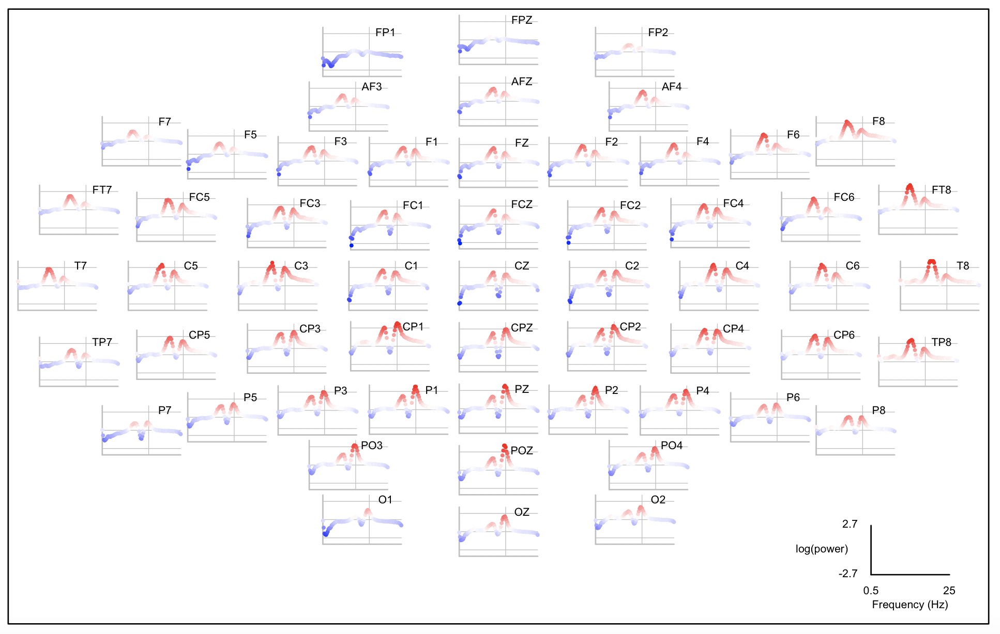

# Association analysis

_Sample-level permutation-based association testing_

Whereas most Luna commands operate on EDFs in a serial manner, this command instead
operates at the sample level, not based on the original EDF/annotations but rather 
on derived metrics (i.e. the output of prior Luna commands).  As such, association analyses
in Luna do not require a [sample-list](../luna/args.md#sample-lists) as input.

| Command | Description | 
| ---- | ------ | 
| [`CPT`](#cpt)   | Apply cluster-based permutation to one or more sets of metrics |

## `CPT`

_Cluster-based permutation analysis_

This command fits a set of linear models, using a permutation-based approach that allows for covariates,
to generate pointwise empirical significance values, as well as family-wise corrected empirical p-values.

It additionally employs a simple clustering heuristic to find groups of _adjacent_ predictors, and
to evaluate the evidence for association over these clusters, based on the sum of test statistics.
This command is set up to define clusters with respect to three types of _adjacency_:

 - by frequency (e.g. power for 4.5 Hz and 5.0 Hz might be tested jointly)

 - by spatial location (e.g. `CZ` and `C1` might be considered nearby, and so tested jointly)

 - by pairs of channels (e.g. for connectivity measures, the pair `C3-F1` might be considered adjacent to `CZ-FZ`)

 - by time (e.g. for peri-event data)

These stratifiers are automatically determined by the presence of `F`,
`CH` or `CH1` and `CH2` or `T` columns in the dependent variable files.

The idea behind cluster-based analyses non-parametric analysis
(outlined [here](https://pubmed.ncbi.nlm.nih.gov/17517438/)) is that
power might be increased by searching for more modest effects that
span "similar" predictors, with respect to topography or frequency.

This command can accept multiple _types_ of DV in the same analysis:
e.g. spindle density (`DENS`) as well as amplitude (`AMP`).  With
respect to multiple test correction (the `PC` and cluster-based
empirical p-values below), this analysis will correct for both sets of
values (accounting for any correlation between them).  However,
clustering only happens _within_ a particular class of variable.  That
is, if each mesaure is present for 64 EEG channels, clusters of
topographically adjacent channels may be formed for `DENS`, and
separate clusters may be formed for `AMP`, but no cluster would
contain both `DENS` and `AMP` measures (i.e. because there is no
general way to specify the _adjacency_ of different classes of
variable).

The approach to permutation with nuissance variables is
the [Freedman-Lane method](https://www.tandfonline.com/doi/abs/10.1080/07350015.1983.10509354)
and follows an implementation described [here](https://www.ncbi.nlm.nih.gov/pmc/articles/PMC4010955/).

!!! hint
    For correctly-formated inputs, the `CPT` command can be used to analyse _any_ types of numeric inputs,
    whether they come from prior Luna commands or not.


<h5>Parameters</h5>

Primary parameters to specify the data and any outlier actions for the dependent variables:

| Option | Example | Description | 
| ---- | ---- | ---- | 
| `iv-file` | `demo.txt` | Name of a single, tab-delimited text file containing the primary independent variable and other covariates |
| `iv`   | `DIS` | The primary IV (assumed to be a column in the `iv-file`) |
| `covar` | `AGE,SEX` | Covariates, coded numerically (binary 0/1 or real-valued, assumed to be columns in `iv-file`) |
| `dv-file` | `spec.txt,psd.txt` | One or more dependent variable files, in _long-format_ (see below) |
| `dv` | `DENS,AMP` | The name of one or more DVs (assumed to be columns in the `dv-file` set |
| `all-dvs` | | Use all DVs from the DV files (equivalent to `dv=*`) |
| `th` | `5` | SD units for individual-level DV outlier removal (note: case-wise deletion) |
| `winsor` | `0.02` | Proportion (e.g. 2% here) for Winsorizing the DV (no outlier removal) |

Parameters for the (cluster-based) permutation:

| Option | Example | Description |
| ---- | ---- | ---- |
| `nreps` | `1000` | Number of permutations to perform |
| `clocs` | `clocs.txt` | File containing channel location information, described [here](spatial.md#clocs) |
| `th-spatial` | 0.5 | Threshold for defining adjacent channels (Euclidean distance, 0 to 2) |
| `th-freq` | 1 | Threshold for defining adjacent frequencies (Hz) |
| `th-time` | 0.5 | Threshold for defining adjacent time-points (seconds) |
| `th-cluster` | 2 | Absolute value of t-statistic for inclusion in a cluster |

Secondary parameters

| Option | Example | Description |
| ---- | ---- | ---- |
| `abs` | | Take the absolute value of all DVs |
| `dB` | | Take the log of all DVs |
| `f-lwr` | 0.5 | Ignore values for frequencies below 0.5 Hz |
| `f-upr` | 25 | Ignore values for frequencies above 25 Hz |
| `complete-obs` | | Instead of case-wise dropping individuals with missing data, flag an error |
| `ex-ids` | `id001,id002` | List of individual IDs to exclude |
| `inc-ids` | `@{include.txt}` | List of individual IDs to include |
| `1-sided` | | Assume a 1-sided test (that B > 0 ) | 

<h5>Outputs</h5>

Variable-level output (strata: `VAR`):

| Variable | Description |
| --- | --- |
| `CH` | Channel name |
| `CH1` | First channel (for variables stratified by channel-pairs) |
| `CH2` | Second channel (for variables stratified by channel-pairs) |
| `F` | Frequency (Hz) (for variables stratified by frequency) |
| `T` | Time (e.g seconds) (for variables stratified by time) | 
| `B` | Beta from linear regression |
| `STAT` | The correspondong t-statistic | 
| `PU` | Uncorrected empirical significance value |
| `PC` | Family-wise corrected empirical significance value |
| `CLST` | For variables assigned to a nominally-significant cluster (P<0.05), the cluster number _K_ (else 0) |

Cluster-level output (strata: `K`) 

| Variable | Description |
| --- | --- |
| `N` | Number of variables in this cluster |
| `P` | Empirical significance value |
| `SEED` | Seed variable (most significant) |

Cluster-member output (strata: `K` x `M`)

| Variable | Description |
| --- | --- |
| `VAR` | Variable name, i.e. member _M_ of cluster _K_ |


<h5>Example</h5>


This command requires that both dependent variable (i.e. Luna sleep
metrics) and the independent variable (i.e. demographics, disease
state, etc) have a column labeled `ID` (case-sensitive) to link
individuals across files.


The command expects metrics in the _long_ format, as would come from the `-r` option of destrat for example:

```
ID         CH     F      PSD
subj-01    AF3    0.5    393.263017810112
subj-01    AF3    0.75   483.725395908896
subj-01    AF3    1      359.270993287664
subj-01    AF3    1.25   248.829826621191
subj-01    AF3    1.5    161.100179146164
subj-01    AF3    1.75   103.629116449848
subj-01    AF3    2      67.5148408348248
subj-01    AF3    2.25   49.2884864501349
subj-01    AF3    2.5    38.0206381125483
...
```

This file has 1,029,990 rows: one for each individual, channel and frequency combination.

The file `descr.txt` has 130 rows, containing the descripive statistics (independent variables):

```
ID         C1   C2   X1
subj-01    1    1    28
subj-03    1    0    43
subj-04    1    1    33
subj-05    1    0    24
subj-06    1    1    35
subj-07    1    1    31
subj-09    1    1    31
subj-11    1    1    46
subj-12    1    0    28
...
```

The CPT command is invoked as follows, piping the arguments into Luna via standard input (here from the shell `echo` command). 

```
echo 'iv-file=descr.txt iv=X1  covar=C1,C2
      dv-file=n2-spec.txt  dv=PSD  dB=PSD 
      nreps=1000
      clocs=~/luna/clocs
      th-spatial=0.5 th-freq=0.5 th-cluster=2
      f-upr=20 ' | luna --cpt -o out.db
```

This specifics a set of regressions of the IV `X1` in the file
`descr.txt`, with covariates `C1` and `C2`.  The dependent variable(s)
are the values of `PSD` from the file `n2-spec.txt`.  These DVs will
be log-transformed (due to the `dB` option).  We further specify 1000 permutations,
with clustering based on channel locations in the file `clocs` and the given set of
cluster-defining thresholds.  We restrict the analysis to power values for frequencies under 20 Hz
(i.e. if the file `n2-spec.txt` might contain higher values).

Only people present in both the IV and DV files will be included in
analysis (based on the `ID` field).  The order of individuals need not
be the same across files.

The output written to the console is as follows:

```
===================================================================
+++ luna | v0.25.5, 31-Mar-2021 | starting 20-May-2021 14:15:07 +++
===================================================================
  read 130 people from sample_descr.txt (of total 130 data rows)
  reading metrics from n2-spec.txt
  converting input files to a single matrix
  found 130 rows (individuals) and 4503 columns (features)
  identified 0 of 130 individuals with at least some missing data
  finished making regular data matrix on 130 individuals
  final datasets contains 4503 DVs on 130 individuals, 1 primary IV(s), and 2 covariate(s)
  read 64 channel locations from ~/luna/clocs
  defining adjacent variables...
  on average, each variable has 25.348 adjacencies
  0 variable(s) have no adjacencies
  running permutations, assuming a two-sided test...
  found 199 clusters, maximum statistic is 107.218
  .......... .......... .......... .......... ..........  50 perms
  .......... .......... .......... .......... ..........  100 perms

  ...

  .......... .......... .......... .......... ..........  950 perms
  .......... .......... .......... .......... ..........  1000 perms
  2 clusters significant at corrected empirical P<0.05
  all done.
-------------------------------------------------------------------
+++ luna | finishing 20-May-2021 14:15:25                       +++
===================================================================
```

Based on the constraints, there are 4,503 power values per individual
(i.e. frequency values from 0.5 Hz to 20 Hz in 0.25 Hz bins gives 79
bins; for 57 EEG channels (as this dataset contains) this yields 79 *
57 = 4,503 values per individual).

Taking advantage of the [Eigen](https://eigen.tuxfamily.org/) library
for matrix operations, the implementation is relatively efficient: including
loading all the data, and forming the adjacency map for the 4,503 measures, the
above command fits just under 4.5 million linear models (each one for N=130 individuals)
including the original data and the 1000 null permutations, but the entire analysis
takes approximately 17 seconds running on a single macOS laptop.

The output notes that on average, each variable has about 25 'adjacent' neighbours (in both frequency
and topographical space); no variables have 0 adjacent points.  Overall, 199 clusters are
extracted from the original data, given a minimim t-statistic threshold of 2.

The point-wise (i.e. variable-by-variable) output can be extracted as follows:
```
destrat out.db +CPT -r VAR 
```
``` 
ID  VAR           B             CH    CLST   F       PC        PU          STAT
.   AF3~0.5~PSD   -0.07959794   AF3   0      0.5     0.68131   0.02297   -2.339
.   AF3~0.75~PSD  -0.09944737   AF3   0      0.75    0.09191   0.00299   -3.426
.   AF3~1~PSD     -0.08683515   AF3   0      1       0.28371   0.00299   -2.923
.   AF3~1.25~PSD  -0.07991619   AF3   0      1.25    0.47152   0.00899   -2.614
.   AF3~1.5~PSD   -0.07243292   AF3   0      1.5     0.58441   0.01198   -2.460
.   AF3~1.75~PSD  -0.06208055   AF3   0      1.75    0.75424   0.02497   -2.225
.   AF3~10~PSD     0.05459445   AF3   0      10      0.99600   0.12387    1.548
.   AF3~10.25~PSD  0.05860681   AF3   0      10.25   0.98901   0.098909   1.642

```

!!! hint
    The `ID` field in the output of the CPT command is always `.`, i.e. as this reflects sample-level output rather than any one observation.
    Also note that outputs in later versions of Luna will now include a `T` field as the time-stratifier, and the `VAR` labels are expanded to reflect this additional extra stratifier.

The variable names (under `VAR`) are automatically constructed from
the specified `dv` variables (i.e. `PSD` here) and any frequency and
channel stratifiers, with the `~` character separating them.  To ease
parsing, the output also includes the channel (`CH`) and frequency
(`F`) associated with each variable.

Note that Luna's generic output mechanism sorts by the `VAR` stratifier, which is alphanumeric rather than numeric.  This means the order of rows
may not be in strictly increasing numeric order (i.e.  1 , 10 , 11 , 2 , 3 , ... ).  To facilitate plots etc, you can simply sort the table by `F`, e.g.
if in the R package:
```
d <- d[ order(d$F) , ]
```

We'll use the [lunaR `ltopo.xy()`](../ext/R/viz.md#ltopoxy)
routine to produce a plot of these data, first defining an additional variable as the signed -log10 of the empirical p-value:

```
d$S <- sign( d$B ) * -log10( d$PU )
```

The Luna graph command:
```
ltopo.xy( c=d$CH, x=d$F, y=d$S, z=d$S, pch=20, col=rbpal, cex=0.4, xline=15, yline=c(-2,0,2), y.symm=T) 
```
then produces this plot where the Y-axis and also color-scaling show this scaled verson of the empirical significance:

{width="100%"}

Directly examining the `PC` column, we see there are 46 variables significant at 0.05 after correction:
```
table( d$PC < 0.05 ) 
```
and we can see which frequencies/channels they correspond to:
```
table( d$F[ d$PC < 0.05 ] , d$CH[ d$PC < 0.05 ] ) 
```
```    
        C1 C2 CP1 CP2 CP3 CPZ CZ F1 F2 F4 FC1 FC2 FC3 FC4 FCZ Fp1 Fp2 FPZ FZ P2 POz PZ
  0.5    1  0   0   0   0   0  1  0  0  0   1   0   0   0   1   0   0   0  0  0   0  0
  0.75   1  1   0   1   1   1  1  1  1  1   1   1   1   1   1   1   1   1  1  1   0  1
  1      1  1   0   0   0   1  1  0  0  0   1   1   0   0   1   1   1   0  0  1   0  1
  1.25   0  0   0   0   0   0  1  0  0  0   0   0   0   0   0   0   0   0  0  0   0  0
  3      0  0   0   0   0   0  0  0  0  0   0   0   0   0   0   1   0   0  0  0   0  0
  3.25   0  0   0   0   0   0  0  0  0  0   0   0   0   0   0   1   0   0  0  0   0  0
  3.5    0  0   0   0   0   0  0  0  0  0   0   0   0   0   0   1   0   0  0  0   0  0
  15     0  0   0   0   0   0  0  0  0  0   0   0   0   0   0   0   0   0  0  0   1  0
  15.25  0  0   0   0   0   0  0  0  0  0   0   0   0   0   0   0   0   0  0  0   1  0
  15.5   0  0   1   0   0   0  0  0  0  0   0   0   0   0   0   0   0   0  0  0   1  0
  15.75  0  0   1   0   0   0  0  0  0  0   0   0   0   0   0   0   0   0  0  0   0  0
  16     0  0   1   0   0   0  0  0  0  0   0   0   0   0   0   0   0   0  0  0   0  0
  16.25  0  0   1   0   0   0  0  0  0  0   0   0   0   0   0   0   0   0  0  0   0  0
```


The console log notes there are two clusters significant at the empirical 0.05 level (after correction for all
multiple testing, i.e. based on comparing the maximum of the cluster sum-statistics in the observed versus the permuted data).
The p-values and seed variables can be obtained as follows:

```
destrat out.db +CPT -r K
```
```
ID   K   N    P         SEED
.    1   30   0.04495   CP4~16~PSD
.    2   33   0.01498   POz~15.25~PSD
```

(which note, does not include a cluster around 1 or 3 Hz).  The members of each cluster can be found as follows:

```
destrat out.db +CPT -r K M
```
```
ID  K   M    VAR
.   1   1    C4~15.5~PSD
.   1   2    C4~15.75~PSD
.   1   3    C4~16.25~PSD
.   1   4    C4~16.5~PSD
.   1   5    C4~16~PSD
.   1   6    CP2~15.5~PSD
.   1   7    CP2~15.75~PSD
.   1   8    CP2~16.25~PSD
.   1   9    CP2~16.5~PSD
.   1   10   CP2~16~PSD
...
```
(or alternativelty, from the `CLST` variable in the point-wise output (`-r VAR`).

!!! warning 
    Further guidance on best practice on cluster thresholds, and implementing alternative methods to more intelligently select adaptive thresholds
    will be implemented in future releases.  As is, please consider the clustering of the CPT as a secondary feature that has not been optimized
    in Luna yet: the primary application is to efficiently generate point-wise, corrected empirical p-values. 

    
