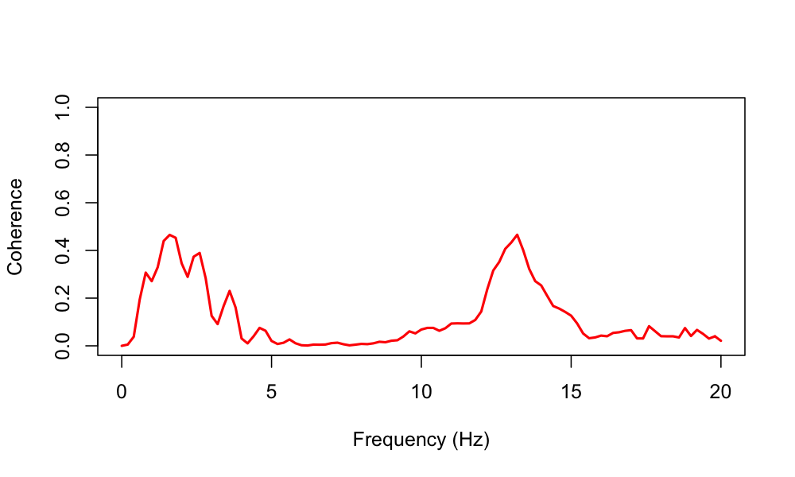
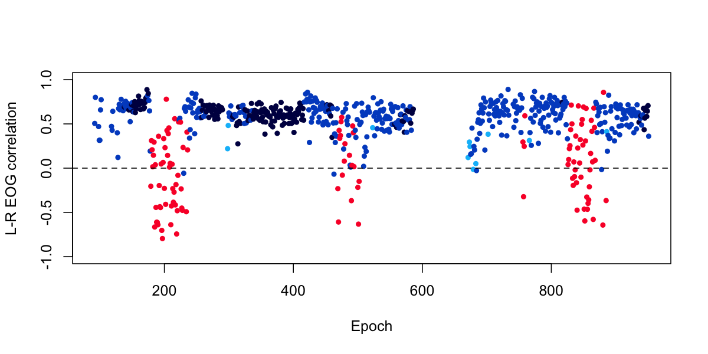
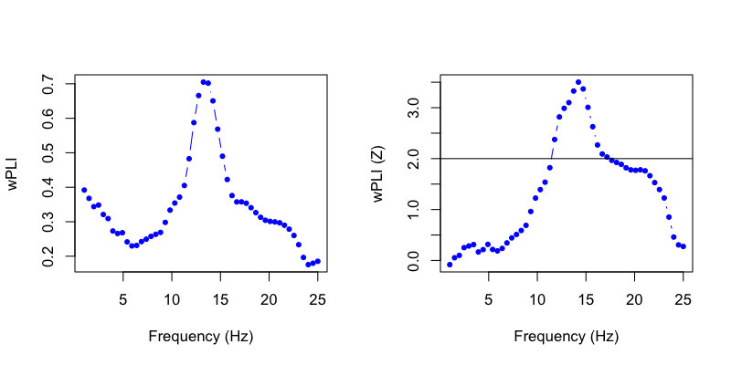

# Cross-signal analyses

| Command | Description |
| ----- | ----- | 
| [`COH`](#coh) | Pairwise channel coherence | 
| [`CORREL`](#correl) | Pairwise channel correlation | 
| [`CC`](#cc) | Coupling (dPAC) and connectivity (wPLI) | 
| [`PSI`](#psi) | Phase slope index (PSI) connectivity metric |
| [`XCORR`](#xcorr) | Cross-correlation | 
| [`MI`](#mi) | Mutual information |
| [`TSYNC`](#tsync) | Cross-correlation and phase delay (alternate implementation) |
| [`GP`](#gp) | Granger prediction |

## COH

_Calculates pairwise spectral coherence across channels_

The `COH` function calculates the [magnitude-squared
coherence](https://en.wikipedia.org/wiki/Coherence_(signal_processing))
for pairs of signals with similar sampling rates.

<h3>Parameters</h3>

| Parameter | Example | Description |
| --- | --- | --- |
|`sig`|`sig=C3,C4` | An optional parameter, to specify which channels to calculate  pairwise coherence between |
|`sig1`|`sig1=C3,C3` | In stead of `sig`, specify all `sig1` by `sig2` channel pairs |
|`sig2`|`sig2=F3,F4` | As above |
|`sr` | `sr=125` | Optionally, set sample rates to `sr` if different for a particular channel (i.e. to ensure that all signals have similar sampling rates |
|`spectrum` | `spectrum` | Output full cross-spectra coherence rather than just in frequency bands (delta, theta, etc) |
|`epoch` | `epoch` |  A flag to output coherence statistics for per epoch as well as the whole signal |
|`epoch-spectrum` | `epoch-spectrum` |  A flag to output full cross-spectra coherence statistics for each epoch/channel pair |

!!! warning
    If requesting the full `spectrum` and `epoch`-level analyses for a large number of channels, the output database may be __very large...__  In this case, you should use 
    [text-table](../luna/args.md#text-tables) mode output (with `-t`) for better performance when working with the output (as _destrat_ can be slow othewise, for datasets with 
    very large numbers of strata).

Using `sig1` and `sig2` instead of `sig` can be more efficient, if you
are only interested in particular combinations of pairs.  For example,
to see the pairwsie coherences between one channel and four others: 
```
 sig1=C3 sig2=F3,F4,O1,O2
```
This will only evaluate four pairs (whereas `sig=C3,F3,F4,O1,O2` would
evaluate 10 pairs, even if some pairwise comparisons are not of
interest).


<h3>Output</h3>


Coherence for power bands  (`B` x `CH1` x `CH2`)  

| Variable | Description |
| ----- | ---- | 
| `COH` | Magnitude-squared coherence | 
| `ICOH` | Imaginary coherence | 
| `LCOH` | Lagged coherence | 

Full cross-spectra coherence (option: `spectrum`, strata: `F` x `CH1` x `CH2`)  

| Variable | Description |
| ----- | ---- | 
| `COH` | Magnitude-squared coherence | 
| `ICOH` | Imaginary coherence | 
| `LCOH` | Lagged coherence | 

Coherence for power bands, per epoch (option: `epoch`, strata: `E` x `B` x `CH1` x `CH2`)  

| Variable | Description |
| ----- | ---- | 
| `COH` | Magnitude-squared coherence | 
| `ICOH` | Imaginary coherence | 
| `LCOH` | Lagged coherence | 

Full cross-spectra, per epoch (option: `epoch` and `spectrum`, strata: `E` x `F` x `CH1` x `CH2`)  

| Variable | Description |
| ----- | ---- | 
| `COH` | Magnitude-squared coherence | 
| `ICOH` | Imaginary coherence | 
| `LCOH` | Lagged coherence | 


<h3>Example</h3>


To estimate the cross-spectra (up to 20 Hz) between the two EEG channels during NREM2
sleep for the [tutorial](../tut/tut1.md) individual `nsrr02`:

```
luna s.lst nsrr02 -o out.db -s "MASK ifnot=NREM2 & RE \
                                & COH spectrum max=20 sig=EEG,EEG(sec)"
```

Loading this into [_lunaR_](../ext/R/index.md), 

```
k <- ldb( "out.db" ) 
```
and extracting the relevant data frame:
```
d <- lx(k,"COH","CH1","CH2","F")
```
and plotting:
```
plot( d$F, d$COH , type="l" , 
      xlab="Frequency (Hz)" , ylab="Coherence" , 
      ylim=c(0,1) , lwd=2, col="red")
```

{width="100%"}

Following other reports ([for example](https://www.ncbi.nlm.nih.gov/pubmed/9682192)), we see peaks
in EEG coherence especially for the low delta and sigma frequencies
during NREM sleep.  Naturally, the precise interpretation of coherence
analysis (like any sleep EEG analysis) depends on the exact choice of montages,
referencing and other technical and subject-level details, not to mention the 
potential for artifact (e.g. as illustrated [here](artifacts.md#suppress-ecg)).


## CORREL

_Calculates pairwise Pearson correlation between signals_

`CORREL` estimates pairwise correlation coefficients between signals,
either for the whole signal, or epoch-by-epoch.  When epoch-level
statistics are requested, Luna also reports the mean and median of all
per-epoch statistics for a given channel pair.

As of v0.27, Luna also provides functions to incorporate spatial channel distance (i.e.
for the EEG/MEG context) of channels, and to find disjoint sets of highly correlated channels.

<h3>Parameters</h3>

| Parameter | Example | Description |
| ---- | ---- | ---- | 
| `sig`    | `sig=C3,C4,F3,F4` | Optionally specify which signals to correlate (otherwise, do all) |
| `sig1`    | `sig=C3,C4` | Alternatively, only evaluate all `sig1` by `sig2` pairs |
| `sig2`    | `sig=F3,F4` | As above |
| `sr`     | `sr=128` | Resample channels to this sample rate, if they are not already at that rate |
| `epoch`   | `epoch` | Display per-epoch correlations, and estimate mean and median correlation across epochs | 

<h6>Epoch-level correlations</h6>

By default, the correlations from `CORREL` are based on the entire signal. 
To instead estimate of channel-pair correlations based on
aggregating epoch-level correlations, use the `ch-epoch` option.  This is often likely
more robust to artifacts.  In particular, if you also use `ch-median`
then the final correlation is the median of epoch-level correlations
(otherwise, default = mean).  In general, when using the `CORREL` command, it is probably
advisable to always add `ch-epoch ch-median`.

| Parameter | Example | Description |
| --- | --- | --- |
|`ch-epoch` |  | Base overall correlations on aggregate summaries of epoch-level correlations |
|`ch-median` | | Use the median (instead of the mean) when applying `ch-epoch` |

<h6>Including EEG channel topographies</h6>

For high-density EEG/MEG studies, `CORREL` can produce some simple
metrics that flag pairs of channels that are more correlated by might
be expected given their topographical similarity.  This may be indicative
of artifact or bridging, etc.

To include spatial distances in correlations, it is first necessary to
have previously attached a set of channel locations via the
[`CLOCS`]() command) prior to running `CORREL`.  An example map (for a
64-channel EEG) can be found
[here](http://zzz.bwh.harvard.edu/dist/luna/clocs/clocs64): e.g. 

```
  CLOCS clocs=clocs64
  CORREL sig=${eeg}
```
Channel locations are translated to a cosine similarity (-1 to +1, where +1 is
most similar) and are output as the `S` variables from the `CORREL` command:
``` 
   destrat out.db +CORREL -r CH1 CH2
```
This allows easy plotting of correlation against spatial proximity, e.g. to spot extreme outliers. 
(Note: assuming the same map has been used, `S` will obviously be the same of all individuals.)


`ch-spatial-threshold` `ch-spatial-weight` to `CORREL`,


<h6>Disjoint sets of highly correlated channels</h6>

CORREL now prints disjoint sets of highly-correlated channels (as
defined by the `ch-high` option) channels, with `CHS` stratifier, if
the `ch-high` option is given.


<h3>Output</h3>

Whole-signal correlations for pairs of channels (strata: `CH1` x `CH2`) 
 
| Variable | Description | 
| ---- | ---- | 
| `R` | Pearson product moment correlation |
| `R_MEAN` | (If `epoch` is specified) the mean of epoch-level correlations |
| `R_MEDIAN` | (If `epoch` is specified) the median of epoch-level correlations |
| `S` | If channel locations attached for this pair, the cosine similarity (based only on map) |

Whole-signal correlations for pairs of channels (option: `epoch`, strata: `E` x `CH1` x `CH2`) 
 
| Variable | Description | 
| ---- | ---- | 
| `R` | Per-epoch Pearson product moment correlation |


Channel-level summaries (strata: `CH`)

| Variable | Description |
| ---- | ---- |
| `SUMM_MEAN` | Mean correlation with all other channels |
| `SUMM_N`    | Number of other channels this is correlated with |
| `SUMM_MIN`  | Minimim correlation for this channel |
| `SUMM_MAX`  | Maximum correlation for this channel |
| `SUMM_HIGH` | Number of correlations (i.e. channels) above `ch-high` |
| `SUMM_LOW`  | Number of correlations (i.e. channels) below `ch-low` |


Disjoint sets of highly correlated channels (potion: `ch-high`, strata: _none_ )

| Variable | Description |
| ---- | ---- |
| `SUMM_HIGH_N` | Total number of disjoint sets in the data |
| `SUMM_HIGH_CHS` | Comma-delimited list of channnels in this highly-correlated set |


Disjoint sets of highly correlated channels (option: `ch-high`, strata: `CHS`)

| Variable | Description |
| ---- | ---- |
| `N` | Number of channels in this disjoint set |
| `SET` | Channels in this disjoint set |


<h3>Example</h3>

Here we consider the epoch-by-epoch correlation between the two EOG
channels for [tutorial](../tut/tut1.md) subject `nsrr02`.  Using
[_lunaC_](../luna/args.md) to estimate and report correlations at
the epoch level:

```
luna s.lst nsrr02 -o out.db -s "MASK if=wake & RE \
                                & STAGE \
                                & CORREL epoch verbose sig=EOG(L),EOG(R)"
```
Note that the above command also reports the manually-assigned stage of each epoch (with the [`STAGE`](hypnograms.md#stage) 
command, which we can use later when plotting results:

Using [_lunaR_](../ext/R/index.md) to examine the output (in R):

```
library(luna)
```

We'll attach the output database just created:

```
k <- ldb( "out.db" )
```

Examining the contents with `lx()`:
```
lx(k)
```
```
CORREL : CH1_CH2 CH1_CH2_E 
MASK : EPOCH_MASK 
RE : BL 
STAGE : E 
```			

First, we'll extract a simple vector of sleep stage (the `STAGE` variable from the `STAGE` command):

```
ss <- lx( k , "STAGE" , "E" )$STAGE 
```

Second, we'll extract the epoch-by-epoch correlations:

```
d <- lx( k , "CORREL" , "CH1" , "CH2" , "E" ) 
```

Viewing data-frame `d`, note that the epochs (`E`) do not start at 1,
because we previously restricted this analysis to sleep epochs:

```
head(d)
```

```
      ID    CH1    CH2   E         R
1 nsrr02 EOG(L) EOG(R)  92 0.5052592
2 nsrr02 EOG(L) EOG(R)  93 0.7998685
3 nsrr02 EOG(L) EOG(R)  98 0.4698097
4 nsrr02 EOG(L) EOG(R)  99 0.3147986
5 nsrr02 EOG(L) EOG(R) 100 0.3153311
6 nsrr02 EOG(L) EOG(R) 101 0.6581321
```

Finally, we can plot these epochs: 

```
plot( d$E , d$R , col = lstgcols( ss ) , pch=20 , ylab="L-R EOG correlation", xlab="Epoch", ylim=c(-1,1) )
abline( h=0 , lty=2 )
```

{width="100%"}

For this particular individual, there seems to be a clear and
interesting pattern, in which we see that REM epochs (in red) are more
likely to show _negative_ correlations between the left and right EOG,
reflecting the deviations due to eye-movements during REM.


<h6>Disjoint sets of highly correlated channels</h6>

CORREL now prints disjoint sets of highly-correlated channels (as defined by the `ch-high` option):
channels, with `CHS` stratifier, e.g.

``` 
destrat out.db +CORREL -r CHS
```
```
ID     CHS     N       SET
ID01   1       2       Fp2,AF4
ID01   2       2       F3,F1
ID01   3       3       F2,FC2,FZ
ID01   4       6       C2,CP2,P2,P4,CPZ,PZ
ID01   5       2       CP4,CP6
ID01   6       2       P3,P1
ID01   7       2       P6,P8
ID01   8       4       PO4,O2,POz,OZ
```

i.e. here we have 8 groups (`CHS`), where `N` is the number of channels in
that group.
 

The baseline CORREL output will list the total # of channels with a highly-correlated partners: 
``` 
destrat out.db +CORREL
```

```
ID    SUMM_HIGH_CHS                     SUMM_HIGH_N
ID01  CPZ,P4                            2
ID02  NA                                0
ID03  NA                                0
ID04  CP2,CP6                           2
ID05  NA                                0
ID06  NA                                0
ID07  P3,TP7                            2
ID08  P1,P2,P7,P8                       4
ID09  CP2,O2,OZ,P4,POz                  5
ID10  NA                                0
ID11  AF4,C4,CP2,CP6,F2,F4,F6,FC2,FC4   9
ID11  P1,P7                             2
ID12  AF4,FC4,P4,TP8                    4
... etc ...
```

 
<h6>Spatial thresholding</h6>
 
Note that these statistics/sets are optionally influenced by
`ch-spatial-threshold`, which only includes channel pairs that are
_below_ a certain similarity (i.e. not neighbouring).  You can look at
the distribution of `S` from the output of `+COREEL -r CH1 CH2` (see
above).  Based on the above example map with 57 channels present in
the EDF, something like 0.8 excludes ~222 out of the ~1600 pairs,
i.e. on average, this will exclude the closest ~4 channels for each
channel (4 * 57 = 228).  Valid arguments are between -1 and +1.
 
With spatial thresholding, channel pairs with a spatial similarity above threshold
are excluded from all correlational analyses.   The column `SUMM_N` gives the number of
included channels after these step.

```
  CORREL  sig=${eeg} ch-epoch ch-spatial-threshold=0.8 ch-high=0.98 '
```

i.e.
```
luna s.lst -o out.db \
           -s 'CLOCS file=clocs64
	       REFERENCE sig=${eeg} ref=A1,A2
	       CORREL sig=${eeg} ch-epoch ch-spatial-threshold=0.8 ch-high=0.98 '
``` 
 

<h6>Spatial weighting</h6>
  
The argument `ch-spatial-weight` only impacts the `SUMM_MEAN`
output, which is the mean of the absolute value of correlations for a
channel, with all other channels. (Note, this used not to take the
absolute value, but I've changed this behavior just now, along w/ the
other changes to CORREL).
 
As above, `SUMM_MEAN` may be based on epoch-level stats (after taking
the mean/median of those) or on whole-recording signals.  In addition,
`SUMM_MEAN` is only based on below threshold channel pairs, if
`ch-spatial-threshold` has been set.  Setting `ch-spatial-weight` will
weight the correlation, multiplying each absolute correlation by a
weight factor determine by the cosine similarity between the channel
pairs, before summing for that channel.   The weight is set such that
more nearby channels have less weight -- i.e. if one is trying to pick 
up on more distal channel pairs that still have high correlations in the signals.
 
Luna defines the weight as:
``` 
  W = ( ( 1 - S ) / 2 )^X
```

i.e. we scale similarity `S` from ( -1 , +1 ) to ( 0 , 1 ) and then we
optionally take the `X`^th power, i.e.  so that higher `X` values more
we put even less weight on nearby channel pairs.  The default is 2.
e.g. for a linear effect, use:
 
```
ch-spatial-weight=1 
``` 
 

## CC

_Calculates coupling and connectivity metrics_

The `CC` command estimates cross-frequency coupling (currently
[dPAC](https://pubmed.ncbi.nlm.nih.gov/26231622/)) and, for
inter-channel connectivity, the weighted phase lag index
([wPLI](https://pubmed.ncbi.nlm.nih.gov/21276857/)). It implements a
time-shifting randomization to generate the null distributions of
these metrics.

!!! note
    Although `CC` currently only implements these two
    metrics, in future releases other coupling and connectivity metrics
    will be added within this framework (e.g. the coherence metrics
    currently performed using `COH`).

For one of more signals, phase-amplitude coupling is estimated by the
dPAC method, if the `pac` option is specified.  The phase and
amplitude of the signal is estimated using wavelets, with center
frequencies of `fc` and `fc2` for phase and amplitude components
respectively, where `fc` is expected to be of lower frequency than
`fc2`.  Multiple frequencies for either the phase (`fc`) or amplitude
(`fc2`) can be specified with a comma-delimited list, e.g. `fc=1,2,4`.
Alternatively, a grid of frequencies cab be specified by using
`fc-range=1,20` instead of `fc`; here, it is also required to specify
`num`, e.g. `num=20`, which generates 20 `fc` values evenly spaced on
a log scale, between 1Hz and 20Hz. The `linear` option will force the grid
to be uniform on a linear, not log, scale instead. When considering phase-amplitude
coupling, only pairs where the phase frequency (`fc`) is lower than
the amplitude frequency (`fc2`) are retained for analysis.

As well as the wavelet center frequency, one can specify
the bandwidth of the wavelet, via the wavelet time-domain full width
at half maximum (FWHM), following [this
convention](https://www.biorxiv.org/content/10.1101/397182v1.full.pdf).
See the [`CWT-DESIGN`](../power-spectra/#cwt-design) command for more
details, i.e.  to better understand the implication of setting a
particular FWHM for the frequency domain properties of the wavelet.
In general, smaller FWHM values (in the time-domain) correspond to
broader FWHM in the frequency domain (i.e. a wider range of
frequencies above and below the center frequency will be captured).

!!! hint "Default FWHM values"
    If no FWHM values are specified, Luna will use a default value based
    on the frequency of the wavelet.  For this, we seed on the default
    values selected in the Cox & Fell manuscript described in [this
    vignette](../vignettes/rcox.md).  In that manuscript, they used
    wavelet center frequencies of 0.5 to 30 Hz, evenly spaced on a log
    space, and paired these with 35 FWHM values evenly-spaced on a log
    scale from 5 to 0.25.  For an arbitrary frequency, Luna will therefore
    use the following relation to generate a reasonable default value for the FWHM,
    which maintains equal frequency domain FWHM values on a log-scale:
    ```
    exp(-0.7316762 * ln(F) + 1.1022791 )
    ```

<h3>Parameters</h3>

Core parameters

| Parameter | Example | Description |
| ---- | ----- | ----- |
| `sig` | `sig=C3,C4` | Optionally specify channels (default is to include all) |
| `fc` | `fc=11,15` | Specify wavelet center frequency/frequencies (phase) |
| `fwhm` | `fwhm=1,1` | Wavelet FWHM value(s) (phase) |
| `fc2` | `fc2=11,15` | For PAC: as `fc` for amplitude |
| `fwhm2` | `fwhm2=1,1` | For PAC: as `fwhm` for amplitude |
| `nreps` | `nreps=1000` | Number of randomized, surrogate time series generated |
| `pac` | `pac` | Estimate within-channel phase-amplitude coupling metrics |
| `xch` | `xch` | Estimate between-channel connectivity metrics |

<!---
| `xpac` | `xpac` | Estimate between-channel phase-amplitude coupling metrics |
--->

Secondary parameters (primarily for specifying grids of frequency/FWHMs to test)

| Parameter | Example | Description |
| ---- | ----- | ----- |
| `fc-range` | `fc-range=1,20` | Specify range of center frequencies (requires `num`) (phase) |
| `fwhm-range` | `fwhm-range=5,0.25` | Specify range of FWHM values (requires `num`) (phase) |
| `num` | `num=20` | Number of intervals (evenly spaced on log scale) for `fc-range` or `fwhm-range` (phase) |
| `fc-range2` | `fc-range2=1,20` | For PAC: as `fc-range2` for amplitude |
| `fwhm-range2` | `fwhm-range2=5,0.25` | For PAC: as `fwhm-range2` for amplitude |
| `num2` | `num2=20` | For PAC: as `num` for amplitude |
| `length` | `length=10` | Wavelet duration (in seconds) |
| `linear` | `linear`| For ranges (e.g. `fc-range`) evenly space on a linear scale |
| `no-epoch-output` | `no-epoch-output` | Suppress all epoch-level output |

That is, `fc-range` and `num` would be used _instead of_ `fc`, etc.

<h3>Output</h3>

Whole-signal level metrics (strata: `CH1` x `CH2` x `F1` x `F2`)

| Variable | Description |
| ---- | ---- |
| `CFC` | 0/1 for whether this metric is a cross-frequency contrast (i.e. `F1` != `F2`) |
| `XCH` | 0/1 for whether this metric is a cross-channel contrast (i.e. `CH1` != `CH2` ) | 
| `dPAC` | Debiased phase-amplitude coupling metric |
| `dPAC_Z` | Empirical Z-score for `dPAC` based on time-shuffling |
| `wPLI` | Weighted phase-lag index connectivity metric |
| `wPLI_Z` | Empirical Z-score for `wPLI` based on time-shuffling |

Epoch-level metrics (strata: `E` x `CH1` x `CH2` x `F1` x `F2`)

| Variable | Description |
| ---- | ---- |
| `dPAC` | Debiased phase-amplitude coupling metric |
| `dPAC_Z` | Empirical Z-score for `dPAC` based on time-shuffling |
| `wPLI` | Weighted phase-lag index connectivity metric |
| `wPLI_Z` | Empirical Z-score for `wPLI` based on time-shuffling |

<h3>Example</h3>

See this [vignette](../vignettes/rcox.md) for an application of both dPAC and wPLI metrics.

Here, using two EEG channels from the second individual in the [tutorial](../tut/tut1.md) dataset, we extract only N2 sleep at consider
wPLI between the two channels at a grid of 50 frequencies, linearly spaced between 1 and 25 Hz:
```
luna s.lst 2 -o out.db
             -s 'MASK ifnot=NREM2 & RE &
                 CC sig=EEG,EEG(sec) fc-range=1,25 num=50 nreps=200 linear xch'
```

Extracting the output as follows:

```
destrat out.db +CC -r F1 F2 CH1 CH2
```

We can plot the wPLI (left) and correspondong Z-score (the empirical value derived from randomization, right):

{width="100%"}

That is, we see significant connectivity between these two central channels in the spindle/sigma frequency band during N2 sleep.


!!! warning "Scaling the number of tests"
    Although this is designed to run reasonably efficiently, if you have lots of channels and/or lots of
    frequencies and want to look at cross-frequency coupling between all pairs, then run time can get slow (...very slow...)
    especially if you are using randomization to estimate Z scores (`nreps`) and/or have lots of individuals in the datasets.
    Therefore, try to focus these analyses and start small...


## PSI

_Calculates the phase slope index across channels_

Estimates the [phase slop
index](http://doc.ml.tu-berlin.de/causality/) between pairs of
channels, and provides a single-channel summary of net PSI (i.e.  net
sender versus recipient).

The command requires that channels have similar sampling rates.

<h3>Parameters</h3>

To set the frequency or frequencies at which to calculate PSI either:

 - specify `f` and `w` - one or more frequencies, for bands `f-w/2` to `f+w/2`

 - or specify `f-lwr`, `f-upr` only - for a band of lower to upper (or an equal range of comma-delimited values for each to give
   a range of bands, e.g. `f-lwr=1,4,8` and `f-upr=4,8,12` implies three bands: 1-4 Hz, 4-8 Hz and 8-12 Hz)
   
 - or specify `f-lwr`, `f-upr`, `w` and `r` - for a range of bands,
   from `f` equalling `f-lwr` up to `f-upr`, in steps of `r` Hz; for
   each frequency, the window of `w` spanning the center frequency is
   constructed


| Parameter | Example | Description |
| --- | --- | --- |
|`sig`|`sig=C3,C4` | An optional parameter, to specify which channels to calculate PSI |
|`epoch`| | Report epoch-level (e.g. 30-second epoch) output |
|`f-lwr`| `f-lwr=3` | Consider frequencies from `f-lwr` to `f-upr` (as a band, or in steps of `r` ) |
|`f` | `f=10,12,15` | One or more frequencies to test (Hz) |
|`w` | `w=5` | Window around each center frequency (Hz) in which to calculate PSI |

Secondary parameters are:

| Parameter | Example | Description |
| --- | --- | --- |
|`eplen` | `eplen=5` | PSI sub-epoch length (default 4 seconds) |
|`seglen` | `seglen=2.5` | Segment length (with 50% overlap) within each sub-epoch |
|`cache-metrics` | `cache-metrics=c1` | Cache PSI, e.g. for use with `PSC` |

<h6>Cache options</h6>

| Parameter | Example | Description |
| --- | --- | --- |
|`cache-metrics` | `cache-metrics=c1`  | Cache net and pairwsie `PSC` (e.g. for `PSC`) |

<h3>Output</h3>

Analysis parameter output (strata: `F` )

| Variable | Description |
| ---- | ---- |
| `F1` | Lower frequency |
| `F2` | Higher frequency |
| `NF` | Number of frequency bins |


Channel-level output (strata: `CH` )

| Variable | Description |
| ---- | ---- |
| `PSI` | Net PSI (standardized) for this channel |

Channel pair output (strata: `CH1` x `CH2`)

| Variable | Description |
| ---- | ---- |
| `PSI` | Standardized PSI for this channel pair |
| `PSI_RAW` | Raw PSI |
| `STD` | Standard deviation of PSI |


Channel-level output (option: `epoch`, strata: `E` x `CH` )

| Variable | Description |
| ---- | ---- |
| `PSI` | Net PSI (standardized) for this channel |

Channel pair output (olption: `epoch`, strata: `E` x `CH1` x `CH2`)

| Variable | Description |
| ---- | ---- |
| `PSI` | Standardized PSI for this channel pair |
| `PSI_RAW` | Raw PSI |
| `STD` | Standard deviation of PSI |

<h3>Example</h3>

See the [walk-through](https://zzz.bwh.harvard.edu/luna-walkthrough/p5/conn) for an example application of `PSI`.

## XCORR

_Efficient cross-correlation analysis_

This command computes pairwise cross-correlations between signals
using the FFT.  All channels must have similar sample rates.  This can
be performed either epoch-wise, or on the whole signal.  It computes
correlations for a window of a fixed number of seconds _w_, optionally
with an offset _c_ (i.e. to find the maximum correlation of alignments
from _c-w_ to _c+w_ seconds.

<h3>Parameters</h3>

| Parameter | Description |
| --- | --- |
| `sig` | Restrict analysis to these channels (at least two required) |
| `epoch` | Epoch-wise analysis |
| `w` | Optionally, maximum shift/window size to consider (seconds) |
| `c` | Optionally, offset to add (see above) (seconds) | 
| `verbose` | Give verbose output |

<h3>Output</h3>

Pairwise channel measures for whole recording (option: `epoch`; strata: `CH1` x `CH2`):

| Variable | Description |
| --- | --- |
| `D_MN` | Mean delay over epochs (seconds) |
| `D_MD` | Median delay over epochs (seconds) |
| `S_MN` | Mean delay over epochs (samples) |
| `S_MD` | Median delay over epochs (samples) |
| `D` | Delay based on average of lagged XCs (seconds) |
| `S` | Delay based on average of lagged XCs (samples) |

Pairwise cross-correlations for a given sample delay `D` (option:
`verbose`; strata: `D` x `CH1` x `CH2`):

| Variable | Description |
| --- | --- |
| `T` | Lag in seconds |
| `XC` | Cross-correlation |


## MI

_Calculates pairwise mutual information metrics across channels_
 
Estimates [mutual information](https://en.wikipedia.org/wiki/Mutual_information), a
measure of dependence between two signals, based on methods described
in _Analyzing Neural Time Series Data_ by MX Cohen. [Total correlation](https://en.wikipedia.org/wiki/Total_correlation)
and [dual total correlation](https://en.wikipedia.org/wiki/Dual_total_correlation)
are two normalized
variants of the mutual information statistic: _MI / min[ H(X), H(Y) ]_
and _MI/H(X,Y)_ respectively, where _MI_ is mutual information, _H(X)_
and _H(Y)_ are the marginal entropies, and _H(X,Y)_ is the joint
entropy.

Signals are first coarse-grained: the number of bins is determined
by one of three rules: Freedman-Diaconis (default), Scott or Sturges
rule, as described in Cohen. 

<h3>Parameters</h3>

| Parameter | Example | Description |
| ---- | ----- | ----- | 
| `sig` | `sig=C3,C4,F3,F4` | Optionally specify channels (default is to include all) |
| `epoch` | `epoch` | Calculate and report MI and other measures per epoch |
| `scott` | `scott` | Use Scott's rule to determine bin number |
| `sturges` | `sturges` | Use Sturges' rule to determine bin number |
| `permute` | `permute=1000` | Estimate empirical significance via permutation, e.g. with 1000 null replicates |

!!! alert
    Permutation and epoch-level analyses with the `MI` command can be relatively slow .

<h3>Output</h3>

Output for the whole signal (strata: `CH1` x `CH2`)

| Variable | Description |
| ---- | ---- |
| `MI` | Mutual information |
| `TOTCORR` | Total correlation |
| `DTOTCORR` | Dual total correlation |
| `JINF` | Joint entropy |
| `INFA` | Marginal entropy of first signal |
| `INFB` | Marginal entropy of second signal |
| `NBINS` | Number of bins |

Output per-epoch, with `epoch` (option: `epoch`, strata: `CH1` x `CH2`)

| Variable | Description |
| ---- | ---- |
| `MI` | Mutual information |
| `TOTCORR` | Total correlation |
| `DTOTCORR` | Dual total correlation |
| `JINF` | Joint entropy |
| `INFA` | Marginal entropy of first signal |
| `INFB` | Marginal entropy of second signal |

Output for permutation test (option: `permute`)

| Variable | Description |
| ---- | ---- |
| `EMP`   | Empirical p-value for mutual information statistic |
| `Z`     | Z-statistic |


## TSYNC

_Cross-correlation and phase delay_

__This function is now redundant - use `XCORR` instead__

Estimate the cross-correlation between two signals, within a window of _W_ seconds, and
report the estimated phase delay (in seconds) based on the maximal cross-correlation in
that time window.

<h3>Options</h3>

| Parameter | Example | Description |
| ---- | ----- | ----- |
| `sig` | `sig=C3,C4,F3,F4` | Optionally specify channels (default is to include all) |
| `w` | `w=0.5` | Required time window (seconds) |
| `verbose` | | Verbose output |
| `epoch` | | Epoch-level output |

<h3>Output</h3>

Channel-pair output (strata: `CH1` x `CH2`)

| Variable | Description |
| ---- | ---- |
| `S` | Phase delay based on cross-correlation |


Channel-pair output (option: `verbose`, strata: `D` x `CH1` x `CH2`)

| Variable | Description |
| ---- | ---- |
| `XCORR` | Estimated cross-correlation for this delay |

Epoch-level channel-pair output (option: `epoch`, strata: `CH1` x `CH2`)

| Variable | Description |
| ---- | ---- |
| `S` | Phase delay based on cross-correlation |


## GP

_Applies Granger prediction_

(this section is a placeholder: the `GP` command is currently not fully tested/supported in the current Luna release)

<h3>Parameters</h3>

| Parameter | Example | Description |
| ---- | ----- | ----- |
| `sig` | `sig=C3,C4,F3,F4` | Optionally specify channels (default is to include all) |


<h3>Output</h3>

Channel-pair output (strata: `CH1` x `CH2`)

| Variable | Description |
| ---- | ---- |


<h3>Example</h3>

_to be added_
