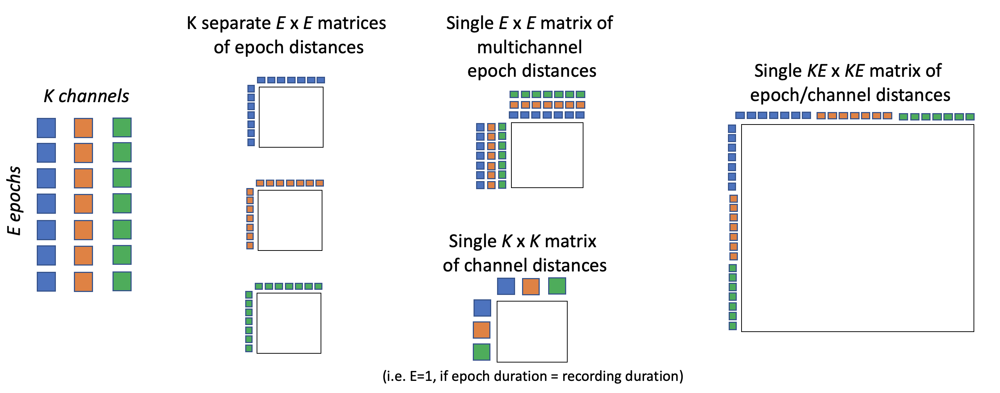
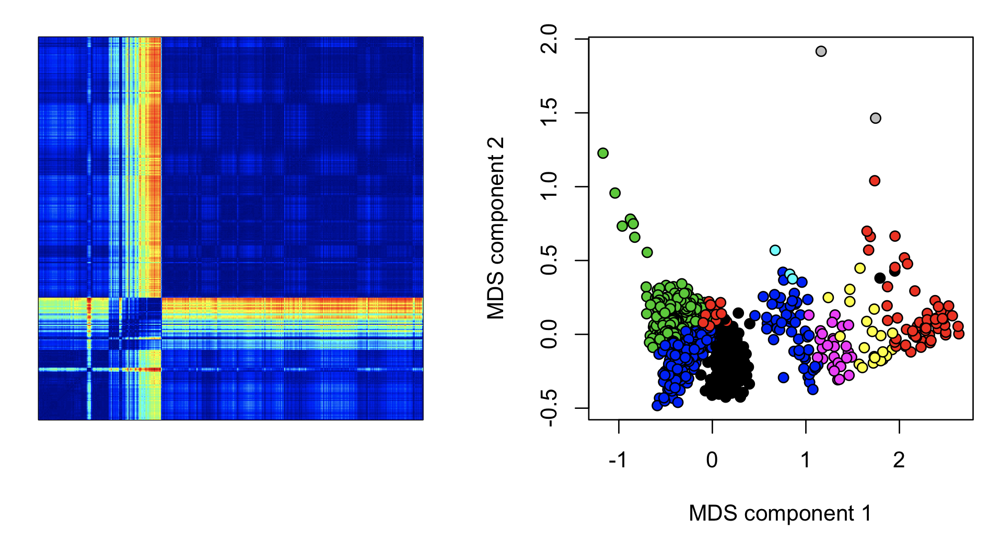
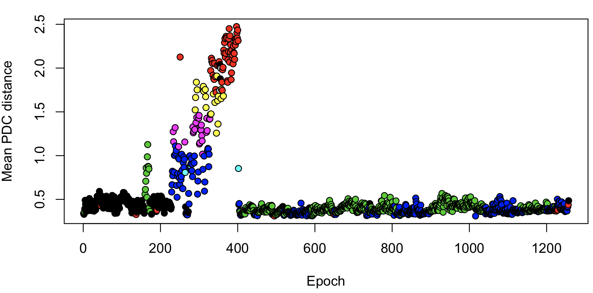
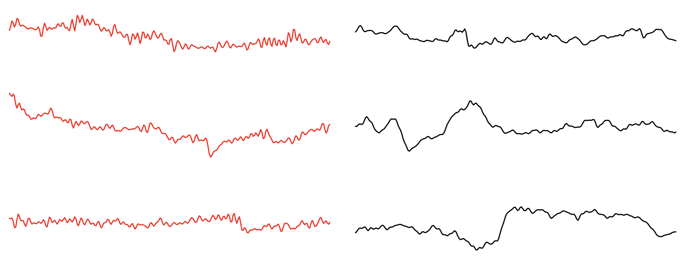
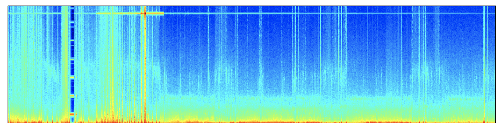
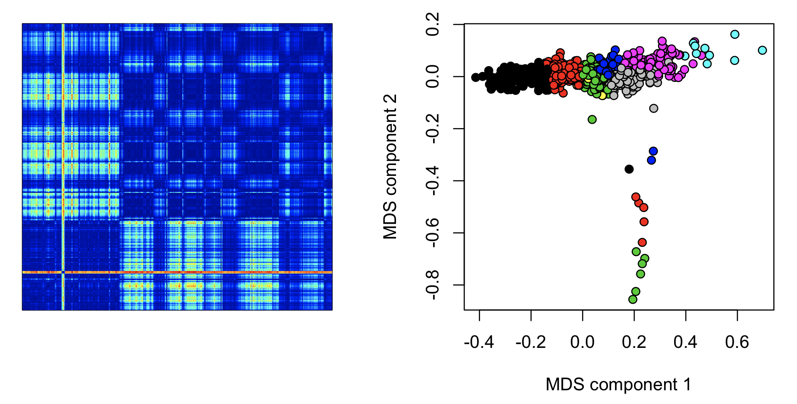
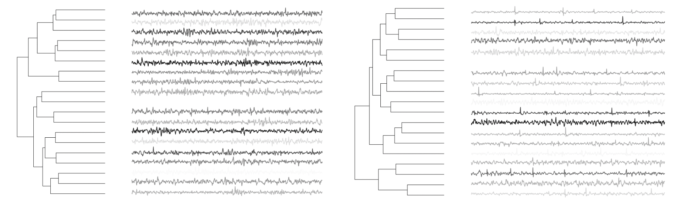
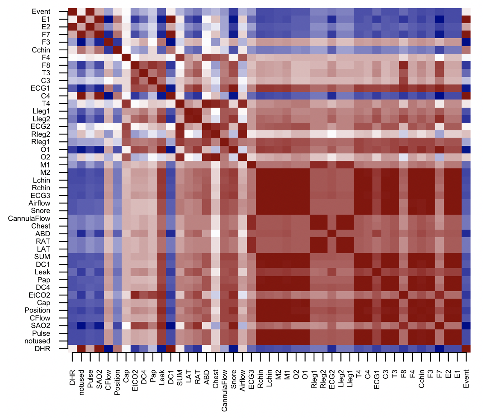
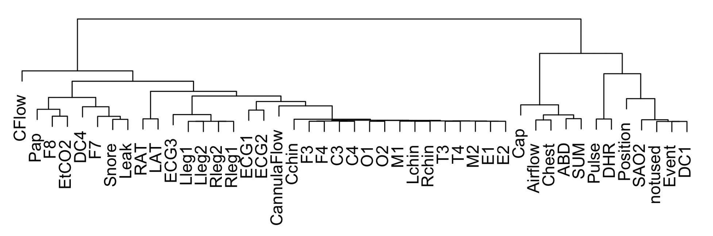

# Time-series clustering

## EXE

_Epoch-by-epoch or channel-by-channel time-series clustering_

This command provides an implementation of permutation distribution
clustering, following Andreas Brandmaier's [`pdc` R
package](https://rdrr.io/cran/pdc/). Within an individual, the `EXE`
command can be applied to signal data, either within or between channels and/or epochs,
to create a distance matrix
that may likely be the _starting point_ for subsequent clustering or
dimension reduction approaches.

This command runs in one of four basic modes: for _K_ channels and _E_ epochs:

 - _univariate_ : _K_ different channel-specific (_ExE_) matrics [`uni`]
 - _default_    : one combined multi-channel (_ExE_) matrix, i.e. a single distance metric for each pair of epochs is calculated based on the _multivariate_ profiles of the _K_ channels
 - _channel-wise_ : one channel-by-channel (_KxK_) matrix [`cat` with unepoched data ] 
 - _concantenated_ : one matrix concatenating epochs from different channels (_KExKE_) [`cat` with epoched data, i.e running `EPOCH` beforehand ]



After forming one of these distance matrices, it can be output to a
file for subsequent processing outside of Luna.  Additionally, the
`EXE` command can run hierarchical complete linkage clustering on this
distance matrix.

<h5>Parameters</h5>

Other than specifying the type of distance matrix to be constructed (via `cat`, `unit` and the presence of a prior `EPOCH` command), you
can change the default embedding dimension (`m`) and whether to skip samples (`t`).  

| Parameter | Example | Description |
|--- | --- | --- |
| `sig` | `sig=C3,C4` | Specify channels |
| `uni` | | Univariate (channel-by-channel) clstering of epochs |
| `cat` | | Concatenate channels |
| `mat` | `mat=f1` | Dump distance matrix in file `f1-{id}.mat` |
| `sr` | `sr=100` | Change sample rate of signals prior to analysis |
| `m` | `m=5` | Permutation embedding dimension (valid values: 2 to 7) |
| `t` | `t=1` | Time delay between samples (default 1, no delay) |

Hierarchical cluster analysis parameters:

| Parameter | Example |	Description |
|--- | --- | --- |
| `k` | `k=10` | Maximum number of clusters (stopping rule) |
| `mx` | `mx=20` | Maximum cluster size |


<h5>Output</h5>

The primary output of `EXE` is the `.mat` text file, which is a
tab-delimited distance matrix, containing the symmetric
alpha-divergence distance measure (which is proportional to the
squared [Hellinger
distance](https://en.wikipedia.org/wiki/Hellinger_distance)). For
multi-channel data (_K_ > 1), the distance is defined as the square
root of the sum of squared single-channel distances.

In some conditions (with the `cat` option), there will be a
corresponding `.idx` file, which describes the columns and rows of the
distance matrix (in terms of which channels/epochs each reflects):
i.e. containing an `ID` column and then `CH` (and optionally `E` also,
if the data are epoched).)


If clustering was performed, the solution will be written to the
default output mechanism:

Epoch-level cluster assignments (strata: `E`)

| Variable | Description |
| --- | --- |
|`CL`| Cluster seed (epoch number) |


<h5>Example</h5>

Here we estimate the epoch-by-epoch distance matrix for a single EEG channel in one individual:

```
luna s.lst 1 -o out.db -s 'EPOCH & EXE sig=C3 mat=d1 k=12'
```

If the individual's ID is `id001`, this will generate a file
`d1-id001.mat`.  We can then load this distance matrix into R, e.g.:

```
m <- as.matrix( read.table( "d1-id001.mat" ) ) 
```

We can also load the clusters that Luna assigned from the _K_ = 12
hierarchical (complete linkage) clustering:

```
k <- ldb("out.db")
c <- k$EXE$E
```

The cluster each epoch is assigned to is in `c$CL`.

Here we plot the epoch-by-epoch distance matrix as a heat map (left),
with the diagonal going from bottom left to top right.  Second, we
apply dimension reduction techniques such as multi-dimensional
scaling, to produce metrics that might flag aberrent epochs (note: we
just use a quick-and-dirty way to assign colors to clusters here, and
sometimes different clusters are assigned the same color):

```
image(as.matrix(m), col = jet.colors(100) )
plot( cmdscale(as.dist(m)), xlab="MDS component 1", ylab="MDS component 2", pch=21, bg=as.factor( c$CL ) ) 
```


These types of epoch-wise (or channel-wise) analyses can potentially
be useful in spotting (time-limited) aberrations in the data.  Clearly
there are some relatively unusual epochs starting about one third into
the recording: the hotter colours (yellow/red) indicate that these
epochs are more different compared to other epochs outside this
interval, versus a random pair of epochs.  Plotting the mean distance
per epoch shows this effect around epochs 200 to 300: (nb. the banded
assignment of epochs to the green, black or blue clusters from epoch
400 onwards presumably reflects differences in sleep stages.)

```
plot( apply(m, 1, mean), xlab="Epoch", ylab="Mean PDC distance", pch=21, bg=as.factor(c$CL) ) 
```


To get some more insight into this issue, we can look at raw data.
First, we will look at the assignment of epochs to clusters:

```
table( c$CL ) 
```
```
 57 116 166 242 264 306 337 353 354 377 727 856 
226  16   8  53   3  27  21   2   2  58 529 312 
```

The top numbers (the values of `c$CL`, e.g. 57, etc) are the 'seeds'
of each cluster, i.e. representing one epoch that was assigned to the cluster.

To look at the raw data for a given epoch, via lunaR, we can use
`ldata()`.  First, we randomly pick some epochs assigned to the
cluster centered around epoch 242:

```
epochs <- sample( c$E[ c$CL == 242 ] , 5 )
```

Plotting 2 seconds worth of data from the first of these epochs (sample rate is 128 Hz):
```
plot( ldata( e=epochs[1] , chs="C3" )$C3[1:256]  , type = "l" )
```

Repeating this for typical epochs, we can view different examples of
signals: e.g. here three instances from the unusual epochs (left /
red) and three random ones from the rest of the sample (each for 2 seconds):



These examples point to some high-frequency interference during epochs ~200-300, not
present in the rest of the signal (i.e. which made these epochs _more similar_).  We
can use lunaR to view the spectrogram for the C3 channel, up to 64 Hz:

```
lattach( lsl( "s.lst" )  , 1 )
k <- leval( "PSD sig=C3 epoch-spectrum max=64 dB" ) 
d <- k$PSD$CH_E_F 
lheatmap( d$E , d$F , d$PSD , col = jet.colors(100) ) 
```



This points to a a constant electrical line noise artifact (the horizontal streak across the top
of the spectrogram) which is amplified during the window from epoch 200 to 300.  As a proof-of-principle,
if we first band-pass filtered the signal prior to clustering:

```
luna s.lst 1 -o out.db -s 'EPOCH & FILTER sig=C3 bandpass=0.3,35 tw=0.5 ripple=0.02 & EXE sig=C3 mat=d1 k=12'
```

Now, we see a different structure in the data: the accentuated
line-noise effect from epochs 200-300 has been removed; making two
other feature of the data more visible: 1) a single small period of
unusual epochs (that are also evident in the spectrogram), and 2) a
long-range banding of similarity, which maps onto different stages of
sleep (e.g. N3 epochs are more similar to other N3 epochs than to REM
epochs, etc).




!!! note
    We provide these examples simply to illustrate working with signal data and the `EXE` command, i.e.
    by itself, epoch-level time series clustering is probably not the most obvious way to QC sleep signal data.

<h5>Potential applications</h5>


The `EXE` command by itself is not particularly useful, but it can form the basis of
other ways of looking at the data, i.e. any subsequent analysis that takes a distance
matrix as its starting point, either between channels, epochs, and both.

For example, here is one application in which hierarchical clustering
(in sleep EEG from mice, with 10 second epochs) followed by affinity
propagation clustering was used to generate _exemplar_ epochs for each
cluster (with the darkness of the trace being proportional to the frequency
of the cluster).   This provided a reasonably quick way to visually summarize more than 12 hours
of data for each individual, for example showing one with basically clean data (left) versus one
with a lot of recurrent artifact (right dendrogram).



A second class of application is to sanity check channels from polysomnography (PSG) studies.   Different types of channels (EEG, EMG, ECG, respiratory, etc)
will typically have somewhat distinctive _signatures_ in terms of the permutation distributions (here using a fixed sample rate across different
channels (via the [`RESAMPLE` command](manipulations.md#resample)) to allow distances across different types of channels:



Plotting the dendrogram associated with this distance matrix, we see the tendency for like channels to cluster.   If one or some channels have
very high levels of artifact, they will cluster separately.   



Although simply looking at the raw data would likely provide a
quick and simple way to similarly spot gross artifact, these types of visual summaries may be useful in the context of automated
pipelines that deal with large numbers of studies.