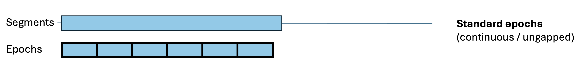
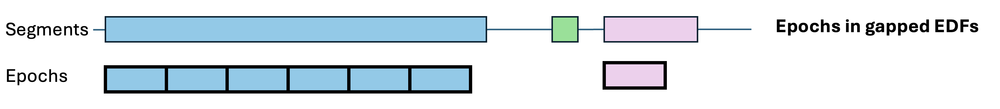
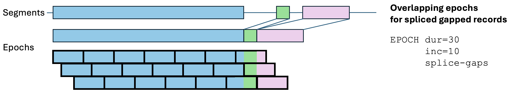

# Epochs

_Commands to define epochs for an EDF, and to attach annotations after loading an EDF_

| Command   | Description |
|------|---|
| [Epoch definitions](#epoch-types) | Overview of epochs |
| [`EPOCH`](#epoch) | Specify epochs |
| [`EPOCH-ANNOT`](#epoch-annot) | Load epoch-wise annotations from a [`.eannot`](annotations.md#eannot-files)-format file | 
| [Command table](#command-epoch-types) | Behavior of commands w.r.t. epochs & masks |


## Epoch types

_Epochs_ are time intervals that span the recording. Many Luna
commands either explicitly or implicitly rely on epochs being
defined. Epoching an EDF is often a first a step that is required for
many other Luna functions that work with epoched data.

In most instances, if epochs have not been specifically defined (by
the [EPOCH command](#epoch)), they will _default_ to non-overlapping
30-second intervals, i.e. mirroring traditional (AASM) sleep staging.

By default, epochs are non-overlapping, of fixed duration (30 seconds)
and contigous with respect to clock-time (i.e.  not spanning gaps in
the recording). These epoch properties can be changed various ways:

 - `dur`: epoch duration can be set to any duration in seconds, e.g. 5 seconds with `dur=5`

 - `inc`: the increment by default equals `dur` implying adjacenet but
 non-overlapping epochs (e.g. 0-30 seconds, 30-60, 60-90, etc). If
 `inc` is set to a different value, epochs can either be overlapping
 or (less likely) spaced.  For example, with `inc=15`: 0-30, 15-45,
 30-60, 45-75, etc).

TODO
 - `annot`: __generic__ or _annotation-based_ epochs can be  ... ___Fixed versus generic epochs:___ The most basic type of epoch is of fixed length (e.g. 30 seconds).
Epochs can be overlapping, e.g. shifting in 15 second increments
however, but by default, epochs are contiguous but not overlapping.
In contrast, _generic_ epochs are those of potentially variable
duration, defined by existing [annotations](annotations.md); this is
the most flexible form of epoch.

 - `splice-gaps`: 


{width="100%"}
{width="100%"}
{width="100%"}
{width="100%"}

Some commands (in particular `HYPNO`) require standard,
non-overlapping epochs (otherwise, the resulting hypnogram metrics would
not be appropriately defined). Most but not all commands can work with generic
epochs, [as detailed below](#command-epoch-types).  Luna will give an error message if trying
to use generic epochs with a command that does not accept them.

## EPOCH 

_Divides the time series into epochs_

This command can define either standard or generic epochs. 

<h3>Parameters</h3>

Without any parameters set, the default is 30-seconds, with no overlap
(i.e. 30-second increments, equivalent to `len=30` or `epoch=30`).  In
general, if the increment is not specified, it defaults to the epoch
length (i.e. no overlap between epochs).

By default, epochs start at 0 seconds (start of EDF).   The 

| Parameter | Example |Description |
| --- | --- | --- | 
| `len`  | 30 | Epoch length (seconds), defaults to 30 |
| `inc`  | 30 | Epoch increment (seconds), defaults to `len` (i.e. no overlap) |
| `epoch` | 30,15 | Epoch length{,increment} (seconds), defaults to 30,30 |
| `require` | 10 | Stop processing that EDF if there are not at least _N_ epochs | 
| `align` | `N1,N2,N3,R,W,?` | Align epoch starts with the first of these annotations |
| `offset` | 10 | Explicitly set start time for first epoch (seconds) |
| `clear` | | Reset any defined epochs |

_Note: if `align` is not given an explicit argument, it defaults to `N1,N2,N3,R,W,?,L,U,M` - i.e.
a list of common stage annotations._

Output options 

| Parameter | Example |Description |
| --- | --- | --- | 
| `min` | | Minimal output: writes the number of epochs to standard output | 
| `verbose` |  | Output epoch-level information when setting epochs |
| `table` | | As `verbose` except do not change the current epochs, only output the table |

Generic epochs

| Parameter | Example |Description |
| --- | --- | --- | 
| `annot` | `spindle` | Set generic epochs based on existing annotations |
| `w` | `5` |  Expanded window (seconds) both before and after each annotation |
| `w-before` | `5` | Extend annotation `w-before` seconds before the start point |
| `w-after` | `5` |  Extend annotation `w-after` seconds after the stop point |
| `start` | | Reduce annotations to their start (designed to work with `w` ) |
| `midpoint` | | Reduce annotations to their midpoint (designed to work with `w` ) |
| `stop` | | Reduce annotations to their stop (designed to work with `w` ) |


<h3>Outputs</h3>

Basic summary information (strata: _none_)

| Variable | Description |
| --- | --- |
| `DUR` | Epoch duration (as per the input) |
| `INC` | Epoch increment (as per the input) |
| `NE` | Number of epochs in the EDF, given `DUR` and `INC` |
| `GENERIC` | Flag to indicate whether epochs are _generic_ (0/1) |
| `OFFSET` | Any offset (from EDF start) |

Per-epoch interval information (option: `verbose`, strata: `E`)

| Variable | Description |
| --- | --- |
|`E1`       | Current epoch number (which may differ from `E` if the EDF has been restructured) |
|`DUR`      | Epoch duration (secs) | 
|`LABEL`    | Epoch label |
|`HMS`      | Clock-time for epoch start (hh:mm:ss) | 
|`INTERVAL` | String label of epoch interval (seconds) |
|`MID`      | Midpoint of epoch (seconds elapsed from EDF start) |
|`START`    | Start of epoch (seconds elapsed from EDF start) | 
|`STOP`     | Stop of epoch (seconds elapsed from EDF start) |
|`TP`       | Epoch interval in time-points (1TP = 1e-9 sec) |

<h3>Example</h3>

<h4>Fixed epochs</h4>

To set epochs of 10-seconds, each with a 5-second overlap (output
showing the first six epochs):

```
luna my.edf -o out.db -s ' EPOCH len=10 inc=5 verbose ' 
```

To get the number of epochs set:
```
destrat out.db +EPOCH
```
```
ID      DUR   GENERIC   INC     NE   OFFSET
nsrr01   10         0     5   8183        0
```
To get the exact location of each epoch: 	
```
destrat out.db +EPOCH -r E
```

```
ID     E  DUR E1      HMS      INTERVAL LABEL  MID START  STOP                        TP
nsrr01 1   10  1 21:58:17   0.00->10.00    E1    5     0    10            0->10000000000
nsrr01 2   10  2 21:58:22   5.00->15.00    E2   10     5    15   5000000000->15000000000
nsrr01 3   10  3 21:58:27  10.00->20.00    E3   15    10    20  10000000000->20000000000
nsrr01 4   10  4 21:58:32  15.00->25.00    E4   20    15    25  15000000000->25000000000
nsrr01 5   10  5 21:58:37  20.00->30.00    E5   25    20    30  20000000000->30000000000
nsrr01 6   10  6 21:58:42  25.00->35.00    E6   30    25    35  25000000000->35000000000
... (etc) ...
```

If we instead first applied a [`MASK`](masks.md#mask) (which implicitly run `EPOCH`
if the data aren't already epoched), [`RESTRUCTURE`](masks.md#restructure)ed the data,
and then requested information only (`table`) from `EPOCH`:
```
MASK epoch=10-14 & RE & EPOCH table
```
the output would be (i.e. note the difference between `E` and `E1`):
```
ID       E DUR E1      HMS        INTERVAL LABEL  MID START STOP                         TP
nsrr01  10  30  1 22:02:47  270.00->300.00   E10  285   270  300 270000000000->300000000000
nsrr01  11  30  2 22:03:17  300.00->330.00   E11  315   300  330 300000000000->330000000000
nsrr01  12  30  3 22:03:47  330.00->360.00   E12  345   330  360 330000000000->360000000000
nsrr01  13  30  4 22:04:17  360.00->390.00   E13  375   360  390 360000000000->390000000000
nsrr01  14  30  5 22:04:47  390.00->420.00   E14  405   390  420 390000000000->420000000000
```

!!! info
    The above command implicitly ran an `EPOCH` command prior to the `MASK`; the 
    above output will be from the second `EPOCH`.  Here, using 
    [`TAG`](summaries.md#tag)s can keep track of the various outputs: e.g. 
    ```
    TAG R/1 & EPOCH & MASK epoch=10-14 & RE & TAG R/2 & EPOCH table
    ```
    Output from the first (untagged) `EPOCH`:
    ```
    destrat out.db +EPOCH -r R
    ```
    ```
    ID      R  DUR  GENERIC  INC    NE  OFFSET
    nsrr01  1   30        0   30  1364       0
    nsrr01  2   30        0   30     5       0
    ```
    i.e. note the difference in `NE`.


<h4>Generic epochs</h4>

Generic epochs are those based on existing _annotations_.  One or more
annotation label followed the `annot` option of `EPOCH`: e.g.
```
EPOCH annot=Obstructive_Apnea,Hypopnea 
```

will define epochs based on apnea or hypopnea events.  Note that
generic epochs can be a variable size, and can overlap.  Running the above (with `verbose`)
produces the following outputs:
```
destrat out.db +EPOCH 
```
```
ID      GENERIC   NE
nsrr02        1  106
```
Note the `GENERIC` is now set to 1, but there is no information on epoch duration - i.e. because it may vary between epochs.  That information
is available in the epoch-stratified output (requested by `verbose`):
```
destrat out.db +EPOCH -r E 
```
```
ID     E DUR  E1      HMS         INTERVAL     LABEL  MID     START  STOP   TP
nsrr02 1 10.8  1 22:08:49 3043.70->3054.50  Hypopnea  3049.1  3043.7 3054.5 3043700000000->3054500000000
nsrr02 2 10.5  2 22:16:53 3527.30->3537.80  Hypopnea  3532.55 3527.3 3537.8 3527300000000->3537800000000
nsrr02 3 13    3 22:53:44 5738.40->5751.40  Hypopnea  5744.9  5738.4 5751.4 5738400000000->5751400000000
nsrr02 4 10.5  4 22:55:43 5857.90->5868.40  Hypopnea  5863.15 5857.9 5868.4 5857900000000->5868400000000
nsrr02 5 16.1  5 22:56:01 5875.30->5891.40  Hypopnea  5883.35 5875.3 5891.4 5875300000000->5891400000000
nsrr02 6 15.9  6 22:59:33 6087.20->6103.10  Hypopnea  6095.15 6087.2 6103.1 6087200000000->6103100000000
... (etc) ...
```
The `DUR` is the duration of each epoch (which here matches the duration of each hypopnea annotation). The `LABEL` is
the annotation name (`Hypopnea` or `Obstructive_Apnea`).

Re-running with the altered command: 
```
EPOCH annot=Obstructive_Apnea,Hypopnea verbose start w-after=5 
```
This should define epochs as 5 seconds, starting at the _start_ of each respiratory event:
```
ID     E  DUR E1       HMS          INTERVAL     LABEL  MID    START  STOP   TP
nsrr02 1  5   1   22:08:49  3043.70->3048.70  Hypopnea  3046.2 3043.7 3048.7 3043700000000->3048700000000
nsrr02 2  5   2   22:16:53  3527.30->3532.30  Hypopnea  3529.8 3527.3 3532.3 3527300000000->3532300000000
nsrr02 3  5   3   22:53:44  5738.40->5743.40  Hypopnea  5740.9 5738.4 5743.4 5738400000000->5743400000000
nsrr02 4  5   4   22:55:43  5857.90->5862.90  Hypopnea  5860.4 5857.9 5862.9 5857900000000->5862900000000
nsrr02 5  5   5   22:56:01  5875.30->5880.30  Hypopnea  5877.8 5875.3 5880.3 5875300000000->5880300000000
nsrr02 6  5   6   22:59:33  6087.20->6092.20  Hypopnea  6089.7 6087.2 6092.2 6087200000000->6092200000000
... (etc) ...
```
Now `DUR` is fixed at 5 seconds for each epoch; note how the start times are the same as above (e.g. 3043.70 seconds for the first epoch)
but now the end is altered, reflecting the effect of `start w=5`.

!!! hint "Reducing/expanded annotations to epochs"
    If requested, note
    that either `start`, `midpoint` or `stop` are applied first
    (i.e. shrinking the annotation to a single time-point), followed
    by either `w`, `w-before` or `w-after` (i.e. expanding the
    interval either before, after or around (centered on) that
    time-point.  Note that it is also possible to apply the `w*`
    expansion options with first reducing the annotations by `start`,
    `midpoint` or `stop`.  This expands the interval by the requested number
    of seconds, at either the start (`w-before`), the end (`w-after`) or at both
    start and end (`w`). 


## EPOCH-ANNOT

_Attach epoch-level annotations from a file, to an epoched EDF_

This command reads a __plain-text__ file from disk, expecting the
[`.eannot`](annotations.md#eannot-files) format.  It is possible to
apply multiple sets of annotations to epochs with multiple
`EPOCH-ANNOT` commands.

The behavior of this command similar but not identical to what would
happen if the `.eannot` file were directly specified in the
[_sample-list_](../luna/args.md#sample-lists) (i.e. as any other XML,
`.annot` annotation file).  As this command can be performed
after the EDF has been loaded and manipulated (e.g. via
[`RESTRUCTURE`](masks.md#restructure)), the number of epochs
(i.e. rows in the file) should _match exactly_ the number of epochs
given the _current state_ of the in-memory EDF (i.e. after any
restructuring, and with the current epoch definitions).  
           
That is, if `EPOCH` generates 1022 epochs for a given EDF, then
the annotation file must be _exactly_ 1022 epochs. Luna will give an
error if the `EPOCH` command has not been performed prior to
`EPOCH-ANNOT`.

_In contrast_, when attaching an `.eannot` file via the sample-list,
Luna assumes the `.eannot` file corresponds to the entire _on-disk_
EDF (typically with the default 30-second epochs).  (When attaching
initially from a sample list (not `EPOCH-ANNOT`) the tolerance
for exact matching can be altered with the 
[special variables](../luna/args.md#special-variables)
`no-epoch-check` and `epoch-check`.)

An optional `recode` parameter can be used to translate annotations on-the-fly.

!!! danger "Make sure to use plain-text files"
    Annotation files should be plain-text ASCII files
    with no special encodings, not RTF (rich text format), etc.
    Please see [this FAQ](../faq.md#windows-line-endings).

<h3>Parameters</h3>

| Parameter | Example | Description |
| --- | --- | --- |
| `file`   | `file=annots/id1.epochs` | File path/name to read annotations from (required) |
| `recode` | `recode=ST1=N1,ST2=N2` | Optional, comma-delimited list of recodings (_from_=_to_) |

<h3>Outputs</h3>

This command does not produce any output _per se_, other than noting
the number of epoch/annotations read in the log/console, e.g.

```
 CMD #2: EPOCH-ANNOT
 mapping 2 distinct epoch-annotations (1022 in total) from annots/test.eannot
```

<h3>Example</h3>

Here we attach epoch-annotations to an epoched EDF and use them to
[_mask_](masks.md) out certain epochs.  For example, here we have a
dummy annotation file, that contains an annotation of either `T` or
`A` for each epoch.  This particular EDF has 1022 30-second epochs,
and so the file `epoch1.eannot` is the same length:

``` 
$ sort epoch1.eannot | sort | uniq -c 
102 A 
920 T
```

The file `epoch1.eannot` is a simple text-file, with either an
`A` or a `T` on each line, and nothing else.

!!! note 
    Annotations are not restricted to `A` or `T` or single
    characters: they can be any text string, but should not contain
    spaces or special characters.  A common use may be if sleep
    staging has been performed, so each row indicates _N1_, _N2_,
    _N3_, _REM_ or _Wake_, etc.


To attach this file, and use it to select only `A` epochs:

```
luna my.edf -s ' EPOCH & EPOCH-ANNOT file=epoch1.eannot & MASK ifnot=A & RE '
```

```
 ..................................................................
 CMD #1: EPOCH
 set epochs, length 30 (step 30), 1022 epochs
 ..................................................................
 CMD #2: EPOCH-ANNOT
 mapping 2 distinct epoch-annotations (1022 in total) from epoch1.eannot
 ..................................................................
 CMD #3: MASK
 set masking mode to 'mask' (default)
 based on A 102 epochs match;  920 newly masked, 0 unmasked, 102 unchanged
 total of 102 of 1022 retained
 ..................................................................
 CMD #4: RESTRUCTURE
 restructuring as an EDF+ : keeping 3060 records of 30664, resetting mask
 retaining 102 epochs
```

Having selected epochs based on these external annotations, 
one might subsequently apply other analysis commands, or write out a new EDF (see
[`WRITE`](outputs.md#write)), for example.

!!! hint "Working with multiple EDFs"
    When using [sample-lists](../luna/args.md#sample-lists) to
    work with multiple EDFs, it is often convenient to use the `^`
    special character in a script, which is replaced with the ID (from
    the first column of the sample-list, not the EDF header) for that
    individual.  This enables the same script to point to different
    annotations files for different individuals (assuming 
    that those annotation files are named based on the IDs).
   
Here is an example of using a script (instead of the `-s` option) for
achieve the same result as above, but here using a sample list and
renaming the annotation file to, for example,
`annots/id001.epoch.eannot`.  We might specify the sample list `s.lst`
as follows, to assign the ID `id001` to the EDF:

``` 
id001    my.edf 
```

The Luna script (`extract.txt`) below
also illustrates using a [_variable_](../luna/args.md#variables)
to specify more flexibly the required annotation,
and writing a new EDF (with the [`WRITE`](outputs.md#write) command):

```
% Epoch the data (default 30 sec)

EPOCH

% Attach the matching file in the annots/ folder for this individual
% i.e. requires that files are named 

EPOCH-ANNOT file=annots/^.eannot

% Set this mask, where the value of ${x} will be specified 
% on the command line

MASK ifnot=${x}

% Apply the mask, actually restructuring the internal EDF
% (Note, RESTRUCTURE can be abbreviated as RE)

RESTRUCTURE

% Write a new EDF back to disk

WRITE edf-dir=edfs/            % write new EDFs in this directory/folder
      edf-tag=extract-${x}     % add this tag to the filename for each EDF
      sample-list=s-${x}.lst   % make a new sample-list to point to the new EDFs
```

Note how the `^` character is used to specify the individual/EDF
ID. We can then run Luna, setting the `x` variable to `A`:

```
luna s.lst x=A < extract.txt 
```

For individual `id001`, for example, Luna searches for
`annots/id001.eannot` and then masks epochs that do not match the
value specified by the variable `${x}` (here set to `A`).

After `RESTRUCTURE`-ing, it `WRITE`s an EDF to `edfs/my-extract-A.edf`
and creates a matching sample list `s-A.lst`. As a sanity check,
running `DESC` on the new project:

```
luna s-A.lst -s DESC
```
correctly shows a 51-minute (i.e. 102 30-second epochs) EDF:
```
EDF file          : edfs/my-extract-A.edf
ID                : id001
Duration          : 00:51:00
Number of signals : 6
Signals           : EOG-L[256] EOG-R[256] EMG[256] EEG1[256] EEG2[256] EEG3[256]
```


## Command & epoch types

Not all commands can be combined with generic epochs.  Here we list the current constraints
of particular commands with respect to epoch definitions. These fall into the following classes:

 - commands that ignore epoch definitions

 - commands that work with any epoch definition

 - commands that cannot use generic epoch definitions

Generally, Luna will tell you if there is a problem, but the detailed
tables below are included for reference.

<h4>Commands that ignore epoch definitions</h4>

The following primarily do not touch signal-level data and are therefore
not impacted by the presence or absence of any type of epoching:

``` 
ALIASES  ALIGN ANNOTS ANON CANONICAL CLOCS CONTAINS 
CPT CWT-DESIGN DESC EDF ENFORCE-SR FILTER-DESIGN HEADERS 
MAKE-ANNOTS MEANS OVERLAP RECORD-SIZE REMAP RENAME
SET-HEADERS SET-TIMESTAMPS SET-VAR SIGGEN SIGNALS
SIMUL SL SUMMARY TAG  TIME-TRACK TYPES  VARS  WRITE-ANNOTS
```

The following pull the entire signal and treat it as a continous
time-series - i.e. they effectively ignore any epoch definitions.
Typically, commands that manipulate/generate an EDF signal do not work
with epochs, as they must replace the whole signal in the EDF.
```
1FNORM A2S ACF ADJUST ALTER COPY CWT DUMP-RECORDS
EMD FFT FILTER FLIP FREEZE HILBERT ICA MINMAX
mV OTSU RECS RECTIFY REFERENCE RESAMPLE
REVERSE S2A SEGMENTS SPANNING
THAW TLOCK TRANS TV uV WRITE Z-PEAKS
```

<h4>Commands that work with any epoch defintions</h4>

These commands will not consider signal data outside of unmasked epochs.

Of these, the following allow generic (variable-sized) epochs:

| Command | Notes |
|----|----|
|`CHEP`| Variable epoch size allowed, but not directly accounted for in analysis |
|`CHEP-MASK`|    (make more sense w/ equal sized : epochs weighted equally) |
|`DUMP-MASK`| | 
|`DUPES`| |    
|`EPOCH`| |    
|`EPOCH-ANNOT`| If no epochs defined, adds as fixed default (30s) |
|`GP`|     |
|`HEAD`| Select which epoch w/ "epoch" arg; always dump from epoch |
|`INTERPOLATE`|    |
|`MASK`| |
|`MATRIX`| Only outputs data in epoched |
|`MSE`|    |
|`MTM`| | Also has a concept of _segments_ | 
|`PSC`| Only works on stats, which may be epoch level but size etc is arbitrary; they will be equally weighted in analyses however |
|`PSD`|     |
|`RESTRUCTURE / RE`| |
|`SEDF`| (but drops epoch timing information in output .sedf) |
|`SIGSTATS`|  Outputs simple, unweighted epoch means |
|`TABULATE`| |
|`XCORR`| |
```

Allow whole-recording, or epoch-level analysis, and allow variable-sized epochs:

| Command | Notes |
|-----|-----|
|`CORREL`| (w/ `epoch` or `ch-epoch`) |
|`EVAL`| `interval` for whole-recording |
|`EXE`|    (w/ `epoch`) |
|`LZW`|    (w/ `epoch`) |
|`MI`|    (w/ `epoch`) |
|`MS`|    (w/ `epoch`) |
|`PSI`|    (w/ `epoch`) |
|`SO`| Extra output only |
|`SPINDLES`| Assumes fixed epoch length for spindle/SO shuffling within-epoch (gives warning/error) : otherwise okay (for basic spindle counting per epoch) |
|`STATS`|  (w/ `epoch`) |


<h4>Commands that only work with uniform-sized epochs</h4>

Epoch-level commands that do not allow variable-sized epochs:

| Command | Notes |
|----|-----|
|`ARTIFACTS` | |
|`EVAL-STAGES` | |
|`HYPNO` | |
|`PLACE` | |
|`POPS` | |
|`REBASE` | |
|`SOAP` | |
|`STAGE` | |

These commands can be run in either whole-signal mode, but if run in epoch-level mode, they do not allow variable-sized epochs:

| Command | Notes |
|-----|-----|
|`CC`| w/ `epoch` |  Assumes epochs have equal sizes |
|`COH`|    w/ `epoch` | Assumes epochs have equal sizes |
|`IRASA`| Ignores any offset; assumes fixed epoch len, no overlap + zero offset |
|`LINE-DENOISE`| Assumes epochs are contiguous and no offset (and spans whole record, or last few points uncorrected) |
|`MOVING-AVERAGE`| w/ `epoch`, assumes epochs are contiguous and no offset (and spans whole record, or last few points uncorrected) |
|`PEAKS`| w/ `epoch`, assumes contiguous epochs |
|`ROBUST-NORM`| w/ `epoch`, assumes epochs are contiguous and no offset (and spans whole record, or last few points uncorrected) |
|`SUPPRESS-ECG` |  Command currently forces 30s epochs after pulling whole signal |
|`ZC`| w/ `epoch`, assumes epochs are contiguous and no offset (and spans whole record, or last few points uncorrected) |
