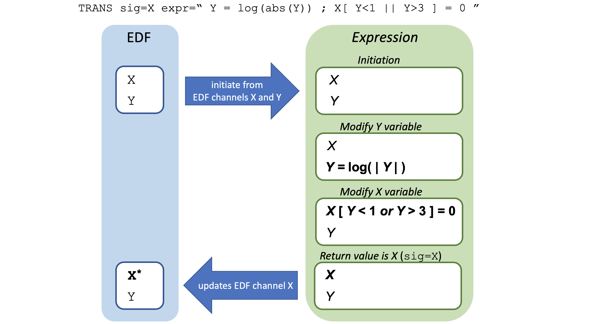

# Expressions

_Here we describe_ eval _expressions: what they are and how they can be used_

| Command  | Description |
|---|---|
| [_Eval_ expressions](#eval-expressions) | Overview of _eval_ expressions |
| [`EVAL`](#eval) | Evaluate annotation-based general expressions |
|[`TRANS`](#trans)  | Arbitrary transformations of signal data |

!!! warning "Advanced material" 
    This page can likely be skipped on the
    first pass through of this documentation.  The material provided
    here provides some flexible ways to work with annotations and signals. For annotations, most
    simple tasks can be accomplished using the simpler
    [mask](masks.md) syntax.

## Eval expressions

Luna provides a mechanism for on-the-fly evaluation and assignment of
signal-based and annotation-based expressions: _eval_ expressions.  These expressions
can either be used to specify [_masks_](masks.md) via the
[`MASK`](masks.md#mask) command, or (as described here) with the
[`EVAL`](#eval) command, which can be used to generate new epoch-wise
annotations.  Alternatively, with the [`TRANS`](#trans) command, you can create
or modify existing channels (and/or create arbitrary interval-based annotations
from these).  These expressions allow for:

 - a flexible way to mask epochs based on annotation data
 - evaluation of logical and arithmetic expressions
 - creation of new meta-data variables on-the-fly
 - creation of new channels, or modofying channels on-the-fly

In short, these expressions allow [_variables_](#variables) based on
attached signal and annotation data to be manipulated via a range of [_functions
and operators_](#operators-and-functions) in
[_multi-component_](#multi-component-expressions) expressions, which are
evaluated to return a true/false (Boolean) result (used in the case of
the `MASK` command), or numeric vector (as for `TRANS`), as well as [_assigning new
variables_](#assignments) (which is the focus of the `EVAL` command).

<h3>Testing expressions with the <tt>--eval</tt> option</h3>

You can use the `--eval` option to test out simple expressions on the
command-line, to get a sense of how expressions work.  Here, the
expression is expected to come from the _standard input stream_.  For
example, to evaluate a simple arithmetic expression (using the
`echo` command to pipe in the expression):

```
echo "2+2" | luna --eval
```

The output below shows that the expression a) was valid, b) evaluated to `4`
(with the `i` indicating integer type), c) has a return value that was
interpreted as `true` when cast to a Boolean type (as would be the
case if using _eval_ expressions with the `MASK` command), and d)
did not create/assign any new variables 

```
parsed as a valid expression : yes
return value                 : 4i
return value (as T/F)        : true
assigned meta-data           : 
```

This second, more complex example illustrates a number of other
features, more fully described below: assigning new variables,
multi-part statements, conditional statements, textual variables and 
comparison/equality tests:

```
echo "J=2+2 ; S = ifelse( J > 5 , 'A' , 'B' ) ; S != 'A' " | luna --eval
```
```
parsed as a valid expression : yes
return value                 : true
return value (as T/F)        : true
assigned meta-data           : J=4;S=B
```

That is, `J` is assigned a value of `4`; in the second part, because
this is less than `5`, the new variable `S` is assigned a value of `B`
rather than `A`; in the final part, the test for whether `S` is _not
equal to_ `A` therefore returns true.

Naturally, unlike these toy examples, in practice _eval_ statements
will be evaluating annotation data on an epoch-by-epoch basis (the
presence/absence, or quantity of certain annotations, as well as their
associated meta-data).  We describe [below](#mapping-annotations) how
annotation data are represented is _eval_ expressions.  The rest of this section comprises a
description of [variables](#variables), [operators and functions](#operators-and-functions) and 
[complex expressions](#complex-expressions).


!!! hint 
    This should be completely unnecessary for most circumstances, but 
    to get a _really_ detailed look at the steps involved in
    evaluating an eval expression, use the extended form
    `--eval-verbose`.  This will list the tokens in [Reverse Polish
    Notation](https://en.wikipedia.org/wiki/Reverse_Polish_notation)
    and then show how the tokens are evaluated.  


#### Variables

Variable names must start with a letter and are case-sensitive.  They
can contain numeric characters, underscores and periods.  In addition
to the reserved characters tabulated [below](#operators-and-functions),
they cannot be the _reserved words_ `true` or `false`.
The following are examples of **valid** variable names:
```
A       a1      ann_1    so.amp
```
The following are examples of **invalid** variable names:
```
C4/A1   2X      A-B      nrem(2)
```

##### Types

Variables in _eval_ expressions have strong _typing_ in the sense of
each token being of either an _integer_ (`int`), a _floating-point_
numeric value (`num`), a _text_ string (`txt`) or a Boolean true/false
value (`bool`), corresponding to the type system for annotation
meta-data, as described above.

The _type_ of a variable impacts whether certain operations are
allowed, or how they are evaluated.  For example, if `I` is an integer
value (`2`), `F` is a floating-point value (`0.5`), and `S` is a
string-value (`text`), then the addition operator applied to pairs of
variables would result in the following types:

```
 I + I  -->  4          (integer)
 I + F  -->  2.5        (float)
 S + S  -->  'texttext' (string concatenation)
 I + S  -->  '.'        (operation not defined, so returns a 'null' value)
```

##### Scalars and vectors

As well as _scalars_ (i.e. variables described by a single element),
Luna allows for _vectors_ (often referred to here as _arrays_ also).
For example, a vector can be assigned within an _eval_ expression:

```
X = int(1,2,3)
```

which assigns a three-element integer array.  Other functions to create
arrays are `num()`, `txt()` and `bool()` for floating-point, text and
Boolean arrays, respectively.

!!! alert
    Arrays cannot consist of heterogeneous elements, e.g. both text _and_ numeric values.</p>

Most of the main arithmetic and logical operators (described
[below](#operators-and-functions)) can be applied to vectors as well as
scalars, namely:

```
  +  -  *  /  ==  !=  =~ <  >  <=  >=  !=  &&  || 
```

The above operators can be used on two vectors, as long as they are
the same length. Note that these operate _element-wise_ (e.g. rather
than performing matrix multiplication).

```
echo "A=int(1,2,3) ; B=int(2,4,6) ; C=A*B " | luna --eval

parsed as a valid expression : yes
return value                 : true
return value (as T/F)        : true

assigned meta-data           : A=1,2,3;B=2,4,6;C=2,8,18
```

It is also possible to combine vector and scalar variables in arithmetic 
These operations can also combine vector and scalar variables, so
`Y=A/2` yields `[0.5,1,1.5]`.

To give some more examples:

```
echo "A=int(1,2,3) ; B=int(2,4,6) ; C=A*B ; C < 10 " | luna --eval
```
```
parsed as a valid expression : yes
return value                 : [true,true,false]b
return value (as T/F)        : true
assigned meta-data           : A=1,2,3;B=2,4,6;C=2,8,18
```

returns the Boolean vector `[ T , T , F ]`, which evaluates to true
(because at least one element is true).

If `X` is an integer vector, constructs in the form:

```
sum( X == 10 )
```
or
```
any( X == 10 )
```

are often useful for evaluating either how many elements of a vector
(`sum()`), or whether at least one (`any()`), match that condition (in
this case, being equal to 10).

Individual elements of array can be accessed with the `[]` operator:
e.g. ` D[2] ` will return the second element in an array called `D`
(or a null value if the array doesn't exist, or has fewer than two
elements).

!!! note
    Array indexes are 1-based, e.g. (1,2,3) for a three-element
    array, not 0-based as is often the case in many programming languages, e.g. (0,1,2).

The `[]` operator can take a scalar, as above, or one can extract out
multiple elements (in a manner somewhat similar to the R language).
This expression:

```
X[ int(1,3) ]
```

or, equivalently:

```
I = int(1,3) ; X[I]
```

will return a vector of two elements, being the 1st and 3rd element of the vector `X`.

Alternatively, if `M` is a Boolean array _of the same length_ as `X` then the expression:

```
X[M]
```
returns the subset of `X` for which the corresponding element in `M` is true.


##### Null values

Missing or _null_ values can occur from a requested variable not being
present for a particular annotation/instance, or from illegal
operations (e.g. trying to add a string and an integer value).

Most operations that involve a _null_ value will return a null value
too, meaning that operation is undefined.  An exception is the logical
OR operator:  `A || B` will return:

- `true` if `A` is `true` or if `B` is `true`
- `null` if both `A` and `B` are null
- `false` otherwise

In contrast, the logical AND (`&&`) operator requires both sides to be non-null: `A && B` will return:

- `true` if `A` is `true` and `B` is `true`
- `null` if either `A` or `B` are `null`
- `false` otherwise

##### Mapping annotations

If, for example, annotation _class_ `a1` exists (i.e. was in an
attached annotation file, as described above), then Luna will create a
variable also named `a1` that can be accessed in any _eval_
expression.  The `a1` variable will be a _text-vector_, with as many
elements as there are _instances_ of that annotation in whichever
epoch is being considered. Each element of the `a1` vector will be set
to the corresponding _instance ID_.

As described below, the `if()` function can be used to indicate
whether or not a given variable (i.e. and therefore, the corresponding
annotation _class_) is present:

```
 if( a1 )
```

That is, this expression returns a Boolean value (true/false) to
indicate whether that epoch has one or more `a1` annotations.

If annotation instances have associated _meta-data_, these will also be
mapped to variables that are accessible within _eval_ expressions.
The naming scheme for these variables is
```
{annotation class}.{variable name}  
```

For example, consider the following toy annotation file: one class
(`a1`) with three instances for the first epoch, each with three
_meta-data_ variables:

```
a1 | Example annotation | v1[num] v2[txt] v3[bool]
a1	i1	e:1	10.00	A T
a1	i2	e:1	92.10	B T
a1	i3	e:1	108.5	C F
```
On loading this file, one would see the following in the log:
```
 annotations:
  [a1] 3 event(s) (from test.annot)
   3 instance IDs:  i1 i2 i3
   w/ 3 field(s): v1[num] v2[txt] v3[bool]
```

In this example, when evaluating any _eval_ expression, the `a1`
variable would be a three-element vector of instance IDs:

```
 a1 = [ 'i1' , 'i2' , 'i3' ] 
```

The meta-data (each of which have a defined _type_ which is reflected
in expression) are represented by vectors that concatenate values from all instances: that is, a
vector of floating-point numbers called `a1.v1`:
```
 a1.v1 = [ 10.0 , 92.1 , 108.5 ]
```
a vector of text values `a1.v2`:
```
a1.v2 = [ 'A' , 'B' , 'C' ]
```
and a vector of Boolean values `a1.v3`:
```
a1.v3 = [ T , T , F ]
```

If there is only a single instance of an annotation in a given epoch,
the expression variables would be _scalars_ rather than _vectors_.  As
described below, _eval_ expressions provide a number of functions to
facilitate working with vectors.

#### Operators and functions 

##### Core operators

The core _eval_ operators follow closely C/C++-style syntax and
precedence for the following operations:

| Operator | Scalar Types | Description |
| --- | --- | --- | 
|   `&&`  | `bool` `int` | logical AND  |
|   `||`  | `bool` `int` | logical OR |
|   `+`   | _all_ (see below) |  addition |
|   `-`   | `int` `num` |  subtraction |
|   `*`   | `int` `num` |  multiplication |
|   `%`   | `int` `num` |  modulus (also `%%`) |
|   `==`  | _all_ |  equals |
|   `!=`  | _all_ |  not equals |
|   `=~`  | _all_ |  matches/contains |
|   `!`   | _all_ |  logical (unary) not |
|   `>`   | _all_ |  greater than |
|   `>=`  | _all_ |  greater than or equal to|
|   `<`   | _all_ |  less than |
|   `<=`  | _all_ |  less than or equal to |
| | |
|   `( )` | n/a |  parentheses, to group expressions |
|   `=`   | _all_ |  assignment operator|
|   `;`   | n/a |  separate different expressions|

Some notes on these operators:

- `&&` and `||` are only defined for Boolean and integer types
- for text variables, the addition operator means _concatenate_
- for addition, subtraction and multiplication, Boolean values are treated as `0` and `1` integers
- greater/less than operators for text values compare on alphabetical order
- greater/less than operators for Boolean values are based on `1` and `0` values for `true` and `false`, and can be compared against integers and floating-point numbers
- tests of identity (`==`) can be made between Boolean, integer and text types, but not floating point value
- the `==` operator returns a vector for vector/vector comparisons of the same length, based on _element-wise comparison_
- in contrast, the _match_ operator `=~` returns a `true` if _any element of the first vector/scalar matches _any_ element of the second vector/scalar

The _match_ operator (`=~`) is useful in testing whether or not an
annotation _instance_ is present in a given epoch. This table
illustrates how the equality and match operators differ.  The primary
difference is that the _match_ operator does not perform an
element-wise comparison, and returns a scalar for _any_ matching
between the two sides (which may be vectors of different lengths).

| LHS | RHS | Equals (==) | Matches (=~) |
| --- | --- | ---- | ---- | 
| `txt( 'A','B' )`     | `txt( 'A','B' )`  | `[ T , T ]`  | `T` |  
| `txt( 'A','B' )`     | `txt( 'B','A' )`  | `[ F , F ]`  | `T` |  
| `txt( 'A','B' )`     | `A`               | `[ T , F ]`  | `T` |  
| `txt( 'A','B','C' )` | `txt('A','B')`    | n/a  | `T` |  
| `txt( 'A','B','C' )` | `D`               | `[ F, F , F ]` | `F` |  
| `txt( 'A','B','C' )` | `txt('D','E')`    | n/a  | `F` |  


##### Mathematical functions

| Function | Description |
| ---- | ---- | 
| `sqr(x)`    |  square of `x` |           
| `sqrt(x)`   |  square-root of `x` |  
| `pow(x,y)`   |  `x` to power of `y` | 
| `log(x)`    |  natural log of `x` |
| `log10(x)`   |  base-10 log of `x` |
| `exp(x)`    |  exponent of `x` |
| `rnd()`     | random float between 0 and 1 | 
| `rand(x)`   | random integer between 1 and x |
| `floor(x)`  | round `x` down |
| `round(x)`  | round `x` to nearest integer |
| `abs(x)`    | absolute value of `x` |


##### Conditionals

| Function | Description |
| ---- | ---- | 
| `if(x)`    |  returns true if variable `x` is defined, otherwise false |
| `ifnot(x)`  |  complement of `if(x)` |
| `ifelse( cond , X , Y)` |  return `X` if condition `cond` is true, otherwise `Y` |  

Here is one example of using it to provide a default value for a
meta-data variable that may be missing for certain
annotations/instances:

```
v1 = ifelse( set( a1.v1 ) , a1.v1 , 0.5 ) 
```

i.e. if the `v1` field in annotation `a1` is not present, it will be created 
with a default value of 0.5; otherwise, it will be kept as is.

!!! warn
    The `ifelse()` must return similar, or easily-convertible types:
    ```
    ifelse( DB == 1 , N , TYPE ) 
    ```
    is not allowed if, for example, `N` is an integer, and `TYPE` is a
    string.


##### Vector functions

| Function | Example &nbsp; &nbsp; &nbsp; &nbsp; &nbsp; &nbsp; &nbsp; &nbsp; &nbsp; &nbsp; &nbsp; &nbsp; &nbsp; &nbsp; &nbsp; &nbsp; &nbsp; &nbsp; &nbsp; &nbsp; &nbsp; &nbsp; &nbsp;| Value &nbsp; &nbsp; &nbsp; &nbsp; &nbsp; &nbsp; &nbsp; &nbsp; &nbsp; &nbsp; &nbsp; &nbsp; &nbsp; &nbsp; &nbsp; &nbsp;&nbsp; &nbsp; &nbsp; &nbsp;| Types | Description | 
| ---- | ----- | ---- | ---- | --- |
| `int(x)` | `int(1,2,3)` | `[1,2,3]` | Integer vector | Generate a new 3-element integer array |
| `num(x)` | `num(1,2.5,3)` | `[1,2.5,3]` | Float vector | Generate a new 3-element floating-point array |
| `txt(x)` | `txt('A','B','C')` | `['A','B','C']` | Text vector |  Generate a new 3-element text array |
| `bool(x)` | `bool(1,0,1)` | `[true,false,true]` | Boolean vector  | Generate a new 3-element Boolean array  |
| `[ ]`     | `a=int(8,10,12) ; a[2]` | `10` | All | Index array elements |
| `min(x)` | `min(int(-1,2,8))` | `-1` | All | Minimum value in any array |
| `min(x)` | `min(int(-1,2,8))` | `8` | All | Maximum value in any array |
| `sum(x)` | `sum(int(-1,2,8))` | `9` | Integer, numeric and bool | Sum of values in an array |
| `mean(x)` | `mean(int(-1,2,8) )` | `3` | Integer, numeric and bool | Mean of values in an array |
| `sd(x)`   | `sd(int(-1,2,8) )` | `4.58` | Integer, numeric and bool | SD of values in an array |
| `sort(x)` | `sort(txt('C','A','B'))` | `['A','B','C']` | All | Sorts values in an array |
| `c(x,y)` | `c('A',txt('B','C'))` | `['A','B','C']` | All similar types | Concatenates scalars and/or arrays |
| `size(x)` | `size(txt('A','B','C'))` | `3` | All | Size of an array |

<!---
| `rep(x,n)` | `rep( 1 , 3 )` | `[1,1,1]` | Vector | Repeat `x` `n` times |
| `seq(x,y,i)` | `seq( 1 , 3 )` | `[1,2,3]` | Vector | Generate vector with sequence `x` to `y`, increment `i` |
--->

#### Complex expressions

_Eval_ expressions can be simple expressions, such as:

```
X/Y < 2
```

or more complex ones involving multiple functions and operators, such as:

```
sqr(X-Y)/(X+Y) > 3.8 && sqrt(log(A/B)) < C
```

Parentheses should be used to group expressions following standard rules of precedence and associativity: 


| Precedence | Associativity | Operators |
| ---- | ---- | ---- |
| 1 | Left-to-right   | Functions and array indices: `()` and `[]` |
| 2 | (Right-to-left) | Unary operators: `+` `-` and `!` |
| 3 | Left-to-right   | Multiplication, division and remainder: `*` `/` and `%` |
| 4 | Left-to-right   | Addition, subtraction: `+` and `-` |
| 5 | Left-to-right   | Comparators: `<` `<=` `>` and `>=` |
| 6 | Left-to-right   | Equality tests: `==` and `!=` |
| 7 | Left-to-right   | Logical AND: `&&` |
| 8 | Left-to-right   | Logical OR: `||` |
| 9 | Right-to-left   | Assignment: `=` |


##### Assignments

When used with the `EVAL` command, _eval_ expressions can also be used
to create new variables, via the _assignment_ operator (a single equal
character,`=`) that will be present for any subsequent operations
(e.g. applying a `MASK` statement or writing an annotation to file).

```
 X = A + B 
```

Note that, in contrast, assignments are __not__ allowed in
[`MASK`](masks.md#mask) _eval_ expressions.  (When used with the
[`MASK`](masks.md#mask) command, any assignment, or reference to an
undefined variable, will generate an error.)

Assignments always return the value true: that is, `( A = B ) == TRUE`
regardless of the value of `B`.  This means you cannot chain
assignments, e.g. `A=B=2` would set `B` to `2` but `A` to `true`
(nb. listed as `1` in the meta-data output).

```
echo " J = K = 2 " | luna --eval
```
```
parsed as a valid expression : yes
return value                 : true
return value (as T/F)        : true

assigned meta-data           : J=true;K=2
```

As described below, assigned variables are added as meta-data to that
epoch's _instance_ of the annotation _class_ specified by the `EVAL`
command. For example, this command:

```
EVAL annot=myannot expr="X = a1.v3 || a1.v1 > 50"
```

will create a new annotation class `myannot` which will have a
meta-data variable `X` that is a Boolean type.  Subsequent `MASK` and
`EVAL` statements can access this `myannot` annotation and its
meta-data. 

!!! Note "You aren't allowed to change existing annotations" 
    Note that
    all assignments are __only__ to the new `myannot` class instances:
    you cannot assign a new value to `a1.v3` in the previous example.
    Luna will give an error in fact, if _any_ variable name with a
    period `.` (i.e. denoting meta-information for a particular
    annotation class) is assigned to.  Also, if you were to set a new
    variable `a1` in the above example (i.e. assuming an annotation
    class `a1` already exists), this would create the variable `a1`
    within the `myannot` annotation class, that would subsequently
    (i.e. in later `MASK` or `EVAL` statements) be referred to as
    `myannot.a1`.  In other words, you cannot change any existing
    annotation within an _eval_ expression, you can only generate new
    annotations.

##### Vector assignments

You can assign to a subset of a vector, using the form _X[index] = Y_.  As above, the index can be a boolean vector (with the same length as _X_, or
an integer (1-based) vector or scalar.


Assuming that `A=int(2,2,2,2)`, then:

| Function | Resulting value for `A` |
| ---- | ---- |
| `A[2] = 99` | `A = 2,99,2,2` |
| `A[ int(2,3) ] = 99` | `A = 2,99,99,2` |
| `A[ int(2,3) ] = int( 99,100 )` | `A = 2,99,100,2` |
| `A[ int(2,3) ] = int( 99,100,101 )` | _error, not allowed as replacement is different length vector_ |
| `A[bool(1,0,1,1)] = 99` | `A = 99,2,99,99` | 
| `A = 99` | `A = 99,99,99,99` |

Note how the last example generates a vector of length `A`, rather
than a scalar, as `A` is originally a vector, i.e. this is equivalent
to `A[ bool(1,1,1,1) ] = 99`

As above, you can use the `--eval` option to test the syntax:

```
echo " A=int(2,2,2,2) ; A[2] = 99   " | luna --eval 
```
```
parsed as a valid expression : yes
return value                 : true
return value (as T/F)        : true
assigned meta-data           : A=2,99,2,2
```

Vector assignment is primarily of use when using the `TRANS` command, e.g. for replace all values above 100 with 100:
```
X[ X > 100 ] = 100 
```

In the above, assuming `X` is a vector, the expression `X>100`
evaluates to a boolean vector; this is then used to indicate a subset
of the `X` vector (i.e. all values above 100); and a scalar (`100`) is
assigned to each of these values.


##### Multi-component expressions

_Eval_ expressions can contain multiple clauses, delimited by semi-colons:

```
 X = Y / Z ;  X > 10
```

The individual components are evaluated left-to-right.  This example
creates a new variable `X` and returns a Boolean value indicating
whether `X` is greater than 10.  As expressions are evaluated
sequentially left-to-right, any modifications to variables, or newly
created variables, will be available for the rest of the expression.
The final "return" value is the rightmost expression: for a `MASK`,
this will typically be a Boolean expression, but it does not have to
be.


##### Syntax _quirks_

Luna scans each statement for basic adherence to syntax (that
parentheses are properly nested and matched, that functions have the
correct number of arguments, etc), although there may still be
some edge cases that are not properly handled.  Moreover, there are
currently a couple of _quirks_ in Luna's parser:


<h6>No chaining assignments</h6>

Whereas many languages allow assignment operators to be chained (with
right-to-left associativity, so `a=b=2` sets both `b` and `a` equal to
2), this is not possible in Luna.  All assignments return a `true`
value, and so the above sets `b` equal to `2` but `a` equal to `true`.

<h6>Unary `+` and `-` operators not accepted for variables and functions</h6>

With variables or functions, you cannot write `-A` to mean `-1*A`.  Use the full form. So, although
this is okay:
```
A = -2
```
the following is **invalid** and will give an error.
```
A = -sqrt(2)
```
Similarly, while this is okay
```
A = C - B
```
using `-` as a negative sign (rather than a subtraction operator) is **invalid**, so:
```
A = -B
```
will give an error too.   For these cases, use `A = -1*sqrt(2)` and `A = -1*B` instead...


<h6>No lazy evaluation</h6>

_All_ expressions are fully evaluated, including the two return values
in `ifelse` statements.  This means that you cannot control whether an
assignment occurs or not by assuming conditional evaluation. That is,
if `A` is `true`, one might expect `K` to be assigned a value of `1`
under lazy/conditional evaluation of the following statement:

```
echo "A=true ; ifelse( A , K = 1 , K = 2 )  " | luna --eval
```
This is not the case, as we see that `K=2`:
```
parsed as a valid expression : yes
return value                 : true
return value (as T/F)        : true
assigned meta-data           : A=true;K=2
```

This is because _both_ expressions are evaluated, and the (arbitrary)
order in which they are evaluated dictates the value of `K`
(i.e. whichever was evaluated second).  To achieve the desired result,
place the assignment outside of the `ifelse()` function:

```
echo "A=true ; K = ifelse( A , 1 , 2 )  " | luna --eval
```
```
parsed as a valid expression : yes
return value                 : true
return value (as T/F)        : true
assigned meta-data           : A=true;K=1
```

<h6>Automatic type casting</h6>

__Text__: The `+` operator is overloaded for two strings (meaning
_concatenate_).  The test for equality (`==`) and ordering (`<` etc,
based on alphabetical ordering) are also possible for strings (text
variables).  

__Boolean__: For `+` and `-` operations only, boolean values are cast
to integers as 0/1.  It is not possible to use Boolean types for
multiplication or division.

<h6> Numerical issues</h6>

Take care if any numeric values have invalid values; we have not yet
implemented explicit tests for `NaN`, `Inf`, `DIV0`, etc.


## EVAL 

_Evaluates annotation-based expressions on an epoch-by-epoch basis, to create new measures_

Like [`MASK`](masks.md#mask), the `EVAL` command works with _eval_
expressions: generic expressions that are evaluated.  The focus of the
`EVAL` command is to create new meta-information _on-the-fly_.


<h3>Parameters</h3>

To create a new set of _epoch-level_ annotations, with an annotation
_class_ name `myannot`, for example:

```
EVAL annot=myannot expr=" <expression> "
```

where the text between the two `"` characters (the _expression_) is an
_eval_ expression, the syntax of which is described
[above](#eval-expressions) in detail.  

It is critical to place the entire expression in quotes, i.e. so Luna
knows when it is over, and so as to treat `&` as a command separator 
versus a logical-AND, for example.  There must not be any
whitespace between the `=` and `"` characters for the line to parse
correctly.  If using on the command line with `-s` and already have
all commands quoted between `"` characters, then you can use `#`
instead (or `\"`):

```
luna s.lst -s "EVAL expr=# if(A) && ifnot(B) # " 
```

```
luna s.lst -s "EVAL expr=\" if(A) && ifnot(B) \" "
```

The expression is evaluated for each
[_epoch_](epochs.md#epoch) in the dataset; for each epoch, one
instance of the new `myannot` class is generated, and any variables
generated by the evaluation of the expression are assigned as
_meta-data_ of that instance.

!!! note
    Currently, all applications of _eval_ expressions operate on
    the per-epoch level: that is, for each epoch, all existing
    annotations in that epoch are gathered up and made accessible to
    the expression being evaluated.  For each epoch, a single new
    instance of the new annotation class is assigned.  In the future,
    we will consider other modes of using eval expressions, including
    generating new annotations at _sample-point_ levels of resolution.
    

<h3>Output</h3>

No explicit output is generated other than a note in the log, and the
new annotation class itself.

<h3>Examples</h3>


_to be added_


!!! alert 
    If it is difficult to figure out why something doesn't seem
    to work, use the [`--eval`](#eval-expressions) function to test
    out how the commands work.  


## TRANS

Based on the [_eval expression_ syntax](#eval-expressions), the `TRANS`
command allows for on-the-fly transformations for signal data, to
create or modify existing signals, or to create new annotations based
on arbitrary expressions based on one or more signals. Specifically, this command:
 
   - evaluates arbitrary, multi-part logical/numeric expressions,
     with (conditional) assignments, functions and vector/scalar
     support

   - returns new/updated channels given 1 or more input channels

   - alternatively, it returns annotations based on a boolean vector return
     value (i.e. length = # of sample points in signal), if used with `annot`

For example, one might use this command to rescale, threshold or
normalize signals (as demonstrated below), or to derive new channels based
on logical and numerical functions applied to one or more existing signals.

The primary operatorion performed by `TRANS` is to bind whole signals
(i.e. EDF channels) to vector variables within an expression (i.e. if
the variable in the expression has the same label as the EDF channel
name).  These vectors can then be flexibly transformed within the
expression.  The _return value_ of the expression (i.e. the final
thing evaluated in the context of a multi-part expression) then
populates the single, specified EDF channel, or
alternatively, creates a new interval-annotation.


<h3>Parameters</h3>

| Option | Example | Description | 
| ---- | ----- | ----- | 
| `sig` | `C3`  | Specify either a single existing, or new, signal |
| `expr` | `abs(C3)>100` | Evaluate this _expression_ |
| `annot` | `A1` | Generate a new annotation `A1` given the expression |
| `verbose` | | Verbose output mode |


<h3>Outputs</h3>

Other than modifying the _in-memory_ representation of the EDF, there
is no further output (except some notes written to the log).

<h3>Examples</h3>

Here we give some examples of using `TRANS`, including (data-dependent) rescaling and thresholding, 
other numeric functions, incorporating annotations (via `A2S`), incorporating individual-level variables, 
and deriving annotations rather than creating/modifying channels.

Note that in these examples, one would normally add subsequent commands too, 
e.g. to analyse or output the derived channels or annotations.

!!! hint "Sample rates" 
    All `TRANS` expressions must contain at least
    one channel; if containing multiple channels, then all must have
    the same sample rate (i.e. to ensure that the corresponding vectors
    in the `TRANS` expression have similar lengths.


#### Basic transformations

Consider a signal `SpO2` that we want to rescale from being a
percentage to a proportion, i.e. divide by 100. First, we can confirm
the scale of this channel, using the `STATS sig=SpO2`:

```
MIN    0
MAX    100
MEAN   78.72
```

To use `TRANS` to convert this channel (and then subsequently confirm the change with `STATS`) we can write:

```
luna s.lst -s ' TRANS sig=SpO2 expr=" SpO2 = SpO2 / 100 " & STATS sig=SpO2 '
```
The key part is:
```
TRANS sig=SpO2 expr=" SpO2 = SpO2 / 100 " 
```
Note the use of double-quotes to enclose the expression (versus the use of single quotes (following `-s`) to enclose
the entire Luna command, in the full command above). 

After running this command, the log may show something like:

```
  evaluating expression  :  SpO2 = SpO2 / 100 ; SpO2
  attaching SpO2 for 15581600 sample-points...
  returned 15581600 sample-points
  updating SpO2...
```

As expected, the output of `STATS` now reflects the modification of
the `SpO2` channel performed by the prior `TRANS` command:

```
MIN    0
MAX    1
MEAN   0.7872
```


We can also implement data-dependent rescaling: for example, some EDFs
may have 0-1 scaling for a given signal, but some may have 0-100
scaling (i.e. proportion versus percentage).  One way to have a single
expression (assuming that we always expect to see values near the
maximum):

```
TRANS sig=SpO2 expr=" MX = max( abs( SpO2 ) ) ;
                      SC = ifelse( MX > 1 , 1 , 100 ) ;
                      SpO2 = SpO2 * SC "
```

In the above, we define a new scalar variable `MX` which is the
maximum absolute value of the `SpO2` signal.  It then defines a
_scaling factor_ (a scalar variable called `SC`) that is `1.0` if the
original `SpO2` signal contains a maximum absolute value greater than
`1.0` (i.e. and so is presumably not a proportion); otherwise, if it
_presumably_ is a proportion, then `SC` is set to `100`.  The `SpO2`
signal is then multiplied by this scaling factor (i.e. either
unchanged, or scaled by a factor of 100) and assigned back to itself.
In this way, all final `SpO2` values should be on the percentage
(0-100) scale, irrespective of the inputs.  (Note: as noted, this
particular example assumes that a signal with a maximum less than 1.0
is _not_ a percentage, e.g. 0.5; this use is simply intended to
illustrate `TRANS` syntax).


As other example of signal modification, we can _threshold_ a variable between certain min/max values, 
which illustrates the use of conditional vector subsetting - i.e. the assignment to 0 or 100 only applies
to the element of `SpO2` that meet the relevant condition:
```
TRANS sig=SpO2 expr=" SpO2[ SpO2 > 100 ] = 100 ; SpO2[ SpO2 < 0 ] = 0 " 
```

We can also create new channels, e.g. re-referencing here by the average of two mastoids:
```
TRANS sig=C3LM expr=" C3LM = C3 – ( M1 + M2 ) / 2 "
```
Note that, in this above example, `C3LM` did not necessarily exist in the original EDF - here, it 
would be generated as a new channel.


#### EDF channel modification 

Note that `TRANS` only updates/modifies one channel at a time: the one
specified by `sig`.  Any other modifications of a channel within the
expression are restricted to the scope of the expression only, as this cartoon illustrates:




To illustrate this further, look at this multi-part expression that involves two signals: `TcCO2` as well as `SpO2`:

```
TRANS sig=SpO2 expr=" TcCO2 = log( TcCO2 ) ; SpO2[ TcCO2 > 10 ] = 0 "
```

This will set the EDF channel `SpO2` to 0 if the log of the `TcCO2` is above 10.  Of note, in the above expression:
 
 - we see that `TcCO2` (or any other EDF channel) can be used in an expression without having to explicitly name it via `sig`.

 - _within the scope of this expression_, `TcCO2` is modified
 (i.e. log-scaled), and the modified `TcCO2` is used to
 conditionally modify `SpO2` (i.e. setting elements to 0).

 - however, only the modified `SpO2` will be returned from the `TRANS`
 command and update the (internal) EDF.  Changes to the
 `TcCO2` variable are not permanent.

 - if you wanted to modify multiple channels, one could use sequential `TRANS` commands (in the same Luna run) with differnt `sig` values: 
   ```
   TRANS sig=TcCO2 expr=" TcCO2 = log( TcCO2 ) "
   ```
   ```
   TRANS sig=SpO2 expr=" SpO2[ TcCO2 > 10 ] = 0 "
   ```


!!! info "Additional notes on syntax"
    You can skip this box on a first pass.  There are a few (potentially subtle) points to note in the above.  The log printed the expression being evaluated, which
    was modified by adding a final component (i.e. the _return value_) that was the named channel (`SpO2`). That
    is,
    ```
    SpO2 = SpO2 / 100 
    ```
    became
    ```
    SpO2 = SpO2 / 100 ; SpO2
    ```
    In this way, Luna ensures that the value returned by `TRANS` (which is the value
    assigned to the EDF channel `SpO2`) is the whole
    vector from the expression (named `SpO2`), as the last expression
    `SpO2` evaluates to itself.

    Because of the prior point, the assignment of new values must be done explicitly: 
    ``` 
    expr=" SpO2 = SpO2 / 100 "
    ```
    i.e. the following would __not__ work:
    ``` 
    expr=" SpO2 / 100 "
    ```
    Note that, within the context of the expression, `SpO2` is a variable (vector)
    that is initiated with all the values of the EDF signal of the same
    name.  It can be modified one or more times as part of the expression; 
    the actual EDF signal will only be modified if it is explicitly returned by the expression, however.  

    To make the final point clearer: say the EDF has a channel `TcCO2`
    as well as `SpO2`.  We can use the values from that channel within the expression, if desired,
    e.g.  setting `SpO2` to `0.0` if `TcCO2` is negative:

    ```
    TRANS sig=SpO2 expr=" SpO2[ TcCO2 < 0 ] = 0 " 
    ```

    Internally, this is modified to the following (because `sig` was set to `SpO2`):

    ```
    TRANS sig=SpO2 expr=" SpO2[ TcCO2 < 0 ] = 0 ; SpO2 "
    ```
    which means that the actual `SpO2` EDF channel will be updated accordingly. However, 
    the following expression _would not_ result in the `TcCO2` EDF channel being modified (nor the `SpO2` channel, for that matter), 
    despite `TcCO2` potentially being assigned values of 0 for some elements:

    ```
    TRANS sig=SpO2 expr=" TcCO2[ SpO2 < 0 ] = 0 "
    ```
    Why?  Because only the single EDF channel specified by `sig` is
    modified (updated, or created, if it doesn't already exist).
    Internally, this expression expands to:
    ```
    TRANS sig=SpO2 expr=" TcCO2[ SpO2 < 0 ] = 0 ; SpO2 "
    ```
    meaning that the _return value_ is the vector `SpO2` (which technically does "update" the  
    EDF `SpO2` channel, but only to values that were identical to the original values).


  

#### Numeric functions


We can apply various numerical transformations: e.g. here applying a square root transformation, but excepting 
any negative values (which  would otherwise generate undefined values) by using the _vector subset_ syntax (with `[` and `]`):
``` 
TRANS sig=Flow expr=" Flow[ Flow > 0 ] = sqrt( Flow[ Flow > 0 ] ) " 
```
Here we standardize a channel (i.e. subtract mean, divide by the standard deviation), which shows these built-in functions:
```
TRANS sig=ZEEG expr=" ZEEG = ( C4 – mean( C4 ) ) / sd( C4 ) " 
```

Note that Luna does not currently explicitly flag if numerical errors
occur within `TRANS` expressions: e.g. if `sd(C4)` above is infact
`0.0`.  Therefore, either use these expressions when you are confident this is not the case;  or
make the expression check this explicitly: e.g. 

```
TRANS sig=Z expr=" S = sd(SpO2 ) ;
                   S = ifelse( S == 0 , 1 , S ) ;
                   Z = ( SpO2 - mean( SpO2 ) ) / S "
```


#### Individual variables

To incorporate (individual-level) Luna variables (e.g. either defined on the command-line, within the script, or from a file
via the [`vars`](../../luna/args/#individual-variables) option, you can use the usual `${var}` syntax.  These variables are expanded prior to the expression being evaluated. 

```
luna s.lst f=100 -s 'TRANS sig=C3 expr=" C3 = C3 * ${f} " '
```
would show in the log that `${f}` has already been swapped in before the expression is evaluated:
```
 CMD #1: TRANS
   options: expr=" C3 = C3 * 100 " sig=C3
```

Alternatively, to include variables that may differ between different
individuals, you can use [`vars`](../../luna/args/#individual-variables) : i.e. the following assumes that
`file.txt` has columns `ID` and also `t` to define `${t}` for each
individual:

```
luna s.lst vars=file.txt -s ‘ TRANS sig=S1 expr=" S1[ S1 > ${t} ] = 0 " ‘
```

#### Including annotations

To include annotations in a `TRANS` expression, you need to first use the [`A2S`](annotations.md#a2s) command to create a channel that 
represents the presence or absence of that annotation.   Currently it is not possible to directly include numeric meta-data from annotations
as parts of `TRANS` expressions.

#### Deriving annotations

If instead of specifying `sig` one specifies `annot` for a `TRANS` command, instead of creating/modifying a new signal, 
`TRANS` will generate a new annotation, that is derived from evaluating the return value of the expression as a boolean vector. 

```
luna s.lst -s 'TRANS annot=EXC expr=" SpO2 < 10 || ! SpO2_Status "  
               MASK if=EXC  & RESTRUCTURE ' 
```

In the above example, we create a new annotation `EXC` and then subsequently exclude any epoch that has at least one `EXC` annotation present.

#### Label sanitization

Channel labels such as `C3-M1` would create a problem for `TRANS`, i.e. given that `-` is interpreted as a _minus_ operator, it
would be ambiguous as to whether the expression `C3-M1` means simply
_this channel_ versus `C3` _minus_ `M1`.  (Even if `C3` and `M1` didn't
exist separately as other channels in the EDF, this would still cause an
issue as the command allows for arbitrary variables to be defined on-the-fly
(e.g. as intermediates), which could include `C3` and/or `M1`.) 

The solution is for Luna to _sanitize_ channel labels such as `C3-M1`
prior to sending them to this command: i.e. _within the
expression_,`C3-M1` becomes `C3_M1`: 

``` 
TRANS sig=C3-M1 expr=" C3_M1 * 1000 " 
``` 

The log output notes this mapping: 

``` 
evaluating expression : C3_M1 = C3_M1 * 1000 ; C3_M1 
attaching C3-M1 (mapped to C3_M1) for 15581600 sample-points...  
```


!!! info
    Note that as of v0.26, Luna now sanitizes all channel and annotation labels by default.   They above note is therefore only relevant if `sanitize=F` has been set.  


### Numeric resolution

Due to the finite 16-bit numerical resolution of EDFs, but that all
   internal Luna numerical operations use 64-bit floating point
   representations, the output may sometimes be (trivially) different
   from expected, e.g. even following a self-assignment `SpO2 = SpO2`.


### Sample rates

Luna will check that the new, assigned signal matches the expected
signal (if it exists) in terms of length / sample rate.  

For example, consider that the signal `SpO2` exists in the EDF, but `Z` does not. 

That is, if
you tried to assign a single scalar value to a channel, something like
the following warning would be emitted:

The following is __not valid__ as it does not involve any existing channel:

```
TRANS sig=Z expr=" Z = 2 " 
```
```
error : no channels attached: i.e. no sample rate value attached
```

In contrast, if that channel exists, it is valid to assign a scalar to a vector: here, every
sample of `SpO2` is set to the same value (2)
```
TRANS sig=SpO2 expr=" SpO2 = 2 "
```

However, it is not permissable to assign a different length vector to a channel/vector: e.g. 
```
TRANS sig=SpO2 expr=" SpO2 = int(1,2,3)  " 
```
```
error : assigning vector of different length not valid
```

Finally, note that this is valid:
```
TRANS sig=SpO2 expr=" SpO2 = mean(SpO2) "
```
but this similar command _is not_:
```
TRANS sig=Z expr=" Z = mean(SpO2) "
```
The latter will give the warning:
```
  attaching SpO2 for 15581600 sample-points...
  returned 1 sample-points
  creating new channel Z...
 observed n = 1 but expected = 19477 * 800 = 15581600
error : internal error: problem with length of input data
```
In this example, the sample rate is 400 Hz and the EDF record duration is 2 seconds, thus the 800 above (and 19477 is the number of records). 

What accounts for the different behavior here?  This is because
vectors cannot change their length (or become scalars) in eval
expressions.  Thus, when assigned the mean (a scalar) to `SpO2` (which
is already a vector of correct length, i.e. 15,581,600 points), Luna
will set every value of that vector to the same value.  When that vector is 
returned from `TRANS`, it will match the length of the EDF signal (also named `SpO2`) 
and so is valid.    In contrast, as `Z` does not exist prior to `TRANS`, it will not be initiated 
with any fixed value.  Therefore, after the assignment `Z` is truly a scalar, and so cannot be passed 
back to the EDF channel.   

To state the same thing schematically, consider a toy-example:
```
 EDF : X = [ 1 , 2 , 3 ] 

   TRANS sig=X expr=" X = mean(X) " 
      - X initiated as [ 1 , 2 , 3 ] 
      - mean of X calculated as 2 (scalar)
      - after the assignment, X --> [ 2 , 2 , 2 ] 
      - [ 2, 2, 2 ] is returned and matches length of original EDF X

   TRANS sig=Z expr=" Z = mean(X) " 
      - X initiated as [ 1 , 2 , 3 ] 
      - mean of X calculated as 2 (scalar)
      - after the assignment, Z --> 2 (scalar)
      - 2 (scalar) is returned but does not match length of original EDF X 
```

        
                     
