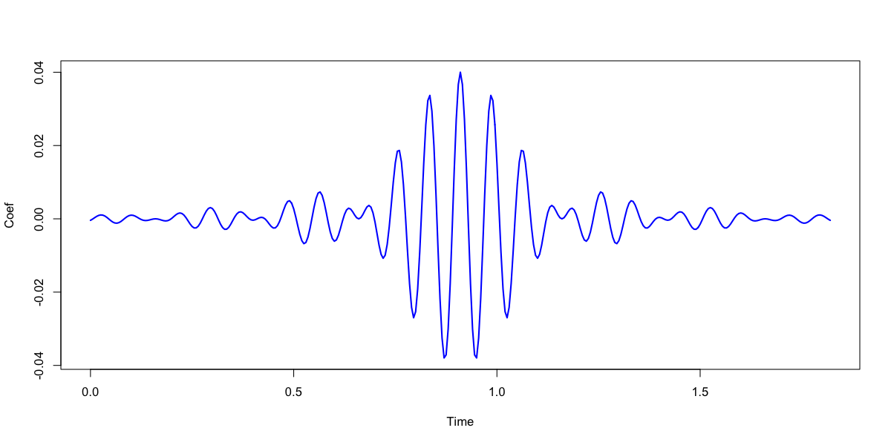

# FIR filters

_Linear-phase signal filters_

| Command   | Description |
|------|---|
| [`FILTER`](#filter)  | Apply a FIR filter to one or more signals |
| [`FILTER-DESIGN`](#filter-design) | Display filter properties | 

## `FILTER`

_Applies a linear-phase FIR filter to a signal_

This command modifies the in-memory signal, by applying a finite
impulse response (FIR) filter, which can be either a _low-pass_,
_high-pass_, _band-pass_ or _band-stop_ filter.


<h3>Parameters</h3>

Core parameters are as follows:

| Parameter | Example | Description |
| --- | --- | --- |
| `sig`     | `sig=C3,F3` | Restrict analysis to these channels | 
| `bandpass` | `bandpass=0.3,35` | Band-pass filter between 0.3 and 35 Hz |
| `lowpass`  | `lowpass=35` | Low-pass filter with cutoff of 35 Hz |
| `highpass` | `highpass=0.3` | High-pass filter between 0.3 and 35 Hz |
| `bandstop` | `bandstop=55,65` | Band-stop filter between 0.3 and 35 Hz |
| `fft`      | Use FFT to implement the filter (this is now the default) |

By default, the `FILTER` command uses the Kaiser window approach to
define the filter, which requires the two following parameters:

| Parameter | Example | Description |
| --- | --- | --- |
| `ripple`   | `ripple=0.01` | Ripple (as a proportion) |
| `tw`       | `tw=1` | Transition width (in Hz) | 
| `tw`       | `tw=0.5,5` | Separate lower and upper transition widths for a bandpass filter (in Hz) | 

Note that if using `bandpass tw=lwr,upr` then you need to specify two values for `ripple` also (althogh
these can be similar).

!!! info "Ripple and stopband attenuation"
    The `ripple` parameter is related to stopband attenuation by the relation
    `A = -20log10(ripple)`, such that a `ripple=0.01` corresponds to -40 dB stopband attenuation.


_Alternative filters_

Alternatively, it is possible to

 - read the FIR coefficients in from a `file`

 - use the window method to design a FIR with a fixed filter order,
  using either a Bartlett, Hann, Blackman or rectangular window

 - use a narrow-band Gaussian filter, defined by a center frequecy and
   FWHM (full-width half-maximum) bandwidth, with `ngaus`

 - use an IIR Buttworth or Chebyshev filter

| Parameter | Example | Description |
| --- | --- | --- |
| `file`   | `file=fir1.txt` | Read FIR coefficients from a file |
| | | | 
| `order`  | `order=30` | Fix the FIR filter order |
| `rectangular` | | Specify a rectangular window |
| `bartlett` | | Specify a Bartlett window |
| `hann` | | Specify a Hann window |
| `blackman` | | Specify a Blackman window |
| `ngaus` | `ngaus=12,2` | Specify a narrow-band Gaussian filter (center frequency, FWHM) | 
| `butterworth` | `butterworth=4` | A Butterworth IIR filter of fixed order (see below) |
| `chebyshev` | `chebyshev=4,1` | A Chebyshev IIR filter of fixed order and ripple factor (see below) |

_IIR filters_

[Butterworth](https://en.wikipedia.org/wiki/Butterworth_filter) and
[Chebyshev](https://en.wikipedia.org/wiki/Chebyshev_filter) (type I)
filters require one of `bandpass=f1,f2`, `bandstop=f1,f2`,
`lowpass=f1` and `highpass=f1` options.  Butterworth takes a single
parameter, the filter order; Chebyshev takes two: order and the ripple
factor epsilon - see the above link for a definition of how the ripple
factor relates to passband ripple in dB.  Chebyshev filters are
sharper than the Butterworth filter, whereas Butterworth filters
control passband ripple.  Note that both IIR introduce phase delays:
in general, FIR filters are probably preferable choices.
 
<h3>Output</h3>

After running `FILTER`, the in-memory signal for a filtered channel
will represent the filtered signal.  No explicit output is generated
by the `FILTER` command.

<h3>Examples</h3>

As a first example, here we apply a bandpass filter to the EEG channel
`C3`, with transition frequencies of 0.3 and 35 Hz, using a FIR filter
designed via the Kaiser window method with a ripple parameter
(`ripple`) of 0.01 and a transition width parameter (`tw`) of 0.5 Hz:

```
FILTER sig=C3 bandpass=0.3,35 ripple=0.01 tw=0.5
```

In this second example, we use [_lunaR_](../ext/R/index.md) to copy a
signal, apply different bandpass filters to each duplicate
(corresponding to delta, theta, alpha, sigma and beta frequency bands)
and then plot the results.  Here we use the individual `nsrr02` from
the [tutorial](../tut/tut1.md) dataset. In R, where we assume that the
current directory is the one in which we unzipped the tutorial dataset
(i.e. and so the `s.lst` sample-list is present), we'd enter the following:


```
library(luna)
lattach( lsl( "s.lst" ) , "nsrr02" )
```
```
nsrr02 : 14 signals, 10 annotations, 09:57:30 duration
```
For simplicity, we first drop all signals except `EEG` using [`SIGNALS`](manipulations.md#signals):

```
leval( "SIGNALS keep=EEG" )
```
```
nsrr02 : 1 signals, 10 annotations, 09:57:30 duration
```

We then duplicate this signal using [`COPY`](manipulations.md#copy)
five times, giving new labels to each:

```
leval( "COPY sig=EEG tag=DELTA" )
leval( "COPY sig=EEG tag=THETA" )
leval( "COPY sig=EEG tag=ALPHA" )
leval( "COPY sig=EEG tag=SIGMA" )
leval( "COPY sig=EEG tag=BETA" )
```
By the end, the message in the console reads:
```
nsrr02 : 6 signals, 10 annotations, 09:57:30 duration
```
Using [`lchs()`](../ext/R/ref.md#lchs), we confirm that all channels have been appropriately added:
```
lchs()
```
```
[1] "EEG"       "EEG_DELTA" "EEG_THETA" "EEG_ALPHA" "EEG_SIGMA" "EEG_BETA" 
```
We then apply the [`FILTER`](#filter) command to apply a different band-pass filter to each of the channels:
```
leval( "FILTER sig=EEG_DELTA bandpass=0.5,4 tw=1 ripple=0.02" )
leval( "FILTER sig=EEG_THETA bandpass=4,8   tw=1 ripple=0.02" )
leval( "FILTER sig=EEG_ALPHA bandpass=8,12  tw=1 ripple=0.02" )
leval( "FILTER sig=EEG_SIGMA bandpass=12,15 tw=1 ripple=0.02" )
leval( "FILTER sig=EEG_BETA  bandpass=15,30 tw=1 ripple=0.02" )
```

We then epoch the data using [`lepoch()`](../ext/R/ref.md#lepoch):
```
ne <- lepoch()
```
```
nsrr02 : 6 signals, 10 annotations, 09:57:30 duration, 1195 unmasked 30-sec epochs, and 0 masked
```

We can use the [`ldata()`](../ext/R/ref.md#ldata) function to pull out epochs of data for all 6 signals (i.e. as specified by giving `lchs()` as the second argument),  e.g. here for epoch 135:
```
d <- ldata( 135 , lchs() )
```
Looking at the first few rows of the returned data frame `d`: 
```
> head(d)
               INT   E      SEC        EEG EEG_DELTA   EEG_THETA  EEG_ALPHA
1 4020.00->4050.00 135 4020.000 -0.4901961 -3.473108 -0.06260304  3.4154174
2 4020.00->4050.00 135 4020.008 -2.4509804 -3.452390 -0.53536473  2.2660953
3 4020.00->4050.00 135 4020.016 -4.4117647 -3.307357 -1.13706143  0.4709635
4 4020.00->4050.00 135 4020.024 -5.3921569 -3.051824 -1.76561958 -1.5923434
5 4020.00->4050.00 135 4020.032 -6.3725490 -2.678883 -2.30284877 -3.4422047
6 4020.00->4050.00 135 4020.040 -7.3529412 -2.188535 -2.65204775 -4.5915269
   EEG_SIGMA   EEG_BETA
1 -1.9357408 -0.2801375
2 -2.7737269  1.0227155
3 -2.3793805  1.6093081
4 -0.9104402  0.8806983
5  0.9774931 -0.6320931
6  2.4513626 -1.3668775
```

We can plot a data frame in this format with a R's internal functions, such as:

```
f1 <- function(d) {
par(mfcol=c(6,1),mar=c(0,5,0,0))
plot( d$EEG , type="l" , col=rgb(50,50,50,100,max=255) , axes=F , ylab="Raw" )
plot( d$EEG_DELTA , type="l" , col=rgb(200,100,00,150,max=255) , axes=F , ylab="Delta" )
plot( d$EEG_THETA , type="l" , col=rgb(100,200,0,150,max=255) , axes=F , ylab="Theta" )
plot( d$EEG_ALPHA , type="l" , col=rgb(0,200,100,150,max=255) , axes=F , ylab="Alpha" )
plot( d$EEG_SIGMA , type="l" , col=rgb(0,0,100,150,max=255) , axes=F , ylab="Sigma" )
plot( d$EEG_BETA ,  type="l" , col=rgb(100,0,100,150,max=255) , axes=F , ylab="Beta" )
}
```

Then, running `f1( d )` will produce this plot (although, note that different
signals are not uniformly scaled in this particular representation):

{width="100%"}


## `FILTER-DESIGN`

_Frequency and impulse responses for FIR filters designed via the Kaiser window method_

Filters specified by the [`FILTER`](#filter) command use the [Kaiser
window](https://www.mathworks.com/help/signal/ref/kaiserord.html)
method to design the filter.  The `FILTER-DESIGN` command (or Luna
`--fir` option) can be used to show the properties of these filters.

This command does not depend on any EDFs to be present, and so can be
run without a sample-list or EDF (see the example below).

<h5>Parameters</h5>

| Parameter | Example | Description |
| --- | --- | --- |
| `fs`       | `fs=256` | Sampling rate |
| | | 
| `bandpass` | `bandpass=0.3,35` | Band-pass filter between 0.3 and 35 Hz |
| `lowpass` | `lowpass=35` | Low-pass filter with cutoff of 35 Hz |
| `highpass` | `highpass=0.3` | High-pass filter with cutoff of 0.3 Hz |
| `bandstop` | `bandstop=55,65` | Band-stop filter between 0.3 and 35 Hz |

The FIR design design approaches are as for the `FILTER` command: either through the window method
(with either a Kaiser window -- `tw` and `ripple` -- or fixing the FIR `order`) or reading from a file:

| Parameter | Description |
| --- | --- | 
| `ripple`   | Ripple (as a proportion) |
| `tw`       | Transition width (in Hz) | 
| | | 
| `file`     | Read FIR coefficients from a file |
| | |
| `order`    | Fix FIR order |
| `rectangular` | Specify a rectangular window |
| `bartlett` | Specify a Bartlett window |
| `hann` | Specify a Hann window |
| `blackman` | Specify a Blackman window |


<h5>Output</h5>

Per-filter basics (strata: _none_)

| Variable | Description |
| --- | --- |
| `FIR`    | Label for FIR filter (constructed from input parameters) |
| `FS`    | Sampling rate (from `fs` input parameter) |
| `NTAPS` | Filter order (number of taps) |

Filter coefficients (strata: `F` x `TAP`)

| Variable | Description |
| --- | --- |
| `TAP`     | Tap |
| `W`   |  Filter coefficient |


Frequency response characteristics (strata: `F` x `FIR`)

| Variable | Description |
| --- | --- |
| `F`     |   Frequency (Hz) |
| `FIR`   |  FIR filter label |
| `MAG`   |  Magnitude |
| `MAG_DB`|  Magnitude (dB) |
| `PHASE` |  Phase |

Impulse response (strata: `FIR` x `SEC`)

| Variable | Description |
| --- | --- |
| `F`     |  Time (seconds) |
| `FIR`   |  FIR filter label |
| `IR`   |  Impulse response |

<h5>Example</h5>

Consider a band-pass filter in the sigma band, 11 to 15Hz, applied to
a signal with 200 Hz sampling rate.  Transition frequencies 11Hz and
15Hz have -6dB attenuation (i.e. 50% amplitude ratio).

If specifying the `--fir` option, Luna expects the parameters above
via standard input, e.g. piped from the `echo` shell command, with the
output still sent to a database `out.db`:

```
echo "fs=200 bandpass=11,15 ripple=0.02 tw=1" | luna --fir -o out.db
```

Examining the `out.db`, we see that this command produces the following output:

```
destrat out.db
```

```
--------------------------------------------------------------------------------
out.db: 1 command(s), 1 individual(s), 7 variable(s), 4207 values
--------------------------------------------------------------------------------
  command #1:	c1	Mon Feb 25 16:11:40 2019	FIR-DESIGN	
--------------------------------------------------------------------------------
distinct strata group(s):
  commands      : factors           : levels        : variables 
----------------:-------------------:---------------:---------------------------
  [FIR-DESIGN]  : FIR               : 1 level(s)    : FS NTAPS
                :                   :               : 
  [FIR-DESIGN]  : F FIR             : 1025 level(s) : MAG MAG_DB PHASE
                :                   :               : 
  [FIR-DESIGN]  : FIR TAP           : 365 level(s)  : W
                :                   :               : 
  [FIR-DESIGN]  : FIR SEC           : 765 level(s)  : IR
                :                   :               : 
----------------:-------------------:---------------:---------------------------
```

The first stratum (`FIR`) gives the sampling rate (`FS`) as input, and
the derived order of the filter (`NTAPS`):

```
destrat out.db +FIR-DESIGN -r FIR 
```

```
ID    FIR                        FS      NTAPS
.     BANDPASS_11..15_0.02_1     200     365
```

The actual filter coefficients are in the stratum defined by `FIR` x `TAP`:
```
destrat out.db +FIR-DESIGN -r FIR TAP > fir.txt
```

In R, we can plot the filter coefficients:
```
w <- read.table("fir.txt",header=T)
plot( w$TAP/200 , w$W , type="l", lwd=2, col="blue", ylab="Coef", xlab="Time" ) 
```

{width="100%"}
 

The amplitude (magnitude) response of the filter is in the `F` x `FIR` stratum:
```
destrat out.db +FIR-DESIGN -r F FIR > fir2.txt
```
In R:
```
d <- read.table("fir2.txt", header=T)
d <- d[ d$F < 20 , ]
par(mfcol=c(1,2))
plot(d$F, d$MAG   , type="l",lwd=2,col="blue", xlab="Hz",ylab="Magnitude")
plot(d$F, d$MAG_DB, type="l",lwd=2,col="blue", xlab="Hz",ylab="Magnitude (dB)")
```

{width="100%"}

