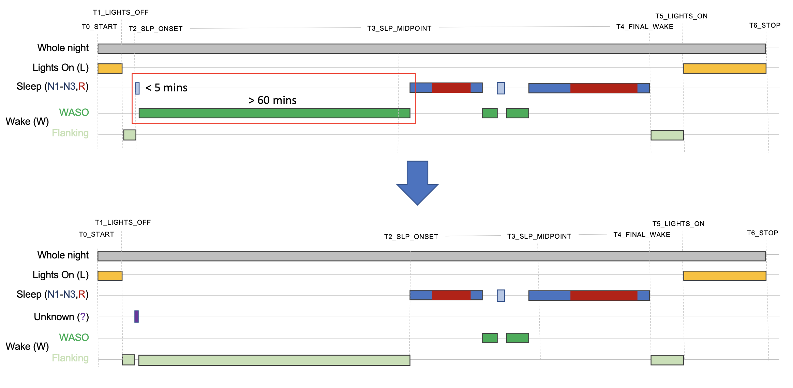

# Hypnograms

_Commands to show and summarize elements of sleep macro architecture_ 

These commands require staging annotations to be present in an
[annotation file](annotations.md), as described below.

|Command |Description | 
|---|---|
| [`HYPNO`](#hypno) | Sleep macro-architecture summaries |
| [`STAGE`](#stage) | Output sleep stages per epoch |


## `HYPNO`

_Estimates multiple summary statistics based on the hypnogram_

`HYPNO` produces individual-level summary statistics (e.g. total sleep
time, percent in each sleep stage, etc), epoch-level output
(e.g. cumulative elapsed sleep duration, etc), statistics on bout
lengths and stage transition counts/probabilities.  NREM sleep cycles
are calculated based on a modified heuristic following [Feinberg
and Floyd](https://www.ncbi.nlm.nih.gov/pubmed/220659).

### Definitions 

This schematic illustrates some of the main hypnogram summaries:


The key time markers (`T0` to `T6`, which by definition are always in
this order) are:

 * `T0`: start of recording
 * `T1`: lights off
 * `T2`: sleep onset
 * `T3`: sleep midpoint
 * `T4`: final wake
 * `T5`: lights on
 * `T6`: end of recording
 
The primary spanning intervals are defined by these time points. The
entire recording (based on the epoched EDF) constitutes the total
recording time (`TRT`), from T0 to T6. If _lights out/on_ markers are
present (see below), then _time in bed_ (`TIB`) is the period between
_lights out_ and _lights on_ (`T1` to `T5`); otherwise, it is the same as
`TRT`. _Sleep period time_ (`SPT`) is from _sleep onset_ to _final wake_ (`T2`
to `T4`).

_Sleep onset latency_ (`SOL`) is the time from _lights out_ to _sleep onset_
(from `T1` to `T2`).  We further define __persistent sleep__ as a sleep bout
of at least 10 minutes, and _persistent sleep onset latency_
(`SOL_PER`) is defined with regard to the first epoch of persistent sleep.

!!! info "Persistent sleep onset latency"
    This is the first epoch in a
    bout of at least 10 minutes, i.e. and not _after_ ten minutes of
    sleep.  That is, if _lights off_ is 10pm and the individual starts
    a sleep bout at 10:25pm that lasts for 2 hours, then `SOL_PER` is
    25 minutes - the same as `SOL` in this example - and __not__ 25 +
    10 = 35 minutes.

Wake is classified as _wake after sleep onset_ (`WASO`) if it occurs between
_sleep onset_ (`T2`) and _final wake_ (`T4`).  Wake outside the sleep period
(i.e. before sleep onset or after final wake) is called _flanking
wake_.  Leading flanking wake duration is `SOL` (sleep onset
latency); we also record the duration of trailing flanking wake as
_final wake time_ (`FWT`), i.e. up until _lights on_ or the end of the recording.
Total wake time (`TWT`) is therefore `SOL` plus `WASO` plus `FWT`.
We also track the duration of _lights on time_ (`LOT`, the period from `T0`
to `T1` plus from `T5` to `T6`).


### Lights Off/Lights On

Any epoch with the stage annotation `L` means that lights are on,
i.e. wake but not part of the recording, and so not included as part
of `TWT` or `SOL`, etc. _Lights on_ information can be encoded in
thgree ways, through epoch annotations, interval annotations, or
directly as a command argument.

<h5>Annotation encoding of lights off/on</h5>

In the first case, if an epoch/stage annotation is
`L` (i.e. rather than `N1`, `N2`, `N3`, `R`, `W` or `?`), this implies
_Lights On_ for that period.  In the second case, interval annotations (or command options)
can specify either the time(s) at which a lights on or lights off events occurs,
or the interval which is to be considered as lights on or lights off.  Given these
times/intervals, Luna will implicitly set the epoch encoding to `L` for all epochs
that are defined as _lights on_.

!!! info "Interval encoding of lights on/off"
    _Lights off_ and _Lights on_ times will be derived from the
    annotations, if available, as follows, based on the canonical
    `lights_on` and `lights_off` annotations.  These may represent
    either change-points (i.e. `lights_off` has 0-seconds duration,
    and just marks the exact time when the lights were turned off), or
    an interval (i.e. `lights_off` has a non-zero durationm, implying
    that it spans the entire period during which the lights were off).
    The graphic below illustrates the logic Luna employs when trying
    to derive the lights on/off times:

    

    To summarize, lights off/on times (events) are extracted from interval annotations as follows:

    | Valid combination | Off | On |
    |----|----|-----|
    | one `lights_off` interval only (with durtion at least one epoch) | start of `lights_off`   | end of `lights_off` |
    | one `lights_off` interval only (with diration shorter than one epoch) | start of `lights_off`    | end of recoding (i.e. no explicit `lights_on`) |   
    | two `lights_on` intervals  | end of first `lights_on` | start of second `lights_on` |                                              
    | one `lights_off` + 1 or 2 `lights_on`  |  start of `lights_off` | start of last `lights_on` |

    Note that the final case also works if two _change-point_ events
    (i.e.  0-duration intervals) are specified as `lights_off` and
    `lights_on`). Having set a `lights_off` event: all epochs that end
    before this time will be set to `L`.  Having set a `lights_on`
    event: all epochs that start on or after this time will be set to
    `L`


If there are no _Lights On_ epochs (`L`), this implies `TRT` equals
`TIB` and `LOT` equals 0, i.e. that _Lights Off_ occurs at the start
of the recording and _Lights On_ is at the end.  Any leading/trailing
unscored epochs (`?`) are set to `L` (_Lights On_ epochs), i.e if they
occur before/after the first/last sleep or wake epoch. This may not be
appropriate, however, e.g. if the recording continued for a long time
after the subject woke (as an example, see the first individual in the
[tutorial](../tut/tut1.md) dataset).  Because of this, Luna implements
two versions of sleep efficiency: in both cases, the numerator is
total sleep time (`TST`); in the first case (`SE`), the denominator is
`TIB`, whereas for `SME`, the denominator is `SPT`. The latter metric
is often more robust is lights off/on has not been accurately tracked.

<h5>Explcitly setting lights off/on times</h5>

If lights off/on annotations are known by not present in the
annotations, they can be set explcitly via the `lights-off` and/or
`lights-on` options for the `HYPNO` command:
```
luna s.lst -o out.db -s HYPNO lights-off=22:30 lights-on=07:45
```
In the context of multi-sample studies, it will typically not be appropriate to use fixed time(s), of course.  Here, you can use
[individual variables](../luna/args.md#individual-variables) to specify multiple values.  If `s.lst` contained three individuals,
and `times.txt` was a tab-delimited text file:
```
ID   LOFF  LON
id1  22:00 07:00
id2  21:20 08:22:02
id3  .     09:00
```
(where `.` indicates it is unknown), this information can be included as follows:
```
luna s.lst -o out.db vars=times.txt -s HYPNO lights-off=${LOFF} lights-on=${LON}
```

Note that the variables `${LOFF}` and `${LON}` can be named
arbitarily, e.g. `${a}` and `${b}`.  Also, lights off/on times can be
set as elapsed seconds from the EDF start rather than _hh:mm_ or
_hh:mm:ss_ (24-hour clock) values.  

!!! info "NSRR datasets are lights on/off"
    Many NSRR datasets do not
    have explicit annotations that indicate when lights off/on events
    occurred.  Alternatively, lights off/on times can be set via
    additional options to `HYPNO`, i.e. if they are known but not
    explicitly represented in the staging annotations. (For example,
    this is the case in the MrOS cohort, where lights on/off times are
    available as part of the CSV datasets that accompany the signal
    data.)


### Excessive WASO

Some studies (e.g. if from home-based recordings) may contain
excessively long periods of leading or trailing wake.  In a few
extreme cases in NSRR data, for example, a single `N1` epoch may occur
hours before or after the main sleep period.  By accepting this
_outlier_ sleep epoch as real, this may lead to excessive estimates of
WASO (wake after sleep onset) or other parameters.

Especially in the context of home-based recordings where lights off/on
information might not have been explicitly specified, it may be more
appropriate to not treat this as defining the sleep period.  In this
case, Luna implements the following heuristic, to set short _outlier_
periods of sleep to missing (`?`), if (by default) the cumulative
sleep period is no longer than five minutes, but is separated by at
least two hours (120 mins) of wake (either at the start or the end of
the recording).  This schematic illustrates this process (note, here
using a 60 minute wake period, but as noted, Luna's default is 120
mins):



If you do not wish this heuristic to be used, set `end-wake=0` and
`end-sleep=0`; alternatively, use these options to set other values.

### Stage/epoch alignment

Typically, staging epochs will typically be typically 30 seconds and will be _aligned_ with the signal data, i.e. starting at the start
of the recording (0 seconds elapsed), as indicated in the top row in the picture below.  In other cases, staging information may come in different formats.
For example, even if scored in 30-second intervals, stage annotations may span longer intervals (multiples of 30 seconds, e.g. 90-seconds, 120-seconds, etc, to
represent consecutive epochs of the same stage.    Alternatively, the stage information may be represented as _change-point_ events: i.e. 0-duration markers
that indicate when a new stage starts (which is assumed to hold up until the next stage annotation).   Both these alternatives will be automatically
handled by Luna.


However, the fourth row represents a more problematic scenario: where
epochs do not align with Luna's internal epoch structure, which by
default starts at the start of the signal data (i.e. 0 seconds).  This
will likely result in multiple epochs (from Luna's perspective) being
spanned by multiple, conflicting stage annotations.   When this happens,
those epochs are set to `?` and Luna issues a warning (and counts the
number of times this happens with the `CONF` variable in the output).

However, this can be easily avoided by telling Luna to alternatively start
encoding its own epochs so as to align with the external stage information, as per
the last row.  See the `EPOCH` command for details.  This can be accomplished as
```
luna s.lst -o out.db -s ' EPOCH align & HYPNO '
```

which means Luna will use the _first_ instance of either `N1`, `N2`,
`N3`, `R`, `W`, `?` or `L` to define where to start the first epoch.
(Note that after this, Luna will still assume that epochs will align,
i.e. that all stages are of similar duration, or multiples of that
duration, etc).

### Trimming flanking wake

It is possible to trim leading/trailing flanking wake epochs via the
`trim-wake` (or `trim-leading-wake` and `trim-trailing-wake`) option.
These arguments take a value in minutes, and will set the
earlier/later flanking wake epochs to unknown (`?`) such that no more
than _N_ minutes of flanking wake remains either before or after than
main sleep period.


<h3>Parameters</h3>

| Parameter | Example | Description |
| ---- | ---- | ---- | 
| `epoch` | | Display epoch-level output |
| `lights-off` | `23:30:00` | Explicitly set _Lights Off_ (_hh:mm:ss_ or elapsed seconds from EDF start )|
| `lights-on` | `08:00:00` | Explicitly set _Lights On_ (_hh:mm:ss_ or elapsed seconds from EDF start )|
| `end-wake` | 120 | Threshold for trimming excessive WASO (mins) |
| `end-sleep` | 5 | Threshold for trimming excessive WASO (mins) |
| `trim-wake` | 20 | Trim leading/trailing wake to at most 20 mins |
| `trim-leading-wake` | 20 | Trim leading wake to at most 20 mins |
| `trim-trailing-wake` | 20 | Trim trailing wake to at most 20 mins |

Secondary/misc options

| Parameter | Example | Description |
| ---- | ---- | ---- | 
| `file` | `hypno.txt` | Optionally, read stage information from a file |
| `W`| `waking` | Set the annotation class for _wake_ epochs (instead of `W`) |
| `N1`  | `Stg1` | Set the annotaiton class for _N1_ epochs (if not `N1`) |
| `N2`  | `Stg2` | Set the annotaiton class for _N2_ epochs |
| `N3`  | `Stg3` | Set the annotaiton class for _N3_ epochs |
| `R` | `RemSleep` | Set the annotaiton class for _REM_ epochs |
| `?`   | `unk` | Set the annotation class for _unscored/unknown_ epochs |
| `req-pre-post` | `req-pre-post=5` | For epoch-level transition flags, only consider _post_ transition stage `FLANKING_ALL` values equal to or greater than this number of epochs (default 4) |
| `flanking-collapse-nrem` | `flanking-collapse-nrem=F`|  Collapse all NREM stages when considering flanking epoch similarity (default `T`) |
| `first` | 240 | Only analyse the first 240 minutes for all statistics | 
| `first-anchor` | `T1` | Anchor for extracting first N minutes (from `T0`, `T1` or `T2`) |


By default, several common variants of stage labels are automatically
translated to the standard terms (`N1`, `N2`, `N3`, `R`, `W`, `?` and
`L`), as tabulated below (including NSRR terms).  If your values are
not listed here, you can use the options above (or
[`remap`](../luna/args.md#remapping-annotations)) to set them
manually.


| Stage/default | Aliases |
|-----|-----|
| `N1` | `NREM1`, `Stage1`, `Stage 1 sleep|1`, `S1`, `Stage1`, `SRO:Stage1Sleep`, `SDO:NonRapidEyeMovementSleep-N1` |
| `N2` | `NREM2`, `Stage2`, `Stage 2 sleep|2`, `S2`, `Stage2`, `SRO:Stage2Sleep`, `SDO:NonRapidEyeMovementSleep-N2` , `NR` |
| `N3` | `NREM3`, `Stage3`, `Stage 3 sleep|3`, `S3`, `Stage3`, `SRO:Stage3Sleep`, `SDO:NonRapidEyeMovementSleep-N3` |
| `N4` | `NREM4`, `Stage4`, `Stage 4 sleep|4`, `S4`, `Stage4`, `SRO:Stage4Sleep`, `SDO:NonRapidEyeMovementSleep-N4` |
| `R` | `REM` , `SRO:RapidEyeMovement`, `SDO:RapidEyeMovementSleep`, `REM sleep|5` |
| `W` | `wake`, `Wake|0` , `SDO:WakeState`, `SRO:Wake` | 
| `L` | `lights`, `lights_on`  |
| `?` | `missing`, `unknown`, `artifact`, `A` |


!!! info "Stage translations"
    Note internally Luna can represent stage NREM4 sleep, as well as
    _Movement_ (`M`) and _ambiguous/unscorable_ (`U`) epochs (as
    distinct from _missing/unknown/unscored_ epochs, `?`).  However,
    for almost all purposes, Luna commands will automatically
    translate `NREM4` to `N3`; likewise, `M` and `U` epochs will be
    treated as `?`.
    

<h3>Output</h3>

The tables below show the various summary statistics based on this
partitioning of sleep macro architecture, and are grouped as follows:

 - individual level durations 
 - efficiency & latency metrics
 - flags for unusual/corrupt staging
 - sleep fragmentation indices
 - stage-specific metrics
 - epoch-level metrics
 - cycle-level metrics
 - stage transitions metrics

Individual-level durations (all metrics in minutes) (strata: _none_)

| Variable | Description |
| --- | --- |
| `TRT` | Total Recording Time: based on all scoring epochs (T0 – T6) |
| `TIB` | Time In Bed: Lights Off to Lights On (mins) (T1 – T5) |
| `SPT` | Sleep period time: sleep onset to final wake (T2 – T4) |
| `SPT_PER` | Persistent sleep period time: persistent sleep onset to final wake |
| `TST` | Total sleep time |
| `TST_PER` | Total persistent sleep time |
| `TWT` | Total wake time during Lights Off = SOL + WASO + FWT |
| `WASO` | Wake time between sleep onset and final wake onset (T2 – T4) |
| `FWT` | Duration of wake from final wake onset to Lights on (T4 – T5) |
| `LOT` | Lights On duration (mins) |

Efficiency/latency metrics (strata: _none_)

| Variable | Description |
| --- | --- |
| `SE`  | Sleep efficiency, TST /  TIB  (denom. = T1 – T5) |
| `SME` | Sleep maintenance efficiency, TST / SPT (denom. = T2 – T4) |
| `SOL` | Sleep latency (T1 – T2) |
| `SOL_PER` | Persistent sleep latency (T1 to onset of persistent sleep) |
| `REM_LAT` | REM latency (sleep onset T2 – first REM epoch) |
| `REM_LAT2` | REM latency excluding WASO, i.e. elapsed NR at REM onset |

As noted above, there are two versions of _sleep efficiency_: in both
cases, the numerator is total sleep time (`TST`); in the first case
(`SE`), the denominator is `TIB`, whereas for `SME`, the denominator
is `SPT`.  The latter metric is often more robust is lights off/on has
not been accurately tracked.

Luna also estimates REM latency (`REM_LAT`) as the time from sleep onset until
the first epoch of REM sleep.  A second version of REM latency only counts
the sleep time between sleep onset and REM onset, i.e. ignoring any intervening
wake (`REM_LAT2`).

Indicators of unusual/corrupt staging (strata: _none_)

| Variable | Description |
| --- | --- |
| `FIXED_LIGHTS` | Number of epochs set to L before/after lights out/on |
| `LOST` | _Lights On_ sleep duration (mins) : sleep set to `L` (should be 0) |
| `FIXED_WAKE` | Wake epochs set to `L` due to extreme WASO intervals |
| `CONF` | Number of epochs w/ conflicting stages (should be 0) |
| `SINS` | Recording starts in sleep (0=N, 1=Y) |
| `EINS` | Recording ends in sleep (0=N, 1=Y) |
| `OTHR` | Duration of non-sleep/non-wake annotations (unknown/movement) |


Sleep fragmentation indices

| Variable | Description |
| --- | --- |
| `SFI` | Sleep Fragmentation Index: sleep to `W` transition count / `TST` |
| `TI_S` | Stage Transition Index (excludes `W`) `N1`-`N2`-`N3`-`R` transition count / `TST` |
| `TI_S3` | 3-class Stage Transition Index, NREM-REM-wake transition count / `SPT` |
| `TI_RNR` | REM-NREM transition count / `TST` |
| `LZW` | LZW complexity index |

Stage-specific metrics

The following metrics are calculated for the following categories:
`N1`, `N2`, `N3`, all `NR`, `R`, `W`, `S`, `?`, `L` & `WASO`:

| Variable | Description |
| --- | --- |
| `MINS` | Stage duration (mins) |
| `PCT` | Stage duration as proportion of TST (N1, N2, N3, NR & R only) |
| `BOUT_N` | Number of bouts (contiguous stretches of this stage) |
| `BOUT_MD` | Median bout duration (mins) |
| `BOUT_MN` | Mean bout duration (mins) |
| `BOUT_MX` | Maximum bout duration (mins) |
| `BOUT_05` | Stage duration, considering only bouts of at least 5 minutes (mins) |
| `BOUT_10` | Stage duration, considering only bouts of at least 10 minutes  (mins) |

In addition, `HYPNO` distinguishes ascending vs. descending (vs. “flat”) N2 for `MINS` & `PCT` based on a heuristic:

 * `N2_ASC` : ascending N2 :  N3 → N2 →  N1/R/ W

 * `N2_DSC` : descending N2 :  N1/R/W → N2 → N3

 * `N2_FLT` : "flat" N2 : ambiguous, e.g. flanked by REM on both sides, or mixtures


Epoch-level output (option: `epoch`, strata: `E`)

| Variable | Description |
| --- | --- |
|`CLOCK_HOURS`| Start time of epoch (hours since midnight) |
|`CLOCK_TIME`| Start time of epoch (_hh:mm:ss_) | 
|`MINS`|  Start time of epoch (minutes since start of EDF) | 
|`STAGE`| Text description of sleep stage |
|`STAGE_N`| Numeric encoding of sleep stage (see `STAGE` example, above) | 
|`PERSISTENT_SLEEP`| Flag to indicate persistent sleep (more than 10 minutes of sleep has elapsed) |
|`WASO`| Flag to indicate wake after sleep onset |
| | |
|`E_N1`| Cumulative elapsed N1 sleep (minutes) |
|`E_N2`| Cumulative elapsed N2 sleep (minutes) |
|`E_N3`| Cumulative elapsed N3 sleep (minutes) |
|`E_REM`| Cumulative elapsed REM (minutes) |
|`E_SLEEP`| Cumulative elapsed sleep (minutes) |
|`E_WAKE`| Cumulative elapsed wake (minutes) |
|`E_WASO`| Cumulative elapsed WASO (minutes) |
| | |
|`PCT_E_N1`| Cumulative elapsed N1 as proportion of total N1 sleep |
|`PCT_E_N2`| Cumulative elapsed N2 as proportion of total N2 sleep |
|`PCT_E_N3`| Cumulative elapsed N3 as proportion of total N3 sleep |
|`PCT_E_REM`| Cumulative elapsed REM as proportion of total REM sleep |
|`PCT_E_SLEEP`| Cumulative elapsed sleep as proportion of total sleep |
| | |
|`FLANKING_MIN` | The minimum number of similarly-staged epochs going either forwards or backwards |
|`FLANKING_ALL` | The total number of similar epochs in this stretch of similar epochs |
| | |
|`N2_WGT`| Score to indicate ascending versus descending N2 sleep (see below) | 
|`NEAREST_WAKE`| Number of epochs (forward or backwards) since nearest wake epoch (see below) |
| | | 
|`TR_NR2R` | Number of epochs from this NREM epoch to a REM transition (see below) |
|`TOT_NR2R` | Total number of contiguous NREM epochs followed by REM (see below) |
|`TR_NR2W` | Number of epochs from this NREM epoch to a wake transition (see below) |
|`TOT_NR2W` | Total number of contiguous NREM epochs followed by wake (see below) |
| ... etc ... | Similar `TR_` and `TOT_` variables defined for other transitions |
| | |
|`CYCLE`| Cycle number, if this epoch is in a sleep cycle | 
|`CYCLE_POS_ABS`| Absolute position of this epoch in the current NREM cycle (mins) |
|`CYCLE_POS_REL`| Relative position of this epoch in the current NREM cycle (0-1) | 
|`PERIOD`| Cycle period: `NREMP` or `REMP`, or missing if not in a cycle |


Information on each NREM sleep cycle (strata: `C`)

| Variable | Description |
| --- | --- |
| `NREMC_START` | First epoch number of this NREM cycle |
| `NREMC_MINS` | Total duration of this cycle (mins) |
| `NREMC_NREM_MINS` | Duration of NREM in this cycle (mins) |
| `NREMC_REM_MINS` | Duration of REM in this cycle (mins) |
| `NREMC_OTHER_MINS` | Minutes of wake and unscored epochs |

Transition probabilities (strata: `PRE` x `POST`)

| Variable | Description |
| --- | --- |
| `N` | Count of transitions | 
| `P` | Joint probability |
| `P_PRE_COND_POST` | Conditional probability `P( pre | post )` |
| `P_POST_COND_PRE` | Conditional probability `P( post | pre )` |

<h3>Example</h3>

Here we run `HYPNO` on `nsrr02` from the [tutorial](../tut/tut1.md) data:
```
luna s.lst nsrr02 -o out.db -s HYPNO epoch 
```

The baseline, individual-level output for `HYPNO` contains summaries
such as total sleep time (`TST`).  Here we use Luna's `behead` utility 
to view the output in a more human-readable fashion:

```
destrat out.db +HYPNO  | behead
```

```
                       ID   nsrr02              
                     CONF   0                   
                 E0_START   0                   
            E1_LIGHTS_OFF   0                   
           E2_SLEEP_ONSET   45.5                
        E3_SLEEP_MIDPOINT   260.5               
            E4_FINAL_WAKE   475.5               
             E5_LIGHTS_ON   597.5               
                  E6_STOP   597.5               
                     EINS   0                   
             FIXED_LIGHTS   0                   
              FIXED_SLEEP   0                   
               FIXED_WAKE   0                   
                      FWT   122                 
               HMS0_START   21:18:06            
          HMS1_LIGHTS_OFF   21:18:06            
         HMS2_SLEEP_ONSET   22:03:36            
      HMS3_SLEEP_MIDPOINT   01:38:36            
          HMS4_FINAL_WAKE   05:13:36            
           HMS5_LIGHTS_ON   07:15:35            
                HMS6_STOP   07:15:35            
                     LOST   0                   
                      LOT   0                   
                      LZW   0.143933054393305   
                    NREMC   5                   
               NREMC_MINS   77.1                
                     OTHR   0                   
                  REM_LAT   43.5                
                 REM_LAT2   31                  
                       SE   59.8326359832636    
                      SFI   0.0503496503496504  
                     SINS   0                   
                      SME   83.1395348837209    
                      SOL   45.5                
                  SOL_PER   63                  
                      SPT   430                 
                  SPT_PER   412.5               
                 T0_START   21.3016666666667    
            T1_LIGHTS_OFF   21.3016666666667    
           T2_SLEEP_ONSET   22.06               
        T3_SLEEP_MIDPOINT   25.6433333333333    
            T4_FINAL_WAKE   29.2266666666667    
             T5_LIGHTS_ON   31.26               
                  T6_STOP   31.26               
                      TIB   597.5               
                   TI_RNR   0.0643356643356643  
                     TI_S   0.26013986013986    
                    TI_S3   0.137209302325581   
                      TRT   597.5               
                      TST   357.5               
                  TST_PER   321                 
                      TWT   240                 
                     WASO   72.5    
```

As indicated above, this individual had five sleep cycles (`NREMC`).
We can view details about each cycle by querying the `C` stratum of
`out.db`:

```
destrat  out.db +HYPNO -r C
```

```
ID      C  NREMC_MINS NREMC_NREM_MINS NREMC_OTHER_MINS NREMC_REM_MINS NREMC_START
nsrr02  1  72.5       34              12.5             26             92
nsrr02  2  133        118.5           5                9.5            237
nsrr02  3  42         40              2                0              503
nsrr02  4  105.5      72              9                24.5           675
nsrr02  5  32.5       31              1.5              0    	      887
```

Finally, we can view epoch-level data (here just a few rows, for a subset of the available variables):
```
destrat  out.db +HYPNO -r E
```
```
ID       E     CLOCK_TIME  E_SLEEP  STAGE
... skipped ...
nsrr02   89    22:02:06    0        wake
nsrr02   90    22:02:36    0        wake
nsrr02   91    22:03:06    0        wake
nsrr02   92    22:03:36    0        NREM2
nsrr02   93    22:04:06    0.5      NREM2
nsrr02   94    22:04:36    1        wake
nsrr02   95    22:05:06    1        wake
nsrr02   96    22:05:36    1        wake
nsrr02   97    22:06:06    1        wake
nsrr02   98    22:06:36    1        NREM2
nsrr02   99    22:07:06    1.5      NREM2
nsrr02   100   22:07:36    2        NREM2
nsrr02   101   22:08:06    2.5      NREM2
nsrr02   102   22:08:36    3        NREM2
nsrr02   103   22:09:06    3.5      wake
nsrr02   104   22:09:36    3.5      wake
nsrr02   105   22:10:06    3.5      wake
nsrr02   106   22:10:36    3.5      wake
... cont'd ...
```


__Time encoding:__ Several variables use an _hours since midnight_
24-hour encoding, so that 20.5, for example, means 8:30pm, etc.

__Stage nomenclature:__ We use the newer format of N1, N2, and N3
sleep for variable names, although if NREM4 sleep has been scored it
will be reported as NREM (although, for "consistency" the variable
name is `N4` rather than `NREM4`).

__Ascending and descending N2:__ _Ascending_ N2 sleep is defined as N2
sleep that follows N3 and precedes N1, Wake or REM.  In contrast,
_descending_ N2 sleep follows wake, N1 or REM sleep and precedes N3
sleep.  The epoch-level `N2_WGT` variable (which is only defined for
N2 sleep) is an index ranging from -1 to +1 to quantify this.
Specifically, it is calculated by looking at the first _k_ non-N2
epochs that come before and after that N2 epoch.  (By default, _k_ is
10.)  N3 epochs are scored +1 if they are prior to this epoch,
otherwise -1. Wake, N1 and REM epochs are scored -1 if they come
before this epoch, otherwise +1.  The final `N2_WGT` score is the
average of these scores.  Epochs that are, e.g., less than -0.5 might
be called _descending_, whereas epochs that are greater than +0.5
might be called _ascending_.

__Transition and flanking epoch defintions:__  The epoch-level variables `TR_NR2R`, `TR_NR2W`, etc, coumt the number
of epochs of NREM sleep remaining until a transition to some other
state (REM or wake respectively).  Similar variables are defined for
transitions from REM and wake.  The corresponding `TOT_` variables
indicate the total number of NREM epochs in that segment - i.e. and so
can be used to select "stable" periods of some state of a minimum
duration prior to a transition to some other state.  As noted above,
the `HYPNO` option `req-pre-post` option can be used to specify a
minimum duration of the _post_ stage in order to trigger these flags;
by default this is 4 epochs (2 minutes).  That is, is epoch 1227 below
was in fact back to `N2` sleep, then the command would not have
flagged these earlier N2 epochs as being _prior to wake_.


```
     E       STAGE   TOT_NR2R  TOT_NR2W   TR_NR2R   TR_NR2W
     ...
     1220    N2      0         22         0         5
     1221    N2      0         22         0         4
     1222    N2      0         22         0         3
     1223    N2      0         22         0         2
     1224    N2      0         22         0         1
     1225    W       0         0          0         0
     1226    W       0         0          0         0
     1227    W       0         0          0         0
     1228    W       0         0          0         0
     1229    W       0         0          0         0
     ...
```

To illustarte the use of the _flanking_ similar epochs: 


```
      E       FLANKING_ALL    FLANKING_MIN    STAGE
      ...
      648     2               0               N2
      649     2               0               N2
      650     3               0               W
      651     3               1               W
      652     3               0               W	
      653     1               0        	      N2
      654     1       	      0       	      W	
      655     15      	      0       	      N2
      656     15      	      1       	      N2
      657     15      	      2       	      N2
      658     15      	      3       	      N2
      659     15      	      4       	      N2
      660     15      	      5       	      N2
      661     15      	      6       	      N2
      662     15      	      7       	      N2
      663     15      	      6       	      N2
      664     15      	      5       	      N2
      665     15      	      4       	      N2
      666     15      	      3       	      N2
      667     15      	      2       	      N2
      668     15      	      1       	      N2
      669     15      	      0       	      N2
      670     40      	      0       	      N3
      671     40      	      1       	      N3
      672     40      	      2       	      N3
...
```

i.e. in the above, we see a group of 15 N2 epochs (thus `FLANKING_ALL` is 15 for those N2 epochs); the `FLANKING_MIN` essentially shows how close
each of those N2 epochs is to some other non-N2 epoch.   Thus can be used to select out epochs that fulfill certain criteria, i.e. if one then wants
to look at other epoch-level signal properties as a function of stable stage and/or stage transitions.    The above was run with the option `flanking-collapse-nrem=F`
which enforces a distinction between N1, N2 and N3 epochs.   The default is actually to treat these all as similar (for the purpose of evaluating flanking epochs only), i.e. without the above option, the output for these epochs would instead be:

```
       E       FLANKING_ALL    FLANKING_MIN    STAGE
       ...
       654     1               0               W 
       655     80      	       0       	       N2
       656     80      	       1       	       N2
       657     80      	       2       	       N2
       658     80      	       3       	       N2
       659     80      	       4       	       N2
       660     80      	       5       	       N2
       661     80      	       6       	       N2
       662     80      	       7       	       N2
       663     80      	       8       	       N2
       664     80      	       9       	       N2
       665     80      	       10      	       N2
       666     80      	       11      	       N2
       667     80      	       12      	       N2
       668     80      	       13      	       N2
       669     80      	       14      	       N2
       670     80      	       15      	       N3
       671     80      	       16      	       N3
       672     80      	       17      	       N3
       ...
```
i.e. implying a much larger group of 80 NREM epochs (which go way beyond epoch 672 here).


## `STAGE`

_Export sleep stage information_

This command simply reports sleep stage information (e.g. as encoded
stages in an [annotation file](annotations.md#file-formats).
Internally, it creates a single annotation class called `SleepStage`,
with instances that correspond to `W`, `N1`, `N2`, `N3`, `R`, `?` and
`L` (_Lights On_).  The [`HYPNO`](#hypno) command does the same but
additionally computes a number of other statistics.  Unlike
`HYPNO` however, the `STAGES` command can be run after epochs have
been [masked out](masks.md).  In contrast, `HYPNO` requires the
original, entire EDF in order to produce meaningful summary
statistics on sleep macro architecture.

The canonical epoch labels for sleep/wake staging are as above
(i.e. `N1`, `N2`, `N3`, `R`, `W` as well as `?` and `L`).  Note that
alternatives such as `NREM2`, `REM` or `wake` are also acceptable (but
will be mapped to the above labels).  Note that by default `NREM4` is
mapped to `N3` sleep.

!!! info
    There is no explicit representation of movement or artifact
    (i.e. set those to `?` in terms of epoch-level staging) in the
    `STAGES` or `HYPNO` commands.  Still, you can always track that
    information (e.g. and [`MASK`](masks.md#mask) epoch based on
    them as generic annotations however.


<h3>Parameters</h3>

| Parameter | Example | Description |
| ---- | ---- | ---- | 
| `W`   | `W=wake`    | Set the annotation class for _wake_ epochs |
| `N1`  | `N1=NREM1`  | Set the annotaiton class for _N1_ epochs |
| `N2`  | `N2=NREM2`  | Set the annotaiton class for _N2_ epochs |
| `N3`  | `N3=NREM3`  | Set the annotaiton class for _N3_ epochs |
| `R`   | `R=REM`   | Set the annotaiton class for _REM_ epochs |
| `?`   | `?=UNKNOWN` | Set the annotation class for _unscored/unknown_ epochs |
| `dump` | | Write stage labels to standard out (minimal output )|
| `eannot` | `s.txt` | Write stage labels to a file |
| `min` | | Dump minimalistic stage labels to standard output stream |

<h3>Output</h3>

| Variable | Description |
| ---- | ---- |
| `CLOCK_TIME` | Clock time (hh:mm:ss) |
| `MINS`       | Elapsed time from start of EDF (minutes) |
| `STAGE`      | Sleep stage (text value) |
| `STAGE_N`    | Numeric encoding of sleep stage | 


__Numeric stage encoding:__ The `STAGE_N` encoding is designed to help
with quickly plotting a hypnogram: `W` is 1, `N1`, `N2` and
`N3` are -1, -2 and -3 respectively; `R` is 0; `?` is 2. As
such, something like the following R command can produce a
hypnogram-like representation of the night:

``` 
plot( d$E , d$STAGE_N ) 
```

<h3>See also</h3>

The [`lstages()`](../ext/R/ref.md#lstages) function in
[_lunaR_](../ext/R/index.md) provides a quick way to run the `STAGE` command
for a single EDF, returning just a vector of stage names.

