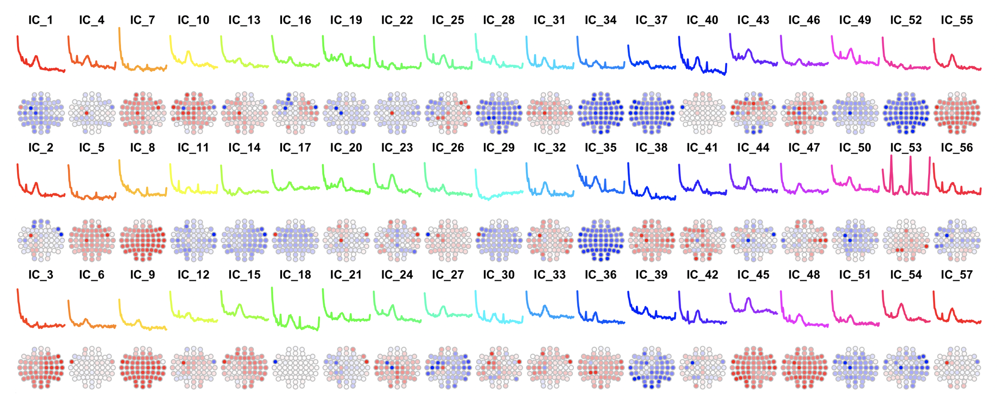
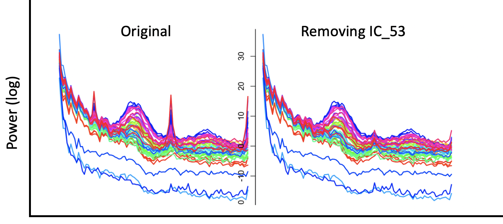

# Independent components and multi-channel decomposition

_ICA, PCA/SVD and GED analyses_

Independent Component Analysis (ICA) decomposes multi-channel EEG into statistically independent components, most commonly used to identify and remove stereotyped artifacts (ocular, cardiac, muscular) from the signal. [`ICA`](ica.md#ica) fits the fastICA algorithm to one or more channels and adds the resulting independent components as new EDF signals for inspection. [`ADJUST`](ica.md#adjust) subtracts specified components from the original channels to produce a cleaned signal. [`SVD`](ica.md#svd) applies singular value decomposition (PCA) to multi-channel data as a related alternative, useful for dimensionality reduction. [`GED`](ica.md#ged) estimates spatial filters that maximize contrast between two covariance definitions, for example event-locked versus reference activity.

| Command | Description | 
| ---- | ------ | 
| [`ICA`](#ica)      | Fit ICA model to signal data |
| [`ADJUST`](#adjust)  | Adjust original signals given one or more ICs |
| [`SVD`](#svd) | Apply time-series PCA to multiple channels | 
| [`GED`](#ged) | Generalized eigendecomposition spatial filters |
| [`--ged-group`](#-ged-group) | Build a group GED solution from saved covariance files |

## ICA

_Independent components analysis_

This command implements the [fastICA algorithm](https://www.cs.helsinki.fi/u/ahyvarin/),
providing a C/C++ implementation of R's [fastICA package](https://cran.r-project.org/web/packages/fastICA/fastICA.pdf).

<h3>Methods</h3>

Independent component analysis (ICA) decomposes a multivariate time series into a set of statistically independent source signals. The fastICA algorithm maximizes non-Gaussianity of the estimated sources using a fixed-point iteration, with preprocessing steps of centering (zero-mean) and whitening (pre-sphering via PCA) to reduce the search space to orthogonal rotations. The number of extracted components can be restricted to a subset of the full channel space. The resulting mixing matrix (relating original channels to components) is retained for use in subsequent artifact removal, and the independent component time series are optionally appended to the in-memory EDF for inspection and downstream analysis. Because ICA is initialized with random starting values, results are not deterministic across runs.

We hope that in future [vignettes](../vignettes/index.md) we will be able to
provide a more contextualized account of how to apply ICA using Luna to
sleep data in practice.  __For now, this page contains only bare-bones
reference material__.

By default, [`ICA`](ica.md#ica) adds signals `IC_1`, `IC_2`, etc to the internal
EDF: these can then be used as signals in other commands (e.g. [`PSD`](power-spectra.md#psd))
to examine the properties of those components. You can also [`WRITE`](outputs.md#write)
the EDF containing these ICs.
    
Currently, this command works on a whole-recording basis, e.g. rather
than epoch-by-epoch.  This may not be appropriate if the whole
recording contains very different types of signals/artifacts (i.e. if
the spatial sources of the components is not relatively stable over
time).

!!! hint
    Remember that ICA is not a deterministic algorithm, in that
    it is randomly seeded.  Therefore, `IC_4` in one run may not
    correspond to `IC_4` in a second run. It is therefore important to
    save the results of an ICA run, e.g. if determining which
    components to remove, etc.

!!! hint
    ICA can be a relatively slow and memory intensive operation
    for whole-night multi-channel datasets with high sampling
    rates. It is therefore worth exploring this command starting with
    smaller and/or down-sampled data, etc.

!!! warning
    Although implementations of ICA are standard, the proper application
    of ICA to multichannel EEG data is a complex methodological area,
    with various subtleties.  These routines are currently presented 'as
    is'.  In the future we will attempt to outline some best practices
    for using ICA (primarily for artifact detection) in the context of
    sleep data.


<h3>Parameters</h3>

Primary parameters are:

| Option | Description | 
| ---- | ---- | 
| `sig` | Specify which signals to include |
| `A`   | Filename for the mixing matrix `A` |
| `nc`  | Optionally, the number of components to extract |

Secondary parameters include:

| Option | Example | Description |
| ---- | ---- | ---- | 
| `no-new-channels` | | Do not write new channels to EDF |
| `tag`  | `V_` | Use `V_1`, `V_2`, etc, instead of `IC_1`, `IC_2`, etc |
| `file` | `ica1` | Write ICs (S matrix) and other ICA output to files `ica1.S`, etc |

<h3>Outputs</h3>

As mentioned, one output of [`ICA`](ica.md#ica) is a set of new channels added to
the (internal) EDF (unless `no-new-channels` is specified). These are
labelled `IC_1`, `IC_2`, etc, by default.

A second key output is the mixing matrix `A`, which is written to a
file.  A typical workflow will involve using this matrix/file in a
subsequent [`ADJUST`](ica.md#adjust) command, in order to remove certain components from
the original signals.

Various other outputs are written to the standard output stream:

ICA mixing matrix (also output to a file) (strata: `CH` x `IC`)

| Variable | Description |
| --- | --- |
| `A` | Element of A matrix |

ICA unmixing matrix W (strata: `IC1` x `IC2`)

| Variable | Description |
| --- | --- |
| `W` | Element of W matrix |


ICA matrix K (strata: `KCH` x `KIC`)

| Variable | Description |
| --- | --- |
| `K` | Element of K matrix |


<h3>Example</h3>

Running [`ICA`](ica.md#ica) on a single EDF:

```
luna s.lst k=57 -o out.db -s ' MASK ifnot=N2
                             & RE
                             & ICA sig=${eeg} A=a.mat 
                             & PSD sig=[IC_][1:${k}] spectrum dB
                             & WRITE edf-tag=ic '
```

!!! hint
    Note that `[X][1:4]` expands to `X1,X2,X3,X4`

We can visualize the PSD of the ICs by extracting the information in 

```
destrat out.db +PSD -r F CH > psd.out

```
combined with the topographies of the ICs, and then use lunaR's [`ltopo.rb()`](../ext/R/viz.md#ltoporb) or similar functions to view these:

{width="100%"}

Here we see that some components are highly channel-specific (i.e. as
indicated by the topoplots, e.g. `IC_18`).  Looking at the PSD, some
ICs appear to reflect artifact, e.g. `IC_53`.  We can use the [`ADJUST`](ica.md#adjust)
command to remove certain components from the original signals, as
illustrated below.


## ADJUST

_Adjusts signals given various ICs and other criteria_

This command is designed to work with [`ICA`](ica.md#ica), and expects as input a)
the same signals used to compute the ICs, and b) the `A` matrix from
an ICA run.  Based on these, the [`ADJUST`](ica.md#adjust) command will remove certain
components from the original signals.  One can specify the
components directly on the command line (e.g. `IC_53`).
Alternatively, it is possible to instruct [`ADJUST`](ica.md#adjust) to select
components to be removed automatically, based on certain criteria.
Currently, only two criteria are supported: topographical outliers and 
high correlation with one or more other channels (e.g. EOG or EMG).

<h3>Methods</h3>

Artifact removal via ICA component subtraction operates by projecting each identified artifactual component out of the original signal space using the stored mixing matrix. Specific components can be designated for removal explicitly, or selected automatically: topographical outliers are identified as components whose spatial weights across channels deviate by more than a specified number of standard deviations from the mean channel loadings; correlation-based selection identifies components whose time courses are correlated above a threshold with reference artifact channels (e.g., EOG or EMG). Selected components are subtracted from the original signals by reconstructing the data using only the retained components via the inverse mixing matrix, and the corrected signals replace the originals in the in-memory EDF.

<h3>Parameters</h3>

| Parameter | Example | Description |
| ---- | ---- | ---- |
| `sig` |               | Signals to be adjusted |
| `A`   | `a-id1.txt` | Filename of `A` mixing matrix (from [`ICA`](ica.md#ica)) |
| `adj` | `[IC_][1:57]` | Putative set of ICs that may be adjusted for |
| `force` | `IC_5` | Force this component to be removed |
| `spatial` | 3 | Select components with extreme spatial variance |
| `corr-sig` | `LOC,ROC` | Other signals against which ICs will be correlated |
| `corr-th` | `0.8,0.8` | Absolute time-domain correlation threshold (matches # of `corr-sig` channels) |
| `tag` | `V` | If the IC prefix is other than `IC_` it can be specified here |


<h3>Output</h3>

This command primarily adjusts the channels in the (internal) EDF, rather than generating summary output.  Currently,
the one output that is given is the correlation between the original and the adjusted channel:


Channel-level output (strata: `CH`)

| Variable | Description |
| --- | --- |
| `R` | Time-domain correlation between the pre- and post-adjusted signal |


<h3>Example</h3>

Following from the [`ICA`](ica.md#ica) example above, to remove channel `IC_57` (and show before and after PSDs) we might write:

```
luna file-ic.edf -o out.db -s ' TAG ver/pre
                              & PSD sig=${eeg} spectrum dB
                              & ADJUST A=a.mat sig=${eeg} adj=${ic} force=IC_53 
                              & TAG ver/post
                              & PSD sig=${eeg} spectrum dB '
```

In these example data, the pre- and post-ICA PSD are as follows:

{width="100%"}


To drop ICs that show time-domain correlations above some threshold with one or more other channels (e.g. EOG), one
might use something like:

``` 
ADJUST sig=${eeg} adj=${ic} corr-sig=LOC,ROC corr-th=0.5,0.5
```

!!! hint
    Luna defines channel _types_ as `IC` components automatically
    if they start with `IC_`, and sets an automatic variable `${ic}`
    that corresponds to these.


## SVD

_Singular value decomposition of time-series data (PCA)_

This command performs PCA via SVD of multiple channels, and
(optionally) adds new channels to the current in-memory EDF. All input
channels must have the same sample rate.  A specified number of new channels (with
the same sample rate) will be added to the in-memory EDF.

<h3>Methods</h3>

Singular value decomposition (SVD) of the multichannel data matrix yields an orthogonal decomposition equivalent to principal component analysis (PCA). The data matrix is optionally normalized to unit variance per channel and/or Winsorized at symmetric percentiles to reduce the influence of extreme samples before decomposition. The resulting left singular vectors form the component time series, the right singular vectors describe the channel weights, and the singular values encode the proportion of variance explained by each component. A specified number of leading components are retained and optionally appended to the in-memory EDF as new channels.

<h3>Parameters</h3>

| Parameter | Example | Description |
| ---- | ---- | ---- |
| `sig` | `C3,C4,F3,F4` | Signals to be included in the SVD |
| `nc` | 4 | Number of components to extract |
| `tag` | `C_` | Tag to add to new channels (e.g. `C_1`, `C_2`, etc) |
| `norm` |  | Normalize channels (to unit variance) prior to SVD |
| `winsor` | `0.02` | Winsorize time series prior to SVD at this percentile (e.g. 2nd, 98th) |
| `no-new-channels` | | Do not add new channels to the EDF |

<h3>Outputs</h3>

The primary output (unless `no-new-channels` is set) are the `nc` new
channels added to the EDF.

Primary per-component output (strata: `C`)

| Variable | Description |
| --- | --- |
| `W` | Singular value |
| `INC` | Is this component included (e.g. given `nc`) |
| `VE` | Variance explained |
| `CVE` | Cumulative variance explained |

Component weights (right singular vectors) (strata: `C` x `FTR`)

| Variable | Description |
| --- | --- |
| `V` | Weight/right singular vector value |

## GED

_Generalized eigendecomposition_

[`GED`](ica.md#ged) finds multichannel spatial filters that maximize a contrast
between two covariance matrices, conventionally an S matrix of target activity
and an R matrix of reference activity. This is useful for extracting components
that emphasize event-locked or narrowband activity while still retaining a
topographic map and component time series.

<h3>Methods</h3>

All input channels must share a sample rate. Luna builds S and R covariance
matrices from the requested channels, optionally after transforming the input
to narrowband data or an amplitude envelope. Annotation windows can define the
S matrix (`a1`, `w1`) and R matrix (`a2`, `w2`), with `x1` and `x2` inverting
the corresponding window selection. The generalized eigendecomposition solves
for components ranked by the S/R power ratio. Individual runs can append a
component time series to the EDF, compute epoch-level discriminant power, and
save covariance matrices for later group analysis.

<h3>Parameters</h3>

| Parameter | Example | Description |
| ---- | ---- | ---- |
| `sig` | `C3,C4,F3,F4` | Channels to include; all must share the same sample rate |
| `a1` | `spindles` | Annotation label for S-matrix time-locking |
| `w1` | `0.5` | Half-window around each `a1` event |
| `x1` |  | Exclude, rather than include, `a1` windows |
| `a2` | `NREM2` | Annotation label for R-matrix windows; absent means whole trace |
| `w2` | `0` | Half-window around each `a2` event |
| `x2` |  | Exclude `a2` windows |
| `input` | `raw` | Input transform: `raw`, `nb`, or `env` |
| `nb-f` | `13.5` | Narrowband center frequency |
| `nb-fwhm` | `2` | Narrowband Gaussian FWHM |
| `env-lwr` | `12` | Envelope bandpass lower frequency |
| `env-upr` | `15` | Envelope bandpass upper frequency |
| `env-ripple` | `0.02` | Kaiser ripple for envelope bandpass FIR |
| `env-tw` | `1.0` | Transition width for envelope bandpass FIR |
| `z` |  | Z-score each channel before covariance estimation |
| `reg` | `0.01` | Tikhonov regularization alpha for R |
| `nc` | `3` | Number of components to output; `-1` means all |
| `ts` | `GED_COMP` | Add a component time series as a new EDF channel |
| `ts-comp` | `1` | Component number to use for `ts` |
| `stages` |  | Also run stage-stratified GED after a prior `STAGE` command |
| `clocs` | `locs.txt` | Channel locations file for spatial indices |
| `win` | `30` | Epoch window for temporal instability; `0` uses existing epochs |
| `save-cov` | `group.bin` | Append per-individual S/R covariance matrices to a binary file |
| `load` | `group.ged` | Load a pre-computed group solution and project this individual |

<h3>Outputs</h3>

Whole-recording summaries include `N_S`, `N_R`, `EPOW_MEAN`, `EPOW_SD`, and
`EPOW_CV`. Per-component output (strata: `COMP`) includes `LAMBDA`,
`LAMBDA_R`, `LAMBDA_RANK`, `FOC`, `AP`, `LAT`, `POWER`, and `POWER_R`.

Per-component channel output (strata: `COMP,CH`) reports the spatial filter
weight `W` and forward model coefficient `MAP`. With `stages`, Luna emits
stage-stratified component output (strata: `COMP,SS`) including `LAMBDA`,
`LAMBDA_R`, `N_S`, and `N_R`. Epoch-level discriminant power output (strata:
`E`) includes `EPOW` and, when available, `EPOW_SS`.

<h3>Example</h3>

```bash
luna s.lst -s 'STAGE & GED sig=C3,C4,F3,F4 a1=spindles w1=0.5 a2=NREM2 stages ts=GED_COMP'
```

## --ged-group

_Build a group GED solution_

`--ged-group` is a standalone helper that reads per-individual covariance
matrices written by [`GED`](ica.md#ged) with `save-cov`, computes group-average
S and R matrices, runs GED, and writes a group solution file for later
projection with `GED load=`.

<h3>Parameters</h3>

| Parameter | Example | Description |
| ---- | ---- | ---- |
| `dat` | `group.bin` | Binary accumulation file written by `GED save-cov` |
| `sol` | `group.ged` | Output group solution file |
| `trace-norm` |  | Trace-normalize each individual's covariance before averaging |
| `reg` | `0.01` | Tikhonov regularization alpha for group R |
| `nc` | `-1` | Number of components to save; `-1` means all |
| `min-n` | `5` | Minimum number of individuals required |

<h3>Example</h3>

```bash
luna --ged-group dat=group.bin sol=group.ged min-n=5
```
