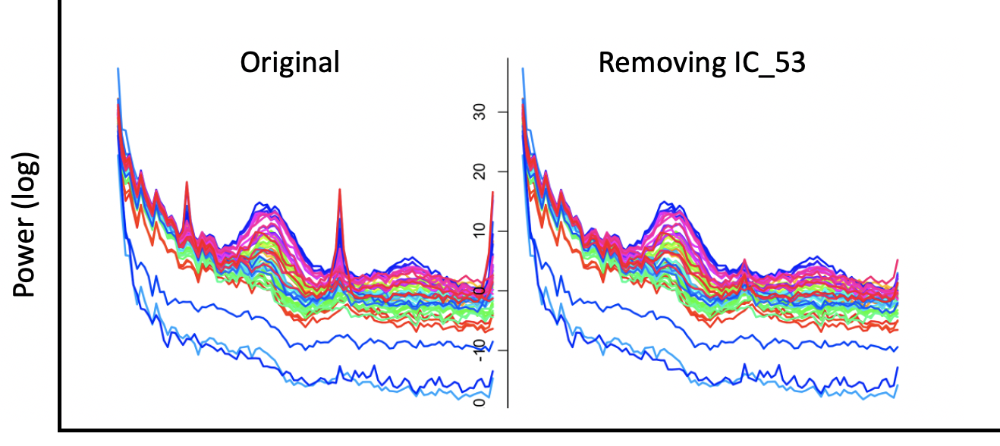

# Independent components and principal component analyses

_An implementation of the fastICA algorithm_

| Command | Description | 
| ---- | ------ | 
| [`ICA`](#ica)      | Fit ICA model to signal data |
| [`ADJUST`](#adjust)  | Adjust original signals given one or more ICs |
| [`SVD`](#svd) | Apply time-series PCA to multiple channels | 

## `ICA`

_Independent components analysis_

This command implements the [fastICA algorithm](https://www.cs.helsinki.fi/u/ahyvarin/),
providing a C/C++ implementation of R's [fastICA package](https://cran.r-project.org/web/packages/fastICA/fastICA.pdf).

We hope that in future [vignettes](../vignettes/) we will be able to
provide a more contextualized account of how to apply ICA using Luna to
sleep data in practice.  __For now, this page contains only bare-bones
reference material__.

By default, `ICA` adds signals `IC_1`, `IC_2`, etc to the internal
EDF: these can then be used as signals in other commands (e.g. `PSD`)
to examine the properties of those components. You can also `WRITE`
the EDF containing these ICs.
    
Currently, this command works on a whole-recording basis, e.g. rather
than epoch-by-epoch.  This may not be appropriate if the whole
recording contains very different types of signals/artifatcs (i.e. if
the spatial sources of the components is not relatively stable over
time).

!!! hint
    Remember that ICA is not a deterministic algorithm, in that
    it is randomly seeded.  Therefore, `IC_4` in one run may not
    correspond to `IC_4` in a second run. It is therefore important to
    save the results of an ICA run, e.g. if determining which
    components to remove, etc.

!!! hint
    ICA can be a relatively slow and memory intensive operation
    for whole-night multi-channel datasets with high sampling
    rates. It is therefore worth exploring this command starting with
    smaller and/or down-sampled data, etc.

!!! warning
    Although implementations of ICA are standard, the proper application
    of ICA to multichannel EEG data is a complex methodological area,
    with various subtleties.  These routines are currently presented 'as
    is'.  In the future we will attempt to outline some best practices
    for using ICA (primarily for artifact detection) in the context of
    sleep data.


<h5>Parameters</h5>

Primary parameters are:

| Option | Description | 
| ---- | ---- | 
| `sig` | Specify which signals to include |
| `A`   | Filename for the mixing matrix `A` |
| `nc`  | Optionally, the number of components to extract |

Secondary parameters include:

| Option | Example | Description |
| ---- | ---- | ---- | 
| `no-new-channels` | | Do not write new channels to EDF |
| `tag`  | `V_` | Use `V_1`, `V_2`, etc, instead of `IC_1`, `IC_2`, etc |
| `file` | `ica1` | Write ICs (S matrix) and other ICA output to files `ica1.S`, etc |

<h5>Outputs</h5>

As mentioned, one output of `ICA` is a set of new channels added to
the (internal) EDF (unless `no-new-channels` is specified). These are
labelled `IC_1`, `IC_2`, etc, by default.

A second key output is the mixing matrix `A`, which is written to a
file.  A typical workflow will involve using this matrix/file in a
subsequent `ADJUST` command, in order to remove certain components from
the original signals.

Various other outputs are written to the standard output stream:

ICA mixing matrix (also output to a file) (strata: `CH` x `IC`)

| Variable | Description |
| --- | --- |
| `A` | Element of A matrix |

ICA unmixing matrix W (strata: `IC1` x `IC2`)

| Variable | Description |
| --- | --- |
| `W` | Element of W matrix |


ICA matrix K (strata: `KCH` x `KIC`)

| Variable | Description |
| --- | --- |
| `K` | Element of K matrix |


<h5>Example</h5>

Running `ICA` on a single EDF:

```
luna s.lst k=57 -o out.db -s ' MASK ifnot=N2
                             & RE
                             & ICA sig=${eeg} A=a.mat 
                             & PSD sig=[IC_][1:${k}] spectrum dB
                             & WRITE edf-tag=ic '
```

!!! hint
    Note that `[X][1:4]` expands to `X1,X2,X3,X4`

We can visualize the PSD of the ICs by extracting the information in 

```
destrat out.db +PSD -r F CH > psd.out

```
combined with the topographics of the ICs, and then use lunaR's [`ltopo.rb()`](../ext/R/viz.md#ltoporb) or similar functions to view these:

{width="100%"}

Here we see that some components are highly channel-specific (i.e. as
indicated by the topoplots, e.g. `IC_18`).  Looking at the PSD, some
ICs appear to reflect artifact, e.g. `IC_53`.  We can use the `ADJUST`
command to remove certain components from the original signals, as
illustrated below.


## `ADJUST`

_Adjusts signals given various ICs and other criteria_

This command is designed to work with `ICA`, and expects as input a)
the same signals used to compute the ICs, and b) the `A` matrix from
an ICA run.  Based on these, the `ADJUST` command will remove certain
components from the original signals.  One can specify the
components directly on the command line (e.g. `IC_53`).
Alternatively, it is possible to instruct `ADJUST` to select
components to be removed automatically, based on certain criteria.
Currently, only two criteria are supported: topographical outliers and 
high correlation with one or more other channels (e.g. EOG or EMG).

 
<h5>Parameters</h5>

| Parameter | Example | Description |
| ---- | ---- | ---- |
| `sig` |               | Signals to be adjusted |
| `A`   | `a-id1.txt` | Filename of `A` mixing matrix (from `ICA`) |
| `adj` | `[IC_][1:57]` | Putative set of ICs that may be adjusted for |
| `force` | `IC_5` | Force this component to be removed |
| `spatial` | 3 | Select components with extreme spatial variance |
| `corr-sig` | `LOC,ROC` | Other signals aginst which ICs will be correlated |
| `corr-th` | `0.8,0.8` | Absolute time-domain correlation threshold (matches # of `corr-sig` channels) |
| `tag` | `V` | If the IC prefix is other than `IC_` it can be specified here |


<h5>Output</h5>

This command primarily adjusts the channels in the (internal) EDF, rather than generating summary output.  Currently,
the one output that is given is the correlation between the original and the adjusted channel:


Channel-level output (strata: `CH`)

| Variable | Description |
| --- | --- |
| `R` | Time-domain correlation between the pre- and post-adjusted signal |


<h5>Example</h5>

Following from the `ICA` example above, to remove channel `IC_57` (and show before and after PSDs) we might write:

```
luna file-ic.edf -o out.db -s ' TAG ver/pre
                              & PSD sig=${eeg} spectrum dB
                              & ADJUST A=a.mat sig=${eeg} adj=${ic} force=IC_53 
                              & TAG ver/post
                              & PSD sig=${eeg} spectrum dB '
```

In these example data, the pre- and post-ICA PSD are as follows:

{width="100%"}


To drop ICs that show time-domain correlations above some threshold with one or more other channels (e.g. EOG), one
might use something like:

``` 
ADJUST sig=${eeg} adj=${ic} corr-sig=LOC,ROC corr-th=0.5,0.5
```

!!! hint
    Luna defines channel _types_ as `IC` components automatically
    if they start with `IC_`, and sets an automatic variable `${ic}`
    that corresponds to these.


## `SVD`

_Singular value decomposition of time-series data (PCA)_

This command performs PCA via SVD of multiple channels, and
(optionally) adds new channels to the current in-memory EDF. All input
channels must have the same sample rate.  A specified number of new channels (with
the same sample rate) will be added to the in-memory EDF.

<h5>Parameters</h5>

| Parameter | Example | Description |
| ---- | ---- | ---- |
| `sig` | `C3,C4,F3,F4` | Signals to be included in the SVD |
| `nc` | 4 | Number of components to extract |
| `tag` | `C_` | Tag to add to new channels (e.g. `C_1`, `C_2`, etc) |
| `norm` |  | Normalize channels (to unit variance) prior to SVD |
| `winsor` | `0.02` | Winsorize time series prior to SVD at this percentile (e.g. 2nd, 98th) |
| `no-new-channels` | | Do not add new channels to the EDF |

<h5>Outputs</h5>

The primary output (unless `no-new-channels` is set) are the `nc` new
channels added to the EDF.

Primary per-component output (strata: `C`)

| Variable | Description |
| --- | --- |
| `W` | Singular value |
| `INC` | Is this componenent included (e.g. given `nc`) |
| `VE` | Variance explainend | 
| `CVE` | Cumulative variance explained |

Component weights (right singular vectors) (strata: `C` x `FTR`)

| Variable | Description |
| --- | --- |
| `V` | Weight/right singular vector value |

