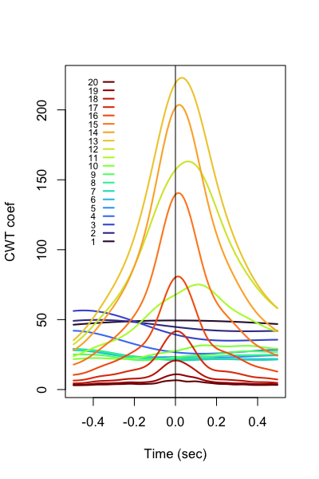

# Interval-based analyses

| Command | Description |
| ----- | ----- | 
| [`OVERLAP`](#overlap) | Annotation overlap/enrichment (single-sample) |
| [`--overlap`](#-overlap) | Annotation overlap/enrichment (multi-sample) |
| [`MEANS`](#means) | Signal means by annotation |
| [`PEAKS`](#peaks) | Detect and cache signal peaks |
| [`Z-PEAKS`](#z-peaks) | Detect and cache signal peaks, alternative method | 
| [`TLOCK`](#tlock) | Time-locked (e.g. peak-locked) signal averaging | 

## OVERLAP

_Randomisation framework to evaluate overlap/proximity between two or
more sets of (multi-channel) annotations_

This command calculates a series of simple overlap/proximity metrics
for interval-based [annotations](annotations.md), either in a single
individual or (if using the [`--overlap`](#-overlap) command) multiple
individuals. One or more annotation classes must be set as _seeds_;
during randomisation, seeds are shuffled to generate empirical null
distributions for evaluated metrics.  Shuffling all events together
largely preserves the inter-event time distribution (one exception is that annotations will "wrap"
around if shuffled past the end of the analysed region (i.e. they will
appear near the start of the analysis region).

_Background intervals and shuffling_

By default, the analysis region spans from 0 seconds (EDF start) to the end of the
last annotation.  Alternatively, a set of _background_ annotations can
be specified explicitly (the `bg` and `xbg` options) such that only annotations
that fall within a background interval (e.g. all QC+ NREM epochs) are
included.  Shuffling then occurs
only _within_ each contiguous background region.  Note that both test and
background annotations are _flattened_ prior to analysis, i.e.  merging
overlapping and contiguous annotations of the same class into a single interval/segment.

By default, seeds are shuffled by a
random offset between 0 and the length of the bounding background
segment.  Alternatively, one can further constrain shuffling (via
`max-shuffle`), by requiring the offsets to be no larger than _X_
seconds (e.g. 30).  This might be useful when analysing long,
continuous intervals (e.g. hours): here, the rate of different events
may vary over time which could result in spurious "coupling" being detected, even in
the absence of any true above-chance local overlap.  One
caveat is that any events wrapped around (i.e. shuffled past the end of the background) may
necessarily end up further away (in time) than `max-shuffle`.

This is a toy example of a valid shuffle for one seed class containing
three events for a given channel/background region:

```
          background:  |-------------------|            
                       |                   |
            original:  | 111  222      33  | 
                       |                   |
            shuffled:  |---------->111  222|      33    
                       |                   |               
 annotation #3 wraps:  |      33   111  222|                   
                       |                   |
                       |-------------------|
```

In contrast, this shuffle would not be allowed:


```
          background:  |-------------------|            
                       |                   |
            original:  | 111  222      33  | 
                       |                   |
            shuffled:  |----------->111  22|2      33
                       |                   |
 illegal, splits #2:   |2  33       111  22|
                       |                   |
                       |-------------------|
```

_Channel-specific annotations_

By default, within the same channel seeds of the same class are
shuffled together, whereas seeds
assigned to different channels are shuffled independently.  Shuffling
can be modified such that all some or all seed classes/channels are shuffled
together (via the `align` option).  When shuffling, the same
constraint that no event can span a background boundary will still
hold.  Alternatively, one can collapse all events of the same
annotation class across channels, either for all (`pool-channels`)
or some (`pool-channels=A,B`) annotations, i.e. effectively ignoring channel.

If a channel is specified, new annotation classes will be created for this analysis, e.g.
for seed class `A` and channels `C3` and `C4`, this will lead to `A_C3` and `A_C4`.

If you wish to only test for overlap for events occurring within the same channel, add
the `within-channel` option.


!!! info "Annotations and channels"
    Not all annotations need be associated with a channel, either in general or with
    the `OVERLAP` command in particular.  An annotation is associated with a channel is
    it is a channel label appears in the third column of a full-format `.annot` file.  If
    this is a period (`.`), then no channel is associated.

_Unsuitable inputs_

`OVERLAP` keeps randomising until it finds a valid shuffle.  However,
if more than a certain number of unsuccessful attempts are made, Luna
will give a warning.  This typically means that the data are not
suitable for this method.  For example, if a single seed event
completely spans the background interval, it will not be possible to
shuffle it.


_Seed metrics_

`OVERLAP` assesses the _pile-up_ among seeds, by enumerating the
observed and expected counts of all combinations of overlapping
annotations.  It also tracks that number of overlapping events
irrespective of their particular labels/channels. Depending on
context, not all of these metrics will necessarily be of interest:
i.e.  it will depend on what the annotations mean.

_Defining annotation overlap_

By default, "overlap" is defined as _any_ overlap between two
annotations.  This can be modified with the `midpoint` and/or `f`
options, which reduce each annotation to a central (0-duration)
mid-point and add a fixed _flanking_ interval to expand each
annotation, respectively.  That is, to enfore that all annotations had
the same duration, one would combine `midpoint` and `f`.

_Non-seed annotations_

_Non-seed_ annotations (specified via the `other` option) are neither shuffled nor included in seed _pile-up_ analyses (which appears under the `SEEDS` strata in the outputs,
see below).

Rather, various metrics of _seed-other_ overlap and proximity
are estimated:

 - overlap and proxmity metrics for specific _seed-other pairs_ (this appears under the `SEED OTHER` strata)

 - counts of particular _combinations_ of
   overlapping _other_ annotations (`SEED OTHERS` strata).  For example, if the _seed_ class
   include sleep spindles (`SP`) and two _other_ classes were
   specified: slow oscillations (`SO`) and hippocampal ripples
   (`RIP`), then this command would tabulate up to four classes of
   spindle:
   ```
    SP not overlapped by SO or RIP
    SP overlapped by a SO only
    SP overlapped by a RIP only
    SP overlapped by both a SO and a RIP
   ```

 - the number of seeds that are overlapped by at least one _other_ event (`SEED` strata).  Note that
   this mirrors the "not overlapped by any other annotation" entry of the above `SEED OTHERS` strata; it
   is included here for convenience and presents the output in a different manner.


_Proximity to nearest neighbours_

In addition to overlap, `OVERLAP` reports metrics to evaluate whether
events are, on average, _closer to the nearest other class of event_
than expected by chance, either in absolute terms (`D1`) or "signed"
(e.g. if the _seed_ tends to occur _before_ some _other_ annotation,
rather than just _near_, which might instead imply seeds are equally
likely to occur _after_).  By default, annotations that actually
overlap directly are still inlcuded in these proximity/distance
metrics, just with a distance of 0 (this behaviour can be changed by
the option `dist-excludes-overlapping`).  By default, only pairs that
occur within 10 seconds or each other are included in these analyses
(can be changed by the `w` option).


_Statistics_

This command outputs one-sided empirical P-values (for greater than
expected overlap) but also the observed metric scaled as a Z score
based on the mean and varince of the empirical null distribution; i.e.
here large negative values reflect metrics that are _lower than
expected chance_.  Note that, unless the null hypothesis is true,
these Z scores will reflect the _number_ of events as well as the
extent of (non-random) overlap/coupling.  The number of replicates is set by `nreps` (defaults to 100).

_Generation of new annotations_

Finally, as well as evaluating overlap metrics by randomisation, the
`OVERLAP` command can be used in a different mode, to generate new
versions of seed annotations, based on whether they overlap
(`matched`) _other_ annotations or not (`unmatched`, i.e. which only
outputs seed events that are _not_ overlapped). 


<h3>Parameters</h3>

_Key options_

| Option | Example | Description |
| ---- | ---- | ---- |
| `seed` | `SP` | Seed annotation classes (required) |
| `other` | `SO,ART` | Other annotations |
| `nreps`| 1000 | Number of randomisations |

`seed` and `other` parameters can take annotation labels with wildcards at the end: e.g. `seed=sp*,so` matches `sp_11`, `sp_15`, etc

_Constraining shuffling_

| Option | Example | Description |
| ---- | ---- | ---- |
| `bg` | `N2,N3` | Background intervals to include |
| `xbg` | `?` | Intervals to exclude from the `bg`-specified background |
| `max-shuffle` | `30` | Use a constrained shuffle (maximum of 30-seconds) |
| `align` | `A1,A2|R1|Z1,Z2` | Align (i.e. shuffle together) sets of annotations |
| `fixed`|
| `shuffle-others` | | Also shuffle `other` as well as `seed` annotations |
| `edges` | `1` | Do not allow shuffles within N seconds of background borders |

_Metrics_

| Option | Example | Description |
| ---- | ---- | ---- |
| `pileup` | | Do seed pileup analysis (default true) |
| `within-channel` | | Only analyse annotations with the same channel specified |
| `w` | `5` | Window for nearest-neighbour analysis (default 10 sec) |
| `dist-excludes-overlapping` | | Exclude overlaps from nearest neighbour/distance analyses |
| `ordered` | | Do not ignore order of seed-seed pile-up |

_Event definitions_

| Option | Example | Description |
| ---- | ---- | ---- |
| `f` | `0.5`, `A1:0,A2:1,A3:0` | Specifying the flanking region for all/some annotations |
| `midpoint` | `midpoint=A` | Collapse all or some annotations to their midpoint |
| `pool-channels` | `A,B` | Pool annotations across channels for these annotataions (or all annotations, if no args) |
| `chs-inc` | `Cz,Fz` | Only analyse these channels for all/some annotations |
| `chs-exc` | | Exclude these channels for all some/annotations | 
| `flt` |  `wgt,10,.` | Annotation meta-data filters | 

_Generation of new annotations_

| Option | Example | Description |
| ---- | ---- | ---- |
| `matched`   | `M1` | Make new annotations with `_M1` suffix, for matched seeds |
| `unmatched` | `M0` | Make new annotations with `_M0` suffix, for unmatched seeds |
| `m-count` | `2` | Requires _M_ or more overlaps to count as a match for `matched`/`unmatched` |


<h3>Output</h3>

Seed-seed pile-up (strata: `SEEDS`)

| Variable | Description |
| --- | --- |
| `OBS` | Number of seed-seed pile-ups of this type observed |
| `EXP` | Expected number of such combinations, under chance overlap |
| `P` | Empirical p-value for above-chance overlap |
| `Z` | Observed pile-up metrics as Z scores

Pairwise seed-other overlap/proximity (strata: `SEED` x `OTHER`)

| Variable | Description |
| --- | --- |
| `D1_OBS` | Observed absolute proximity metric |
| `D1_EXP` | Expected absolute proximity metric |
| `D1_P` | Empirical p-value for absolute proximity metric |
| `D1_Z` | Z score for absolute proximity metric |
| `D2_OBS` | Observed signed proximity metric |
| `D2_EXP` | Expected signed proximity metric |
| `D2_P` | Empirical p-value for signed proximity metric (two-sided) |
| `D2_Z` | Z score for signed proximity metric |
| `D_N` | Number of seeds in the distance metrics |
| `D_N_EXP` | Expected nunbver of seeds in the distance metrics |
| `N_OBS` | Observed number of overlaps |
| `N_EXP` | Expected number of overlaps |
| `N_P` | Empirical p-value for overlap |
| `N_Z` | Z score overlap metric | 


Seed - other combinations (strata: `SEED` x `OTHERS`)

| Variable | Description |
| --- | --- |
| `N_OBS` | Observed number of seeds with this combination of _other_ annotations |
| `N_EXP` | Expected number of seeds with this combination |
| `N_Z` | Z score for enrichment of this combination |

Seed - _any other_ overlap (strata: `SEED`)

| Variable | Description |
| --- | --- |
| `PROP` | Proportion of seeds with _at least one other_ annotation overlapping |
| `PROP_EXP` | Expected proportion under the null |
| `PROP_P` | Empirical p-value for excess overlap |
| `PROP_Z` | Z score for overlap of at least one other annotation |


<h3>Example</h3>


Note, the `OVERLAP` command does not look at, or require, any signal data present in the EDF.
As such, it can be run based on annotation (`.annot`) files alone - either via the [`--overlap`](#-overlap)
command describd below (but for a single sample), or by specifying an empty sample list (`.`) to make
Luna generate a dummy/empty EDF in memory, as described [here](../luna/args.md#empty-edfs):

```
luna . --nr=10000 --rs=1 annot-file=test.annot -o out.db \
       -s OVERLAP seed=A other=C bg=B nreps=1000
```

The implied duration (i.e. 10,000 times 1 second = 10,000 seconds in
the above example) should be sufficiently large to contain all
annotataions specified; with `bg`, this implicitly defines the _background_.


<h4>Other notes</h4>

Recent changes in v0.99:

 - the OVERLAP command now has contrasts, event-perm, offsets
   options. Now one should add seed-seed=T to get seed-seed pairs;
   adding seed-seed pileup is now turned off by default, unless
   pileup=T is added

 - the OVERLAP command now accepts rp=<annot>|<tag>,... to get
   rp_tag=xxx from meta data for that annotation, in which case it
   will set a 0-duration time-point at that position


## --overlap

_Multi-sample wrapper for `OVELAP`_

This command reads in multiple annotation files, saves a single combined
annotation file, creates a dummy EDF in memory, then reads in the combined annotations
and performs an enrichment analysis, as described [above](#overlap).

All annotation files must be in `.annot` format; they can be reduced
and must contain an `duration_sec` spectial value.

<h3>Parameters</h3>

| Option | Example | Description |
| ---- | ---- | ---- |
| `bg` | `B` | A background annotation is _required_ in the multi-sample case |
| `a-list` | `list.txt` | Text file with IDs and annotation files |
| `merged` | `m` | Root name for temporary combined annotation file, e.g. `m.annot` |

All other parameters are as described [above](#overlap) for the `OVERLAP` command.


## MEANS

_Calculates signal means conditional on annotations_

Reports the means of signals during certain annotations, and
optionally the mean values in the flanking regions just before and
just after those annotations.

This command requires the signals to have similar sampling rates.

<h3>Parameters</h3>

| Parameter | Example | Description |
| --- | --- | --- |
|`sig`|`sig=C3,C4` | Optional, one or more signals |
|`annot`| `annot=N2,N3` | One or more annotation classes |
|`w`| `w=5` | Flanking window (seconds) to consider before and after each annotation |
|`by-instance` | | Report means stratified by annotation class _and_ instance IDs |


!!! info
    Note that the flanking regions are not checked for what annotation they contain: i.e. if there are
    contiguous annotations of the same class, then the flanking regions will contin the same annotation. 
    ```
    class instance start stop
     A     i1       10    20
     A     i2       20    30  <- 'flanking' regions for this are also 'A' 
     A     i3       30    40
     A     i4       40    50
     B     i1       50    60  <- flanking regions for this B are non-B
     A     i5       60    70
    ```

<h3>Output</h3>

Means by channel and annotation (strata: `CH` x `ANNOT`)

| Variable | Description |
| ----- | ---- | 
| `M` | Mean of signal for this annotation class |
| `L` | Mean of all left-flanking regions (if `w>0`) |
| `R` | Mean of all right-flanking regions (if `w>0`) |

Means by channel and annotation class/instance (option: `by-instance`, strata: `CH` x `ANNOT` x `INST`)

| Variable | Description |
| ----- | ---- | 
| `M` | Mean of signal for this annotation class |
| `L` | Mean of all left-flanking regions |
| `R` | Mean of all right-flanking regions |


<h3>Example</h3>

This command will typically be performed for a channel in which the mean value is interpretable, i.e. not raw EEG channels.

For example, using `MEANS` to get the mean 15-Hz wavelet power per sleep stage:

```
luna s.lst -o out -s 'CWT sig=C3 fc=15 cycles=7 & MEANS sig=C3_cwt_mag annot=N1,N2,N3,R,W'
```


## PEAKS

_Find peaks in signals_

The command identitifies peaks (local minima and maxima) in signals, and caches those sample-points for use in
subsequent commands, primarily [`TLOCK`](#tlock).

<h3>Parameters</h3>

| Parameter | Example | Description |
| --- | --- | --- |
|`sig`|`sig=C3,C4` | Optional, one or more signals |
|`cache`| `cache=p1` | Name of cache |
|`epoch`| | Perform by epoch |
|`min` | | Find minima as well as maxima |
|`min-only` | | Only find minima |
|`clipped` | `clipped=3` | Do not count clipped regions as peaks, defined as 3 or more equal values |
|`percentile` | `percentile=10` | Only take top P percentile of peaks |

<h3>Output</h3>

No output; this command only stores peaks in a subject-specific cache object internally (i.e. they are available for this individual
in subsequent Luna commands.

<h3>Example</h3>

See the example with [`TLOCK`](#tlock) below.


## Z-PEAKS

_Z-score method to find signal peaks_

This command provides an implementation and minor extension of a
simple peak finding heuristic previously described
[here](https://stackoverflow.com/questions/22583391/peak-signal-detection-in-realtime-timeseries-data/22640362#22640362).
(Ref: Brakel, J.P.G. van (2014). "Robust peak detection algorithm using z-scores).").

This method calculates a running mean and SD over a signal, and
defines peaks as regions above (or below) a set number of SD units.
This allows some control over the types of peaks detected, through
several reasonably intuitive parameters:

 - _lag_ (window size) : higher values mean more smoothing, which impacts the
 sensitivity to long-term shifts in the mean of a signal; for
 stationary time series, you should use a higher _lag_; to capture
 time-varying trends, use a lower _lag_

 - _influence_ : the extent to which detected peaks influence the
  baseline (0 = no influence, 1 = complete influence).  For stationary
  series, use low/zero _influence_ values; using higher numbers will
  better capture abrup changes in the baseline of time-series

 - _threshold_ : the number of SD units above the moving average.
  This can be set based on the expected rate: e.g. approximately,
  assuming normality, a value of 3.5 SD units corresponds to a rate of
  ~0.00047, or 1 in 2,128 (i.e. in R `pnorm(3.5,lower.tail=F)*2`)

Luna also allows for imposing some absolute min/max amplitude and
duration thresholds on detected peaks, for both a "core" peak region,
and for flanking regions.  Also, it allows detected peaks to be saved
as [annotations](annotations.md).


<h3>Parameters</h3>

_Main parameters_

| Parameter | Example | Description |
| --- | --- | --- |
| `sig` | `H1,H2` | Signals to process (if absent, do all) |
| `w` | 2 | Window (seconds) - i.e. the _lag_ parameter above)
| `influence` | 0.1 | Influence parameter between 0 and 1 (default 0.01) |
| `th` | 3.5 | Threshold parameter (in SD units) | 

_Secondary parameters_

| Parameter | Example | Description |
| --- | --- | --- |
| `max` | 2 | Maximum peak threshold (SD units), i.e. ignore very large peaks if >0 |
| `sec` | 0 | Minimum peak duration (seconds) |
| `th2` | 2 | Flanking region threshold (SD units) |
| `sec2` | 2 | Flanking region duration (seconds) |
| `negatives` | | Ignore negative peaks |

_Creating annotations based on detected peaks_

| Parameter | Example | Description |
| --- | --- | --- |
| `annot` | `peaks` | Save an internal annotation channel called e.g. `peaks` |
| `add-flanking` | 1 | Add e.g. 1 second to each peak when creating the new annotation |


<h3>Outputs</h3>

No formal output, other than some notes to the console. The primary output of this command is to create an [annotation](annotations.md)
based on detected peaks currently.


<h3>Example</h3>

_to be added_


## TLOCK

_Time-locked signal averaging_

Given a set of points in a _cache_ (e.g. as constructed by the
[`PEAKS` command](#peaks) or similar, calculate signal means that are
synced to those points, plus/minus a fixed number of seconds.

<h3>Parameters</h3>

| Parameter | Example | Description |
| --- | --- | --- |
|`sig`|`sig=C3,C4` | Optional, one or more signals |
|`cache`|`cache=p1` | Cache name to use, e.g. generated by `PEAKS` or similar |
|`w` | `w=1.5` | Window size (seconds) |
|`tolog`| | Take the log of the signal |
|`phase` | `phase=20` | Assume signal is a phase (circular) and use this many bins to summarize |
|`verbose` | | Show the entire matrix (all points) rather than just averaging |
|`np` | `np=0.2` | Normalization points, e.g. 20% of start/end of window |
|`same-channel` | | Constrain output to cases where the `sig` channel equals the source channel (`CH == sCH`) |


<h3>Output</h3>


By channel (strata: `CH` plus any cache factors)

| Variable | Description |
| ----- | ---- |
| `N` | Number of intervals used in averaging |
| `N_ALL` | Total number of intervals |

(`N` may be less than `N_ALL` if windows are requested at discontinuities, i.e. so the window can't be placed.)

Channel values by time-point (strata: `CH` x `SEC` plus any cache factors)

| Variable | Description |
| ----- | ---- |
| `M` | Signal mean at this time-point |


Channel values by interval and time-point (option: `verbose`, strata: `CH` x `N` x `SEC` plus any cache factors)

| Variable | Description |
| ----- | ---- |
| `V` | Signal value at this time-point |


<h3>Example</h3>

Here we detect N2 spindles, using the `cache-peaks` option to save the spindle _peak_ (largest central negative peak) under a cache called `p1`.  We
then use those defined positions in `TLOCK` (i.e. via the `cache=p1` option) and request an average window of +/- 0.5 seconds, to plot the raw EEG signals:

```
luna s.lst -o out.db -s 'MASK ifnot=N2 & RE &
                         SPINDLES sig=EEG fc=15 cache-peaks=p1 &
                         TLOCK cache=p1 sig=EEG w=0.5 ' 
```

```
  detecting spindles around F_C 15Hz for EEG
  wavelet with 7 cycles
  smoothing window = 0.1s
  detection thresholds (core, flank, max)  = 4.5, 2x
  core duration threshold (core, min, max) = 0.3, 0.5, 3s
  basic mean-based multiplicative threshold rule
  merged nearby intervals: from 450 to 425 unique events
  filtering at 13 to 17, ripple=0.02 tw=4
  QC'ed spindle list from 425 to 400
  estimated spindle frequency is 12.9894
  estimated spindle density is 2.00501
 ..................................................................
 CMD #4: TLOCK
   options: cache=p1 sig=EEG w=0.5
  included 400 of 400 intervals for strata 1 CH=EEG;F=15; for channel EEG
```


Looking at the `TLOCK` output in `out.db`:

```
  [TLOCK]       : CH sCH sF         : 1 level(s)    : N N_ALL
                :                   :               : 
  [TLOCK]       : SEC CH sCH sF     : 125 level(s)  : M
```

We see two extra strata: `sCH` and `sF` modify the `CH` and `CH` x
`SEC` strata.  These represent the _seed_ strata (thus the `s` prefix)
and reflect the different conditions under which `SPINDLES` gives
output.  In this particular case, `sCH` is simply `EEG` (as is `CH`),
and `sF` is 15 (i.e. from `fc=15`).  Here, the seed factors refer to
which set(s) of points were generated by `SPINDLES` and are being used
from the cache; in contrast, `CH` represent which signal we are
currently averaging.  These need not be the same (as below).

We can force them to be the same by adding the `TLOCK` option
`same-channel`. i.e. if we had 64 channels of EEG, then `SPINDLES`
would save 64 levels of `sCH` for each frequency; we would not
necessarily want all 64 x 64 = 4096 combinations of `CH` and `sCH` to
be output (e.g. including the time-locked average of `F3` synchronized
to spindles detected at `O2`, etc).  Thus `same-channel` would, in
this instance, only report the 64 averages, i.e. for spindles detected
_in that same channel_.

The first set of outputs simply tell us how many interevals were found:
```
destrat out.db +TLOCK -r CH sCH sF
```
```
ID      CH   sCH   sF     N   N_ALL
id01   EEG   EEG   15   400     400
```
This reports 400, matching the number of spindles detected for this channel (see log output above).

To see the actual signal average, here we'll directly extract the table using _lunaR_:
```
k <- ldb("out.db") 
d <- k$TLOCK$CH_SEC_sCH_sF
plot( d$SEC , d$M , type="l" ) 
abline(h=0) 
```


i.e. here we see the characteristic spindle waveform.


In the second example, we'll create a second set of channels to plot
against the 400 spindle peaks.  Note, these can be completely
arbitrary other channels, but in this instance we'll generate wavelet
coefficients (via `CWT`) for wavelets with central frequency values of
1 Hz to 20 Hz in 1 Hz increments.  Then we'll ask `TLCOK` to plot the time-locked
average of each wavelet coefficient, but all time-locked to the fast spindle peaks.
i.e. as a proof-of-principle, we'd expect to see sigma-frequency wavelets increase in
power in this interval. 

```
luna s.lst -o out.db -s 'MASK ifnot=N2 & RE &
                         CWT sig=EEG fc-inc=1,20,1 cycles=7 &
                         SPINDLES sig=EEG fc=15 cache-peaks=p1 &
                         TLOCK cache=p1 sig=[EEG_cwt_mag_][1:20] w=0.5 ' 
```

To plot all signatures in R:

```
k <- ldb("out.db")
d <- k$TLOCK$CH_SEC_sCH_sF
p20 <- lturbo(20)
plot( d$SEC , d$M , type="n" , xlab = "Time (sec)" , ylab = "CWT coef" )
for (f in 1:20 ) {
 ch <- paste( "EEG_cwt_mag" , f , sep="_" )
 lines( d$SEC[ d$CH == ch ] , d$M[ d$CH == ch ] , lwd=2 , col = p20[f] ) 
}
abline(v=0)
# adhoc legend
for (f in 1:20 ) {
 lines( c(-0.35,-0.3) , c(100+f*6,100+f*6) , lwd=2, col=p20[f] )
 text( -0.4 , 100+f*6 , f , cex=0.7 ) 
}
```


