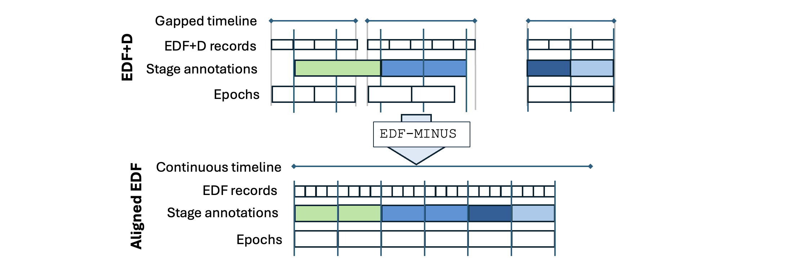
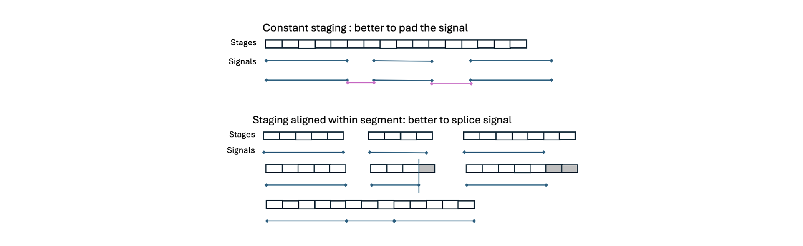

# Manipulations

_Commands to alter basic properties of the EDF and the signals therein_

| Command | Description |
| -----  | ----- | 
|[`SIGNALS`](#signals) | Retain/remove specific EDF channels |
|[`RENAME`](#rename) | Rename channels |
|[`COPY`](#copy) | Duplicate one or more EDF channels |
|[`RESAMPLE`](#resample) | Resample signal(s) | 
|[`ENFORCE-SR`](#enforce-sr) | Require a particular sample rate |
|[`REFERENCE`](#reference) | Re-reference signals |
|[`DEREFERENCE`](#dereference) | De-reference signals |
|[`CANONICAL`](#canonical) | Generate _canonical_ signals |
|[`MINMAX`](#minmax) | Set digital/physical min/max across channels |
|[`uV`](#uv) | Rescale units to uV |
|[`mV`](#mv) | Rescale units to mV |
|[`FLIP`](#flip) | Flip polarity of signal | 
|[`ZC`](#zc) | Mean-center signal |
|[`ROBUST-NORM`](#robust-norm) | Robust normalisation |
|[`EDF`](#edf) | Force EDF (versus EDF+) state |
|[`TIME-TRACK`](#time-track) | Add a time-track to an EDF |
|[`RECORD-SIZE`](#record-size) | Change EDF record size |
|[`EDF-MINUS`](#edf-minus) | Realign EDF records, annotations and epochs |
|[`ANON`](#anon)    | Strip ID information from EDF header |
|[`SET-HEADERS`](#set-headers) | Directly specify certain EDF headers |
|[`SET-VAR`](#set-var) | Directly specify Luna variables |
|[`SET-TIMESTAMPS`](#set-timestamps) | Directly specify EDF record time-stamps |
|[`RECTIFY`](#rectify) | Rectify a signal |
|[`REVERSE`](#reverse) | Reverse a signal |
|[`MOVING-AVERAGE`](#moving-average) | Moving average (or median) of a signal | 

<!--- remove this old command now we have EDF-MINUS --->
<!--- |[`ALIGN`](#align) | Realign EDF records, annotations and epochs | --->


## SIGNALS

The command requires one of two options: _either_ `keep` _or_ `drop`.
Each expects a comma-delimited list of channel names (or
[_aliases_](../luna/args.md#aliases)), which are either retained or
removed from the in-memory dataset.

<h3>Parameters</h3>

| Option | Example | Description | 
| ---- | ----- | ----- | 
| `drop` | `drop=EMG,ECG`  | Drop channels `EMG` and `ECG` |
| `keep` | `keep=C3,C4` | Drop all channels _except_ `C3` and `C4` |

<h3>Outputs</h3>

Other than modifying the _in-memory_ representation of the EDF, there
is no further output (except some notes written to the log).

<h3>Example</h3>

For an EDF with 6 signals, including `EMG`, `EOG-L` and `EOG-R`, this command would drop these three signals:

```		
luna s.lst -s "SIGNALS drop=EMG,EOG-L,EOG-R & DESC"
```
as shown by the relevant lines in the output from `DESC`:
```
Number of signals : 3
Signals           : EEG1[256] EEG2[256] EEG3[256]
```
In contrast, the `keep` option with the same arguments: 
```
luna s.lst -s "SIGNALS keep=EMG,EOG-L,EOG-R & DESC"
```
yields the expected output:
```
Number of signals : 3
Signals           : EOG-L[256] EOG-R[256] EMG[256]
```

## RENAME

_Renames channels_

This command can rename channels within the context of evaluating a
Luna script.  In this way, it differs from using signal
[aliases](../luna/args.md#alaises) (which can only be specified when
first initiating Luna, and will be fixed for all individuals), as this
command can use [variables](../luna/args.md#variables) (which may be
[individual-specific](../luna/args.md#individual-variables)).

It is also possible to supply a `file` of new labels for multiple signals instead.

<h3>Parameters</h3>

| Parameter | Example | Description |
| --- | --- | --- |
| `sig` | `C3,C4` | List of channels to duplicate |
| `new` | `C3_LM,C4_LM` | List of new labels (same size as `sig`) |
| `file` | `f.txt` | File of old/new labels | 

Note that you cannot use an existing channel label as a `new` label.

If specifying a file, such files should be tab-delimited, containing exactly
two fields per row (original label as per `sig`)
and the new value as per `new`).


<h3>Output</h3>

No formal output, other than changing the labels of channels in the internal EDF

<h3>Example</h3>

In its simplest form, if we have a channel named `THOR_RES`, for
example, we can rename to some other label -- here just using `XX` --
using `RENAME`, and then use that new label in other commands:

```
luna s.lst -s ' RENAME sig=THOR_RES new=XX & STATS sig=XX '
```

Note that this also adds an alias internally, so that `THOR_RES` can
still be used as a label (e.g. with the `sig` option of a command),
but the output will be labelled with the primary term `XX`.

As noted above, this provides similar functionality as using a signal
[alias](../luna/args.md#aliases):

```
luna s.lst "alias=XX|THOR_RES" -s ' STATS sig=XX '
```

The primary difference is that `RENAME` accepts (individual-specific)
variables as arguments, i.e. which can allow different individuals to
have different assignments (with `sig` and/or `new`).  For example, in
this toy example, we change `THOR_RES` and `ABDO_RES` (all present in
the three individuals in the [tutorial dataset](../tut/tut1.md) to
different labels.  If we have a tab-delimited file that defines these
variables for each individual:

```
cat ch.txt
```
```
ID	CHS
nsrr01	XX,YY
nsrr02	AA,BB
nsrr03	CC,DD
```

Now, the command
```
luna s.lst vars=ch.txt \
     -s ' DESC & RENAME sig=THOR_RES,ABDO_RES new=${CHS} & DESC ' 

```

will use `RENAME` to swap those two channels to the other specified
values: e.g. showing extracts from the `DESC` output for the three
individuals: in all cases, the first `DESC` command gives the same:

```
Signals : SaO2[1] PR[1] EEG_sec_[125] ECG[250] EMG[125] EOG_L_[50]
          EOG_R_[50] EEG[125] AIRFLOW[10] THOR_RES[10] ABDO_RES[10] POSITION[1]
          LIGHT[1] OX_STAT[1]
```
whereas the second `DESC` varies between the three individuals as expected:
```
Signals : SaO2[1] PR[1] EEG_sec_[125] ECG[250] EMG[125] EOG_L_[50]
          EOG_R_[50] EEG[125] AIRFLOW[10] XX[10] YY[10] POSITION[1]
          LIGHT[1] OX_STAT[1]
```

```
Signals  : SaO2[1] PR[1] EEG_sec_[125] ECG[250] EMG[125] EOG_L_[50]
           EOG_R_[50] EEG[125] AIRFLOW[10] AA[10] BB[10] POSITION[1]
           LIGHT[1] OX_STAT[1]
```
and
```
Signal   : SaO2[1] PR[1] EEG_sec_[125] ECG[250] EMG[125] EOG_L_[50]
           EOG_R_[50] EEG[125] AIRFLOW[10] CC[10] DD[10] POSITION[1]
           LIGHT[1] OX_STAT[1]
```

Another difference is that using a signal aliases allows a many-to-one
mapping, whereas `RENAME` requires a one-to-one mapping of
labels. That is, `"alias=XX|AA|BB|CC"` will map either `AA`, `BB` or
`CC` to `XX` (i.e. where an individual EDF may have none, one or
multiple of these labels).  In contrast, `RENAME` must use the single,
primary label in the `sig` option.   However, there is nothing stopping
combined use of signal aliases and the `RENAME` command, i.e. to achieve a many-to-many
mapping of labels: e.g. 

```
luna s.lst vars=ch.txt "alias=XX|AA|BB|CC" \
     -s ' RENAME sig=XX new=${CHS} & WRITE edf-dir=edfs/ ' 
```

This effectively uses `XX` as an intermediate (mapped to from _either_ `AA`, `BB` or `CC`) and will then write to
the new EDF a label as defined in `ch.txt`.   Of course, an alternative would be to also supply individual-specific
labels for both `sig` and `new` in the `vars.txt` file, e.g. if it had two columns defining `OLD` and `NEW` variables/columns:
```
luna s.lst vars=ch.txt \
     -s ' RENAME sig=${OLD} new=${NEW} & WRITE edf-dir=edfs/ '	
```


## COPY

_Duplicates one or more EDF channels_

Because some Luna commands modify a channel
(e.g. [`FILTER`](fir-filters.md#filter)), it can be desirable to first
make a copy of the original channel.  New channels are written out
with the [`WRITE`](outputs.md#write) command.

Although multiple signals can be duplicated at the same time
(i.e. will all be given the same tag), only data channels (i.e. not
EDF Annotation channels in EDF+) are duplicated.

<h3>Parameters</h3>

| Parameter | Example | Description | 
| --- | --- | --- | 
| `sig` | `sig=C3,C4` | List of channels to duplicate |
| `tag` | `tag=DELTA` | A required option, this is added to make the new channel name, e.g. `C3` becomes `C3_DELTA` | 

<h3>Output</h3>

One or more new channels are created in the _in-memory_ representation
of the EDF.  Aside from a note in the log, there is no formal
(destrat-based) output for this command.

<h3>Example</h3>

To extract one channel (`EEG`) from an original EDF, and then duplicate it:

```
luna s.lst 2 sig=EEG -s 'DESC & COPY sig=EEG tag=V2 & DESC'
```

As expected, the first `DESC` output shows a single channel:
```
EDF filename      : edfs/learn-nsrr02.edf
ID                : nsrr02
Clock time        : 21:18:06 - 07:15:36
Duration          : 09:57:30
# signals         : 1
Signals           : EEG[125]
```

After the `COPY` command has been executed, there are now two channels: `EEG` and `EEG_V2`:
```
EDF filename      : edfs/learn-nsrr02.edf
ID                : nsrr02
Clock time        : 21:18:06 - 07:15:36
Duration          : 09:57:30
# signals         : 2
Signals           : EEG[125] EEG_V2[125]
```


## RESAMPLE

_Changes the sampling rate of a signal_

Uses functions from `libsamplerate` to upsample or downsample signals.
Within a maximum upsampling/downsampling factor of 256, there are no
constraints on the new sample rate (i.e. the ratio of old and new
sample rates need not be a rational number).

The `downsample` and `upsample-if` options can be used to control whether a channel is resampled:

 - `downsample` means that channels will only ever be downsampled, otherwise left _as is_

 - `upsample-if=50` means that channels will only be resampled (up or down) if the rate is above, e.g. 50 Hz.  This option can
 avoid "garbage channels" (e.g. a channel labelled as an EEG but with a sample rate of 10 Hz, for example) being included.

<h3>Parameters</h3>

| Parameter | Example | Description | 
| --- | --- | --- | 
| `sig` | `sig=C3,C4` | Signal list |
| `sr` | `sr=128` | New sampling rate (Hz) | 
| `downsample` | | Only channels with rates _above_ `sr` will be downsampled
| `upsample-if` | `upsample-if=100` | Only resample if the original sample rate is greater than this value | 


<h3>Output</h3>

No output other than a message to the log (and altering the in-memory
signal).

<h3>Example</h3>

To create a new EDF with the `EEG` channel resampled to 100 Hz:

```
luna s.lst -s 'RESAMPLE sig=EEG sr=100 & WRITE edf-tag=resample edf-dir=edfs/ sample-list=s2.lst'
```

## ENFORCE-SR

_Drop signals that do not conform to a given EDF record size, or min/max sample rate_

To enable clean EDF record-size conversion, this command first drops
any signals which would not be able to be represented by an _N_-second
record size. For example, a signal with a sample rate of 125 Hz cannot
be represented in the EDF block/record structure if each block is only
0.5 seconds.  Such signals will be dropped (based on `dur`) from the
internal EDF representation. This command can be used prior to a
`RECORD-SIZE` command.

Further, this command can optionally drop signals with a sample rate
below or above a given range (using `sr`).

<h3>Parameters</h3>

| Parameter | Example | Description |
| --- | --- | --- |
| `dur` | `dur=1` | Proposed EDF record size (seconds), which may differ from the current value |
| `sr` | `sr=100,200` | Optionally, drop signals with rates below 100 Hz or above 200 Hz |


<h3>Output</h3>

No output other than a message to the log (and altering the in-memory
signal).


## REFERENCE

_Re-references signals with respect to one or more other signals_

<h3>Parameters</h3>

| Parameter | Example | Description | 
| --- | --- | --- |
| `sig` | `sig=C3,C4` | Signal(s) to re-reference | 
| `ref` | `ref=A1,A2` | Signal(s) to provide the reference | 
| `pairwise` | | Perform pairwise re-referencing between `sig` and `ref` (see below) |
| `new` | `new=C3_LM` | Generate a new channel instead of altering `sig` | 
| `sr` | `sr=128` | Resample all channels first to this sample rate |

Both `sig` and `ref` are required parameters. If more than one
channel is given as the reference (in a comma-delimited list), the
average of those channels is used as the reference value.  Alternatively, if the `pairwise`
option is also specified, then `sig` and `ref` should be of the same length.  In this case,
rather than average multiple `ref` channels, the command would do a pairwise referencing:

Given the above `sig` and `ref` values in the table above: without the `pairwise` option, the
two channels would be calculated as:
```
  -->  C3 - (A1+A2)/2
       C4 - (A1+A2)/2
```
With `pairwise`:
```
  ---> C3 - A1
       C4 - A2
```

If using `new`, only a single channel can be re-referenced.

<h3>Output</h3>

No output, other than a note to the log.  In memory, the updated
`sig` channels will contain the re-referenced values.

## DEREFERENCE

_De-references signals with respect to one or more other signals_

This command is a mirror of `REFERENCE`: instead of subtracting another reference signal, this simply adds it back in, i.e.
effectively removing an existing reference.  The options (`new`, `pairwise`, `sr`, `sig` and `ref`) are otherwise similar,
see above for details.


## MINMAX

Set digitial and physical minimum and maximum values in the EDF header
to be equal across multiple channels.  This can be necessary to enable
other software to be able to work with an EDF, by making it better
conform to the EDF specification.  Signals specified here must be
comparable, e.g. all EEG and EOG with a common amplifier and ADC, and
so are expected to have similar scaling and sensitivity (unit/bit) in
the EDF.

<h3>Parameters</h3>

| Parameter | Example | Description |
| --- | --- | --- |
| `sig` | `sig=C3,C4` | Signals (two or more) to set group min/max values |


<h3>Output</h3>

No formal output is given. The channels are rescaled internally.  Any
subsequent commands (i.e. including `WRITE` to write a new EDF) will
therefore based based on these new header values.

<h3>Example</h3>

Here we have an EDF with channels C3, C4, F3, F4, O1, O2, A1 and A2. The `HEADERS`
command shows that the channels have different physical min/max values, and therefore
different `SENS` values (scaling of micro-volts per bit in the EDF):

```
luna id01.edf -o out.db -s HEADERS
```
```
destrat out.db +HEADERS -r CH
```
```
ID        CH  DMAX   DMIN    PDIM  PMAX    PMIN     SENS    SR   TYPE
id01.edf  F3  32767  -32768  uV    1574.8  -3276.8  0.07403 500  EEG
id01.edf  F4  32767  -32768  uV    1720.9  -3276.8  0.07626 500  EEG
id01.edf  C3  32767  -32768  uV    3276.7  -3276.8  0.1     500  EEG
id01.edf  C4  32767  -32768  uV    2034.5  -3276.8  0.08104 500  EEG
id01.edf  O1  32767  -32768  uV    3276.7  -3276.8  0.1     500  EEG
id01.edf  O2  32767  -32768  uV    3276.7  -3276.8  0.1     500  EEG
id01.edf  A1  32767  -32768  uV    3238.6  -3276.8  0.09941 500  EEG
id01.edf  A2  32767  -32768  uV    3255.3  -3276.8  0.09967 500  EEG
```

After running the `MINMAX` command, we see that the `SENS` values are now
set to be equal across all channels.  This command will not fundamentally
change the underlying signal data, only the scaling in the EDF header.

```
luna id01.edf -o out.db -s 'MINMAX & HEADERS'
```
```
ID        CH  DMAX   DMIN    PDIM  PMAX    PMIN     SENS  SR   TYPE
id01.edf  F3  32767  -32768  uV    3276.7  -3276.8  0.1   500  EEG
id01.edf  F4  32767  -32768  uV    3276.7  -3276.8  0.1   500  EEG
id01.edf  C3  32767  -32768  uV    3276.7  -3276.8  0.1   500  EEG
id01.edf  C4  32767  -32768  uV    3276.7  -3276.8  0.1   500  EEG
id01.edf  O1  32767  -32768  uV    3276.7  -3276.8  0.1   500  EEG
id01.edf  O2  32767  -32768  uV    3276.7  -3276.8  0.1   500  EEG
id01.edf  A1  32767  -32768  uV    3276.7  -3276.8  0.1   500  EEG
id01.edf  A2  32767  -32768  uV    3276.7  -3276.8  0.1   500  EEG
```

Note, if the EDF contained other signals that you did not want
included in the `MINMAX` procedure (e.g. respiratory channels, which
have different scaling from EEG channels), you would need to add `sig`
after `MINMAX` to specify, e.g. only the EEG channels.  This command
will skip any EDF+ Annotation channels automatically.


## uV 

_Converts a signal to uV units_ 

Checks the `unit` (physical dimension) field of the EDF header for either `V`, `mV` or `uV`
and rescales the signal appropriately.  If the header specifies some
other unit, or none, then no action is taken.

<h3>Parameters</h3>

| Parameter | Example | Description | 
| --- | --- | --- |
| `sig` | `sig=C3,C4` | Signal(s) to convert |

If `sig` is not specified, this command is applied to all channels.

<h3>Output</h3>

No output, other than updating the in-memory signal.


## mV

_Converts a signal to mV units_ 

Checks the `unit` (physical dimension) field of the EDF header for either `V`, `mV` or `uV`
and rescales the signal appropriately.  If the header specifies some
of unit, or none, then no action is taken.

<h3>Parameters</h3>

| Parameter | Example | Description | 
| --- | --- | --- |
| `sig` | `sig=C3,C4` | Signal(s) to convert |

If `sig` is not specified, this command is applied to all channels.

<h3>Output</h3>

No output, other than updating the in-memory signal.

## TIME-TRACK

_Adds a time-track, which implicitly converts an EDF into an EDF+_

This command is only used internally, currently.  


## FLIP

_Flips the polarity of a signal_ 

Multiplies every sample value of a signal by -1.

<h3>Parameters</h3>

| Parameter | Example | Description |
| --- | --- | --- |
| `sig` | `sig=C3,C4` | Signals to flip |

<h3>Output</h3>

No output, other than a message to the log and an updated in-memory signal.

<h3>Example</h3>

This next command takes the first 10 epochs of the `C3` signal,
outputs the original signal to a file (`f1`), then flips the signal,
and re-outputs it (to `f2`): 


```
luna me.lst sig=C3 -s 'EPOCH & MASK epoch=1-10 & \
                       RESTRUCTURE & MATRIX file=f1 & \
                       FLIP & MATRIX file=f2'
```

!!! note
    In the above, we used the end-of-line `\` character (with no trailing whitespace) 
    to continue the command on multiple lines, as many shells allow.

Comparing the original signals (looking at just the first 10 rows of output) ...

```
head f1
```
```
ID       E   S   SP T             C3
id001    1   0   0  0             3.43407
id001    1   0   1  0.00390625    2.06044
id001    1   0   2  0.0078125    -0.0763126
id001    1   0   3  0.0117188    -1.60256
id001    1   0   4  0.015625     -2.21306
id001    1   0   5  0.0195312    -2.21306
id001    1   0   6  0.0234375    -2.21306
id001    1   0   7  0.0273438    -2.06044
id001    1   0   8  0.03125      -2.06044
```

... to the new signals, we see the values have been flipped, albeit
not as exactly as one might expect.  (This is due to the encoding
used by EDFs; see the note below for more details).


```
head f2
```
```
ID       E   S   SP T             C3
id001    1   0   0  0            -3.43865
id001    1   0   1  0.00390625   -2.06244
id001    1   0   2  0.0078125     0.0728122
id001    1   0   3  0.0117188     1.59799
id001    1   0   4  0.015625      2.20806
id001    1   0   5  0.0195312     2.20806
id001    1   0   6  0.0234375     2.20806
id001    1   0   7  0.0273438     2.05909
id001    1   0   8  0.03125       2.05909
```

!!! warn "Floating point accuracy" 
    EDFs store data as 2-byte
    integers: in contrast, floating point numbers as used
    in Luna typically take up 4 or 8 bytes in memory.  This relatively
    low resolution of EDF introduces slight numerical differences so
    that the values are clearly different from -1 times the original:
    i.e. `3.43407` is not minus `-3.43865`.  As noted in the EDF spec,
    practically this limit on resolution is not a real issue for most
    biosignals, if they are recorded with sensible physical and
    digital min/max values to reflect the dynamic range of the signal.


## ZC

_Mean-center a signal_

Subtracts the mean from a signal, either based on the entire duration or performed epoch-by-epoch.  The latter may
be more appropriate if there are large changes in the scale/mean of the signal across the recording.

<h3>Parameters</h3>

| Parameter | Example | Description |
| --- | --- | --- |
| `sig` | `C3,C4` | Signals to flip |
| `epoch` |  | Perform mean-centering epoch-by-epoch |

<h3>Output</h3>

No output, other than a message to the log and an updated in-memory signal.

<h3>Example</h3>

Consider the `SpO2` signal, 
```
luna s.lst -s 'STATS sig=SpO2'
```
which has a mean as follows:
```
MEAN   94.1955
```

First adding the `ZC` command: 
```
luna s.lst -s 'ZC sig=SpO2 & STATS sig=SpO2'
```
we now see the mean is (effectively) zero:
```
MEAN   -0.000734802
```

Note that, due to EDF's 16-bit floating-point accuracy, the mean will
not be numerically exactly 0.00 (i.e. as internally, the signal is
written back to the internal, in-memory EDF at the end of the `ZC`
command, before being re-read by `STATS`).


## ROBUST-NORM 

_Standardizes a signal using a robust approach_

Normalizes a signal, using as measures of central tendency and spread
the median and an estimate of the SD based on the inter-quartile range
( 0.7413 times _IQR_ ).  Additionally, this command can winsorize a
signal (and optiomally re-normalize after winsorization, to ensure
(non-robust) mean/SD of 0/1).  This can be performed either on the whole signal, or
epoch-by-epoch.

<h3>Parameters</h3>

| Parameter | Example | Description |
| --- | --- | --- |
| `sig` | `C3,C4` | Signals to flip |
| `epoch` |  | Perform mean-centering epoch-by-epoch |
| `center` | 'F' | Perform median-centering (default: true ) |
| `scale` | 'F' | Perform rescaling (default: true ) |
| `winsor` | 0.05 | Winsorize the signal, e.g at 5th percentile (default: none) |  
| `second-norm` | | Perform a second round of normalization after winsorization (default: no) | 

<h3>Output</h3>

No output, other than a message to the log and an updated in-memory signal.

<h3>Example</h3>

Consider the `SpO2` signal, 
```
luna s.lst -s 'STATS sig=SpO2'
```
which has a mean as follows:
```
MEAN   94.1955
```
and is also very highly skewed:
```
SKEW   -8.02593
```

If, for some reason, one wanted to normalize this measure, we can use `ROBUST-NORM`, also adding `winsor=0.05` to
winsorize the signal at the 5th (and 95th) percentiles:

```
luna s.lst -s 'ROBUST-NORM sig=SpO2 winsor=0.05 & STATS sig=SpO2'
```

From the subsequent `STATS` output, we can see the mean and SD are closer to 0 and 1 respectively, and (due to the winsorization), the
signal is also much less skewed:
```
MEAN    -0.80652
SKEW    -0.4575
SD      2.05714
```
Here, the mean and SD are still quite different from 0 and 1 - which naturally reflects the fact that we used robust measures of central tendency and spread (median and IQR-based estimate of the SD) rather than the typical mean and SD.  If we look at the percentiles from the `STATS` command, we see the median (`P50`) is effectively 0 (save for numerical rounding):
```
P01	-5.39593
P02	-5.39593
P05	-5.39593
P10	-4.04687
P20	-2.69795
P30	-1.3489
P40	-1.3489
P50	-9.67455e-05
P60	-9.67455e-05
P70	-9.67455e-05
P80	1.48381
P90	1.48381
P95	2.83286
P98	2.83286
P99	2.83286
```
This above also shows the impact of winsoriation, e.g. `P01`, `P02` and `P05` are all identical now. 

If for some reason it is important to further rescale the signal to have mean and SD of 0 and 1 more precisely, then add the option `second-norm` to `ROBUST-NORM`.  This results in the following mean and SD: 
```
MEAN   -5.44263e-06
SD     0.999983
```

## EDF

_Sets/forces EDF status for a EDF+_

This command downcasts an EDF+ to a standard EDF file.  This means that

 - any `EDF Annotations` channels will be dropped

 - if the file is a `EDF+D` (i.e. a potentially discontinuous EDF), then it is converted to a standard EDF if it _is actually_ continuous (i.e. is a EDF+D but does not actually contain any gaps)

 - if the `force` option is given, then the conversion to EDF is done _even if the EDF+D actually contains gaps_.

<h3>Parameters</h3>

| Parameter | Description
| ---- | ---- |
| `force` | Change a EDF+D to EDF even if it actually contains gaps |

<h3>Output</h3>

No output other than changing the internal status of the EDF

<h3>Example</h3>

_to be added_


## RECORD-SIZE

_Alters the record size of an EDF_

This command changes the low-level encoding of data in an EDF, which is
something that you should not normally need to change.  Often, EDFs
have a record size (i.e. the size of the _blocks_ in which the data
are stored) of 1 second or so.  Why might you want to change this?  

 - as the smallest `EPOCH` size is limited by the EDF record size, if
   the EDF record size is relatively large (e.g. 10 seconds), it will
   not be possible to specify smaller epochs (e.g. 5 seconds). 

 - if the EDF record size is very small (e.g. 100 milliseconds), this
   can reduce performance when reading the EDF from disk


There are a number of points that should be borne in mind:

 - no subsequent commands can be issued after a `RECORD-SIZE` command;
   rather, a new EDF will be written to disk
 - you should ensure that the new record size contains an integer number of samples for all signals
 - currently, you can only change the record size of EDF, not EDF+ files
 - as only whole records are written to disk, the final part of an EDF
   (that is shorter than the new record size) may be truncated

<h3>Parameters</h3>

| Parameter | Example | Description |
| --- | --- | --- |
| `dur` | `dur=1` | New EDF record/block size |
| `edf-dir` | `edf-dir=edfs/` | Folder for writing new EDFs |
| `edf-tag` | `edf-tag=rec1` | Tag added to new EDFs |
| `sample-list` | `sample-list=s2.lst` | Generate a sample-list pointing to the new EDFs |

That is, while `RECORD-SIZE` itself only takes `dur` as the single
option, one must also specify all options for
[`WRITE`](outputs.md#write), as `RECORD-SIZE` automatically triggers
`WRITE` after changing the record size of the in-memory
representation. (That is, as always, the original EDF file is left
untouched.)

<h3>Output</h3>

No output, other than message to the log and an updated in-memory signal.

<h3>Example</h3>

Focusing only on the signals `PR` and `EEG` in the first
[tutorial](../tut/tut1.md) EDF, we see that this EDF has a record size
of 1 second:

```
luna s.lst 1 sig=PR,EEG -s "SUMMARY" 
```
```
# signals      : 2
# records      : 40920
Duration       : 1
```

That is, the EDF has 40,920 records, each of duration 1 second.
Looking at the two signals, because the record duration is 1 second,
this implies a sample rate of 1 Hz and 125 Hz respectively for `PR`
and `EEG`.


```
Signal 1 : [PR]
       # samples per record : 1
...
Signal 2 : [EEG]
       # samples per record : 125
...
```

To generate a new EDF (which contains only these two signals) with an
altered record size (in this example, 50 seconds):

```
luna s.lst 1 sig=PR,EEG -s "RECORD-SIZE dur=50 edf-tag=r50" 
```

(Note that setting a 50-second record size would be unusual, this is
done here purely for illustrative purposes.)  After running this
command, you'll see the following messages in the log:

```
 saved new EDF, edfs/learn-nsrr01-r50.edf
 **warning: the PROBLEM flag was set, skipping to next EDF...
```

The warning message is expected, this is just Luna's way of ensuring
that no further commands can be run after `RECORD-SIZE` command.
Running `SUMMARY` on the new EDF, we see that the record size has been
changed:

``` 
luna edfs/learn-nsrr01-r50.edf -s SUMMARY
```

```
# records      : 818
Duration       : 50
...
Signal 1 : [PR]
       # samples per record : 50
...
Signal 2 : [EEG]
       # samples per record : 6250
...
```

That is, instead of 40,920 records of 1 second we have 818 records of
50 seconds. Correspondingly, there are now 50 times the number of
samples per record compared to the original EDF (the sample rate in Hz
is obviously the same as before).

!!! note 
    Because 40,920 is not evenly divisible by 50, the last 20
    seconds has been truncated (i.e. the log will indicate a total
    duration of `11:21:40` instead of the original `11:22:00`).


<!---
## ALIGN

_Alters the EDF record structure to perfectly align records with annotations and epochs_

This is a rather specialized command to fix certain issues that can arise when working
with EDFs and epoch-defining annotations when the annotations are not "aligned" with EDF records.

Consider the following (which occurs in the NSRR National Children's Hospital dataset):

 - all EDFs start on a clock-time with an exact, integer number of seconds (i.e. EDF spec. does not allow otherwise), e.g. `23.03.07`

 - sample rate is 256 Hz for all EEG channels, and the EDF record size is 4 seconds

 - annotations that define sleep stages are all in exactly 30-second epochs, but they start at a fractional offset:
   ```   
   Stage   Onset (elapsed seconds from EDF start)
   N1 	   4110.9609375 
   N2 	   4140.9609375 
   N2 	   4170.9609375 
   ```

This means that annotations and EDF records not in exact temporal
alignment.  In theory, there is of course absolutely nothing _wrong_
per se with this.  In practice, it can make some Luna commands, or
more generally, working with EDFs (that have a fixed block size) a
little challenging.  That is, the EDF record is an atomic unit: one
must either write a whole record, or none of it, when constructing a
new EDF.  If epochs only partially span EDF records, this naturally
poses problems when thinking about how to write a new EDF that is
structured by those epochs, i.e. only NREM sleep epochs, etc.

Here we break this down three distinct issues, only the third of which
is more challenging and requires the `ALIGN` command.

<h6>Offsets for EDF annotations</h6>

Specifically, when counting epochs, by default Luna starts at 0
seconds elapsed (i.e. the EDF start) and proceeds forwards: 0-30,
30-60, etc.  If sleep stages start at some different offset (other
than starting at 0 or a multiple of 30 seconds) this means that some
Luna-defined epochs may contain more than one implied stage.  For example,
consider that sleep stages start at 4 seconds past the EDF start:

```
      Elapsed seconds from EDF start:
      0000000000 1111111111 2222222222 3333333333 4444444444 5555555555 666...
      0123456789 0123456789 0123456789 0123456789 0123456789 0123456789 012...

Luna: |---epoch 1----------------------|
                                       |---epoch 2----------------------|

Actual:   |---epoch 1-(W)------------------|
                                           |---epoch 2-(N1)------------------|
```

As in the above example, the second Luna epoch (30-60) will span two
distinct annotations, which is clearly a mistake.  This means that
commands that use sleep stages will report (in this example) a missing
(`?`) annotation, as there is a conflict in that _epoch 2_ has both a
wake (`W`) and N1 (`N1`) annotation.   Luna will also flag in the log that
conflicts were found, e.g.:

```
 CMD #1: HYPNO
   options: sig=*
  set epochs to default 30 seconds, 1186 epochs
  *** found 37 epoch(s) of 1186 with conflicting spanning annotations
  *** check that epochs and annotations align as intended
  *** see EPOCH 'align' or 'offset' options
```
and write `CONF` variable to the standard output.

The solution to this is simply to supply an offset to the epoch command, which can either be done
manually:
```
luna s.lst -s 'EPOCH offset=4 & HYPNO`
```
or automatically with respect to a set of annotations (i.e. making the offset equal to the start of the first of these annotions encountered):
```
luna s.lst -s 'EPOCH align=N1,N2,N3,R,W,? & HYPNO'
```

<h6>EDF record size and epoch duration</h6>

Another issue arises when epochs may span EDF records only
partially. The core data structure (of EDF, and internally of Luna) is
a block/record based system: the underlying data must correspond to
whole records. If epochs span partial EDF records, this presents a
problem if we want to restructure the data, e.g. remove W epochs and
write a new EDF

In the above example, with an EDF record duration of 4 seconds, one
cannot straightforwardly output a new EDF on an epoch-by-epoch basis,
as for 30 second epochs), an epoch is not perfectly divisible by 4. In
Luna, this can be fixed by using the `RECORD-SIZE` command to change
the EDF record size, e.g. to 1 second say.  Now, Luna would be
outputting only whole EDF records (i.e. 30 times 1 second) rather than
having to worry about a partial record (i.e. 7 times 4 seconds, plus
an additional two seconds, which would be half an EDF record).

<h6>Fractional offsets</h6>

Finally, a more tedious issue arises if the annotations/epochs _start_ at
arbitray, fractional time points within an EDF.  In the example above, we, for example, 
an annotation starting:
```
   N1      4110.9609375
```
In this example, with a sample rate of 256 Hz, this offset corresponds exactly to 246 (= 0.9609375 * 256 ) samples
past the start of each second.  Although one solution would be to have a very short EDF record sizes (i.e. the length of
one sample, 1/256 seconds), this may for technical reasons make data access suboptimal for many readers; further, we consdier the
more general case, where the offset is not even exactly aligned with a sample point. 

The `ALIGN` command attempts to handle this issue, by creating a new
EDF in which the epochs are perfectly aligned to EDF records.

One specifies a list of annotations that will define epochs: these annotations must be a) non-overlapping, and b)
an exact multiple of the EDF record size.  i.e. if we have changed the above data to have 1 second records, then we can
specify 30-second epochs.  The `ALIGN` command then finds all sample points within an annotation that fits completely within the observed duration
(i.e. only ‘complete’ annotations, to skip those spans discontinuities/borders) and maps these into a new set of records
(e.g. 30 new 1 second records) for each annotation (i.e. which may be mapping fractionally across original records). The end result is a new EDF
with in which annotations, epochs & EDF records are all aligned.

To make this concrete: consider (for ease of presentation) a 5 Hz signal and an EDF record size of 1 second:

```
    RECORD   SAMPLE    TIME
    1        1         0.0
    1        2         0.2
    1        3         0.4
    1        4         0.6
    1        5         0.8

    2        1         1.0
    2        2         1.2
    2        3         1.4
    2        4         1.6
    2        5         1.8

    3        1         2.0
    3        2         2.2
    3        3         2.4
    3        4         2.6
    3        5         2.8
```

Also for simplicity of presentation, assume here we have 1 second epoch (rather than 30 seconds)

If we were to have epoch-defining annotations starting with an offset
of 0.25 seconds, (e.g. 0.25 - 1.25, 1.25 - 2.25, etc.)  The challenge
would be, for example: how to extract those epochs into a new EDF.
Naturally, this involves changing the internal structure of the EDF.

We first collect all the new data-points, making new 5-sample EDF records from the new data, starting at the first point after 0.25 seconds:

```
    RECORD   SAMPLE    TIME           NEW RECORD  SAMPLE    TIME 
    1        1         0.0      xxx
    1        2         0.2      xxx
    1        3         0.4      --->      1       1         0.0 
    1        4         0.6      --->      1       2         0.2 
    1        5         0.8      --->      1       3         0.2 
    2        1         1.0      --->      1       4         0.6
    2        2         1.2      --->      1       5         0.8

    2        3         1.4      --->      2       1         1.0
    2        4         1.6      --->      2       2         1.2
    2        5         1.8      --->      2       3         1.4
    3        1         2.0      --->      2       4         1.6
    3        2         2.2      --->      2       5         1.8
    3        3         2.4      xxx          
    3        4         2.6      xxx          
    3        5         2.8      xxx       
```

If the signal were 100 Hz, we can obviously select an exact sample
point (the 25th) in an EDF record to correspond to an offset of 0.25
seconds.  In the case of our hypothetical 5 Hz signal, as above, we
have to select the closest next signal, so there will be a slight
shift in the timings of signals.  If this matters, you can first
resample all signals to align to the new offset perfectly.

<h3>Parameters</h3>

Main arguments

| Parameter | Example | Description |
| ---- | ---- | ---- |
| `align` | `align=N1,N2,N3,R,W,?` | Annotations to align epochs by |
| `annot-out` | `annot-out=annots/^.annot` | Write (realigned) annotations | 

Other arguments as required by the [`WRITE` command](outputs.md#write)

| Parameter | Description |
| ---- |  ---- |
| `edf-tag` | New EDF tag |
| `edf-dir` | New EDF directory |


<h3>Output</h3>

The `ALIGN` command forces a `WRITE` of the EDF; also, annotation files can be output, with the
annotations correctly altered to specify onset relative to the new EDF start.

<h3>Example</h3>

_to be added_

--->


## EDF-MINUS

_Collapsed gapped EDF+D records to standard, aligned EDFs_

(note: documentation for this function is currently a place holder -
it will be completed within a week or so)

EDF+D files are convenient for recording data that has gaps, although
it can sometimes be inconvenient to analyse recordings with gaps;
further, some other tools do not accept EDF+D files.  However, when
the goal is to output a new EDF, the record-based structure of EDF can
be a problem - i.e. although gaps can be fractions of an EDF record
size (e.g. often but not always 1 second), an EDF file must contain
only whole records.


A standard EDF with an "ideal" structure might be as follows:

 - data in a single segment

 - one-to-one correspondence between stage annotations and epochs (units of analysis)

 - a clean mapping of EDF records to annotations: stages are a fixed
   integer number of seconds and annotations and epochs align to EDF
   record boundaries

In practice, many records (especially from clinical studies) are EDF+D with less-than-ideal properties
from the perspective of a clean, convenient analysis:

 - discontinuous segments (gaps); often only a single (largest) segment of interest, but not always 

 - stage annotations not regularly aligned across the night and/or with standard epochs

 - stage annotations not aligned with EDF record boundaries

 - potentially, EDF records are of nonstandard duration (e.g. 3.92 seconds) or very long (e.g. 30 seconds)
 



In terms of _analysis_:

 - Luna naturally represents gapped EDF+ -- in fact, internally, after
   any type of markings (e.g. restriction to NREM) the data structure
   is implicitly identical to an EDF+D file
 
 - epochs (unit of analysis) can be defined to align with stage
   annotations within each segment (`EPOCH align`), even ones of
   variable duration via _generic_ epochs (`EPOCH annot`)

 - however, some analyses (e.g. summarizing hypnogram
   structures/timings) can be challenging with gapped recordings &
   incomplete annotations, or presence of variably-sized or incomplete
   epochs, however


_File generation_

When writing a new EDF, the atomic EDF record structure comes into
play: we can only read or write _whole records_:

 - some EDFs have awkward record sizes (e.g. 4 seconds, or 3.92 seconds)

 - in PSGs containing signals of variable sampling rate, we cannot
   arbitrarily change record size (i.e. each record must contain a
   fixed, positive integer number of samples for every signal)

 - if stage annotations & record boundaries do not align, we cannot
   easily output a new EDF that excludes/includes only a given stage

 - when trying to align signals & annotations, timing difficulties arise due to EDF+ varying its specification of time:

    1) EDF start time constrained to whole seconds (hh:mm:ss), 

    2) signal segments constrained to whole record units, 

    3) no constraints on annotation start/stops, 

    4) no constrains on gap durations


_...documentation to be completed..._

<!--- 

 - further, when Luna _masks_ a recording (by flagging _epochs_ as masked or not),
   the actual transformation is at the level of EDF _records_.  If records do not align with epochs,
   then 

```
    Record            1--|2--|3--|4--|5--|6--|7--|8--|
    Epoch             1-------2-------3-------4-------
    Masked epochs             XXXXXXXX
    Retained records  1--|2--|        5--|6--|7--|8--|
```

```
    Record            1--|2--|3--|4--|5--|6--|7--|8--|
    Epoch               1------|2------|3------|4------|
    Masked epochs               XXXXXXXX
    Retained records  1--|2--|3--|    5--|6--|7--|8--|
```


i.e. here,, masking epoch 2 will retain whole records 3 and 5, only dropped record 4.  


 - new Luna command to make standard EDFs with more convenient record/annotation/epoch structure
    - set EDF record size to 1 sec always
    - align segments to stage annotation boundaries
    - select and/or combine gapped segments (e.g. all, largest, only those w/ staging info, etc)
    - shifts all annotation start/stops as needed (i.e. if splicing out gaps) to keep annot/signal alignment
    - add annotations to show original (gapped) structure
    - save new EDF and annotation files

 - when handling gaps, two main choices:

    1) keep timeline as is: fill the gaps (zero-padding) and leave annotations as is
    2) splice segments: i.e. “ignore” gaps, but then need to alter annotation timelines


 - pad versus splice?





luna s.lst –s EDF-MINUS out=harmonized/^ policy=splice require=N1,N2,N3,R,W 

   policy :  zero-pad          how to join/select segments
             splice
             largest
             2,3,5

     require  : <annots>    only select segments with at least one of these annotations (complete)

          align  : <annots>    align & truncate segments to these annotations (i.e. stages)


Details
 - zero-hold filter on signals < 1 Hz (must be 1/N Hz where N is an integer) to fit in 1s EDF record

 - gaps expanded to nearest EDF record boundary (e.g. 1.8 s becomes 2s) and subsequent aligned annotations (only) slightly shifted on the timeline :
       - staging – okay to shift by <1s if makes subsequent analyses easier (i.e. not the level of temporal resolution)
      - transient <1s events, e.g. spindles: better to keep exact alignment w/ local EEG signal  

 - an alternative: 1) resample all signals to some high, uniform rate (e.g. 1000Hz), 2) select/splice/align at 10-3s temporal resolution, 3) downsample to original rates, 4) distribute EDF  


<h3>Parameters</h3>


Main arguments

| Parameter | Example | Description |
| ---- | ---- | ---- |
| `policy` | `policy=splice` | Treatment of segments | 
| `require` | | | 
| `align` | | | 
| `hms` | | |
| `dhms` | | |


<h3>Output</h3>

--->


<h3>Example</h3>


```
luna m.lst -s DESC
```

```
___________________________________________________________________
Processing: id01 [ #1 ]
 duration 06.30.59, 23459s | time 23.19.59 - 05.51.25 | date 07.04.16

 signals: 23 (of 23) selected in an EDF+D file
  F3_M2 | F4_M1 | C3_M2 | C4_M1 | O1_M2 | O2_M1 | EOG_L | EOG_R
  CHIN_1 | EKG | R_R | LEG_L | LEG_R | Snore | Airflow | PTAF
  Chest | Abdomen | SUM | SAO2 | PLETH | ETCO2 | EDF Annotations
  extracting 'EDF Annotations' track from EDF+

 annotations:
  ? (x41) | N1 (x72) | N2 (x74) | W (x593)
  edf_annot (x0) | note (x138)

 variables:
  airflow=Airflow | ecg=EKG | eeg=F3_M2,F4_M... | effort=Chest,Abdo...
  emg=CHIN_1 | eog=EOG_L,EOG_R | generic=R_R,PTAF,P... | id=id01 | leg=LEG_L,LEG_R
  oxygen=SAO2 | snore=Snore
 ..................................................................
 CMD #1: DESC
   options: sig=*

EDF filename      : merged/id01.edf
ID                : id01
Header start time : 23.19.59
Last observed time: 05.51.25
Duration          : 06:30:59  23459 sec
Duration (w/ gaps): 06.31.26  23486 sec
# signals         : 22
# EDF annotations : 1
Signals           : F3_M2[200] F4_M1[200] C3_M2[200] C4_M1[200] O1_M2[200] O2_M1[200]
                    EOG_L[200] EOG_R[200] CHIN_1[200] EKG[200] R_R[200] LEG_L[200]
                    LEG_R[200] Snore[200] Airflow[200] PTAF[200] Chest[200] Abdomen[200]
                    SUM[200] SAO2[25] PLETH[200] ETCO2[25]
```

```
luna m.lst -o out.db -s STAGE 
```

```
destrat out.db +STAGE -r E 
```

```
ID	E	CLOCK_TIME	MINS	OSTAGE	STAGE	STAGE_N	START_SEC
id01	1	23:19:59	0	?	L	3	0
id01	2	23:20:29	0.5	?	L	3	30.0
id01	3	23:20:59	1	?	L	3	60.0
id01	4	23:21:29	1.5	?	L	3	90
id01	5	23:21:59	2	?	L	3	120.0
...
id01	194	00:56:49	96.8333333333333	W	W	1	5810
id01	195	00:57:19	97.3333333333333	W	W	1	5840
id01	196	00:57:49	97.8333333333333	W	W	1	5870
id01	197	00:58:19	98.3333333333333	W	W	1	5900
id01	198	00:58:49	98.8333333333333	W	W	1	5930
id01	199	00:59:19	99.3333333333333	W	W	1	5960
id01	200	00:59:49	99.8333333333333	W	W	1	5990
```

To go from EDF+D to a standard EDF (i.e. the initial problem considered w.r.t. other NSRR studies)

Two routes/policies:

    - assume staging is fixed and correct (w.r.t. clock time) -
      zero-pad signal –> this changes signals (fills gaps, to nearest
      EDF record unit), keeps annotations 'as is' (largely)

    - assume staging is not aligned uniformly w.r.t. clock time -
      splice signal –> keeps signals as is (i.e. just ignores gaps,
      implicitly sets to 0s dur) but rather change annotations to
      align

In this example, the annotations are not cleanly and consistently
aligned w.r.t. clock-time (e.g. always 0 and 30secs past the minute);
thus, we do not want to zero-pad (which keeps annotations largely as
is)

So, select 'splice' mode: by default, this uses the staging
annotations to align segments to (N1, N2, N3, R, W and ?), editting
segments such that the resulting output is cleanly/consistently
aligned

Of course, this has ignore the fact that gaps exist (vs zero-pad) but
for many downstream analyses this gives a much cleaner EDF/annot set,
and the differences are immaterial.

```
mkdir fin

luna m.lst -o out.db -s EDF-MINUS out=fin/splice policy=splice
```

```
___________________________________________________________________
Processing: id01 [ #1 ]
 duration 06.30.59, 23459s | time 23.19.59 - 05.51.25 | date 07.04.16

 signals: 23 (of 23) selected in an EDF+D file
  F3_M2 | F4_M1 | C3_M2 | C4_M1 | O1_M2 | O2_M1 | EOG_L | EOG_R
  CHIN_1 | EKG | R_R | LEG_L | LEG_R | Snore | Airflow | PTAF
  Chest | Abdomen | SUM | SAO2 | PLETH | ETCO2 | EDF Annotations
  extracting 'EDF Annotations' track from EDF+

 annotations:
  ? (x41) | N1 (x72) | N2 (x74) | W (x593)
  edf_annot (x0) | note (x138)

 variables:
  airflow=Airflow | ecg=EKG | eeg=F3_M2,F4_M... | effort=Chest,Abdo...
  emg=CHIN_1 | eog=EOG_L,EOG_R | generic=R_R,PTAF,P... | id=id01 | leg=LEG_L,LEG_R
  oxygen=SAO2 | snore=Snore
 ..................................................................
 CMD #1: EDF-MINUS
   options: out=fin/splice policy=splice sig=*

  settings:
     join-policy (policy)                   = splice
     retained segments (segments)           = all
     maximum sample rate allowed (max-sr)   = 1024 Hz
     segment alignment annotations (align)  = ?,N1,N2,N3,R,W
       alignment duration unit (dur)        = 30s
     required annotations (require)         = 
       require whole annots (require-whole) = F
       require at least (require-dur)       = 0s
     annotation prefix (prefix)             = 
     output file-root (out)                 = fin/splice

  dataset contains 22 signals and 6 annotation classes (918 instances)
  specified 6 annotation classes (?,N1,N2,N3,R,W) for alignment (780 instances found)
  aligned segment 1 : 0.00-5803.00 --> 0.00-5790.00
  aligned segment 2 : 5810.00-10116.00 --> 5810.00-10100.00
  aligned segment 3 : 10123.00-15082.00 --> 10123.00-15073.00
  aligned segment 4 : 15088.00-21314.00 --> 15088.00-21298.00
  aligned segment 5 : 21321.00-23486.00 --> 21321.00-23481.00

  found 5 segment(s)
    [ original segments ] -> [ aligned, editted ] --> [ final segments ]
   ++ seg #1 : 0.00-5803.00 (5803s) [included] --> 0.00-5790.00 --> 0.00-5790.00 (13s shorter)
    - gap #2 : 5803.00-5810.00 (7s) [spliced]
   ++ seg #2 : 5810.00-10116.00 (4306s) [included] --> 5810.00-10100.00 --> 5790.00-10080.00 (16s shorter)
    - gap #3 : 10116.00-10123.00 (7s) [spliced]
   ++ seg #3 : 10123.00-15082.00 (4959s) [included] --> 10123.00-15073.00 --> 10080.00-15030.00 (9s shorter)
    - gap #4 : 15082.00-15088.00 (6s) [spliced]
   ++ seg #4 : 15088.00-21314.00 (6226s) [included] --> 15088.00-21298.00 --> 15030.00-21240.00 (16s shorter)
    - gap #5 : 21314.00-21321.00 (7s) [spliced]
   ++ seg #5 : 21321.00-23486.00 (2165s) [included] --> 21321.00-23481.00 --> 21240.00-23400.00 (5s shorter)
  original total duration = 23459s
  retained total duration = 23400s (59s shorter)

  creating a new EDF fin/splice.edf with 22 channels
  retaining original EDF start-time of 23.19.59
  retaining original EDF start-date of 7.4.2016
  created an empty EDF of duration 23400 seconds
  creating annotation file fin/splice.annot with 914 annotations from 5 classes
  data are not truly discontinuous
  writing as a standard EDF
  writing 22 channels
  saved new EDF, fin/splice.edf
  writing annotations (.annot format) to fin/splice.annot

___________________________________________________________________
...processed 1 EDFs, done.
...processed 1 command set(s),  all of which passed
-------------------------------------------------------------------
```

```
luna --build fin > f.lst

cat f.lst 

splice	fin/splice.edf	fin/splice.annot
```

```
luna f.lst -o out.db -s SPANNING annot=N1,N2,N3,R,W,?
```
```
destrat out.db +SPANNING | behead
                       ID   splice              
                ANNOT_HMS   06:30:00.000        
                  ANNOT_N   780                 
            ANNOT_OVERLAP   NO                  
                ANNOT_SEC   23400               
                INVALID_N   0                   
              INVALID_SEC   0                   
                    NSEGS   1                   
                  REC_HMS   06:30:00.000        
                  REC_SEC   23400               
              SPANNED_HMS   06:30:00.000        
              SPANNED_PCT   100                 
              SPANNED_SEC   23400               
            UNSPANNED_HMS   00:00:00.000        
            UNSPANNED_PCT   0                   
            UNSPANNED_SEC   0                   
                  VALID_N   780
```

Good, everything is spanned by a single staging annotation, w/ no overlaps


To zero pad: 

```
luna m.lst -o out.db -s EDF-MINUS out=fin/zero policy=zero-pad
```

Note - in this instance, we will still trim segments to align w/
starts & duration of staging; in this instance, zero-padding doesn't
really make sense as annotations are not cleanly consistent anyway.


```
dataset contains 22 signals and 6 annotation classes (918 instances)
specified 6 annotation classes (?,N1,N2,N3,R,W) for alignment (780 instances found)
aligned segment 1 : 0.00-5803.00 --> 0.00-5790.00
aligned segment 2 : 5810.00-10116.00 --> 5810.00-10100.00
aligned segment 3 : 10123.00-15082.00 --> 10123.00-15073.00
aligned segment 4 : 15088.00-21314.00 --> 15088.00-21298.00
aligned segment 5 : 21321.00-23486.00 --> 21321.00-23481.00

found 5 segment(s)
  [ original segments ] --> [ aligned, editted final segments ]
 ++ seg #1 : 0.00-5803.00 (5803s) [included] --> 0.00-5790.00 (13s shorter)
  - gap #2 : 5803.00-5810.00 (7s) [zero-padded] --> 5790.00-5810.00 (13s longer)
 ++ seg #2 : 5810.00-10116.00 (4306s) [included] --> 5810.00-10100.00 (16s shorter)
  - gap #3 : 10116.00-10123.00 (7s) [zero-padded] --> 10100.00-10123.00 (16s longer)
 ++ seg #3 : 10123.00-15082.00 (4959s) [included] --> 10123.00-15073.00 (9s shorter)
  - gap #4 : 15082.00-15088.00 (6s) [zero-padded] --> 15073.00-15088.00 (9s longer)
 ++ seg #4 : 15088.00-21314.00 (6226s) [included] --> 15088.00-21298.00 (16s shorter)
  - gap #5 : 21314.00-21321.00 (7s) [zero-padded] --> 21298.00-21321.00 (16s longer)
 ++ seg #5 : 21321.00-23486.00 (2165s) [included] --> 21321.00-23481.00 (5s shorter)
original total duration = 23459s
retained total duration = 23427s (32s shorter)

creating a new EDF fin/zero.edf with 22 channels
retaining original EDF start-time of 23.19.59
retaining original EDF start-date of 7.4.2016
created an empty EDF of duration 23481 seconds
creating annotation file fin/zero.annot with 918 annotations from 5 classes
```

If one wants clock times, add `hms` or `dhms` to make the generated
`.annot` file have those versus elapsed seconds.


## ANON

Sets the _in memory_ EDF header fields `Patient ID` and `Start Date` 
fields to missing values as per the EDF spec (e.g. `X X X X` for EDF+ files, `.` for EDF). Any output
of EDFs subsequently generated with the `WRITE` command will have those fields blanked.
As with all Luna commands, this does not alter the original EDF.

Also see the [`anon=T` special variable](../luna/args.md#anonymize-edf-headers),
which wipes EDF headers _before_ attaching any annotation files.

!!! note 
    This command does not alter the ID specified in the
    [_sample-list_](../luna/args.md) (i.e. the first column).  That ID,
    which is used to track all output, etc, is distinct from the EDF
    header `Patient ID` field, and may or may not be similar.

<h3>Parameters</h3>

| Option | Example value | Description |
| ---- | ---- | ---- |
| `insert-id` | | If specified, will set the _Patient ID_ to the sample-list ID instead of null |
| `root` | `cohort` | Will sequentially set IDs to `cohort_1`, `cohort_2`, etc |  


<h3>Output</h3>

No output other than message to the log, and altering the in-memory
representation of the EDF header.

<h3>Example</h3>

A typical EDF with identifying information in the header (showing only
relevant rows from the `SUMMARY` output):

```
luna my.edf -s "SUMMARY" | head 
```
```
EDF filename   : my.edf
Patient ID     : id00001
Recording info : 
Start date     : 07.06.16
Start time     : 23:07:56

... (cont'd) ...
```

Here we see how the `ANON` command effectively wipes this information:

```
luna my.edf -s "ANON & SUMMARY" | head 
```
```
EDF filename   : my.edf
Patient ID     : .
Recording info : 
Start date     : .
Start time     : 23:07:56
```

This next command takes all EDFs in a project (defined by `s.lst`) and
creates a set of new EDFs with the [`WRITE`](outputs.md#write) command
(in the folder `edfs/`, and with the new sample list `s2.lst`) that
are identical except they have the `Patient ID` and `Start Date` fields 
set to missing:

```
luna s.lst -s "ANON & WRITE edf-dir=edfs/ edf-tag=anon sample-list=s2.lst" 
```

## SET-HEADERS

_Directly specify certain EDF header values_

Note that EDF header fields which relate to the size/structure of the
actual data (i.e. sample rate, EDF header size, physical min/max, etc)
cannot be changed in this way - i.e. for those changes, use the relevant
data-modifying command, e.g. `RESAMPLE`, `RECORD-SIZE`, `MINMAX`,
etc).  That is, these options only modify the header and nothing else.

Note that any start time/date changes and made _after_ any annotations
are attached.  Internally, annotations are represented as elapsed time
from the current EDF start - i.e. their alignment with the signal data
will not change, but the output of `WRITE-ANNOTS` will differ if
setting `hms` or `dhms` flags. See also the
[`starttime`](../luna/args.md#set-edf-start-time) and
[`startdate`](../luna/args.md#set-edf-start-date) special variables
(which make the changes _before_ attaching annotations).


<h3>Parameters</h3>

Primary headers

| Parameter | Example | Description |
| ---- | ---- | ---- |
| `id` | `id001` | EDF patient ID (max 80 chars) |
| `recording-info` | | EDF recording information field (max 80 chars) |
| `start-date` | | EDF start date (max 8 characters; no format imposed) |
| `start-time` | | EDF start time (max 8 characters; no format imposed) |

Channel-specific headers

| Parameter | Example | Description |
| ---- | ---- | ---- |
| `sig` | `${eeg}` | Specify the channel(s) to modify |
| `transducer` | | Set the transducer field for specified channels (max 80 chars) |
| `physical-dimension` | | Set the physical dimension (units) for specified channels (max 8 chars) |
| `unit` | | Same as `physical-dimensions` |
| `prefiltering` | | Set the prefiltering field for specified channels (max 80 chars) |


<h3>Output</h3>

This command only modifies the in-memory representation of the EDF.  Use `WRITE` to save any changes.

e.g. to fix the start date, and add transducer types for the EEGs (here
using Luna's automatic specification of common EEG channel names):

```
luna file1.edf -s 'SET-HEADERS start-date=08.08.21 sig=${eeg} transducer=Ag/AgCl & WRITE edf-tag=edit '
```
will generate a new EDF `file1-edit.edf` with the above fields fixed.


## SET-VAR

_Directly specify Luna variables_

This can be useful if one wants to include individual-level variables
when defining a script variable.  If it isn't clear why you'd want to
do this, then there is no need to worry about using this command.

<h3>Parameters</h3>

This command takes only a single option, which will be given as the variable name.  The argument is the variable value.

| Parameter | Example | Description |
| ---- | ---- | ---- |
| _any valid variable name_ | `v=100` | Sets this variable (e.g. `v`) to the value `100` |


<h3>Output</h3>

None, other than a message to the console log.

<h3>Example</h3>

Sets an individual-level variable `var` to the text string `val`:

```
luna s.lst -s 'SET-VAR var=val`
```

## SET-TIMESTAMPS

_Directly specify EDF record timestamps_

This is an advanced function for directly manipulating EDF record
timing.  Given a file with as many rows/values as there are EDF
records in the current in-memory EDF, set each record to start at that
time.  This can be used to generate toy datasets, e.g. with gaps.
Note that this command does not adjust _annotations_ in any way.

All times are expected in seconds, one value per line, and all values must be increasing.

<h3>Parameters</h3>

| Parameter | Example | Description |
| ---- | ---- | ---- |
| `file` | `timestxt` | Required text file of new time-stamps |

<h3>Output</h3>

None, except modifying the in-memory EDF and some information to the console.

<h3>Example</h3>

See [this vignette](../vignettes/merge.md) for an example of using `SET-TIMESTAMPS` to generate an example EDF+D file.

## RECTIFY

_Rectifies a signal_

This commands sets all values of an EDF signal to their absolute values.  It is primarily designed for use
working with other functions such as `HILBERT` and `PEAKS`, to build up larger processing procedures.

<h3>Parameters</h3>

| Parameter | Example | Description |
| ---- | ---- | ---- |
| `sig` | `C3,C4` | Signals to be rectified (or all, if this is absent) |


<h3>Output</h3>

None.

<h3>Example</h3>

As toy example, here rectifying a signal with positive and negative values (an EEG):

```
luna s.lst 1 -o out.db \
     -s ' TAG run/1 & STATS sig=EEG
        & RECTIFY sig=EEG
        & TAG run/2 & STATS sig=EEG ' 
```
Before:
```
destrat out.db +STATS -r CH run/1 -v MIN MAX | behead
```

```
      ID   nsrr01
      CH   EEG
     run   1
     MAX   125
     MIN   -124.019607843137
```
After:
```
destrat out.db +STATS -r CH run/2 -v MIN MAX | behead
```
```
      ID   nsrr01
      CH   EEG
     run   2
     MAX   125
     MIN   0.490196078431372
```


## REVERSE

_Reverse a signal_

This command is primarily designed for evaluated other
time-domain/phase-based methods, e.g. to provide a sanity-check by
completely reversing a signal in the time-domain.

<h3>Parameters</h3>

| Parameter | Example | Description |
| ---- | ---- | ---- |
| `sig` | `C3,C4` | Signals to be reversed (or all, if this is absent) |

<h3>Output</h3>

None (other than to reverse the in-memory signal.

## MOVING-AVERAGE

_Applies a moving-average (or median) filter to a signal_ 

Applies a moving average window to filter a signal based on either a) the mean, b) median, or c) ...

<h3>Parameters</h3>

Note that `median` and `tri` cannot be specified together.

| Parameter | Example | Description |
| ---- | ---- | ---- |
| `sig` | `C3,C4` | Signals to be reversed (or all, if this is absent) |
| `median` |  | Signals to be reversed (or all, if this is absent) |
| `tri` |  | Signals to be reversed (or all, if this is absent) |
| `hw` |  | Half-width (in seconds) of the triangular window |
| `lwr` |  | Weight at triangular window edge (between 0 and 1) |
| `epoch` |  | Signals to be reversed (or all, if this is absent) |


<h3>Output</h3>

None.

