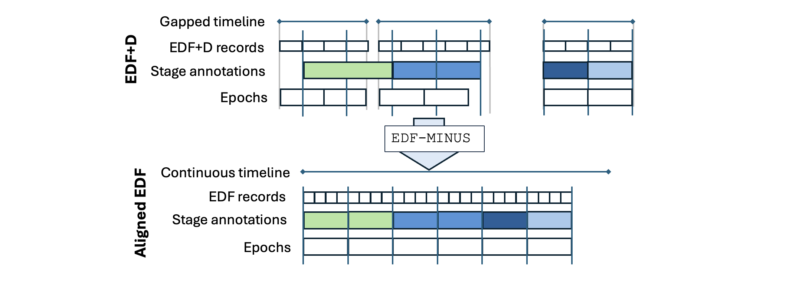
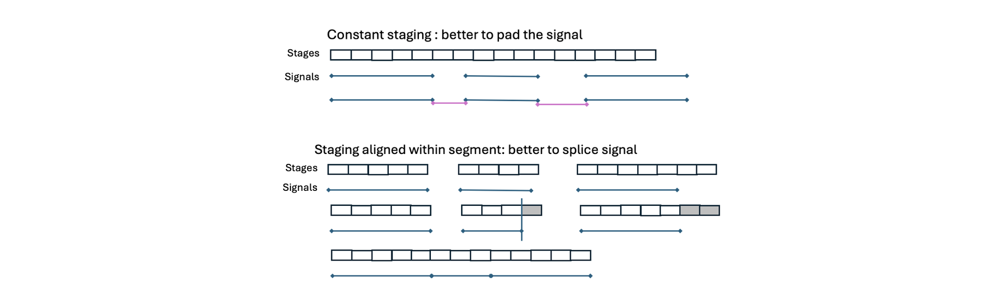

# Manipulations

_Commands to alter basic properties of the EDF and the signals therein_

This page covers a broad set of commands for modifying signals and EDF properties in memory. Channel management commands ([`SIGNALS`](manipulations.md#signals), [`RENAME`](manipulations.md#rename), [`COPY`](manipulations.md#copy)) control which channels are present and how they are labelled. Unit and amplitude commands ([`uV`](manipulations.md#uv), [`mV`](manipulations.md#mv), [`REFERENCE`](manipulations.md#reference), [`FLIP`](manipulations.md#flip), [`ZC`](manipulations.md#zc), [`ROBUST-NORM`](manipulations.md#robust-norm), [`ROLLING-NORM`](manipulations.md#rolling-norm), [`CLIP`](manipulations.md#clip), [`SCALE`](manipulations.md#scale), [`LOG`](manipulations.md#log), [`RECTIFY`](manipulations.md#rectify)) adjust signal values. Timing and structural commands ([`RESAMPLE`](manipulations.md#resample), [`RECORD-SIZE`](manipulations.md#record-size), [`EDF-MINUS`](manipulations.md#edf-minus)) modify sample rates and EDF record layout. Header and metadata commands ([`ANON`](manipulations.md#anon), [`SET-HEADERS`](manipulations.md#set-headers), [`SET-VAR`](manipulations.md#set-var), [`SET-TIMESTAMPS`](manipulations.md#set-timestamps)) update EDF header fields and Luna variables. These tools are typically used to clean and standardize EDFs before running analytical commands.

| Command | Description |
| -----  | ----- | 
|[`SIGNALS`](#signals) | Retain/remove specific EDF channels |
|[`RENAME`](#rename) | Rename channels |
|[`COPY`](#copy) | Duplicate one or more EDF channels |
|[`RESAMPLE`](#resample) | Resample signal(s) | 
|[`ENFORCE-SR`](#enforce-sr) | Require a particular sample rate |
|[`REFERENCE`](#reference) | Re-reference signals |
|[`DEREFERENCE`](#dereference) | De-reference signals |
|[`MINMAX`](#minmax) | Set digital/physical min/max across channels |
|[`uV`](#uv) | Rescale units to uV |
|[`mV`](#mv) | Rescale units to mV |
|[`FLIP`](#flip) | Flip polarity of signal | 
|[`ZC`](#zc) | Mean-center signal |
|[`ROBUST-NORM`](#robust-norm) | Robust normalization |
|[`CLIP`](#clip) | Clip a signal using absolute or relative thresholds |
|[`COMBINE`](#combine) | Combine two or more channels into a new channel (e.g. sum/mean) | 
|[`SCALE`](#scale) | Rescale a channel (min/max scaling) |
|[`LOG`](#log) | Apply a log transform to one or more signals |
|[`ROLLING-NORM`](#rolling-norm) | Rolling-window normalization |
|[`SHIFT`](#shift) | Shift a signal |
|[`SCRAMBLE`](#scramble) | Scramble a signal |
|[`TIME-TRACK`](#time-track) | Add a time-track to an EDF |
|[`RECORD-SIZE`](#record-size) | Change EDF record size |
|[`EDF-MINUS`](#edf-minus) | Realign EDF records, annotations and epochs |
|[`INSERT`](#insert) | Align and splice signals from a secondary EDF, with clock-drift estimation |
|[`ANON`](#anon)    | Strip ID information from EDF header |
|[`SET-HEADERS`](#set-headers) | Directly specify certain EDF headers |
|[`SET-VAR`](#set-var) | Directly specify Luna variables |
|[`SET-TIMESTAMPS`](#set-timestamps) | Directly specify EDF record timestamps |
|[`RECTIFY`](#rectify) | Rectify a signal |
|[`REVERSE`](#reverse) | Reverse a signal |
|[`MOVING-AVERAGE`](#moving-average) | Moving average (or median) of a signal | 

<!--- remove this old command now we have EDF-MINUS --->
<!--- |[`ALIGN`](#align) | Realign EDF records, annotations and epochs | --->


## SIGNALS

The command requires one of two options: _either_ `keep` _or_ `drop`.
Each expects a comma-delimited list of channel names (or
[_aliases_](../luna/args.md#aliases)), which are either retained or
removed from the in-memory dataset.

<h3>Methods</h3>

Specified channels are selectively retained or removed from the in-memory recording, reducing the dataset to only those signals required for subsequent analysis steps.

<h3>Parameters</h3>

| Option | Example | Description | 
| ---- | ----- | ----- | 
| `drop` | `drop=EMG,ECG`  | Drop channels `EMG` and `ECG` |
| `keep` | `keep=C3,C4` | Drop all channels _except_ `C3` and `C4` |

<h3>Outputs</h3>

Other than modifying the _in-memory_ representation of the EDF, there
is no further output (except some notes written to the log).

<h3>Example</h3>

For an EDF with 6 signals, including `EMG`, `EOG-L` and `EOG-R`, this command would drop these three signals:

```		
luna s.lst -s 'SIGNALS drop=EMG,EOG-L,EOG-R & DESC'
```
as shown by the relevant lines in the output from [`DESC`](summaries.md#desc):
```
Number of signals : 3
Signals           : EEG1[256] EEG2[256] EEG3[256]
```
In contrast, the `keep` option with the same arguments: 
```
luna s.lst -s 'SIGNALS keep=EMG,EOG-L,EOG-R & DESC'
```
yields the expected output:
```
Number of signals : 3
Signals           : EOG-L[256] EOG-R[256] EMG[256]
```

## RENAME

_Renames channels_

This command can rename channels within the context of evaluating a
Luna script.  In this way, it differs from using signal
[aliases](../luna/args.md#aliases) (which can only be specified when
first initiating Luna, and will be fixed for all individuals), as this
command can use [variables](../luna/args.md#variables) (which may be
[individual-specific](../luna/args.md#individual-variables)).

It is also possible to supply a `file` of new labels for multiple signals instead.

<h3>Methods</h3>

Channel labels are reassigned within the in-memory representation of the recording, allowing recording-specific naming conventions to be mapped to a standardized nomenclature. Unlike static pre-processing aliases, relabelling at this stage allows individual-specific label assignments to be applied dynamically within a processing script.

<h3>Parameters</h3>

| Parameter | Example | Description |
| --- | --- | --- |
| `sig` | `C3,C4` | List of channels to duplicate |
| `new` | `C3_LM,C4_LM` | List of new labels (same size as `sig`) |
| `file` | `f.txt` | File of old/new labels | 

Note that you cannot use an existing channel label as a `new` label.

If specifying a file, such files should be tab-delimited, containing exactly
two fields per row (original label as per `sig`)
and the new value as per `new`).


<h3>Output</h3>

No formal output, other than changing the labels of channels in the internal EDF

<h3>Example</h3>

In its simplest form, if we have a channel named `THOR_RES`, for
example, we can rename it to some other label -- here just using `XX` --
using [`RENAME`](manipulations.md#rename), and then use that new label in other commands:

```
luna s.lst -s ' RENAME sig=THOR_RES new=XX & STATS sig=XX '
```

Note that this also adds an alias internally, so that `THOR_RES` can
still be used as a label (e.g. with the `sig` option of a command),
but the output will be labelled with the primary term `XX`.

As noted above, this provides similar functionality as using a signal
[alias](../luna/args.md#aliases):

```
luna s.lst "alias=XX|THOR_RES" -s ' STATS sig=XX '
```

The primary difference is that [`RENAME`](manipulations.md#rename) accepts (individual-specific)
variables as arguments, i.e. which can allow different individuals to
have different assignments (with `sig` and/or `new`).  For example, in
this toy example, we change `THOR_RES` and `ABDO_RES` (all present in
the three individuals in the [tutorial dataset](../tut/tut1.md)) to
different labels.  If we have a tab-delimited file that defines these
variables for each individual:

```
cat ch.txt
```
```
ID	CHS
nsrr01	XX,YY
nsrr02	AA,BB
nsrr03	CC,DD
```

Now, the command
```
luna s.lst vars=ch.txt \
     -s ' DESC & RENAME sig=THOR_RES,ABDO_RES new=${CHS} & DESC ' 

```

will use [`RENAME`](manipulations.md#rename) to swap those two channels to the other specified
values: e.g. showing extracts from the [`DESC`](summaries.md#desc) output for the three
individuals: in all cases, the first [`DESC`](summaries.md#desc) command gives the same:

```
Signals : SaO2[1] PR[1] EEG_sec_[125] ECG[250] EMG[125] EOG_L_[50]
          EOG_R_[50] EEG[125] AIRFLOW[10] THOR_RES[10] ABDO_RES[10] POSITION[1]
          LIGHT[1] OX_STAT[1]
```
whereas the second [`DESC`](summaries.md#desc) varies between the three individuals as expected:
```
Signals : SaO2[1] PR[1] EEG_sec_[125] ECG[250] EMG[125] EOG_L_[50]
          EOG_R_[50] EEG[125] AIRFLOW[10] XX[10] YY[10] POSITION[1]
          LIGHT[1] OX_STAT[1]
```

```
Signals  : SaO2[1] PR[1] EEG_sec_[125] ECG[250] EMG[125] EOG_L_[50]
           EOG_R_[50] EEG[125] AIRFLOW[10] AA[10] BB[10] POSITION[1]
           LIGHT[1] OX_STAT[1]
```
and
```
Signal   : SaO2[1] PR[1] EEG_sec_[125] ECG[250] EMG[125] EOG_L_[50]
           EOG_R_[50] EEG[125] AIRFLOW[10] CC[10] DD[10] POSITION[1]
           LIGHT[1] OX_STAT[1]
```

Another difference is that using signal aliases allows a many-to-one
mapping, whereas [`RENAME`](manipulations.md#rename) requires a one-to-one mapping of
labels. That is, `"alias=XX|AA|BB|CC"` will map either `AA`, `BB` or
[`CC`](cc.md#cc) to `XX` (i.e. where an individual EDF may have none, one or
multiple of these labels).  In contrast, [`RENAME`](manipulations.md#rename) must use the single,
primary label in the `sig` option.   However, there is nothing stopping
combined use of signal aliases and the [`RENAME`](manipulations.md#rename) command, i.e. to achieve a many-to-many
mapping of labels: e.g. 

```
luna s.lst vars=ch.txt "alias=XX|AA|BB|CC" \
     -s ' RENAME sig=XX new=${CHS} & WRITE edf-dir=edfs/ ' 
```

This effectively uses `XX` as an intermediate (mapped from _either_ `AA`, `BB` or [`CC`](cc.md#cc)) and will then write to
the new EDF a label as defined in `ch.txt`.   Of course, an alternative would be to also supply individual-specific
labels for both `sig` and `new` in the `vars.txt` file, e.g. if it had two columns defining `OLD` and `NEW` variables/columns:
```
luna s.lst vars=ch.txt \
     -s ' RENAME sig=${OLD} new=${NEW} & WRITE edf-dir=edfs/ '	
```


## ROLLING-NORM

_Normalize a signal using a rolling local window_

`ROLLING-NORM` applies a rolling-window normalization to one or more signals
across the whole retained trace. The command uses a local window around each
sample to compute a mean and standard deviation, then rescales the central
sample to a local z-score. This can be useful when a signal has slow drift or
time-varying scale that is not well handled by a single whole-trace
normalization.

<h3>Methods</h3>

For each requested signal, Luna reads the whole retained trace and computes a
locally normalized version using a symmetric rolling window of width `w`
seconds. Internally, the window size is converted to samples using the signal's
sample rate and forced to an odd number. At each sample, the central value is
standardized relative to the samples in that local window, producing a
time-varying z-score. The normalized trace replaces the original in-memory
signal.

<h3>Parameters</h3>

| Parameter | Example | Description |
| --- | --- | --- |
| `sig` | `sig=C3,C4` | Signals to normalize |
| `w` | `w=30` | Rolling window width in seconds; must be at least 1 second |

<h3>Output</h3>

No formal tabular output. The command updates the in-memory signal values.

<h3>Example</h3>

```bash
luna s.lst -s 'ROLLING-NORM sig=EEG w=30'
```


## COPY

_Duplicates one or more EDF channels_

Because some Luna commands modify a channel
(e.g. [`FILTER`](fir-filters.md#filter)), it can be desirable to first
make a copy of the original channel.  New channels are written out
with the [`WRITE`](outputs.md#write) command.

Although multiple signals can be duplicated at the same time
(i.e. will all be given the same tag), only data channels (i.e. not
EDF Annotation channels in EDF+) are duplicated.

<h3>Methods</h3>

One or more channels are duplicated within the in-memory recording, preserving the original signal while allowing subsequent processing steps (such as filtering or normalization) to be applied to the copy without altering the source channel.

<h3>Parameters</h3>

| Parameter | Example | Description | 
| --- | --- | --- | 
| `sig` | `sig=C3,C4` | List of channels to duplicate |
| `tag` | `tag=DELTA` | A required option, this is added to make the new channel name, e.g. `C3` becomes `C3_DELTA` | 

<h3>Output</h3>

One or more new channels are created in the _in-memory_ representation
of the EDF.  Aside from a note in the log, there is no formal
(destrat-based) output for this command.

<h3>Example</h3>

To extract one channel (`EEG`) from an original EDF, and then duplicate it:

```
luna s.lst 2 sig=EEG -s 'DESC & COPY sig=EEG tag=V2 & DESC'
```

As expected, the first [`DESC`](summaries.md#desc) output shows a single channel:
```
EDF filename      : edfs/learn-nsrr02.edf
ID                : nsrr02
Clock time        : 21:18:06 - 07:15:36
Duration          : 09:57:30
# signals         : 1
Signals           : EEG[125]
```

After the [`COPY`](manipulations.md#copy) command has been executed, there are now two channels: `EEG` and `EEG_V2`:
```
EDF filename      : edfs/learn-nsrr02.edf
ID                : nsrr02
Clock time        : 21:18:06 - 07:15:36
Duration          : 09:57:30
# signals         : 2
Signals           : EEG[125] EEG_V2[125]
```


## RESAMPLE

_Changes the sampling rate of a signal_

Uses functions from `libsamplerate` to upsample or downsample signals.
Within a maximum upsampling/downsampling factor of 256, there are no
constraints on the new sample rate (i.e. the ratio of old and new
sample rates need not be a rational number).

The `downsample` and `upsample-if` options can be used to control whether a channel is resampled:

 - `downsample` means that channels will only ever be downsampled, otherwise left _as is_

 - `upsample-if=50` means that channels will only be resampled (up or down) if the rate is above, e.g. 50 Hz.  This option can
 avoid "garbage channels" (e.g. a channel labelled as an EEG but with a sample rate of 10 Hz, for example) being included.

<h3>Methods</h3>

Signals are resampled to a common target rate using a high-quality sinc-interpolation algorithm (via the Secret Rabbit Code / libsamplerate library). The approach supports arbitrary rational and irrational resampling ratios, applying anti-aliasing lowpass filtering prior to downsampling and sinc-based interpolation for upsampling, thereby minimising aliasing and interpolation artefacts. Channels can be selectively downsampled only (leaving channels already at or below the target rate unmodified) or restricted to those above a minimum rate threshold to prevent unintended resampling of low-rate auxiliary channels.

<h3>Parameters</h3>

| Parameter | Example | Description | 
| --- | --- | --- | 
| `sig` | `sig=C3,C4` | Signal list |
| `sr` | `sr=128` | New sampling rate (Hz) | 
| `downsample` | | Only channels with rates _above_ `sr` will be downsampled
| `upsample-if` | `upsample-if=100` | Only resample if the original sample rate is greater than this value | 


<h3>Output</h3>

No output other than a message to the log (and altering the in-memory
signal).

<h3>Example</h3>

To create a new EDF with the `EEG` channel resampled to 100 Hz:

```
luna s.lst -s 'RESAMPLE sig=EEG sr=100 & WRITE edf-tag=resample edf-dir=edfs/ sample-list=s2.lst'
```

## ENFORCE-SR

_Drop signals that do not conform to a given EDF record size, or min/max sample rate_

To enable clean EDF record-size conversion, this command first drops
any signals which would not be able to be represented by an _N_-second
record size. For example, a signal with a sample rate of 125 Hz cannot
be represented in the EDF block/record structure if each block is only
0.5 seconds.  Such signals will be dropped (based on `dur`) from the
internal EDF representation. This command can be used prior to a
`RECORD-SIZE` command.

Further, this command can optionally drop signals with a sample rate
below or above a given range (using `sr`).

<h3>Methods</h3>

Channels that cannot be represented at the target EDF record duration (because their sample count per record would not be an integer) are dropped from the in-memory recording prior to any record-size restructuring. Optionally, channels outside a specified sample-rate range are also removed, preventing inadvertent inclusion of auxiliary low-rate channels in downstream analyses.

<h3>Parameters</h3>

| Parameter | Example | Description |
| --- | --- | --- |
| `dur` | `dur=1` | Proposed EDF record size (seconds), which may differ from the current value |
| `sr` | `sr=100,200` | Optionally, drop signals with rates below 100 Hz or above 200 Hz |


<h3>Output</h3>

No output other than a message to the log (and altering the in-memory
signal).


## REFERENCE

_Re-references signals with respect to one or more other signals_

<h3>Methods</h3>

EEG signals are re-referenced by subtracting a reference signal (or the average of multiple reference signals) from each target channel. When a single reference channel is specified, this corresponds to a bipolar or linked-electrode reference; when multiple reference channels are provided, their arithmetic mean is subtracted, approximating a linked-mastoid or common-average-like reference restricted to the specified electrodes. A pairwise referencing mode applies distinct reference channels to corresponding target channels rather than averaging across all references. Optionally, all channels can be first resampled to a common rate before referencing to ensure sample-by-sample alignment.

<h3>Parameters</h3>

| Parameter | Example | Description | 
| --- | --- | --- |
| `sig` | `sig=C3,C4` | Signal(s) to re-reference | 
| `ref` | `ref=A1,A2` | Signal(s) to provide the reference | 
| `pairwise` | | Perform pairwise re-referencing between `sig` and `ref` (see below) |
| `new` | `new=C3_LM` | Generate a new channel instead of altering `sig` | 
| `sr` | `sr=128` | Resample all channels first to this sample rate |

Both `sig` and `ref` are required parameters. If more than one
channel is given as the reference (in a comma-delimited list), the
average of those channels is used as the reference value.  Alternatively, if the `pairwise`
option is also specified, then `sig` and `ref` should be of the same length.  In this case,
rather than average multiple `ref` channels, the command would do a pairwise referencing:

Given the above `sig` and `ref` values in the table above: without the `pairwise` option, the
two channels would be calculated as:
```
  -->  C3 - (A1+A2)/2
       C4 - (A1+A2)/2
```
With `pairwise`:
```
  ---> C3 - A1
       C4 - A2
```

If using `new`, only a single channel can be re-referenced.

<h3>Output</h3>

No output, other than a note to the log.  In memory, the updated
`sig` channels will contain the re-referenced values.

## DEREFERENCE

_De-references signals with respect to one or more other signals_

This command is a mirror of [`REFERENCE`](manipulations.md#reference): instead of subtracting another reference signal, this simply adds it back in, i.e.
effectively removing an existing reference.  The options (`new`, `pairwise`, `sr`, `sig` and `ref`) are otherwise similar,
see above for details.

<h3>Methods</h3>

A previously applied reference is reversed by adding back the reference signal to the target channel, recovering an approximation to the original unreferenced signal. This is the arithmetic inverse of the re-referencing operation.


## MINMAX

Set digital and physical minimum and maximum values in the EDF header
to be equal across multiple channels.  This can be necessary to enable
other software to be able to work with an EDF, by making it better
conform to the EDF specification.  Signals specified here must be
comparable, e.g. all EEG and EOG with a common amplifier and ADC, and
so are expected to have similar scaling and sensitivity (unit/bit) in
the EDF.

<h3>Methods</h3>

The physical minimum and maximum values in the EDF header are harmonized across a set of comparable channels by setting all channels to the common extremes of the group. This operation adjusts the scaling factor (sensitivity, in units per bit) uniformly, ensuring consistent amplitude representation and EDF-specification compliance without altering the underlying signal values.

<h3>Parameters</h3>

| Parameter | Example | Description |
| --- | --- | --- |
| `sig` | `sig=C3,C4` | Signals (two or more) to set group min/max values |


<h3>Output</h3>

No formal output is given. The channels are rescaled internally.  Any
subsequent commands (i.e. including [`WRITE`](outputs.md#write) to write a new EDF) will
therefore be based on these new header values.

<h3>Example</h3>

Here we have an EDF with channels C3, C4, F3, F4, O1, O2, A1 and A2. The [`HEADERS`](summaries.md#headers)
command shows that the channels have different physical min/max values, and therefore
different `SENS` values (scaling of micro-volts per bit in the EDF):

```
luna id01.edf -o out.db -s HEADERS
```
```
destrat out.db +HEADERS -r CH
```
```
ID        CH  DMAX   DMIN    PDIM  PMAX    PMIN     SENS    SR   TYPE
id01.edf  F3  32767  -32768  uV    1574.8  -3276.8  0.07403 500  EEG
id01.edf  F4  32767  -32768  uV    1720.9  -3276.8  0.07626 500  EEG
id01.edf  C3  32767  -32768  uV    3276.7  -3276.8  0.1     500  EEG
id01.edf  C4  32767  -32768  uV    2034.5  -3276.8  0.08104 500  EEG
id01.edf  O1  32767  -32768  uV    3276.7  -3276.8  0.1     500  EEG
id01.edf  O2  32767  -32768  uV    3276.7  -3276.8  0.1     500  EEG
id01.edf  A1  32767  -32768  uV    3238.6  -3276.8  0.09941 500  EEG
id01.edf  A2  32767  -32768  uV    3255.3  -3276.8  0.09967 500  EEG
```

After running the [`MINMAX`](manipulations.md#minmax) command, we see that the `SENS` values are now
set to be equal across all channels.  This command will not fundamentally
change the underlying signal data, only the scaling in the EDF header.

```
luna id01.edf -o out.db -s 'MINMAX & HEADERS'
```
```
ID        CH  DMAX   DMIN    PDIM  PMAX    PMIN     SENS  SR   TYPE
id01.edf  F3  32767  -32768  uV    3276.7  -3276.8  0.1   500  EEG
id01.edf  F4  32767  -32768  uV    3276.7  -3276.8  0.1   500  EEG
id01.edf  C3  32767  -32768  uV    3276.7  -3276.8  0.1   500  EEG
id01.edf  C4  32767  -32768  uV    3276.7  -3276.8  0.1   500  EEG
id01.edf  O1  32767  -32768  uV    3276.7  -3276.8  0.1   500  EEG
id01.edf  O2  32767  -32768  uV    3276.7  -3276.8  0.1   500  EEG
id01.edf  A1  32767  -32768  uV    3276.7  -3276.8  0.1   500  EEG
id01.edf  A2  32767  -32768  uV    3276.7  -3276.8  0.1   500  EEG
```

Note, if the EDF contained other signals that you did not want
included in the [`MINMAX`](manipulations.md#minmax) procedure (e.g. respiratory channels, which
have different scaling from EEG channels), you would need to add `sig`
after [`MINMAX`](manipulations.md#minmax) to specify, e.g. only the EEG channels.  This command
will skip any EDF+ Annotation channels automatically.


## uV 

_Converts a signal to uV units_ 

Checks the `unit` (physical dimension) field of the EDF header for either `V`, [`mV`](manipulations.md#mv) or [`uV`](manipulations.md#uv)
and rescales the signal appropriately.  If the header specifies some
other unit, or none, then no action is taken.

<h3>Methods</h3>

Signal amplitudes are converted to microvolts by reading the physical dimension field of the EDF header and applying the appropriate multiplicative scaling factor (×1,000 from mV, or ×1,000,000 from V). If the header dimension is already µV, or is unrecognized, no rescaling is applied.

<h3>Parameters</h3>

| Parameter | Example | Description | 
| --- | --- | --- |
| `sig` | `sig=C3,C4` | Signal(s) to convert |

If `sig` is not specified, this command is applied to all channels.

<h3>Output</h3>

No output, other than updating the in-memory signal.


## mV

_Converts a signal to mV units_ 

Checks the `unit` (physical dimension) field of the EDF header for either `V`, [`mV`](manipulations.md#mv) or [`uV`](manipulations.md#uv)
and rescales the signal appropriately.  If the header specifies some
other unit, or none, then no action is taken.

<h3>Methods</h3>

Signal amplitudes are converted to millivolts by reading the physical dimension field of the EDF header and applying the appropriate multiplicative scaling factor (÷1,000 from µV, or ×1,000 from V). If the header dimension is already mV, or is unrecognized, no rescaling is applied.

<h3>Parameters</h3>

| Parameter | Example | Description | 
| --- | --- | --- |
| `sig` | `sig=C3,C4` | Signal(s) to convert |

If `sig` is not specified, this command is applied to all channels.

<h3>Output</h3>

No output, other than updating the in-memory signal.

## TIME-TRACK

_Adds a time-track, which implicitly converts an EDF into an EDF+_

This command is only used internally, currently.  

<h3>Methods</h3>

The `TIME-TRACK` command converts a standard EDF to EDF+C format by appending an `EDF Annotations` channel that encodes the onset time of each record as a Time-stamped Annotation List (TAL). If the in-memory EDF is not already marked as EDF+, the header reserved field is updated accordingly and the file is declared continuous (`EDF+C`). A new annotation signal channel is then inserted at the end of each record, with a fixed width (controlled by `globals::edf_timetrack_size`), containing a TAL entry of the form `+<onset>\x14\x14\x00` where `<onset>` is the elapsed time in seconds from the EDF start. For continuous recordings this offset is computed incrementally as a multiple of the record duration; for discontinuous (EDF+D) recordings produced by a merge operation, per-record timestamps are provided explicitly. The channel is labelled `EDF Annotations` (or `EDF Annotations1`, `EDF Annotations2`, etc. if annotation channels already exist), with nominal digital range −32768 to 32767 and scaling fields set to unity, as required by the EDF+ specification.


## FLIP

_Flips the polarity of a signal_ 

Multiplies every sample value of a signal by -1.

<h3>Methods</h3>

Signal polarity is inverted by multiplying all sample values by −1, correcting for inadvertent polarity reversals introduced during recording or electrode placement.

<h3>Parameters</h3>

| Parameter | Example | Description |
| --- | --- | --- |
| `sig` | `sig=C3,C4` | Signals to flip |

<h3>Output</h3>

No output, other than a message to the log and an updated in-memory signal.

<h3>Example</h3>

This next command takes the first 10 epochs of the `C3` signal,
outputs the original signal to a file (`f1`), then flips the signal,
and re-outputs it (to `f2`): 


```
luna me.lst sig=C3 -s 'EPOCH & MASK epoch=1-10 & \
                       RESTRUCTURE & MATRIX file=f1 & \
                       FLIP & MATRIX file=f2'
```

!!! note
    In the above, we used the end-of-line `\` character (with no trailing whitespace) 
    to continue the command on multiple lines, as many shells allow.

Comparing the original signals (looking at just the first 10 rows of output) ...

```
head f1
```
```
ID       E   S   SP T             C3
id001    1   0   0  0             3.43407
id001    1   0   1  0.00390625    2.06044
id001    1   0   2  0.0078125    -0.0763126
id001    1   0   3  0.0117188    -1.60256
id001    1   0   4  0.015625     -2.21306
id001    1   0   5  0.0195312    -2.21306
id001    1   0   6  0.0234375    -2.21306
id001    1   0   7  0.0273438    -2.06044
id001    1   0   8  0.03125      -2.06044
```

... to the new signals, we see the values have been flipped, albeit
not as exactly as one might expect.  (This is due to the encoding
used by EDFs; see the note below for more details).


```
head f2
```
```
ID       E   S   SP T             C3
id001    1   0   0  0            -3.43865
id001    1   0   1  0.00390625   -2.06244
id001    1   0   2  0.0078125     0.0728122
id001    1   0   3  0.0117188     1.59799
id001    1   0   4  0.015625      2.20806
id001    1   0   5  0.0195312     2.20806
id001    1   0   6  0.0234375     2.20806
id001    1   0   7  0.0273438     2.05909
id001    1   0   8  0.03125       2.05909
```

!!! warn "Floating point accuracy" 
    EDFs store data as 2-byte
    integers: in contrast, floating point numbers as used
    in Luna typically take up 4 or 8 bytes in memory.  This relatively
    low resolution of EDF introduces slight numerical differences so
    that the values are clearly different from -1 times the original:
    i.e. `3.43407` is not minus `-3.43865`.  As noted in the EDF spec,
    practically this limit on resolution is not a real issue for most
    biosignals, if they are recorded with sensible physical and
    digital min/max values to reflect the dynamic range of the signal.


## ZC

_Mean-center a signal_

Subtracts the mean from a signal, either based on the entire duration or performed epoch-by-epoch.  The latter may
be more appropriate if there are large changes in the scale/mean of the signal across the recording.

<h3>Methods</h3>

Signals are mean-centered by subtracting either the whole-recording mean or, when epoch-wise centering is requested, the within-epoch mean from each sample. Epoch-wise centering removes slowly drifting DC offsets that vary across the night and may otherwise bias spectral or amplitude-based analyses.

<h3>Parameters</h3>

| Parameter | Example | Description |
| --- | --- | --- |
| `sig` | `C3,C4` | Signals to flip |
| `epoch` |  | Perform mean-centering epoch-by-epoch |

<h3>Output</h3>

No output, other than a message to the log and an updated in-memory signal.

<h3>Example</h3>

Consider the `SpO2` signal, 
```
luna s.lst -s 'STATS sig=SpO2'
```
which has a mean as follows:
```
MEAN   94.1955
```

First adding the [`ZC`](manipulations.md#zc) command: 
```
luna s.lst -s 'ZC sig=SpO2 & STATS sig=SpO2'
```
we now see the mean is (effectively) zero:
```
MEAN   -0.000734802
```

Note that, due to EDF's 16-bit floating-point accuracy, the mean will
not be numerically exactly 0.00 (i.e. as internally, the signal is
written back to the internal, in-memory EDF at the end of the [`ZC`](manipulations.md#zc)
command, before being re-read by [`STATS`](summaries.md#stats)).


## ROBUST-NORM 

_Standardizes a signal using a robust approach_

Normalizes a signal, using as measures of central tendency and spread
the median and an estimate of the SD based on the inter-quartile range
( 0.7413 times _IQR_ ).  Additionally, this command can winsorize a
signal (and optionally re-normalize after winsorization, to ensure
(non-robust) mean/SD of 0/1).  This can be performed either on the whole signal, or
epoch-by-epoch.

<h3>Methods</h3>

Signals are standardized using a robust normalization procedure that subtracts the median and divides by a robust estimate of the standard deviation derived from the interquartile range (IQR × 0.7413, which equals the SD for a normal distribution). Because this approach uses rank-based statistics, it is resistant to the influence of extreme values and non-Gaussian tails that are common in physiological signals. Optionally, signal values beyond specified percentile thresholds can be winsorized (clipped to those quantile boundaries) prior to normalization, further limiting the influence of outliers. A second normalization pass may subsequently be applied to the winsorized signal to yield a distribution with mean 0 and SD 1. Normalization can be performed either across the whole signal or independently within each epoch, the latter being appropriate when the signal's scale changes systematically across the recording.

<h3>Parameters</h3>

| Parameter | Example | Description |
| --- | --- | --- |
| `sig` | `C3,C4` | Signals to flip |
| `epoch` |  | Perform mean-centering epoch-by-epoch |
| `center` | 'F' | Perform median-centering (default: true ) |
| `scale` | 'F' | Perform rescaling (default: true ) |
| `winsor` | 0.05 | Winsorize the signal, e.g at 5th percentile (default: none) |  
| `second-norm` | | Perform a second round of normalization after winsorization (default: no) | 

<h3>Output</h3>

No output, other than a message to the log and an updated in-memory signal.

<h3>Example</h3>

Consider the `SpO2` signal, 
```
luna s.lst -s 'STATS sig=SpO2'
```
which has a mean as follows:
```
MEAN   94.1955
```
and is also very highly skewed:
```
SKEW   -8.02593
```

If, for some reason, one wanted to normalize this measure, we can use `ROBUST-NORM`, also adding `winsor=0.05` to
winsorize the signal at the 5th (and 95th) percentiles:

```
luna s.lst -s 'ROBUST-NORM sig=SpO2 winsor=0.05 & STATS sig=SpO2'
```

From the subsequent [`STATS`](summaries.md#stats) output, we can see the mean and SD are closer to 0 and 1 respectively, and (due to the winsorization), the
signal is also much less skewed:
```
MEAN    -0.80652
SKEW    -0.4575
SD      2.05714
```
Here, the mean and SD are still quite different from 0 and 1 - which naturally reflects the fact that we used robust measures of central tendency and spread (median and IQR-based estimate of the SD) rather than the typical mean and SD.  If we look at the percentiles from the [`STATS`](summaries.md#stats) command, we see the median (`P50`) is effectively 0 (save for numerical rounding):
```
P01	-5.39593
P02	-5.39593
P05	-5.39593
P10	-4.04687
P20	-2.69795
P30	-1.3489
P40	-1.3489
P50	-9.67455e-05
P60	-9.67455e-05
P70	-9.67455e-05
P80	1.48381
P90	1.48381
P95	2.83286
P98	2.83286
P99	2.83286
```
This also shows the impact of winsorization, e.g. `P01`, `P02` and `P05` are all identical now. 

If for some reason it is important to further rescale the signal to have mean and SD of 0 and 1 more precisely, then add the option `second-norm` to `ROBUST-NORM`.  This results in the following mean and SD: 
```
MEAN   -5.44263e-06
SD     0.999983
```

## SCALE

_Rescale (and/or clip) a channel based on min-max ranges_

If `clip-min` and/or `clip-max` is set, the signal will be clipped/winsorized at these thresholds (e.g. values
beyond those thresholds will be set to those values).

Additionally, if `min-max` is set to specify a lower/upper bound, the
scale will be rescaled to set the min/max at those values.

<h3>Methods</h3>

Signals are linearly rescaled to a specified output range by applying a min–max normalization. Optionally, values beyond specified lower and/or upper bounds are first clipped (winsorized) to those boundary values before rescaling, preventing extreme outliers from dominating the rescaled range.

<h3>Parameters</h3>

|  Parameter | Example | Description |
| --- | --- | --- |
| `min-max` | 0,100 | Lower and upper bounds |
| `clip-min` | 0 | Lower bound to clip (on original scale) |
| `clip-max` | 1 | Upper bound to clip (on original scale) |

<h3>Output</h3>

No output other than changing signals in the internal EDF.

<h3>Example</h3>

The following assumes a signal (e.g. oxygen saturation) that is scored on a 0 - 1 scale, but contains
outliers (below 0, or above 1, e.g. due to resampling or other artifact).   The command below first
clips at 0 and 1; it then rescales to a percent (0-100) rather than a proportion (0-1) scale:

```
luna s.lst -s ' SCALE sig=oxy clip-min=0 clip-max=1 min-max=0,100 '
```

Typically a [`SCALE`](manipulations.md#scale) command will be paired with subsequent analyses,
or a [`WRITE`](outputs.md#write) command to output a new EDF.  (i.e. by itself the above command
would only change the in-memory EDF and then quit/move to the next EDF).


## LOG

_Apply a log transform to one or more signals_

The [`LOG`](manipulations.md#log) command applies a natural log transform to one or more signals:

```
log( x + offset )
```

This is useful when working with strongly right-skewed non-negative signals,
for example activity counts, power-like measures, or other strictly positive
derived channels.

Values below zero are clamped to zero before the transform, with a warning.

<h3>Methods</h3>

Signals are transformed in-place using the natural logarithm after the
addition of a small constant offset. This offset can be fixed explicitly,
which is often appropriate for count or activity data, or estimated from
the observed signal distribution using a low percentile, which is often more
appropriate for strictly positive continuous measures such as spectral power.

<h3>Parameters</h3>

| Parameter | Example | Description |
| --- | --- | --- |
| `sig` | `sig=activity` | One or more signals to transform |
| `offset` | `offset=1` | Fixed additive constant before taking the log |
| `eps` | `eps=0.01` | Data-driven offset: 0.1 times this percentile of the signal |

If both `offset` and `eps` are specified, `offset` takes priority.

For `eps`, Luna sets:

```
offset = 0.1 x percentile(sig, eps)
```

with a fallback to a very small constant if that percentile is zero or
non-finite.

<h3>Output</h3>

No formal output other than changing the selected signals in the
internal EDF and writing notes to the log.

<h3>Examples</h3>

Apply a standard `log(x+1)` transform to an actigraphy channel:

```
luna s.lst -s ' LOG sig=activity offset=1 '
```

Apply a percentile-based offset to a strictly positive derived signal:

```
luna s.lst -s ' LOG sig=DELTA eps=0.01 '
```


## CLIP

_Clip a signal using absolute or relative thresholds_

The [`CLIP`](manipulations.md#clip) command truncates one or more signals in the in-memory EDF
so that values outside specified bounds are clipped to those bounds.
Unlike [`SCALE`](#scale), which can optionally clip as part of a
rescaling step, [`CLIP`](manipulations.md#clip) is a standalone command intended specifically
for threshold-based clipping.

Thresholds can be specified either directly on the signal scale or via
quantiles of the observed signal distribution. This command modifies
the in-memory signal only; pair it with [`WRITE`](outputs.md#write) if
you want to save the clipped signal to a new EDF.

<h3>Methods</h3>

Signal amplitude is bounded (winsorized) by setting values below a specified lower threshold and/or above a specified upper threshold to those threshold values. Thresholds may be defined as absolute values on the native signal scale or as quantiles of the observed signal distribution, the latter providing a data-adaptive approach that automatically accommodates signals with different amplitude ranges.

<h3>Parameters</h3>

| Parameter | Example | Description |
| --- | --- | --- |
| `sig` | `sig=C3,C4` | One or more signals to clip |
| `lwr` | `lwr=-500` | Absolute lower bound |
| `upr` | `upr=500` | Absolute upper bound |
| `lwr-pct` | `lwr-pct=0.01` | Lower clipping threshold set to this percentile |
| `upr-pct` | `upr-pct=0.99` | Upper clipping threshold set to this percentile |

Percentile thresholds must lie strictly between 0 and 1.

If multiple threshold options are given, Luna applies them in the
following order for each selected signal:

1. absolute lower bound (`lwr`)
2. absolute upper bound (`upr`)
3. percentile lower bound (`lwr-pct`)
4. percentile upper bound (`upr-pct`)

<h3>Output</h3>

No formal output other than changing the selected signals in the
internal EDF and writing a note to the log.

<h3>Examples</h3>

Clip a signal to an absolute range:

```
luna s.lst -s ' CLIP sig=EMG lwr=-200 upr=200 '
```

Clip a signal based on distribution tails:

```
luna s.lst -s ' CLIP sig=C3 lwr-pct=0.01 upr-pct=0.99 '
```

As above, [`CLIP`](manipulations.md#clip) is distinct from the [`CLIP`](manipulations.md#clip) summary metric reported
by [`SIGSTATS`](summaries.md#sigstats), which quantifies the
proportion of clipped sample points rather than modifying the signal.


## COMBINE

_Combine two or more channels to create a new channel_

This command allows new channels to be created based on simple
sum/mean/median of one or more channels.

By default, this command requires that all channels requested (by `sig`) are present; an
error will be given otherwise.  This behavior can be changed by adding `allow-missing`,
which means that only the available channels are used (e.g. if only 2 of 3 found, the
sum would be based just on those two).  If no channels are available, no new
channel is created.  If only two channels are available and a median is requested, this is
automatically changed to a mean instead.

<h3>Methods</h3>

A new channel is constructed as the sample-wise sum, arithmetic mean, or median of two or more existing channels. This operation is used, for example, to create a composite respiratory effort channel, a bilateral EEG average, or to combine reference electrodes prior to referencing.

<h3>Parameters</h3>

|  Parameter | Example | Description |
| --- | --- | --- |
| `sig` | `C3,C4` | Signal list | 
| `sum` | `S1`| Make a new sum channel called `S1` |
| `mean` | `M1`| Make a new mean channel called `M1` |
| `median` | `M1` | Make a new median channel called `M1` (for 3 or more channels) |
| `allow-missing` | | If present, allow for channels in `sig` to be not present | 

Names for new channels (e.g. `S1` or `M1` above) are not allowed to exist in the EDF prior to calling [`COMBINE`](manipulations.md#combine).

<h3>Output</h3>

No output other than adding new signals to the internal EDF.

<h3>Example</h3>

To create a new channel `S` that is the sum of two channels `ABDO` and
`THOR`, for example, and then output epoch-level statistics for this
new channel:


```
luna s.lst -s ' COMBINE sum=S sig=THOR,ABDO
                STATS sig=S epoch ' 
```


## RECORD-SIZE

_Alters the record size of an EDF_

This command changes the low-level encoding of data in an EDF, which is
something that you should not normally need to change.  Often, EDFs
have a record size (i.e. the size of the _blocks_ in which the data
are stored) of 1 second or so.  Why might you want to change this?  

 - as the smallest [`EPOCH`](epochs.md#epoch) size is limited by the EDF record size, if
   the EDF record size is relatively large (e.g. 10 seconds), it will
   not be possible to specify smaller epochs (e.g. 5 seconds). 

 - if the EDF record size is very small (e.g. 100 milliseconds), this
   can reduce performance when reading the EDF from disk


There are a number of points that should be borne in mind:

 - no subsequent commands can be issued after a `RECORD-SIZE` command;
   rather, a new EDF will be written to disk

 - you should ensure that the new record size contains an integer number of samples for all signals

 - currently, you can only change the record size of EDF, not EDF+ files

 - as only whole records are written to disk, the final part of an EDF
   (that is shorter than the new record size) may be truncated

<h3>Methods</h3>

The low-level record (block) size of the EDF is changed by reorganizing samples into records of the specified duration. This operation is required when the original record size is incompatible with a desired epoch length or imposes an unnecessary read-performance penalty. The modified EDF is immediately written to disk; any trailing samples that do not fill a complete record at the new block size are discarded.

<h3>Parameters</h3>

| Parameter | Example | Description |
| --- | --- | --- |
| `dur` | `dur=1` | New EDF record/block size |
| `edf-dir` | `edf-dir=edfs/` | Folder for writing new EDFs |
| `edf-tag` | `edf-tag=rec1` | Tag added to new EDFs |
| `sample-list` | `sample-list=s2.lst` | Generate a sample-list pointing to the new EDFs |

That is, while `RECORD-SIZE` itself only takes `dur` as the single
option, one must also specify all options for
[`WRITE`](outputs.md#write), as `RECORD-SIZE` automatically triggers
[`WRITE`](outputs.md#write) after changing the record size of the in-memory
representation. (That is, as always, the original EDF file is left
untouched.)

<h3>Output</h3>

No output, other than message to the log and an updated in-memory signal.

<h3>Example</h3>

Focusing only on the signals `PR` and `EEG` in the first
[tutorial](../tut/tut1.md) EDF, we see that this EDF has a record size
of 1 second:

```
luna s.lst 1 sig=PR,EEG -s 'SUMMARY' 
```
```
# signals      : 2
# records      : 40920
Duration       : 1
```

That is, the EDF has 40,920 records, each of duration 1 second.
Looking at the two signals, because the record duration is 1 second,
this implies a sample rate of 1 Hz and 125 Hz respectively for `PR`
and `EEG`.


```
Signal 1 : [PR]
       # samples per record : 1
...
Signal 2 : [EEG]
       # samples per record : 125
...
```

To generate a new EDF (which contains only these two signals) with an
altered record size (in this example, 50 seconds):

```
luna s.lst 1 sig=PR,EEG -s 'RECORD-SIZE dur=50 edf-tag=r50' 
```

(Note that setting a 50-second record size would be unusual, this is
done here purely for illustrative purposes.)  After running this
command, you'll see the following messages in the log:

```
 saved new EDF, edfs/learn-nsrr01-r50.edf
 **warning: the PROBLEM flag was set, skipping to next EDF...
```

The warning message is expected, this is just Luna's way of ensuring
that no further commands can be run after `RECORD-SIZE` command.
Running [`SUMMARY`](summaries.md#summary) on the new EDF, we see that the record size has been
changed:

``` 
luna edfs/learn-nsrr01-r50.edf -s SUMMARY
```

```
# records      : 818
Duration       : 50
...
Signal 1 : [PR]
       # samples per record : 50
...
Signal 2 : [EEG]
       # samples per record : 6250
...
```

That is, instead of 40,920 records of 1 second we have 818 records of
50 seconds. Correspondingly, there are now 50 times the number of
samples per record compared to the original EDF (the sample rate in Hz
is obviously the same as before).

!!! note 
    Because 40,920 is not evenly divisible by 50, the last 20
    seconds has been truncated (i.e. the log will indicate a total
    duration of `11:21:40` instead of the original `11:22:00`).


<!---
## ALIGN

_Alters the EDF record structure to perfectly align records with annotations and epochs_

This is a rather specialized command to fix certain issues that can arise when working
with EDFs and epoch-defining annotations when the annotations are not "aligned" with EDF records.

Consider the following (which occurs in the NSRR National Children's Hospital dataset):

 - all EDFs start on a clock-time with an exact, integer number of seconds (i.e. EDF spec. does not allow otherwise), e.g. `23.03.07`

 - sample rate is 256 Hz for all EEG channels, and the EDF record size is 4 seconds

 - annotations that define sleep stages are all in exactly 30-second epochs, but they start at a fractional offset:
   ```   
   Stage   Onset (elapsed seconds from EDF start)
   N1 	   4110.9609375 
   N2 	   4140.9609375 
   N2 	   4170.9609375 
   ```

This means that annotations and EDF records not in exact temporal
alignment.  In theory, there is of course absolutely nothing _wrong_
per se with this.  In practice, it can make some Luna commands, or
more generally, working with EDFs (that have a fixed block size) a
little challenging.  That is, the EDF record is an atomic unit: one
must either write a whole record, or none of it, when constructing a
new EDF.  If epochs only partially span EDF records, this naturally
poses problems when thinking about how to write a new EDF that is
structured by those epochs, i.e. only NREM sleep epochs, etc.

Here we break this down three distinct issues, only the third of which
is more challenging and requires the [`ALIGN`](manipulations.md#align) command.

<h6>Offsets for EDF annotations</h6>

Specifically, when counting epochs, by default Luna starts at 0
seconds elapsed (i.e. the EDF start) and proceeds forwards: 0-30,
30-60, etc.  If sleep stages start at some different offset (other
than starting at 0 or a multiple of 30 seconds) this means that some
Luna-defined epochs may contain more than one implied stage.  For example,
consider that sleep stages start at 4 seconds past the EDF start:

```
      Elapsed seconds from EDF start:
      0000000000 1111111111 2222222222 3333333333 4444444444 5555555555 666...
      0123456789 0123456789 0123456789 0123456789 0123456789 0123456789 012...

Luna: |---epoch 1----------------------|
                                       |---epoch 2----------------------|

Actual:   |---epoch 1-(W)------------------|
                                           |---epoch 2-(N1)------------------|
```

As in the above example, the second Luna epoch (30-60) will span two
distinct annotations, which is clearly a mistake.  This means that
commands that use sleep stages will report (in this example) a missing
(`?`) annotation, as there is a conflict in that _epoch 2_ has both a
wake (`W`) and N1 (`N1`) annotation.   Luna will also flag in the log that
conflicts were found, e.g.:

```
 CMD #1: HYPNO
   options: sig=*
  set epochs to default 30 seconds, 1186 epochs
  *** found 37 epoch(s) of 1186 with conflicting spanning annotations
  *** check that epochs and annotations align as intended
  *** see EPOCH 'align' or 'offset' options
```
and write `CONF` variable to the standard output.

The solution to this is simply to supply an offset to the epoch command, which can either be done
manually:
```
luna s.lst -s 'EPOCH offset=4 & HYPNO'
```
or automatically with respect to a set of annotations (i.e. making the offset equal to the start of the first of these annotations encountered):
```
luna s.lst -s 'EPOCH align=N1,N2,N3,R,W,? & HYPNO'
```

<h6>EDF record size and epoch duration</h6>

Another issue arises when epochs may span EDF records only
partially. The core data structure (of EDF, and internally of Luna) is
a block/record based system: the underlying data must correspond to
whole records. If epochs span partial EDF records, this presents a
problem if we want to restructure the data, e.g. remove W epochs and
write a new EDF

In the above example, with an EDF record duration of 4 seconds, one
cannot straightforwardly output a new EDF on an epoch-by-epoch basis,
as for 30 second epochs), an epoch is not perfectly divisible by 4. In
Luna, this can be fixed by using the `RECORD-SIZE` command to change
the EDF record size, e.g. to 1 second say.  Now, Luna would be
outputting only whole EDF records (i.e. 30 times 1 second) rather than
having to worry about a partial record (i.e. 7 times 4 seconds, plus
an additional two seconds, which would be half an EDF record).

<h6>Fractional offsets</h6>

Finally, a more tedious issue arises if the annotations/epochs _start_ at
arbitrary, fractional time points within an EDF.  In the example above, we have, for example,
an annotation starting:
```
   N1      4110.9609375
```
In this example, with a sample rate of 256 Hz, this offset corresponds exactly to 246 (= 0.9609375 * 256 ) samples
past the start of each second.  Although one solution would be to have a very short EDF record sizes (i.e. the length of
one sample, 1/256 seconds), this may for technical reasons make data access suboptimal for many readers; further, we consider the
more general case, where the offset is not even exactly aligned with a sample point. 

The [`ALIGN`](manipulations.md#align) command attempts to handle this issue, by creating a new
EDF in which the epochs are perfectly aligned to EDF records.

One specifies a list of annotations that will define epochs: these annotations must be a) non-overlapping, and b)
an exact multiple of the EDF record size.  i.e. if we have changed the above data to have 1 second records, then we can
specify 30-second epochs.  The [`ALIGN`](manipulations.md#align) command then finds all sample points within an annotation that fits completely within the observed duration
(i.e. only ‘complete’ annotations, to skip those spans discontinuities/borders) and maps these into a new set of records
(e.g. 30 new 1 second records) for each annotation (i.e. which may be mapping fractionally across original records). The end result is a new EDF
with in which annotations, epochs & EDF records are all aligned.

To make this concrete: consider (for ease of presentation) a 5 Hz signal and an EDF record size of 1 second:

```
    RECORD   SAMPLE    TIME
    1        1         0.0
    1        2         0.2
    1        3         0.4
    1        4         0.6
    1        5         0.8

    2        1         1.0
    2        2         1.2
    2        3         1.4
    2        4         1.6
    2        5         1.8

    3        1         2.0
    3        2         2.2
    3        3         2.4
    3        4         2.6
    3        5         2.8
```

Also for simplicity of presentation, assume here we have 1 second epoch (rather than 30 seconds)

If we were to have epoch-defining annotations starting with an offset
of 0.25 seconds, (e.g. 0.25 - 1.25, 1.25 - 2.25, etc.)  The challenge
would be, for example: how to extract those epochs into a new EDF.
Naturally, this involves changing the internal structure of the EDF.

We first collect all the new data-points, making new 5-sample EDF records from the new data, starting at the first point after 0.25 seconds:

```
    RECORD   SAMPLE    TIME           NEW RECORD  SAMPLE    TIME 
    1        1         0.0      xxx
    1        2         0.2      xxx
    1        3         0.4      --->      1       1         0.0 
    1        4         0.6      --->      1       2         0.2 
    1        5         0.8      --->      1       3         0.2 
    2        1         1.0      --->      1       4         0.6
    2        2         1.2      --->      1       5         0.8

    2        3         1.4      --->      2       1         1.0
    2        4         1.6      --->      2       2         1.2
    2        5         1.8      --->      2       3         1.4
    3        1         2.0      --->      2       4         1.6
    3        2         2.2      --->      2       5         1.8
    3        3         2.4      xxx          
    3        4         2.6      xxx          
    3        5         2.8      xxx       
```

If the signal were 100 Hz, we can obviously select an exact sample
point (the 25th) in an EDF record to correspond to an offset of 0.25
seconds.  In the case of our hypothetical 5 Hz signal, as above, we
have to select the closest next signal, so there will be a slight
shift in the timings of signals.  If this matters, you can first
resample all signals to align to the new offset perfectly.

<h3>Methods</h3>

[`ALIGN`](manipulations.md#align) reconstructs the internal EDF record structure so that a specified set of annotations — which must be non-overlapping and each an exact integer multiple of the current EDF record duration — map cleanly onto record boundaries. First, every annotation interval is validated: instances that span a discontinuity in the timeline or whose duration is not a whole-number multiple of the EDF record length are silently skipped. The surviving annotation intervals are sorted and checked for pairwise non-overlap, halting with an error if any overlap is found. A new set of EDF records is then pre-allocated, one record for every EDF-record-sized slot within each accepted annotation. For each signal channel (excluding the existing time-track), a contiguous slice of digital sample values is extracted from the original record store using the annotation interval as the slice boundary; because the annotation start may fall at a fractional sample position, the nearest available sample is selected, introducing at most one inter-sample shift. Digital values (not physical values) are copied directly into the new record buffer, preserving the existing scaling and offset fields. Once all channels are copied, the record count in the EDF header is updated, the old record store is replaced, and the internal timeline maps (`tp2rec`, `rec2tp`, `rec2tp_end`) are rebuilt from the per-record onset timestamps. Because EDF start times are constrained to whole seconds, the new EDF start is rounded to the nearest preceding second and all annotation onset values are shifted by the same amount to maintain consistency; the EDF header start-time field is updated to the corresponding clock time. Finally, the file is written as an EDF+D, with a freshly generated time-track that encodes each record's onset as a TAL timestamp.

<h3>Parameters</h3>

Main arguments

| Parameter | Example | Description |
| ---- | ---- | ---- |
| `align` | `align=N1,N2,N3,R,W,?` | Annotations to align epochs by |
| `annot-out` | `annot-out=annots/^.annot` | Write (realigned) annotations | 

Other arguments as required by the [`WRITE` command](outputs.md#write)

| Parameter | Description |
| ---- |  ---- |
| `edf-tag` | New EDF tag |
| `edf-dir` | New EDF directory |


<h3>Output</h3>

The [`ALIGN`](manipulations.md#align) command forces a [`WRITE`](outputs.md#write) of the EDF; also, annotation files can be output, with the
annotations correctly altered to specify onset relative to the new EDF start.

<h3>Example</h3>

_to be added_

--->


## EDF-MINUS

_Collapsed gapped EDF+D records to standard, aligned EDFs_

EDF+D files are convenient for recording data that have gaps. However,
it can sometimes be inconvenient to analyse recordings with gaps, and
some other tools do not accept EDF+D files.  When the goal is to
convert a gapped recording and output a new EDF, the record-based
structure of EDF can be a problem: whereas gaps can be fractions of an EDF record
(e.g. often but not always 1 second), an EDF file must contain only whole records.

More generally, a standard EDF with an "ideal" structure might be as follows:

 - data in a single segment

 - one-to-one correspondence between stage annotations and epochs (units of analysis)

 - a clean mapping of EDF records to annotations: stages are a fixed
   integer number of seconds and annotations and epochs align to EDF
   record boundaries

In practice, many records (especially from clinical studies) are EDF+D with less-than-ideal properties
from the perspective of clean and convenient analysis:

 - discontinuous segments (gaps); often only a single (largest) segment of interest, but not always 

 - stage annotations not regularly aligned across the night and/or with standard epochs

 - stage annotations not aligned with EDF record boundaries

 - potentially, EDF records are of nonstandard duration (e.g. 3.92 seconds) or very long (e.g. 30 seconds)
 



In terms of _analysis_:

 - Luna naturally represents gapped EDF+ -- in fact, internally, after
   any type of markings (e.g. restriction to NREM) the data structure
   is implicitly identical to an EDF+D file
 
 - epochs (unit of analysis) can be defined to align with stage
   annotations within each segment (`EPOCH align`), even ones of
   variable duration via _generic_ epochs (`EPOCH annot`)

 - however, some analyses (e.g. summarizing hypnogram
   structures/timings) can be challenging with gapped recordings &
   incomplete annotations, or presence of variably-sized or incomplete
   epochs, however


In terms of _file (EDF) generation_:

 - when writing a new EDF, the atomic EDF record structure comes into
   play: we can only read or write _whole records_
 
 - also, some EDFs have awkward record sizes (e.g. 3.92 seconds, and in some cases may not even allow an integer number of evenly-spaced samples)

 - in PSGs containing signals of variable sampling rate, we cannot
   arbitrarily change record size (i.e. each record must contain a
   fixed, positive integer number of samples for every signal)

 - if stage annotations & record boundaries do not align, we cannot
   easily output a new EDF that excludes/includes only a given stage

 - when trying to align signals & annotations, timing difficulties arise due to EDF+ varying its specification of time:

    1) EDF start time constrained to whole seconds (hh:mm:ss), 

    2) signal segments constrained to whole record units, 

    3) no constraints on annotation start/stops, 

    4) no constraints on gap durations


Further, when Luna _masks_ a recording (by flagging _epochs_ as masked
or not), the actual transformation is at the level of EDF
_records_.  Here, records and epochs align, such that if we mask epoch 2, this
cleanly splices out records 3 and 4:

```
    Record            1--|2--|3--|4--|5--|6--|7--|8--|
    Epoch             1------|2------|3------|4-------
    Masked epochs             XXXXXXXX
    Retained records  1--|2--|        5--|6--|7--|8--|
```

In contrast, here records and epochs do not align: Luna will retain (whole) records that
have at least some unmasked signal, so here, only record 4 would be dropped: 

```
    Record            1--|2--|3--|4--|5--|6--|7--|8--|
    Epoch               1------|2------|3------|4------|
    Masked epochs               XXXXXXXX
    Retained records  1--|2--|3--|    5--|6--|7--|8--|
```

Obviously, in the context of analysis (or exporting in formats other
than EDF), it is possible to slice data at a sample-point resolution
(and, if necessary, to resample different signals to have similar
sample rates, further simplifying things).  However, if we essentially want to
retain the native EDF (record-based) properties, then it can be useful to manipulate
the EDF structure to streamline downstream analysis, which is where `EDF-MINUS` comes in.

Specifically, `EDF-MINUS` is a command to make standard EDFs with more convenient record/annotation/epoch structure:

   - sets EDF record size to a fixed 1 second 

   - selects and/or combines gapped segments (e.g. all, largest, only those w/ staging information, etc)

   - _either_ splices out gaps _or_ zero-pads to fill gaps, but also ensuring all points align with EDF record boundaries

   - optionally aligns segments to stage annotation boundaries

   - shifts all annotation start/stops as needed (i.e. if splicing out gaps) to keep annot/signal alignment

   - adds annotations to show original (gapped) structure

   - saves new EDF and annotation files

When handling gaps, there are two choices:

   - __keep timeline as is__: fill the gaps in the signal
     (zero-padding) and leave annotations as they are

   - __splice out gaps__: this "ignores" gaps, similar to simply
     reading an EDF+D as a standard EDF, _except_ here `EDF-MINUS` a)
     still aligns retained segments to record and/or epoch/staging
     boundaries, and b) alter any annotation timelines to be
     locally-consistent with the new spliced set of signals


Which strategy should you choose?   Practically, in the context of PSG/sleep data, it is usually sensible to pick what best aligns to the staging information.  If staging
is "constant" (with respect to clock-time, e.g. truly every 30 seconds), then it makes sense to keep that as is and zero-pad.    Staging is not constant across different segments (i.e. as
if each segment was scored separately), then it is better to splice out the gaps.





Obviously both these operations will _slightly_ change the signal
data.  If zero-padding, one would need to handle those regions in
downstream analysis, but `EDF-MINUS` provides an annotation to
indicate which regions are zero-padded (e.g. and can be more cleanly
extracted from analysis, as those regions will now also align with EDF
record/epoch boundaries).  In most cases, one may drop a few seconds
of signal, etc, but given that signal is (by definition) dropped in
the context of a gapped recording, it is often a reasonable trade-off
to drop a little more data to make the resulting records easier to
work with.

<h3>Methods</h3>

Discontinuous EDF+D recordings are converted to standard, contiguous EDF files using a two-stage alignment procedure. First, the desired segments are selected (e.g., only the largest segment or those containing scoring annotations), and records are realigned to standard epoch and record boundaries using a sub-sample interpolation step. Gaps between segments are handled by one of two strategies: zero-padding, which preserves the original clock-time timeline by inserting silent intervals at gap locations and annotating them accordingly; or splicing, which concatenates retained segments directly, with annotation timestamps adjusted to reflect the new local timeline. In both cases, the output is a standard EDF (without discontinuities) in which record boundaries, epoch boundaries, and staging annotations are mutually aligned, facilitating downstream analysis and compatibility with EDF-only software.

<h3>Parameters</h3>

Main arguments

| Parameter | Example | Description |
| ---- | ---- | ---- |
| `policy` | `splice` | Treatment of segments (`splice`, `zero-pad` ) |
| `segments` | 2,3,4 | Numbers of segments to keep, or `largest` (default: keep `all`) | 
| `out`    | `new1`   | Required name for new EDF/annotations | 
| `require` | `N1,N2,N3,R,W` | Only select segments with at least one of these annotations having _any_ extent of overlap | 
| `require-dur` | 30 | Require at least _N_ seconds to be spanned by required annotation(s) |
| `require-whole` | `N1,N2,N3,R,W` | Alternative to `require` but insists that segments must span _whole_ annotations |
| `align` | `N1,N2,N3,R,W` | Align & truncate segments to these annotations (i.e. stages)  | 
| `dur` | 30 | Annotation/epoch duration for alignment (e.g. assuming (multiples of) fixed 30s epochs by default) |  
| `hms` | | Output annotation files in h:m:s clock-time format (not elapsed seconds) |
| `dhms` | | Output annotation files in date+clock-time format |

The `require` options can be used to select only segments that have some extent of staging information.

Secondary arguments

| Parameter | Example | Description |
| ---- | ---- | ---- |
| `max-sr` | 1024 | Optionally, set a warning if sample rate is above this value |
| `prefix` | `edit1` | Optional prefix for new book-keeping annotations added (e.g. tracking splice-points) (default: none) | 

Note: `EDF-MINUS` applies a zero-hold filter on signals with <1 Hz
sample rate (must be 1/_N_ Hz where _N_ is an integer) to fit in
1-second EDF record

<h3>Output</h3>

The primary output is a new (standard) EDF file and optionally an annotation (`.annot`) file.

<h3>Example</h3>

Consider this example gapped EDF+D:

```
luna m.lst -s SEGMENTS
```
```
Processing: id01 [ #1 ]
 duration 06.30.59, 23459s | time 23.19.59 - 05.51.25 | date 07.04.16

 signals: 23 (of 23) selected in an EDF+D file
  F3_M2 | F4_M1 | C3_M2 | C4_M1 | O1_M2 | O2_M1 | EOG_L | EOG_R
  CHIN_1 | EKG | R_R | LEG_L | LEG_R | Snore | Airflow | PTAF
  Chest | Abdomen | SUM | SAO2 | PLETH | ETCO2 | EDF Annotations
  extracting 'EDF Annotations' track from EDF+

 annotations:
  ? (x41) | N1 (x72) | N2 (x74) | W (x593)
  edf_annot (x0) | note (x138)

```

Reviewing the location of segments: 
```
destrat out.db +SEGMENTS -r SEG -v START_HMS STOP_HMS DUR_MIN
```
```
ID    SEG   DUR_MIN   START_HMS      STOP_HMS
id01    1   96.7166   23:19:59.000   00:56:42.000
id01    2   71.7666   00:56:49.000   02:08:35.000
id01    3     82.65   02:08:42.000   03:31:21.000
id01    4   103.766   03:31:27.000   05:15:13.000
id01    5   36.0833   05:15:20.000   05:51:25.000
```

As it contains staging information, we can extract that also epoch-by-epoch:

```
luna m.lst -o out.db -s STAGE 
```
Note, some columns are omitted from the output below for clarity:
```
destrat out.db +STAGE -r E 
```
```
ID      E  CLOCK_TIME  START_SEC   STAGE
id01    1    23:19:59          0   L    
id01    2    23:20:29         30   L    
id01    3    23:20:59         60   L    
id01    4    23:21:29         90   L    
id01    5    23:21:59        120   L    
...                             
id01  194    00:56:49       5810   W    
id01  195    00:57:19       5840   W    
id01  196    00:57:49       5870   W    
id01  197    00:58:19       5900   W    
id01  198    00:58:49       5930   W    
id01  199    00:59:19       5960   W    
id01  200    00:59:49       5990   W    
```

Note that the timing of the available staging changes across the night
- e.g. every 59-th and 29-th second past the minute initially, but
then at the 19/49-second marks later on.  We can assume that
_within-segment_ staging is well aligned - i.e. we do not see any
"conflict" messages in the output above.

To go from EDF+D to a standard EDF, there are two routes/policies:

    - assume staging is fixed and correct (w.r.t. clock time) ->
      zero-pad signals; this changes signals (fills gaps, to nearest
      EDF record unit), keeps annotations (largely) 'as is'

    - or, assume staging is not aligned uniformly w.r.t. clock time ->
      splice signal; keeps signals largely 'as is' (i.e. ignores gaps,
      implicitly sets to 0s dur) but rather change annotations to
      align

In this example, the annotations are not cleanly and consistently
aligned w.r.t. clock-time (e.g. always 0 and 30-secs past the minute);
thus, we do not want to zero-pad (which keeps annotations largely as
is).

So, we'd select 'splice' mode: by default, this uses the staging
annotations to align segments (`N1`, `N2`, `N3`, `R`, `W` and `?`),
editing segments such that the resulting output is cleanly/consistently
aligned.  We'll put the new EDF in the folder `fin/`:


```
mkdir fin
```
and run `EDF-MINUS`:
```
luna m.lst -o out.db -s EDF-MINUS out=fin/splice policy=splice
```

The console gives information on the option settings:
```
 CMD #1: EDF-MINUS
   options: out=fin/splice policy=splice sig=*

  settings:
     join-policy (policy)                   = splice
     retained segments (segments)           = all
     maximum sample rate allowed (max-sr)   = 1024 Hz
     segment alignment annotations (align)  = ?,N1,N2,N3,R,W
       alignment duration unit (dur)        = 30s
     required annotations (require)         = 
       require whole annots (require-whole) = F
       require at least (require-dur)       = 0s
     annotation prefix (prefix)             = 
     output file-root (out)                 = fin/splice
```

It then further lists the structure of the EDF+D
```
  dataset contains 22 signals and 6 annotation classes (918 instances)
  specified 6 annotation classes (?,N1,N2,N3,R,W) for alignment (780 instances found)

  aligning segment 0.00->5803.00 start to 0 secs based on annotation ? = 0.00->30.00
  & aligning segment end to 5790 based 193 whole intervals of 30s from aligned start at 0s
  aligned segment 1 : 0.00-5803.00 --> 0.00-5790.00

  aligning segment 5810.00->10116.00 start to 5810 secs based on annotation W = 5810.00->5840.00
  & aligning segment end to 10100 based 143 whole intervals of 30s from aligned start at 5810s
  aligned segment 2 : 5810.00-10116.00 --> 5810.00-10100.00

  aligning segment 10123.00->15082.00 start to 10123 secs based on annotation W = 10123.00->10153.00
  & aligning segment end to 15073 based 165 whole intervals of 30s from aligned start at 10123s
  aligned segment 3 : 10123.00-15082.00 --> 10123.00-15073.00

  aligning segment 15088.00->21314.00 start to 15088 secs based on annotation W = 15088.00->15118.00
  & aligning segment end to 21298 based 207 whole intervals of 30s from aligned start at 15088s
  aligned segment 4 : 15088.00-21314.00 --> 15088.00-21298.00

  aligning segment 21321.00->23486.00 start to 21321 secs based on annotation W = 21321.00->21351.00
  & aligning segment end to 23481 based 72 whole intervals of 30s from aligned start at 21321s
  aligned segment 5 : 21321.00-23486.00 --> 21321.00-23481.00
```

The five segments are spliced and realigned:
```
  found 5 segment(s)
    [ original segments ] -> [ aligned, edited ] --> [ final segments ]
   ++ seg #1 : 0.00-5803.00 (5803s) [included] --> 0.00-5790.00 --> 0.00-5790.00 (13s shorter)
    - gap #2 : 5803.00-5810.00 (7s) [spliced]
   ++ seg #2 : 5810.00-10116.00 (4306s) [included] --> 5810.00-10100.00 --> 5790.00-10080.00 (16s shorter)
    - gap #3 : 10116.00-10123.00 (7s) [spliced]
   ++ seg #3 : 10123.00-15082.00 (4959s) [included] --> 10123.00-15073.00 --> 10080.00-15030.00 (9s shorter)
    - gap #4 : 15082.00-15088.00 (6s) [spliced]
   ++ seg #4 : 15088.00-21314.00 (6226s) [included] --> 15088.00-21298.00 --> 15030.00-21240.00 (16s shorter)
    - gap #5 : 21314.00-21321.00 (7s) [spliced]
   ++ seg #5 : 21321.00-23486.00 (2165s) [included] --> 21321.00-23481.00 --> 21240.00-23400.00 (5s shorter)
  original total duration = 23459s
  retained total duration = 23400s (59s shorter)
```

Finally, it writes the new EDF:
```
  creating a new EDF fin/splice.edf with 22 channels
  retaining original EDF start-time of 23.19.59
  retaining original EDF start-date of 7.4.2016
  created an empty EDF of duration 23400 seconds
  creating annotation file fin/splice.annot with 914 annotations from 5 classes
  data are not truly discontinuous
  writing as a standard EDF
  writing 22 channels
  saved new EDF, fin/splice.edf
  writing annotations (.annot format) to fin/splice.annot
```

---

We can check this new file:

```
luna --build fin > f.lst
```

```
splice     fin/splice.edf     fin/splice.annot
```

We'll use the [SPANNING](annotations.md#spanning) command to
give some information on the new EDF, which also confirms this is a standard EDF:
```
luna f.lst -o out.db -s SPANNING annot=N1,N2,N3,R,W,?
```
```
 duration 06.30.00, 23400s | time 23.19.59 - 05.49.59 | date 07.04.16
 signals: 22 (of 22) selected in a standard EDF file
```

We see that there is a 1-to-1 matching between annotations (staging) and EDF epochs now,
and alignment between epochs, stage annotations (and EDF records):
```
destrat out.db +SPANNING | behead
```
```
                       ID   splice              
                ANNOT_HMS   06:30:00.000        
                  ANNOT_N   780                 
            ANNOT_OVERLAP   NO                  
                ANNOT_SEC   23400               
                INVALID_N   0                   
              INVALID_SEC   0                   
                    NSEGS   1                   
                  REC_HMS   06:30:00.000        
                  REC_SEC   23400               
              SPANNED_HMS   06:30:00.000        
              SPANNED_PCT   100                 
              SPANNED_SEC   23400               
            UNSPANNED_HMS   00:00:00.000        
            UNSPANNED_PCT   0                   
            UNSPANNED_SEC   0                   
                  VALID_N   780                 
```

If one wants clock times in the new `.annot`, add `hms` or `dhms` to
make the generated `.annot` file have those versus elapsed seconds.

---

If we instead were to zero pad the above EDF+D:

```
luna m.lst -o out.db -s EDF-MINUS out=fin/zero policy=zero-pad
```

Note - in this instance, we will still trim segments to align w/
starts & duration of staging; in this instance, zero-padding doesn't
really make sense as annotations are not cleanly consistent anyway.

These again are the detected and aligned segments:
```
  dataset contains 22 signals and 6 annotation classes (918 instances)
  specified 6 annotation classes (?,N1,N2,N3,R,W) for alignment (780 instances found)

  aligning segment 0.00->5803.00 start to 0 secs based on annotation ? = 0.00->30.00
  & aligning segment end to 5790 based 193 whole intervals of 30s from aligned start at 0s
  aligned segment 1 : 0.00-5803.00 --> 0.00-5790.00

  aligning segment 5810.00->10116.00 start to 5810 secs based on annotation W = 5810.00->5840.00
  & aligning segment end to 10100 based 143 whole intervals of 30s from aligned start at 5810s
  aligned segment 2 : 5810.00-10116.00 --> 5810.00-10100.00

  aligning segment 10123.00->15082.00 start to 10123 secs based on annotation W = 10123.00->10153.00
  & aligning segment end to 15073 based 165 whole intervals of 30s from aligned start at 10123s
  aligned segment 3 : 10123.00-15082.00 --> 10123.00-15073.00

  aligning segment 15088.00->21314.00 start to 15088 secs based on annotation W = 15088.00->15118.00
  & aligning segment end to 21298 based 207 whole intervals of 30s from aligned start at 15088s
  aligned segment 4 : 15088.00-21314.00 --> 15088.00-21298.00

  aligning segment 21321.00->23486.00 start to 21321 secs based on annotation W = 21321.00->21351.00
  & aligning segment end to 23481 based 72 whole intervals of 30s from aligned start at 21321s
  aligned segment 5 : 21321.00-23486.00 --> 21321.00-23481.00
```

This is the impact of zero-padding:

```
  found 5 segment(s)
    [ original segments ] --> [ aligned, edited final segments ]
   ++ seg #1 : 0.00-5803.00 (5803s) [included] --> 0.00-5790.00 (13s shorter)
    - gap #2 : 5803.00-5810.00 (7s) [zero-padded] --> 5790.00-5810.00 (13s longer)
   ++ seg #2 : 5810.00-10116.00 (4306s) [included] --> 5810.00-10100.00 (16s shorter)
    - gap #3 : 10116.00-10123.00 (7s) [zero-padded] --> 10100.00-10123.00 (16s longer)
   ++ seg #3 : 10123.00-15082.00 (4959s) [included] --> 10123.00-15073.00 (9s shorter)
    - gap #4 : 15082.00-15088.00 (6s) [zero-padded] --> 15073.00-15088.00 (9s longer)
   ++ seg #4 : 15088.00-21314.00 (6226s) [included] --> 15088.00-21298.00 (16s shorter)
    - gap #5 : 21314.00-21321.00 (7s) [zero-padded] --> 21298.00-21321.00 (16s longer)
   ++ seg #5 : 21321.00-23486.00 (2165s) [included] --> 21321.00-23481.00 (5s shorter)
  original total duration = 23459s
  retained total duration = 23427s (32s shorter)
```

However, because the annotations have not been changed, you'd get
conflict messages if attempting commands such as [`HYPNO`](hypnograms.md#hypno), for example
(which could not be solved by `EPOCH align`, as the staging
annotations themselves are not uniformly distributed.


## ANON

Sets the _in memory_ EDF header fields `Patient ID` and `Start Date` 
fields to missing values as per the EDF spec (e.g. `X X X X` for EDF+ files, `.` for EDF). Any output
of EDFs subsequently generated with the [`WRITE`](outputs.md#write) command will have those fields blanked.
As with all Luna commands, this does not alter the original EDF.

Also see the [`anon=T` special variable](../luna/args.md#anonymize-edf-headers),
which wipes EDF headers _before_ attaching any annotation files.

<h3>Methods</h3>

Protected health information is removed from the in-memory EDF header by replacing the patient identifier and recording start-date fields with the EDF-specification placeholder values, producing de-identified output EDFs when subsequently written to disk.

!!! note 
    This command does not alter the ID specified in the
    [_sample-list_](../luna/args.md) (i.e. the first column).  That ID,
    which is used to track all output, etc, is distinct from the EDF
    header `Patient ID` field, and may or may not be similar.

<h3>Parameters</h3>

| Option | Example value | Description |
| ---- | ---- | ---- |
| `insert-id` | | If specified, will set the _Patient ID_ to the sample-list ID instead of null |
| `root` | `cohort` | Will sequentially set IDs to `cohort_1`, `cohort_2`, etc |  


<h3>Output</h3>

No output other than message to the log, and altering the in-memory
representation of the EDF header.

<h3>Example</h3>

A typical EDF with identifying information in the header (showing only
relevant rows from the [`SUMMARY`](summaries.md#summary) output):

```
luna my.edf -s 'SUMMARY' | head 
```
```
EDF filename   : my.edf
Patient ID     : id00001
Recording info : 
Start date     : 07.06.16
Start time     : 23:07:56

... (cont'd) ...
```

Here we see how the [`ANON`](manipulations.md#anon) command effectively wipes this information:

```
luna my.edf -s 'ANON & SUMMARY' | head 
```
```
EDF filename   : my.edf
Patient ID     : .
Recording info : 
Start date     : .
Start time     : 23:07:56
```

This next command takes all EDFs in a project (defined by `s.lst`) and
creates a set of new EDFs with the [`WRITE`](outputs.md#write) command
(in the folder `edfs/`, and with the new sample list `s2.lst`) that
are identical except they have the `Patient ID` and `Start Date` fields 
set to missing:

```
luna s.lst -s 'ANON & WRITE edf-dir=edfs/ edf-tag=anon sample-list=s2.lst' 
```

## SET-HEADERS

_Directly specify certain EDF header values_

Note that EDF header fields which relate to the size/structure of the
actual data (i.e. sample rate, EDF header size, physical min/max, etc)
cannot be changed in this way - i.e. for those changes, use the relevant
data-modifying command, e.g. [`RESAMPLE`](manipulations.md#resample), `RECORD-SIZE`, [`MINMAX`](manipulations.md#minmax),
etc).  That is, these options only modify the header and nothing else.

Note that any start time/date changes and made _after_ any annotations
are attached.  Internally, annotations are represented as elapsed time
from the current EDF start - i.e. their alignment with the signal data
will not change, but the output of `WRITE-ANNOTS` will differ if
setting `hms` or `dhms` flags. See also the
[`starttime`](../luna/args.md#set-edf-start-time) and
[`startdate`](../luna/args.md#set-edf-start-date) special variables
(which make the changes _before_ attaching annotations).

<h3>Methods</h3>

Descriptive EDF header fields (patient identifier, recording information, start date and time, channel transducer type, physical dimension, and prefiltering description) are updated in-memory without altering the underlying signal data or its scaling. This is used to correct erroneous metadata, apply standardized labels, or prepare files for redistribution.

<h3>Parameters</h3>

Primary headers

| Parameter | Example | Description |
| ---- | ---- | ---- |
| `id` | `id001` | EDF patient ID (max 80 chars) |
| `recording-info` | | EDF recording information field (max 80 chars) |
| `start-date` | | EDF start date (max 8 characters; no format imposed) |
| `start-time` | | EDF start time (max 8 characters; no format imposed) |

Channel-specific headers

| Parameter | Example | Description |
| ---- | ---- | ---- |
| `sig` | `${eeg}` | Specify the channel(s) to modify |
| `transducer` | | Set the transducer field for specified channels (max 80 chars) |
| `physical-dimension` | | Set the physical dimension (units) for specified channels (max 8 chars) |
| `unit` | | Same as `physical-dimension` |
| `prefiltering` | | Set the prefiltering field for specified channels (max 80 chars) |


<h3>Output</h3>

This command only modifies the in-memory representation of the EDF.  Use [`WRITE`](outputs.md#write) to save any changes.

e.g. to fix the start date, and add transducer types for the EEGs (here
using Luna's automatic specification of common EEG channel names):

```
luna file1.edf -s 'SET-HEADERS start-date=08.08.21 sig=${eeg} transducer=Ag/AgCl & WRITE edf-tag=edit '
```
will generate a new EDF `file1-edit.edf` with the above fields fixed.


## SET-VAR

_Directly specify Luna variables_

This can be useful if one wants to include individual-level variables
when defining a script variable.  If it isn't clear why you'd want to
do this, then there is no need to worry about using this command.

<h3>Methods</h3>

Named variables are set or overridden within the active Luna session, allowing script-level parameters to be dynamically assigned during processing rather than requiring all values to be specified at launch.

<h3>Parameters</h3>

This command takes only a single option, which will be given as the variable name.  The argument is the variable value.

| Parameter | Example | Description |
| ---- | ---- | ---- |
| _any valid variable name_ | `v=100` | Sets this variable (e.g. `v`) to the value `100` |


<h3>Output</h3>

None, other than a message to the console log.

<h3>Example</h3>

Sets an individual-level variable `var` to the text string `val`:

```
luna s.lst -s 'SET-VAR var=val'
```

## SET-TIMESTAMPS

_Directly specify EDF record timestamps_

This is an advanced function for directly manipulating EDF record
timing.  Given a file with as many rows/values as there are EDF
records in the current in-memory EDF, set each record to start at that
time.  This can be used to generate toy datasets, e.g. with gaps.
Note that this command does not adjust _annotations_ in any way.

All times are expected in seconds, one value per line, and all values must be increasing.

<h3>Methods</h3>

EDF record timestamps are directly overwritten using values supplied from an external file, enabling construction of recordings with arbitrary temporal structures (e.g., discontinuous segments) for testing or simulation purposes. Annotation timings are not adjusted by this operation.

<h3>Parameters</h3>

| Parameter | Example | Description |
| ---- | ---- | ---- |
| `file` | `timestxt` | Required text file of new timestamps |

<h3>Output</h3>

None, except modifying the in-memory EDF and some information to the console.

<h3>Example</h3>

See [this vignette](../vignettes/merge.md) for an example of using `SET-TIMESTAMPS` to generate an example EDF+D file.

## RECTIFY

_Rectifies a signal_

This command sets all values of an EDF signal to their absolute values.  It is primarily designed for use
working with other functions such as [`HILBERT`](power-spectra.md#hilbert) and [`PEAKS`](intervals.md#peaks), to build up larger processing procedures.

<h3>Methods</h3>

Full-wave rectification replaces each sample with its absolute value, collapsing the signal onto the non-negative real axis. This operation is commonly applied as a preprocessing step prior to envelope extraction or peak detection, where the sign of the signal is uninformative.

<h3>Parameters</h3>

| Parameter | Example | Description |
| ---- | ---- | ---- |
| `sig` | `C3,C4` | Signals to be rectified (or all, if this is absent) |


<h3>Output</h3>

None.

<h3>Example</h3>

As a toy example, here we rectify a signal with positive and negative values (an EEG):

```
luna s.lst 1 -o out.db \
     -s ' TAG run/1 & STATS sig=EEG
        & RECTIFY sig=EEG
        & TAG run/2 & STATS sig=EEG ' 
```
Before:
```
destrat out.db +STATS -r CH run/1 -v MIN MAX | behead
```

```
      ID   nsrr01
      CH   EEG
     run   1
     MAX   125
     MIN   -124.019607843137
```
After:
```
destrat out.db +STATS -r CH run/2 -v MIN MAX | behead
```
```
      ID   nsrr01
      CH   EEG
     run   2
     MAX   125
     MIN   0.490196078431372
```


## REVERSE

_Reverse a signal_

This command is primarily designed for evaluating other
time-domain/phase-based methods, e.g. to provide a sanity-check by
completely reversing a signal in the time-domain.

<h3>Methods</h3>

Time-domain reversal reflects the signal about its midpoint, so that the sample originally at time _t_ is placed at time _T_ − _t_, where _T_ is the total recording duration. Because this transformation preserves the amplitude spectrum while inverting the phase spectrum, it serves as a useful negative control for assessing directional or causal properties of time-domain analyses.

<h3>Parameters</h3>

| Parameter | Example | Description |
| ---- | ---- | ---- |
| `sig` | `C3,C4` | Signals to be reversed (or all, if this is absent) |

<h3>Output</h3>

None (other than reversing the in-memory signal).

## MOVING-AVERAGE

_Applies a moving-average (or median) filter to a signal_ 

Applies a moving average window to filter a signal based on either a) the mean, b) median, or c) ...

<h3>Methods</h3>

A sliding window of user-specified duration is applied to each signal to produce a smoothed output. Within each window, the central sample is replaced by the arithmetic mean, the median, or — for a triangular filter — a linearly weighted mean that tapers toward the window edges. Mean filtering attenuates high-frequency noise while preserving low-frequency trends; median filtering is more robust to transient outliers; and the triangular (Bartlett) weighting provides a smoother spectral roll-off than a rectangular window while remaining computationally efficient.

<h3>Parameters</h3>

Note that `median` and `tri` cannot be specified together.

| Parameter | Example | Description |
| ---- | ---- | ---- |
| `sig` | `C3,C4` | Signals to be reversed (or all, if this is absent) |
| `median` |  | Signals to be reversed (or all, if this is absent) |
| `tri` |  | Signals to be reversed (or all, if this is absent) |
| `hw` |  | Half-width (in seconds) of the triangular window |
| `lwr` |  | Weight at triangular window edge (between 0 and 1) |
| `epoch` |  | Signals to be reversed (or all, if this is absent) |


<h3>Output</h3>

None.


## INSERT

_Estimate lag between EDFs or insert channels from one EDF into another_

[`INSERT`](manipulations.md#insert) supports two related workflows and is designed for
aligning and splicing channels across EDFs:

1. Estimate the temporal offset between a primary and secondary EDF.
2. Insert one or more channels from the secondary EDF into the current EDF using
   a known offset, optionally with a simple linear time-stretch correction.

Unlike most EDF-manipulation commands, insert mode can add channels at the
secondary signal's own sample rate, so it is intended for merging asynchronous
or differently sampled recordings into one in-memory EDF.

Current implementation notes:

- Both EDFs must be continuous, or at least not actually discontinuous with gaps.
- Lag-estimation mode requires matched sample rates within each comparison pair,
  and all comparison pairs must share the same sample rate.
- Insert mode zero-pads uncovered regions and makes channel names unique by
  appending `.1`, `.2`, etc. if needed.
- The `annot=` argument is parsed in insert mode, but annotation creation is not
  currently implemented.

<h3>Methods</h3>

[`INSERT`](manipulations.md#insert) now uses cross-correlation as the standard
alignment method. In estimation mode, matched windows are taken from the secondary
EDF, optionally band-pass filtered, z-scored, and aligned to the primary EDF by
cross-correlation. The per-pair lag estimates are combined by taking the median
lag across signal pairs for each window. Each window is then quality-gated using
the median matched-window correlation peak (`min-peak`, default `0.3`), and only
accepted windows enter the drift model.

Across accepted windows, ordinary least-squares regression of estimated waveform
shift (seconds) on window time (seconds) is performed. Windows with residuals
greater than 3 SD are removed and the regression is refit. The fitted intercept
is the start-of-record waveform shift, and the fitted slope quantifies linear
clock drift between devices in seconds per second. When valid EDF start times are
available, `INSERT` also reports the header-derived offset and the resulting net
offset correction after combining header timing and waveform-based alignment.

In insert mode, a secondary EDF signal is aligned to the primary by applying a
constant offset in seconds. If a drift rate is also supplied, or if one has just
been estimated, the secondary signal is resampled by cubic spline interpolation to
correct the linear time-stretch before insertion. Regions of the primary EDF not
covered by the secondary signal are zero-padded.

<h3>Parameters</h3>

Common parameter:

| Parameter | Example | Description |
|---|---|---|
| `edf` | `edf=secondary.edf` | Secondary EDF to compare against or insert from |

Lag-estimation mode:

| Parameter | Example | Description |
|---|---|---|
| `pairs` | `pairs=C3,C3_ref,C4,C4_ref` | Comma-delimited signal pairs: primary-channel, secondary-channel, repeated |
| `start` | `start=900` | Window-search start time in seconds; by default `INSERT` uses a middle-of-recording heuristic |
| `end` | `end=25200` | Window-search stop time in seconds; by default `INSERT` uses a middle-of-recording heuristic |
| `len` | `len=300` | Window length in seconds for local alignment estimation |
| `inc` | `inc=60` | Increment in seconds between successive windows |
| `steps` | `steps=1000` | Maximum number of windows to evaluate |
| `min-peak` | `min-peak=0.3` | Minimum median per-window matched-window correlation required for a window to be accepted |
| `filt-low` | `filt-low=0.5` | Lower edge of the pre-alignment band-pass filter |
| `filt-high` | `filt-high=15` | Upper edge of the pre-alignment band-pass filter |
| `no-filter` | | Disable pre-alignment band-pass filtering |
| `verbose` | | Emit extra per-window and per-pair diagnostics |
| `full-search` | | Search the full valid lag space for each window; mutually exclusive with `offset-range` and `offset-margin` |
| `offset-range` | `offset-range=-360,360` | Explicit absolute search interval in seconds for the secondary-vs-primary offset |
| `offset-margin` | `offset-margin=120` | Use EDF header start times to estimate the expected offset, then search `+/-` this many seconds around that value |
| `auto-try` | | Automatically try a short grid of window lengths down to 30 s, keeping `start` fixed and using `inc=len/5` |
| `try-start` | `try-start=900,1200` | Try multiple window start times and keep the best fit |
| `try-len` | `try-len=60,100,180` | Try multiple window lengths and keep the best fit |
| `try-inc` | `try-inc=5,30,60` | Try multiple window increments and keep the best fit |
| `warn-r2` | `warn-r2=0.5` | Emit a warning if the fitted drift regression `R2` falls below this value |
| `warn-p-ok` | `warn-p-ok=0.5` | Emit a warning if fewer than this fraction of windows pass the quality gate |
| `warn-peak` | `warn-peak=0.35` | Emit a warning if the median matched-window correlation falls below this value |
| `no-warn` | | Suppress summary alignment-quality warnings |

Insert mode:

| Parameter | Example | Description |
|---|---|---|
| `insert` | | After estimating offset and drift, splice the secondary EDF into the primary EDF in memory |
| `sig` | `sig=ECG_ref` | Signal(s) from the secondary EDF to insert; default is `*` |
| `offset` | `offset=-12.5` | Manual constant shift in seconds for direct insert mode, or manual override of the fitted offset when used with `insert` |
| `drift` | `drift=-10` | Manual linear drift term for direct insert mode, or manual override of the fitted drift when used with `insert` |
| `secs` | `secs=28800` | Denominator for manual `drift`, e.g. `28800` for 8 hours |
| `annot` | `annot=MISSING2` | Reserved for adding missing-data annotations, but not currently implemented |

<h3>Output</h3>

Estimation mode writes a summary `INSERT` table plus per-window `WIN` output. It
also writes a `CHS` table containing per-pair drift fits. If `insert` is also
specified, these outputs are written before the in-memory EDF is modified.

Summary `INSERT` output:

| Variable | Description |
|---|---|
| `OKAY` | `1` if summary alignment quality passed the warning thresholds, else `0` |
| `N_WIN_ALL` | Total number of windows evaluated before quality gating |
| `N_WIN` | Number of accepted windows used in the summary fit |
| `N_OUTLIER` | Number of accepted windows removed as regression outliers |
| `P_OK` | Fraction of evaluated windows that passed the quality gate |
| `MEDIAN_SEC` | Median waveform shift in seconds across accepted windows |
| `MEAN_SEC` | Mean waveform shift in seconds across accepted windows |
| `MIN_SEC` | Minimum waveform shift in seconds across accepted windows |
| `MAX_SEC` | Maximum waveform shift in seconds across accepted windows |
| `RANGE_SEC` | Range of waveform shifts in seconds across accepted windows |
| `MEDIAN_PEAK` | Median matched-window correlation magnitude across evaluated windows |
| `MEAN_PEAK` | Mean matched-window correlation magnitude across evaluated windows |
| `MIN_PEAK` | Minimum matched-window correlation magnitude across evaluated windows |
| `MAX_PEAK` | Maximum matched-window correlation magnitude across evaluated windows |
| `INTERCEPT` | Fitted start-of-record waveform shift in seconds |
| `SLOPE` | Fitted drift slope in seconds per second |
| `SLOPE_HR` | Fitted drift slope in seconds per hour |
| `R2` | R-squared for the fitted waveform-shift-versus-time regression |
| `IMPLIED_SR` | Implied sample rate of the secondary EDF from the fitted drift |
| `HDR_OFFSET` | Header-derived offset in seconds from EDF start times alone |
| `HDR_OFFSET_VALID` | `1` if both EDF start times were valid and `HDR_OFFSET` was available |
| `TOTAL_OFFSET` | Net offset correction in seconds after combining header timing and waveform-based alignment |
| `USED_START_SEC` | Window start time used for the selected fit |
| `USED_LEN_SEC` | Window length used for the selected fit |
| `USED_INC_SEC` | Window increment used for the selected fit |
| `AUTO_TUNED` | `1` if `auto-try` or `try-*` selected the final window settings |

Per-window `WIN` output:

| Variable | Description |
|---|---|
| `OK` | `1` if the window passed the quality gate, else `0` |
| `PEAK` | Median matched-window correlation magnitude across signal pairs for that window |
| `SP` | Estimated waveform shift in sample points for that window |
| `SEC` | Estimated waveform shift in seconds for that window |
| `TOT_SEC` | Estimated net offset correction in seconds after combining waveform shift and header offset |
| `DSEC` | Change in waveform shift relative to the first accepted window |
| `T1_SEC` | Matched primary time in seconds for that window |
| `T2_SEC` | Secondary window start time in seconds |
| `T1_HMS` | Matched primary wall-clock time, when EDF headers are valid |
| `T2_HMS` | Secondary wall-clock time, when EDF headers are valid |
| `FIT_USED` | `1` if the window entered the drift fit before outlier removal, else `0` |
| `FIT_OUTLIER` | `1` if removed as a drift-fit outlier, `0` if retained, `-1` if not fit |

Per-pair `CHS` output:

| Variable | Description |
|---|---|
| `INTERCEPT` | Per-pair fitted start-of-record waveform shift in seconds |
| `SLOPE` | Per-pair fitted drift slope in seconds per second |
| `SLOPE_HR` | Per-pair fitted drift slope in seconds per hour |
| `IMPLIED_SR` | Per-pair implied secondary sample rate from the fitted drift |
| `N_OUTLIER` | Number of outlier windows removed from the per-pair fit |

Direct manual insert mode with only `offset=`/`drift=` modifies the in-memory EDF
but does not produce additional estimation tables.

<h3>Examples</h3>

Estimate offset and drift using the default xcorr-based workflow:

```
INSERT edf=secondary.edf pairs=C3,C3,C4,C4
```

Estimate offset and drift using shorter windows and a wider search interval:

```
INSERT edf=secondary.edf pairs=C3,C3,C4,C4 start=600 len=120 inc=30 offset-range=-360,360
```

Estimate alignment and then insert signals using the fitted offset and drift:

```
INSERT edf=secondary.edf pairs=C3,C3,C4,C4 insert sig=ECG,EMG
```

Insert channels directly once an offset is known:

```
INSERT edf=secondary.edf sig=ECG,EMG offset=-12.5
```
