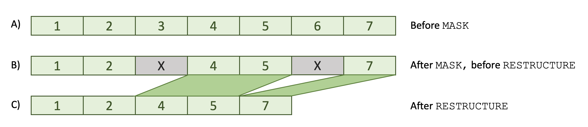

# Masks

_Commands to mask certain epochs in or out of analyses (depending on
annotations and other features) and to drop or retain certain
channels/signals_

| Command   | Description |
|------|---|
| [`MASK`](#mask)               | Mask epochs based on annotations and other features (standard mask) | 
| [`DUMP-MASK`](#dump-mask)     | Output epoch-level mask information (standard mask) |
| [`RESTRUCTURE`](#restructure) (or [`RE`](#restructure))  | Remove masked out epochs (and channels) based on the standard mask |
| [`CHEP`](#chep) | Process CHannel/EPoch _CHEP_ masks and modify the standard mask based on them |

Luna uses two types of _masks_ that work together: one that is only
defined per epoch (the _standard_ or _epoch-level_ mask), and one
which is also specific to each channel and epoch pair (the so-called
CHannel/EPoch or _CHEP_ mask).  The full range of _CHEP_ mask options
will typically only be used with high-density EEG data (i.e. multiple,
broadly comparable channels, used in combination with interpolation of
bad channels/epochs). The graphic below illustrates how these two
masks are related and some of the key commands which operate on them:

{width="100%"}


## MASK

This is the principal command for manipulating EDFs in-memory, at the
level of retaining or excluding (_masking_) certain epochs.  A _mask_
is a flag for each epoch that says whether it should be "in" or "out"
for a subsequent [restructuring](#restructure) of the dataset.

Once a _mask_ has been set, it can be modified (or cleared) by
subsequent `MASK` commands.  The behavior of the `MASK` command can be
changed to alter how it is merged with any previous masks that may
have been set.  Having applied one or more `MASK` or `CHEP` commands, the
resultant mask can be output (using the [`DUMP-MASK`](#dump-mask)
command) or used to select particular records of the EDF (using the
[`RESTRUCTURE`](#restructure) command).


_Masked versus restructured datasets_

The cartoon below illustrates the distinction between a _masked_ and a
_restructured_ dataset.  After setting a mask, no data are removed: rather,
a flag is set to for certain epochs to indicate they are masked.  A mask
can be reset, in which case, scenario B would revert to scenario A below.



In contrast, after a restructure command, masked epochs are removed
and cannot be retrieved (except if using the [data
freeze](freezes.md#freeze) mechanism). The distinction can be
important because some commands do not work with masked data
(i.e. state B) - they would pull in the entire signal, i.e. across all
epochs, whether masked or not.  For this reason, it is often safer to
restructure the data after setting a mask (even though Luna will emit
a warning if you try applying such a command to masked data). Commands
that internally operate on an epoch-by-epoch basis could be applied to
either state B or C, and would give identical results.  This
[table](epochs.md#command-table) details which commands can be used
in which contexts.


<h3>Parameters</h3>

The `MASK` command takes a variety of parameters to modify its
behavior.  You should only specify _one_ of these options for any one
`MASK` command however; multiple `MASK` commands can be specified sequentially.

There are three general types of mask:

 - those based on [_annotations_](annotations.md), using either the default syntax
  or (for more involved, niche scenarios) Luna's
   [_eval_](annotations.md#evalannotations.md#eval),   
 - those based on _time intervals_, specified in terms of
   clock-time, elapsed-time or epoch number
 - other miscellaneous masks

_Annotation-based mask syntax:_

These commands take one or more annotation class labels as arguments:

| Option | Example | Description | 
| ---- | ----- | ----- | 
| `if`           | `if=N2`           | Mask epochs with N2 annotations; unmask other epochs |
| `ifnot`        | `ifnot=N2,N3`     | Mask epochs without either N2 or N3 annotations; unmask other epochs |
| | | |
| `mask-if`      | `mask-if=N2,N3 `  | Mask epochs with either N2 or N3 annotations; _leave other epochs as is_ |
| `mask-ifnot`   | `mask-ifnot=N2`   | Mask epochs without annotations; _leave other epochs as is_ |
| | | |
| `unmask-if`    | `unmask-if=N2`    | Unmask epochs with N2 annotations; _leave other epochs as is_ |
| `unmask-ifnot` | `unmask-ifnot=N2` | Unmask epochs without N2 annotations; _leave other epochs as is_ |


All six arguments above (`if`, `ifnot`, `mask-if`, `mask-ifnot`,
`unmask-if` and `unmask-ifnot`) can take multiple comma-delimited
annotations (as shown in some of the above examples). Multiple
annotations will by default match an epoch if any of the listed
annotations span that epoch (i.e. _or_ logic).

To instead specify _and_ logic for multiple annotations, add a `-all`
suffix to any of the above commands, which will modify its behavior.
For example:

| Option | Example | Description |
| ---- | ----- | ----- |
| `mask-if` | `mask-if=N2,N3`  | Mask epochs spanned by either N2 _or_ N3 annotations (equivalently `mask-if-any`) |
| `mask-if-all` | `mask-if-all=N2,arousal` | Mask epochs spanned by both an N2 _and_ an arousal annotation |

Although it does not change behavior, for clarity, the basic
_or_-logic options can be written with an `-any` suffix:
e.g. `if-any=N1,N2,N3`.  Functionally, `if` and `if-any` are
identical (as is the case for the other five core mask options above), however.

One can use the `*` character as a wildcard at the _end_ of an annotation label to select a group of annotations:
```
  MASK mask-if=artifact_*
```
would be equivalent to writing, e.g., 
```
  MASK mask-if=artifact_EEG,artifact_EOG,artifact_RESP
```
assuming that these three annotations existed for that record. 

_Full versus partial epoch matching:_

By default, annotation-based masks match an epoch if the specifed
annotation(s) have _any degree_ of overlap with that epoch.
Alternatively, masks can require that the _entire epoch_ is spanned by
that annotation in order to make a match, by adding a `+` symbol
before the annotation label: for example,
```
 MASK if=+arousal
```
will only mask epochs that are completely spanned by an arousal; in contrast,
```
 MASK if=arousal
```
will also match epochs that have any extent of overlapping `arousal`.


[_Eval_ expression](annotations.md#eval)-based masks:

| Option | Example | Description | 
| ---- | ----- | ----- | 
| `expr`        | `expr="if(annot1) && annot2.v2 > 0.95" ` | Mask/unmask epochs for which the expression is true/false |
| `not-expr`    | `not-expr="if(annot1) && annot2.v2 > 0.95" ` | Unmask/mask epochs for which the expression is true/false |
| `mask-expr`   | `mask-expr="if(annot1) && annot2.v2 > 0.95" ` | Mask epochs for which the expression is true |
| `unmask-expr` | `unmask-expr="if(annot1) && annot2.v2 > 0.95"` | Unmask epochs for which the expression is true |


_Including/excluding epochs based on time intervals_

Rather than annotations, these options mask certain epochs based on
time intervals or epoch connts.

| Option | Example | Description | 
| ---- | ----- | ----- | 
| `epoch`        | `epoch=6,9-10,20-25` | Mask epochs outside of this set of epochs (i.e. include these ones) |
| `mask-epoch`   | `mask-epoch=20-50` | As above, except mask epochs inside this range | 
| `sec`     | `sec=0-60` | Set mask to include all epochs that span the interval from 0 to 60 seconds (i.e. these are _unmasked_, all other epochs are _masked_)|
| `hms`     | `hms=8:00-9:00` | Set mask to include all epochs that span the interval from 8am to 9am (uses 24-hour clock) |


_Other miscellaneous mask options_

| Option | Example | Description | 
| ---- | ----- | ----- | 
| `none`    | `MASK none` | Set to include all epochs (default when first loading a new EDF) | 
| `all`     | `MASK all` | Set to exclude (i.e. mask) all epochs | 
| `flip`    | `MASK flip` | Flip all epoch masks |
| `random`  | `MASK random=50` | Select up to 50 from currently unmasked epochs | 
| `leading` | `MASK leading=wake` | Remove all epochs up to the first epoch _without_ this annotation |
| `flanked` | `MASK flanked=N2,2` | Include only N2 epochs flanked by at least 2 other N2 epochs | 


As noted above, a single `MASK` command can only have a single option.  Mask commands can be specified sequentially to
build up more complex filters: e.g. to select N2 epochs between 10pm and midnight:

```
MASK hms=22:00-00:00
MASK mask-ifnot=N2
RE
```


<h3>Outputs</h3>

Information is written to the log, describing the changes in the mask
status of epochs.  For example:
 
```
MASK if=A
MASK unmask-ifnot=X
```

may yield the following output:

```
 CMD #1: MASK
 set epochs, to default length 30, 1022 epochs
 set masking mode to 'force'
 based on A 102 epochs match; 102 newly masked, 0 unmasked, 920 unchanged
 total of 920 of 1022 retained
 ..................................................................
 CMD #2: MASK
 set masking mode to 'unmask'
 based on X 511 epochs match; 0 newly masked, 51 unmasked, 971 unchanged
 total of 971 of 1022 retained
```

The same information is also tabulated in any specified [_lunout_](../luna/destrat.md) database as follows.

Output stratified by mask (strata: `EPOCH_MASK`):

| Variable | Description |
| ----- | ------ | 
| `N_MATCHES` | Number of epochs that match the condition (e.g. having annotation `A`) |
| `N_MASK_SET` | Number of previously unmasked epochs that were _masked_ by this operation |
| `N_MASK_UNSET` | Number of previously masked epochs that were _unmasked_ by this operation |
| `N_UNCHANGED` | Number of epochs whose mask status was not changed by this operation |
| `N_RETAINED` | Number of epochs retained after this operation | 
| `N_TOTAL` | Total number of epochs |
| `MATCH_LOGIC` | `OR` or `AND` if based on an annotation mask |
| `MATCH_TYPE` | Primary annotation maask, e.g. `ifnot` |
| `MASK_MODE` | `force`, `mask` or `unmask` |

For the above example, these values would be as follows (some outputs excluded):

```
ID     EPOCH_MASK  N_MASK_SET  N_MASK_UNSET  N_MATCHES  N_RETAINED  N_TOTAL  N_UNCHANGED
id001  A           102         0             102        920         1022     920
id001  X           0           51            511        971         1022     971
```

<h3>Examples</h3>

As masks are central to how Luna works, below we give some greater
context and general principles, along with examples of using masks.

### General principles

- _Masked_ means that an epoch is flagged to be excluded from the dataset.

- When an EDF is first loaded, all epochs are _unmasked_.

- Whether or not an epoch is masked is typically specified in terms of
  the _annotations_ associated with that epoch, or _when_ that epoch occurs.

- Masking, by itself, doesn't actually remove any epochs: it only
  flags those to be removed.

- Masking (i.e. the _consequence_ of the `MASK` command) is always at
  the level of the whole epoch.  That is, an entire epoch is either
  masked or unmasked.

- Annotations used in masking (i.e. the _input_ of the `MASK` command)
 can still be scored with fraction-of-a-second resolution, however,
 such as arousal events.  In this case, by default Luna evaluates epochs as
 _containing at least one_ arousal event versus _not containing any_
 arousal events.  The `+` special syntax (`+annotation`) will mask only if
 `annotaiton` spans the entire epoch.

!!! hint "Masks with finer temporal resolution" 
    To achieve a mask with a finer temporal resolution, you can always
    set the epoch size to be smaller (e.g. `EPOCH len=1`) before
    applying the mask (and it can be reset back to `len=30` or another
    value after `RESTRUCTURE`-ing the data).


### Mask modes

When a mask is applied, the log will record the _mask mode_, as either
`force`, `mask` or `unmask`.  The table below indicates which mask
options correspond to which modes:

| Mask mode | Options | Description |
| ---- | ---- | ---- | 
| _force_ | `if`, `ifnot`, `expr`, `not-expr` | Epochs are masked and unmasked, i.e. _every_ epoch is affected |
| _mask_ | `mask-if`, `mask-ifnot`, `mask-expr` | Only ever masks epochs | 
| _unmask_ | `unmask-if` , `unmask-ifnot` , `unmask-expr` | Only ever unmask epochs |

These distinctions really only matter when multiple masks are specified
in sequence.  That is, the _force_ mode effectively wipes any previous
mask that was set.  The other two types of mask effectively provide a
way to combine masks. For example, in this instance, the second mask
(based on annotation `B`) effectively cancels the first mask:

```
MASK if=A
MASK if=B
```
In contrast, either
```
MASK if=A,B
```
or
```
MASK mask-if=A
MASK mask-if=B
```
would give the intended result of masking epochs that have an annotation of either `A` __or__ `B`.

Note that the single-line form is more convenient if you are using a variable to define masks:
```
MASK ifnot=${stage}
```
would allow stage to be say just N2 epochs (`stage=N2`) but also combined NREM epochs (`stage=N1,N2,N3`).


### Multiple annotations 

Annotation masks let you specify a comma-delimited
list. By default, an epoch will match if at least one of those
annotations spans the epochs.  If the `-all` suffix is added
(e.g. `ifnot-all=X,Y`) then an epoch will match if _all_ annotations
are present.

Alternatively, you can mask based on multiple annotations or features
by specifying a series of `MASK` commands - although, take care to
note the _mask mode_ as above (some masks will wipe out the effects of
prior masks).

Another alternative is to use the
[`MAKE-ANNOTS`](annotations.md#make-annots) command to generate new
annotations on-the-fly, as functions of pairs of existing annotations.
The resulting new annotation can then be given to a `MASK` command.

Finally, yet another option is to use the more flexible but more complex [_eval_](evals.md) masks.  For example, 
to mask epochs that either 1) contain _both_ `A` and `B` or 2) only `C`, and _neither_ `A` or `B`:
```
MASK mask-expr=" ( if(A) && if(B) ) || ( if(C) && ! ( if(A) || if(B) ) ) "
```
Consult the [eval](evals.md) syntax (e.g. `&&` means _and_ and `||` means _or_),
which is quite generic (although care is needed with exact syntax and there are one or two
edge cases as listed on the linked page).


### Matching _instance_ IDs

Masks can refer to annotation _instance_ IDs as well as _class_ names.
See [here](annotations.md#luna-annotations) for a discussion of Luna
annotations. Consider the following annotation `SS`:

```
# SS | sleep stage
SS  W   e:1
SS  N1  e:2
SS  N1  e:3
SS  N2  e:4
SS  N1  e:5
... (etc) ...
```

Here, the annotation _class_ name is `SS`.  The _instance_ IDs are
`W`, `N1`, `N2` (and likely `N3`, `REM`, etc later in the file, of
course).  In the context of a mask, _all_ epochs have an `SS`
annotation, and so there would be little point using it.  To mask
based on the _instance_ IDs, you can use the following syntax:

```
MASK mask-ifnot=SS[N2]
```
to include only `N2` epochs in analysis, for example.  

It is possible to apply OR logic with multiple class
instances delimited by the pipe `|` character. For example:

```
MASK mask-ifnot=SS[N2|N3]
```
restricts analysis to N2 and N3 epochs (as an epoch is included
if it is either N2 _or_ N3).

Using [eval expression](evals.md) syntax, one would write, using the _match_ operator `=~` :
```
MASK expr=" SS =~ c( 'N2' , 'N3' ) "
```

Note that Luna is quite flexible in how annotations can be specified.
For example, the staging information in the above file could
instead have been specified as follows:

```
# W | Wake
# N1 | Sleep stage N1
# N2 | Sleep stage N2
# N3 | Sleep stage N3
# REM | Sleep stage REM
W   .  e:1
N1  .  e:2
N1  .  e:3
N2  .  e:4
N1  .  e:5
```

In this case, there are five distinct annotation _classes_ (`W`, `N1`,
`N2`, `N3`, `R`) but no information encoded in the individual
_instance_ IDs (all are set to `.`).  In contrast, the example above
used a single annotation _class_ (`SS`) with staging
information encoded as levels of _instance_ ID.  Either option is
fine.  In this latter case, one could specify the previous N2/N3 mask
as follows:

```
MASK mask-ifnot=N2,N3
``` 


### EVAL expressions

It is possible for _eval_ statements to return a _null_ or _undefined_
answer, for instance if a requested variable is not present.  The table below describes 
the behavior of each mask type:

| Mask       |  Eval == T | Eval == F | Eval == _undefined_ | 
| ---        |: ----      :|: ----      :|: ----           :| 
| `expr`     | __Mask__   | __Unmask__ |  _Leave as is_ |
| `not-expr` | __Unmask__ | __Mask__   |  _Leave as is_ |
| `mask-expr`     | __Mask__   |  _Leave as is_ |  _Leave as is_ |
| `unmask-expr`   |  _Leave as is_ | __Unmask__ |  _Leave as is_ |


### Other options

As indicated in the parameter tables above, the `MASK` command has a
number of other convenience functions, including some that do not
operate on annotations _per se_.

<h5>Selecting epochs by number</h5>

To include only the first epoch in analysis:
```
MASK epoch=1
```

To include only a range of epochs, use two numbers with a dash/minus (`-`) sign between them. These intervals can be combined as a comma-delimited list:
```
MASK epoch=5-8,10-20,28
```

The `mask-epoch` option is similar, except the specified epochs are
excluded from analysis rather than included.  Both of these options
will overwrite any previously specified mask.  


!!! alert "Epoch numbering for `MASK epoch`"
    The `epoch` specification refers to the current, _in-memory_
    epochs rather than the original file-based epochs.  _If there has
    been a `RESTRUCTURE` command, these can be different._ For
    example, the following series of masks
    ```
    MASK epoch=10-20
    RESTRUCTURE
    MASK epoch=2
    RESTRUCTURE
    ```  
    would select the _eleventh_ epoch with respect to the original
    EDF.  That is, although for the purpose of output Luna tracks the
    original epoch numbering and time-stamps, when specifying a mask
    such as `epoch=2`, it will be taken to mean "the second of the
    _currently defined_ set of epochs".


<h5>Randomly selecting a subset of epochs</h5>

To randomly select a up to a particular number of epochs _from the set of 
currently unmasked epochs_, use the `random` mask.  For example, to
select 10 epochs at random:

```
MASK random=10
```
This command will not select (i.e. unmask) previously masked epochs. So, the following
```
MASK epoch=10-20
MASK random=5
```

would result in all epochs being masked _except_ five epochs randomly
selected within the range of epoch 10 to epoch 20.  If you request
more epochs than are "available" (e.g. `random=50` in the last
example), it will just result in all available epochs being selected
(11 in this example).
 

<h5>Specifying time intervals directly</h5>

To include only epochs that span a particular time range, use either the `sec` or `hms` options:
```
MASK sec=60-120
```

where the arguments are seconds since the start of the _in-memory_ EDF. 
Alternatively, you can specify ranges based on clock-time (assuming the EDF has a
valid start time in the header).

```
MASK hms=8:00-9:00
```

!!! note 
    As is always the case for the `MASK` command, these options
    operate only on entire epochs, in this case selecting all epochs
    that overlap with the specified time intervals.  Thus, the
    following yields a 30-second dataset in memory, not a 15-second one:
    ```
    EPOCH 
    MASK sec=45-60
    RESTRUCTURE
    DESC
    ```
    as indicated (in the output of `DESC`, which describes the in-memory data-set rather than what is on disk): 
    ```
    Duration          : 00:00:30
    ```
    To select intervals at a finer temporal resolution, you can always
    set the `EPOCH` duration to be smaller.

    Re-running with a shorter epoch size:
    ```
    EPOCH len=1
    MASK sec=45-60
    RESTRUCTURE
    DESC
    ```
    we now see in the log that the `MASK` command selects the appropriate number of 1-second long epochs
    ```
    CMD #2: MASK
    selecting epochs from 46 to 60;  masked 30649 epochs; unmasked 0 and left 0 unchanged
    total of 15 of 30664 retained for analysis
    ```
    and the `DESC` command indicates the in-memory dataset is now 15-seconds in duration
    ```
    Duration          : 00:00:15
    ```

    This could be useful if you have an EDF that has a small amount of data you
    want to remove: say the EDF start time was `10:59:38` but the
    manual scoring (in 30-second epochs) began at `11:00:00`
    exactly.  To obtain an EDF that cleanly lines up with a start time
    of `11:00:00`, you would a) select those first 
    22 seconds with `sec`, b) `flip` the mask (thereby excluding those 22 seconds and including everything else),
    c) use `RESTRUCTURE` to permanently alter the in-memory dataset, and d) use `WRITE` to make a 
    new EDF:
    ```
    EPOCH len=1
    MASK sec=0-22
    MASK flip
    RESTRUCTURE
    WRITE edf-dir=/path/to/new/edfs/ edf-tag=trimmed sample-list=trimmed.lst
    ```
    The manual annotation file will now exactly match the new EDF 
    (i.e. the first epoch starts at `11:00:00` exactly).  See the [`WRITE`](outputs.md#write) command for more details.


<h5>Miscellaneous</h5>

The `none` option (or `clear` or `include-all`, take your pick) will set all epochs to be included (i.e. unmasked). 
```
MASK none
```

The `all` option (or `total` or `exclude-all`, take your pick) will
set all epochs to be excluded (i.e. masked). First masking everything
and then selectively _unmasking_ certain epochs can make it easier to
specify multiple annotations.  For example, to include epochs with
annotations `A`, `B` or `C`, as the `mask-ifnot=A,B,C` command is not
allowed (see above), you can write:
```
MASK all
MASK unmask-if=A,B,C
```

The `flip` command will, as its name suggests, completely reverse a
mask, meaning that masked epochs are unmasked, and vice versa.

```
MASK flip
```

The `leading` option masks all epochs until it comes across an epoch
that does _not_ have the given annotation.  For example, to remove
leading wake (`W`) epochs:

```
MASK leading=W
RESTRUCTURE
```

The `flanked` option will only select epochs to include for analysis
that are a) matching that annotation and b) flanked by at least _N_
epochs with a similar annotation.  For example, to select "stable" N2
sleep, meaning epochs that are at least 1 minute away from a stage
transition, you would use (assuming 30-second epochs):

```
MASK flanked=N2,2
```

!!! alert "TODO:"
    `leading` and `flanked` options are currently broken; they only apply to old-type _epoch-annotations_ 


### Tips on usage

At the risk of repeating some of the points made above, here we give a
few important points about how masks and restructuring EDFs work in
Luna:

- You can set one or more masks, but nothing is fundamentally changed
  until a `RESTRUCTURE` (or, equivalently, `RE`) command is issued.
  Prior to that command, the mask could be cleared and you would be
  working with the same version of the data as before.

- Once the `RESTRUCTURE` command has been issued, all masked epochs
  are permanently removed from the in-memory representation of the
  EDF. Any dropped epochs or channels cannot be restored without
  reloading the original EDF by running Luna a second time on that
  EDF.

- The `RESTRUCTURE` command only alters the in-memory representation
  of the EDF, not the original on-disk EDF itself.  In fact, no Luna
  commands will ever alter the original EDF.  The `WRITE` command can
  be used to generate a _new_ EDF after `MASK`-ing and
  `RESTRUCTURE`-ing the data.

- Some commands will automatically skip masked epochs
  (e.g. `CHEP-MASK`).  Other commands have options for including or
  excluding masked epochs (e.g. `ANNOTS`).  Many commands will operate
  on the entire signal however, _whether or not epochs are masked_.
  For example, the [`FILTER`](fir-filters.md#filter) command applies a
  FIR filter (e.g. bandpass) to a signal, and replaces the original
  signal with the filtered version.  Here, it would not make sense to
  only filter and modify the unmasked epochs, leaving the contiguous
  masked epochs with the unfiltered, raw signal.  Thus, if the goal is
  to apply a `FILTER` to a subset of unmasked epochs, one should use
  the `RESTRUCTURE` (or short form `RE`) command after setting the `MASK` and before
  running the `FILTER`.  In general, if you are unsure, it is safer to
  `RESTRUCTURE` the data once the desired `MASK` has been set.  As of v0.28,
  Luna will give a warning to the console if it ever finds itself being asked
  to perform any _whole signal_ analysis when some epochs are masked:
  ```
  luna s.lst -s ' MASK epoch=1 & FILTER sig=EEG highpass=1 order=10 '
  ```
  ```
  *** warning - running a command that pulls the whole trace
  ***           but currently an epoch mask set has been set;
  ***           for this operation to skip masked epochs,
  ***           you need to run RE (RESTRUCTURE) beforehand
  ```

- After applying `MASK/RESTRUCTURE` commands, there will typically be
  fewer epochs.  Importantly, however, Luna will track the mapping of
  epochs however, so that epoch codes and other time-stamps listed in
  output refer to the original EDF, not the reduced version.  Consider
  this example of a 10-epoch dataset, with five of the epochs masked
  (i.e. set to be removed, so MASK is `1`).

```
Before RESTRUCTURE               After RESTRUCTURE

E       MASK                     E       MASK
------------                     ------------
1       0                        1       0
2       1                        4       0
3       1                        5       0
4       0                        7       0
5       0                        8       0
6       1                        10      0
7       0
8       0
9       1
10      0
``` 

After issuing a `RESTRUCTURE` command, the data will contain only five
epochs, and the mask will be effectively cleared (i.e. only unmasked
epochs are left).  However, `E`, the original epoch numbering (as well as
any time-interval output, e.g. of individual spindles from the
`SPINDLES` command) will still be given with respect to the original
EDF, and so are more interpretable in subsequent analyses or
visualizations.  This temporal information is retained even if
subsequent `MASK/RESTRUCTURE` commands are applied during the same run of Luna.
For example, if another mask were set on this reduced dataset:

```
Before RESTRUCTURE               After RESTRUCTURE

E       MASK                     E       MASK
------------                     ------------
1       0                        1       0
4       0                        4       0
5       1                        7       0
7       0                        8       0
8       0                   
10      1                   
``` 

Epoch encoding and the internal _time-track_ information is retained,
respecting potential _discontinuities_ in the data, until another
`EPOCH` command is issued.  At that point, the data are assumed to
represent a _continuous_ EDF.


## `DUMP-MASK`

_Produces an epoch-by-epoch tabulation of the current mask_

<h3>Options</h3>

| Option | Example | Description |
| ---- | ----- | ----- |
| `annot` | `mask` | Adds epoch-level annotation called `mask` to indicate mask status |
| `annot-unmasked` | `T` | If `T`, add an annotation when an epoch is _unmasked_ (default is opposite) |
| `output` | `F` | If `F`, suppress output, i.e. just add the annotation, if `annot` | 


<h3>Output</h3>

`DUMP-MASK` creates the following epoch-level table:

Epoch-level tabulation (strata: `E`)

| Variable | Description |
| ---- | ---- | 
| `EMASK`  | Mask status: `0` is unmasked (included), and `1` is masked (i.e. excluded) |

<h3>Example</h3>

Apply a simple mask:
```
luna s.lst -o out.db -s ' MASK epoch=5-8 & DUMP-MASK '
```
and then look at the output (using `head` to restrict to the first ten rows):
```
destrat out.db +DUMP-MASK -r E | head 
```
which yields:
```
ID        E   EMASK
id00001   1   1
id00001   2   1
id00001   3   1
id00001   4   1
id00001   5   0
id00001   6   0
id00001   7   0
id00001   8   0
id00001   9   1
```

That is, epochs 5 through 8 are unmasked (set to be included, e.g. if
a `RESTRUCTURE` command were subsequently to be run).

## `RESTRUCTURE`

_Restructures the in-memory dataset after a mask has been set_ 

<h3>Options</h3>

| Option | Description |
| ---- | ----- |
| `verbose` | Output additional record-level information | 


<h3>Outputs</h3>

Summary of data duration/record count before and after `RESTRUCTURE`-ing (strata: none)

| Variable | Description |
| ----   | ---- | 
| `DUR1` | Duration of dataset (seconds) prior to restructuring |
| `DUR2` | Duration of dataset (seconds) after restructuring |
| `N1` | Number of records prior to restructuring |
| `N2` | Number of records after restructuring |

The number of records refers to the internal structure of the EDF file
(i.e. based on its record size, that is often but not always 1
second).

Record-level information (strata: `REC`, options: `verbose`)

| Variable | Description |
| ----   | ---- |
| `EPOCH ` | Epoch(s) spanning this record |
| `MASK`   | Mask status for this record, given epoch-level mask |
| `RETAINED` | Whether this record was retained prior to this `RESTRUCTURE` |
| `START` | Start time of this record ( seconds from  start) |
| `STOP` | Stop time of this record (seconds from start) | 

<h3>Example</h3>

Here we apply a simple mask and restructure the dataset:
```
luna s.lst -o out.db -s "EPOCH & MASK epoch=5-8 & RESTRUCTURE"
```
From the log, we see that the EDF is just over 8.5 hours (30,664 seconds) in duration:
```
Processing: id00001 [ #1 ]
 total duration 08:31:04, with last time-point at 08:31:04
 30664 records, each of 1 second(s)
```
The mask should select 4 epochs (from 5 to 8), which is confirmed in the log

```
 CMD #2: MASK
 selecting epochs from 5 to 8;  masked 1018 epochs; unmasked 0 and left 0 unchanged
 total of 4 of 1022 retained for analysis
```

The final `RESTRUCTURE` command keeps only these four epochs (or 120
records, given that one record is 1 second and 1 epoch is 30 seconds):
```
 CMD #3: RESTRUCTURE
 restructuring as an EDF+ : keeping 120 records of 30664, resetting mask
 retaining 4 epochs
```
Looking at the `out.db`, these numbers are mirrored in the output:
```
destrat out.db +RESTRUCTURE
```
```
ID        DUR1    DUR2    NR1      NR2
id00001   30664   120     30664    120
```

!!! hint "Using `TAG` to track repeated analyses" 
    
    Luna's output mechanism is intended to automatically pull together
    the results of different commands run on different individuals in
    a relatively painless manner.  One issue can occur, however, if
    you run the same command more than once within the same session:
    the output from the later execution of that command will overwrite the output
    from the former.  For example, say we had two rounds of masking and
    restructuring: from the full EDF to four epochs, and then from
    four down to a single epoch. 
    ```
    luna s.lst -o out.db -s "EPOCH & MASK epoch=5-8 & RESTRUCTURE & MASK epoch=2 & RESTRUCTURE"
    ```
    When looking at `out.db`, however with the same `destrat` command as above, only the second 
    `RESTRUCTURE` would be represented:
    ```
    ID        DUR1    DUR2    NR1      NR2
    id00001   120     30      120      30
    ```
    In this case, there is `destrat` assumes only one instance of each
    variable (e.g. `DUR1` for a given individual `ID` and strata
    (e.g. here, the default or baseline strata).  

    A solution is to use the [`TAG`](summaries.md#tag) command to keep
    track of the results of similar commands.    Here we've
    just added two `TAG` statements prior to the `RESTRUCTURE`
    statements. After a `TAG` has been set, the output from all
    subsequent commands will have that tag information as an output
    stratifier.  For example:
    ```
    EPOCH
    MASK epoch=5-8
    TAG STG/s1
    RESTRUCTURE
    DUMP-MASK
    MASK epoch=2
    TAG STG/s2
    RESTRUCTURE
    DUMP-MASK
    ```
    
    For illustration, we've also added a `DUMP-MASK` command after
    each `STRUCTURE`.  Now, when looking at the 
    database (with `destrat out.db) we see the following (ignoring
    other irrelevant lines for this example):

    ```
    --------------------------------------------------------------------------------
    distinct strata group(s):
      commands      : factors           : levels        : variables 
    ----------------:-------------------:---------------:---------------------------
      [EPOCH]       : .                 : 1 level(s)    : DUR INC NE
                    :                   :               : 
      [RESTRUCTURE] : STG               : 2 level(s)    : DUR1 DUR2 NR1 NR2
                    :                   :               : 
      [DUMP-MASK]   : E STG             : (...)         : EPOCH_MASK
                    :                   :               : 
    ----------------:-------------------:---------------:---------------------------

    ```

    That is, the output from `STRUCTURE` is now under the `STG`
    strata, rather than baseline.  Further, the output from
    `DUMP-MASK`, which was previously stratified by epoch-number `E`
    alone is now under `STG` as well as `E`, because we've added the
    `STG` factor with the `TAG` command.   
    
    We expect the `STG` factor to have two levels: `s1` and `s2`,
    which is indeed what we see:
    ```
    destrat out.db +RESTRUCTURE -r STG -x 
    ```
    ```
    Factors: 1
        [STG] 2 levels
         -> s1 s2
    ```
    Running without the `-x` option will dump the actual output:
    ```
    destrat out.db +RESTRUCTURE -r STG 
    ``` 
    ```
    ID        STG    DUR1    DUR2   NR1     NR2
    id00001   s1     30664   120    30664   120
    id00001   s2     120     30     120     30
    ```

    In this way, we can now see both sets of output from the
    `RESTRUCTURE` command: `s1` tracks the first round of
    restructuring; `s2` tracks the second round.

    Similarly, the output from `DUMP-MASK` is also stratified by
    `STG`. As we ran `DUMP-MASK` _after_ `RESTRUCTURE`-ing in each
    case, we expect in the first instance, four unmasked epochs only,
    and in the second instance, a single (unmasked) epoch (i.e. as
    `RESTRUCTURE` only retains unmasked epochs).  This is indeed what
    we observe -- here using the ability of `destrat` to extract only
    particular levels of factors:

    ```
    destrat out.db +DUMP-MASK -r E STG/s1 
    ```
    ```    
    ID        E    STG    EPOCH_MASK
    id00001   5    s1     0
    id00001   6    s1     0
    id00001   7    s1     0
    id00001   8    s1     0
    ```
    Likewise, to look at the output from the second run: 
    ```
    destrat out.db +DUMP-MASK -r E STG/s2
    ```
    ```
    ID        E     STG    EPOCH_MASK
    smp       6     s2     0
    ```
    Note that `STG`, `s1` and `s2` are completely arbitrary labels,
    which you can set to any values you like.  Their function is
    purely to differentiate between different sets of output.


## CHEP 

_Set and manipulate CHannel/EPoch masks_

Luna's primary epoch-level _mask_ (set via the [`MASK`](#mask) command) applies
only to epochs, meaning that _all_ channels in a given epoch are
either flagged as masked or unmasked.

For high-density EEG or other types of study, this may not be optimal, particularly if one
intends to [`INTERPOLATE`](spatial.md#interpolate)
partially bad signals based on neighboring signals.  This can be
accomplished using _CHEP_ (CHannel/EPoch) masks, to specify whether a
given channel/epoch combination is _masked_ (i.e. bad) or _unmasked_
(i.e. good).

Although _CHEP_ masks can be set manually (or read from a file),
currently the main way to set a CHEP mask is via the [`CHEP-MASK` command](artifacts.md#chep-mask).
The `CHEP` command, described here, can be used to output the CHEP mask (a
channel-by-epoch matrix), or to specify bad channels and/or epochs as
those that have above a certain number/proportion of bad
epochs/channels respectively.

Primary commands (such as [`RE`](#restructure)) that use mask
information to restructure an EDF still only consider the standard (i.e. epoch-level)
mask.

!!! note "CHEP masks and interpolation"
    Currently, CHEP masks (as set by `SIGSTATS`) are only considered by the `CHEP-MASK`, `CHEP` and
    [`INTERPOLATE`](spatial.md#interpolate) commands.

<h3>Options</h3>

| Option | Example | Description |
| ---- | ----- | ----- |
| `clear` |  | Clear CHEP mask |
| `load` | `file.txt` | Load CHEP from `file.txt` |
| `bad-channels` | C3,C5 | Manually specify bad channels |
| `epochs` | 0.1,2 | Mask epochs with >10% bad channel, or 2 or more bad channels<br>(expects 0, 1 or 2 arguments) |  
| `channels` | 0.5,10 | Mask channels with >50% bad epochs, or 10 or more bad epochs<br>(expects 1 or 2 arguments) |
| `drop-channels` | 0.5,10 | Drop (rather than mask) channels such channels |
| `black-and-white`| | When setting bad channels, make all epochs in good channels good |
| `dump` | | Write current CHEP mask to output |
| `save` | `file.txt` | Write CHEP mask to `file.txt` |

<h3>Outputs</h3>

Epoch-level summaries (option: `dump`, strata: `E`)

| Variable | Description |
| --- | --- |
| `CHEP`  | Number _CHEP_ masked channels for that epoch |


Channel-level summaries (option: `dump`, strata: `CH`)

| Variable | Description |
| --- | --- |
| `CHEP`  | Number _CHEP_ masked epochs for that channel |

Epoch/channel-level CHEP matrix (option: `dump`, strata: `CH` x `E`)

| Variable | Description |
| --- | --- |
| `CHEP`  | Is that channel/epoch masked (0/1) |


<h3>Example</h3>

The [`CHEP-MASK`](artifacts.md#chep-mask) command can be used
to automatically generate a CHEP mask.  For example, based on just two signals:

```
luna s.lst -o out.db 2 -s 'CHEP-MASK ep-th=2 sig=EEG,EEG(sec) & CHEP dump' 
```

```
destrat out.db +CHEP -r CH
```

```
ID	CH	CHEP
nsrr02	SaO2	0
nsrr02	PR	0
nsrr02	EEG(sec)	102
nsrr02	ECG	0
nsrr02	EMG	0
nsrr02	EOG(L)	0
nsrr02	EOG(R)	0
nsrr02	EEG	46
nsrr02	AIRFLOW	0
nsrr02	THOR_RES	0
nsrr02	ABDO_RES	0
nsrr02	POSITION	0
nsrr02	LIGHT	0
nsrr02	OX_STAT	0
```

That is, in this toy example, `EEG` has 46 bad epochs, whereas `EEG(sec)` had 102.  To set
the _standard mask_ to flag epochs where _both_ channels are bad, we
can use the `CHEP` command and the `epochs` option. The `epochs` option can take 0, 1 or 2 arguments:

 - `epochs` by itself will mask any epoch with 1 or more flagged channel (i.e. _any_ bad channels, equals `epochs=0` )
 - `epochs=0.5` will mask any epoch for which _more than_ 50% of channels are flagged (note: an additional `sig` option can be given to `CHEP` which is used to determine the denominator in the proportion calculations)
 - `epochs=0.5,10` will mask any epoch for which more than 50%, _or_ at least 10 or more channels are bad.

Therefore, to mask epochs in which both EEG are bad here, we would use
`epochs=1,2` (i.e. setting the first parameter to 100% effectively
ignore this option, which is based on finding epochs _above_ (not
equal to) this threshold). 

```
luna s.lst -o out.db 2 -s 'CHEP-MASK ep-th=2 sig=EEG,EEG(sec) & CHEP epochs=1,2 & RE' 
```
As shown in the console/log, this sets the epoch mask where 2 or more channels have their CHEP mask set:
```
  masking epochs with 2 or more masked channels: 38 epochs
  CHEP summary:
   604 of 16730 channel/epoch pairs masked (4%)
   110 of 1195 epochs with 1+ masked channel, 0 with all channels masked
   14 of 14 channels with 1+ masked epoch, 0 with all epochs masked
```
This removes 38 epochs in total, leaving 952 epochs in the final dataset, which is evident when dropping them via `RE`:

```
 CMD #3: RE
  restructuring as an EDF+:   keeping 34710 records of 35850, resetting mask
  retaining 1157 epochs
```

