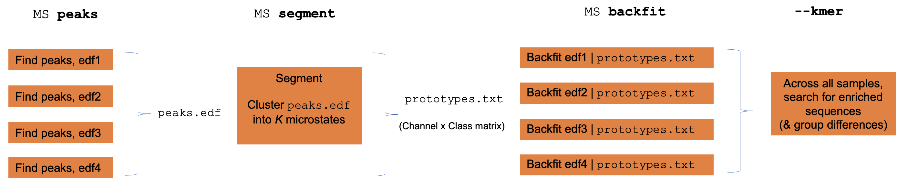
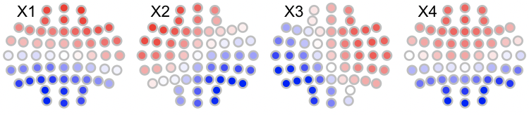
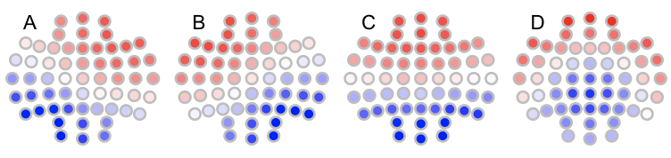
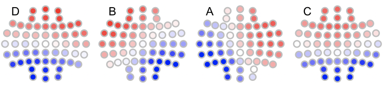

# EEG microstates


_Implementation of the modified K-means approach to EEG microstate analysis_

| Command | Description | 
| ---- | ------ | 
| [`MS`](#ms) | EEG microstate analysis |
| [`--kmer`](#-kmer) | (Group-level) permutation-based analysis of state sequences |
| [`--cmp-maps`](#-cmp-maps) | Group/individual map spatial analysis |
| [`--label-maps`](#-label-maps) | Label maps given a template |
| [`--correl-maps`](#-correl-maps) | Spatial correlations between maps |


## `MS`

_Fits the modified k-means clustering to EEG data_

This implementation follows the seminal publication by [Pascual-Marqui et
al. (1995)](https://pubmed.ncbi.nlm.nih.gov/7622149/) as well as
a guide and code by [Poulsen et al](https://www.biorxiv.org/content/10.1101/289850v1.full).

Briefly, the `MS` workflow follows these steps:

 - extracts global field power (GFP) __peaks__ from EEG signals (that must previously have been average-referenced)
 - cluster GFP maps (__segmentation__) to a small number of prototypes, e.g. _K_ = 2,3,4, etc, using a polarity-invariant (modified _k_-means clustering, in which prototypes are based on the first eigenvector of the class-specific covariance)
 - __backfit__ the prototype maps to all original sample points
 - perform temporal smoothing (relabelling short segments)
 - calculate various statistics per individual
 - finally, per individual or at the group level, search for enriched sequences of states as well as group differences (__kmer__ analysis)

<h5>Individual versus group level analyses</h5>

Luna operates one EDF at a time, although often one wants to apply EEG
microstate clustering across multiple individuals.  To achieve this,
Luna splits out the core functions of the `MS` command (GFP peak
extraction, segmentation, backfitting and kmer/sequence enrichment)
into sub-commands that can be run individually to faciliate
group-level analysis.

{width="100%"}


!!! warning
    There are numerous methodological subtleties to EEG microstate
    analysis, and this Luna implementation does not purport to support all
    of these differences.


<h5>Parameters</h5>

Single-subject clustering

| Option | Example | Description | 
| ---- | ---- | ---- | 
| `gfp-max`  | `3` | Exclude GFP peaks with amplitude 3 SD units above the mean |
| `gfp-min`  | `1` | Exclude GFP peaks with amplitude 1 SD units below the mean |
| `gfp-kurt` | `1` | Exclude GFP peaks with spatial kurtosis 1 SD above the mean |
| `npeaks` | `5000` | Number of GFP peaks to extract |
| `all-points` | |Use all EEG points for clustering, <br>rather than selecting only GFP peaks (can be a _lot_ of data...) |
| `dump-gfp`   | `gfp.txt` | Report all GFP peaks to this file |
| `standardize` | | Standardize GFP maps within individual |
| `verbose` |  | Report verbose output |
| `epoch` | | Perform backfitting epoch-by-epoch |

<b>Multi-subject clustering</b>

GFP peak detection:

| Option | Example | Description | 
| ---- | ---- | ---- |
| `peaks`  | `p1.edf` | Write GFP peaks to this EDF |
| `npeaks` | 1000  | Number of peaks to extract per individual |
| `pmin`   | -250  | EDF physical minimum for new peaks EDF |
| `pmax`   | 250   | EDF physical maximum for new peaks EDF |

Segmentation parameters:

| Option | Example | Description | 
| ---- | ---- | ----|
| `segment`  | `sol.txt` | Perform microstate clustering (segmentation)<br>and write best-fitting prototype maps to this file|
| `k`  | `2,3,4,5,6` | Fit models for these values of K (number of states) |

Backfitting parameters:

| Option | Example | Description | 
| ---- | ---- | ----|
| `backfit`  | `sol.4` | Backfit prototype maps to EEG data and calculate various statistics |
| `backfit`  | `sol.4,B,C,A,D` | Backfit prototype maps, specifying label order explicitly (for columns in `sol.4`) |
| `min-msec`  | `20` | Iteratively replace short states (default 20 msecs) |


Output parameters:

| Option | Description | 
| ---- | ---- | 
| `write-states` | File to write state sequences to |
| `add-sig`   | Add a new 0/1 channel to the EDF for each microstate |
| `add-annot` | Add an internal annotation for each microstate |


Sequence analysis parameters:

| Option | Example | Description | 
| ---- | ---- | ---- |
| `kmers` | `3,6,1000` | Ssequence enrichment analysis (per individual) <br>3 args = 1) min, 2) max kmer length, 3) number of permututations |


<h5>Outputs</h5>

Individual-level outputs for the best-fit solution (strats: _none_)

| Variable | Description |
| --- | --- |
| `GEV`  | Global variance explained |
| `OPT_K` | Optimal K (based on GEV) |
| `LZW` | Lev-Zimpel-Welch complexity of state sequences |
| `SE1` | Sample entropy statistics `SE1, `SE2`, etc |

Per-cluster statistics (for the best-fit model) (strata: `K`)

| Variable | Description |
| --- | --- |
| `COV` | Coverage (proportion of points spanned) |
| `DUR` | Mean state duration (msec) |
| `OCC` | Cccurrences per second |
| `SPC` | Spatial correlation |
| `GEV` | Global explained variance |
| `GFP` | Global field power |
| `N` | Number of sample-points spanned , i.e. unstandardized `COV` | 

Per-solution statistics, i.e. for a given value of _K_  (strata: `NK`)

| Variable | Description |
| --- | --- |
| `MSE`	|  |
| `R2` | |
| `SIG2` | | 
| `SIG2_MCV` |  

Prototype map (for best-fit soluition) (strata: `CH` x `K`)

| Variable | Description |
| --- | --- |
| `A` | Element of A matrix |

Prototype map (from each _K_ solution) (strata: `KN` x `CH` x `K`)

| Variable | Description |
| --- | --- |
| `A` | Element of A matrix |

State transition probabilities for best-fit solution (strata: `PRE` x `POST`)

| Variable | Description |
| --- | --- |
| `P` | Transition probability |

Sequence enrichment (within individual) ( strata: `L` x `S` )

| Variable | Description |
| --- | --- |
| `OBS` | Observed number of observations |
| `EXP` | Expected number of observations |
| `P` | Empirical enrichment significance value |
| `Z` | Empirical enrichment Z score |
| `SG` | Equivalence group label |
| `NG` | Number of sequences in the sequence's equivalence group (`SG`) |
| `W_OBS` | Within-equivalence group observed rate |
| `W_EXP` | Within-equivalence group expected rate |
| `W_P` | Within-equivalence group rate enrichment signifiance |
| `W_Z` | Within-equivalence group rate enrichment Z score |


Sequence enrichment (within individual) equivalence groups ( strata: `L` x `SG` )

| Variable | Description |
| --- | --- |
| `NG`  | Number of members of this equivalence group |
| `OBS` | Observed number of observations |
| `EXP` | Expected number of observations |
| `P` | Empirical enrichment p-value |
| `Z` | Empirical enrichment Z score |


<h5>Example</h5>

For a single individual/EDF, apply microstate analysis. 

```
luna file.edf –o out.db –s MS sig=${eeg} k=2,3,4,5 
```

Note, prior to to above command, we require that the EEG signals have already been average-referenced.


```
CMD #1: MS
 options: k=2,3,4 kmers=2,4,100 sig=*
 find GPF peaks
 calculating GFP for sample
 extracted 15997 peaks from 90000 samples (18%)
 segmenting peaks to microstates
 K=2 replicate 1/10... GEV = 0.658197 (new 2-class best)
 K=2 replicate 2/10... GEV = 0.658197 (new 2-class best)
 K=2 replicate 3/10... GEV = 0.658197
 K=2 replicate 4/10... GEV = 0.658197
 K=2 replicate 5/10... GEV = 0.658196
...
 based on GEV, now setting K=2 as the optimal segmentation
 K=3 replicate 1/10... GEV = 0.707564 (new 3-class best)
 K=3 replicate 2/10... GEV = 0.707566 (new 3-class best)
 K=3 replicate 3/10... GEV = 0.707569 (new 3-class best)
 K=3 replicate 4/10... GEV = 0.707566
 K=3 replicate 5/10... GEV = 0.707566
..
 K=4 replicate 10/10... GEV = 0.725835
 based on GEV, now setting K=4 as the optimal segmentation
 
 back-fitting solution to all time points
 smoothing: rejecting segments <= 20 msec
 
 kmers: considering length 2 to 4
 kmers: for 156 sequences, 41 equivalence groups
 kmers: running 100 replicates...
```


```
destrat out.db +MS -r CH -c K
```
```
ID     CH  A.K.A  A.K.B  A.K.C A.K.D
ID0001 Fp1 0.419  0.281  0.275 0.163
ID0001 Fp2 0.169  0.181  0.073 0.186
ID0001 AF3 0.395  0.266  0.215 0.187
ID0001 AF4 0.087  0.090 -0.073 0.231
ID0001 F7  0.266  0.212  0.228 0.065
ID0001 F5  0.309  0.268  0.243 0.111
ID0001 F3  0.291  0.237  0.183 0.131
ID0001 F1  0.065  0.046 -0.038 0.167
ID0001 F2 -0.002 -0.019 -0.142 0.210
ID0001 F4  0.005  0.041 -0.096 0.172
ID0001 F6  0.103  0.273  0.106 0.122
```

```
destrat out.db +MS -r K -v DUR COV
```
```
ID     K COV   DUR
ID0001 A 0.222 118.531
ID0001 B 0.202 106.553
ID0001 C 0.285 119.100
ID0001 D 0.291 119.325
```


<h5>Multi-subject clusterig</h5>

The first step is to extract all GFP peaks, by creating an aggregated EDF which contains only a fixed number of peaks per individual:

First we ensure there is no file named `peaks.edf` to start with:

```
rm -rf peaks.edf
```

Adding the `peaks` option to the `MS` command will then cause Luna to iterate over every individual in the
`s.lst` sample list, and append the peaks for that individual to the end of the `peaks.edf` (updating the EDF header each time
more records are added).  Because we need to write the EDF header on encountering the first individual, we also need to manually
specify the physical min/max values we expect to see across all subjects (`pmin` and `pmax`).  Finally, we select the number of GFP
peaks to extract with `npeaks` (here 5000), and an optional threshold whereby very large GFP peaks are ignored (`gfp-th`):

```
luna  s.lst -s MS peaks=peaks.edf gfp-th=1 npeaks=5000 pmin=-200 pmax=200
```

The aggregated EDF `peaks.edf` is therefore a temporary that contains data (peaks) from multiple individuals (in this case, 130 individuals
from `s.lst`).  Because it is only used in the `MS` analysis, we set the sample rate (arbitrarily) to 1 Hz.  As a sanity check, as we
extracted 5000 peaks for each of 130 individuals, we expect a total of 650,000 observations for the subequent EEG microstate clustering. Indeed,
this is what we observe (i.e. assuming a

```
luna peaks.edf -s DESC
```
```
  duration: 180.33.20 | 650000 secs
```

!!! hint "Inspecting the GFP peaks across individuals"
    When combining data across individuals, it is important to ensure that peak amplitudes are broadly comparable across individuals.  You can use the standard Luna
    summary tools such as `SIGSTATS` (i.e. to get RMS and Hjorth parameters) to achieve this (so long as the metric does not depend on the sampling rate that is).
    Because `peaks.edf` arbitrarily sets the "sample rate" to 1 Hz, and in this example we extracted 5000 peaks per individual, we can use a trick of setting the "epoch length"
    to 5000 seconds, and request an epoch-level analysis.  This means that each "epoch" in the output in fact corresponds to all GFP peaks for one individual: e.g. from
    ```
    luna peaks.edf -o out.db -s EPOCH dur=5000 & SIGSTATS epoch
    ```
    You can inspect the channel-by-individual (`CH` by `E`) that results from this, to search for outlier individuals, etc, in which case it may be necessary to standardize GFP peaks
    prior to merging.


Next, we perform the primary MS segmentation of these collated GFP peaks. In this case we fix _K_ to 4 and
write the solution to the file `sol.4`:

```
luna peaks.edf -o out.db -s MS segment=sol.4 k=4
```

That is, the input to this step is `peaks.edf` rather than all the EDFs in `s.lst`, as the 130 individuals are already contained in it. 

At this point, one might examine `sol.4` visually, to determine which prototype corresponds to which canonical state (i.e. A, B, C, D, etc from the literature).

Next, we backfit this solution to the original data (i.e. `s.lst`) and extract various statistics:

```
luna s.lst -o out.db -s MS backfit=sol.4  write-states=states/s4-^
```
In the above command, we also specify `write-states` option, in order to save the sequence of microstates for each individual in a file (where `^` is replaced with the individual ID)

!!! hint "Labelling microstates"
    By default, the states are labelled
    A, B, C, D, etc, in the order they appear in the file `sol.4`,
    which will be arbitrary.  Based on visual inspection, if the
    states have clear labels they can be explicitly labelled by
    adding the state labels after the file name (i.e. here, we know
    that `sol.4` contains 4 states), if we see they correspond to B,
    A, C and D respectively:
    ```
    backfit=sol.4,B,A,C,D
    ```

We can visualize the prototype maps, e.g. using [`ltopo.rb()`](../ext/R/viz.md#ltoporb)

{width="100%"}

Here we see that the four states correspond to the canonical 4 states
as often reported (for a _K=4_ solution in the EEG microstate
literature).


## --kmer

_Apply state sequence permutation analysis across multiple individiuals and assess group differences_

As well as applied within individual, the `kmer` option can be run
"stand-alone", on the output from `write-states` from the `MS`
command, if they are concatenated into a single file.  The permutation
occurs within individual, but the statistics (i.e. enrochment of
specific k-mers) are aggregated across all people.  In addition, if a
binary phenotype is specified (via `phe`), then these statistics are
calculated separately for _CASES_ (phenotype == 1) and _CONTROLS_
(phenotype == 0); furthermore, the _difference_ between case and
control statistics is evaluated for each metric and the empirical
significance of all these terms is calculated.

<h5>Parameters</h5>

| Option | Example | Description |
| --- | --- | --- |
| `file` | `file=all.states` | Concatenated output from `write-states` (one row per individual) |
| `vars` | `vars=data.txt` | Tab-delimited file containing `ID` column and phenotypes |
| `phe` | `phe=DIS` | Pointer to a column of `data.txt` that is a 0/1 variable |
| `k` | `k=3` | Single k-mer length |
| `k1` | `k1=2` | Consider k-mers from `k1` to `k2 |
| `k2` | `k2=4` | Consider k-mers from `k1` to `k2 |
| `nreps` | `nreps=100` | Number of replicates |

<h5>Output</h5>

Sequence enrichment (group-level) ( strata: `L` x `S` )

| Variable | Description |
| --- | --- |
| `OBS` | Observed number of observations |
| `EXP` | Expected number of observations |
| `P` | Empirical enrichment significance value |
| `Z` | Empirical enrichment Z score |
| `SG` | Equivalence group label |
| `NG` | Number of sequences in the sequence's equivalence group (`SG`) |
| `W_OBS` | Within-equivalence group observed rate |
| `W_EXP` | Within-equivalence group expected rate |
| `W_P` | Within-equivalence group rate enrichment signifiance |
| `W_Z` | Within-equivalence group rate enrichment Z score |


Sequence enrichment (group-level) equivalence groups ( strata: `L` x `SG` )

| Variable | Description |
| --- | --- |
| `NG`  | Number of members of this equivalence group |
| `OBS` | Observed number of observations |
| `EXP` | Expected number of observations |
| `P` | Empirical enrichment p-value |
| `Z` | Empirical enrichment Z score |


Sequence enrichment (by phenotype) ( strata: `PHE` x `L` x `S` )

| Variable | Description |
| --- | --- |
| `OBS` | Observed number of observations |
| `EXP` | Expected number of observations |
| `P` | Empirical enrichment significance value |
| `Z` | Empirical enrichment Z score |
| `SG` | Equivalence group label |
| `NG` | Number of sequences in the sequence's equivalence group (`SG`) |
| `W_OBS` | Within-equivalence group observed rate |
| `W_EXP` | Within-equivalence group expected rate |
| `W_P` | Within-equivalence group rate enrichment signifiance |
| `W_Z` | Within-equivalence group rate enrichment Z score |


Sequence enrichment (by phenotype) equivalence groups ( strata: `PHE` x `L` x `SG` )

| Variable | Description |
| --- | --- |
| `NG`  | Number of members of this equivalence group |
| `OBS` | Observed number of observations |
| `EXP` | Expected number of observations |
| `P` | Empirical enrichment p-value |
| `Z` | Empirical enrichment Z score |


<h5>Example</h5>

Continuing from the example above, we can test for enrichment of
sequences by concatenating all state sequences across individuals: we
had previously saved the sequences to text files (one line per
individual) in the folder `states/` and so can concatenate as follows:

```
cat states/s4* > all.states
```

Assuming that the file `cc.txt` contains a 0/1 encoded group indicator
`PHE` in the first row and the individual ID labelled `ID` in the
header, we can run various enrichment statistics and test for
group differences (across all individuals) with the `--kmer` command:

```
echo "file=all.states vars=cc.txt phe=PHE k=4 nreps=100" | luna --kmer -o out.db
```

!!! hint
    Note, here _k_ is 4, but this is a different quantity from
    the _K_ = 4 in the clustering segmentation.  In this context, _k_
    of 4 means we consider sequences up to 4 states in length,
    e.g. ABAB, ABDA, ABCD, etc. (which could have fewer or more unique
    state labels at each position).


## --cmp-maps

_Group/individual map spatial analysis_

_Note that this function does not require or accept an EDF or sample list._

This command takes a set of microstate maps, along with an optional
group/phenotype file (two groups only) and evaluates the topographical
simiarity / dissimilarity of maps between groups/people, based on the
summed spatial correlation between maps.

The starting point for this command is always running
_individual-level_ segmentation with the [`MS`](#ms) command.


First, we perform individual-level segmentation:

```
luna s.lst -o maps.db \
     -s  ' REFERENCE sig=${eeg} ref=${eeg}
           MS sig=${eeg} k=4 gfp-max=3 gfp-min=1 gfp-kurt=1  npeaks=5000 '
```

We then extract all maps/solutions from all individuals to a single
text file: (swapping IDs to match phe.txt)

```
destrat maps.db +MS -r CH K > all.maps
```

For group-level tests, we require a tab-delimited file (e.g. `phe.txt`)
with `ID` and some other column with a 0/1 field: (here `DIS`):

```
luna --cmp-maps -o out.db \
     --options file=all.maps vars=phe.txt phe=DIS nreps=1000
```

The output to the console may look like:
``` 
  of 125 total individuals, for DIS 68 cases, 57 controls and 0 unknown
  creating individual-by-individual global similarity matrix

  within-case similarity                       : 0.819118 p = 0.628372
  within-control similarity                    : 0.824668 p = 0.34965
  | within-case - within-control | similarity  : 0.00555053 p = 0.802198
  concordant / discordant pair similarity      : 0.984001 p = 0.478521
```


All four above statistics are evaluated empirically.  There is
likely some redundancy here: the primary ones are #3 and #4.
(Arguably, #1 and #2 just help interpret a significant result from #3.).

From top to bottom, these statistics reflect the following questions::

  - _are cases more similar to each other than we’d expect by chance_ (1-sided)

  - _are controls more similar to each other than we’d expect by chance_ (1-sided)

  -  _are cases as similar to each other as controls are similar to each other?_ (2-sided, absolute difference)

  -  _are phenotypically concordant pairs more similar than discordant pairs?_ (1-sided, ratio)
 

To get individual level outputs (the mean similarity of that person vs all others):

 
```
destrat out.db +CMP-MAPS
```
```
ID          S
ID_0003     0.872831506350531
ID_0004     0.821114969439348
ID_0005     0.859732202249929
ID_0006     0.88057487661809
ID_0007     0.845507629897367
ID_0009     0.863454475897446
ID_0011     0.841742414155102
ID_0012     0.861049164391393
ID_0013     0.874618198441904
... etc ...
```

To run in _template mode_ (i.e. comparing all individuals to a fixed template, rather than making a comparison between groups:
 
```
luna --cmp-maps -o out.db \
     --options file=all.maps vars=phe.txt phe=DIS nreps=1000 template=prime6 
```

Here `prime6` is a text file with the template map, as Luna outputs from segmentation:  i.e. w/ a header row
and tab-delimited columns:
 
```
CH    B          A        F         E          C          D
Fp1   0.181639   0.12153  0.29197   0.078162   0.183723   0.0652307
Fp2   0.053939   0.20571  0.25708  -0.100524   0.165446   0.0531564
AF3   0.206103   0.12500  0.20173   0.071661   0.20764   -0.0747048
AF4   0.055686   0.22630  0.1419   -0.143023   0.183976  -0.0930419
F7    0.206141  -0.00312  0.23955   0.201432   0.113696   0.101976
... etc ...
```
  
```
 running CMP-MAPS
  found 6 classes: B A F E C D
  read 6-class prototypes for 57 channels from prime6

  of 125 total individuals, for DIS 68 cases, 57 controls and 0 unknown

  comparing individuals to a fixed template
  case-template similarity                         : 0.618476 p = 0.561439
  control-template similarity                      : 0.618709 p = 0.43956
  | case-template - control-template | similarity  : 0.000233025 p = 0.864136
```
 

Here we perform 3 different tests:

 - _is mean case-template similarity greater than expected by chance?_ (1-sided)

 - _is mean control-template similarity greater than expected by chance?_ (1-sided)

 - _do cases and controls differentially match the template?_ (2 sided, absolute difference)  


Note that the template map can contain more states (higher _K_) than the original data.

In terms of individual-level output, this now gives the global
similarity measure with the template/prototype maps (rather than with all other
individuals:

```
destrat out.db +CMP-MAPS
```

```
ID          S
ID_0003     0.623501942435745
ID_0004     0.623255522947831
ID_0005     0.619270046224184
ID_0006     0.621543219557438
ID_0007     0.623715796386705
ID_0009     0.62512820160196
ID_0011     0.624581781547139
ID_0012     0.618138762578379
...
```

You can also get the corresponding template classes for the optimal global match for each individual:

```
destrat out.db +CMP-MAPS -c SLOT
```

```
ID         T.SLOT_0  T.SLOT_1  T.SLOT_2  T.SLOT_3
ID_0003    E         C         B         A
ID_0004    C         F         B         A
ID_0005    A         C         B         D
ID_0006    B         A         C         D
ID_0007    F         A         E         B
ID_0009    C         A         E         B
ID_0011    B         A         E         C
ID_0012    B         C         A         E
ID_0013    C         A         E         B
... etc ...
```


## --label-maps

_Label maps given a template_

This function takes a microstate map file for _K_ classes, and a _template_ file (that should have
at least _K_ states) with specified labels.  Based on the set of assignments (of states in the first
file to the template file) that optimize the sum of spatial correlations, it generates a new map file
with the appopriate labels (i.e. based on the template).  Further, for plotting/visualization purposes,
it will flip a map if needed to make it more (visually) similar to the template.  (Note that spatial correlations
themselves are polarity invariant.)

This command considers all possible combinations of mappings, and
picks the one with the highest overall spatial correlation (i.e. the
sum of maximum correlations for the original _K_ states, each with one from
the template set, with the constraint that each original state 
must match a unique template state).  Note that this means that a
state may sometimes have a higher spatial correlation with another template map than the
one assigned: to give an unrealistic example, for two states 1 and 2 in the original, mapping to two templates X and Y):

```
        TEMPLATE  X     Y 
  ORIG   
    1             0.9   0.6          
    2             0.7   0.5
```

The optimal would be `[1 --> X]` and `[2 --> Y]` as the summed
correlation is 0.9 + 0.5 = 1.4 (versus 0.7 + 0.6 = 1.3), even though
`2` actually correlates more strongly with `X` than with `Y`.  This simply
reflects the logic of the criterion used to align a set of maps, and is not a problem _per se_ -
but do bear this in mind when interpreting results (given that microstates can very often have high spatial
correlations with multiple other states).

It is possible for the template to contain more states than
the test file: here, the command will pick the subset with the highest matches.

With the exception of perhaps flipping the values (multiplying all values in a column by -1), this command does not
change the underlying information/values in a solution, only the labels.

_Note that this function does not require or accept an EDF or sample list._

<h3>Parameters</h3>

| Option | Example | Description |
| ---- | ---- | ---- |
| `sol`  | `k4` | Read solution from text file `k4` |
| `template`  | `t6` | _Template_ file `t6` (e.g. contains canonical states ) |
| `new`  | `n4` | New file name for labelled solution |
| `th`  | 0.8 | Set to `?` if the spatial correlation does not exceed this value |


<h3>Output</h3>

Some notes to the console, and the relabelled map to a file (name given by `new`).

<h3>Example</h3>

Consider we have an unlabelled K=4 solution (in the text file `k4`)
which we wish to label based on an existing set of K=4 templates (in
the file `t4`), which are labelled with the canonical A, B, C and D
labels.

We can visualize these using LunaR's convenience functions: in R, first the original maps
(with arbitrary labels 1,2,3,4 (which R renames as X1, X2, X3 and X4 when reading
columns with those headers):

```
library(luna)
k4 <- read.table("k4",header=T,stringsAsFactors=F)
par(mfrow=c(3,4),mar=c(0,0,0,0) )
for (i in 1:4) ltopo.rb( c = k4$CH , z = k4[,1+i] , mt = names(k4)[1+i])
```



Likewise, the canonical maps are as follows:

```
t4 <- read.table("t4",header=T,stringsAsFactors=F)
for (i in 1:4) ltopo.rb( c = t4$CH , z = t4[,1+i] , mt = names(t4)[1+i])
```



To automatically assign labels using `--label-maps`:

```
luna --label-maps --options sol=k4 template=t6 new=k4.b th=0.8
```

```
 running LABEL-MAPS
  only assigning maps with spatial r >= 0.8 to matched template
  found 4 classes: A B C D
  read 4-class prototypes for 57 channels from t4
  found 4 classes: 1 2 3 4
  read 4-class prototypes for 57 channels from k4
   mapping [1] --> template [D] with R = 0.803188       
   mapping [2] --> template [B] with R = 0.991798       
   mapping [3] --> template [A] with R = 0.871168       
   mapping [4] --> template [C] with R = 0.990952       
```

To plot the relabelled maps in `n4`:
```
n4 <- read.table("n4",header=T,stringsAsFactors=F)
for (i in 1:4) ltopo.rb( c = n4$CH , z = n4[,1+i] , mt = names(n4)[1+i])
```



Note that if we had required a more stringent matching, e.g. with
`th=0.9 we'd see the following:

```
 mapping [1] --> template [D] with R = 0.803188 *** below threshold corr. -- assigning '?'
 mapping [2] --> template [B] with R = 0.991798       
 mapping [3] --> template [A] with R = 0.871168 *** below threshold corr. -- assigning '?'
 mapping [4] --> template [C] with R = 0.990952       
```
and the fields would be not named:
```
CH      ?          B           ?           C
Fp1     1.33501    1.41774     0.194605    1.17416
Fp2     1.5269     0.895938    0.928289    1.10388
... etc ... 
```


## --correl-maps

_Spatial correlations between maps_

This convenience function reads a map from a file and prints the
matrix of spatial correlations (between states) to standard output.

_Note that this function does not require or accept an EDF or sample list._

<h3>Parameters</h3>

| Option | Example | Description |
| ---- | ---- | ---- |
| `sol`  | `k4.sol` | Read solution from file `k4.sol` |


<h3>Output</h3>

Some notes to the console, and the matrix to standard output.


<h3>Example</h3>


If `k4.sol` is a file as output by `MS` (i.e. first column channels, subsequent columns are channel weights/loadings for each map, one per column):
```
CH      C           B           A             D
Fp1     1.33501     1.41774     0.194605      1.17416
Fp2     1.5269      0.895938    0.928289      1.10388
AF3     1.19466     1.34362     0.153383      1.2073
AF4     1.34935     0.625492    1.08554       1.11598
F7      0.833366    1.54421    -0.650062      0.78941
F5      0.880587    1.48185    -0.436373      0.966646
F3      0.868018    1.29965    -0.18313       1.09159
F1      0.913968    1.08758     0.185383      1.1776
... etc ...

```
To obtain the spatial correlation matrix:
```
luna --correl-maps --options sol=k4
```
In the console/log:
```
running CORREL-MAPS
  found 4 classes: C B A D
  read 4-class prototypes for 57 channels from k4
```
Written to standard output:
```
        C         B          A           D
C       1         0.608757   0.653712    0.892096
B       0.608757  1          0.216617    0.79893
A       0.653712  0.216617   1           0.401007
D       0.892096  0.79893    0.401007    1
```

Note the columns are kept in the same order as found in the input data.

