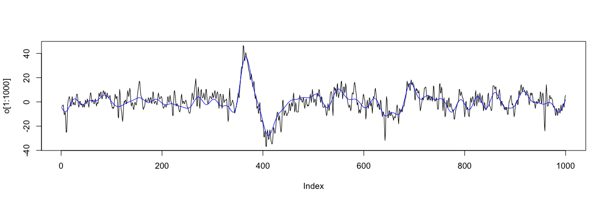

# Outputs

_Commands to rewrite EDFs and signals/annotations in other text-based formats_

|Command | Description | 
|---|---|
| [`WRITE`](#write)    | Write a new EDF file | 
| [`MATRIX`](#matrix)  | Dump signals (and annotations) to a file  |  
| [`HEAD`](#head)      | Show a small interval of signal data |
| [`DUMP-RECORDS`](#dump-records)| Dump annotations and signals, by EDF record | 
| [`RECS`](#recs)| Dump basic information on EDF record structure | 
| [`SEGMENTS`](#segments)| Dump (discontinuous EDF+) intervals |
| [`SEDF`](#sedf) | Generate a "summary EDF" |

## WRITE

_Save a (modified) EDF file to disk_

Writes a new EDF to disk, that will reflect any
[manipulation](manipulations.md), [filtering](fir-filters.md), or [masking](masks.md), etc, that
has been applied.

<h5>Parameters</h5>

| Parameter | Example | Description |
| --- | --- | --- |
| `sig` | `sig=C3` | Signal to output (only one)  |
| `edf-dir` | `edf-dir=edfs/` | Set folder where new EDFs should be written |
| `edf-tag` | `edf-tag=v2` | Add a tag to each new EDF filename |
| `sample-list` | `sample-list=v2.lst` | Name of the new sample-list |

<h5>Output</h5>

No formal output, other than a message to the log and one or more new EDFs. 

<h5>Example</h5>

To write a set of new EDFs that (for example) have been masked,
filtered and retaining only one signal, given the commands in a file,
say `cmd.txt` as follows:


```
EPOCH                       % Epoch the signals

MASK epoch=1-10             % Set to retain only the first 10 epochs

RESTRUCTURE                 % Apply the above mask 

SIGNALS keep=EEG            % Only retain the EEG signal

FILTER bandpass=0.5,4.5     % Apply a bandpass filter to the signal
       ripple=0.01
       tw=0.5 

WRITE edf-dir=newx/         % Write new EDFs, to the folder newx/
      edf-tag=v2            % add a 'v2' tag to each EDF
      sample-list=newx.lst  % create a new sample list pointing to the new EDFs
```

Running this set of commands: 

```
luna s.lst < cmd.txt
```

will produce a new folder `newx` with three new EDFs:

```
ls newx
```

```
learn-nsrr01-v2.edf	learn-nsrr02-v2.edf	learn-nsrr03-v2.edf
```

That is, the new EDF filenames have a `-v2` tag added. The folder 
(which must be specified with a `/` character in the `edf-dir`
argument) will be created if it does not exist. In addition, Luna
creates a new [_sample-list_](../luna/args.md#sample-lists) called
`newx.lst`, that points to these new EDFs:

```
cat newx.lst 
```

```
nsrr01	      newx/learn-nsrr01-v2.edf
nsrr02	      newx/learn-nsrr02-v2.edf
nsrr03	      newx/learn-nsrr03-v2.edf
```

Note that Luna _appends_ each item to this list, and so you may want
to delete it before running the command, if it already exists. 

We can use the new sample list to check the properties of the new set of EDFs:

```
luna newx.lst -s DESC
```

As expected, we do in fact see that the EDFs are now only 10 epochs in
length and contain only a single channel: (here, showing output only
for the first EDF):

```
EDF filename      : newx/learn-nsrr01-v2.edf
ID                : nsrr01
Clock time        : 21:58:17 - 22:03:17
Duration          : 00:05:00
# signals         : 1
# EDF annotations : 1
Signals           : EEG[125]
```

Finally, to check the filtering, we can use the [`MATRIX`](#matrix) command to 
dump the raw signals to a file.  First from the original EDF (for the first 10 epochs only): 

```
luna s.lst 1 -s "MASK epoch=1-10 & RE & MATRIX sig=EEG file=old.txt"
```

```
luna newx.lst 1 -s "MATRIX file=new.txt"
```


In R

```
o <- scan("old.txt",skip=1)
```

```
n <- scan("new.txt",skip=1)
```


```
plot( o[1:1000] , type="l" ) 
lines( n[1:1000] , col="blue" ) 
```

{width="100%"}


## MATRIX

_Dumps signal information to a file_

For one or more signals of similar sampling rates, this command
generates a text file containing the raw signal data.

<h5>Parameters</h5>

| Parameter | Example | Description |
| --- | --- | --- |
| `file` | `file=signals.txt` | Required parameter, to specify the filename for the output | 
| `sig` | `sig=C3,C4` | Restrict output to these signals/channels |
| `hms`  | `hms` | Add a clock-time column in _hh:mm:ss_ format |
| `hms2` | `hms2` | Add a clock-time column in _hh:mm:ss:microsecond_ format |
| `annot` | `annot=X,Y` | Add columns with values 1/0 to indicate the presence/absence of that annotation |
| `min`  | `min` | Minimal output to show only signal information (no headers or lead columns) | 


<h5>Output</h5>

All output is written to a text file as specified by the `file` parameter.  For example:

```
ID    E   S   SP   T           EOG-L      EOG-R     EMG       EEG      
id01  1   0   0    0           -6.07448   4.18193   31.044    0.763126  
id01  1   0   1    0.00390625  -0.030525  2.83883   52.7778   11.5079   
id01  1   0   2    0.0078125   7.23443    2.22833   45.3297   23.0464   
id01  1   0   3    0.0117188   11.569     2.10623   23.4127   29.4567   
id01  1   0   4    0.015625    12.9731    2.16728   8.82173   31.2882  
id01  1   0   5    0.0195312   12.79      2.22833   -4.73138  30.7387  
id01  1   0   6    0.0234375   12.1795    2.28938   -13.6447  29.6398  
id01  1   0   7    0.0273438   11.6911    2.22833   -14.1331  28.663   
id01  1   0   8    0.03125     11.3858    2.22833   -11.8742  28.0525  
id01  1   0   9    0.0351562   11.2027    2.16728   -13.4615  27.6862  
... cont'd ...
```

Here, the first five columns are:

- `ID`: individual/EDF ID
- `E`: epoch number
- `S`: elapsed time in seconds (integer)
- `SP`: sample point in the EDF record
- `T`: elapsed time in seconds

The subsequent columns represent the channels in the EDF (or those
specified by the `sig` parameter).

If the `min` (or `minimal`) parameter is specified, then the header
and the first five columns are omitted.

If the `hms` parameter is specified, then an additional column `HMS`
is added, which is the clock-time in _hh:mm:ss_ format. If `hms2` is
specified instead of `hms`, this field is printed with micro-second
resolution.

If the `annot` parameter is specified, additional columns are added
with the same names as the annotations specified, e.g. `annot=X,Y`
will add two columns `X` and `Y`.  For each sample point, these
columns will have a `0` or `1` value to indicate whether or not that
annotation was present at that point.

## HEAD

_Writes a small amount of signal data to standard output_ 

This command is useful to sanity-check signals and epochs, by
outputting just a small amount of data (e.g. a few seconds worth)
for one or more channels, for a given epoch.

If multiple channels are output, they must all have the same sample
rate.

<h5>Parameters</h5>

| Parameter | Example | Description |
| --- | --- | --- |
| `sig` | `C3,C4` | Show these channels (default: all channels) | 
| `epoch` | `100` | Show epoch 100 (default: first epoch) |
| `sec`  | `0.5` | Only show a fixed duration (secs) of the epoch (default: whole epoch) |

<h5>Output</h5>

All output is sent to the console (`stdout`) and so can be redirected,
etc.  Output is tab-delimited; the first three columns are `T`
(elapsed seconds from start of EDF), `SEC` (elapsed seconds in this
segment of data) and `SP` (sample point in this segment of data,
starting at 0).  The subsequent columns are for the requested channels.


<h5>Example</h5>

To output 0.05 second's worth of data for two EOG channels, from a particular epoch of an EDF (here, 222):

```
luna s.lst 1 -s HEAD epoch=222 sig=EOG_L,EOG_R sec=0.05 > o.txt
```
```
T          SEC         SP      EOG_L       EOG_R
6630       0           0    -8.21123    -6.37973
6630       0.00390625  1    -7.72283    -5.52503
6630.01    0.0078125   2    -6.68498    -4.30403
6630.01    0.0117188   3    -5.76923    -3.20513
6630.02    0.015625    4    -4.91453    -2.71673
6630.02    0.0195312   5    -3.26618    -2.47253
6630.02    0.0234375   6   -0.457875    -1.98413
6630.03    0.0273438   7     2.28938    -1.31258
6630.03    0.03125     8     3.93773   -0.763126
6630.04    0.0351562   9     4.30403  -0.0915751
6630.04    0.0390625   10    4.18193    0.763126
6630.04    0.0429688   11    3.99878     1.43468
6630.05    0.046875    12    3.87668     1.67888
```


!!! note
    Note that `T` may have limited numerical precision in the output.
    This command is intended for quick reviews of signals (i.e. to see
    units, scales, etc). 

## DUMP-RECORDS

_Writes detailed annotation and signal data to standard output_

This command is unlikely to be of great utility to most users.  It
dumps detailed information about the signals and annotations to
`stdout`.

<h5>Parameters</h5>

| Parameter | Description |
| --- | --- |
| `no-signals` | Do not show signal data |
| `no-annots` | Do not show annotation information |

<h5>Output</h5>

All output is sent to the console (`stdout`) and so can be redirected,
etc.  Output is organized by EDF record, e.g.:

```
Record 1 of 40920 total (30 retained)
```
followed by Luna annotation information:
```
Generic Annotations-----------------------
wake    wake    0.00->30.00     wake[flag]=.
```
and then any EDF+ annotations:
```
EDF Annotations--------------------------
Signal 15 EDF Annotations
<0||(time-stamp, secs)>
```
Signals are then displayed, organized by record (in this instance, 1 second); the
first signal `SaO2` has a sample rate of 1 Hz, and so there is only one entry per record:
```
s = 0
interval = 0-999999999999
RECORD-DUMP     SaO2    rec=0   1/1     0       0       95.115587
```
Likewise for the second signal `PR`:
```
s = 1
interval = 0-999999999999
RECORD-DUMP     PR      rec=0   1/1     0       0       74.222934
```
In this example, the third signal (`s=2`) is `EEG(sec)`, which has a sample rate of 125Hz (and so 125 entries here):
```
s = 2
interval = 0-999999999999
RECORD-DUMP     EEG(sec)        rec=0   1/125   0       0       -0.49019608
RECORD-DUMP     EEG(sec)        rec=0   2/125   8000000000      0.008   1.4705882
RECORD-DUMP     EEG(sec)        rec=0   3/125   16000000000     0.016   6.372549
RECORD-DUMP     EEG(sec)        rec=0   4/125   24000000000     0.024   3.4313725
RECORD-DUMP     EEG(sec)        rec=0   5/125   32000000000     0.032   -10.294118
RECORD-DUMP     EEG(sec)        rec=0   6/125   40000000000     0.04    -8.3333333
RECORD-DUMP     EEG(sec)        rec=0   7/125   48000000000     0.048   1.4705882
RECORD-DUMP     EEG(sec)        rec=0   8/125   56000000000     0.056   -0.49019608
RECORD-DUMP     EEG(sec)        rec=0   9/125   64000000000     0.064   -0.49019608
RECORD-DUMP     EEG(sec)        rec=0   10/125  72000000000     0.072   7.3529412
RECORD-DUMP     EEG(sec)        rec=0   11/125  80000000000     0.08    11.27451
... cont'd ...
```
The columns for signals are

- a standard `RECORD-DUMP`
- signal name
- record number (starting at 0)
- the sample point per record (e.g. `1/125`, `2/125`, etc)
- the starting time for that sample point in [time units](../luna/args.md#time-points)
- time in seconds
- the value of the signal

For most purposes, the [`MATRIX`](#matrix) command will likely be an
easier route to achieve direct access to the signals in an EDF.  (In
fact, this command was in large part only added to assist in debugging
during Luna development, but is described here for completeness.)


## RECS

_Dumps basic information about record structure to standard output_

<h5>Parameters</h5>

None.

<h5>Output</h5>

Text written to the log/console; this command does not generate any
output through Luna's standard output mechanism.


<h5>Example</h5>


Taking the first [tutorial EDF](../tut/tut1.md) (where EDF is one second):

```
luna s.lst 1 -s SUMMARY
```

```
Rec. dur. (s)  : 1
```

we extract a subset of the data (epochs 5 through 8, defaulting to 30-second epochs) and then call the `RECS` command:

```
luna s.lst 1 -s 'MASK epoch=5-8 & RECS'
```

The output (to the console) is as follows (abridged):

```
RECS	nsrr01	1	121	120/40920	120.00->121.00	 5;120.00->150.00
RECS	nsrr01	2	122	120/40920	121.00->122.00	 5;120.00->150.00
RECS	nsrr01	3	123	120/40920	122.00->123.00	 5;120.00->150.00
RECS	nsrr01	4	124	120/40920	123.00->124.00	 5;120.00->150.00
RECS	nsrr01	5	125	120/40920	124.00->125.00	 5;120.00->150.00

...

RECS	nsrr01	115	235	120/40920	234.00->235.00	 8;210.00->240.00
RECS	nsrr01	116	236	120/40920	235.00->236.00	 8;210.00->240.00
RECS	nsrr01	117	237	120/40920	236.00->237.00	 8;210.00->240.00
RECS	nsrr01	118	238	120/40920	237.00->238.00	 8;210.00->240.00
RECS	nsrr01	119	239	120/40920	238.00->239.00	 8;210.00->240.00
RECS	nsrr01	120	240	120/40920	239.00->240.00	 8;210.00->240.00
```


The columns are:

- `RECS` command label
- current EDF ID
- record number with respect to current in-memory EDF representation (always starts 1)
  - record number with respect to original EDF file (starting 121, i.e. the start of the fifth epoch)
- number of records in the current _in-memory_ EDF / total number of records in the _on-file_ EDF
- start and stop of this record (in seconds)
- (for epoched data) the epoch number (e.g. 5-8) that record belongs to, and the epoch start/stop (seconds)

Four 30-second epochs (5,6,7 and 8) implies 120 seconds; the start/stop times correspond to this, as expected: 240-121+1 = 120.

## SEGMENTS

_Reports the number of contiguous segments in an EDF/EDF+_

Identifies and reports on the contiguous segments in a file; this is
primarily of use for EDF+ files with _discontinuous_ signal data.
Internally, Luna represents signal data as equivalent to an EDF+ after
any [masks](masks.md#mask) that remove epochs have been applied;
therefore, the `SEGMENTS` command can also be used in this
context too.

<h5>Parameters</h5>

None.

<h5>Output</h5>

Basic EDF header information (strata: _none_)

| Variable | Description |
| --- | --- |
| `NR`    | Number of segments |


Per-segment information  (strata: `SEG`)

| Variable | Description |
| --- | --- |
|`START` | Segment start (seconds) |
|`STOP` | Segment stop (seconds) |
|`START_HMS` | Segment start (_hh:mm:ss_) |
|`STOP_HMS` | Segment stop  (_hh:mm:ss_) |
|`DUR_HR` | Segment duration (hours) |
|`DUR_MIN` | Segment duration (minutes) |
|`DUR_SEC` | Segment duration (seconds) |


<h5>Example</h5>

Taking the first tutorial EDF, which is a continuous EDF file:

```
luna s.lst 1 -s SEGMENTS

```

We'd expect just a single segement to be reported, and this is indeed what we see:

```
destrat out.db +SEGMENTS
```
```
ID	NSEGS
nsrr01	1
```
That 'segment' spans the entire length of the recording:
```
destrat out.db +SEGMENTS -r SEG
```
```
ID      SEG  DUR_HR   DUR_MIN  DUR_SEC  START  START_HMS  STOP   STOP_HMS
nsrr01  1    11.3667  682      40920     0     21.58.17   40920  09.20.17
```

In contrast, if we break up the data (e.g. using the
[`MASK`](masks.md#mask) command, then the data are implicitly
represnted as a discontinuous EDF+ after [restructuring](masks.md#restructure):


```
luna s.lst 1 -t out -s 'MASK epoch=9-12,22-23,70-74 & RE & SEGMENTS'
```

!!! hint
    Note, purely to illustrate different options,  here we used Luna's `-t` output option rather than `-o`
    

Now the `SEGMENT` command shows the expected three segments:
```
cat out/nsrr01/SEGMENTS.txt
```

```
ID	NSEGS
nsrr01	3
```
with the correponding times:
```
cat out/nsrr01/SEGMENTS-SEG.txt 
```
```
ID     SEG  DUR_HR     DUR_MIN  DUR_SEC  START  START_HMS  STOP  STOP_HMS
nsrr01 1    0.0333333  2        120      240    22.02.17   360   22.04.17
nsrr01 2    0.0166667  1        60       630    22.08.47   690   22.09.47
nsrr01 3    0.0416667  2.5      150      2070   22.32.47   2220  22.35.17
```

## SEDF

_Generates a summary-EDF and writes it to disk_

For data channels only (i.e. not any EDF+ annotation channels), the `SEDF` command
creates a "summary" EDF

| Option | Description |
| ----- | ----- |
| `sig` |  Signals to output (if not given, all signals) |
| `sedf-dir` | Directory for SEDFs (if not working directory)  |

This creates an EDF in which contains epoch-level summary statistics of the original EDF. That is, if the original EDF has 1000 30-second epochs, the SEDF will comprise only 1000 records, where each record has a duration of 30 seconds, and contains only a single value.  For a given channel, e.g. `CZ`, the `SEDF` will contain three new channels, depending on the _type_ of that channel.  For a channel called `XYZ` in the original:

 - for oscillatory signals (e.g. EEG, EMG, etc), the three Hjorth parameters: `XYZ_H1`, `XYZ_H2` and `XYZ_H3`
 - for other signals (e.g. light or heart rate, etc), the mean, min and max: `XYZ_M`, `XYZ_L`, `XYZ_U`

The idea is that this SEDF file is an effective _thumbnail_ for the EDF, which can be quickly loaded and rendered, e.g. by a viewer application.   

