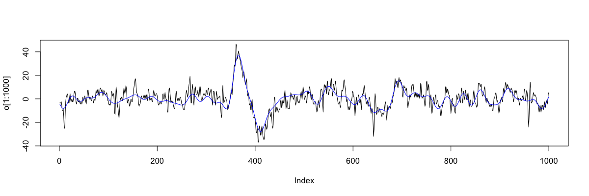

# Outputs

_Commands to rewrite EDFs and signals/annotations in other formats_

These commands write data out of Luna, either as modified EDFs or as plain-text representations of signals and annotations. [`WRITE`](outputs.md#write) saves the current in-memory EDF (with any applied filters, masks or manipulations) to a new file. [`MATRIX`](outputs.md#matrix) exports signal values and annotations to a text table; [`HEAD`](outputs.md#head) shows a small snippet of signal data for quick inspection. `DUMP-RECORDS` and [`RECS`](outputs.md#recs) expose the underlying EDF record structure. [`SEGMENTS`](outputs.md#segments) lists continuous intervals within a discontinuous EDF+. `ALIGN-SCAN` audits alignment between EDF records, epoch boundaries and staging annotations. [`SEDF`](outputs.md#sedf) generates a compact summary EDF intended for visualization.

|Command | Description | 
|---|---|
| [`WRITE`](#write)    | Write a new EDF file | 
| [`MATRIX`](#matrix)  | Dump signals (and annotations) to a file  |  
| [`HEAD`](#head)      | Show a small interval of signal data |
| [`DUMP-RECORDS`](#dump-records)| Dump annotations and signals, by EDF record | 
| [`RECS`](#recs)| Dump basic information on EDF record structure | 
| [`SEGMENTS`](#segments)| Dump (discontinuous EDF+) intervals |
| [`ALIGN-SCAN`](#align-scan)| Scan epoch/record/staging alignment |
| [`SEDF`](#sedf) | Generate a "summary EDF" |

## WRITE

_Save a (modified) EDF file to disk_

Writes a new EDF to disk, that will reflect any
[manipulation](manipulations.md), [filtering](fir-filters.md), or [masking](masks.md), etc, that
has been applied.

<h3>Methods</h3>

The [`WRITE`](outputs.md#write) command writes the current in-memory EDF (including any modifications applied by prior commands) to a new EDF or EDF+ file on disk. Before writing, any pending mask is applied via an implicit restructure step, so the output file contains only the epochs and samples that remain after filtering, masking, or other manipulations. The output filename is constructed from the original EDF filename by stripping the existing extension and, optionally, appending a user-supplied tag (via `edf-tag`) or replacing the name entirely (via `edf`); a target directory can be specified with `edf-dir`, which is created automatically if it does not exist. If the `edfz` option is set, the output is written as a gzip-compressed EDF (`.edf.gz`) using a streaming gzip interface. If `sample-list` is specified, the new filename and subject ID are appended to the named sample-list file, optionally including linked annotation file paths when `with-annots` is given. If the recording is discontinuous after restructuring, the output is written as an EDF+D unless `force-edf` is specified, which coerces the output to a continuous EDF format.

<h3>Parameters</h3>

| Parameter | Example | Description |
| --- | --- | --- |
| `sig` | `sig=C3` | Signal to output (only one)  |
| `edf-dir` | `edf-dir=edfs/` | Set folder where new EDFs should be written |
| `edf-tag` | `edf-tag=v2` | Add a tag to each new EDF filename |
| `edf`     | `edf=f1`     | Write to edf `f1.edf` | 
| `sample-list` | `sample-list=v2.lst` | Name of the new sample-list |
| `edfz` | `edfz` | Write the output as a gzipped EDF (typically `.edf.gz`) |

<h3>Output</h3>

No formal output, other than a message to the log and one or more new EDFs. 

If the `edfz` option is specified, Luna writes a gzipped EDF rather
than an uncompressed EDF.  In current Luna this is a plain gzip-based
format: no separate `.idx` file is created, and gzipped EDFs are read
by streaming the whole compressed file rather than by random access
into an indexed compressed representation.

<h3>Example</h3>

To write a set of new EDFs that (for example) have been masked,
filtered and retaining only one signal, given the commands in a file,
say `cmd.txt` as follows:


```
EPOCH                       % Epoch the signals

MASK epoch=1-10             % Set to retain only the first 10 epochs

RESTRUCTURE                 % Apply the above mask 

SIGNALS keep=EEG            % Only retain the EEG signal

FILTER
 ... bandpass=0.5,4.5       % Apply a bandpass filter to the signal
 ... ripple=0.01
 ... tw=0.5 

WRITE
 ... edf-dir=newx/          % Write new EDFs, to the folder newx/
 ... edf-tag=v2             % add a 'v2' tag to each EDF
 ... sample-list=newx.lst   % create a new sample list pointing to the new EDFs
```

Running this set of commands: 

```
luna s.lst < cmd.txt
```

will produce a new folder `newx` with three new EDFs:

```
ls newx
```

```
learn-nsrr01-v2.edf	learn-nsrr02-v2.edf	learn-nsrr03-v2.edf
```

That is, the new EDF filenames have a `-v2` tag added. The folder 
(which must be specified with a `/` character in the `edf-dir`
argument) will be created if it does not exist. In addition, Luna
creates a new [_sample-list_](../luna/args.md#sample-lists) called
`newx.lst` that points to these new EDFs:

```
cat newx.lst 
```

```
nsrr01	      newx/learn-nsrr01-v2.edf
nsrr02	      newx/learn-nsrr02-v2.edf
nsrr03	      newx/learn-nsrr03-v2.edf
```

Note that Luna _appends_ each item to this list, and so you may want
to delete it before running the command, if it already exists. 

We can use the new sample list to check the properties of the new set of EDFs:

```
luna newx.lst -s DESC
```

As expected, we do in fact see that the EDFs are now only 10 epochs in
length and contain only a single channel: (here, showing output only
for the first EDF):

```
EDF filename      : newx/learn-nsrr01-v2.edf
ID                : nsrr01
Clock time        : 21:58:17 - 22:03:17
Duration          : 00:05:00
# signals         : 1
# EDF annotations : 1
Signals           : EEG[125]
```

Finally, to check the filtering, we can use the [`MATRIX`](#matrix) command to 
dump the raw signals to a file.  First from the original EDF (for the first 10 epochs only): 

```
luna s.lst 1 -s 'MASK epoch=1-10 & RE & MATRIX sig=EEG file=old.txt'
```

```
luna newx.lst 1 -s 'MATRIX file=new.txt'
```


In R

```
o <- scan("old.txt",skip=1)
```

```
n <- scan("new.txt",skip=1)
```


```
plot( o[1:1000] , type="l" ) 
lines( n[1:1000] , col="blue" ) 
```

{width="100%"}


## MATRIX

_Dumps signal information to a file_

For one or more signals of similar sampling rates, this command
generates a text file containing the raw signal data.

<h3>Methods</h3>

The [`MATRIX`](outputs.md#matrix) command exports raw signal data for one or more channels to a tab-delimited text file. All specified channels must share the same sampling rate. Data are written epoch by epoch; if the recording has not been epoched, Luna applies a default 30-second epoch. In standard format, each output row corresponds to a single sample point and contains columns for the subject ID (`ID`), epoch number (`E`), elapsed whole seconds (`S`), within-record sample index (`SP`), elapsed seconds as a floating-point value (`T`), and then one column per channel. Optionally, a clock-time column (`HMS`) in _hh:mm:ss_ format can be appended. If `annot` is specified, additional binary columns are appended indicating whether each named annotation is present at each sample point. The `min` option suppresses the header row and all lead columns, producing only the raw signal values.

<h3>Parameters</h3>

| Parameter | Example | Description |
| --- | --- | --- |
| `file` | `file=signals.txt` | Required parameter, to specify the filename for the output | 
| `sig` | `sig=C3,C4` | Restrict output to these signals/channels |
| `hms`  | `hms` | Add a clock-time column in _hh:mm:ss_ format |
| `hms2` | `hms2` | Add a clock-time column in _hh:mm:ss:microsecond_ format |
| `annot` | `annot=X,Y` | Add columns with values 1/0 to indicate the presence/absence of that annotation |
| `min`  | `min` | Minimal output to show only signal information (no headers or lead columns) | 


<h3>Output</h3>

All output is written to a text file as specified by the `file` parameter.  For example:

```
ID    E   S   SP   T           EOG-L      EOG-R     EMG       EEG      
id01  1   0   0    0           -6.07448   4.18193   31.044    0.763126  
id01  1   0   1    0.00390625  -0.030525  2.83883   52.7778   11.5079   
id01  1   0   2    0.0078125   7.23443    2.22833   45.3297   23.0464   
id01  1   0   3    0.0117188   11.569     2.10623   23.4127   29.4567   
id01  1   0   4    0.015625    12.9731    2.16728   8.82173   31.2882  
id01  1   0   5    0.0195312   12.79      2.22833   -4.73138  30.7387  
id01  1   0   6    0.0234375   12.1795    2.28938   -13.6447  29.6398  
id01  1   0   7    0.0273438   11.6911    2.22833   -14.1331  28.663   
id01  1   0   8    0.03125     11.3858    2.22833   -11.8742  28.0525  
id01  1   0   9    0.0351562   11.2027    2.16728   -13.4615  27.6862  
... cont'd ...
```

Here, the first five columns are:

- `ID`: individual/EDF ID
- `E`: epoch number
- `S`: elapsed time in seconds (integer)
- `SP`: sample point in the EDF record
- `T`: elapsed time in seconds

The subsequent columns represent the channels in the EDF (or those
specified by the `sig` parameter).

If the `min` (or `minimal`) parameter is specified, then the header
and the first five columns are omitted.

If the `hms` parameter is specified, then an additional column `HMS`
is added, which is the clock-time in _hh:mm:ss_ format. If `hms2` is
specified instead of `hms`, this field is printed with micro-second
resolution.

If the `annot` parameter is specified, additional columns are added
with the same names as the annotations specified, e.g. `annot=X,Y`
will add two columns `X` and `Y`.  For each sample point, these
columns will have a `0` or `1` value to indicate whether or not that
annotation was present at that point.

## HEAD

_Writes a small amount of signal data to standard output_ 

This command is useful to sanity-check signals and epochs, by
outputting just a small amount of data (e.g. a few seconds worth)
for one or more channels, for a given epoch.

If multiple channels are output, they must all have the same sample
rate.

<h3>Methods</h3>

The [`HEAD`](outputs.md#head) command writes a brief excerpt of signal data to standard output for rapid inspection of channel values, units, and scaling. It extracts data from a single specified epoch (defaulting to the first epoch) for one or more channels, which must all share the same sampling rate. Each output row corresponds to one sample point and contains three lead columns — `T` (elapsed seconds from the start of the EDF), `SEC` (elapsed seconds within the current epoch segment), and `SP` (integer sample index within the segment, zero-based) — followed by one column per requested channel. If the `sec` parameter is given, output is truncated to that duration in seconds rather than spanning the full epoch.

<h3>Parameters</h3>

| Parameter | Example | Description |
| --- | --- | --- |
| `sig` | `C3,C4` | Show these channels (default: all channels) | 
| `epoch` | `100` | Show epoch 100 (default: first epoch) |
| `sec`  | `0.5` | Only show a fixed duration (secs) of the epoch (default: whole epoch) |

<h3>Output</h3>

All output is sent to the console (`stdout`) and so can be redirected,
etc.  Output is tab-delimited; the first three columns are `T`
(elapsed seconds from start of EDF), `SEC` (elapsed seconds in this
segment of data) and `SP` (sample point in this segment of data,
starting at 0).  The subsequent columns are for the requested channels.


<h3>Example</h3>

To output 0.05 seconds' worth of data for two EOG channels, from a particular epoch of an EDF (here, 222):

```
luna s.lst 1 -s HEAD epoch=222 sig=EOG_L,EOG_R sec=0.05 > o.txt
```
```
T          SEC         SP      EOG_L       EOG_R
6630       0           0    -8.21123    -6.37973
6630       0.00390625  1    -7.72283    -5.52503
6630.01    0.0078125   2    -6.68498    -4.30403
6630.01    0.0117188   3    -5.76923    -3.20513
6630.02    0.015625    4    -4.91453    -2.71673
6630.02    0.0195312   5    -3.26618    -2.47253
6630.02    0.0234375   6   -0.457875    -1.98413
6630.03    0.0273438   7     2.28938    -1.31258
6630.03    0.03125     8     3.93773   -0.763126
6630.04    0.0351562   9     4.30403  -0.0915751
6630.04    0.0390625   10    4.18193    0.763126
6630.04    0.0429688   11    3.99878     1.43468
6630.05    0.046875    12    3.87668     1.67888
```


!!! note
    Note that `T` may have limited numerical precision in the output.
    This command is intended for quick reviews of signals (i.e. to see
    units, scales, etc). 

## DUMP-RECORDS

_Writes detailed annotation and signal data to standard output_

This command is unlikely to be of great utility to most users.  It
dumps detailed information about the signals and annotations to
`stdout`.

<h3>Methods</h3>

The `DUMP-RECORDS` command iterates over every retained EDF record and writes detailed annotation and signal data to standard output. For each record, it prints a record header identifying the record number, the total and retained record counts, and the record duration. If annotation output is not suppressed with `no-annots`, it then prints all Luna interval annotations overlapping that record (name, instance ID, interval, and typed key-value pairs), followed by any EDF+ annotation channel content. If signal output is not suppressed with `no-signals`, it prints each data channel's sample values for that record as tab-delimited rows, with columns for the signal name, record index, sample fraction, absolute timepoint, elapsed seconds, and the physical signal value.

<h3>Parameters</h3>

| Parameter | Description |
| --- | --- |
| `no-signals` | Do not show signal data |
| `no-annots` | Do not show annotation information |

<h3>Output</h3>

All output is sent to the console (`stdout`) and so can be redirected,
etc.  Output is organized by EDF record, e.g.:

```
Record 1 of 40920 total (30 retained)
```
followed by Luna annotation information:
```
Generic Annotations-----------------------
wake    wake    0.00->30.00     wake[flag]=.
```
and then any EDF+ annotations:
```
EDF Annotations--------------------------
Signal 15 EDF Annotations
<0||(time-stamp, secs)>
```
Signals are then displayed, organized by record (in this instance, 1 second); the
first signal `SaO2` has a sample rate of 1 Hz, and so there is only one entry per record:
```
s = 0
interval = 0-999999999999
RECORD-DUMP     SaO2    rec=0   1/1     0       0       95.115587
```
Likewise for the second signal `PR`:
```
s = 1
interval = 0-999999999999
RECORD-DUMP     PR      rec=0   1/1     0       0       74.222934
```
In this example, the third signal (`s=2`) is `EEG(sec)`, which has a sample rate of 125Hz (and so 125 entries here):
```
s = 2
interval = 0-999999999999
RECORD-DUMP     EEG(sec)        rec=0   1/125   0       0       -0.49019608
RECORD-DUMP     EEG(sec)        rec=0   2/125   8000000000      0.008   1.4705882
RECORD-DUMP     EEG(sec)        rec=0   3/125   16000000000     0.016   6.372549
RECORD-DUMP     EEG(sec)        rec=0   4/125   24000000000     0.024   3.4313725
RECORD-DUMP     EEG(sec)        rec=0   5/125   32000000000     0.032   -10.294118
RECORD-DUMP     EEG(sec)        rec=0   6/125   40000000000     0.04    -8.3333333
RECORD-DUMP     EEG(sec)        rec=0   7/125   48000000000     0.048   1.4705882
RECORD-DUMP     EEG(sec)        rec=0   8/125   56000000000     0.056   -0.49019608
RECORD-DUMP     EEG(sec)        rec=0   9/125   64000000000     0.064   -0.49019608
RECORD-DUMP     EEG(sec)        rec=0   10/125  72000000000     0.072   7.3529412
RECORD-DUMP     EEG(sec)        rec=0   11/125  80000000000     0.08    11.27451
... cont'd ...
```
The columns for signals are

- a standard `RECORD-DUMP`
- signal name
- record number (starting at 0)
- the sample point per record (e.g. `1/125`, `2/125`, etc)
- the starting time for that sample point in [time units](../luna/args.md#time-points)
- time in seconds
- the value of the signal

For most purposes, the [`MATRIX`](#matrix) command will likely be an
easier route to achieve direct access to the signals in an EDF.  (In
fact, this command was in large part only added to assist in debugging
during Luna development, but is described here for completeness.)


## RECS

_Dumps basic information about record structure to standard output_

<h3>Methods</h3>

The [`RECS`](outputs.md#recs) command iterates over all retained EDF records in the current in-memory representation and writes one line per record to standard output. Each line begins with the literal label [`RECS`](outputs.md#recs), followed by the subject ID, the sequential record index within the in-memory EDF (one-based), the corresponding record number within the original on-disk EDF file, a fraction expressing retained versus total record counts, the start–stop interval of the record in seconds, and — when the data have been epoched — the epoch number and epoch interval that the record belongs to.

<h3>Parameters</h3>

None.

<h3>Output</h3>

Text written to the log/console; this command does not generate any
output through Luna's standard output mechanism.


<h3>Example</h3>


Taking the first [tutorial EDF](../tut/tut1.md) (where EDF is one second):

```
luna s.lst 1 -s SUMMARY
```

```
Rec. dur. (s)  : 1
```

we extract a subset of the data (epochs 5 through 8, defaulting to 30-second epochs) and then call the [`RECS`](outputs.md#recs) command:

```
luna s.lst 1 -s 'MASK epoch=5-8 & RECS'
```

The output (to the console) is as follows (abridged):

```
RECS	nsrr01	1	121	120/40920	120.00->121.00	 5;120.00->150.00
RECS	nsrr01	2	122	120/40920	121.00->122.00	 5;120.00->150.00
RECS	nsrr01	3	123	120/40920	122.00->123.00	 5;120.00->150.00
RECS	nsrr01	4	124	120/40920	123.00->124.00	 5;120.00->150.00
RECS	nsrr01	5	125	120/40920	124.00->125.00	 5;120.00->150.00

...

RECS	nsrr01	115	235	120/40920	234.00->235.00	 8;210.00->240.00
RECS	nsrr01	116	236	120/40920	235.00->236.00	 8;210.00->240.00
RECS	nsrr01	117	237	120/40920	236.00->237.00	 8;210.00->240.00
RECS	nsrr01	118	238	120/40920	237.00->238.00	 8;210.00->240.00
RECS	nsrr01	119	239	120/40920	238.00->239.00	 8;210.00->240.00
RECS	nsrr01	120	240	120/40920	239.00->240.00	 8;210.00->240.00
```


The columns are:

- [`RECS`](outputs.md#recs) command label
- current EDF ID
- record number with respect to current in-memory EDF representation (always starts 1)
  - record number with respect to original EDF file (starting 121, i.e. the start of the fifth epoch)
- number of records in the current _in-memory_ EDF / total number of records in the _on-file_ EDF
- start and stop of this record (in seconds)
- (for epoched data) the epoch number (e.g. 5-8) that record belongs to, and the epoch start/stop (seconds)

Four 30-second epochs (5,6,7 and 8) implies 120 seconds; the start/stop times correspond to this, as expected: 240-121+1 = 120.

## SEGMENTS

_Reports the number of contiguous segments in an EDF/EDF+_

Identifies and reports on the contiguous segments in a file; this is
primarily of use for EDF+ files with _discontinuous_ signal data.
Internally, Luna represents signal data as equivalent to an EDF+ after
any [masks](masks.md#mask) that remove epochs have been applied;
therefore, the [`SEGMENTS`](outputs.md#segments) command can also be used in this
context too.

<h3>Methods</h3>

The [`SEGMENTS`](outputs.md#segments) command identifies and reports all contiguous intervals within the current recording. For a standard continuous EDF, a single segment spanning the full recording is reported. For a discontinuous EDF+ (or after masking and restructuring), the command traverses the internal time-track record by record, detecting gaps where the difference between consecutive record start times exceeds the nominal record duration by more than a small tolerance. Each detected segment is reported with its start and stop times in seconds and in _hh:mm:ss_ format, along with its duration in seconds, minutes, and hours. If the `annot` option is given, Luna additionally creates in-memory annotations marking each segment and each intervening gap.

<h3>Parameters</h3>

| Parameter | Description |
| --- | --- |
| `annot` | Add annotations to mark segment/gap boundaries |


<h3>Output</h3>

Basic EDF header information (strata: _none_)

| Variable | Description |
| --- | --- |
| `NR`    | Number of segments |


Per-segment information  (strata: `SEG`)

| Variable | Description |
| --- | --- |
|`START` | Segment start (seconds) |
|`STOP` | Segment stop (seconds) |
|`START_HMS` | Segment start (_hh:mm:ss_) |
|`STOP_HMS` | Segment stop  (_hh:mm:ss_) |
|`DUR_HR` | Segment duration (hours) |
|`DUR_MIN` | Segment duration (minutes) |
|`DUR_SEC` | Segment duration (seconds) |


<h3>Example</h3>

Taking the first tutorial EDF, which is a continuous EDF file:

```
luna s.lst 1 -s SEGMENTS

```

We'd expect just a single segment to be reported, and this is indeed what we see:

```
destrat out.db +SEGMENTS
```
```
ID	NSEGS
nsrr01	1
```
That 'segment' spans the entire length of the recording:
```
destrat out.db +SEGMENTS -r SEG
```
```
ID      SEG  DUR_HR   DUR_MIN  DUR_SEC  START  START_HMS  STOP   STOP_HMS
nsrr01  1    11.3667  682      40920     0     21.58.17   40920  09.20.17
```

In contrast, if we break up the data (e.g. using the
[`MASK`](masks.md#mask) command, then the data are implicitly
represented as a discontinuous EDF+ after [restructuring](masks.md#restructure):


```
luna s.lst 1 -t out -s 'MASK epoch=9-12,22-23,70-74 & RE & SEGMENTS'
```

!!! hint
    Note, purely to illustrate different options,  here we used Luna's `-t` output option rather than `-o`
    

Now the [`SEGMENTS`](outputs.md#segments) command shows the expected three segments:
```
cat out/nsrr01/SEGMENTS.txt
```

```
ID	NSEGS
nsrr01	3
```
with the corresponding times:
```
cat out/nsrr01/SEGMENTS-SEG.txt 
```
```
ID     SEG  DUR_HR     DUR_MIN  DUR_SEC  START  START_HMS  STOP  STOP_HMS
nsrr01 1    0.0333333  2        120      240    22.02.17   360   22.04.17
nsrr01 2    0.0166667  1        60       630    22.08.47   690   22.09.47
nsrr01 3    0.0416667  2.5      150      2070   22.32.47   2220  22.35.17
```

If annotations are added, the default labels are `segment` and `gap` (with the instance ID
reflecting the number of each).  These labels can be changed with the special variables `annot-segment` and `annot-gap` (i.e.
if there is a pre-existing annotation with that label:

```
luna s.lst annot-gap=G -s 'SEGMENTS annot & WRITE-ANNOTS file=^.annot'
```

See [this vignette](../vignettes/merge.md) for an example of using `SEGMENTS annot` to track changes from an EDF+D to an EDF file.


## ALIGN-SCAN

_Scan for epoch/record/staging alignment edge cases_

`ALIGN-SCAN` checks whether EDF records, epoch boundaries and staging-like annotation starts are mutually aligned. This is primarily a diagnostic command to run before stage-based masking, restructuring or export workflows where record/epoch drift can create ambiguous results.

<h3>Methods</h3>

The `ALIGN-SCAN` command first determines which annotation labels to treat as staging labels (default: `N1,N2,N3,R,W,?,L,U,M`, or `N1,N2,N3,R,W` with `minimal`). If no epoching is active, Luna applies a temporary default 30-second epoch grid for this scan (`EPOCH_AUTO=1`). It then summarizes EDF structure (record duration, retained records, segments and gaps), checks whether epoch starts lie on record boundaries, checks whether annotation starts lie on epoch boundaries, and counts ambiguous epochs/records (e.g. epochs spanning multiple stage labels). For EDF+D, it also reports annotations that fall in or span discontinuity gaps.

By default, the command also creates derived in-memory annotations (prefix `align_`) to mark flagged regions; this can be disabled with `annot=F`.

<h3>Parameters</h3>

| Parameter | Example | Description |
| --- | --- | --- |
| `annots` | `annots=N2,R,W` | Comma-separated annotation labels to check |
| `minimal` | `minimal` | Use the minimal label set `N1,N2,N3,R,W` |
| `annot` | `annot=F` | Disable (or enable) derived issue annotations (default is on) |
| `annot-prefix` | `annot-prefix=viz_` | Prefix used for derived annotations |
| `annot-epoch` | `annot-epoch` | Also annotate each epoch as `<annot-prefix>EPOCH` |
| `annot-rec` | `annot-rec` | Also annotate each retained record as `<annot-prefix>REC` |
| `verbose` | `verbose` | Emit per-epoch (`E`) and per-annotation-event (`ANNOT/ANN_N`) detail tables |

<h3>Output</h3>

Summary information (strata: _none_)

| Variable | Description |
| --- | --- |
| `OK` | 1 if no warning conditions were detected, else 0 |
| `EDF_TYPE` | EDF type string (EDF, EDF+C, EDF+D) |
| `REC_DUR` | EDF record duration (seconds) |
| `NRECS` | Number of retained records |
| `TOT_DUR` | Total retained duration (seconds) |
| `NSEGS` | Number of contiguous segments |
| `NGAPS` | Number of discontinuity gaps |
| `EPOCH_DUR` | Epoch duration (seconds) |
| `EPOCH_INC` | Epoch step (seconds) |
| `EPOCH_OFFSET` | Effective epoch-grid offset (seconds) |
| `EPOCH_N` | Number of epochs |
| `EPOCH_AUTO` | 1 if default 30-second epochs were auto-applied |
| `EPOCH_ALIGN_ACTIVE` | 1 if `EPOCH align` is currently active |
| `ANN_FOUND` | Annotation labels from `annots` that were found |
| `ANN_MISSING` | Annotation labels from `annots` that were missing |
| `ANN_N` | Total matched staging annotation instances |
| `ANN_STARTS` | Distinct matched annotation start time-points |
| `REC_DIVIDES_EPOCH` | 1 if record duration evenly divides epoch duration |
| `EPOCH_ON_REC` | Epoch starts on record boundaries |
| `EPOCH_OFF_REC` | Epoch starts between record boundaries |
| `EPOCH_ON_REC_PCT` | Percentage of epochs on record boundaries |
| `ANN_AT_EPOCH` | Annotation starts on epoch boundaries |
| `ANN_OFF_EPOCH` | Annotation starts between epoch boundaries |
| `ANN_AT_EPOCH_PCT` | Percentage of annotation starts on epoch boundaries |
| `ALIGN_OFFSET` | Offset (seconds from EDF start) that `EPOCH align` would use |
| `ALIGN_WOULD_FIX_DRIFT` | 1 if applying `EPOCH align` would resolve all annotation-start drift |
| `EPOCH_ONE_STAGE` | Epochs with one stage label |
| `EPOCH_NO_STAGE` | Epochs with no overlapping stage annotation |
| `EPOCH_MULTI_STAGE` | Epochs with more than one overlapping stage label |
| `REC_AMBIG` | Records shared between epochs with different stage labels |
| `ANN_IN_GAP` | Annotations entirely within EDF+D gaps |
| `ANN_SPAN_GAP` | Annotations spanning segment/gap boundaries |
| `WARN_REC_NOT_DIV` | 1 if epoch duration is not an exact multiple of record duration |
| `WARN_EPOCH_OFF_REC` | 1 if some epoch starts are off record boundaries |
| `WARN_STAGE_DRIFT` | 1 if some annotation starts are off epoch boundaries |
| `WARN_MULTI_STAGE` | 1 if some epochs span multiple stage labels |
| `WARN_GAP_ANNS` | 1 if annotations fall in/span EDF+D gaps |

Verbose tables (when `verbose` is set)

| Strata | Description |
| --- | --- |
| `E` | Per-epoch detail (`START`, `STOP`, [`STAGE`](hypnograms.md#stage), `N_STAGES`, `ON_REC`, `REC_START`, `REC_STOP`, `NRECS`) |
| `ANNOT,ANN_N` | Per-annotation-event detail (`START`, `STOP`, `AT_EPOCH`, [`EPOCH`](epochs.md#epoch), `OFF_SEC`, `REC_START`, `REC_STOP`) |

<h3>Example</h3>

Run on the current epoch grid:

```
luna s.lst -o align.db -s 'EPOCH & ALIGN-SCAN minimal'
```

Add verbose detail and custom stage labels:

```
luna s.lst -o align.db -s 'EPOCH & ALIGN-SCAN annots=N2,R,W verbose'
```

Emit extra visualization annotations for epochs and records:

```
luna s.lst -s 'EPOCH & ALIGN-SCAN annot-epoch annot-rec annot-prefix=viz_'
```
## SEDF

_Generates a summary-EDF and writes it to disk_

For data channels only (i.e. not any EDF+ annotation channels), the [`SEDF`](outputs.md#sedf) command
creates a "summary" EDF

<h3>Methods</h3>

The [`SEDF`](outputs.md#sedf) command generates a compact summary EDF (with a `.sedf` extension) intended for rapid visualization of long recordings. It iterates over all epochs of each requested data channel and computes epoch-level summary statistics: for oscillatory channels (EEG, EMG, EOG, ECG, or reference), the three Hjorth parameters — activity (`H1`), mobility (`H2`), and complexity (`H3`) — are computed per epoch; for all other channel types, the epoch mean (`M`), minimum (`L`), and maximum (`U`) are computed. The resulting summary EDF has one record per epoch with one sample per summary channel. Channel names in the output follow the pattern `H1_XYZ`, `H2_XYZ`, `H3_XYZ` (for oscillatory channels) or `M_XYZ`, `L_XYZ`, `U_XYZ` (for others), where `XYZ` is the original channel label. The output filename is derived from the input EDF filename by replacing its extension with `.sedf`; an alternative directory can be specified with `sedf-dir`.

| Option | Description |
| ----- | ----- |
| `sig` |  Signals to output (if not given, all signals) |
| `sedf-dir` | Directory for SEDFs (if not working directory)  |

This creates an EDF that contains epoch-level summary statistics of the original EDF. That is, if the original EDF has 1000 30-second epochs, the SEDF will comprise only 1000 records, where each record has a duration of 30 seconds, and contains only a single value.  For a given channel, e.g. `CZ`, the [`SEDF`](outputs.md#sedf) will contain three new channels, depending on the _type_ of that channel.  For a channel called `XYZ` in the original:

 - for oscillatory signals (e.g. EEG, EMG, etc), the three Hjorth parameters: `XYZ_H1`, `XYZ_H2` and `XYZ_H3`
 - for other signals (e.g. light or heart rate, etc), the mean, min and max: `XYZ_M`, `XYZ_L`, `XYZ_U`

The idea is that this SEDF file is an effective _thumbnail_ for the EDF, which can be quickly loaded and rendered, e.g. by a viewer application.   
