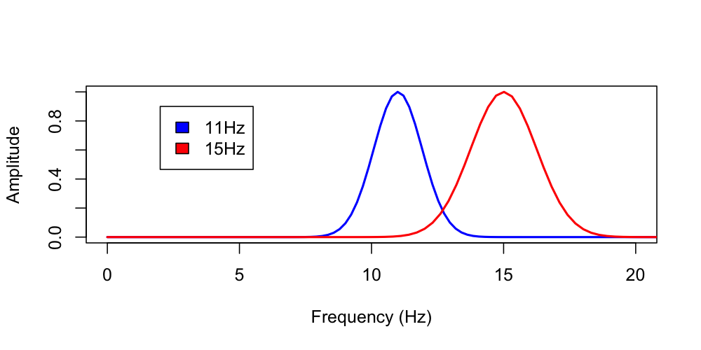

# Spectral and other time/frequency analyses

_Methods for spectral and other time/frequency analyses, including
power spectral density estimation_

|Command |Description | 
|---|---|
| [`PSD`](#psd)         | Welch's method for power spectral density estimation |
| [`MTM`](#mtm)         | Multi-taper method for power spectral density estimation |
| [`FFT`](#fft)         | Basic discrete Fourier transform of a signal |
| [`IRASA`](#irasa)     | Irregular-resampling auto-spectral analysis |
| [`HILBERT`](#hilbert) | Hilbert transform |
| [`CWT`](#cwt)         | Continuous wavelet transform |
| [`CWT-DESIGN`](#cwt-design) | Complex Morlet wavelet properties |
| [`EMD`](#emd)        | Empirical mode decomposition |
| [`MSE`](#mse)         | Multi-scale entropy statistics | 
| [`LZW`](#lzw)         | LZW compression (information content) index |
| [`1FNORM`](#1fnorm)         | Remove the _1/f_ trend from a signal | 
| [`TV`](#tv)                 | Total variation denoiser |
| [`ACF`](#acf) | Autocorrelation function |

## PSD

_Estimates a signal's power spectral density (PSD)_

This command uses [Welch's
method](https://en.wikipedia.org/wiki/Welch%27s_method) to estimate
power spectra and band power for one or more signals.  As well as
estimates for the entire signal (possibly following
[masking](masks.md), etc), this command optionally provides
epoch-level estimates.

Internally, this command operates on an epoch-by-epoch basis:
e.g. taking 30 seconds of signal, and using Welch's method of
overlapping windows (by default, 4-second windows with 2-second
overlap) to estimate the power spectra via FFT.  By default, intervals
are windowed using a 50% tapered Tukey window, although [Hann and
Hamming](https://en.wikipedia.org/wiki/Window_function#Hann_and_Hamming_windows)
windows can also be specified.  If epoch-level output is requested,
e.g. with the `epoch` option, then these spectra are also written to
the output database.  The _overall_ estimate of the PSD is the average
of the epoch-level estimates.


<h3>Parameters</h3>

| Parameter | Example | Description |
| ---- | ---- | ---- |
| `spectrum` | `spectrum` | Estimate power spectra as well as band power |
| `max`     | `max=30` | Upper frequency range to report for spectra (default is 20 Hz) |
| `epoch` | `epoch` | Output epoch-level band power estimates |
| `epoch-spectrum` | `epoch-spectrum` | Output epoch-level power spectra |
| `dB` | `dB` | Give power in dB units |
| `peaks` | `peaks` | Reports statistics on extreme peaks (spikes) ( see section below for more options/details ) | 
| `slope` | `30,45` | Estimate spectral slope ( see section below for more options/details ) | 
| `th` | 3 | Remove epochs that are +/- 3 SD units outliers before calculating mean/median/SD over epochs |
| `median` | | Compute median (not mean) over epochs |
| `sd` | | Report standard deviation for epoch-to-epoch variability in power |

In addition to the primary parameters above, there are a number of
other, more detailed parameters (that can probably be ignored by most
users), as described in this table:

| Parameter | Example | Description |
| ---- | ---- | ---- |
| `segment-sec`     | `segment-sec=8` | Set window size for Welch's method (default is 4 seconds) |
| `segment-overlap` | `segment-overlap=4` | Set window overlap for Welch's method (default is 2 seconds) |
| `center`     | `center` | First mean-center each epoch (or `centre`) |
| `no-average` | `no-average` | Do not average adjacent points in the power spectra |
| `tukey50`    | `tukey50` | Apply Tukey 50% window (default) |
| `hann`       | `hann` | Apply a Hann window function |
| `hamming`    | `hamming` | Apply a Hamming window function |
| `no-window`  | `no-window` | Do not apply any window function |
| `segment-median` | | Use median (not mean) over Welch segments (to get epoch estimates) |
| `segment-sd` | | Report inter-segment standard deviation as well as mean (or median) per epoch |


<h6>Simple ultradian/power dynamics statistics</h6>

| Parameter | Example | Description |
| ---- | ---- | ---- |
| `dynamics` | | Report inter-segment standard deviation as well as mean (or median) per epoch |


!!! warn 
    If the `EPOCH` size is set to a small value (i.e. under 4
    seconds) you will need to adjust the parameters of Welch's method
    accordingly.

<h6>Cache options</h6>

| Parameter | Example | Description |
| --- | --- | --- |
| `cache-metrics` | `cache-metrics=c1`  | Cache `PSD` by `F` and `CH` (e.g. for `PSC`) |


<h3>Band definitions</h3>

Luna uses the following band definitions: 

- `SLOW` (0.5 to 1 Hz)
- `DELTA` (1-4 Hz)
- `THETA` (4-8 Hz)
- `ALPHA` (8-12 Hz)
- `SIGMA` (12-15 Hz)
- `BETA` (15-30 Hz) 
- `GAMMA` (30+ Hz).  

!!! hint
    These can be modified by setting [special variables](../luna/args.md#spectral-power-bands) either via the
    command-line or in a [parameter file](../luna/args.md#parameter-files).


In addition, `SLOW_SIGMA` and `FAST_SIGMA` are defined as 12-13.5 Hz
and 13.5-15 Hz respectively.  

<h3>Outputs</h3>


Channel-level information (strata: `CH`)

| Variable | Description |
| ---- |----- | 
| `NE` | Number of epochs included | 


Spectral band power (strata: `B` x `CH`)

| Variable | Description |
| ---- |----- | 
| `PSD` | Absolute spectral power |
| `RELPSD` | Relative spectral power |

Spectral power by frequency bin (option: `spectrum`, strata: `F` x `CH`)

| Variable | Description |
| ---- |----- | 
| `PSD` | Absolute spectral power |
| `PSD_SD` | Standard deviation (within epoch) of absolute spectral power |


Epoch-level spectral band power (option: `epoch`, strata: `E` x `B` x `CH`)

| Variable | Description |
| ---- |----- | 
| `PSD` | Absolute spectral power |
| `RELPSD` | Relative spectral power |

Epoch-level spectral power by frequency bin (option: `epoch-spectrum`, strata: `E` x `F` x `CH`)

| Variable | Description |
| ---- |----- | 
| `PSD` | Absolute spectral power |


<h3>Example</h3>

Here we calculate band power and the PSD for
[tutorial](../tut/tut1.md) individual `nsrr01`, for all N2 and all N3
sleep separately.  Note, here we run Luna twice but put all output in
the same `out.db` database, by using `-a` to append for the second
command, rather than `-o`.  We also add a `TAG` command to
disambiguate the output:

```
luna s.lst 2 sig=EEG -o out.db -s 'EPOCH & MASK ifnot=NREM2 & RE & TAG SS/N2 & PSD spectrum'
luna s.lst 2 sig=EEG -a out.db -s 'EPOCH & MASK ifnot=NREM3 & RE & TAG SS/N3 & PSD spectrum'
```
Here we see that all output for `PSD` has an additional `SS` (sleep stage) stratifier:
```
destrat out.db
```
```
--------------------------------------------------------------------------------
distinct strata group(s):
  commands      : factors           : levels        : variables 
----------------:-------------------:---------------:---------------------------
  [EPOCH]       : .                 : 1 level(s)    : DUR INC NE
                :                   :               : 
  [RE]          : .                 : 1 level(s)    : DUR1 DUR2 NR1 NR2
                :                   :               : 
  [MASK]        : EPOCH_MASK        : 2 level(s)    : N_MASK_SET N_MASK_UNSET N_MATCHES
                :                   :               : N_RETAINED N_TOTAL N_UNCHANGED
                :                   :               :
                :                   :               : 
  [PSD]         : CH SS             : 2 level(s)    : NE
                :                   :               : 
  [PSD]         : F CH SS           : 82 level(s)   : PSD
                :                   :               : 
  [PSD]         : B CH SS           : 20 level(s)   : PSD RELPSD
                :                   :               : 
----------------:-------------------:---------------:---------------------------
```

The number of epochs of N2 and N3 sleep respectively:
```
destrat out.db +PSD -r CH SS
```
```
ID        CH     SS    NE
nsrr02	  EEG	 N2    399
nsrr02	  EEG	 N3    185
```

Here we tabulate relative power for N2 and N3 sleep:
```
destrat out.db +PSD -r CH B -c SS -v RELPSD -p 2 
```
```
ID       B           CH     RELPSD.SS.N2  RELPSD.SS.N3
nsrr02   SLOW        EEG    0.18          0.21
nsrr02   DELTA       EEG    0.50          0.61
nsrr02   THETA       EEG    0.15          0.10
nsrr02   ALPHA       EEG    0.07          0.03
nsrr02   SIGMA       EEG    0.04          0.02
nsrr02   SLOW_SIGMA  EEG    0.02          0.01
nsrr02   FAST_SIGMA  EEG    0.01          0.01
nsrr02   BETA        EEG    0.02          0.01
nsrr02   GAMMA       EEG    0.00          0.00
nsrr02   TOTAL       EEG    1.00          1.00
```

As expected, the relative power of delta sleep is higher in N3 (61%)
compared to N2 (50%) for this individual.

To look at per-epoch estimates of band power for all N2 and N3 sleep:

```
luna s.lst 2 sig=EEG -o out2.db -s 'MASK if=wake & RE & PSD epoch'
```

For a change, here we'll use [_lunaR_](../ext/R/index.md) to directly load
`out2.db` into the [R statistical package](https://www.r-project.org).
If you have R and [lunaR](../ext/R/index.md) installed, then at the R prompt:

```
library(luna)
```
```
k <- ldb("out2.db")
```
To summarize the contents:
```
lx(k)
```
```
MASK : EPOCH_MASK 
PSD : CH B_CH CH_F B_CH_E CH_E_F 
RE : BL 
```
We can directly extract a data frame of epoch by band by channel information:
```
d <- k$PSD$B_CH_E
```
From this, we can further select on delta power:
```
delta <- d[ d$B == "DELTA" , ] 
```
Plotting these data, we see a moderate decrease in relative delta power across the night:
```
plot( delta$E ,delta$RELPSD , pch=20 , col="blue", ylab="Relative delta power" , xlab="Epoch" )
```
{width="100%"}

The correlation coefficient between epoch number and relative delta
power is _r_ = -0.36 and highly significant:

```
cor.test( delta$E ,delta$RELPSD  ) 
```
```
    Pearson's product-moment correlation

data:  delta$E and delta$RELPSD
t = -10.304, df = 713, p-value < 2.2e-16
alternative hypothesis: true correlation is not equal to 0
95 percent confidence interval:
 -0.4221768 -0.2944507
sample estimates:
       cor 
-0.3599995 
```

### Peaks/spikes

Here we review two options that perform post-processing of power
spectra derived from `PSD`: `peaks` and `slope`.

The `peaks` option gives diagnostics that indicate likely sharp
_peaks_ in the power spectra, e.g. as caused by line noise rather than
genuine physiological oscillatory activity, which tends to produce
smoother "bumps", even though those are often called peaks in the
literature (e.g. alpha or sigma).

| Option | Example | Description |
| ---- | ---- | ---- |
| `peaks` | | Perform peaks analysis |
| `epoch-peaks` | | Perform peaks analysis epoch-by-epoch |
| `peaks-window` | `7` | Size of median filter used by `peaks` (default: 11 sample points) |
| `peaks-frq` | `30,45` | Set lower and upper bounds for the peaks analysis (default: whole spectrum) |
| `peaks-verbose` | | Give verbose output from `peaks` (show smoothed spectra, etc) |


Here we take some real N2 EEG signals, and estimate the power spectra via the Welch method:

```
luna s.lst -o out.db
           -s ' MASK ifnot=N2 & RE & uV sig=C3
                PSD  sig=C3 max=50 spectrum dB '
```

We'll also look at the same signal, but with some artifact spiked in, using the [`SIMUL`](simul.md#simul) command
to introduce artificial spectral peaks (spikes) at these frequencies (i.e. as might reflect contamination from non-physiological
sources), at 5 Hz intervals from 15 Hz up to 45 Hz:

```
luna s.lst -o out2.db
           -s ' MASK ifnot=N2 & RE & uV sig=C3
                SIMUL frq=15,20,25,30,35,40,45 psd=500,500,500,500,500,500,500 add sig=C3
                PSD  sig=C3 max=50 spectrum dB'
```
Note that the `add` option for `SIMUL` adds the simulated signal onto the existing (real) `C3` signal.

Plotting the resulting power spectra from both runs, we can clearly see the super-imposed artifact resulting in a more _spiky_ or _peaked_ spectrum:

{width="100%"}

<!----
k <- ldb( "out.db" )
k2 <- ldb( "out2.db" )
d <- k$PSD$CH_F
d2 <- k2$PSD$CH_F 
par(mfcol=c(1,4))
frame()
plot( d$F , d$PSD , type="l" , ylim=c(-20 , 35 ) , xlab="Frequency (Hz)" , main="Original" , ylab="Power" , col="#1e6b33" )
plot( d2$F , d2$PSD , type="l" , ylim=c(-20 , 35 ) , xlab="Frequency (Hz)" , main="With artifact" , ylab="Power" , lwd=1, col="purple" )
frame()
--->


We can use the `peaks` option to provide one simple way of quantifying the extent of _peakedness_, by adding `peaks` to the `PSD` command.
By default, this would use the full spectrum to derive peak statistics: for this particular metric, it can be a good idea to avoid the lower frequenies that often contain
true bumps/peaks, e.g. resulting from oscillatory activity at those frequencies, and so we'll use the `peaks-frq` option instead to explicitly set the frequency range
used for the assessment of peaks: in this case 20 to 50 Hz.   We'll also add the `peaks-verbose` option to get additional output to make the plots below.  The `PSD` command
now reads as follows:

```
  PSD sig=C3 max=50 spectrum dB peaks-frq=20,50 peaks-verbose '
```
Extracting the relevant channel-specific metrics, the peaks algorithm results in two metrics: `KURT` and `SPK`: for the original data:

```
destrat out.db +PSD -r CH | behead
```
```
     CH   C3                  
   KURT   0.317643047723098   
    SPK   0.747317003553891   
```

And for the data with spikes introduced, we see these metics are much higher:


```
     CH   C3                  
   KURT   24.053679807259     
    SPK   5.39341010843361    
```

Both measures are based on the folllowing heuristic:

  - take the log-scaled power spectrum (between the frequencies specified by `peaks-frq`) and scale it between 0.0 and 1.0

  - detrend this spectrum (DT: detrended spectum) and then apply a smoothing median filter (with `peaks-window` sample points) to give a smoothed spectrum (SM)

  - calculate the differece (DF) between DT and SM

  - estimate the kurtosis of DF (which is the `KURT` metric) and the `SPK` (spikiness) as the sum of absolute values of the derivative of DF (`sum( abs(diff(DF))`) 

The kurtosis estimate is normalized to have an expected value of 0 for
normal distributions (i.e. subtract 3.0); larger positive values
indicate greater spikiness in the spectrum.  Likewise, greater values
of `SPK` reflect higher spikiness.  The two metrics difference a
little, in that the latter is more sensitive to having many but
smaller peaks (i.e. summing over all differences), whereas the `KURT`
metric is more sensitive to a single, strong outlier.  These metrics
do not have directly interpreted scales (e.g. they may depend on
sample rate, etc) but are designed to provide rankings across multiple
studies, to identifier outliers, with respect to the extent of spectral spikes.

Adding the `peaks-verbose` option gives additional output (stratified by both `CH` and `F`) that directly give the `DT`, `SM` and `DF` spectra
as described above:   plotting these for the first instance: (black = DT, blue = SM):

{width="100%"}

Whereas, for the second instance (with the spikes introduced), we see greater values for `DF` (note the different x-axis for the rightmost plot, versus above):

{width="100%"}


If this approach is including true _bumps_ as outliers/spikes here,
you can try reducing `peaks-window` from the default of 11 (the number
of bins in the spectrum over which to do median smoothing), which
basically requires that sharper peaks by doing less smoothing.


<!----
k <- ldb( "out.db" )
d <- k$PSD$CH_F 

par(mfcol=c(1,3))
plot( d$F , d$DT , type="l" , ylim=c(-0.5 , 0.6 ) , xlab="Frequency (Hz)" , ylab="Detrended (DT), smoothed (SM) PSD" ) 
lines( d$F , d$SM , ylim=c(-0.5 , 0.6 ) , col="blue" , lwd=2 )

plot( d$F , d$DF , type="l" , ylim=c(-0.5 , 0.6 ) , xlab="Frequency (Hz)" , ylab="Difference = DT - SM" ) 
abline(h=0,lty=2,col="lightgray")

hist( d$DF , xlim=c(-0.6 , 0.6 ) , breaks=20 , col="gray" , xlab="Frequency (Hz)" , ylab="Difference" , main="" ) 
abline(v=0,lty=2,col="lightgray")

---->


### Spectral slopes

Given a power spectrum (or multiple epoch-wise power spectra) for an
individual/channel, we can estimate the _spectral slope_ as the
log-log linear regression of power on frequency.  For an example of
using Luna to estimate the spectral slope, see
[Kozhemiako et al (2021)](https://www.biorxiv.org/content/10.1101/2021.11.08.467763v1).

This is achieved by adding `slope` to the `PSD` command, and giving
the frequency interval over which the slope should be estimated.  See
the references in the abovementioned pre-print to see other
applications of the spectral slope to sleep data, and justification
for looking at particular frequency ranges (i.e. in the above work,
30-45 Hz).

The other options are as follows:

| Option | Example | Description |
| ---- | ---- |	---- |	
| `slope` | `30,45` | Estimate spectral slope in this frequency range |
| `slope-th` | `2` | Threshold to remove points when estimating slope (default: 3)  | 
| `slope-th2` | `2` | Threshold to remove epochs when summarizing slopes over all epochs (default: 3) |
| `epoch-slope` | | Display epoch-by-epoch slope estimates |

Luna fits the linear model of log power regressed on log frequency.
After fitting an initial model, it identifies any points (frequency
bins) that have residual values greater or less than the `slope-th`
threshold.  This helps to avoid spikes in the power spectrum having
undue leverage on the overall slope estimate.  You can also use the
[`peaks`](#peaksspikes) metrics above to flag studies that might have
issues with respect to spikes.  After removing any outlier points,
Luna refits the model: the estimated slope is `SPEC_SLOPE`, and the
number of data points used to estimate it is in `SPEC_SLOPE_N`.  If
looking at a 30-45 Hz (inclusive) slope with a spectral resolution of
0.25 Hz, this gives an expected 61 points; the number may be lower is
points were removed for being outliers.

!!! info "Avoiding periodic acticvity that will bias spectral slope estimates" 
    This simple implementation for estimating the spectral slope is not suitable for
    frequency ranges where one expects strong oscillatory activity, e.g. the sigma band
    during sleep, if it is to be interpreted as an index of the aperiodic component of the power spectrum.
    The frequency range 30-45 Hz tends to be freely of such activity and also avoids frequencies with
    common line noise (50/60 Hz) artifacts.   As such, it is not recommended that this be used as a general
    method (unless other procedures have first been applied to remove oscillatory components from the signal).
        
Assuming multiple epochs are present in the data, Luna will also
estimate the slope epoch-by-epoch.  The mean, median and the SD of these
epoch-by-epoch slopes are given in `SPEC_SLOPE_MN`, `SPEC_SLOPE_MD`
and `SPEC_SLOPE_SD` respectively.  When combining these epoch-wise
slopes, Luna will first remove epochs that have slope estimates that
are outliers as defined by the `slope-th2` (default = 3 SD).

Spectral slope outputs: (strata: `CH`)

| Value | Description |
| ---- | ---- |
| `SPEC_SLOPE` | Spectral slope of the average power spectrum |
| `SPEC_SLOPE_N` | Number of data points in the final model |
| `SPEC_SLOPE_MN` | Mean slope (over all epochs) |
| `SPEC_SLOPE_MD` | Median slope (over all epochs) |
| `SPEC_SLOPE_SD` | Slope SD (over all epochs) |


## MTM

_Applies the multitaper method for spectral density estimation_

This provides an alternative to [`PSD`](#psd) for spectral density estimation,
that can be more efficient in some scenarios (albeit slower): the
multitaper method as described
[here](https://en.wikipedia.org/wiki/Multitaper).  

The time half bandwidth product parameter (`nw`) provides a way to
balance the variance and resolution of the PSD: higher values reduce
both the variance and the frequency resolution, meaning smoother but
potentially blunted and biased power spectra.  The optimal choice of
`nw` will depend on the properties of the data and the research
question at hand. [This manuscript](https://www.ncbi.nlm.nih.gov/pubmed/27927806) 
provides a nice review of the use of multitaper spectral analysis in the sleep
domain, along with considerations for specifying the time half
bandwidth product (`nw`) and the number of tapers (`t`). (By default,
`MTM` will always use `2nw-1` tapers.)

As currently specified, the `MTM` command does not use the standard epoch mechanism for output. Rather,
it is based on the concept of _segments_, which define the window of spectral analysis.  These may be much smaller than a typical
epoch (e.g. 1 second) and one may wish to have highly overlapping segments in a sliding-window style of analysis.   Because of this,
it is more efficient (internally) to use a different mechanism.  By default, segments are defined to be 30 seconds, and to
step in increments of 30 seconds, so for all intents and purposes, this will be identical to (default) epoch specification. 

<h3>Parameters</h3>

| Parameter | Example | Description |
| ----- | ------ | ------ |
| `sig`   | `C3,C4` | Which signals to analyse |
| `epoch` |  | Report epoch-level results (nb. actually _segments_, see above) |
| `nw`    | `4` | Time half bandwidth product (default 3, typically: 2, 5/2, 3, 7/2, or 4) | 
| `t`     | `7` | Number of tapers (default 2*`nw`-1, i.e. 5) |
| `segment-sec` | 30 | Segment size (default 30 seconds) |
| `segment-inc` | 30 | Segment increment/step (default 30 seconds) |
| `min`   | `0.5` | Maximum frequency for power spectra (default is 20Hz) |
| `max`   | `25` | Maximum frequency for power spectra (default is 20Hz) |
| `dB`    |   | Report power in dB units |
| `dump-tapers` | | Report the taper coefficients in the output |
| `mean-center` | | Mean center segments prior to analysis | 

<h3>Output</h3>

Whole-signal power spectra (strata: `CH` x `F`)

| Variable | Description |
| ----- | ----- | 
| `MTM` | Absolute spectral power via the multitaper method |


Epoch-level (_segment_) power spectra (option: `epoch`, strata: `SEG` x `CH` x `F`)

| Variable | Description |
| ----- | ----- | 
| `MTM` | Spectral power via the multitaper method |


<h3>Example</h3>

To compare results for the N2 power spectra up to 20 Hz, from `PSD` and `MTM`
for the three tutorial individuals:

```
luna s.lst -o out.db -s ' MASK ifnot=NREM2
                        & RE
			& PSD sig=EEG dB spectrum max=20
			& MTM sig=EEG dB tw=15 max=20'
```

This gives some output describing the properties of the MT analysis in the console:
```
 CMD #4: MTM
   options: dB=T max=20 sig=EEG tw=15
  assuming all channels have the same sample rate of 125Hz:
    time half-bandwidth (nw) = 15
    number of tapers         = 29
    spectral resolution      = 1Hz
    segment duration         = 30s
    segment step             = 30s
    FFT size                 = 4096
    number of segments       = 375
    adjustment               = none
  processed channel(s): EEG
```

```
k <- ldb( "out.db" )
```

```
mtm <- lx( k , "MTM" , "CH" , "F" )
psd <- lx( k , "PSD" , "CH" , "F" )

```

```
par(mfcol=c(1,3))
yr <- range( c( mtm$MTM , psd$PSD ) )
for (i in unique( mtm$ID ) ) { 
plot( mtm$F[mtm$ID==i] ,  mtm$MTM[mtm$ID==i] , type="l" , col="purple" , lwd=2 , xlab="Frequency (Hz)" , ylab="Power (dB)" , ylim=yr ) 
lines( psd$F[psd$ID==i] , psd$PSD[psd$ID==i] , type="l" , col="orange" , lwd=2 ) 
legend(12,20,c("MTM","PSD"),fill=c("purple","orange"))
}
```


{width="100%"}


As expected, in this particular scenario and with long signals, both
methods produce similar results.

------

As a second example, here is a whole-night MT spectrogram, performed within lunaR:

```
library(luna)
lattach( lsl( "s.lst" ) , 1 ) 
k <- leval( "MTM sig=EEG tw=15 max=30 epoch dB" ) 
```

Examing the output:

```
lx(k)
```
```
MTM : CH_F CH_F_SEG 
```

And plotting a heatmap:

```
d <- k$MTM$CH_F_SEG
lheatmap( d$SEG , d$F , d$MTM ) 
```

{width="100%"}

------

As a third example: here is an application of MTM on a smaller
segment of data (a single epoch), which shows sleep spindles in the
MTM spectrogram (plotting the results in the range of 8 to 20 Hz), generated by the commands:

```
MTM segment-sec=2.5 segment-inc=0.02 epoch nw=5 max=30 dB
```

Note the use of a small (2.5 seconds) segment size, which is shifted
only 0.02 seconds at a time, and so gives a considerable smoothing of
estimates in the time domain (which may or may not be desirable,
depending on the goal of the analysis.)

{width="100%"}


## FFT

_Applies the basic discrete Fourier transform to a signal_

In contrast to Welch ([`PSD`](#psd)) or multi-taper ([`MTM`](#mtm))
approaches, the `FFT` performs that same function (for a single, real,
1-dimensional signal) as the `fft()` function in R or Matlab, i.e.
the DFT with no windowing or tapering, and which will have as many
points as there are samples.  As such, this is intended for use with
simple/short signals, where one wants this exact quantity, e.g. if
validating a computation, as we did [here](simul.md#simul).  For real
data (especially long, whole night recordings), `PSD` and `MTM` will
provide better estimates of the power spectrum.

!!! info
    Practically, for very long signals, `FFT` will return a very large/dense spectrum, which
    might make the `destrat` output mechanism struggle;  if you really want this, run with the `-t` command-line option
    to produce [text table outputs](../luna/args.md#text-tables).

<h3>Parameters</h3>

| Parameter | Example | Description |
| ---- | ---- | ----- |
| `sig` | `C3,C4` | Which signal(s) to analyse |
| `verbose` | | Output additional variables (see below) |

<h3>Output</h3>

Whole-signal power spectra (strata: `CH` x `F`)

| Variable | Description |
| ----- | ----- |
| `PSD` | Raw power spectral density |
| `DB` | 10log10(PSD) |

Optional output (option: `verbose`, strata: `CH` x `F`)

| Variable | Description |
| ----- | ----- |
| `RE` | Real part of the DFT |
| `IM` | Imaginary part of the DFT |
| `UNNORM_AMP` | Unnormalized amplitude |
| `NORM_AMP` | Normalized amplitude |

<h3>Examples</h3>

This command is a wrapper around the same FFT/DFT analysis performed by the `fft` command line function:

```
luna -d fft 100 < data.txt
```

See [this vignette](../../vignettes/rcox/#spectral-analyses) for a description of the outputs, and an example of usage (i.e. here, the
only difference is that `FFT` command operates on EDF channels, whereas the example above is based on reading a text file.)


## IRASA

_Implements the Irregular-Resampling Auto-Spectral Analysis method_

Implements the IRASA method as described
[here](https://pubmed.ncbi.nlm.nih.gov/26318848/), which seeks to
partition power spectra into periodic (oscillatory) and aperiodic
(fractal) components.

<h3>Parameters</h3>

| Parameter | Example | Description |
| ---- | ---- | ----- |
| `sig` | `C3,C4` | Which signal(s) to analyse |
| `h-min` | 1.05 | Minimum resampling factor (default 1.05) |
| `h-max` | 1.95 | Maximum resampling factor (default 1.95) |
| `h-steps` | 19 | Number of steps between `h-min` and `h-max` (default 19, i.e. 0.05 increments) ||
| `dB` | | Report log-scaled power |
| `epoch` | | Report epoch-level statistics | 
| `min` | 1  | Minimum frequency to include in the output (default 1 Hz) |
| `max` | 30 | Maximum frequency to include in the output (default 30 Hz) |

_Secondary parameters_

| Parameter | Example | Description |
| ---- | ---- | ----- |
| `segment-mean` | | Use the mean (rather than median) across segments, within epoch |
| `epoch-mean`   | | Use the mean (rather than median) across epochs | 
| `fast` | | Use a faster (but less accurate) linear resampling method |
| `segment-sec` | 5 | Set the Welch segment size (default 4 seconds) |
| `segment-overlap` | 2.5 | Set the Welch segment overlap/increment (default 2 seconds) ||
| `no-window` | | No windowing for Welch method |
| `hann` | | Use a Hann window for Welch method |
| `hamming` | | Use a Hamming window for Welch method |
| `tukey50` | | Use a Tukey window for Welch method |


<h3>Output</h3>

Whole-signal power spectra (strata: `CH` x `F`)

| Variable | Description |
| ----- | ----- |
| `LOGF` | Log-scaled frequency `F` (if `dB` specified) |
| `APER` | Aperiodic component of the power spectrum |
| `PER` | Periodic component of the power spectrum |

Whole-signal slope statistics (strata: `CH`)

| Variable | Description |
| ----- | ----- |
|`SPEC_SLOPE`     | Spectral slope (based on aperiodic component) |
|`SPEC_INTERCEPT` | Spectral intercept (based on aperiodic component) |
|`SPEC_RSQ`       | R-sq for above fit  | 
|`SPEC_SLOPE_N`   | Number of non-outlier data points in slope estimate |

Optional epoch-level output (option: `epoch`, strata: `E` x `CH` x `F`)

| Variable | Description |
| ----- | ----- |
| `LOGF` | Log-scaled frequency `F` ( if `dB` specified) |
| `APER` | Aperiodic component of the power spectrum |
| `PER` | Periodic component of the power spectrum |

Epoch-level slope statistics (option: `epoch`, strata: `E` x `CH`)

| Variable | Description |
| ----- | ----- |
|`SPEC_SLOPE`     | Epoch spectral slope (based on aperiodic component) |
|`SPEC_INTERCEPT` | Epoch spectral intercept (based on aperiodic component) |
|`SPEC_RSQ`       | Epoch R-sq for above fit  |
|`SPEC_SLOPE_N`   | Epoch number of non-outlier data points in slope estimate |


<h3>Examples</h3>

We use Luna's [`SIMUL`](simul.md#simul) command to generate random time series
data, specifying a `1/f^alpha` slope with `alpha` set to 2, as well as a periodic
component centered at 15 Hz.  We generate 3000 seconds of data, with a sample
rate of 256 Hz:
```
luna . -o out.db --nr=3000 --rs=1 \
       -s ' SIMUL alpha=2 intercept=1 frq=15 psd=10 w=0.1 sig=S1 sr=256
            PSD sig=S1 spectrum max=30 slope=1,30 dB
            IRASA sig=S1 dB h-max=4'
```
As shown above, we then analyse the simulated channel `S1` using first [`PSD`](#psd) (Welch method)
and then `IRASA`.  For `PSD`, we have to explicitly request that the spectral slope be estimated (`slope=1,30`)
which indicates a log-log regression of power on frequency (after removing outlier points).  We expect this
estimate of slope to be biased by the oscillatory peak at 15 Hz.  In contrast, IRASA will generate
two spectra, the aperiodic and periodic components, and estimate the slope (using the same approach as `PSD`)
only on the aperiodic component.

To compare like-with-like, we use a range of 1 to 30 Hz in both cases
(this is the default for `IRASA`). We set the resampling factor _h_ to
have a maximum value of 4, which implies an evaluated range of 1/4 =
0.25 Hz to 30 * 4 = 120 Hz.

```
  specified frequency range is 1 - 30 Hz
  full evaluated frequency range given h_max = 4 is 0.25 - 120 Hz
```

Extracting the estimated slopes from both methods: Welch estimates are a little biased (-1.9 instead of -2, i.e. minus _alpha_)
and has a modest model fit (R-sq ~50%):
```
destrat out.db +PSD -r CH  | behead
```
```
                 SPEC_RSQ   0.50951
               SPEC_SLOPE   -1.91503
```
In contrast, the IRASA estimate is closer to -2 and basically has a near perfect model fit:
```
destrat out.db +IRASA -r CH  | behead
```
```
                 SPEC_RSQ   0.99874   
               SPEC_SLOPE   -2.03858
```

We can visualize the three resulting power spectra as follows, in R:

```
k <- ldb( "out.db" )
par(mfcol=c(1,3))
d <- k$PSD$CH_F
plot( d$F, d$PSD, type="l", lwd=3, col="blue", xlab="Frequency (Hz)", ylab="log(Power)", main="Welch" ) 
i <- k$IRASA$CH_F
plot( i$F, i$APER, type="l", lwd=3, col="orange", xlab="Frequency (Hz)", ylab="log(Power)", main = "IRASA, aperiodic" )
plot( i$F, i$PER, type="l", lwd=3, col="purple", xlab="Frequency (Hz)", ylab="log(Power)", main="IRASA, periodic" )
```


As nicely illustrated by [Gerster et al. (2021)](https://pubmed.ncbi.nlm.nih.gov/35389160/), IRASA
is not infallible - for instance, if there are very broad oscillatory peaks and the maximum resampling
factor is not sufficiently high, it can fail to properly separate out aperiodic and periodic components
(see their Figure 6).  We can recapitulate this property by increasing the peak width (`w` in `SIMUL`)
and reduced the resampling factor (`h-max` in `IRASA`):


```
luna . -o out.db --nr=3000 --rs=1 \
       -s ' SIMUL alpha=2 intercept=1 frq=15 psd=10 w=1 sig=S1 sr=256
            PSD sig=S1 spectrum max=30 slope=1,30 dB
            IRASA sig=S1 dB h-max=2'
```


This is of course an extreme example (i.e. with a very large
amplitude, broad oscillatory peak), but nonetheless shows one failure
mode of IRASA.  In practice, examining the shape of the aperiodic
spectrum (i.e. which should be approximately striaght on a log-log or
semi-log plot) will indicate if resulting slope estimates are likely biased
by oscillatory activity.


## HILBERT

_Applies filter-Hilbert transform to a signal, to estimate envelope and instantaneous phase_

This function can be used to generate the envelope of a (band-pass
filtered) signal.

<h3>Parameters</h3>

| Parameter | Example | Description |
| ---- | ---- | ----- | 
| `sig` | `sig=EEG` | Which signal(s) to apply the filter-Hilbert to |
| `f` | `f=0.5,4` | Lower and upper transition frequencies |
| `ripple` | `ripple=0.02` | Ripple (0-1) |
| `tw` | `tw=0.5` | Transition width (in Hz) |
| `tag` | `tag=v1` | Additional tag to be added to the new signal |
| `phase` | `phase` | Generate a second new signal with instantaneous phase |

<h3>Outputs</h3>

No formal output, other than one or two new signals in the _in-memory_
representation of the EDF, with `_hilbert_mag` and (optionally)
`_hilbert_phase` suffixes.

<h3>Example</h3>

Using [_lunaR_](../ext/R/index.md), with `nsrr02` attached, we will use the filter-Hilbert method to 
get the envelope of a sigma-filtered EEG signal.  After attaching the sample, we then drop all signals
except the one of interest:

```
leval( "SIGNALS keep=EEG" ) 
```

We then apply the filter-Hilbert method, which will generate two new
channels, `EEG_hilbert_11_15_mag` and `EEG_hilbert_11_15_phase`:

```
leval( "HILBERT sig=EEG f=11,15 ripple=0.02 tw=0.5 phase" )
```

For illustration, we'll also generate a copy of the original signal:

```
leval( "COPY sig=EEG tag=SIGMA" )
```

and then apply a bandpass filter to it, in the same sigma range as above:

```
leval( "FILTER sig=EEG_SIGMA bandpass=11,15 ripple=0.02 tw=0.5" ) 
```

!!! note
    Unlike `HILBERT`, `FILTER` modifies the source channel,
    which is why we `COPY`-ed the original channel first.

We now have four signals in the _in-memory_ representation of the
EDF:

```
lchs()
```
```
[1] "EEG"                     "EEG_hilbert_11_15_mag"  
[3] "EEG_hilbert_11_15_phase" "EEG_SIGMA"              
```

To view some of the results, we can use `ldata()` to extract signals
for a particular epoch.  For better visualization, here we'll select
smaller (15 second) epochs:

```
lepoch(15)
```

We can then pull all four signals for given (set of) epoch(s), say number 480:

```
d <- ldata( 480 , chs=lchs() ) 
```
Using R's plotting functions:  
```
par(mfcol=c(3,1),mar=c(0,4,0,0),xaxt='n',yaxt='n')
plot( d$SEC , d$EEG , ylab = "Raw" , type="l" ,axes=F)
plot( d$SEC , d$EEG_SIGMA , ylab = "Filtered" , type="l" , axes=F)
lines( d$SEC , d$EEG_hilbert_11_15_mag , col="red" , lwd=2 ) 
plot( d$SEC , d$EEG_hilbert_11_15_phase , ylab = "Phase" , type="l" , axes=F)
```

{width="100%"}


## CWT

_Applies a continuous wavelet transform by convolution with a complex Morlet wavelet_

The CWT is the basis of the [`SPINDLE`](spindles-so.md#spindles)
command.  This command allows you to generate new signals in the EDF
that correspond to the underlying CWT, e.g. for plotting, or getting
insight into the performance of `SPINDLES` under different
circumstances.


<h3>Parameters</h3>

| Parameter | Example | Description |
| ---- | ---- | ----- | 
| `sig` | `sig=EEG` | Which signal(s) to apply the CWT to |
| `fc`     | `fc=15` | Wavelet center frequency |
| `cycles` | `cycles=12` | Bandwidth of the wavelet, specified in terms of the number of cycles |
| `tag`    | `tag=v1` | Additional tag to be added to the new signal |
| `phase`  | `phase` | Generate a second new signal with wavelet's phase |

<h3>Outputs</h3>

No formal output, other than one (or two) new signals appended to the
_in-memory_ representation of the EDF.


## CWT-DESIGN

_Display the properties of a complex Morlet wavelet transform_

This command does not operate on EDFs _per se_; rather, it produces
analytic output on the properties of a continuous wavelet transform
(CWT) given the design parameters.

Wavelet bandwidth can be specifed in one of two ways: by giving the
number of cycles (`cycles` option) _OR_ by specifying the time-domain
full width at half maximum (FWHM) value (in seconds).  See [this
manuscript](https://www.biorxiv.org/content/10.1101/397182v1.full.pdf)
for a discussion of the advantages of this latter specificiation.

In both cases, the `CWT-DESIGN` will estimate the implied FWHM in the frequency domain,
i.e. the tightness of the wavelet around the specified central frequency (`fc`). 

<h3>Parameters</h3>

| Parameter | Example | Description | 
| ---- | ------ | ---- |  
| `fs` | `fs=200`  | Sample rate |
| `fc` | `fc=15` | Center frequency | 
| `fwhm` | `fwhm=1` | Time-domain FWHM (use instead of `cycles`) |
| `cycles` | `cycles=7` | Number of cycles in wavelet (use instead of `fwhm`) |

<h3>Outputs</h3>

Time/frequency domain FWHM (strata: `PARAM`)

| Variable | Description |
| ----- | ----- |
| `FWHM` | Specified time-domain full width at half max (if `fwhm` option given) (secs) |
| `FWHM_F` | Estimated frequency-domain FWHM (Hz) |
| `FWHM_LWR` | Estimated lower half-max frequency bound (Hz) |
| `FWHM_UPR` | Estimated upper half-max frequency bound (Hz) |

Frequency response for wavelet (strata: `PARAM` x `F`)

| Variable | Description |
| ----- | ----- | 
| `MAG` | Magnitude of response (arbitrary units) |

Wavelet coefficients (strata: `PARAM` x `SEC`)

| Variable | Description |
| ----- | ----- | 
| `REAL` | Real part of wavelet |
| `IMAG` | Imaginary part of wavelet |


<h3>Example</h3>

To display the properties of a wavelet with center frequency of 15 hz
and 12 cycles, applied to a signal with sample rate of 12 Hz.

```
luna s.lst 1 -o out.db -s 'CWT-DESIGN fc=15 cycles=12 fs=200'
```

!!! Note
    The default value of `cycles` for the [`SPINDLES`](spindles-so.md#spindles) command is 7 cycles.


Equivalently, without an EDF/sample list, you can use the `--cwt`
parameter and pipe the parameters (`fc`, `cycles` and `fs`).  Here we
use it for both 11 Hz and 15 Hz wavelets. Also, note  the use of
`-a` instead of `-o` for the second command, so that the output of the
second command _appends_ (rather than _overwrites_) the existing
`out.db`:

```
echo "fc=11 cycles=12 fs=200" | luna --cwt -o out.db 
echo "fc=15 cycles=12 fs=200" | luna --cwt -a out.db 
```

Using [_lunaR_](../ext/R/index.md) to view the output:

```
k <- ldb("out.db")
```
We see two strata:
```
lx(k)
```
```
CWT_DESIGN : PARAM F_PARAM PARAM_SEC 
```
Extracting the strata defined by `PARAM` (a description of the input parameters) and `F` (frequency):
```
d <- lx( k , "CWT_DESIGN" , "PARAM" , "F" ) 
```
We can then plot the amplitude response (arbitrary units, scaled to 1.0) for the two wavelets:
```
plot( d$F[ d$PARAM == "11_12_200" ]  , d$MAG[ d$PARAM == "11_12_200" ] , 
 xlim=c(0,20) , type="l" , lwd=2 , col="blue" , 
 xlab="Frequency (Hz)" , ylab="Amplitude" , ylim=c(0,1) ) 

lines( d$F[ d$PARAM == "15_12_200" ]  , d$MAG[ d$PARAM == "15_12_200" ] , 
 lwd=2 , col="red" )

legend( 2 , 0.9 , c("11 Hz","15 Hz") , fill = c("blue","red") )
```

{width="100%"}

Looking at the estimated frequency domain FWHM values, we see these correspond to the _y=0.5_ (i.e. 50%)
values for each wavelet, at lower and upper valeus respectively.

```
lx( k , "CWT_DESIGN" , "PARAM"  )
```
```
ID      PARAM    FWHM_F  FWHM_LWR  FWHM_UPR
.   11_12_200  2.197802   9.89011  12.08791
.   15_12_200  3.003003  13.51351  16.51652
```

## EMD

_Empirical mode decomposition_

Empirical mode decomposition, or the Hilbert-Huang transform
(described
[here](https://en.wikipedia.org/wiki/Hilbert%E2%80%93Huang_transform)). Currently,
EMD is applied to the entire duration of the recording (i.e. it does
not work epoch-wise).

<h3>Parameters</h3>

| Option | Example | Description |
| ---- | ---- | --- |
| `sig` | `C3` | Specify the channels to which EMD will be applied |
| `tag` | `EMD` | Change the default `_IMF_N` tag, e.g. `C3_IMF_1` to `C3_EMD_1` | 
| `sift` | 20 | Maximum number of sifting iterations (default: 20) | 
| `imf` | 10 | Number of intrinsic mode functions to extract (default: 10) |

<h3>Outputs</h3>

There is no formal output from the EMD command, other than generating new channels
that are added to the in-memory EDF.  That is, the intrinsic mode functions (up to `imf` of them) are 
written to the EDF as new channels (with the same sample
rate as the original signal) and given suffixes `_IMF_1`, `_IMF_2`,
etc.  The residual component is given the suffix `_IMF_0`.


<h3>Example</h3>

Here we use the [`SIMUL`](simul.md#simul) command to generate 5
minutes of a simple, stationary signal, that comprises three
independent sine-waves, at 2, 7 and 15 Hz, with power of 1, 1 and 2
units, respectively.

```
luna . --nr=300 --rs=1 -o out.db \
       -s ' SIMUL frq=2,7,15 psd=1,1,2 sig=S1 sr=100
            EMD sig=S1 imf=3
            FFT
            MATRIX file=s1.txt'
```

The `EMD` command by default takes requires the channel(s) (`sig`) to be
specified.  In this example, because we know there are only three
components, we set `imf` to 3 (the default is to return 10
components). Note that the first three components will be identical
whether or not `imf` is specified, as this option only impacts what
is output (and the residual component).

The `FFT` command performs a
DFT, for the original signal `S1` but also the new
signals attached by `EMD`: namely, `S1_IMF_1`, `S1_IMF_2` and
`S1_IMF_3`.  Finally, the `MATRIX` command dumps the raw signals to a
file `s1.txt` (for plotting).

After running the above, we can first look at the raw signals (in `s1.txt`), for the original simulated signal `S1` (here
showing just two seconds of the recording):

{width="100%"}

and likewise for the three components extracted by `EMD`:

{width="100%"}

It does indeed look as though `EMD` has extracted three sine waves,
with the first being the fastest (as expected given the sifting/EMD
algorithm) and also of greater amplitude (as expected given the
simulation).

We can look at the spectral properties of the original signal and the EMD-derived components.  As expected, the original signal
has power at exactly 2, 7 and 15 Hz (in a ratio of 1:1:2):

{width="100%"}

Performing the FFT separately on each component, we see that EMD has in this instance successfully isolated the three simulated components:

{width="100%"}


!!! note
    In practice, although EMD can be more appropriate for working
    with nonlinear and nonstationary signals compared to other
    time/frequency decomposition methods, there can still be issues,
    e.g. arising from boundary effects or highly variably signals, as
    discussed
    [here](https://www.nature.com/articles/s41598-020-72193-2).
    Simply put, like most things, EMD is not guaranteed to magically
    work as expected every time...


<!--
R
d <- read.table("s1.txt", header=T, stringsAsFactors=F)
par(mfcol=c(1,3))
frame()
plot( seq(0,2,0.01) , d$S1[ 1000:1200 ] , type="l" , col="purple" , lwd=2 , xlab="Time (secs)" , ylab="Amplitude" , ylim=c(-0.25,0.25) )
frame()
plot( seq(0,2,0.01) , d$S1_IMF_1[ 1000:1200 ] , type="l" , col="blue" , lwd=2 , xlab="Time (secs)" , ylab="Amplitude" , ylim=c(-0.15,0.15) , main="IMF1" )
plot( seq(0,2,0.01) , d$S1_IMF_2[ 1000:1200 ] , type="l" , col="blue" , lwd=2 , xlab="Time (secs)" , ylab="Amplitude" , ylim=c(-0.15,0.15) , main="IMF2" )
plot( seq(0,2,0.01) , d$S1_IMF_3[ 1000:1200 ] , type="l" , col="blue" , lwd=2 , xlab="Time (secs)" , ylab="Amplitude" , ylim=c(-0.15,0.15) , main="IMF3" )

library(luna)
k <- ldb("out.db")
d <-  k$FFT$CH_F
frq <- sort( unique( d$F ) )
par(mfcol=c(1,3))
frame()
plot( frq , d$PSD[ d$CH == "S1" ] , type="b" , pch=20 , col="purple" , ylim=c(0,3.5) , ylab="Power" , xlab="Frequency (Hz)", main="S1")
abline(h=c(1,2,3) , lty=2 , col="gray" )
frame()

par(mfcol=c(1,3))
plot( frq , d$PSD[ d$CH == "S1_IMF_1" ] , type="b" , pch=20 , col="blue" , ylim=c(0,3.5) , ylab="Power", main="IMF1" , xlab="Frequency (Hz)" )
abline(h=c(1,2) , lty=2 , col="gray" )
plot( frq , d$PSD[ d$CH == "S1_IMF_2" ] , type="b" , pch=20 , col="blue" , ylim=c(0,3.5) , ylab="Power", main="IMF2" , xlab="Frequency (Hz)" )
abline(h=c(1,2) , lty=2 , col="gray" )
plot( frq , d$PSD[ d$CH == "S1_IMF_3" ] , type="b" , pch=20 , col="blue" , ylim=c(0,3.5) , ylab="Power", main="IMF3" , xlab="Frequency (Hz)" )
abline(h=c(1,2) , lty=2 , col="gray" )

-->


## MSE

_Calculates per-epoch multi-scale entropy statistics_


This function estimates multi-scale entropy (MSE) as described in the
approach of [Costa et al](https://physionet.org/physiotools/mse/tutorial/), which is based
on the concept of [sample entropy](https://en.wikipedia.org/wiki/Sample_entropy).

In short, there are two steps: first, the time series is
coarse-grained, dependent on scale parameter `s` (typically varied
between 1 and 20); second, sample entropy is calculated for each
coarse-grained time series, dependent on parameters `m` and `r`.
Parameters `m` and `r` define the pattern length and the similarity
criterion respectively, with default values of 2 and 0.15
respectively. Smaller values of (multi-scale) entropy indicate more
self-similarity and less noise in a signal.

<h3>Parameters</h3>

| Parameter | Example | Description |
| ---- | ----- | ----- | 
| `m` | `m=3` | Embedding dimension (default 2) |
| `r` | `r=0.2` | Matching tolerance in standard deviation units (default 0.15) |
| `s` | `s=1,15,2` | Consider scales 1 to 15, in steps of 2 (default 1 to 10 in steps of 1) | 
| `verbose` | `verbose` | Emit epoch-level MSE statistics |


<h3>Outputs</h3>

MSE per channel and scale (strata: `CH` x `SCALE`)

| Variable | Description |
| ----- | ------ |
| `MSE` | Multi-scale entropy |

Epoch-level MSE per channel and scale (option: `verbose`, strata: `E` x `CH` x `SCALE`)

| Variable | Description |
| ----- | ------ |
| `MSE` | Multi-scale entropy |


## LZW

_Calculate per-epoch LZW compression index_

Lempel–Ziv–Welch (LZW) is a commonly used data compression algorithm,
which can be applied to coarse-grained sleep signals to provide a
quantitative metric (the ratio of the size of the compressed signal
versus the original signal) of the amount of non-redundant information
in a signal.

<h3>Parameters</h3>

| Parameter | Example | Description |
| ---- | ----- | ----- | 
| `nsmooth` | `nsmooth=2` | Coarse-graining parameter (similar to scale `s` in `MSE`) |
| `nbins` | `nbins=5` | Matching tolerance in standard deviation units (default 10) |
| `epoch` | `epoch` | Emit epoch-level LZW statistics |

<h3>Outputs</h3>

LZW per channel (strata: `CH`)

| Variable | Description |
| ----- | ------ |
| `LZW` | Compression index |

Epoch-level LZW per channel and scale (option: `epoch`, strata: `E` x `CH`)

| Variable | Description |
| ----- | ------ |
| `LZW` | Compression index |


## 1FNORM

_Applies a differentiator filter to remove 1/f trends in signals_

Many biological signals such as the EEG have an approximately _1/f_
frequency distribution, meaning that slower frequencies tend to have
exponentially greater power than faster frequencies.  It may sometimes
be useful to normalize signals in such a way that removes this
trend (e.g. in visualization, or detecting peaks against a background
of a roughly flat baseline). The `1FNORM` command is an implementation
of [this method](https://www.ncbi.nlm.nih.gov/pubmed/18070337) to
normalize power spectra, by passing the signal through a
differentiator prior to spectral analysis.

<h3>Parameters</h3>

| Parameter | Example | Description |
| ---- | ---- | ---- | 
| `sig` | `sig=C3,C4` | Optional parameter to specify which channels to normalize (otherwise, all channels are normalized) |

<h3>Outputs</h3>

No output _per se_, other than modifying the _in-memory_ representation of the specified channels.

<h3>Example</h3>

Using the [tutorial](../tut/tut1.md) dataset and [_lunaC_](../luna/args.md) to run the analysis:

```
luna s.lst sig=EEG -o out.db 
  -s 'MASK ifnot=NREM2 
      RE 
      TAG NORM/no 
      PSD spectrum 
      1FNORM 
      TAG NORM/yes 
      PSD spectrum '
```

Using [_lunaR_](../ext/R/index.md) to visualize the normalized and raw power spectra (in R):

```
k <- ldb( "out.db" )
```

Looking at the contents of `out.db`, we are interested in the results
of `PSD` stratified by `F` (for power spectra), `CH` and `NORM` (the
[`TAG`](summaries.md#tag) that tracks in the output whether we have
applied the normalization or not):

``` 
lx(k)
```
```
MASK : EPOCH_MASK EPOCH_MASK_NORM 
PSD : CH_NORM B_CH_NORM CH_F_NORM 
RE : BL NORM 
```

Extracting these variables and values:
```
d <- lx( k , "PSD" , "CH" , "F" , "NORM" )

head(d)
```
```
      ID  CH F NORM       PSD
1 nsrr01 EEG 0   no  5.143138
2 nsrr02 EEG 0   no 15.236110
3 nsrr03 EEG 0   no 36.675012
4 nsrr01 EEG 0  yes 17.649644
5 nsrr02 EEG 0  yes 30.562531
6 nsrr03 EEG 0  yes 52.218946
```
Pulling out the pre-normalized spectra:
```
pre <- d[ d$NORM == "no" , ] 
```
and then post normalization:
```
post <- d[ d$NORM == "yes" , ] 
```

Tracking the IDs of the three tutorial individuals, to plot them separately:

```
ids <- unique( d$ID ) 
```

We can then use R basic plotting commands to generate spectra for the
three individuals (columns) corresponding to the raw, unnormalized
spectra showing a 1/_f_ trend (top row), the log-scaled spectra, which
show more of a linear trend (middle row), and the normalized spectra
(bottom row).  Whereas we would not expect these spectra to be
completely flat (e.g. certainly, if bandpass filters have already been
applied to the data), which the range of ~5 to 20 Hz the _baselines_
are relatively flat, and arguably the _"peaks"_ (for `nsrr02` around
13 Hz) are visibly clearer.


```
par( mfrow=c(3,3) , yaxt='n' , mar=c(4,4,1,1) ) 

for (i in ids) {
plot( pre$F[ pre$ID == i ] , pre$PSD[ pre$ID == i ] , 
 type="l" , lwd=2 , col="cornflowerblue" , ylab="Raw" , xlab=i )  }

for (i in ids) {
plot( pre$F[ pre$ID == i ] , 10*log10( pre$PSD[ pre$ID == i ] ), 
 type="l" , lwd=2 , col="goldenrod" , ylab="Log" , xlab=i)  } 

for (i in ids) {
plot( post$F[ post$ID == i ] , post$PSD[ post$ID == i ] , 
 type="l" , lwd=2 , col="olivedrab" , ylab="1/f-norm" , xlab=i)  }
```

{width="100%"}


## TV

_Applies of fast algorithm for 1D total variation denoising_

The `TV` is a wrapper around the algorithm described
[here](http://citeseerx.ist.psu.edu/viewdoc/summary?doi=10.1.1.372.3867).
In [_lunaC_](../luna/args.md) it operates on EDF channels, modifying
the _in-memory_ representation of the signal.  

!!! note 
    Given that this is not something one typically wants to
    perform on raw physiological signals, a more common use-case may
    be via [_lunaR_](../ext/R/index.md) however, where the `ldenoise()`
    function provides a simple interface for _any_ time series.  
    It is mentioned here only for completeness.

<h3>Parameters</h3>

| Parameter | Example | Description |
| ---- | ---- | ---- | 
| `sig` | `sig=EEG` | Optional specification of signals (otherwise applied to all signals) |
| `lambda` | `lambda=10` | Smoothing parameter (0 to infinity) |  

See the description of [`ldenoise()`](../ext/R/ref.md#ldenoise) for using
this function with _lunaR_.  Higher values of _lambda_ put more weight
on minimizing variation in the new signal, i.e. producing a more
flattened representation.  The exact choice of _lambda_ will depend on
the numerical scale of the data as well as its variability and the
goal of the analysis.

<h3>Outputs</h3>

No output other than modifying the _in-memory_ representation of the signal.

<h3>Example</h3>

Using [_lunaR_](../ext/R/index.md) to plot delta power across sleep epochs
and fit a de-noised line using `ldenoise()` (which invokes `TV`), to the 
`nsrr02` individual from the [tutorial](../tut/tut1.md) dataset:

```
library(luna)
sl <- lsl("s.lst")
lattach(sl,2)
```
Get delta power (in dB units) for each sleep epoch:
```
k <- leval( "MASK if=wake & RE & PSD sig=EEG epoch dB" )
d <- k$PSD$B_CH_E
d <- d[ d$B == "DELTA" , ] 
```

Also get sleep stages via the [`lstages()`](../ext/R/ref.md#lstages) function:

```
ss <- lstages()
```

Using `ldenoise()`, we can fit a de-noised line, with _lambda_ of 10 in this particular case:

```
d1 <- ldenoise( d$PSD , lambda = 10 ) 
```

Plotting the original and de-noised versions, also using the
convenience [`lstgcols()`](../ext/R/ref.md#lstgcols) function:

```
plot( d$PSD, col=lstgcols(ss), pch=20, xlab="Sleep Epochs", ylab="Delta power (dB)" ) 
lines( d1 , lwd=5 , col="orange" )
```

{width="100%"}


## ACF

_Compute the autocorrelation function for a signal_


<h3>Parameters</h3>

| Parameter | Example | Description |
| ---- | ---- | ---- |
| `sig` | `sig=EEG` | Optional specification of signals (otherwise applied to all signals) |
| `lag` | `lag=200` | Maxmimum lag (in sample units) |

<h3>Output</h3>

ACF per channel (strata: `CH` x `LAG`)

| Variable | Description |
| ----- | ------ |
| `SEC` | Lag in seconds |
| `ACF` | Autocorrelation |


<h3>Example</h3>

To estimate the ACF for an example EEG, ECG and EMG channel, for up to 3 seconds lag
(here assuming all channels are sampled at 100 Hz, and so a `lag` of 300):

```
luna s.lst 1 -o out.db -s 'ACF sig=EEG,ECG,EMG lag=300'
```
We can extract the output from the `ACF` function, conditional on `CH` and `LAG` strata
(here putting different channels in different columns (`-c CH`) and different lags in different
rows (`-r LAG`):

```
destrat out.db +ACF -c CH -r LAG > o.txt
```
Plotting these ACF (e.g. from `o.txt`, `SEC.CH_EEG` on the _x_-axis, and `ACF.CH_EEG` on the _y_-axis), we see
strong, regular autocorrelations, with peaks at periodically recuring intervals (top row of plots below).
These would be indicative of artifact in EEG, ECG or EMG channels: indeed, in this particular case (which
is the first [tutorial](../tut/tut1.md) EDF), there is considerable artifact at the end of the recording (i.e.
with spectral peaks at 25 Hz and 12.5 Hz, reflecting harmonics of electrical noise artifacts). 


{width="100%"}

If we repeat the analysis just looking at sleep (N2) epochs (i.e. just
a quick way to chop off the particularly noisy part of the recording),
we see quite different ACF signatures, which are more characteristic
of typical EEG, ECG and EMG respectively.

```
luna s.lst 1 -o out.db -s 'MASK ifnot=NREM2 & RE & ACF sig=EEG,ECG,EMG lag=300'
```
The output from this second run are plotted in the lower panel of the above figure.


<!----
d <- read.table("o.txt",header=T)
d2 <- read.table("o2.txt",header=T)

png(file="~/luna-doc/docs/img/acf-example.png" , res=100 , width=800, height=600) 
par(mfrow=c(2,3))
plot( d$SEC.CH_EEG , d$ACF.CH_EEG , type="l" , ylab="ACF (EEG), all epochs" , xlab="Seconds" , ylim=c(-1,1) ) 
abline( h = 0 , lty=2 ) 
plot( d$SEC.CH_ECG , d$ACF.CH_ECG , type="l" , ylab="ACF (ECG), all epochs" , xlab="Seconds" , ylim=c(-1,1) ) 
abline( h = 0 , lty=2 ) 
plot( d$SEC.CH_EMG , d$ACF.CH_EMG , type="l" , ylab="ACF (EMG), all epochs" , xlab="Seconds" , ylim=c(-1,1) ) 
abline( h = 0 , lty=2 )


plot( d2$SEC.CH_EEG , d2$ACF.CH_EEG , type="l" , ylab="ACF (EEG), N2 epochs only" , xlab="Seconds" , ylim=c(-1,1) ) 
abline( h = 0 , lty=2 ) 
plot( d2$SEC.CH_ECG , d2$ACF.CH_ECG , type="l" , ylab="ACF (ECG), N2 epochs only" , xlab="Seconds" , ylim=c(-1,1) ) 
abline( h = 0 , lty=2 ) 
plot( d2$SEC.CH_EMG , d2$ACF.CH_EMG , type="l" , ylab="ACF (EMG), N2 epochs only" , xlab="Seconds" , ylim=c(-1,1) ) 
abline( h = 0 , lty=2 )
dev.off()

--->
