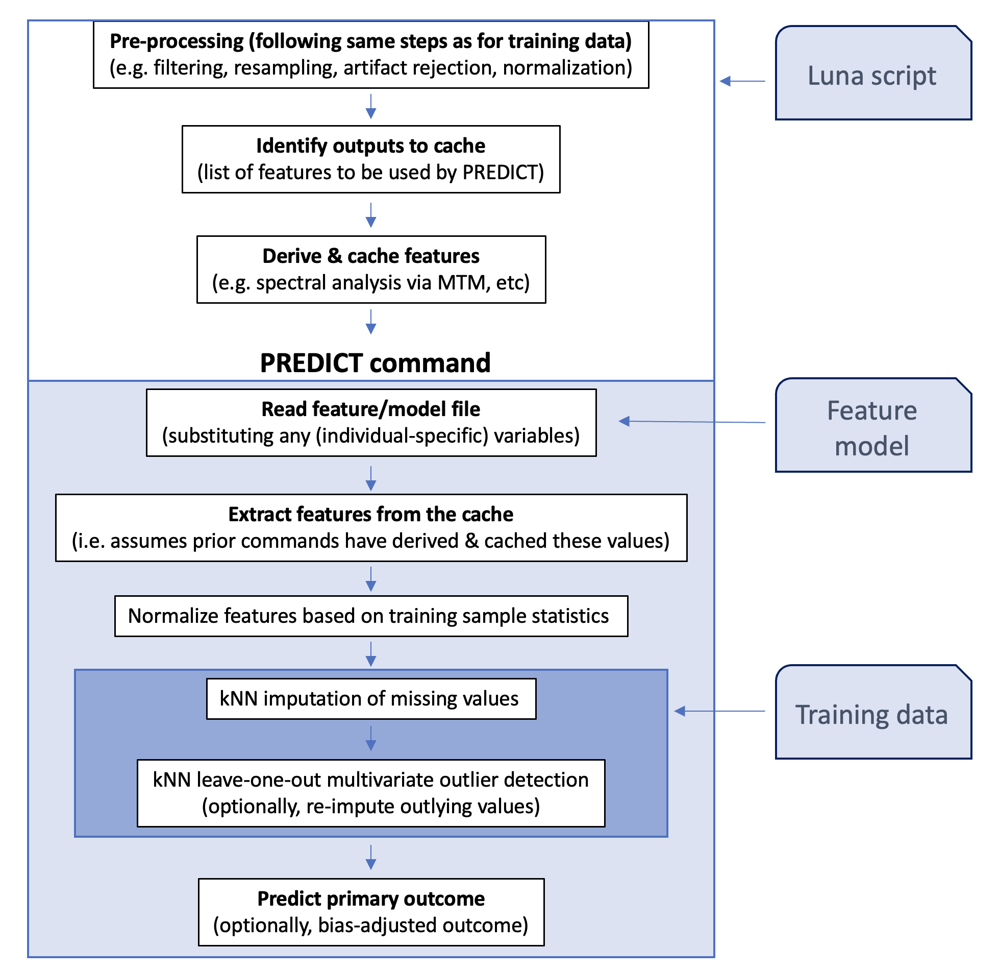

# Prediction models

_Feature-based prediction models_

The `PREDICT` command is designed to take a _pre-existing_ linear
model with predictors (features) corresponding to metrics that Luna emits
(e.g. spectral power, etc).  In conjunction
with a suitable script to estimate those metrics, `PREDICT` combines
model and data to make a prediction. Essentially, this framework aims
to provide a one-step procedure for going from (raw) PSG/EEG data as
input, to a model-based prediction as output.

For example, one `PREDICT` model supports the prediction of the
so-called _brain age index_ using the NREM EEG, based on a model from
[Sun et al (2019)](https://pubmed.ncbi.nlm.nih.gov/30448611/).  This
model has also been incorporated into the [Moonlight
viewer](../moonlight.md).  Over time, different models as well as
support for model classes beyond linear models will be compiled here.

   
| Command | Description | 
| ---- | ------ | 
| [Overview](#overview)   | Overview of the PREDICT framework | 
| [`PREDICT`](#predict)   | Make a prediction given a model and pre-calculated features |
| [Models](#models)       | Currently supported models |

## Overview

The `PREDICT` command assumes the following components:

 * a _model specification_ that defines a set of features, along with
   their weights and population means/standard deviations,
   used to construct a feature vector for each individual/EDF

 * a paired Luna script that generates the required features, using
   the `CACHE record` mechanism to pass those feature values
   to the `PREDICT` command

 * optionally, a dataset of normalized values from the training
   dataset, to support kNN-based imputation of missing data

The primary workflow is as follows:

{width="100%"}


!!! info
    As a downstream _user_ of the `PREDICT` command (i.e. when using _pre-defined_ models to make predictions)
    most of the details on this page are unnecessary and you can skip ahead to the documentation on the main [`PREDICT`](#predict)
    command itself.
    The details below are for reference, aimed at individuals who want to use this framework to bring their own models into this framework.  

### Model specification file

A model specification file contains the following components:

 - feature definitions

 - definitions for special variables (e.g. model intercept), e.g.

Each feature definition has the following terms:

| Term | Example | Description |
|-----|------|-----|
| _label_ | `delta_theta_mean_C_N3` | Arbitrary label for the feature | 
| `CMD` | `CMD=MTM` | Specifies the Luna _command_ used to generate the feature |
| `VAR` | `VAR=RATIO` | Specifies the exact Luna _variable_ from that command |
| `STRATA` | `STRATA=STG/N3,B1/DELTA,B2/THETA` | Specifies any additional _strata_ |
| `CH` | `CH=${cen}` | Specifies which channel(s) to consider |
| `m` | `m=0.52` | Population mean for this feature |
| `sd` | `sd=0.23` | Population standard deviation for this feature |
| `b` | `b=-0.7` | Coefficient for this feature (for a _standardized_ metric) |
| `LOG` | `LOG=1` | Use the natural log of this feature, `Z = sign(X) * log1p(|X|)` |
| `REQ` | `REQ=1` | Set to 1/0 to indicate if a feature is required to be non-missing |
| `CHS` | `CHS=C3+F3,C4+F4` | Specifies pairwise channels, e.g. for metrics such as coherence (here two pairs: _C3-F3_ and _C4-F4_) |
| `DIR` | `DIR=1` | Set to 1/0 to indicate if a pairwise statistic is _directional_, i.e. if _m(A,B) = -m(B,A)_ versus _m(A,B) = m(B,A)_ | 
| `VALUE` | `VALUE=${x}` | Set a feature based on a variable rather than a cache value |

Typically, only the first eight terms will be used.  The terms `CHS`
and `DIR` are only applicable for channel-pairwise metrics,
e.g. coherence.  As a concrete example, this is one line (of 13 terms in the whole model)
from the Sun et al. model:

```
delta_theta_mean_C_N3
 CMD=MTM  VAR=RATIO  STRATA=STG/N3,B1/DELTA,B2/THETA  CH=${cen}
 b=1.3862 m=1.2243 sd=0.4581 
```

That is, this feature is a ratio between two band powers (delta and
theta) from N3 sleep, averaged across all central channels listed in
the variable `${cen}` (note, this variable does not need to be
labelled `${cen}`, it could be any valid Luna variable name,
e.g. `${s}`).  The label name (`delta_theta_mean_C_N3`) is aribitrary,
used only to identify the feature, i.e. it could equally be `ftr01`
etc. (It should not contain spaces or an equals sign, however.)  Here,
the feature is described across multiple lines, although it is also
permissable to use a single line.  The label must come first; all other attributes,
that will be in the form of `key=value` pairs, can be in any order.

### Using the cache

The _cache_ is a mechanism whereby one Luna command can pass
information to another Luna command during the processing of a single
recording - i.e. a temporary store specific to an individual.

When used with `PREDICT`, there are three primary points 
at which the cache is invoked:

 - via the `CACHE record` statement, to tell Luna which metrics to track

 - when a tracked command is run, any tracked values will be cached

 - when `PREDICT` runs, based on the model specification file details,
 values will be pulled from the cache and used to build the vector of predictors
 for that individual

To take the specific case above, the first component might be:
```
CACHE cache=c1 record=MTM,RATIO,B1,B2,CH,STG
```

The `record` argument expects values in the form/order: _command_,
_variable_, _one or more strata_.  This names a cache `c1` (i.e. the
same cache will be passed to `PREDICT`) and instructs Luna to cache
any `RATIO` values emitted by the `MTM` command that have the
associated strata of `B1`, `B2`, `CH` and (in this particular case)
`STG`.  Here, `RATIO` is the ratio of two band powers (`B1` / `B2` ),
which will be defined for a given channel `CH`.  By default, any
`RATIO` variable will always have at least these three associated
strata, `B1`, `B2` and `CH`: e.g. `B1=DELTA`, `B2=ALPHA` and
`CH=C3_M2`.  Here, we additionally specify a stratifying factor of
`STG`, corresponding to sleep stage. This is a user-defined strata
specified via the [`TAG` command](../summaries.md#tag), used to track
N2 versus N3 metrics calculated in the same script.  The tag makes N2
and N3 metrics distinct, otherwise new calls to `MTM` would overwrite
the output associated with previous ones in the same run.

Given the above `CACHE` command, Luna will cache those values from any
outputs that match all these conditions (i.e. for that command,
variables and strata combination):
```
MASK ifnot=N3
RE preserve-cache
TAG STG/N3
MTM sig=C3,C4 ratio1 ratio=DELTA/THETA,DELTA/ALPHA 
```

After running the `MTM` command above, Luna will cache the four
following strata, each defined for four _factor/level_ pairs, for the
`RATIO` variable (that is, a single number representing the power
ratio for that channel and pair of bands for N3 sleep):

 - `CH/C3`  `B1/DELTA`  `B2/THETA`  `STG/N3`
 - `CH/C4`  `B1/DELTA`  `B2/THETA`  `STG/N3`
 - `CH/C3`  `B1/DELTA`  `B2/ALPHA`  `STG/N3`
 - `CH/C4`  `B1/DELTA`  `B2/ALPHA`  `STG/N3`

The final step involving the cache is when `PREDICT` retrieves
cached values for that recording, given a set of feature definitions, e.g.: 

```
delta_theta_mean_C_N3
 CMD=MTM  VAR=RATIO  STRATA=STG/N3,B1/DELTA,B2/THETA  CH=${cen}
 b=1.3862 m=1.2243  sd=0.4581
```

Luna will pull the first two of the four values cached above, as both
match the level values for the factors `B1`, `B2` and `STG`. The
channel specification (`CH`) is handled separately from the other
strata (which are specified by the `STRATA` keyword).  Assuming the
`${cen}` was previously defined to be `cen=C3,C4`, this will retrieve
estimates of N3 delta/theta power ratio from both channels and then
take the average.  The `CH` keyword can handle one or multiple
channels, but will always emit a single (averaged) value.

<h4>Restructing/freezing with caches</h4>

In the above example, note that the [`RE`](../masks#restructure)
command had the special option `preserve-cache`.  By default,
[`RE`](../masks#restructure) and [`THAW`](../freezes#thaw) would
otherwise wipe the cache.  When using a cache, this is typically not
what one wants, i.e.  if we wish to retain the cached values until a
subsequent `PREDICT` command.

Consider the following example (given here not as a full working
example, but just a skeletal script): if we wished to use sigma band
power from both N2 and N3 (from the Welch [`PSD`](../power-spectra#psd) command, which emits a
variable also called `PSD` with strata defined by band `B` and channel `CH` alongside
a further `STG` stratum that aligns with the [`TAG`](../summaries#tag) commands below):

```
CACHE cache=c1 record=PSD,PSD,B,CH,STG

% pre-process whole signal
FILTER sig=CZ bandpass=0.3,35 tw=1 ripple=0.01

FREEZE F1

% get N2 metrics
TAG STG/N2
MASK ifnot=N2
RE preserve-cache
PSD sig=CZ

THAW tag=F1 preserve-cache

% get N3 metrics
TAG STG/N3
MASK ifnot=N2
RE preserve-cache
PSD sig=CZ

% clear STG, else PREDICT output would have a STG/N3 stratum
TAG STG/.

% predict given both N2 and N3 metrics 
PREDICT cache=c1 model=model1.txt
```

In the above, the cached metrics from N2 would be lost if we _thawed_
the previous `F1` freeze (i.e. as that freeze did not contain the cached
values).  That is, the `preserve-cache` option decouples the cache
from the typical snapshot mechanism for returning to a former state.
A similar logic applies with the restructure command.  The simple rule
is: if building a script that uses `PREDICT` and a cache, 
add `preserve-cache` to `THAW` and `RE`.

### Using variables

In the above example, channel `CH` is set to a Luna _variable_ (here
`${cen}`), which allows more flexibility, i.e. one does not need to
edit the model specification file if running on a dataset with a
different label.

In addition, to include features in a predictive model that are not
derived from Luna commands _per se_ (and will therefore not be in the cache),
you can use the `VALUE` keyword when defining a model: e.g. to include
a covariate for male versus female sex:

```
male_sex
 VALUE=${male} b=-0.22 m=0.48 sd=0.5
```

This assumes that a variable called `${male}` will have been defined
for that individual (even if it is defined as _missing_ for that
individual). Such a variable is specified in the same way as any other
Luna variables, e.g. on the command line

```
luna file1.edf male=1 -o out.db < predict.txt
```
or (more likely, in the context of multiple individuals) in a [vars files](../luna/args.md#individual-variables) 
```
luna s.lst vars=covar.txt -o out.db < predict.txt
```
where `covar.txt` is a tab-delimited file, with `ID` as the first column, and a column labelled `male` (note: case-sensitive)
as one of the other columns:
```
ID     age   male   site
id001  12    1      A
id002  16    0      A
id003   9    .      B
id004   6    1      B
...
```

If you specify a `VALUE` term for a particular feature, you should not
also specify `CMD`, `VAR` or `STRATA` terms as well, as those relate
to searching the cache.


<h4>Special variables</h4>

As well as defining the core terms, the model specification file also specifies
a few special variables, in the format

   ```
   variable <- value
   ```
e.g. 

   ```
   intercept <- 42
   ```

The primary special variables are

|Variable|Description|
|------|----------|
| `observed` | If known, the observed value (e.g. chronological age) to be used in output, and bias-adjustment | 
| `intercept` | The model intercept |
| `data` | The filename of the feature matrix data file (for kNN imputation) - can also be given as `data` as a option to `PREDICT` | 
| `knn` | The number of nearest neighbours to consider when running kNN imputation |
| `minf` | The minimum number of non-missing features required to run the model |
| `softplus` | Apply the `softplus` function to the output (0/1=N/Y) |
| `log1p` | Apply `log1p()` scaling to all inputs (0/1=N/Y) |

There are also some special labels expected that can be used to
describe the model (currently not directly used by Luna, but adding
to the model file can help to document the model for users):

|Variable|Description|	
|------|----------|
| `title` | A title for the model |
| `reference` | A PMID or similar reference for the model/data |
| `outcome` | The type/unit of the predicted outcome, e.g. _Age (years)_ |
| `type` | Type of model (linear/logistic) - currently only linear models supported | 
| `training`| Brief note about the training data or procedure |


### Bias-adjustment models

Some models (including Sun et al. mentioned above) require a bias-adjustment term
(e.g. as described [here](https://www.ncbi.nlm.nih.gov/pmc/articles/PMC7049655/)).  

|Variable|Description|	
|------|----------|
| `bias_correction_slope` | Coefficient for bias adjustment model (_b_) |
| `bias_correction_intercept` | Intercept (_c_) | 
| `bias_correction_term` | Observed/known value (e.g. chronological age), same as `${observed}` (_a_) | 

If these terms are found in a model specification file, then a
bias-adjusted version of the prediction (`Y1`) will be output as well
as the raw estimate (`Y`).

This particular form of bias adjustment uses the observed value of the
output variable, as is appropriate in the context of biological/brain
age prediction models, i.e. where chronological age will be known, and
it is the _difference_ between predicted and chronological age that is
the outcome of primary interest.

Given _b_, _c_ and _a_ as defined above, and an initial prediction _y_,
the bias-adjusted value _y1_ is simply defined as
```
 Y1 = Y - ( B * A + C ) 
```

If `PREDICT` is given the above terms in the model file (along with
the observed value `A`), it will automaticall calculate and output
`Y1` as well as `Y`.

### Reference data

If a reference dataset is included with the `data` option (to support kNN imputation) it must have the following format:

 - each row is one individual/observation, each column is one feature; all features are whitespace-delimited
 
 - first row starts with `#` followed by number of rows (observations) and columns (features), e.g.
 ```
 # 2936   13
 ```

 - second row also starts `#` and then lists all feature labels (that must match the terms in the model file exactly)

 - subsequent rows contain the numeric values, expected to be standardized (i.e. each column has mean of 0, SD of 1)

See [this file](https://raw.githubusercontent.com/remnrem/moonlight/main/models/m1-adult-age-data.txt) for an example.

## PREDICT

_Make a prediction based on a specified model and cached Luna metrics_

See the [overview](#overview) above for a high-level description of
this command, and how it fits into a broader paradigm of using Luna
to support model-based prediction.  `PREDICT` is typically not used alone, but
rather needs to be paired with a) a model specification
and b) a Luna script with upstream commands to compute and cache
the features (predictors) used in the model.

Internally, the steps are:

 - `PREDICT` reads the model specification file and swaps in
   any variables (similarly to how Luna parses command
   scripts); this is done separately for each individual, i.e. meaning
   that model files can contain variables that vary between different individuals

 - it then attempts to find values for the specified model features;
   typically these will be from the cache, but if a variable exists
   with (exactly) the same name (i.e from a [vars
   file](../luna/args.md#individual-variables)) then it will be used;
   otherwise, the default is for `PREDICT` to search the cache

 - next, it checks there are enough non-missing features, as
   specified by `REQ` or `minf` in the model file

 - it then standardizes all features based on population mean/SD
 values (which are always included in a model  file)

 - `PREDICT` uses a simple _k_-nearest neighbour (kNN) approach to
   impute missing values, based on `knn=10` neighbours by default; kNN
   imputation is only performed if a reference `data` file has been attached

 - if a reference dataset is available, `PREDICT` also uses it to
   identify outlier features, by dropping each non-missing feature in
   turn, re-imputing it, and then calculating the difference (observed - imputed)
   in SD units. If the distance exceeds the `th` threshold
   set, the observed values are taken to be outliers, and replaced
   with their imputed values

 - using standardized features, `PREDICT` then makes a prediction
   based on the implied linear model; if the model file specifies it, a
   subsequent bias-adjustment procedure is applied (see above)


!!!hint "Cacheless mode"
    If features have been pre-computed and are all available in a simple text file, `PREDICT` can run
    quickly in _cacheless_ mode, i.e. directly taking feature values as variables rather than running
    Luna commands on the raw data. In this way, you could use `PREDICT` as a standalone command (on
    the assumption that `features.txt` has columns defined to match each defined term in `model.txt`):
    ```
    luna s.lst vars=features.txt -o out.db -s PREDICT model=model.txt
    ```
    See below for an example of this approach.
    

<h3>Parameters</h3>

Primary parameters

| Option | Example | Description | 
| ---- | ---- | ---- | 
| `model` | `models/m1.txt` | Model/feature specification filename |
| `cache` | `p1` | Specify a prior cache name |
| `data` | `models/m1.data` | Data set (to support kNN imputation) |
| `th` | 4 | Absolute Z-value distance to trigger re-imputation | 

Secondary parameters

| Option | Example | Description |
| ---- | ---- | ---- |
| `drop` | `ftr2,ftr3` | Drop one or more features from the model |
| `dump-model` | | Dump the model to standard output | 


<h3>Outputs</h3>

Individual-level output (strata: _none_):

| Variable | Description |
| --- | --- |
| `NF` | Number of features |
| `NF_OBS` | Number of features observed (non-missing) |
| `OKAY` | Flag for whether sufficient non-missing features were observed (0/1=N/Y) | 
| `Y` | Default prediction |
| `Y1` | Optional, bias-adjusted prediction |
| `YOBS` | Observed value for outcome, if known |

Feature-level output (strata: `FTR`) 

| Variable | Description |
| --- | --- |
| `X` | Raw value of this feature |
| `Z` | Normalized feature value |
| `D` | kNN-derived _distance_ for any non-missing feature |
| `IMP` | Flag for whether this feature was imputed, i.e. if missing (0/1=N/Y) |
| `REIMP` | Flag for whether this feature was "re-imputed"(*), i.e. if an outlier (0/1=N/Y) | 
| `B` | Feature coefficient (from the model, fixed for all individuals) |
| `M` | Feature mean (from the model, fixed for all individuals) |
| `SD` | Feature standard deviation (from the model, fixed for all individuals) |


_(*) Calling this 're-imputed' doesn't really make much sense, but the output is stuck with this nomenclature for now._

<h3>Example</h3>

As a full working example, we will consider the model described in
[Sun et al (2019)](https://pubmed.ncbi.nlm.nih.gov/30448611/). This
model contains 13 features based on the NREM sleep EEG.  It was
trained on 2,532 individuals to predict an individual's age.

 - The model specification file is available
   [here](https://raw.githubusercontent.com/remnrem/moonlight/main/models/m1-adult-age-features.txt).
   
 - The Luna script used to extract the features and run the `PREDICT`
command is available
[here](https://raw.githubusercontent.com/remnrem/moonlight/main/models/m1-adult-age-luna.txt).

 - The above repository also contains the datafile for kNN imputation
[here](https://raw.githubusercontent.com/remnrem/moonlight/main/models/m1-adult-age-data.txt).

For simplicity, imagine these files are called `m-features.txt`,
`m-luna.txt` and `m-data.txt` respectively, available (relative to the
current working folder) in the folder `models/`.

The Luna script a) sets up the cache, b) does some pre-processing, c)
extracts metrics for N1, then N2, then N3 sleep, using the freeze/thaw
mechanism to swap between stages, and then d) runs `PREDICT` to make a predicton.

If `p1.lst` is a sample list pointing to the EDF and staging
annotations for one 69 year-old individual, then we could run:
```
luna p1.lst age=69 cen=C3,C4 th=3 mpath=models/ -o out.db < m-luna.txt
```

The Luna script expects the variables `${th}` and `${mpath}` to be
defined, as these are passed as parameters to the `PREDICT` command,
as well as `${cen}`, to indicate which (central mastoid-referenced
EEG) channels to derive metrics from.  The model specification file
further expects the variables `${age}` and `${cen}` to be defined.  In
practice, `${age}` (which obviously varies between individuals) would
be specified via a [vars file](../luna/args.md#individual-variables).

!!! hint "Re-referencing on-the-fly"
    Note that in this particular case, the channels were not contra-lateral mastoid referenced, whereas the above `m-luna.txt`
    assumes they are (inspect the script to see).  Rather than edit the script, or use two versions, one can splice in additional
    commands to Luna, by using standard command-line tools: i.e. what we actually ran was (the other arguments replaced with `...` here):
    ```
    echo "REFERENCE sig=C3 ref=A2 & REFERENCE sig=C4 ref=A1" | cat - m-luna.txt | luna p1.lst ...
    ```
    This is equivalent to
    ```
    luna p1.lst ... < m-luna.txt
    ```
    but if we had editted the first lines of `m-luna.txt` to include the extra `REFERENCE` commands. The above is equivalent to:
    ```
    cat m-luna.txt | luna p1.lst ...
    ```
    and so here we use `cat - m-luna.txt` to concatenate the standard input (here from a prior `echo`) with the Luna script, and
    then all of that gets piped into Luna, i.e. in the form:
    ```
    echo "extra first commands go here" | cat - script.txt | luna p1.lst ...
    ```


This script contains multiple commands and generates a lot of console
output.  It is always worth reviewing in test cases that the script it
performing as expected.  The final `PREDICT` command gives the
following messages to the console:

```
 CMD #37: PREDICT
   options: cache=p1 data=models/m-data.txt model=models/m-features.txt sig=* th=3
  read 13 terms and 8 special variables from models/m-features.txt
  creating 2936 x 13 reference feature matrix from models/m-data.txt
  applying softplus scaling to predicted values

  predicted value (Y) = 59.8799
  bias-corrected predicted value (Y1) = 70.613
  observed value (YOBS) = 69
```

That is, this individual had an observed age of 69 years, and a
(bias-adjusted) estimated age (based on the NREM EEG) of 70.6 years.

The primary outputs are available in `out.db`:
```
destrat out.db +PREDICT
```
```
ID     NF    NF_OBS   OKAY    Y       Y1      YOBS
id01   13    13       1       59.879  70.613  69
```

where `NF` is the number of feautres used in the model.  Depending on
the model used, either `Y` or `Y1` should be considered as the primary
output.

We can view the individual features:
```
destrat out.db +PREDICT -r FTR 
```
```
ID   FTR                                B      M     SD      X       D      Z IMP REIMP
id01 COUPL_OVERLAP_C               -0.804  366.3  191.7  270.0  -0.178 -0.502   0     0
id01 DENS_C                        -1.665  4.513  1.911  3.486  -0.857 -0.537   0     0
id01 alpha_bandpower_kurtosis_C_N2 -3.184  7.331  2.598  6.263  -0.108 -0.411   0     0
id01 alpha_bandpower_mean_C_N1      2.291  0.068  0.047  0.046  -1.395 -0.465   0     0
id01 delta_alpha_mean_C_N3         -1.348  1.344  0.548  0.808  -0.266 -0.975   0     0
id01 delta_bandpower_kurtosis_C_N2 -1.868  17.01  4.071  10.47  -0.496 -1.607   0     0
id01 delta_bandpower_mean_C_N3     -2.620  1.445  0.618  0.857  -0.279 -0.949   0     0
id01 delta_theta_mean_C_N3          1.386  1.224  0.458  0.744  -0.310 -1.049   0     0
id01 kurtosis_N2_C                 -0.052  2.851  1.349  1.362  -0.047 -1.103   0     0
id01 kurtosis_N3_C                 -1.247  1.086  0.576  0.335  -0.368 -1.302   0     0
id01 sigma_bandpower_kurtosis_C_N2  1.247  15.19  4.749  18.11   0.741  0.615   0     0
id01 theta_bandpower_kurtosis_C_N2 -3.744  7.461  2.557  6.222   0.440 -0.484   0     0
id01 theta_bandpower_kurtosis_C_N3  0.157  5.364  2.045  2.301  -0.962 -1.496   0     0
```
The order of columns has been changed (default is alphabetical) for easier viewing above:

 - the first three give the coefficient, mean and population SD and will be identical for all individuals (i.e. these are directly from the model file) 

 - `X` is the observed value of the feature (in this case, all derived from cached Luna commands)

 - `D` is the _distance_ in SD units for the expected value of the
   feature based on kNN imputation based on all non-missing features but
   excluding this one

 - `Z` is the normalized (potentially imputed) final version used in the prediction equation (i.e. multipled by `B`)

 - `IMP` and `REIMP` indicate whether the final `Z` value was imputed,
 either because it was missing (`IMP`) or an outlier based on `D`
 (`REIMP`)

If particular features appear to be consistently noisy or biased, they
can be dropped from the model by adding the option `drop=F1,F2` where
`F1` and `F2` are two features, for example.


<h4>Building feature matrices to re-run models</h4>

If a script takes a long time to compute features, or if you have a
large sample, and you wish to re-run models (e.g. changing parameter
settings) it can be advantageous to extract all features from the
output to make a single text input file.

We first pull the values `X` (i.e. the raw features used by the model, but after averaging across
channels) as follows:
```
destrat out.db +PREDICT -c FTR  -v X > ftr.txt
```
One adjustment needs to be made so that the column headers then line up exactly with the feature labels:
```
ID      X.FTR_COUPL_OVERLAP_C	X.FTR_DENS_C          ...
id01 	270                     3.48598130841121      ...
```
The above file has 13 columns (plus an `ID` field) but the labels (following default destrat output practices have the variable/factor name `X.FTR_` at the front of each column label.   We can strip these, either manually, as using something as follows:
```
sed 's/X\.FTR_//g' < ftr.txt > ftr2.txt
```
```
ID      COUPL_OVERLAP_C   DENS_C          ...
id01    270               3.48598130841121      ...
```
In practice, you'd want to be _very careful_ that the IDs or other
values don't values that match `X.FTR_` etc, but this works for now.
We can then re-run the single `PREDICT` step as follows:
```
luna p1.lst vars=ftr2.txt age=69 cen=C3,C4 -o out2.db -s PREDICT model=models/m-features.txt data=models/m-data.txt th=3 
```
which will run effectively instantaneously, yielding the same output as above:
```
  bias-corrected predicted value (Y1) = 70.613
  observed value (YOBS) = 69
```

Note that in practice, age (and potentially other information such as the central channel labels to use) could instead be
kept in a file (with multiple individuals on different rows), e.g. `covar.txt`
```
ID      age     male    cen
id01    69      1       C3,C4
id02    73      0       CZ
id03    56      1       C3,C4
...
```
```
luna p1.lst vars=ftr2.txt,covar.txt -o out2.db -s PREDICT model=models/m-features.txt data=models/m-data.txt th=3
```
which, again, will give the same output.  

Now we can easily change parameters, e.g. varying `th` or dropping particular terms.  For example, here we might drop both spindle-related
metrics: running the same command as above but adding to `PREDICT` 
```
drop=DENS_C,COUPL_OVERLAP_C
```
This has a slight impact on the predicted value:
```
  bias-corrected predicted value (Y1) = 68.6742
  observed value (YOBS) = 69
```
We can see the values have been imputed:
```
destrat out2.db +PREDICT -r FTR -v IMP X Z 
```
```
ID    FTR                           IMP   X           Z
id01  COUPL_OVERLAP_C                 1   NA     -0.015
id01  DENS_C                          1   NA      0.391
id01  alpha_bandpower_kurtosis_C_N2   0   6.263  -0.411
id01  alpha_bandpower_mean_C_N1       0   0.046  -0.465
id01  delta_alpha_mean_C_N3           0   0.809  -0.976
id01  delta_bandpower_kurtosis_C_N2   0   10.47  -1.607
id01  delta_bandpower_mean_C_N3       0   0.858  -0.950
id01  delta_theta_mean_C_N3           0   0.744  -1.049
id01  kurtosis_N2_C                   0   1.363  -1.103
id01  kurtosis_N3_C                   0   0.335  -1.302
id01  sigma_bandpower_kurtosis_C_N2   0   18.11   0.615
id01  theta_bandpower_kurtosis_C_N2   0   6.222  -0.485
id01  theta_bandpower_kurtosis_C_N3   0   2.302  -1.497
```

The `NA` for `X` in the top two rows indicated they were dropped from
the original model as observed variables, i.e. set to missing then
imputed.  As expected these values deviate from the observed values
somewhat : `-0.015` and `0.391` instead of `-0.502` and `-0.537` and have
resulted in a slightly lower estimated age.   In a larger sample, one could use the
above framework to perform sensitivity analyses, etc, e.g. to see if some terms increase or
decrease noise in predictions significantly.

<h4>Viewing the original channel-level features</h4>

Finally, just to connect the _features_ (internally cached metrics
passed to `PREDICT`) with the "standard" Luna outputs, we can look at
the rest of the `out.db` file, which will contain the same values that
were cached.  The one difference is that `PREDICT` internally averaged
over multiple channels, and so we'll need to do that here to check
that things line up.

To take a few examples: first spindle density, which has the label `DENS_C` in the model:
```
destrat out.db +PREDICT -r FTR/DENS_C -v X
```
```
ID    FTR      X
id01  DENS_C   3.48598
```

From the main `SPINDLES` output, we know it was stratified by `F` and
`CH` (as always for spindle density) but also `STG` (because this was
added in the script via `TAG STG/N2` before the spindles command):

```
destrat out.db +SPINDLES -r F CH STG -v DENS 
```
```
ID     CH     F  STG     DENS
id01   C3  13.5   N2  3.65421
id01   C4  13.5   N2  3.31776
```

As expected, the mean of these two values equals the value of `X` from
`PREDICT`, i.e.  (3.65421 + 3.31776)/2 = 3.48598.

To consider a second example: the delta/alpha N3 power ratio: `delta_alpha_mean_C_N3`.  From the model file,
we can see the definition:
```
delta_alpha_mean_C_N3
  CMD=MTM  VAR=RATIO  STRATA=STG/N3,B1/DELTA,B2/ALPHA  CH=${cen}
```
i.e. from the `RATIO` variable of the `MTM` command, and based on a stratum defined by the two power bands, a stage and channels:
```
destrat out.db +MTM -r B1/DELTA B2/ALPHA STG/N3 CH -v RATIO 
```
```
ID       B1     B2  CH   STG     RATIO
id01  DELTA  ALPHA  C3    N3   0.78152
id01  DELTA  ALPHA  C4    N3   0.83614
```
We are therefore expecting `X` to be the mean of these, namely
(0.78152+0.83614)/2 = 0.80883.  From `PREDICT` itself, the averaged
value was:

```
destrat out.db +PREDICT -r FTR/delta_alpha_mean_C_N3 -v X
```
```
ID                      FTR            X
id01  delta_alpha_mean_C_N3    0.8088296
```
which matches expectations.


## Models

Currently, in its initial release, only a single model is supported - __more will be added soon__.

| Label | Model | Link |
|------|-----|-----|
| [SUN2019](#sun2019) | "Brain-age" prediction for adults | [repo]( https://github.com/remnrem/moonlight/tree/main/models) | 


### SUN2019

[Sun et al (2019)](https://pubmed.ncbi.nlm.nih.gov/30448611/) uses 13
NREM sleep EEG features to provide a robust estimate of "brain age".
The difference between predicted and observed age is labelled the
_brain age index_.  The model was trained on over 2,500 adults aged 18
to 80.

