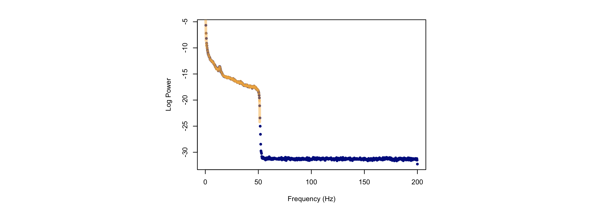
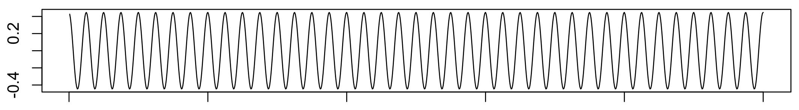
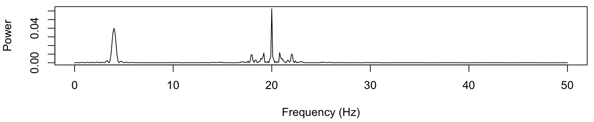

# Simulation 

_Simulation of new data_

| Command | Description | 
| ---- | ------ | 
| [`SIMUL`](#simul) | Simple approach to simulate time-series given a power spectrum |
| [`SIGGEN`](#siggen) | Generate/spike in artificial test signals |

## SIMUL

_Simulation of time-series data given a power spectrum_

This command simulates time-series with specified spectral properties,
using a simple approach that _will not_ generate truly realistic EEG
(or other) signals, e.g. in terms of phase-amplitude coupling or other
distributional properties of the data.  Rather, it simply provides a
means to generate random stationary time-series with a known power
spectrum, e.g. to be used for testing methods, or generating figures, etc.

This command can either generate a new signal (if the `sig` label does
not already exist in the EDF) or it can modify an existing signal.  In
the latter case, the command will either completely overwrite the old
signal, or if the `add` option is specified, it will add
(i.e. numerical addition) the simulated signal onto the existing
signal.  In both these cases, if `SIMUL` modifies an existing signal,
the simulated signal must have the same sample rate (`sr`) as the
original.

There are three primary modes for specifying the power spectrum:

 - to read a power spectrum from a file (e.g. the output of a previous Luna `PSD` command), using `file`

 - to specify a _1/f_ form, with the arguments `alpha` and `intercept`

 - to specify one or more _peaks_ in the power spectrum of fixed
 amplitude, with `frq` and `psd`; these are either single points
 (i.e. generating an exact 10 Hz sine wave with `frq=10`), or if `w`
 is set to a positive, non-zero value, to have a Gaussian _bump_
 centered on 10 Hz (where `w` is the standard deviation).
 
 - note that the latter two options can be combined: i.e. to simulate a
   _1/f_ that also has spectral peaks; further, by applying `SIMUL` repeatedly
   on the same signal using the `add` option, it is possible to build up more
   complex composite signals.


The `SIMUL` command first scales the (positive) spectrum to _m=n/2+1_
points where _n_ is the desired length of the time series (which is
fixed given the EDF duration).  If power spectra are read from a file, they
are interpolated as necessary (using cubic spline interpolation) to be of length _m_. 

A new complex variable _Z_ is generated according to the amplitudes
as fixed by the generating power spectrum, but with phases randomly
(and independently) assigned for each frequency.  An inverse FFT is
then applied to _Z_ to give the resulting time series.

By default, the resulting time series is stationary across its entire
duration, i.e. having been generated by a single power spectrum.  The
`pulses` option is one simple way to generate non-stationary time
series: it takes two arguments, the number and duration of _pulses_.
The exact same procedure is followed as above, except at the end,
these _pulses_ are randomly allocated to parts of the generated time
signal (constrained so as not to be overlapping).  All parts of the
signal that are _not_ spanned by a _pulse_ are set to zero.  Note that
pulses are not initiated with respect to the phase of any
component of the simulated signal.   If too many pulses are specified, or
if they are too long (i.e. and won't fit into the generated signal) then Luna
issues a warning and stops.

The time series is stored as a channel in the internal EDF, i.e. it
can be output with commands such as [`WRITE`] or [`MATRIX`] or fed
into subsequent commands such as `PSD`.

!!! hint
    It might often be convenient to use the _empty EDF_ feature
    of Luna when using `SIMUL`, i.e. if you want to create one or more
    signals from scratch.  Here, you specify `.` (period character) as
    the sample-list/file-name along with `--nr` and `--rs` on the
    command line, to give the number of records (`nr`) and the EDF
    record size (`rs`) respectively.  Luna will then create an EDF of
    this duration (i.e. with headers speciying the length of the
    recording) but with 0 signals, i.e. a collection of empty records.
    The `SIMUL` command will then create a new channel that will be of
    the desired duration (and sample rate given by the `sr` option).
    

<h3>Parameters</h3>

Primary parameters to specify the data and any outlier actions for the dependent variables:

| Option | Example | Description | 
| ---- | ---- | ---- | 
| `sig` | `S1` | Name for the new, single signal to be generated |
| `add` |      | Assumes that `sig` already exists in the EDF, add the new data to it |
| `frq` | `1,15` | Specify spectral peaks at 1 and 15 Hz |
| `psd` | `10,10` | Specify power values of 10 and 10 (arbitrary units) for, e.g. 1 and 15 Hz |
| `w`   | `2`     | Specify peak width (SD of normal distribution centered at `frq` values) |
| `alpha` | `2`   | Specify spectra in terms of `1/f^a` slope |
| `intercept` | `1` | Specify spectral intercept, required if `alpha` is used |
| `file` | `psd.txt` | Read power spectrum from a file (assumes `F` and `PSD` columns) | 
| `sr` | `100` | Specify a sample rate (for any new signal) |
| `pulses` | `100,1` | Specify 100 pulses of 1 second duration each | 
| `verbose` | | Output the specified power spectrum |


<h3>Outputs</h3>

Optional expected power spectra output (option: `verbose`, strata: `F`):

| Variable | Description |
| --- | --- |
| `F` | Frequency |
| `LF` | Log-scaled frequency |
| `P` | Expected power |
| `LP` | Log-scaled expected power |

<h3>Example</h3>

Here we generate a time series from scratch:

```
luna . -o out.db --nr=30 --rs=1 \
       -s ' SIMUL alpha=2 intercept=1 frq=15 psd=10 w=1 sig=S1 sr=100 verbose
            MATRIX minimal file=s1.txt   
            PSD sig=S1 spectrum max=50 '
```


This statement is intended to generate 30 seconds of data (i.e. `nr` =
30 records, each of `rs` = 1 second) with a sampling rate of `sr` =
100 Hz.  The use of the `.` as the sample-list/EDF filename indicates
to Luna that this is an empty EDF (which requires that `--nr` and
`--rs` are given on the main Luna command line).

Here we use both the spectral slope and peak formulation: an `alpha`
value of 2, and a Gaussian bump at 15 Hz (with a SD of `w` = 1 Hz).
As noted above, the simple simulation approach here will generate a
time-domain signal that this PSD in the frequency-domain, but
otherwise it does not meaningfully replicate other time-domain
features of signals.

The expected power spectrum is given as follows:

```
destrat out.db +SIMUL -r F
```

```
ID   F          LF       LP        P
.    0          NA       -110.197  0.000
.    0.0333333  -3.401   6.802     900.000
.    0.0666667  -2.708   5.416     225.000
.    0.1        -2.303   4.605     100.000
.    0.133333   -2.015   4.030     56.250
.    0.166667   -1.792   3.584     36.000
.    0.2        -1.609   3.219     25.000
.    0.233333   -1.455   2.911     18.367
.    0.266667   -1.322   2.644     14.062
...
```

This spectrum has a maximum frequency of 50 Hz (Nyquist) given the 100
Hz sample rate; given the 30 seconds of data is generated, the
positive power spectrum has _m_ = 3000/2+1 = 1501 points (and so a
frequency resolution between points of 50/1500 = 0.0033 Hz).

Plotting the log-log scale expected power spectra (`LF` and `LP`,
skipping the DC term), we obtain the following:

```
destrat out.db +SIMUL -r F > exp.txt
destrat out.db +PSD -r F CH > obs.txt
```

Plotting the expected log-log scaled frequency and power, we see the
specified slope _b_ = -2 (negative `alpha`), which is linear on a
log-log scale, as well as a peak at 15 Hz:

{width="100%"}

The `MATRIX` command above output the simulated time series to the file `s1.txt`: here is five seconds of the signal:

{width="100%"}

We also applied the `PSD` command to the newly generated
signal `S1`, to use Welch method to estimate the spectrum from the
data.  Plotting the expected (gray line, same as above) against the
estimated values for this one epoch, we see a good agreement: (note,
there the lowest frequency estimated is 0.5 Hz, as the Welch method
uses, by default, 4 second sliding windows; thus the x-axis is shifted relative
to the plot above):

{width="100%"}

We can add the `slope` option to `PSD` to estimate the spectral slope using a simple linear regression on the log-log spectrum: i.e. the final `PSD` command were instead written:

```
PSD spectrum max=50 slope=30,45 
```

then we can output the `SLOPE` as follows: 

```
destrat out.db +PSD -r CH  | behead
```
We see the estimated value is close to the expected ( _b_ = minus alpha ~ -2 ). 

```
            ID   .                   
            CH   S1                  
            NE   1                   
    SPEC_SLOPE   -2.0451
  SPEC_SLOPE_N   61                  
```

In the above example we specified that the slope be estimated only
over the region 30 to 45 Hz (as we and others have shown to be a
robust choice, being relatively free from stronger oscillatoary
activity and/or line noise
([Kozhemiako et al, 2021](https://www.biorxiv.org/content/10.1101/2021.11.08.467763v1)).

If we had specified a broad range, that includes the (in this example, extremely strong) bump at 15 Hz,
this naturally would have biased the slope estimate, which is now closer to 5 or 6.

```
PSD spectrum max=50 slope=10,45
```

```
            ID   .                   
            CH   S1                  
            NE   1                   
    SPEC_SLOPE   -5.6164   
  SPEC_SLOPE_N   141 
```

See [here](power-spectra.md#psd) for more details on the `PSD` and `slope` commands/options.

---

As a second example, here we base the simulation on a real power spectrum, estimated from N2 sleep, e.g.
here from one individual from the NSRR CFS cohort (a random 10 minutes of N2 sleep):

```
luna cfs.lst 1 -o out.db -s ' MASK ifnot=N2 & RE
                              MASK random=20 & RE
                              PSD spectrum sig=C3 min=0 max=50 '
```

Note how we use the `PSD` options `min` and `max` along with `spectrum` to extract a broader range than the
`PSD` command typically gives.   We can extract the power spectrum to a file `s.txt`:

```
destrat	out.db +PSD -r F CH > s.txt
```

To now simulate a time series with a similar power spectrum, we can use `SIMUL` and `file`:  here, we simulate 6 minutes
of signal (i.e. 180 one-second records) and read in the spectrum from `s.txt`:

```
luna . -o out.db --nr=180 --rs=1 -s ' SIMUL sr=400 file=s.txt sig=S1 verbose
                                      PSD spectrum max=200 '
```

By default, Luna assumes the `PSD` values are raw and not logged; if
Luna detects a negative value in `PSD` it will assume they are
10log10(X) values (i.e. generated by `PSD spectrum dB`) and will
convert them accordingly.    

If we plot a) the original power spectra (with log(X) scaling), b) the
interpolated expected spectra (orange, i.e. to match the given sample
rate of 400 Hz), c) the estimated power spectra obtained via the Welch method
to 180-seconds of randomly simulated data, as green, orange and navy points/lines respectively, we
see they all line up more or less as expected:

{width="100%"}


Note that we used a different sample rate here (400 Hz),
which implies a different Nyquist frequency.  The original spectrum
was output up to 50 Hz.  Implicitly, all unspecified frequencies are
set to zero, when reading from a file: for a sample rate of 400 Hz for
the generated signal, this implies values from 50 up to 200 Hz.  Indeed,
if we plot the full range of output from the previous `SIMUL` command, we'll
see the spectrum extends up to 200 Hz, but with values of 0 for all frequencies
above 50 Hz (which are therefore not defined on the log scale, and so are `NA`):

{width="100%"}


---

Finally, here we demonstrate the use of the `pulses` option, as well as
adding different signals together.  Below, we simulate 3 different
10-second segments.  First, a constant 4 Hz sine wave:

```
luna . -o out.db --nr=10 --rs=1 \
       -s ' EPOCH len=10
            SIMUL sr=100 frq=4 psd=1 sig=S1
            FFT
            MATRIX minimal file=s1.txt '
```

Note that we set the epoch length to 10 seconds (smaller than the
default of 30 seconds), which ensures that subsequent commands operate
correctly on a segment of data smaller than 30 seconds.  We also use
the `FFT` command to output the power spectrum associated with the new
signal, which uses the basic DFT algorithm (rather than Welch or
multi-taper approaches to spectral estimation).  Plotting the contents of `s1.txt` (i.e.
the raw time-domain signal output by `MATRIX`):

{width="100%"}


The second signal adds the `pulses` option to make the output consist of 3 segments (each of 1.5 second duration)
within the overall 10-second window.  As noted above, this is constrained to ensure that the segments do not overlap:

```
luna . -o out.db --nr=10 --rs=1
       -s ' EPOCH len=10
            SIMUL sr=100 frq=4 psd=1 sig=S1 pulses=3,1.5
            FFT
            MATRIX minimal file=s2.txt '
```

{width="100%"}

In this third example, we create two signals and add them together: a single 2-second segment of 4 Hz activity,
and then superimpose 10 0.25-second segments of 20 Hz activity: 

```
luna . -o out.db --nr=10 --rs=1 \
       -s ' EPOCH len=10
            SIMUL sr=100 frq=4  psd=1 sig=S1 pulses=1,2
            SIMUL sr=100 frq=20 psd=1 sig=S1 add pulses=10,0.25
            FFT
            MATRIX minimal file=s3.txt '
```

{width="100%"}


Now, for each of these three signals, we can look at power spectra obtained from the `FFT` command, extracting out
output as:

```
destrat out.db +FFT -r F CH > o.1
```

The first shows the simple 4 Hz sine wave:

{width="100%"}

The second shows an attenuated peak at 4 Hz, with the discontinuities at the start/stop of segments introducing
other spectral components:

{width="100%"}

Finally, we see a similar picture for the third signal, but with spectral components around both 4 and 20 Hz, again with the 'ripples'
in the frequency domain resulting from the onsets/offsets of the pulses:

{width="100%"}

In this example, we've added two signals together, where the first was
created from scratch.  It is also possible to use `add` to modify an
existing signal, if so desired.


Finally, also note that the `frq` and `psd` commands can accept
multiple frequency/power pairs, but the `pulses` only acts on the
composite signal generated:

```
luna . -o out.db --nr=10 --rs=1 \
       -s ' EPOCH len=10
            SIMUL sr=100 frq=4,20 psd=1,1 sig=S1 pulses=1,2
            FFT
            MATRIX minimal file=s3b.txt '
```

{width="100%"}


## SIGGEN

_Generate, or add-in, artificial test signals_

_This command is largely redundant (given `SIMUL`), but is decribed here for completeness._

This is a simple command to generate test signal data (on top of an existing EDF).  Currently, it
only generates sine wave signals, or pulses of a given duration.

<h3>Parameters</h3>

| Parameter | Example | Description |
| ---- | ----- | ----- |
| `sig` | `sig=C3,C4` | Signals to be modified/created (existing or new) |
| `sr` | 200 | Set sample rate if not an existing channel |
| `add` | | Add to an existing channel (versus overwrite it) | 
| `sine` | `sine=10,20` | Generate a sine wave with specified frequency (10 Hz), amplitude (20 units) and optionally phase |
| `impulse` | `impulse=0.5,1,100` | Set impulse of amplitude `1` for 100 samples, starting at 0.5 way through the recording; multiple values are possible `impulse=T,A,D,T,A,D,...` , i.e. time/amplitude/duration | 


<h3>Output</h3>

No new output, this command just modifies the internal signal data.

<h3>Example</h3>


To generate a sine wave in the signal `C3` (first clearing that signal):

```
luna s.lst -o out.db -s ' MASK ifnot=NREM2 & RE
                          SIGGEN sig=C3 clear sine=10,100 
                          MTM sig=C3 '
```

Plotting the output of `MTM`:

{width="100%"}


Also, see [this vignette](../vignettes/merge.md#simulating-data) for an example of using `SIGGEN` to generate a toy dataset.