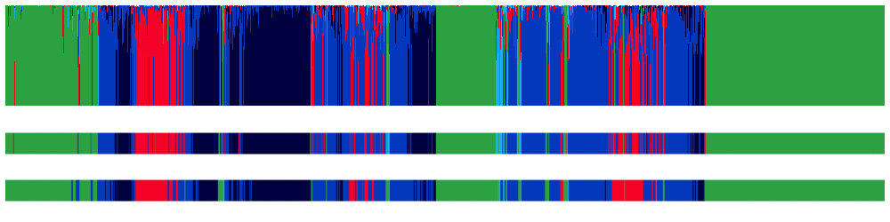
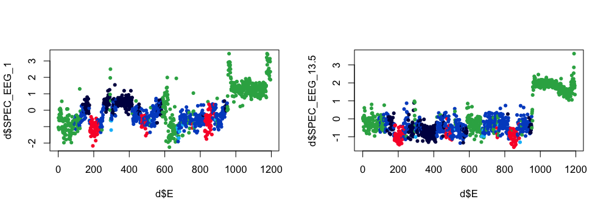
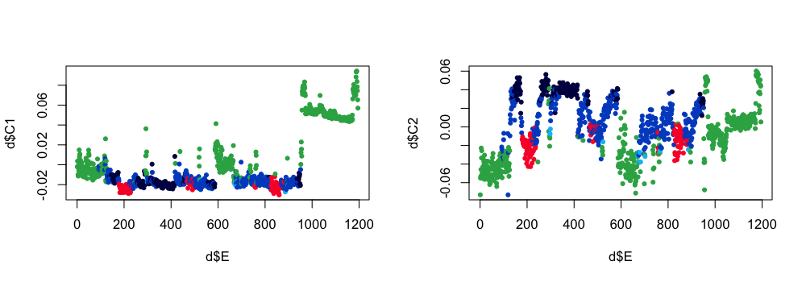
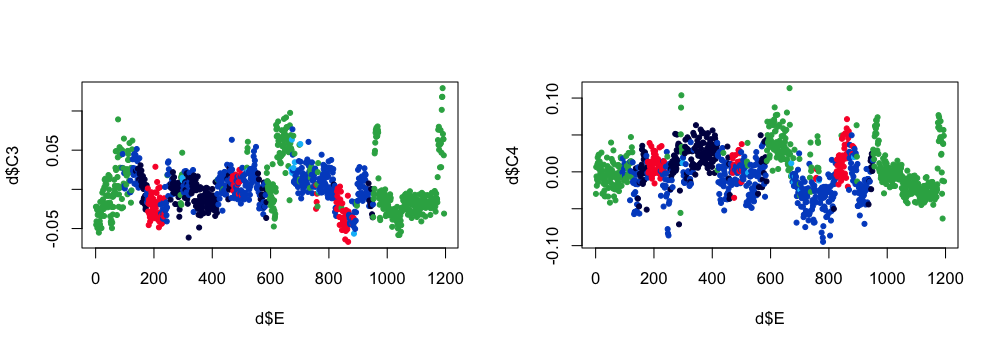
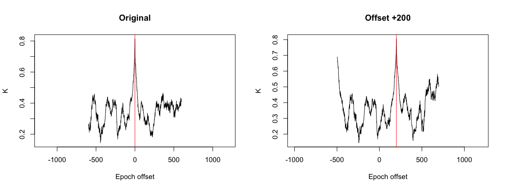

# SOAP

_Self-contained modelling and evaluation of sleep staging_


| Command | Description | 
| ---- | ------ | 
| [`SOAP`](#soap)     | Single-observation accuracies and probabilities |
| [`REBASE`](#rebase) | Use SOAP to translate between epoch lengths (e.g. 20 to 30 second manual staging) | 
| [`PLACE`](#place)   | Use SOAP to localize "lost" stage annotations |

This suite of commands are based around the _SOAP_ (__Single
Observation Accuracies and Probabilities__) function in Luna.  In
brief, SOAP generates a battery of epochwise features based on one or
more channels, and then fits a simple model (e.g. linear discriminant
analysis) to those data, with the observed stages (i.e. passed as
annotations) as the outcomes.  If the signal is a) of sufficient
quality, and b) is related to observed sleep stages via the computed
features, then SOAP should be able to generate a model that explains
the observed stages relatively well.  This can be assessed, for example,
via the kappa coefficient between observed and predicted stages.
Inability to derive a good-fitting model is therefore indicative of
problems with the stages and/or signals.

!!! info
    The SOAP command requires existing stage annotation,
    i.e. similar to the `HYPNO` command (whether these existing
    annotations are from manual scoring, or from an external,
    automated staging algorithm).  That is, it does _not_ predict
    sleep stages from scratch.  For automated
    staging, see Luna's [`POPS`](pops.md) command.

Overall, the _SOAP_ model can be viewed in two ways: 1) as a tool to check the
consistency between signals & staging - implemented in the [`SOAP`](#soap) command,
or 2) as a tool to manipulate/use the existing staging, _on the assumption that stages and signals are
largely consistent_, i.e. as in [`PLACE`](#place) and [`REBASE`](#rebase).  In addition, the
`SOAP` command can be used to _fill-in_ modest amounts missing staging, e.g. if a sufficient
number of representative epochs have been manually scored.

## SOAP

_Single observation stage accuracies and probabilities_

Fits the SOAP model to predict stage labels, based on a simple LDA (or QDA)
model for a set of epoch-level _features_, typically based on spectral analysis.
Outputs of this model can indicate if there is gross inconsistency
between stage labels and signal data (assuming a signal that would be
expected to track strongly with sleep stage, i.e. typically an EEG).

The standard typical usage is very simple, as it uses a default feature/model set, i.e. something like:

```
luna s.lst -o out.db -s SOAP sig=C3_M2 
```

However, we first introduce the fuller set of features and models.  

### Features

Each feature (or feature set) is calculated per epoch for the channel(s) specified after each keyword:

| Parameter | Arguments | Description |
| --- | --- | --- |
| `SPEC` | `lwr=0.5 upr=25` | Spectral decomposition via Welch's method |
| `RSPEC` | `lwr=0.5 upr=25 z-lwr=0.5 z-upr=25` | Relative spectral decomposition, normalized by range `z-lwr` to `z-upr` |
| `VSPEC` | `lwr=0.5 upr=25` | Variance of segment-to-segment power in each epoch |
| `SLOPE` | | Spectral slope |
| `SKEW` | | Signal skewness | 
| `KURTOSIS` | | Signal kurtosis | 
| `HJORTH` | | Second and third Hjorth parameters |
| `FD` | | Fractal dimension | 
| `PE` | | Permutation entropy statistics (with embedding dimension 3 - 7) |
| `MEAN` | | Simple channel mean, e.g. for pulse signal | 

That is,
```
 SPEC C3 lwr=0.5 upr=25
```

will implicitly specify 99 features (log-scaled power values from 0.5
to 25 Hz at default value of 0.25 Hz intervals for `C3`).  It is
possible to specify the features from multiple channels, e.g.

```
 SPEC C3 C4 lwr=0.5 upr=25
```
which will add 2 x 99 features to the epoch-by-feature matrix.

These additional keywords do not require any channels to be listed, but instead operate on the currently set of features:

| Parameter | Arguments |Description |
| --- | --- | --- |
| `TIME` | `order=2` | Add time-tracks (up to order _N_) |
| `DENOISE` | `lambda=0.5` | Total-variation denoiser, replace features; lambda in SD units, as per [`TV`](power-spectra.md#tv) |
| `DENOISE2` | `lambda=0.5` | Total-variation denoiser, duplicate features; lambda in SD units, as per [`TV`](power-spectra.md#tv) |
| `NC` | 10 | Required: number of components to extract from all features

Of the above, the `NC` is the most important - this determines the final variables entered into the LDA/QDA model, i.e.
the top _N_ principal components from the epoch-by-feature matrix.

### Models

A SOAP model is defined by one or more feature sets , which implies
a certain number of variables (columns) in the final epoch-by-feature matrix. As noted, 
the `NC` option then takes the
entire epoch-by-feature matrix (which can reflect a mix of features
from one or more channels), normalizes it (potentially after removing outliers),
fits a PCA and then extracts the top e.g. 10 components to be used in a
LDA model predicting stage labels given these components.

You can create a text file to specify which SOAP features to use, and
use the `model=file.txt` argument for `SOAP` to use it. Alternatively,
you can use a _default_ model.  If nothing else is specified (or
`model=_1`) this is the model used:

```
SPEC <sig> lwr=0.5 upr=25 
NC 10
```

where `<sig>` is replaced by the value of `sig` after the `SOAP` command.   This perform spectral analysis per epoch and then summarizes the
values as 10 principal components per epoch. 

A second vanilla model can be used by specifying `model=_2` :

```
SPEC <sig> lwr=0.5 upr=25
RSPEC <sig> lwr=5 upr=20 z-lwr=30 z-upr=45
SLOPE <sig> 
SKEW <sig>
KURTOSIS <sig>
FD <sig>
PE <sig>
DENOISE2 lambda=0.5
TIME order=4
NC 10
```

This adds a suite of additional features, but still extracts only 10 components from the final set.

For most circumstances, where the goal is to use `SOAP` to spot
chronically poor stage/signal alignment, the default model appears to
work well enough (i.e. with typically high kappa values for
sufficiently high-quality datasets).


<h3>Parameters</h3>

Primary options:

|  Parameter | Example | Description |
| --- | --- | --- |
| `sig` | `C3_M2` | Signal to use for the SOAP model |
| `epoch` | | Write epoch-level outputs (i.e. posterior probabilities, stage predictions) |

Secondary/advanced options:

|  Parameter | Example | Description |
| --- | --- | --- |
| `model` | `m1.txt` | Read explicit _model/feature_ file, if not using the default; or `_1` or `_2` for internal models, `_1` is default | 
| `lights-off` | `23:00:10` | Specify a _lights_off_ time, i.e. ignore before |
| `lights-on` | `08:00:00` | Specify a _lights_on_ time, i.e. ignore after |
| `th` | 3 | Remove epochs with component outliers at this SD level | 
| `trim` | 10 | Trim leading/trailing wake, to keep _N_ epochs before/after first/final sleep |          
| `end-wake` | 120 | Threshold for trimming excessive WASO (mins) - see [`HYPNO`](hypnograms.md#hypno) notes |
| `end-sleep` | 5 | Threshold for trimming excessive WASO (mins) - see [`HYPNO`](hypnograms.md#hypno) notes |
| `pc` | 0.05 | Require components to have p-value below this, from one-way ANOVA with stage | 
| `qda` | | Use QDA instead of LDA |
| `dump-svd` | `f` | Write PCA/SVD components to `f.U`, `f.W` and `f.V` |
| `dump-features` | `f.txt` | Write epoch by feature matrix to `f.txt` |
| `force-reload` | | Add if re-running SOAP when using lunaR R library |


<h3>Output</h3>

Individual-level summary metrics (strata: none)

| Variable | Description |
| -----| -----|
| `K` | 5-class kappa |
| `K3` | 3-class kappa (NREM / REM / Wake ) |
| `ACC` | 5-class accuracy |
| `ACC3` | 3-class accuracy |
| `MCC` | 5-class Matthew's correlation coefficient |
| `MCC3` | 3-class MCC |
| `F1` | 5-class F-1 score |
| `F13` | 3-class F-1 |
| `PREC` | 5-class precision |
| `PREC3` | 3-class precision | 
| `RECALL` | 5-class recall |
| `RECALL3` | 3-class recall | 
| `PREC_WGT` | Weighted precision |
| `RECALL_WGT` | Weighted recall |

Epoch-level output (option: `epoch`; strata: `E`)

| Variable | Description |
| -----| -----|	
| `DISC` | 0/1 for observed/predicted discordance (5-class) |
| `DISC3` | 0/1 for observed/predicted discordance (3-class) |
| `INC` | 0/1 for inclusion in final model |
| `PP_N1` | N1 posterior probability |
| `PP_N2` | N2 posterior probability |
| `PP_N3` | N3 posterior probability |
| `PP_NR` | NREM posterior probability |
| `PP_R` | REM posterior probability |
| `PP_W` | Wake posterior probability |
| `PRED` | Predicted stage |
| `PRIOR` | Original observed stage |

Stage-level output (strata: `SS`)

| Variable | Description |
| -----| -----|
| `DUR_OBS` | Observed stage duration |
| `DUR_PRD` | Predicted stage duration |
| `F1` | Stage-specific F-1 score |
| `PREC` | Stage-specific precision |
| `RECALL` | Stage-specific recall | 

Component-level output (strata: `VAR`)

| Variable | Description |
| -----| -----|
| `INC` | 0/1 for whether component included |
| `PV` | Stage-component oneway ANOVA p-value |

Stage-transition metrics (strata: `SS` x `ETYPE`)

| Variable | Description |
| -----| -----|
| `ACC` | Accuracy |
| `N` | Number of observed instances

Above, the `SS` factor is is sleep stage (`N1`, `N2`, etc) as well as `ALL`.
The `ETYPE` factor is as follows: the epoch under consideration is the second
of the three (here labelled `A`):

| Epoch-type label | Description |
| ------ | ---------- |
| `OAO`  | All epochs, i.e. `O` means _anything_ |
| `AAA`  | Epochs flanked by similar epochs, i.e. also `A` |
| `AAX`  | Epochs just prior to a stage transition, i.e. `X` implies not `A` |
| `XAA`  | Epochs just after a stage transiton |
| `XAX`  | _Singleton_ epochs, i.e. with different stages before and after |
| `TRN`  | Epochs at any type of transition (`AAX`, `XAA` or `XAX`) | 

Epoch-level confusion matrix (strata: `NSS` x `PRED` x `OBS` )

| Variable | Description |
| -----| -----|
| `N` | Number of epochs |
| `P` | Proportion of epochs, conditional on observed stage |

Here `NSS` is either 3 or 5 for 3-class or 5-class assignments. `OBS` and `PRED` are the
observed and predicted stage labels respectively.  The information in this table is the
same as reported in the console.


<h3>Example</h3>

See this [vignette](../vignettes/soap-pops.md) to see SOAP in action.

Running SOAP on an NSRR tutorial individual:

```
luna s.lst 2 -o out.db -s SOAP sig=EEG
```

This fits the default model (10 [PSC](psc.md) components from the per-epoch
[PSD](power-spectra.md#psd) power spectra):
			    
```
 CMD #1: SOAP
   options: sig=EEG
  using LDA for primary predictions
  read 1 feature specifications (99 total features on 1 channels) from _1
  resampling channel EEG from sample rate 125 to 128
  set epochs to default 30 seconds, 1195 epochs
  set 0 leading/trailing sleep epochs to '?' (given end-wake=120 and end-sleep=5)
  applying Welch with 4s segments (2s overlap), using median over segments
  expecting 99 features (for 1195 epochs) and 1 channels
  standardizing X
  final feature matrix X: 99 features over 1195 epochs
  of 1195 total epochs, valid staging for 1195, and of those 1195 passed outlier removal
  outlier counts: flat, Hjorth, components, trimmed -> total : 0, 0, 0, 0 -> 0
  re-standardizing X after removing bad epochs
  epoch counts: N1:11 N2:399 N3:185 R:120 W:480
  final epoch counts: N1:11 N2:399 N3:185 R:120 W:480
  final count of valid epochs is 1195
  retaining 9 of 10 PSCs, based on ANOVA p<0.01
  LDA: removed 0 missing values, 1195 remaining, with 9 features
```


Luna then reports the 5-class confusion matrix:

```
  Confusion matrix: 5-level classification: kappa = 0.81, acc = 0.87, MCC = 0.81

       Obs:     N1     N2     N3      R      W    Tot
  Pred:  N1      7      4      0      0      8   0.02
         N2      2    315     13     28      7   0.31
         N3      0     42    170      0      1   0.18
          R      2     30      1     89      7   0.11
          W      0      8      1      3    457   0.39
       Tot:   0.01   0.33   0.15   0.10   0.40   1.00
```

Followed by the 3-class one:

```
 Confusion matrix: 3-level classification: kappa = 0.86, acc = 0.92, MCC = 0.86

         Obs:   NR      R      W    Tot
  Pred:   NR   553     28     16    0.50
           R    33     89      7    0.11
           W     9      3    457    0.39
        Tot:  0.50   0.10   0.40    1.00
```

Even with this simple model, the kappa coefficients are high here,
meaning that stages and signals align well.  See the above-referenced
vignette for examples of when this is not the case.

We can plot the _posterior probabilities_, e.g. using _lunaR_:

```
k <- ldb( "out.db" )
d <- k$SOAP$E

# a small fix needed for now...
d$FLAG <- 0  

# function to make the plot
lpp2( d )
```



The top panel shows the posterior probabilities; the middle is the most likely stage from SOAP; then lower is the observed stage.
[W, R, NREM = green, red, blue(s)].

We can also extract the raw feature matrix, and the components:

```
luna s.lst -o out.db -s SOAP sig=EEG epoch dump-features=f.1 dump-svd=cmp
```

In R:
```
ss <- ldb( "out.db" )$SOAP$E
```
Loading raw feature and plotting using observed stage label to color the points:
```
d <- read.table( "f.1" , header=T ) 
png( file="soap-dump1.png" , width=1000, height=350 , res=100 , units="px" )
par(mfcol=c(1,2))
plot( d$E , d$SPEC_EEG_1 , pch=20 , col= lstgcols( ss$PRIOR ) )
plot( d$E , d$SPEC_EEG_13.5 , pch=20 , col= lstgcols( ss$PRIOR ) ) 
dev.off()
```


Plotting components: here are the first two components:
```
d <- read.table( "cmp.U" , header=T )
par(mfcol=c(1,2))
plot( d$E , d$C1 , pch=20 , col= lstgcols( ss$PRIOR ) )
plot( d$E , d$C2 , pch=20 , col= lstgcols( ss$PRIOR ) )
```




Here are the third and fourth components:
```
par(mfcol=c(1,2))
plot( d$E , d$C3 , pch=20 , col= lstgcols( ss$PRIOR ) )
plot( d$E , d$C4 , pch=20 , col= lstgcols( ss$PRIOR ) )
```




## REBASE

_Translate existing (manual) staging between different epoch durations (e.g. from 20 second to 30 seconds epoch) using the SOAP model_

<h3>Parameters</h3>

|  Parameter | Example | Description |
| --- | --- | --- |
| `dur` | 10 | Required epoch duration for the emitted stages |

All other parameters are as for [`SOAP`](#soap), described above.


<h3>Output</h3>

All outputs are as for [`SOAP`](#soap), described above, except the epoch duration will vary.

<h3>Example</h3>

See [this vignette](../vignettes/soap-pops.md) for an example.


## PLACE

_Temporally align existing staging signal data_

<h3>Parameters</h3>

| Option | Value | Description | 
| -----|-----|-----|
| `stages` | `stage.txt` | `.eannot` stype file with stage data | 
| `edf-overlap` | 0.1 | Require that at least 10% of the EDF is spanned |
| `stg-overlap` | 0.5 | Require that at least 50% of the staging data is spanned |
| `out` | Output the best-aligned stages to an `.eannot` of this name |
| `force` | | Force alignment, even if equal number of epochs in stage file and EDF |


Additionally, the standard `SOAP` options can be used to modify the type of SOAP analysis used by `PLACE`.

<h3>Output</h3>

Individual-level output (strata: _none)

| Variable | Description |
|-----|-----|
| `K` | Best kappa |
| `OFFSET` | Estimated offset |
| `OLAP_EDF` | Proportion of EDF spanned by best alignment |
| `OLAP_STG` | Proportion of staging data spanned by best alignment |
| `OLAP_N` | Number of overlapping epochs in best alignment | 

Per-putative offset output (stratum: `OFFSET`)

| Variable | Description |
|-----|-----|
| `FIT` | 0/1 for whether model fit for this offset, i.e. enough valid stages, etc |
| `K` | SOAP Kappa |
| `K3` | SOAP 3-class kappa |
| `NE` | Number of epochs in alignment |
| `NS` | Number of unique stages for this alignment |
| `OLAP_EDF` | Proportion of EDF spanned |
| `OLAP_STG` | Proportion of staging data spanned |
| `OLAP_N` | Nember of epochs spanned |
| `S` | Kappa relative to best kappa (i.e. max = 1) |
| `S3` | 3-class kappa relative to best (i.e. max = 1) |
| `SS` | Stage count string, e.g. `?:782,N1:1,N2:108,N3:11,R:45,W:248` |

<h3>Example</h3>

See [this vignette](../vignettes/soap-pops.md) for an example.

```
luna s.lst 2 -s STAGE min > s.1
```

Here we will remove the first 200 epochs from the staging data:
```
awk ' NR > 200 ' s.1 > s.2
```

```
luna s.lst 2 -o out.db -s PLACE stages=s.1 force

```

```
  optimal epoch offset = +0 epochs (kappa = 0.813969)
  which spans 1195 epochs (of 1195 in the EDF, and of 1195 in the input stages)
```

In the second case, the observed stage data is now shorter, and placement is ambiguous (we no longer need to `force` analysis here either):
```
luna s.lst 2 -o out.db -s PLACE stages=s.2 sig=EEG 
```

```
  optimal epoch offset = +200 epochs (kappa = 0.805433)
  which spans 995 epochs (of 1195 in the EDF, and of 995 in the input stages)
```

We see that `PLACE` correctly identified the offset, as `+200` epochs.  

```
destrat out.db +PLACE -r OFFSET > o.1
destrat out2.db +PLACE -r OFFSET > o.2
```

In R:
```
d1 <- read.table("o.1",header=T,stringsAsFactors=F)
d2 <- read.table("o.2",header=T,stringsAsFactors=F)
par(mfcol=c(1,2))
plot( d1$OFFSET , d1$K , type="l" , xlab="Epoch offset" , ylab = "K" , main="Original" ) 
abline( v = 0 , col = "red" ) 
plot( d2$OFFSET , d2$K , type="l" , xlab="Epoch offset" , ylab = "K" , main="Offset +200") 
abline( v = 200 , col = "red" ) 
```

