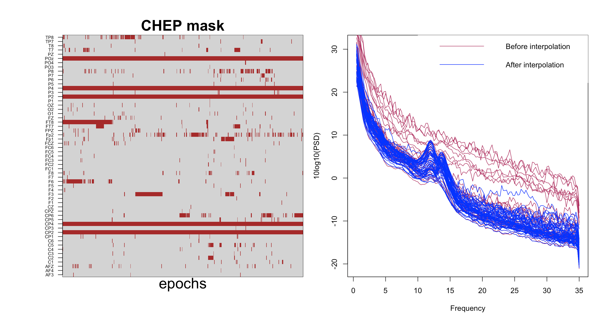

# Spatial/topographical commands

_Commands to apply spatial filtering and interpolation to dense EEG data_

| Command | Description | 
| ---- | ------ | 
| [Special variables](#special-variables) | Built-in variables, such as `${frontal}` |
| [`CLOCS`](#clocs)     | Specify EEG channel locations |
| [`SL`](#sl)           | Surface Laplacian spatial filtering |
| [`INTERPOLATE`](#int) | Epoch-wise interpolation of bad channels |

## Special variables

For a standard 64-channel EEG layout, the following convenience labels
are automatically defined, i.e. to complement `${eeg}` which contains _all_ EEG variables (based on channel labels).

| Variable | Channels |
| --- | --- |
| `${left}` | FP1  AF7  AF3 F1 F3 F5 F7 FT7 FC5 FC3 FC1 C1 C3 C5 T7 TP7 CP5 CP3 CP1 P1 P3 P5 P7 P9 PO7 PO3 O1 |
| `${midline}` | IZ OZ POZ PZ CPZ FPZ AFZ FZ FCZ CZ |
| `${right}` | FP2 AF8 AF4 F2 F4 F6 F8 FT8 FC6 FC4 FC2 C2 C4 C6 T8 TP8 CP6 CP4 CP2 P2 P4 P6 P8 P10 PO8 PO4 O2 |
| `${anterior}` | FP1 AF7 AF3 F1 F3 F5 F7 FPZ AFZ FZ FP2 AF8 AF4 F2 F4 F6 F8 |
| `${central}` | FT7 FC5 FC3 FC1 C1 C3 C5 T7 TP7 CP5 CP3 CP1 CPZ FCZ CZ FT8 FC6 FC4 FC2 C2 C4 C6 T8 TP8 CP6 CP4 CP2 |  
| `${posterior}` | P1 P3 P5 P7 P9 PO7 PO3 O1 IZ OZ POZ PZ P2 P4 P6 P8 P10 PO8 PO4 O2 |
| `${pre-frontal}` | FP1 FPZ FP2 |
| `${anterio-frontal}` | AF7 AF3 AFZ AF8 AF4 |
| `${mid-central}` | C1 C3 C5 CZ C2 C4 C6 |   
| `${centro-parietal}` | CP5 CP3 CP1 CPZ CP6 CP4 CP2 |
| `${frontal}` | F1 F3 F5 F7 FZ F2 F4 F6 F8 |
| `${fronto-central}` | FC5 FC3 FC1 FCZ FC6 FC4 FC2 |
| `${occiptital}` | O1 IZ OZ O2 |
| `${parietal}` | P1 P3 P5 P7 P9 PZ P2 P4 P6 P8 P10 |
| `${parieto-occipital}` | PO7 PO3 POZ PO8 PO4 |  
| `${temporal}` | FT7 T7 TP7 FT8 T8 TP8 |

For example, to only calculate coherence statistics between left and right hemisphere channel pairs:
```
luna s.lst -o out.db -s 'COH sig1=${left} sig2=${right}' 
```

## `CLOCS`

_Attach EEG channel locations_

A _clocs_ file should consist of 4 tab-delimited columns:

 - channel label
 - X, Y and Z Cartesian coordinates

An example channel map for a standard 64-channel EEG montage is
available [here](http://zzz.bwh.harvard.edu/dist/luna/clocs/clocs64).

Blank lines and lines starting with either the `#` or `%` character
are ignored.  All channel labels are internally converted to upper
case (i.e. matching to EDF channels is case insensitive).

Internally, coordinates are converted to a unit sphere before being
used by commands such as [`SL`](#sl).

In _verbose_ mode, as well as attaching the coordinates, the command writes
the polar and spherical coordinates to the output stream.

<h5>Parametes</h5>

| Option | Description | 
| ---- | ---- | 
| `file` | Specify which signals to include |
| `verbose`  | Verbose output |

<h5>Outputs</h5>

Verbose channel location information (option: `verbose`, strata: `CH`)

| Variable | Description |
| --- | --- |
| `X`    | Original X coordinate (Cartesian) |
| `Y`    | Original Y coordinate (Cartesian) |
| `Z`    | Original Z coordinate (Cartesian) |
| `SPH_R`  | Radius (Spherical) |
| `SPH_AZ`  | Azimuth (Sperhical) |
| `SPH_E` | Elevation (Sperhical) |
| `POLAR_ANGLE` | Angle (Polar) |
| `POLAR_RAD` | Radius (Polar) |

<h5>Example</h5>

_to be completed_


## `SL`

_Applies the surface Laplacian spatial filter to dense EEG data_

The surface Laplacian (sometimes called Current Source Density, CSD)
is a commonly used spatial filter, to increase the topographical
specificity of signals, by filtering out very globally-distributed
features. The surface Laplacian is applied in the time-domain, via the
spherical derivative method of Perrin et al (1987, 1989).

This command requires channel locations to have been previously
attached, via the [`CLOCS`](#clocs) command.  All signals are assumed
to have similar sampling rates.

[Kayser & Tenke (2016)](https://www.ncbi.nlm.nih.gov/pmc/articles/PMC4537804/) provide an
excellent review of the logic, parameterization and application of the surface Laplacian.

| Parameter | Example | Description |
| ---- | ---- | ---- |
|`sig` | `sig=${eeg}` | Specify signals for spatial filtering |
|`m`   | `m=5` | Spline flexibility, default _m_ = 4, higher values = smoother filtering |
|`order` | `order=20` | Order of the Legendre polynomial, default = 10 | 
|`lambda` | `lambda=1e-3` | Regularization parameter, default = 1e-5 |


<h5>Output</h5>

There is no explicit output; the internal EDF channels will reflect the spatially-filtered EEG channels.   They
can be written to a new EDF, e.g. with a subsequent `WRITE` command.

<h5>Example</h5>

To get power spectra for spatially-filtered signals:

```
luna s.lst -o out.db -s 'CLOCS file=clocs & SL sig=${eeg} & PSD sig=${eeg} spectrum'
```


## `INTERPOLATE`

_Epoch-wise interpolation of bad channels_

The `INTERPOLATE` command performs spherical spline interpolation
(following [Perrin et al
(1989)](https://pubmed.ncbi.nlm.nih.gov/2464490/)) to interpolate data
previously flagged by the [`CHEP-MASK`](artifacts.md#chep-mask) or
[`CHEP`](masks.md#chep) commands as "bad".  As well as interpolating
whole channels, this command can interpolate different patterns of
missing channels on an epoch-by-epoch basis.  That is, as sleep
recordings can be long, one does not necessarily want to refject an
entire channel if it has hours of clean data.

Channel locations must have been previously attached via the
[`CLOCS`](#clocs) command. The data must be
[`EPOCH`ed](epochs.md#epoch) prior to running this command.

<h5>Parametes</h5>

| Option | Description | 
| ---- | ---- | 
| `sig` | Specify which channels/signals to include |


<h5>Outputs</h5>

No explicit output.  The internal EDF will reflect the interpolated
set of channels. After interpolation, this command clears the [`CHEP`
mask](masks.md#chep).

<h5>Example</h5>

As we illustrate in this [vignette](../vignettes/chep.md), here we use the `INTERPOLATE` command to clean up hdEEG data.  See the vignette
and the documentation for  [`CHEP-MASK`](artifacts.md#chep-mask)  and [`CHEP`](masks.md#chep) for more details.[

```
luna Subj1.edf -o ss_psd3.db -s ' CHEP-MASK ch-th=2
                                & CHEP channels=0.3 dump
                                & CLOCS file=clocs 
                                & INTERPOLATE
                                & SIGSTATS epoch
                                & PSD spectrum max=35'
```

The left matrix shows the epochs, as identified by `CHEP-MASK` and `CHEP`, that the `INTERPOLATE` command
will interpolate; the right plot shows the PSD before and after QC and interpolation. 



Normally, one would want to specify a [`WRITE`](outputs.md#write)
command following interpolation, i.e. in order to save the
interpolated data and so not need to repeat this step.

