# Spindles and slow oscillations (SO)

|Command |Description | 
|---|---|
| [`SPINDLES`](#spindles) | Wavelet-based spindle detection |
| [`SO`](#so) | Slow oscillation detection |


## SPINDLES

_Wavelet-based sleep spindle detection_

This command detects spindles using a wavelet-based approach.
Optionally, it also detects slow oscillations (SO) and the temporal
coupling between spindles and SO.  A _target frequency_ is specified,
which corresponds to the _center frequency_ of the Morlet wavelet.  A
single `SPINDLES` command can detect spindles at different
frequencies, and on different channels; there are also options for
collating putative spindles that are coincident in time but 
observed on different channels and/or at neighbouring frequencies.

The `SPINDLES` command has quite a large number of options (although
most of them are not necessary for its basic operation).  For clarity,
this section is split into a number of sub-sections that describe
different aspects of this command:

- [Basic usage](#basic-usage)
- [Determining thresholds](#thresholds)
- [Collating spindles](#collating-spindles)
- [Additional spindle morphology metrics](#other-metrics)
- [Generating spindle annotations and viewing spindles](#annotations)
- [Spindle/SO coupling](#spindleso-coupling)


After running the wavelet transform, spindles are detected based on
the following rules:
 
- the magnitude of the wavelet transform is smoothed (default sliding
  window of 0.1, `win`) and scaled by the whole-signal mean (or
  median, if the `median` flag is used)

- here, _whole-signal_ means all unmasked epochs available to this
  command (i.e. may be only all N2 epochs rather than all epochs)

- a spindle is called when a _core_ interval of at least 0.3 seconds
  (`min0`) exhibits a signal at least 4.5 times (`th`) the mean (or
  median)

- furthermore, all spindles must also exhibit an _extended_ interval
  of at least 0.5 seconds (`min`) with a signal at least 2 times
  (`th2`) the mean (or median)

- putative spindle intervals cannot be longer than 3 seconds (`max`);
  further, spindles within 0.5 seconds (`merge`) are merged (unless
  the resulting spindle is greater than `max` seconds)
 
- putative spindles are also filtered based on a quality metric _q_,
  the threshold of which is given by the `q` parameter

Following this heuristic procedure, in addition to the count and
_density_ (count per minute) of spindles, the following quantities are
estimated to characterize the morphology of each spindle, after
bandpass-filtering the signal for <em>F<sub>C</sub></em> &plusmn; 2
Hz:

- spindle duration (of core _plus_ flanking interval) in seconds, and
  number of oscillations

- spindle amplitude, based on the maximum peak-to-peak amplitude

- mean and maximum of the transformed wavelet statistic

- spindle frequency, based on counting zero-crossings, and secondarily
  based on the modal frequency from a FFT

- spindle symmetry, based on the relative location of the spindle's
  central "peak" (the point of maximum peak-to-peak amplitude), and a
  second "folded" symmetry index, calculated as 2|_S_-0.5|

- spindle chirp, based on the log ratio of mean peak-to-peak time intervals
  in the first versus the second half of the spindle

- a measure of _integrated spindle activity_ (ISA), based on the sum
  of normalized wavelet coefficients in the spindle interval

- a quality measure _q_ based on the ratio of 1) the relative
  enrichment of power in the sigma band (for the spindle compared to
  baseline) versus 2) the comparable relative enrichment in power
  across all bands (i.e. again for the spindle compared to baseline)

Averaging over all spindles in a given run, Luna reports the mean
spindle density, amplitude, duration, frequency, number of
oscillations, chirp, symmetry indices, etc.  Luna also reports
per-spindle statistics, as well as per-epoch counts of spindles.


### Basic usage

<h5>Parameters</h5>

The most basic parameter is `fc`, which specifies the target frequency
(or frequencies) for the wavelet(s).  Combined with the `cycles`
parameter, this defines the distribution of spindle frequencies that
are targeted by the wavelet.  See also the
[`CWT-DESIGN`](misc.md#cwt-design) command, which gives further information on
wavelet properties.

The primary output variables for an individual are spindle density
(`DENS`), mean duration (`DUR`) and frequency (`FRQ` or `FFT`, both
are typically very similar).  An additional metric of interest is
_integrated spindle activity_ (ISA), which, for a given spindle, is
the sum of the normalized wavelet coefficients in the spindle
interval.  Higher values indicate more evidence in favour of a
spindle, and longer and higher amplitude spindles.  Averaging across
spindles detected, for an individual, <em>ISA<sub>S</sub></em> is the
mean _ISA_, which reflects the average amplitude and duration of that
individual's spindles; <em>ISA<sub>M</sub></em> is the mean _ISA_ per
minute, which reflects the combination of spindle amplitude, duration
and density; <em>ISA<sub>T</sub></em> is the total _ISA_, which
reflects the combination of spindle amplitude, duration and count.
Because it is normalized by the individual's baseline,
<em>ISA<sub>S</sub></em> may be a better metric on which to base
inter-individual comparisons, compared to `AMP` which is more likely
to reflect technical differences in recordings.
 

<H6>Primary options</H6>

| Parameter | Example | Description |
| --- | --- | --- |
| `sig`    | `sig=C3,F3` | Restrict analysis to these channels (otherwise, all channels are included) | 
| `fc`     | `fc=11,15`  | <em>F<sub>C</sub></em> value(s), e.g. to find 11 and 15 Hz spindles (default 13.5 Hz) |
| `cycles` | `cycles=12` | Number of cycles, where more cycles gives better frequency but poorer temporal resolution (default 7) | 
| `epoch`  | `epoch`     | Show epoch-level output (number of spindles per epoch |
| `per-spindle` | `per-spindle` | Show spindle-level output |
| `th`     | `th=6`      | Multiplicative threshold for core spindle detection (default 4.5) |
| `th2`    | `th2=3`     | Multiplicative threshold for non-core spindle detection (default=2) |
| `median` | `median`    | Flag to indicate that the median, not mean, is used for thresholding |
| `q`      | `q=0.3`     | Quality metric criterion for individual spindles (default 0) |


<h6>Secondary parameters</H6>

Most users will not need to alter these.

| Parameter | Example | Description |
| --- | --- | --- |
|`fc-lower` | `fc-lower=9`  | Lower limit if iterating over multiple <em>F<sub>C</sub></em> values |
|`fc-upper` | `fc-upper=15` | Upper limit if iterating over multiple <em>F<sub>C</sub></em> values |
|`fc-step`  | `fc-step=2`   | Increment step if iterating over multiple <em>F<sub>C</sub></em> values |
| `th-max` | `th-max=10` | Maximum threshold for spindle core (default: none) | 
| `min`    | `min=1` | Minimum duration for an entire spindle (default 0.5 seconds) |
| `min0`   | `min0=0.3` | Minimum duration for a spindle core (default 0.3 seconds) | 
| `max`    | `max=2` | Maximum duration for an entire spindle (default 3 seconds) |
| `win`    | `win=0.2` | Smoothing window for wavelet coefficients (default 0.1 seconds) |
| `local`  | `local=120` | Use local window (in seconds) to define baseline for spindle detection | 

          
<h3>Outputs</h3>

Individual-level output (strata: `F` x `CH`)

| Variable | Description |
| ---- | ---- | 
| `DENS`  | Spindle density (count per minute) |
| `N`     | Total number of spindles |
| `AMP`   | Mean spindle amplitude (uV or mV units) |
| `DUR`   | Mean spindle duration (core+flanking region) |
| `NOSC` | Mean number of oscillations per spindle |
| `FWHM` | Mean spindle FWHM (full width at half maximum) |
| `ISA_S` | Mean integrated spindle activity (ISA) per spindle | 
| `ISA_M` | Mean integrated spindle activity (ISA) per minute |
| `ISA_T` | Total integrated spindle activity (ISA) |
| `FRQ`   | Mean spindle frequency (from counting zero-crossings) |
| `FFT`   | Mean spindle frequency (from FFT) |
| `CHIRP` | Mean chirp metric per spindle |
| `SYMM`  | Mean spindle symmetry metric |
| `SYMM2` | Mean spindle folded-symmetry metric |
| `Q`     | Mean spindle quality metric |
| `DISPERSION` | Mean dispersion index of epoch spindle count |
| `DISPERSION_P` | P-value for test of over-dispersion |
| `MINS`  | Total duration of signal entered into the analysis (minutes) |
| `NE`    | Number of epochs |
| `N01`   | Number of spindles prior to merging |
| `N02`   | Number of spindles post merging, prior to QC |

Epoch-level output (option: `epoch`; strata: `E` x `F` x `CH`)

| Variable | Description |
| ---- | ---- | 
| `N` | Number of spindles observed in that epoch (for that target frequency/channel) |
 
Spindle-level output (option `per-spindle`; strata: `SPINDLE` x `F` x `CH`)

| Variable | Description |
| ---- | ---- | 
| `AMP` | Spindle amplitude (uV or mV units) |
| `CHIRP` | Spindle chirp (-1 to +1) |
| `DUR` | Spindle duration (seconds) |
| `FWHM` | Spindle FWHM (seconds) |
| `NOSC` | Number of oscillations |
| `FRQ` | Spindle frequency based on counting zero-crossings in bandpass filtered signal |
| `FFT` | Spindle frequency based on FFT |
| `ISA` | Integrated spindle activity |
| `MAXTSTAT` | Maximum wavelet statistic |
| `MEANSTAT` | Mean wavelet statistic |
| `Q` | Quality metric |
| `PASS` | Flag (0/1) for whether this spindle passes the quality metric criterion |
| `START` | Start position of the spindle (seconds elapsed since start of EDF) |
| `STOP` | Stop position of the spindle (seconds elapsed since start of EDF) |
| `START_SP` | Start position of the spindle (in sample-units relative to current _in-memory_ EDF) | 
| `STOP_SP` | Stop position of the spindle (in sample-units relative to the current _in-memory_ EDF) |
| `SYMM` | Symmetry index (relative position of peak) |
| `SYMM2` | Folded symmetry index (0=symmetrical, 1=asymmetrical) || 


<h3>Example</h3>

Here we estimate spindles for all NREM2 sleep for the
[tutorial](../tut/tut1.md) individual `nsrr02`:

```
luna s.lst nsrr02 -o out.db -s "MASK ifnot=NREM2 & RE & SPINDLES fc=11,15 sig=EEG"
```

We see some output is sent to the console describing the process.  For
slow (i.e. target frequency of 11 Hz) spindles:

```
 CMD #3: SPINDLES

 detecting spindles around F_C 11Hz
 wavelet with 7 cycles
 smoothing window = 0.1s
 detection thresholds (core, flank, max)  = 4.5, 2x
 core duration threshold (core, min, max) = 0.3, 0.5, 3s
 pruned spindle count from 296 to 275
 filtering at 9 to 13
 filtering channel EEG_BP_11_4, bandpass FIR order 71
 estimated spindle density is 1.37845
```

The relevant strata in `out.db` are given by `destrat`, namely
per-individual, per-epoch and per-spindle respectively:

```
destrat out.db
```
```
  [SPINDLES]    : F CH              : 2 level(s)    : AMP CHIRP DENS DISPERSION DISPERSION_P
                :                   :               : DUR FFT FRQ FWHM ISA_M ISA_S ISA_T
                :                   :               : MINS N N01 N02 NE NOSC Q SYMM SYMM2
                :                   :               :
                :                   :               : 
  [SPINDLES]    : E F CH            : (...)         : N
                :                   :               : 
  [SPINDLES]    : F CH SPINDLE      : 692 level(s)  : AMP CHIRP DUR FFT FRQ FWHM ISA
                :                   :               : MAXSTAT MEANSTAT NOSC PASS Q START
                :                   :               : START_SP STOP STOP_SP SYMM SYMM2
                :                   :               :
```

To get the spindle density and mean spindle duration and frequency for this individual:

```
destrat out.db +SPINDLES -r F CH -v DENS DUR FFT -p 3 
```
```
ID      CH    F    DENS     DUR     FFT
nsrr02  EEG   11   1.378    0.847   11.280
nsrr02  EEG   15   2.090    0.847   13.475
```

We will further query the output using [_lunaR_](../ext/R.md) and
[`ldb()`](../ext/R.md#ldb). In R:

```
library(luna)

k <- ldb( "out.db" )
``` 

We can use `lx()` to see the strata (factor combinations) that
correspond to the `destrat` output above:

```
lx(k)
```
```
MASK : EPOCH_MASK 
RE : BL 
SPINDLES : CH_F CH_E_F CH_F_SPINDLE 
```

Looking at the per-epoch data:
```
d <- lx( k , "SPINDLES" , "CH_E_F" ) 
```
```
head(d)
```
```
> head(d)
      ID  CH  E  F N
1 nsrr02 EEG 92 11 2
2 nsrr02 EEG 92 15 0
3 nsrr02 EEG 93 11 4
4 nsrr02 EEG 93 15 0
5 nsrr02 EEG 98 11 2
6 nsrr02 EEG 98 15 1
```

Not that it is particularly informative in itself, but we can plot the
number of spindles per epoch for fast and slow spindles:

```
par(mfcol=c(2,1), mar=c(4,4,1,1))
plot( d$E[ d$F == 11 ]  , d$N[ d$F == 11 ]  , pch= 20 , col="orange" , 
      xlab="Epoch" , ylab="N spindles" , main="11 Hz spindles" ) 
plot( d$E[ d$F == 15 ]  , d$N[ d$F == 15 ]  , pch= 20 , col="skyblue" , 
      xlab="Epoch" , ylab="N spindles" , main="15 Hz spindles" )
```

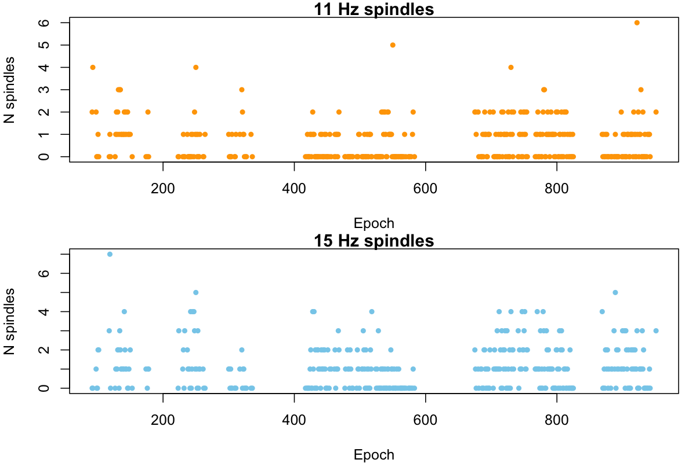

Luna provides a rough sanity-check to test for unusual distributions
of spindles per epoch, as might occur if a movement artifact, for
example, causes multiple spindles to be scored in one epoch.  To a
first approximation, we can treat the distribution of spindles per
epoch as Poisson-distributed, and test for over-dispersion (i.e. if the variance
is significantly greater than the mean).  This is provided by the `DISPERSION` and `DISPERSION_P` 
variables in the individual-level output:

``` 
destrat out.db +SPINDLES -r F CH -v DISPERSION DISPERSION_P -p 3 
```
```
ID      CH   F    DISPERSION   DISPERSION_P
nsrr02  EEG  11   1.143        0.606
nsrr02  EEG  15   1.243        0.038
```

In practice, we take values of `DISPERSION` above 2.0 to reflect
potentially problematic recordings/patterns of spindle detection, so these
don't look too bad.  Potentially the epochs with more than five spindles may 
questionable (especially as we did not apply any type of artifact correction prior 
to detecting spindles):

```
table( d$F , d$N ) 
```
```    
       0   1   2   3   4   5   6   7
  11 206 131  50   7   3   1   1   0
  15 154 139  62  27  14   2   0   1
```

Finally, here is an example spindle detected in this individual, shown
alongside the bandpass filtered EEG for delta, theta, alpha and beta
power as well as sigma power.  As expected (i.e. by definition), the
spindle corresponds to a brief increase in sigma power:

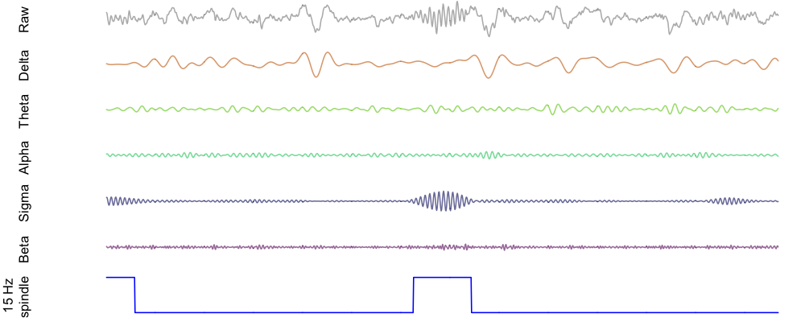

!!! note
    Primarily in the context of [_lunaR_](../ext/R.md), in the near future
    we'll be adding tutorials and helper functions to facilitate automatically making
    these types of plots quickly for all spindles in a dataset.


### Thresholds

The core of the spindle detection algorithm involves imposing discrete
thresholds on the quantitative metrics derived from the
continuously-varying EEG.  As such, there are a lot of _magic numbers_
inherent in the spindle detection process.  One of the key parameters
is the threshold which the normalized wavelet coefficient must exceed
for a putative spindle to be scored (the default of which is 4.5 times
the mean).  But is 4.5 a good magic number?  What about 2 instead? Or
what about 20? And so on...

To get some insight into whether this may be an appropriate choice for
the particular individuals and analyses under consideration, Luna has
a set of functions that evaluate different thresholds based on [Otsu's
method](https://en.wikipedia.org/wiki/Otsu%27s_method), a technique
from computer vision that attempts to set a threshold so as to
minimize the within-class variance (and so correspondingly, maximize
the between class variance) in the two classes that are formed by
placing a dichotomizing threshold on a continuous measure.  In our
scenario, the measure is the wavelet coefficient, and we are trying to
place a threshold that roughly corresponds to "spindle" and
"non-spindle".

If the continuous metric exhibits clear bimodality, this approach
should easily find a threshold that effectively splits the two peaks.
In the context of spindles, where things are likely to be a bit
messier, we consider the distribution of wavelet coefficients to be a
mixture of two classes: the null distribution of noise, i.e. where
there is no true spindle, and a second, less frequency class
representing points where a spindle is present (and where we will
expect higher values of the wavelet coefficient). 


<h5>Parameters</h5>

| Parameter | Example | Description |
| --- | --- | --- |
| `empirical` | `empirical` | Empirically determine thresholds |
| `set-empirical` | `set-empirical` | Use empirically determined thresholds for spindle detection |
| `verbose-empirical` | `verbose-empirical` | Output extensive information on threshold estimation | 


<h5>Output</h5>

Individual-level output (option: `empirical`, strata: `F` x `CH`)

| Variable | Description |
| ---- |---- |
| `EMPTH`             | Empirically-determined threshold |
| `EMPF`              | Relative frequency of above-thresholds points based on `EMPTH` |
| `MEAN_OVER_MEDIAN`  | Ratio of mean to median, to index skewness of the wavelet coefficients |


Between-class variance over range of thresholds (option: `empirical`, strata: `TH` x `F` x `CH`)

| Variable | Description |
| ---- |---- |
| `SIGMAB` | Between-class variance for given threshold |


<h5>Example</h5>

Here we use this approach on the three tutorial individuals: we run a
basic command to estimate spindles (for all NREM2 sleep, with no other
artifact detection in place), adding the `empirical` threshold:

```
luna s.lst sig=EEG -o out.db -s "MASK ifnot=NREM2 & RE & SPINDLES fc=11,15 empirical" 
```

In [_lunaR_](../ext/R.md), we use [`ldb()`](../ext/R.md#ldb) to load the resulting `out.db` file:

```
k <- ldb("out.db")
```
We extract the relevant table of results by different thresholds (`TH`):

```
d <- lx( k , "SPINDLES" , "CH_F_TH" )
```
As this table contains all three individuals, we'll use `lid()` and basic R functions to create three plots separately, of the between-class variance as a function of threshold, split by fast and slow spindles.  First, we get a list of the individual IDs:

```
ids <- unique( d$ID ) 
```
Then we loop to create three plots:
```
par(mfcol=c(1,3))
for (id in ids) { 
t <- lid( d , id )  
plot( t$TH[ t$F==11 ] ,  t$SIGMAB[ t$F == 11 ] , 
      type="l" , lwd=2 , col="orange" , 
      main=id, xlab="Threshold" , ylab="Between-class variance" , ylim=c(0,1)) 
lines( t$TH[ t$F==15 ] ,  t$SIGMAB[ t$F == 15 ] , type="l" , lwd=2 , col="skyblue" ) 
legend( 5,0.2,c("11 Hz","15 Hz"),fill=c("orange","skyblue"))
}
```

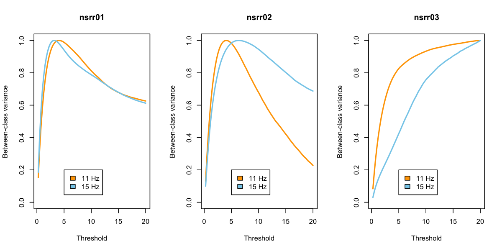

For the first two individuals, based on Otsu's criterion at least,
this suggests that thresholds around 4 or 5 are optimal, in the sense
of maximizing the between class variance (i.e. in wavelet coefficients
between "spindle" and "non-spindle" classes).  For the third
individual, the results look strange, suggesting that extreme threshold
such as 20 times the mean is optimal.  This is mirrored in the
individual-level output for `EMPTH` and `EMPF`: the optimal thresholds
and the corresponding area under the curve:


```
destrat out.db +SPINDLES -r F CH -v EMPTH EMPF -p 3
```
```
ID       CH   F   EMPF   EMPTH
nsrr01   EEG  11  0.034  4.000
nsrr01   EEG  15  0.067  3.250
nsrr02   EEG  11  0.041  4.000
nsrr02   EEG  15  0.024  6.250
nsrr03   EEG  11  0.001  20.000
nsrr03   EEG  15  0.002  20.000
```

This suggests there may be something off with the EEG channel for
`nsrr03`.  As well as looking at the raw data, one approach may be to
impose some automated artifact detection prior to spindle detection
and threshold estimation (i.e. as we would typically recommend).
Re-running with aberrant epochs removed prior to spindle detection
(i.e. by including [`ARTIFACTS`](artifacts.md#artifacts) and
[`SIGSTATS`](artifacts.md#sigstats) commands:

```
luna s.lst sig=EEG -o out2.db -s "MASK ifnot=NREM2 & RE \
                                  & ARTIFACTS mask & SIGSTATS mask th=3,3,3 & RE \
                                  & SPINDLES fc=11,15 empirical" 
```

This appears to normalize the "optimal" thresholds somewhat, in that
the area under the curve (i.e. roughly corresponding to the portion
of time in "spindle" versus "non-spindle" states) are ball-park what
we may expect to observe in a typical individual who has around 2 or
so spindles per minute detected at a central scalp EEG channel, with each spindle lasting 
approximately 1 second (i.e. 2/60 = 0.033):

```
destrat out2.db +SPINDLES -r F CH -v EMPTH EMPF -p 3
```
```
ID      CH   F    EMPF    EMPTH
nsrr01  EEG  11   0.046   3.500
nsrr01  EEG  15   0.092   2.750
nsrr02  EEG  11   0.041   4.000
nsrr02  EEG  15   0.029   5.500
nsrr03  EEG  11   0.033   4.000
nsrr03  EEG  15   0.066   3.000
```

Returning to the plots, things look a bit better:

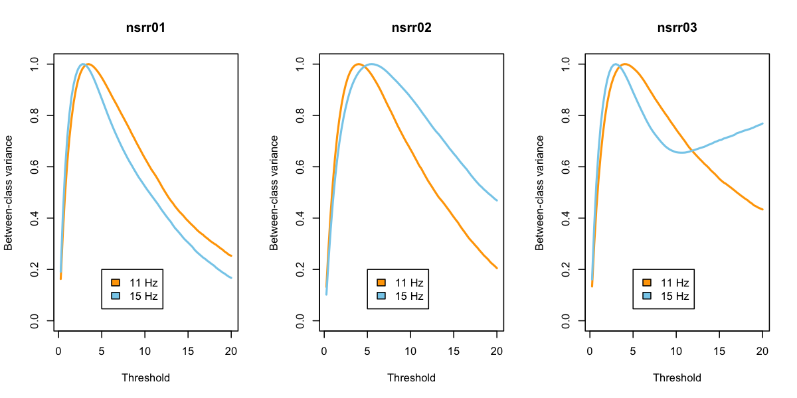


What to make of all this?  We do _not_ advise selecting different
"optimal" thresholds for each individual based on these analyses.
Rather, we suggest that looking at these (and other) metrics can be
useful in basic sanity-checking for whether a given analysis for a
given individual is likely to yield meaningful results.  


### Quality metrics

Luna calculates a simple QC metric for each spindle, by considering
the relative increase of non-spindle activity within the spindle
interval, relative to spindle-activity.  We use five fixed bands,
which unlike the `PSD` command, are _not_ altered by changing [special
variables](../luna/args.md#spectral-power-bands).  The three
non-spindle bands are: _delta_ (0.5-4 Hz), _theta_ (4-8 Hz), and
_beta_ (defined here as 20-30 Hz).  The two spindle bands are _slow
sigma_ (10-13.5 Hz) and _fast sigma_ (13.5-16 Hz).

For each channel, Luna calculates the baseline power for each band,
<em>P<sup>band</sup></em>.  For the interval spanning the
<em>i<sup>th</sup></em> spindle, we calculate band power
<em>P<sub>i</sub><sup>band</sup></em>.  We then calculate relative
enrichment for each band (on a log10 scale), as:

&nbsp; &nbsp; <em>E<sub>i</sub><sup>band</sup> = log10(P<sub>i</sub><sup>band</sup>) - log10(P<sup>band</sup>)</em>.

The _Q_ score for each spindle is based on the difference between the
largest _spindle-band_ relative enrichment versus the largest
_non-spindle band_ relative enrichment:

&nbsp; &nbsp; <em>Q<sub>i</sub> =
max( E<sub>i</sub><sup>slow-sigma</sup> , E<sub>i</sub><sup>fast-sigma</sup> ) - 
max( E<sub>i</sub><sup>delta</sup> , E<sub>i</sub><sup>theta</sup> , E<sub>i</sub><sup>beta</sup> )</em>

That is, numbers less than zero indicate that a _non-spindle_ band is
showing greater relative enrichment (relative to the _baseline_
log-scaled power for that band) than either _spindle_ band.  Such
spindles are more likely to reflect artifact which had a non-specific effect
on the power spectrum. 

To illustrate this QC metric, we'll detect spindles for the second
[tutorial](../tut/tut1.md) individual:

```
luna s.lst 2 sig=EEG -o out.db \
  -s "MASK ifnot=NREM2 & RE & \
      SPINDLES fc=11,15 enrich q=-9 ftr=sp1 cycles=12"
```

Here, we detect both fast and slow spindles, targeting 11 and 15 Hz
respectively; we've set _cycles_ to 12 instead of the default 7, in
order to increase frequency-specificity.  We've added the `enrich` option to output
<em>E<sub>i</sub><sup>slow-sigma</sup></em>
and 
<em>E<sub>i</sub><sup>fast-sigma</sup></em>
along with
<em>E<sub>i</sub><sup>delta</sup></em>
<em>E<sub>i</sub><sup>theta</sup></em>
and
<em>E<sub>i</sub><sup>beta</sup></em>
for each spindle/channel/target-frequency/band (and so stratified by
`CH`x`F`x`SPINDLE`x`B`).  We also set `q` equal to -9, which effectively turns off any
QC filtering, so that we can see what some spindles that would not otherwise have been called
with the default threshold (`q=0`) look like.  Finally, the `ftr` option writes out two files
that detail where spindles occur.

In [_lunaR_](../ext/R.md):
```
library(luna)
lattach( lsl( "s.lst" ) , 2 )
```
We'll attach as annotations the two newly-created files:
```
ladd.annot.file( "id_nsrr02_feature_SPINDLES-spindles-EEG-wavelet-11-sp1.ftr" ) 
ladd.annot.file( "id_nsrr02_feature_SPINDLES-spindles-EEG-wavelet-15-sp1.ftr" ) 
```
We'll then load our previously-generated results, saved in `out.db`:
```
k <- ldb( "out.db" ) 
```
and extract the table which contains <em>Q<sub>i</sub></em>, the per-spindle quality metric. 
```
d <- lx( k , "SPINDLES" , "F" , "CH" , "SPINDLE" )
```
Plotting the distribution of this separately for slow and fast spindles:
```
par(mfcol=c(1,2))
hist( d$Q[ d$F == 11 ] , breaks=30 , main="11 Hz spindles" , xlab="Q" , xlim=c(-2,2) ) 
abline(v=0,col="red",lwd=2)
hist( d$Q[ d$F == 15 ] , breaks=30 , main="15 Hz spindles" , xlab="Q" , xlim=c(-2,2) )
abline(v=0,col="red",lwd=2)
```
We see that most spindles (as would be expected) have quality scores greater than 0, meaning that the interval showed greater _spindle-band_ enrichment than _non-spindle-band_ enrichment.

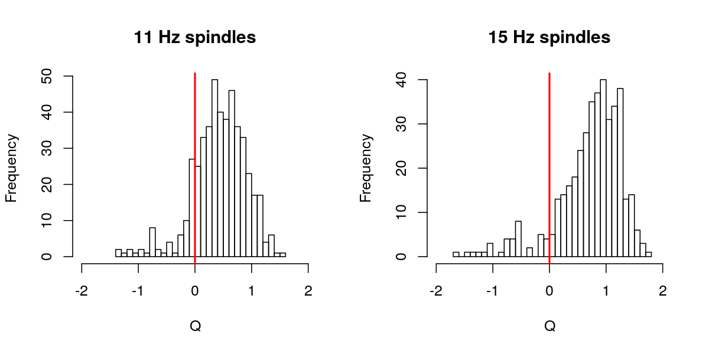


Of the _full_ set (i.e. running _without_ the default `q=0` threshold in place), we see that approximately 10% of spindles have `q` less than 0:
```
table( d$Q > 0 , d$F ) 
```
```
         11  15
  FALSE  68  36
  TRUE  405 370
```

Let's visualize some `q<0` and `q>0` spindles (we'll actually select
`qc>1` spindles, to ensure that we don't randomly select spindles with
`q` very near 0). For simplicity, we'll do this just for fast spindles.

First, we'll save the labels of the two new annotation tracks we
appended (i.e. you can see the names from running `lannots()`):

```
a15 = "SPINDLES-spindles-EEG-wavelet-15-sp1"
```
We'll then extract the intervals of each annotation _instance_, i.e. each spindle:
```
s15 <- lannots( a15 )
```
Confirming that we get 406 spindles, i.e. as output above, we can see `length(s15)` is indeed 406.

For visualization, here we'll just select five _low Q_ and five _high Q_ spindles: 
```
lo15 <- sample(d$SPINDLE[ d$Q < 0 & d$F == 15 ])[1:5]
hi15 <- sample(d$SPINDLE[ d$Q > 1 & d$F == 15 ])[1:5]
```

Using [_lunaR_](../ext/R.md) functions, we can then write a function
to plot the raw EEG signal for each spindle, with a 4-second flanking
window on either side:

```
f1 <- function(i,a) { 
x <- ldata.intervals( i , chs = "EEG" , annots = a , w = 4 )
y <- x$EEG
plot( x$SEC , y , type="l" , axes=F,xlab="",ylab="" , ylim=c(-125,125) )
t <- x$SEC[ x[,lsanitize(a)] == 1 ]
points( t , rep( -125,length(t)) , col=rgb(0,0,255,150,max=255) , pch="|" )
}
```

Finally, we'll generate a matrix of plots, with the five _low Q_ spindles in the left column, and
the five _high Q_ spindles in the right column:

```
par(mfrow=c(5,2),mar=c(0,0,0,0) )
for (i in 1:5) {
f1( i = s15[ lo15[ i ] ] , a = a15 )
f1( i = s15[ hi15[ i ] ] , a = a15 )
}
```

As you can see, the _low Q_ spindles (that would not have been
detected using Luna's default `q=0` setting) appear to reflect some
sources of artifact, whereas, as a whole, the _high Q_ spindles look
more like canonical spindles.


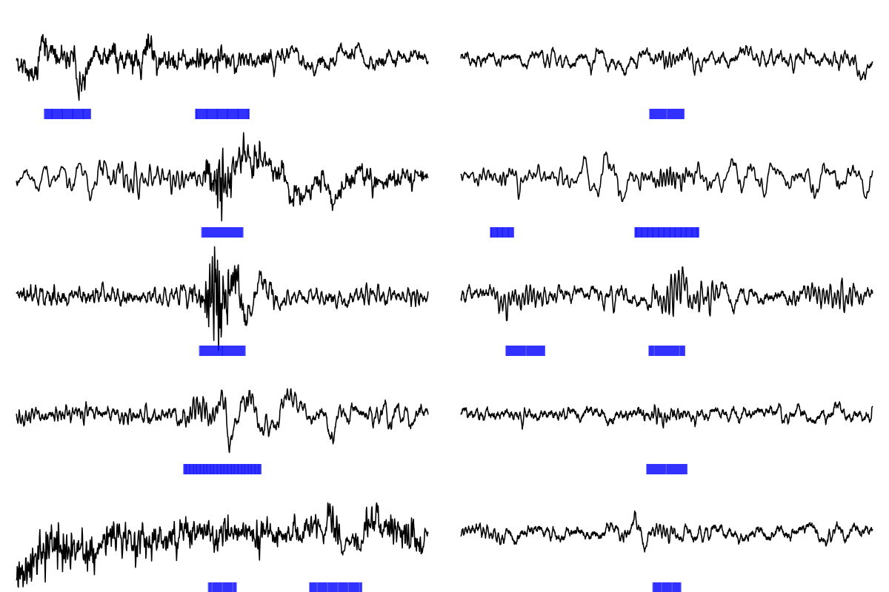

Be aware that setting `q` too high may unnecessarily miss many true
spindles though.  A value of `q=0.3` (i.e. log10(2)) requires that the
spindle-band enrichment is at least twice non-spindle band enrichment;
a value of `q=1` requires a 10-fold enrichment.  Considering the
distribution of mean _Q_ over all individuals in the study may provide a good starting point,
if you want to select non-default values.

!!! warning
    Naturally, neither this particular automated spindle
    detection algorithm, nor this particular quality metric, are
    guaranteed to always get it right...  We fully expect that this
    algorithm will flag as a "spindle" events that most scorers would
    not, and vice versa.  When first approaching this tool, 
    we'd advise experimenting with the different
    thresholds and parameters, and spot-check studies in the way we
    have above.  (The [_lunaR_ tutorial](../tut/tut4.md) shows how to
    automatically iterate through all spindles detected.)

    In general, if visual review seems to indicate likely artifact,
    the spindle is likely to be a false positive.  In contrast,
    however, otherwise _high Q_ spindles may appear relatively modest
    on visual review, and may not have been detected by some human
    scorers.  Human scoring does not constitute a real gold-standard,
    however, and both human and automatic approaches impose inherently
    arbitrary thresholds on what is likely a continuously-varying and
    heterogeneous set of physiological processes. As such, we'd advise
    against automatically assuming the automatic detector is wrong, at
    least for this latter class of events ("low amplitude spindles").
    
    Overall, the usual principles of a) trying
    to ensure that high-quality data go into the analysis, and b) working with
    large samples and appropriate statistical techniques downstream, are likely
    to be just as (if not more) important than spending too much
    tweaking the detection procedure, or agonizing over what is or is not "a
    true spindle".

   

### Collating spindles

When detecting spindles on multiple channels or at multiple, nearby
frequencies, what presumably is the same underlying physiological
event may often be detected multiple times.  These options assist in
collating the results of spindle detection across channels and/or
frequencies:

- you can control whether two temporally close spindles detected on
  the same channel/target-frequency should be merged and considered as
  one event or not (`merge` parameter, the default is 0.5 seconds)

- second, _within channel_, you can collate temporally overlapping
  spindles detected at nearby frequencies (i.e. we would expect a
  great deal of overlap in the results of an analysis with
  <em>F<sub>C</sub></em>=10 Hz and <em>F<sub>C</sub></em>=11 Hz).

- third, _across channels_, you can collate temporally overlapping
  spindles detected at nearby target frequencies; these may or may not
  represent physiologically distinct events depending on the montage
  and channels being collated.

These commands essentially take a list of spindles and generate
another list of so-called _m_-spindles: groups of spindles that, on
some definition, "overlap", i.e. represent the same underlying event.

The primary output from this analysis is an estimate of _m_-spindle
density (`MSP_DENS`), i.e. which is taken to reflect the total number
of unique spindles (i.e. allowing for potentially overlapping
definitions).  For each _m_-spindle (set a spindles), Luna also
calculates an mean frequency (a weighted mean of the constituent
spindle frequencies, with weights given by the ISA of each spindle).
This is output for each spindle and also used to generate a
frequency-conditioned estimate of _m_-spindle density. 
 
<h5>Parameters</h5>

| Parameter | Example | Description |
| --- | --- | --- |
| `merge`  | `merge=0.2` | Merge two putative spindles if within this interval (default 0.5 seconds) |
| `collate` | `collate` | Within each channel, collate overlapping spindles with similar frequencies (to `MSPINDLES`) |
| `collate-channels` | `collate-channels` | As above, except merge across channels also |
| `th-frq` | `th-frq=1` | Criterion for merging two spindles if difference in frequency is within this range (default 2 Hz) |
| `list-all-spindles` | `list-all-spindles` | List all spindles that comprise each _m_-spindle |


Secondary parameters:

| Parameter | Example | Description |
| --- | --- | --- |
| `th-interval` | `th-interval=0.5`  |  Merge two overlapping spindles if the ratio of intersection to union is at least this value (default 0, i.e. _any_ overlap) |
| `th-interval-cross-channel` | |
| `th-interval-within-channel` | |
| `window` | `window=0.5` | Set window around each spindle when defining temporal overlap |
| `hms` | `hms` | Show clock-time of each _m_-spindle |

<h5>Output</h5>

Individual-level summaries of _m_-spindles (option: `collate`, strata: _none_)

| Variable | Description |
| ---- | ---- | 
| `MSP_DENS` | _m_-spindle density |
| `MSP_N` | _m_-spindle count |
| `MSP_MINS` | Denominator for density, i.e. minutes of signal analyzed |

_m_-spindle density stratified by _m_-spindle frequency (option: `collate`, strata: `F` )

| Variable | Description |
| ---- | ---- | 
| `MSP_DENS` | _m_-spindle density conditional on _m_-spindle frequency |


Merged-spindle output (option: `collate`, strata: `MSPINDLE`) 

__or__ Merged-spindle output (option: `collate-within-channel`, strata: `CH` x `MSPINDLE`) 

| Variable | Description |
| ---- | ---- | 
| `MSP_DUR` | Duration of this _m_-spindle |
| `MSP_F` | Estimated frequency of this _m_-spindle |
| `MSP_FL` | Lower frequency of this _m_-spindle |
| `MSP_FU` | Upper frequency of this _m_-spindle |
| `MSP_SIZE` | Number of spindles in this _m_-spindle |
| `MSP_STAT` | Statistic for _m_-spindle |
| `MSP_START` | Start time (seconds elapsed from EDF start) of _m_-spindle |
| `MSP_STOP` | Stop time (seconds elapsed from EDF start) of _m_-spindle |

Spindle to _m_-spindle mappings (option: `list-all-spindles`, strata: `SPINDLE` x `MSPINDLE`) 

| Variable | Description |
| ---- | ---- | 
| `SCH` | Spindle label (_channel:target frequency_) | 
| `FFT` | Spindle estimated frequency (via FFT) |
| `START` | Spindle start time (elapsed seconds from EDF start) |
| `STOP` | Spindle stop time (elapsed seconds from EDF start) |

Additional output (option: `hms`, strata: `MSPINDLE` or `CH` x `MSPINDLE`))

| Variable | Description |
| ---- | ---- |
| `MSP_START_HMS` | Merged spindle start clock-time |
| `MSP_STOP_HMS`  | Merged spindle stop clock-time |


<h5>Example</h5>

```
luna s.lst 2 sig=EEG -o out.db -s "MASK ifnot=NREM2 & RE & \
                                   SPINDLES fc-lower=10 fc-upper=16 fc-step=0.25 \
                                            collate list-all-spindles"
```

The total _m_-spindle density is 4.89 spindles per second, i.e. this
estimates the total unique number of spindles over this broad frequency
range ( with target frequencies of 10-16 Hz and each wavelet spanning approximately 
plus/minus 2 Hz):
```
destrat out.db +SPINDLES 
```
```
ID       MSP_DENS   MSP_MINS    MSP_N
nsrr02   4.8972     199.5       977
```

We can also view the _m_-spindle density as a function of the
estimated _m_-spindle frequency: i.e. these numbers will sum to the
total `MSP_DENS` estimate (or close to it, as we only consider the
fixed range of 8 to 16 Hz in 0.5 Hz bins, by default, when outputing
this): 

```
destrat out.db +SPINDLES -r F 
```

Plotting the output of this command, we potentially see evidence of a
bimodality in spindle frequencies for this individual:

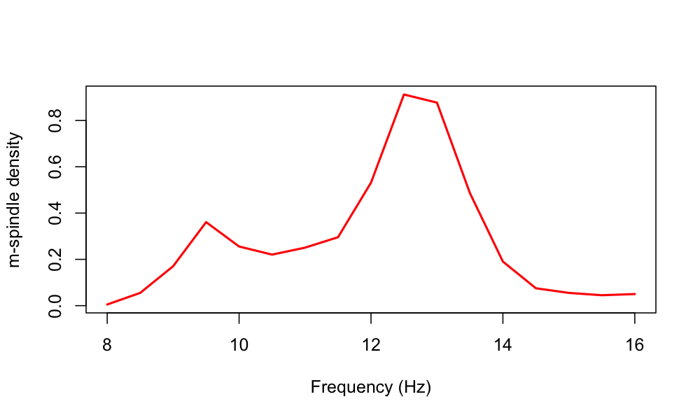


!!! info "Relationship to individualized spindle detectors"
    Rather
    than using fixed target frequencies (e.g. 13.5 Hz, 11 Hz, or 15
    Hz, etc) to define "spindles", some approaches to spindle
    detection seek to find, empirically, the "peak" or "peaks" (which
    may or may not be obviously present in the power spectra) for each
    particular individual, and then target spindles of those
    particular frequencies for that individual.  In contrast, this
    approach is effectively agnostic to an individual's "true"
    characteristic spindle frequency (or frequencies), or to having to
    define spindle frequencies up front, by virtue of simply
    considering all possible frequencies in the broad sigma range, and
    then combining results. (Arguably this approach might be preferred
    _a priori_ in any case, on the grounds that even within a single
    individual we can see marked shifts in spindle frequency over the
    course of the night.)


### Other metrics

The following options report some additional spindle morphology
characteristics (these are unlikely to be desired as part of any
primary spindle analysis, and so can be ignored by most users). The
`if` option estimates spindle _instantaneous frequency_, averaged over
spindles, as a function of the relative location within the spindle.
The `tlock` option produces an averaged EEG signature of detected
spindles, synced to the spindle peak (point of max peak-to-peak
amplitude).

<h5>Parameters</h5>

| Parameter | Example | Description |
| --- | --- | --- |
| `if`         | `if`         | Estimate instantaneous frequency of spindles |
| `if-frq`     | `if-frq=1`   | Window around target frequency (default 2 hz) |
| `tlock`      | `tlock`      | Flag to request (verbose) average, peak-locked waveforms | 

Instantaneous frequency is estimated via the filter-Hilbert method,
where the filter is <em>F<sub>C</sub></em> +/- _H_ Hz (where _H_ is
set by `if-frq`, default 2). 

<h5>Output</h5>

Instantaneous frequency (_IF_) per spindle (option: `if`, strata: `CH` x `F` x `SPINDLE`)

| Variable | Description |
| ---- | ---- |
| `IF` | Mean frequency per spindle over duration |

Mean _IF_ stratified by relative location in spindle (option: `if`, strata `CH` x `F` x `RELLOC`)

| Variable | Description |
| ---- | ---- |
| `IF` | Mean frequency of all spindles, per relative position within the spindle (five bins) |

<h5>Example</h5>

With the [tutorial](../tut/tut1.md) data:
```
luna s.lst 2 -o out.db -s "MASK ifnot=NREM2 & RE & \
                           SPINDLES sig=EEG fc=11,15 if tlock q=0.3 cycles=12"

```
To get the estimate of _IF_ per spindle (which will should typically be very highly correlated with `FRQ` and `FFT`, 
as they are all estimating essentially the same thing):

```
destrat out.db +SPINDLES -r F CH SPINDLE -v FFT FRQ IF 
```

To get the mean _IF_ stratified by relative position with the spindle
(i.e. dividing each spindle into five, equally-sized time bins):

```
destrat out.db +SPINDLES -r F CH RELLOC -p 3
```
```
ID	CH	F	RELLOC	IF
nsrr02	EEG	11	1	11.321
nsrr02	EEG	11	2	11.218
nsrr02	EEG	11	3	11.041
nsrr02	EEG	11	4	10.912
nsrr02	EEG	11	5	10.818
nsrr02	EEG	15	1	14.287
nsrr02	EEG	15	2	14.119
nsrr02	EEG	15	3	13.959
nsrr02	EEG	15	4	14.015
nsrr02	EEG	15	5	14.181
```

To plot the mean signal time-locked to each spindle peak (in [_lunaR_](../ext/R.md)):

```
k <- ldb("out.db")

d <- lx( k , "SPINDLES" , "CH" , "F" , "MSEC" ) 

par( mfcol=c(1,2) )
for (f in c(11,15)) { 
 plot( d$MSEC[ d$F==f ] , d$TLOCK[ d$F==f ] , ylim=c(-20,20) , type="l"
       xlab="Time (sec)",ylab="Mean EEG",main=paste(f,"Hz spindles"), lwd=2)
 abline(h=0,col="red",lty=2)
}
```

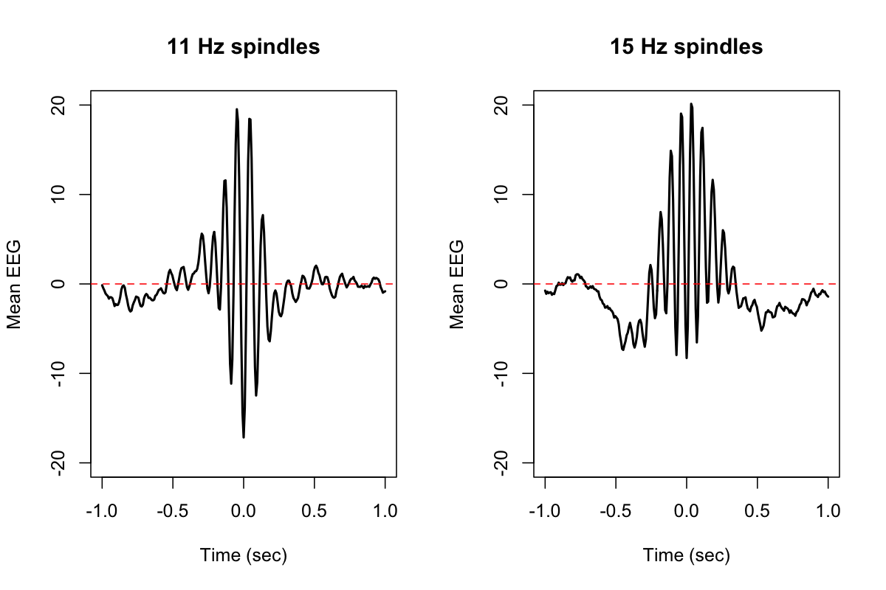


### Annotations

Luna can generate [FTR](annotations.md#ftr-files) files representing the spindles detected in
a given run.  These can subsequently be attached to an EDF via [_lunaR_](../ext/R.md), for example,
in order to visualize spindles, as in the examples [above](#quality-metrics).

<h5>Parameters</H5>

| Parameter | Example | Description |
| --- | --- | --- |
| `ftr`       | `ftr=tag`                 | Produce FTR files for all spindles, with the _tag_ in the filename |
| `ftr-dir`   | `ftr-dir=/path/to/folder` | Folder for FTR files |
| `show-coef` | `show-coef`               | Flag to request (very verbose) coefficient output (to `stdout`) | 

<h5>Output</H5>

The `ftr` option generates one file per channel/target frequency
combination, with a filename in the form:

```
id_{ID}_feature_spindles-{CH}-wavelet-{Fc}-{tag}.ftr
```

where _ID_ is the EDF ID, _CH_ is the channel label,
<em>F<sub>C</sub></em> is the target frequency, and _tag_ is the
user-supplied tag (from the `ftr` option).


### Spindle/SO coupling

Adding the `so` option for the `SPINDLES` command instructs Luna to
detect slow oscillations and report on their temporal coupling with
spindles. In short, Luna lines up the phase of slow oscillations with
the "peaks" of spindles (the point of maximal peak-to-peak amplitude,
typically near the center of the spindle), and then estimates the mean
_SO angle_ across spindle peaks, and two metrics of that measure the
strength of non-random temporal coupling between SO and spindles.

Either all spindles all are included in this analysis (if the
`all-spindles` option is given), or only spindles that overlap a
detected SO (the default).  In the former case, Luna will still use
the SO phase whether or not it would have explicitly reported a SO
spanning that spindle.

A __magnitude__ metric (`MAG`) is calculated based on the intra-trial
phase clustering (ITPC) statistic for all spindles, or those
overlapping a detected SO.  Second, an __overlap__ metric (`OVERLAP`)
is calculated, reflecting the proportion of spindles that show any
overlap (temporally) with a SO (for that same channel).  This second,
overlap metric is not reported if `all-spindles` is given.

If `nreps` is specified, Luna will perform that number of randomized
analyses, based on datasets in which spindle peaks are shuffled under
the null hypothesis of no specific coupling between spindles and SO.
The behavior of the permutation can be changed, such that instead of
spindles being shuffled only within the spanning epoch (the default),
they are shuffled across all epochs (`perm-whole-trace`).  Here, the
entire set of spindle peaks is shifted by a constant (wrapping around
the end/start of the signal, as necessary).  Second, if `all-spindles`
option _is not_ specified, then when evaluating the magnitude of
coupling, spindles are shuffled (each independently) only _within_ the
spanning SO (again, wrapping as necessary).  That is, in this latter
case, each null replicate contains exactly the same number of spindles
and slow oscillations, the same number of which show overlap in each
replicate.  The only thing that is randomized in this scenario is the
precise temporal association with spindle peak and SO phase _within_
detected SOs.


<h5>Parameters</h5>

For the primary parameters of the SO detection heuristic, see the section 
on the [`SO` command](#so) below.  These include:

- frequency band  (`f-lwr`, `f-upr`, etc)
- amplitude criteria (`mag`, `uV-neg`, `uV-p2p`, etc)
- duration criteria (`t-lwr`, `t-upr`, etc)

In addition to the above, the `so` option of the `SPINDLES` command
has additional parameters for the analysis of spindle/SO coupling:

| Parameter | Example | Description |
| --- | --- | --- |
| `nreps` | `nreps=10000` | Number of shuffled/surrogate time-series to generate |
| `all-spindles` | | Consider all spindles, whether or not they overlap a SO |
| `perm-whole-trace` |  | Do not use within-epoch shuffling |
| `stratify-by-phase` | | Additional overlap statistics per 20-degree SO phase bin |

<h5>Output</h5>

The `so` option of the `SPINDLES` command produces the same set of
outputs as the `SO` command (see [below](#so)), describing the
number and properties of the detected SOs. In addition, the `so`
option of the `SPINDLES` command generates extra outputs describing
the temporal coupling between spindles and SOs, described here:

Primary individual-level spindle/SO coupling output (option: `so`, strata: `CH` x `F`)

| Variable | Description |
| ----- | ----- |
| `COUPL_MAG` | Magnitude of coupling (ITPC metric) | 
| `COUPL_OVERLAP` | Number of spindles overlapping a detected SO |
| `COUPL_ANGLE` | Circular mean of SO phase at spindle peak (`SO_SPHASE_PEAK` below) |
| `COUPL_PV` | Asymptotic p-value for the ITPC statistic |

Permutation-based spindle/SO coupling output (options: `so`, `nreps`, strata: `CH` x `F`)

| Variable | Description |
| ----- | ----- |
| `COUPL_MAG_Z` | Z score for `COUPL_MAG` based on surrogate time series |
| `COUPL_MAG_NULL` | Mean coupling magnitude under the null |
| `COUPL_MAG_EMP` | Empirical p-value for `COUPL_MAG` based on surrogate time series |
| `COUPL_OVERLAP_NULL` | Mean overlap under the null |
| `COUPL_OVERLAP_Z` | Z-score for `COUPL_OVERLAP` |
| `COUPL_OVERLAP_EMP` | Empirical p-value for `COUPL_OVERLAP` |
| `COUPL_SIGPV_NULL` | Rate of null replicates with a p<0.05 significant asymptotic ITPC |


Spindle-level spindle/SO coupling output (option: `so`, strata: `CH` x `F` x `SPINDLE`)

| Variable | Description |
| ----- | ----- |
| `SO_SPHASE_PEAK` | SO phase at spindle peak |
| `NEAREST_SO`     | Time to nearest SO |
| `NEAREST_SO_NUM` | Number of nearest SO |


SO morphology (option: `so` `verbose-coupling`, strata: `CH` x `PHASE`)

| Variable | Description |
| ----- | ----- |
| `SOPL_EEG` | Phase-locked mean EEG value (as a function of SO phase, in 20-deg bins) |

SO morphology (option: `so` `verbose-coupling`, strata: `CH` x `SP`)

| Variable | Description |
| ----- | ----- |
| `SOTL_EEG` | Time-locked mean EEG value (as a function of sample-points before/after SO negative peak) |


Spindle/SO phase coupling (option: `so` `verbose-coupling`, strata: `CH` x `F` x `PHASE`)

| Variable | Description |
| ----- | ----- |
| `SOPL_CWT` | SO-phased locked mean spindle wavelet coefficient (18 20-deg bins)|

Spindle/SO phase coupling (option: `so` `verbose-coupling`, strata: `CH` x `F` x `SP`) 

| Variable | Description |
| ----- | ----- |
| `SOTL_CWT` | Time-locked mean spindle wavelet coefficient |


<h5>Example</h5>

Here we consider spindle/SO coupling for the second individual from
the tutorial data.  We'll only consider NREM2 sleep, for fast (15 Hz
target frequency) and slow (11 Hz target frequency) at default
settings.  We achieve this by adding `so` to the `SPINDLES` command,
along with the definition of the SO (see [below](#so)).  Here we'll
use a relative/adaptive threshold of 1.5 times the baseline mean,
along with othe default settings (e.g. for the duration and frequency
of the SO).


```
luna s.lst nsrr02 -o out.db -s 'MASK ifnot=NREM2 & RE & SPINDLES fc=11,15 sig=EEG so mag=1.5'
```

As seen from the log/console, Luna now also detected slow oscillations (as the `SO` command would do):
```
 detecting slow waves: 0.2-4.5Hz
  - relative threshold 1.5x median
  - full waves, based on consecutive positive-to-negative zero-crossings
 25380 zero crossings, of which 4977 met criteria (thresholds (<x, >p2p) -14.7917 30.0472)
 running Hilbert transform
```

You can see information about the number and properties of detected SOs as follows (nb. not all output shown):

```
destrat out.db +SPINDLES -r CH | behead
```
```
                       ID   nsrr02              
                       CH   EEG                 
                       SO   4977                
                   SO_AMP   -27.9675273648175   
                   SO_DUR   0.686249547920436   
                   SO_P2P   47.9202863568751    
                  SO_RATE   24.9473684210526    
```

That is, 4977 SO were detected, or 24.9 per minute (`SO_RATE`), with
an average duration of 0.69 seconds (`SO_DUR`) i.e. around 1.4 Hz.
Note these are based on NREM2 sleep only, and this definition of SO is
quite liberal, i.e. most of NREM2 is determined as having a "slow
oscillation" under this particular definition, and on average the SO
only has a negative deflection of -28uV.  See [below](#so) for
alternate definitions.


In terms of coupling between the SO and spindles, we can look at the
output table stratified by spindle target frequency (`F`) and channel
(`CH`):

```
destrat out.db +SPINDLES -r F CH | behead
```

Here are the relevant results for slow spindles:

```
              COUPL_ANGLE   324.240526870805    
                COUPL_MAG   0.133073212508123   
                 COUPL_PV   0.206789334851279   
            COUPL_OVERLAP   89                  
                        N   249                 
```

Here are the same metrics for fast spindles:

```
              COUPL_ANGLE   267.757606950599    
                COUPL_MAG   0.456849609921408   
                 COUPL_PV   2.04211688177307e-13
            COUPL_OVERLAP   140                 
                        N   393
```

Based on the asymptotic p-values (`COUPL_PV`), we see highly
significant spindle/SO coupling for fast but not slow spindles in this
individual.  140 (of 393) fast spindles overlap a detected SO.  For fast
spindles, the mean SO phase angle at spindle peaks is 267 degrees.  SO
phase angle is defined starting from a positive-to-negative
zero-crossing, as follows:

| Location | Phase angle |
|----|----|
| Positive-to-negative zero-crossing | 0/360 degrees |
| Negative peak | 90 degrees |
| Negative-to-positive zero-crossing | 180 degrees |
| Positive peak | 270 degrees |

We can also see, for each spindle, whether or
not the spindle overlapped a SO, and if so, the SO phase angle:

```
destrat out.db +SPINDLES -r F CH SPINDLE -v SO_PHASE_PEAK > o.txt
```

Looking at the results in R:
```
d <- read.table("o.txt",header=T)
```

We see that fast spindles (FS) preferentially have their peak around
the positive peak (270 degrees) of SO. In contrast, the pattern is
less clear for slow spindles (SS) in this particular
individual/analysis:

```
par(mfcol=c(1,2))
hist( d$SO_PHASE_PEAK[ d$F == 11  ] , breaks=15 , col = "blue" , xlab="SO phase angle (degrees)" , main="SS/SO coupling angle" ) 
hist( d$SO_PHASE_PEAK[ d$F == 15  ] , breaks=15 , col = "blue" , xlab="SO phase angle (degrees)" , main="FS/SO coupling angle" ) 
```

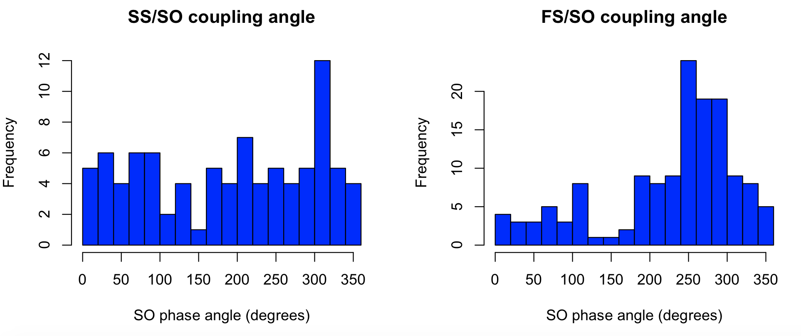


Next, we'll add random shuffling to the coupling analyses, to generate empirical, non-parametric estimates of significance, by adding the `nreps` command.  Here we specify 100,000 random permutations per analysis (these are evaluated quite quickly), running now only for fast spindles:

```
luna s.lst nsrr02 -o out.db \
      -s 'MASK ifnot=NREM2 & RE \
          & SPINDLES fc=15 sig=EEG so mag=1.5 nreps=100000'
```

We now see some additional metrics in the output.  For example,
whereas as observed 140 spindles overlapping a SO (`COUPL_OVERLAP`),
we see that on average, in each null replicate, only 104.2 spindles
overlapped a SO (`COUPL_OVERLAP_NULL`).  Based on these statistics,
this gives an empirical p-value of 0.028 (`COUPL_OVERLAP_EMP`),
i.e. in this individual, we see significant (p<0.05) overlap between
spindles and SO at the gross level:

```
destrat out.db +SPINDLES -r F CH  | behead
```

```
              COUPL_ANGLE   267.757606950599    
                COUPL_MAG   0.456849609921408   
            COUPL_MAG_EMP   9.99990000099999e-06
           COUPL_MAG_NULL   0.105944405707361   
              COUPL_MAG_Z   7.14893183381634    
            COUPL_OVERLAP   140                 
        COUPL_OVERLAP_EMP   0.027649723502765   
       COUPL_OVERLAP_NULL   104.1836            
          COUPL_OVERLAP_Z   2.22339252291559    
                 COUPL_PV   2.04211688177307e-13
         COUPL_SIGPV_NULL   0.2081              
```

The corresponding values for the ITPC metric are 0.46 observed
(`COUPL_MAG`) versus an average of 0.11 (`COUPL_MAG_NULL`) under the
null, giving an empirical p-value of 9.9e-6. Note: this is the
smallest possible empirical p-value if only 100,000 replicates are
specified, i.e. 1/(1+100000).  

!!! note 
    As they are based on
    randomization, naturally, you may get numerically slightly different
    values for some of these metrics, if you repeat the above analysis on
    the tutorial data.)

Note that `COUPL_SIGPV_NULL` shows that over 20% of null-replicates
had an _asymptotic_ ITPC p-value significant at the p<0.05 level.
That this is approximately four times greater than we'd expect by
chance suggests that the asymptotic p-values are, in this situation,
anti-conservative (i.e. we'd expect a 5% rate to be p<0.05 under the
null).  The observed 2e-13 asymptotic p-value is therefore likely to
be inflated too.  These considerations motivate the use of empirical
p-values in this context, given known biases with the ITPC (and
similar) metrics.  That is, prefer to use `COUPL_MAG_EMP` or
`COUPL_MAG_Z` as measures of spindle/SO coupling strength, rather than
`COUPL_MAG` or `COUPL_PV`.

Next, we can run the same analysis, but adding the `all-spindles`
option to extend the coupling analysis to _all_ spindles, i.e. whether
or not they overlap a detected SO:

```
luna s.lst nsrr02 -o out2.db -s 'MASK ifnot=NREM2 & RE & SPINDLES fc=15 sig=EEG so mag=1.5 nreps=100000 all-spindles'
```

Now the `COUPL_OVERLAP` metrics are not shown, i.e. as this analysis
ignores whether or not a particular SO was detected; rather the
estimated instantaneous phase from the Hilbert transform of the
slow-wave band-pass filtered signal is used irrespective:

```
              COUPL_ANGLE   249.957585228371    
                COUPL_MAG   0.23828160431191    
            COUPL_MAG_EMP   0.010469895301047   
           COUPL_MAG_NULL   0.0555142478440371  
              COUPL_MAG_Z   4.60828305383158    
                 COUPL_PV   2.03816238295918e-10
         COUPL_SIGPV_NULL   0.13594             
                        N   393                 
```

Here we see an attenuated but still significant spindle/SO coupling
(i.e. `COUPL_MAG_EMP` is 0.01).  In this example, however, using the
larger number of spindles (i.e. all 393 here, rather than only the 140
SO-overlapping ones) does not appear to give stronger results
(although, not the asymptotic p-values are high in each case).


<h5>Verbose coupling output</h5>

The `verbose-coupling` option, along with `so`, produces some additional tables/output strata that can be used to generate plots describing the nature of spindle/SO coupling:

```
luna s.lst nsrr02 -o out.db -s 'MASK ifnot=NREM2 & RE & SPINDLES fc=15 sig=EEG so mag=1.5 nreps=100000 verbose-coupling'
```

Four additional strata are added to the output: 

```
  [SPINDLES]    : CH PHASE          : 18 level(s)   : SOPL_EEG
                :                   :               : 
  [SPINDLES]    : CH SP             : 251 level(s)  : SOTL_EEG

  [SPINDLES]    : F CH PHASE        : 18 level(s)   : SOPL_CWT
                :                   :               : 
  [SPINDLES]    : F CH SP           : 251 level(s)  : SOTL_CWT
```

The first two contain the average EEG, either as a function of SO
phase, or time-locked to the negative peak of each SO.  The second two
contain the average spindle wavelet power (and so are dependent on
`F`, the target frequency for the spindle analysis too).  For example, we can extract and 
use R to plot `SOPL_EEG` and `SOPL_CWT`, the SO phase-locked raw EEG and spindle CWT respectively:

```
par(mfcol=c(1,2))
plot( d$PHASE , d$SOPL_CWT , type="b" , xlab="SO phase angle (degrees)" , ylab="CWT coefficient" , pch=20  ) 
plot( d$PHASE , d$SOPL_EEG , type="b" , xlab="SO phase angle (degrees)" , ylab="Mean raw EEG (uV)" , pch=20  ) 
```

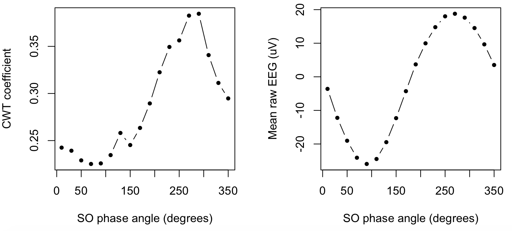


That is, the right panel confirms (as expected/defined) the typical
SO, which has a positive peak at 270 degrees.  The left panel shows
how the spindle wavelet power (i.e. the underlying metric upon which
spindles are explicitly detected) also has a peak that corresponds to
the SO positive peak.


Second, we can request additional `COUPL_OVERLAP` output, where rather
than assessing _any_ overlap between a spindle and a SO, here we
instead count overlap between a spindle and a particular point of a
SO, defined by SO phase (in 18 bins each of 20 degrees).  That is, we
add the `stratify-by-phase` option:

```
luna s.lst nsrr02 -o out.db -s 'MASK ifnot=NREM2 & RE & SPINDLES fc=15 sig=EEG so mag=1.5 nreps=100000 stratify-by-phase'
```

This has the effect of generating an additional table/output strata, defined by `F` and `PHASE` for a given channel (`CH`):

```
  [SPINDLES]    : F CH PHASE        : 18 level(s)   : COUPL_OVERLAP COUPL_OVERLAP_EMP
                :                   :               : COUPL_OVERLAP_Z
```

The definitions of the `COUPL_OVERLAP` metrics are as above, except now they are conditional on SO-phase bin.  

```
destrat out.db +SPINDLES -r F CH PHASE 

```

```
ID       CH    F    PHASE  COUPL_OVERLAP  COUPL_OVERLAP_EMP   COUPL_OVERLAP_Z
nsrr02   EEG   15   10     4               0.934              -1.235
nsrr02   EEG   15   30     3               0.958              -1.378  
nsrr02   EEG   15   50     3               0.958              -1.384  
nsrr02   EEG   15   70     5               0.794              -0.637  
nsrr02   EEG   15   90     3               0.981              -1.676  
nsrr02   EEG   15   110    8               0.440               0.287   
nsrr02   EEG   15   130    1               1.000              -2.450  
nsrr02   EEG   15   150    1               1.000              -2.587  
nsrr02   EEG   15   170    2               0.996              -2.047  
nsrr02   EEG   15   190    9               0.447               0.261   
nsrr02   EEG   15   210    8               0.642              -0.230  
nsrr02   EEG   15   230    9               0.516               0.084   
nsrr02   EEG   15   250    24              0.000               5.147   
nsrr02   EEG   15   270    19              0.005               2.968   
nsrr02   EEG   15   290    19              0.002               3.344   
nsrr02   EEG   15   310    9               0.355               0.508   
nsrr02   EEG   15   330    8               0.458               0.241   
nsrr02   EEG   15   350    5               0.810              -0.685
```

That is, `COUPL_OVERLAP` still adds to 140, as in the above example,
but these spindles are now listed depending on exactly _when_ in the
SO the spindle peak lies.  Plotting these metrics in R:

```
par(mfrow=c(2,2))
plot( d$PHASE , d$COUPL_OVERLAP , pch=20 , type="b" , xlab="SO phase angle (degrees)" , ylab="N spindles overlapping SO" )
plot( d$PHASE , d$COUPL_OVERLAP_Z , pch=20 , type="b" , xlab="SO phase angle (degrees)" , ylab="Z statistic" )
plot( d$PHASE , d$COUPL_OVERLAP_EMP , pch=20 , type="b" , xlab="SO phase angle (degrees)" , ylab="Empirical p-value" )
plot( d$PHASE , -log10(d$COUPL_OVERLAP_EMP ), pch=20 , type="b" , xlab="SO phase angle (degrees)" , ylab="-log10(empirical p-value)" )
abline( h=-log10( 0.05) , lty=2) 
```

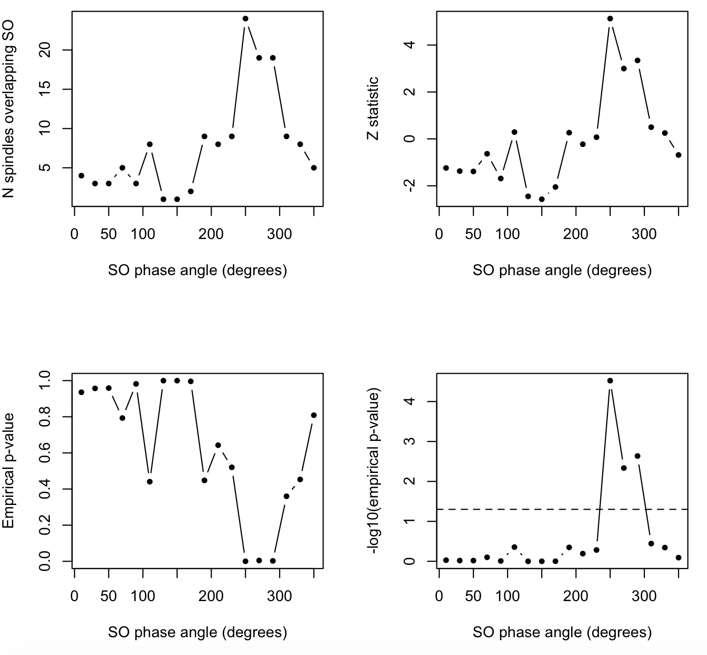


That is, we see the above-chance rate of spindle/SO overlap is not
uniformly distributed across the entire, but is concentrated around
250-290 degrees (consistent with the significant `COUPL_MAG` which is
another way to tell us the same thing).  

See the [`SO`](#so) section below for more details on how to define slow oscillations. 

### Misc

`show-coef`

The `show-coef` is primarily for development purposes and should not
be part of a standard spindle-analysis workflow. It produces a __lot__
of output: five values for every time-point for every channel for
every spindle frequency: this will be hard work for the output
database, which is not really designed for this type of data: you are
better off using this without the `-o` database option; rather,
extract the desired information directly from standard output:

```
luna s.lst 1 < cmd.txt \
  | awk ' $2 == "SPINDLES" && $5 == "CWT" { print $3,$4,$6 } ' OFS="\t"
```

|Variable|Description|
| ---- | ----- | 
| `RAWCWT` | Absolute, raw wavelet coefficient value |
| `CWT` | Normalized wavelet coefficient value |
| `CWT_TH` | Wavelet threshold for core spindle |
| `CWT_TH2` | Wavelet threshold for flanking spindle |
| `CWT_THMAX` | Wavelet max threshold for spindle |


## SO

_Detects slow oscillations via a simple, heuristic approach_

The `SO` command uses an heuristic approach to detect slow
oscillations (SO) in the sleep EEG, combined with filter-Hilbert estimation
of SO phase.  This command can also be invoked through the `so` parameter of
[`SPINDLES`](#spindleso-coupling) command, in which case additional metrics
describing spindle/SO coupling are also reported. 

The SO command works by first bandpass-filtering the EEG (given the
_frequency parameters_) and then applies a series of _time_ and
_amplitude_ criteria to identify individual SOs. Either absolute (fixed) or
adaptive (relative) amplitude thresholds can be specified.

<h5>Parameters</h5>

The example section below illustrates the application of these parameters, which determine what constitutes a _detected_ SO.

Bandpass filtering prior to SO detection:

| Parameter | Example | Description |
| --- | --- | --- |
| `f-lwr` | `f-lwr=0.2` | Bandpass filter lower transition frequency | 
| `f-upr` | `f-upr=4.5` | Bandpass filter upper transition frequency |            

Time criteria for SO detection:

| Parameter | Example | Description |
| --- | --- | --- |
| `t-lwr` | `t-lwr=` | Minimum duration of a SO |
| `t-upr` | `t-upr=` | Maximum duration of a SO |
| `t-neg-lwr` | `t-neg-lwr=0.5` | Lower threshold for negative peak (seconds) | 
| `t-neg-upr` | `t-neg-lwr=2`   | Upper threshold for negative peak (seconds) |

Amplitude criteria for SO detection:

| Parameter | Example | Description |
| --- | --- | --- |
| `mag`     | `mag=1`      | Use a relative amplitude threshold instead (see below) |
| `uV-neg`  | `uV-neg=-75` | Negative peak amplitude threshold ( default 0, i.e. no threshold ) |
| `uV-p2p`  | `uV-p2p=140` | Peak-to-peak amplitude (default 0, i.e. no threshold) | 
| `th-mean` | `th-mean`    | Use mean (instead of median) for thresholding |
| `stats-median` | `stats-median`    | Use median (instead of mean) for reporting SO stats (not for epoch-level reports) |

Additional options;

| Parameter | Example | Description |
| ---- | ----- | ----- | 
| `tl` | `tl=sig1,sig2` | Other signals to be summarized w.r.t. time-locked SO |
| `onset` | `onset` | Time-lock to SO onset instead of negative peak |
| `pos` | `pos` | Time-lock to SO positive peak instead of negative peak |
| `window` | `window=1` | Window around SO peak (default +/- 3 seconds) |


<!---
Additional SO detection options (currently not fully supported, do not use):

| Parameter | Example | Description |
| --- | --- | --- |
| `neg2pos` | `neg2pos` | Define full SO based on consecutive negative-to-positive zero-crossings |
| `half-wave` | `half-wave` | Detect all half waves instead of full waves | 
| `negative-half-wave` | `negative-half-wave` | Detect negative half-waves instead of full waves | 
| `positive-half-wave` | `positive-half-wave` | Detect positive half-waves instead of full waves | 
--->

<h3>Outputs</h3>

Primary SO information per channel (strata: `CH`) 

| Variable | Description |
| ---- | -----  |
|`SO` | Number of SO detected| 
|`SO_RATE` | SO per minute |
|`SO_AMP` | Median amplitude (of negative peak) |
|`SO_P2P` | Median peak-to-peak amplitude |
|`SO_DUR` | Median SO duration |
|`SO_SLOPE_NEG2` | Median slope (negative peak to negative-to-positive zero-crossing)  |
| _additional metrics:_| |
|`SO_NEG_DUR` | Median negative peak duration | 
|`SO_POS_DUR` | Median positive peak duration |
|`SO_SLOPE_NEG1` | Median slope (positive-to-negative zero-crossing to negative peak) |
|`SO_SLOPE_POS1` | Median slope (negative-to-positive zero crossing to positive peak) |
|`SO_SLOPE_POS2` | Median slope (positive peak to positive-to-negative zero-crossing) |
|`SO_TH_NEG` | Threshold used for negative peak |
|`SO_TH_P2P` | Threshold used for peak-to-peak |


Per SO output (strata: `CH` x `N`)

| Variable | Description |
| ---- | -----  |
|`START`| Start of SO (in seconds elapsed from start of EDF) |
|`STOP`| Stop of SO (in seconds elapsed from start of EDF) |
|`DUR`| SO duration |
|`UP_AMP`| SO positive peak amplitude |
|`DOWN_AMP`| SO negative peak amplitude |
|`P2P_AMP`| SO peak-to-peak amplitude |
|`SLOPE_NEG2` | Slope (upward slope of negative peak) |
| _additional metrics:_| |
|`START_IDX` | Sample index of SO start |
|`STOP_IDX`| Sample index of SO stop |
|`UP_IDX` | Sample index of positive peak|
|`DOWN_IDX` | Sample index of negative peak|
|`SLOPE_POS1` | Slope (alternate metric) |
|`SLOPE_POS2` | Slope (alternate metric) |
|`SLOPE_NEG1` | Slope (alternate metric) |


Epoch-level counts of SO (strata: `CH` x `E`)

| Variable | Description | 
| --- | --- | 
| `N` | Number of SOs detected in that epoch |


Time-locked signal averaging (option: `tl`, strata: `CH` x `CH2` x `SP`)

| Variable | Description | 
| --- | --- | 
| `SOTL` | Average signal for `CH2`, time-locked by SO detected in `CH` |


<h3>Example</h3>

The SO detection routine operates as follows:

 - Band-pass filter the signal with transition frequencies `f-lwr` and `f-upr` (defaulting to 0.5 and 4 Hz)

 - Find all positive-to-negative zero-crossings in the filtered signal

 - Retain intervals between consecutive zero-crossings that are between `t-lwr` and `t-upr` in duration (defaulting to 0.8 and 2.0 seconds)

 - __Either__ apply absolute amplitude filtering, designating SO as intervals with a negative peak below `uV-neg` (e.g. if `uV-neg=-75` this means _more negative_, i.e. -80 uV ) __and__ a peak-to-peak amplitude greater than `uV-p2p`

 - __Or__ apply adaptive amplitude filtering, designing SO as intervals with negative peak of `mag` times the median (or mean, if `th-mean`) negative peak __and__ a peak-to-peak amplitude `mag` times the median (or mean, if `th-mean`) peak-to-peak amplitude; the thresholds are written to the output (`SO_TH_NEG` and `SO_TH_P2P`)

As an example, looking at N3 sleep in the second individual from the
[tutorial](../tut/tut1.md) dataset, for the first EEG channel (`EEG`),
and using an adaptive threshold with a factor of 2 times the median:

```
luna s.lst nsrr02 -o out.db -s 'MASK ifnot=NREM3 & RE & SO sig=EEG mag=2'
```

```
 detecting slow waves: 0.2-4.5Hz
  - relative threshold 2x median
  - full waves, based on consecutive positive-to-negative zero-crossings
 9418 zero crossings, of which 824 met criteria (thresholds (<x, >p2p) -34.1888 69.5302)
 running Hilbert transform
```

Looking at the primary output variables:

```
destrat out.db +SO -r CH | behead
```
```
                       SO   824                 
                   SO_AMP   -51.3357345906725   
                   SO_DUR   1.0331359223301     
                   SO_P2P   89.7069054223203    
                  SO_RATE   8.90810810810811    
```

We see there were 824 SOs detected, or a rate of 8.9 per minute.  On
average, each SO was 1.03 seconds long, had a negative peak amplitude
of -51.3uV, and a peak-to-peak amplitude of 89.7uV.

In the literature, different investigators have used different
definitions for SOs in different contexts. Instead of using a relative
amplitude threshold (`mag`), you could set an absolute threshold.  For
example, here we require a negative peak of at least -40 uV, and at
least 75 uV peak-to-peak:

```
luna s.lst nsrr02 -o out.db 
                  -s 'MASK ifnot=NREM3 & RE & SO sig=EEG uV-neg=-40 uV-p2p=75'
```
```

                       SO   555                 
                   SO_AMP   -56.1938081995994   
                   SO_DUR   1.04608288288288    
                   SO_P2P   96.1411853282356    
                  SO_RATE   6                   
```

Alternatively, here we require even larger waveforms: 
```
luna s.lst nsrr02 -o out.db 
                  -s 'MASK ifnot=NREM3 & RE & SO sig=EEG uV-neg=-75 uV-p2p=140'
```
```
                       SO   13                  
                   SO_AMP   -94.4252281038546   
                   SO_DUR   1.08553846153846    
                   SO_P2P   168.084348953554    
                  SO_RATE   0.140540540540541   
```

Naturally, the amplitude is larger here, but there are far fewer SOs (here fewer than one per minute). 

!!! hint 
    It is also possible to specify time limits for the positive and negative components separately:
    ```
    t-neg-lwr=0.3 t-neg-upr=1.5  t-pos-lwr=0.0 t-pos-upr=1.0
    ```

Here we combine all definitions in a single command, this time for N2
and N3 sleep combined, using [`TAG`](summaries.md#tag) to organize the
results (by adding a tag `R`).  We'll also generate data to visualize
the average waveforms, using `tl`:

```
luna s.lst nsrr02 -o out.db 
      -s 'MASK all & MASK unmask-if=NREM2,NREM3 & RE & 
          TAG R/1 & SO sig=EEG mag=2 tl=EEG window=2 & 
          TAG R/2 & SO sig=EEG uV-neg=-40 uV-p2p=75 tl=EEG window=2 & 
          TAG R/3 & SO sig=EEG uV-neg=-75 uV-p2p=140 tl=EEG window=2 '
```

Looking at the SO rate for each threshold definition, we recover the above values:

```
destrat out.db +SO -r R CH -v SO_RATE SO 
```
```
ID       CH    R   SO     SO_RATE
nsrr02   EEG   1   4304   14.74
nsrr02   EEG   2   896    3.07
nsrr02   EEG   3   25     0.086
```

Now we see a larger difference in the estimated SO rate between the
first two methods (`R` of 1 and 2), reflecting that fact that adding
N2 sleep effectively lowers the threshold for detecting SOs, leading
to an overall higher rate, which may at first be counter-intuitive.
In contrast, for the two absolute definitions, the average rate lowers
when considering N2 and N3 combined versus just N3 sleep.
   
Extracting information from the `tl` option, this gives the averaged EEG signal time-locked to the negative SO peak:

```
destrat out.db +SO -r R CH CH2 SP > d.txt
```
we can load this into R and plot it:
```
d <- read.table("d.txt",header=T)
plot( d$SP[d$R==1], d$SOTL[d$R==1] , type="l" , col="blue" , lwd = 2 , 
      ylim = c(-100 , 50 ) , 
      xlab="Time from negative SO peak (sample-points)" , ylab="Signal" ) 
lines( d$SP[d$R==2], d$SOTL[d$R==2] , col="red" , lwd = 2 )
lines( d$SP[d$R==3], d$SOTL[d$R==3] , col="green" , lwd = 2 )
```

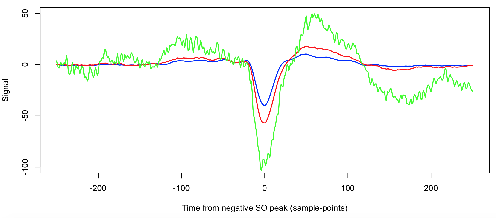

The three methods 1, 2 and 3 are blue, red and green respectively.
The green line (R3) is more variable as a smaller number of SO were
averaged over.  Otherwise, we see that the second method (red line)
yields slightly longer SOs of slightly greater amplitude.

Depending on the study population (e.g. children versus elderly, or
mice versus human), and depending on the purpose of the analysis,
different approaches may give better results.  For example, estimating
spindle/SO coupling will not be possible if there are not a sufficient
absolute number of SOs (and/or spindles) in the recording.


``` 
luna s.lst nsrr02 -o out.db -s 'MASK all & MASK unmask-if=NREM2,NREM3 & RE & 
     TAG R/1 & SPINDLES so fc=15 sig=EEG mag=2                 nreps=1000000 verbose-coupling & 
     TAG R/2 & SPINDLES so fc=15 sig=EEG uV-neg=-40 uV-p2p=75  nreps=1000000 verbose-coupling & 
     TAG R/3 & SPINDLES so fc=15 sig=EEG uV-neg=-75 uV-p2p=140 nreps=1000000 verbose-coupling ' 
```

```
destrat out.db +SPINDLES -r R CH F -v COUPL_OVERLAP COUPL_MAG_Z COUPL_OVERLAP_Z | behead
```
```
                       ID   nsrr02              
                       CH   EEG                 
                        F   15                  
                        R   1                   
              COUPL_MAG_Z   9.2884209252313     
            COUPL_OVERLAP   115                 
          COUPL_OVERLAP_Z   2.99092347889109    

                       ID   nsrr02              
                       CH   EEG                 
                        F   15                  
                        R   2                   
              COUPL_MAG_Z   6.49847282659681    
            COUPL_OVERLAP   54                  
          COUPL_OVERLAP_Z   4.7739523530548     

                       ID   nsrr02              
                       CH   EEG                 
                        F   15                  
                        R   3                   
              COUPL_MAG_Z   0                   
            COUPL_OVERLAP   1                   
          COUPL_OVERLAP_Z   0.770177278950557   
```

Here we see greater evidence for non-random the magnitude of
spindle/SO coupling (based on the empirical distribution of the ITPC
statistic) under the first method (Z=9.2 for R1 versus Z=6.5 for R2),
likely due to the greater number of observations.  The third method
(R3) only detects a couple of SOs in the dataset, with only a single
instance of spindle/SO overlap (`COUPL_OVERLAP` is 1).  In terms of
gross overlap, R2 is slightly more power than R1 in this instance
(Z=4.8 for R2 versus Z=3.0 for R1).


```
destrat out.db +SPINDLES -r R F CH PHASE > d.txt
```

```
d <- read.table("d.txt",header=T)
plot( d$PHASE[d$R==1], d$SOPL_CWT[d$R==1], 
      type="l" , lwd=2, col="blue" , ylim=c(0,0.6) , 
      xlab="SO phase (0/360 is positive-to-negative zero-crossing)" , 
      ylab="Spindle wavelet power") 
lines( d$PHASE[d$R==2], d$SOPL_CWT[d$R==2] , lwd=2, col="red" ) 
abline(v=270,lty=2)
```

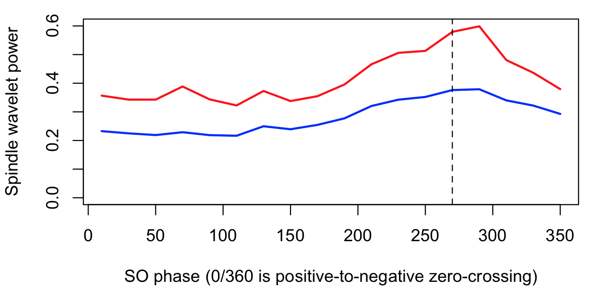

Here we see, for both R1 and R2 definitions, an increased fast spindle
wavelet power around the negative peak of the SO (270 degrees) for
this individual.


