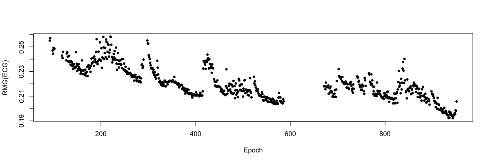

# Summaries

_Basic commands to give overviews of the structure of an EDF_

| Command | Description |
| -----  | ----- | 
|[`DESC`](#desc)       | Simple description of an EDF, sent to the console |
|[`SUMMARY`](#summary) | More verbose description, sent to the console | 
|[`HEADERS`](#headers) | Tabulate (channel-specific) EDF header information | 
|[`CONTAINS`](#contains) | Simple command to indicate whether ceftain signals are present |
|[`ALIASES`](#aliases) | Display aliases assigned for channels and annotations |
|[`TYPES`](#types) | Display current channel _types_ |
|[`VARS`](#vars) | Display current individual-level variables | 
|[`TAG`](#tag)         | Generic command to add a tag (level/factor) to the output |
|[`STATS`](#stats)     | Basic signal statistics (min/max, mean, RMS, etc) |
|[`SIGSTATS`](#sigstats)  | Hjorth parameters and other signal statistics |

## DESC

_Basic information on the attached EDF, written to the console_

Writes the EDF filename, ID, EDF duration, number of signals and the
labels and sampling rates of those signals.  If multiple EDFs are specified in a 
[_sample list_](../luna/args.md#sample-lists), this information will be
repeated for each one.  


<h3>Parameters</h3>

| Parameter | Example | Description |
| --- | --- | --- |
| `channels`  | `channels` | Only output simple list of channel names, one per row |

<h3>Outputs</h3>

Text written to the log/console.  Note that, unlike most Luna
commands, the `DESC` command does not generate any other output, i.e. via
Luna's formal [output mechanism](../luna/args.md#output).  

<h3>Example</h3>

Using `DESC` on the command-line with a single EDF:
    
```
luna my.edf -s DESC 
```
```
EDF filename    : my.edf
ID              : id001
Clock time      : 23:07:56 - 07:39:00
Duration        : 08:31:04
# signals       : 6
Signals         : EOG-L[256] EOG-R[256] EMG[256] EEG1[256] EEG2[256] EEG3[256]
```

## SUMMARY

_A more verbose display of EDF header information, written to the console_

Similar to `DESC`, this command writes basic information from the EDF
header to the console; per-channel information from the
EDF header is also displayed.  

<h3>Parameters</h3>

There are no command options for `SUMMARY`.

<h3>Outputs</h3>

Text written to the log/console.  Note that, unlike most Luna
commands, `SUMMARY` does not generate any other output, i.e. via
Luna's formal [output mechanism](../luna/args.md#output).

<h3>Example</h3>

To obtain a `SUMMARY` on the command-line with a single EDF:
    
```
luna my.edf -s SUMMARY
```
```
Patient ID     : my.edf
Recording info :
Start date     : 07.06.16
Start time     : 23:07:56

# signals      : 6
# records      : 30664
Rec. dur. (s)  : 1

Signal 1 : [EOG-L]
   # samples per record : 256
   transducer type      : G02
   physical dimension   : uV
   min/max (phys)       : -125/125
   EDF min/max (phys)   : -125/125
   min/max (digital)    : -2048/2047
   EDF min/max (digital): -2048/2047
   pre-filtering        : LP:35.00Hz HP:0.30Hz NOTCH:0

Signal 2 : [EOG-R]
   # samples per record : 256
   transducer type      : G03
   physical dimension   : uV
   min/max (phys)       : -125/125
   EDF min/max (phys)   : -125/125
   min/max (digital)    : -2048/2047
   EDF min/max (digital): -2048/2047
   pre-filtering        : LP:35.00Hz HP:0.30Hz NOTCH:0

   ... (etc) ...
```


## HEADERS

_Tabulate EDF header information_

This command produces similar information to the `SUMMARY` command,
except it uses Luna's standard 
[output mechanism](../luna/args.md#output), rather than writing to the
console.  

<h3>Parameters</h3>

There are no options for `HEADERS`.

<h3>Outputs</h3>

Basic EDF header information (strata: _none_)

| Variable | Description |
| --- | --- |
| `EDF_ID` | ID (in EDF header), or period (`.`) if empty |
| `START_TIME` | Start time |
| `START_DATE` | Start date |
| `NR`    | Number of records |
| `NS`    | Number of signals/channels | 
| `REC_DUR` | Duration of each record (seconds) |
| `TOT_DUR_SEC` | Total duration of EDF (seconds) |
| `TOT_DUR_HMS` | Total duration of EDF (hh:mm:ss string) |

Per-channel header information  (strata: `CH`)

| Variable | Description |
| --- | --- |
|`DMAX` | Digital max |
|`DMIN` | Digital min |
|`PDIM` | Physical dimension |
|`PMAX` | Physical min |
|`PMIN` | Physical max |
|`SR`   | Sample rate (Hz) |
|`SENS`   | Sensitivity (unit/bit) |
|`TYPE`   | Inferred channel [_type_](../luna/args.md#types) |

<h3>Example</h3>

To obtain each channel's sampling rate from a single EDF `my.edf`, and create an output database `out.db`:

```
luna my.edf -o out.db -s HEADERS
```
To view the contents of `out.db`:
```
destrat out.db
```
```
--------------------------------------------------------------------------------
out.db: 1 command(s), 1 individual(s), 16 variable(s), 120 values
--------------------------------------------------------------------------------
  command #1:	c1	Fri Aug 14 12:38:29 2020	HEADERS	sig=*
--------------------------------------------------------------------------------
distinct strata group(s):
  commands      : factors           : levels        : variables 
----------------:-------------------:---------------:---------------------------
  [HEADERS]     : .                 : 1 level(s)    : EDF_ID NR NS REC_DUR 
                :                   :               : START_DATE START_TIME 
                :                   :               : TOT_DUR_HMS TOT_DUR_SEC
                :                   :               : 
                :                   :               : 
  [HEADERS]     : CH                : 14 level(s)   : DMAX DMIN PDIM PMAX PMIN 
                :                   :               : SENS SR TYPE
                :                   :               : 
----------------:-------------------:---------------:---------------------------
```

This shows there are two _strata_: the first is a _baseline_ strata,
i.e. with factor `.` (period) to indicate no stratification, meaning
there is only one value for that variable for that EDF.  The second
_strata_ is by channel (`CH`), which has 14 levels, corresponding to
the 14 channels/signals in the EDF.

To extract the baseline information from the `HEADERS` command:
```
destrat out.db +HEADERS 
``` 
```
ID     EDF_ID NR    NS REC_DUR START_DATE START_TIME TOT_DUR_HMS TOT_DUR_SEC
nsrr01 .      40920 14 1       01.01.85   21.58.17   11.22.00    40920
```

To extract only the sample rate variable (`SR`), which is stratified
per-channel (`CH`):

```
destrat out.db +HEADERS -r CH -v SR 
```

```
ID       CH        SR
nsrr01   SaO2      1
nsrr01   PR        1
nsrr01   EEG(sec)  125
nsrr01   ECG       250
nsrr01   EMG       125
nsrr01   EOG(L)    50
nsrr01   EOG(R)    50
nsrr01   EEG       125
nsrr01   AIRFLOW   10
nsrr01   THOR RES  10
nsrr01   ABDO RES  10
nsrr01   POSITION  1
nsrr01   LIGHT     1
nsrr01   OX STAT   1
```

Alternatively, to extract all variables for `EMG` and `ECG` channels only:
```
destrat out.db +HEADERS -r CH/EMG,ECG
```
```
ID      CH   DMAX  DMIN  PDIM  PMAX  PMIN   SENS     SR   TYPE
nsrr01  ECG  127   -128  mV    1.25  -1.25  0.00980  250  ECG
nsrr01  EMG  127   -128  uV    31.5  -31.5  0.24705  125  EMG
```

## CONTAINS

_Use the return code mechanism to indicate whether particular signals are present_

This command is primarily intended to be used in the context of
automated, script-based analyses, to provide a quick way of
indicating whether particular channels (or sleep stage annotations) are
present in an EDF.

`CONTAINS` is unusual among Luna commands, in that it uses the _exit
code_ or _return code_ mechanism to report its findings, to faciliate
script-based analyses.  Using the bash shell, the default return code
(i.e. after running any command, not just Luna) is 0, meaning
"success".  It can be accessed via the `$?` special variable.  For
signal checking, the following convention is used:

 - 0 : all signals present (in all individuals)
 - 1 : at least 1 signal present (in all individuals)
 - 2 : no signals present (in at least one individual)

For stages,

 - 0 : sleep stage annotations present (in all individuals)
 - 1 : sleep stage annotations absent (in at least one individual)

!!! Windows and other shells 
    We have not tested this on any Windows machines, but the DOS variable
    `%errorlevel%` should be the analogue of the Linux/macOS `$?` bash variable.
    Most shells other than bash support the `$?` variable, although there may be some
    variations.


<h5>Parameters</h5>

This command can be run with _either_ the `sig` or `stages` options:

| Parameter | Example | Description |
| --- | --- | --- |
| `sig` | `sig=${eeg}` | Channels to be checked for presence/absence |
| `stages`  | | Instead of signals, indicate whether sleep stage annotations are present |

<h5>Output</h5>

The primary output of `CONTAINS` is via the return code, as described
above (and see example below). In addition, when checking whether the
EDF contains signals, some additional output is sent to the standard
output mechanism.

Individual-level output (strata: _none_)

| Variable | Description |
| ---- | ---- |	
| `NS_REQ` | Number of requested channels
| `NS_OBS` | Number of requested channels observed in the EDF |
| `NS_TOT` | Total number of channels in the EDF |

Channel-level output (option: `sig`, strata: `CH`)

| Variable | Description |
| ---- | ---- |
| `PRESENT` | 0/1 variable to indicate whether the requested signal is present |


<h5>Output</h5>


First checking which signals are present via the `DESC` command:

```
luna cfs.lst 1 -s DESC
```
```
Signals : C3[128] C4[128] M1[128] M2[128] LOC[128] ROC[128]
          ECG2[256] ECG1[256] EMG1[256] EMG2[256] EMG3[256] L_Leg[64]
          R_Leg[64] AIRFLOW[32] THOR_EFFORT[32] ABDO_EFFORT[32] SNORE[256] SUM[32]
          POSITION[1] OX_STATUS[1] PULSE[1] SpO2[1] NASAL_PRES[64] PlethWV[128]
          Light[512] HRate[512]
```

To test whether all/some of the following are present in an automated manner, using `CONTAINS`: here to test
for `LOC`, `ROC`, `EOG-L` and/or `EOG-R`:
```
luna cfs.lst 1 -o out.db -s CONTAINS sig=LOC,ROC,EOG-L,EOG-R
```

To see the return code in this scenario (which is always from the last command executed):
```
echo $?
```
```
1
```
which implies at least some of the above were seen.

We can also look at the more detailed output:

```
destrat out.db +CONTAINS
```
```
ID                 NS_OBS NS_REQ NS_TOT
cfs-visit5-800002  2      4      26
```

```
destrat out.db +CONTAINS -r CH
```
```
ID                   CH         PRESENT
cfs-visit5-800002    LOC        1
cfs-visit5-800002    ROC        1
cfs-visit5-800002    EOG-L      0
cfs-visit5-800002    EOG-R      0
```


In practice, the `CONTAINS` command is likely only to be used in scripting: e.g.

```
luna s.lst silent=T -s 'CONTAINS sig=${eeg}'

HAS_EEG=$?

if [[ ${HAS_EEG} -eq 0 ]]; then

  # ...
  # ...EEG-specific code here...
  # ...

fi
```


## ALIASES

_Output which annotation and channel remappings (aliases) were used for a particular individual_

The `alias` and `remap` special options alter channel and annotation
labels on-the-fly.  This command produces a record that tracks the
original labels and associated remappings.

<h3>Parameters</h3>

_None_

<h3>Output</h3>

Per-channel information (strata: `CH`)

| Variable | Description |
| --- | --- |
| `ORIG` | Original channel label (prior to re-aliasing) |

Per-annotation information  (strata: `ANNOT`)

| Variable | Description |
| --- | --- |
| `ORIG` | Original annotation label (prior to re-mapping) |


<h3>Example</h3>

If the file `vars.txt` contains aliases for two EEG channels:

```
alias	EEG1|EEG
alias	EEG2|EEG(sec)
```
then the command as follows:
```
luna s.lst 1 @vars.txt -o out.db -s ALIASES
```
generates the following `out.db`:
```
  commands      : factors           : levels        : variables 
----------------:-------------------:---------------:---------------------------
  [ALIASES]     : ANNOT             : 5 level(s)    : ORIG
                :                   :               : 
  [ALIASES]     : CH                : 2 level(s)    : ORIG
                :                   :               : 
----------------:-------------------:---------------:---------------------------
```
Looking at the aliased channels:
```
destrat out.db +ALIASES -r CH
```
```
ID      CH    ORIG
nsrr01  EEG1  EEG
nsrr01  EEG2  EEG(sec)
```
Looking at the aliased (remapped) annotation labels (this is done automatically unless the `nsrr-remap=F` flag is added):

```
destrat out.db +ALIASES -r ANNOT
```
```
ID      ANNOT               ORIG
nsrr01  apnea_obstructive   Obstructive Apnea
nsrr01  arousal_standard    Arousal ()
nsrr01  artifact_SpO2       SpO2 artifact
nsrr01  desat               SpO2 desaturation
nsrr01  hypopnea            Hypopnea
```
i.e. the original XML contained terms such as `SpO2 artifact` but these were (automatically) remapped to `artifact_SpO2`. 

## TYPES

Displays curret channel [_type_](../luna/args.md#types) definitions, either based
on the default set (internal to Luna) or user-specified (via
`ch-match`, `ch-exact` and/or `ch-clear`).

Types can be useful when writing scripts: e.g. to generate power
spectra for all EEG channels:

```
PSD sig=${eeg} spectrum
```

<h3>Parameters</h3>

None

<h3>Output</h3>

A list of channel IDs and the associated
[_type_](../luna/args.md#channel-types) are listed to standard output.  This
command will give identical output for all EDFs (i.e. it is
effectively independent of the attached EDF, although currently, it is
necessary to supply an EDF).  That is, this command shows the
template used to assign channel type variables for any EDF.

<h3>Example</h3>

```
luna s.lst 1 -s TYPES
```

```
EXACT	HRate	HR
PARTIAL	OFF	IGNORE
PARTIAL	STATUS	IGNORE
PARTIAL	E1	EOG
PARTIAL	E2	EOG
PARTIAL	EOG	EOG
PARTIAL	LOC	EOG
PARTIAL	ROC	EOG
PARTIAL	ECG	ECG
PARTIAL	EKG	ECG
... etc ...
```

The complete internal table of type definitions is [here](../resources/types.txt).

Users can add types via one or more `ch-match` or `ch-exact` options, or
clear all default types with `ch-clear=Y`.  

- __Exact matches__ are listed (and processed) before _partial matches_; they are case-sensitive, and require the full label to match.

- __Partial matches__ are processed after _exact matches_; these are
  case-insensitive, and the full channel label does not need to match:
  e.g. the template `O2` will match `SpO2`.

- Channels are assigned to _types_ in a specific order, depending on
  the type.  That is, the channel is assigned the first type that matches, all possible later matches are ignored.
  See [here](../luna/args.md#channel-types) for details.
  
The `ch-exact` and `ch-match` options can take comma-delimited lists, with each element in the form `TYPE|channel`.
If multiple channels specified at once, one can write as element in the form  `TYPE|channel1|channel2`, etc.   For example:

```
luna s.lst  ch-exact="EEG|xx|yy" -s TYPES 
```
```
EXACT     HRate   HR
EXACT     xx      EEG
EXACT     yy      EEG
PARTIAL   OFF     IGNORE
PARTIAL   STATUS  IGNORE
PARTIAL   E1      EOG
PARTIAL   E2      EOG
...
```


## VARS

_Output all variables for an individual_

The `VARS` command tabulates both
[_run-level_](../luna/args.md#variables) and
[_individual-level_](../luna/args.md#individual-variables) for each
EDF/individual.  The primary value of this command is to provide a
record of which values were used for a particular run/set of commands.

<h3>Parameters</h3>

_None_

<h3>Output</h3>

Per-variable information (strata: `VAR`)

| Variable | Description |
| --- | --- |
| `VAL` | Value for this variable, for this individual |
| `INDIV` | Boolean (0 or 1) to indicate whether this is an individual-level variable |


<h3>Example</h3>

Running `VARS` for one individual, setting the _run-level_ variable `${xyz}` on the command line:

```
luna s.lst 1 xyz=123 -o out.db -s VARS 
```
Looking at the output, stratified by variable name (`VAR`):
```
destrat out.db +VARS -r VAR
```

```
ID      VAR        INDIV  VAL
nsrr01  apnea      0      apnea_obstructive,apnea_central,apnea_mixed,hypopnea
nsrr01  arousal    0      arousal_standard,arousal_spontaneous,arousal_external,arousal_respiratory,arousal_plm,arousal_cheshire
nsrr01  arrhythmia 0      bradycardia,tachycardia,tachycardia_narrowcomplex
nsrr01  artifact   0      artifact_respiratory,artifact_proximal_pH,artifact_distal_pH,artifact_blood_pressure,artifact_TcCO2,artifact_SpO2,artifact_EtCO2
nsrr01  n1         0      NREM1
nsrr01  n2         0      NREM2
nsrr01  n3         0      NREM3,NREM4
nsrr01  plm        0      plm_left,plm_right
nsrr01  rem        0      REM
nsrr01  sleep      0      NREM1,NREM2,NREM3,NREM4,REM
nsrr01  wake       0      wake
nsrr01  xyz        0      123
nsrr01  airflow    1      AIRFLOW
nsrr01  ecg        1      ECG
nsrr01  eeg        1      EEG(sec),EEG
nsrr01  effort     1      THOR_RES,ABDO_RES
nsrr01  emg        1      EMG
nsrr01  eog        1      EOG(L),EOG(R)
nsrr01  generic    1      NA
nsrr01  hr         1      PR
nsrr01  id         1      nsrr01
nsrr01  ignore     1      NA
nsrr01  leg        1      NA
nsrr01  light      1      LIGHT
nsrr01  oxygen     1      SaO2,OX_STAT
nsrr01  position   1      POSITION
nsrr01  snore      1      NA
```

We see the specified variable is present (with the value `123`), and
with `0` under the `INDIV` column, denoting that this variable would
have been similarly defined for all EDFs present in this run (in this
particular example, there happens to be only a single EDF).  We also a
number of other, automatically defined variables.  The top ones are
automatically generated by Luna, to facilitate working with NSRR
annotations (e.g. the automatic variable `${apnea}` which is defined
as `apnea_obstructive,apnea_central,apnea_mixed,hypopnea`).  We also
see some individual level automatic variables, defined according to
[channel types](../luna/args.md#channel-types), e.g. `${airflow}`.

Note that in the above output `NA` means _not available_, i.e. that variable was not
defined for that run/individual.  Although displayed as `NA` by
`destrat`, the actual value would be blank (e.g. if `${snore}` was in a
command file, it would be replaced by a blank, 0-length character
string, rather than an actual `NA` character string).

## TAG

_Used to mark specific analyses in output_


`TAG`s allow you to arbitrarily add extra levels by which output is
_stratified_, which can be useful to distinguish similar commands
performed within the same analysis-run (for example, if several rounds
of [`MASK`s](masks.md#mask) and [`RESTRUCTURE`s](masks.md#restructure)
are specified in one analysis).


<h3>Parameters</h3>

| Parameter | Example | Description |
| --- | --- | --- |
| _{tag}_  | `run/L1`     | Add tag with level `L1` to factor `run` in output |
| `tag`  | `tag=run/L1` | Identical to the above, but explicitly using the `tag` option |

If a `.` (period) is specified as the level, that particular TAG is
removed from any subsequent output. For example, the following would
remove the `run` tag from all subsequent output:

```
TAG run/.
```

To remove _all_ tags, use the following:
```
TAG .
```

!!! hint
    Do not select a `TAG` factor name that is already 
    used by a Luna command (e.g. `F`, `CH`, `E`, `B`, etc). One safe way
    to ensure this is by only using _lower-case_ values for `TAG` factors,
    as all internal factors are upper-case.


<h3>Output</h3>

No specific output is generated, beyond adding the specified
stratifying factors in the output.

<h3>Example</h3>

By way of context, here we review the concept of _strata_ that Luna
uses extensively in its output.  For example, some analyses may have
their output stratified by two _factors_: channel and spectral band,
for which it uses the labels `CH` and `B`.  The `B` (spectral power
band) factor has a number of _levels_, e.g. `SIGMA` and so on.  When
using the [destrat](../luna/destrat.md#destrat) tool, one might request
output for all channels but only the sigma band, for example:

``` 
destrat out.db +PSD -r CH B/SIGMA 
``` 

where the syntax is `{factor}/{level}` for spectral power. How does
this apply to tags?  Consider the following command
[script](../luna/args.md#command-files) `cmd.txt`, which runs the
`STATS` command (described [below](#stats)):

```
% Create statistics for the entire night, tagged by ALL for the RUN factor

TAG run/ALL
STATS epoch

% Perform some kind of operation to change the data

EPOCH 
MASK epoch=1-10
RESTRUCTURE

% If repeating the same STATS command, we need to distinguish 
% the output from the prior STATS command, so we now set the 'run'
% factor to FLT, i.e. to indicate these are filtered results
% (Note that the choice of 'run', 'ALL' and 'FLT' are completely 
% arbitrary)

TAG run/FLT
STATS epoch
```

If we run this command: 

```
luna s.lst -o out.db < cmd.txt
```

and look at the output:

```
destrat out.db 
```

we will see that the `run` factor (specified by the `TAG` command)
appears as an additional factor:


```
 [STATS]  : CH run    : 28 level(s)  : MAX MEAN MEDIAN MEDIAN.MEAN MEDIAN.MEDIAN
          :           :              : MEDIAN.RMS MEDIAN.SKEW MIN NE NE1
          :           :              : RMS SKEW
          :           :              : 
 [STATS]  : E CH run  : (...)        : MAX MEAN MEDIAN MIN RMS SKEW
```

If we, for example, want to extract the `RMS` variable, here only for
the channel `EEG`:

```
destrat out.db +STATS -v RMS -r CH/EEG run 
```

then we'll see it has values for two levels of `run`, i.e. for `ALL`
and `FLT`, in other words before and after applying the mask:

```
ID	CH	run	RMS
nsrr01	EEG	ALL	37.801350632511
nsrr01	EEG	FLT	17.0591938957608
```
 
Alternatively, to extract `RMS` for all channels but from only the
second set of values, one would write (mirroring the original `TAG
run/FLT` command, and adding `-p 2` to control the number of decimal
places output):

```
destrat out.db +STATS -v RMS -r CH run/FLT -p 2 
```

which yields:

```
ID      CH        run   RMS
nsrr01  SaO2      FLT   95.24
nsrr01  PR        FLT   73.18
nsrr01  EEG(sec)  FLT   14.76
nsrr01  ECG       FLT   0.07
nsrr01  EMG       FLT   8.73
nsrr01  EOG(L)    FLT   53.26
nsrr01  EOG(R)    FLT   50.11
nsrr01  EEG       FLT   17.06
nsrr01  AIRFLOW   FLT   0.12
nsrr01  THOR_RES  FLT   0.18
nsrr01  ABDO_RES  FLT   0.06
nsrr01  POSITION  FLT   2.01
nsrr01  LIGHT     FLT   1.00
nsrr01  OX_STAT   FLT   0.26
```

## STATS

_Calculates basic (per-epoch) statistics per-channel_ 

Calculates the mean, median, RMS, standard deviation and min/max for
each channel.  By default, this is for the _entire_ duration of the
recording, i.e. including both masked and unmasked epochs. For epoched
data, adding the `epoch` option generates additional epoch-level
output as well as the median (across epochs) of the per-epoch mean,
median, RMS and skewness.  Results from the `epoch` option are based 
on [_unmasked_](masks.md) epochs only.

<h3>Parameters</h3>

| Parameter | Example | Description |
| --- | --- | --- |
| `sig` | `sig=C3,F3` | Restrict analysis to these channels | 
| `epoch` | `epoch` | Calculate per-epoch statistics |

<h3>Outputs</h3>

Whole-night, per-channel statistics, based on _all_ epochs (strata: `CH`)

| Variable | Description |
| --- | --- |
| `MIN` | Signal minimum (from data, not EDF header) |
| `MAX` | Signal maximum (from data, not EDF header) |
| `MEAN` | Signal mean |
| `MEDIAN` | Signal median |
| `RMS` | Signal root mean square | 
| `SKEW` | Signal skewness |

Per-epoch, per-channel statistics for _unmasked_ epochs only (option: `epoch`, strata: `CH` x `E`)

| Variable | Description |
| --- | --- |
| `MIN` | Signal minimum (from data, not EDF header) |
| `MAX` | Signal maximum (from data, not EDF header) |
| `MEAN` | Signal mean |
| `MEDIAN` | Signal median |
| `RMS` | Signal root mean square | 
| `SKEW` | Signal skewness |

Additional whole-night, per-channel statistics, only using _unmasked_ epochs (option: `epoch`, strata: `CH`)

| Variable | Description |
| --- | --- |
| `NE`          | Total number of epochs in record |
| `NE1`         | Number of _unmasked_ epochs actually used in calculations |
| `MEDIAN.MEAN` | Median of all per-epoch means | 
| `MEDIAN.MEDIAN` | Median of all per-epoch medians |
| `MEDIAN.RMS` | Median of all per-epoch RMS values |
| `MEDIAN.SKEW` | Median of all per-epoch skewness values |


<h3>Example</h3>

As an arbitrary example: to see how the RMS of the ECG signal changes
over the night during sleep, using data from the [tutorial
data](../tut/tut1.md) (second individual in this case):

```
luna s.lst nsrr02 -o out.db -s "EPOCH & MASK if=wake & RESTRUCTURE & STATS epoch sig=ECG" 
```

```
destrat out.db +STATS -r E CH -v RMS > res.txt
```

Using the [R package](http://www.r-project.org), load and plot these epoch-wise values (run these commands within R):

```
d <- read.table("res.txt",header=T)
plot( d$E , d$RMS , col = d$ID , pch=20 , xlab = "Epoch" , ylab = "RMG(ECG)" ) 
```




## `SIGSTATS`

_Epoch-wise Hjorth parameters and other statistics_

This command calculates and reports per-epoch (and whole-signal)
[Hjorth parameters](https://en.wikipedia.org/wiki/Hjorth_parameters)
and (optionally) other statistics: signal root mean square (RMS), indices of signal
clipping (the proportion of points that equal the minimum or maximum
for that epoch), absolute maximum absolute values and flatness
(proportion of points of a similar value to the preceding value).

<h5>Parameters</h5>

Core parameters:

| Parameter | Example | Description |
| --- | --- | --- |
| `sig`     | `sig=C3,F3` | Restrict analysis to these channels |
| `epooch`  |   | Epoch-level output |x

<h5>Output</h5>

Per-channel whole-signal statistics (strata: `CH`)

| Variable | Description |
| --- | --- |
| `H1`    | First Hjorth parameter (activity) |
| `H2`    | Second Hjorth parameter (mobility) |
| `H3`    | Third Hjorth parameter (complexity) |
| `CLIP`  | Proportion of clipped sample points |
| `MAX`   | Proportion of maxed out sample points |
| `FLAT`  | Proportion of flat sample points |
| `RMS`   | Signal root mean square |


Per-channel epoch-level statistics (strata: `CH` x `E`)

| Variable | Description |
| --- | --- |
| `H1`    | First Hjorth parameter (activity) |
| `H2`    | Second Hjorth parameter (mobility) |
| `H3`    | Third Hjorth parameter (complexity) |
| `CLIP`  | Proportion of clipped sample points |
| `MAX`   | Proportion of maxed out sample points |
| `FLAT`  | Proportion of flat sample points |
| `RMS`   | Signal root mean square |

