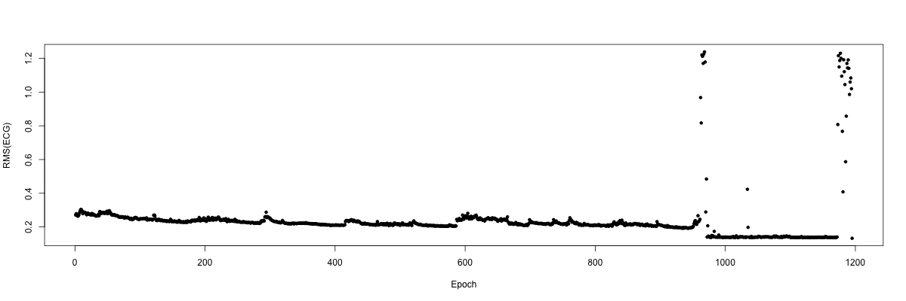
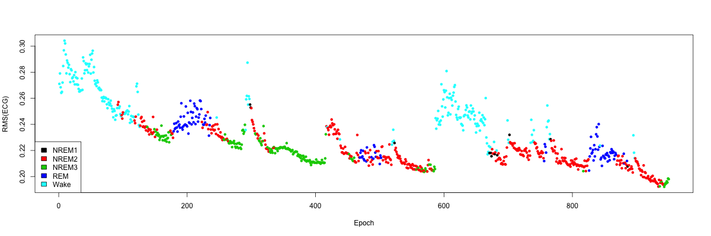
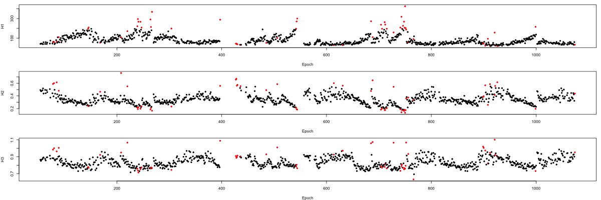
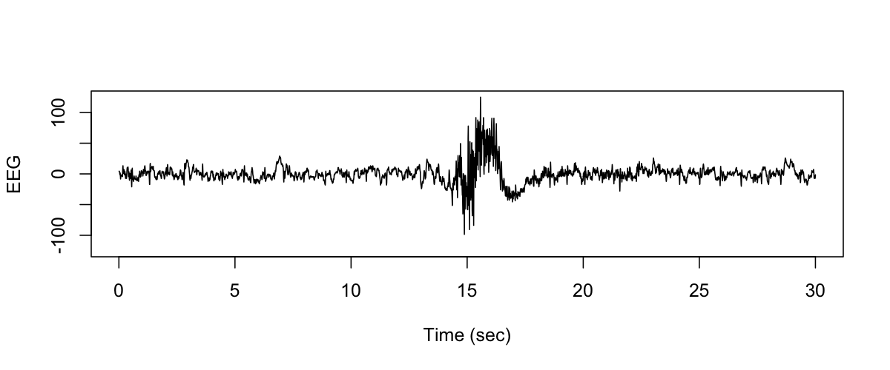
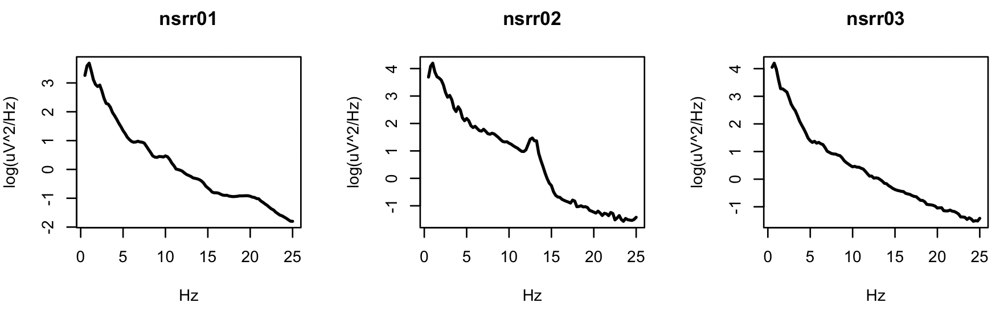
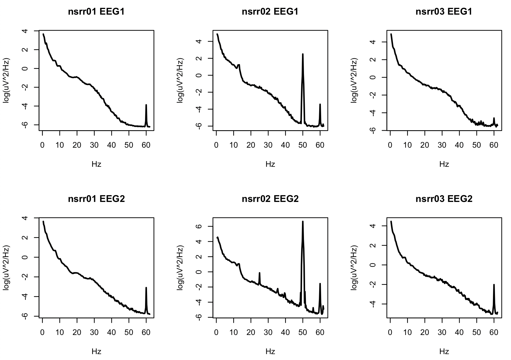

# A deeper dive 

In this third section of the tutorial, we use Luna to calculate some
typical metrics of interest for sleep studies, including:

* how basic statistics vary across the night
* measures of sleep macro-architecture
* filtering and artifact detection in the EEG
* spectral analysis using fast Fourier transforms
* spindle detection using wavelets

## Epoch-level summaries

Returning to the `STATS` command described above, here we use it
with the `epoch` option, in order to generate per-epoch statistics.
This section also illustrates working with the text output format.

```
luna s.lst 2 sig=EMG,ECG -s "EPOCH & STATS epoch" > res.txt
```
```
===================================================================
+++ luna | v0.24, 12-Aug-2020 |  starting 13-Aug-2020 13:34:38  +++
===================================================================
input(s): s.lst
output  : .
signals : ECG EMG
commands: c1	EPOCH	
        : c2	STATS	epoch=T

___________________________________________________________________
Processing: nsrr02 [ #2 ]
 duration: 09.57.30 ( clocktime 21.18.06 - 07.15.36 )

 signals: 2 (of 14) selected in a standard EDF file:
  ECG | EMG

 annotations:
  NREM1 (x11) | NREM2 (x399) | NREM3 (x185) | REM (x120)
  apnea_obstructive (x5) | arousal_standard (x51) | artifact_SpO2 (x34) | desat (x66)
  hypopnea (x101) | wake (x480)

 variables:
  ecg=ECG | emg=EMG
 ..................................................................
 CMD #1: EPOCH
   options: sig=ECG,EMG
 set epochs, length 30 (step 30), 1195 epochs
 ..................................................................
 CMD #2: STATS
   options: epoch=T sig=ECG,EMG
 processing ECG ...
 processing EMG ...

___________________________________________________________________
...processed 1 EDFs, done.
...processed 1 command set(s),  all of which passed
-------------------------------------------------------------------
+++ luna | finishing 13-Aug-2020 13:34:40                       +++
===================================================================
```

This command was applied only to the second EDF in the sample-list
(i.e. the `2` argument), and only to the `ECG` and `EMG` signals.
After defining 30-second epochs (the default from the `EPOCH` command),
it generates basic statistics per-epoch (the `epoch` option for the
`STATS` command), as well as entire-signal summaries.  Note that 1195
epochs are generated, which corresponds to the stated duration of 9
hours, 57 and a half minutes (i.e. `( 9 * 60 + 57 ) * 2 + 1 = 1195`).

The first few lines of `res.txt` are as follows: 

```
nsrr02   EPOCH   .        .   NE       1195
nsrr02   EPOCH   .        .   DUR      30
nsrr02   EPOCH   .        .   INC      30
nsrr02   STATS   CH/ECG   1   MAX      1.25
nsrr02   STATS   CH/ECG   1   MIN     -0.651961
nsrr02   STATS   CH/ECG   1   MEAN     0.00506797
nsrr02   STATS   CH/ECG   1   SKEW     1.68822
nsrr02   STATS   CH/ECG   1   MEDIAN   0.0343137
nsrr02   STATS   CH/ECG   1   RMS      0.271051
nsrr02   STATS   CH/ECG   2   MAX      1.25
...
```
That is, the first three lines (for which the 4th column is empty, `.`)
are from the `EPOCH` command.  The subsequent lines are
the per-epoch values from the `STATS` command: e.g. the mean is 0.00506797
for the first epoch.

This format is designed to be easily parsed and read by other
software.  For example, to use [R](https://www.r-project.org) to plot
the per-epoch RMS values of the ECG, we might use the following (__from
within R__):

```
d <- read.table( "res.txt" , header=F , sep="\t" , stringsAsFactors=F )
```

!!! hint
    As you'll see in the [next section](tut4.md) of this tutorial, it is now possible to read _lout_ databases
    directly into R
    
After loading the data, it is convenient to relabel the 6 columns to
have sensible names:

```
names(d) <- c( "ID" , "COMM" , "STRATA" , "T" , "VAR" , "VAL" ) 
```

Our goal is to generate a plot of per-epoch RMS for the ECG.  We can
extract these values by filtering rows where `VAR` equals `"RMS"`,
when `T` is not `"."`, and when `STRATA` is `"CH/ECG"`:

```
d <- d[ d$STRATA == "CH/ECG" & d$T != "." & d$VAR == "RMS" , ] 
```

We can confirm that this produces the expected number of rows/epochs:

```
dim(d)
```
```
 [1] 1195    6
```

We need to ensure that the epoch and value fields are treated as numeric data points:

```
d$T <- as.numeric(d$T)
d$VAL <- as.numeric(d$VAL)
```

As a sanity-check, we can view the structure of the data frame:

```
str(d)
```
```
'data.frame':	1195 obs. of  6 variables:
  $ ID    : chr  "nsrr02" "nsrr02" "nsrr02" "nsrr02" ...
  $ COMM  : chr  "STATS" "STATS" "STATS" "STATS" ...
  $ STRATA: chr  "CH/ECG" "CH/ECG" "CH/ECG" "CH/ECG" ...
  $ T     : num  1 2 3 4 5 6 7 8 9 10 ...
  $ VAR   : chr  "RMS" "RMS" "RMS" "RMS" ...
  $ VAL   : num  0.271 0.279 0.268 0.264 0.265 ... 
```

To plot these per-epochs values:

```
plot( d$T , d$VAL , ylab = "RMS(ECG)" , xlab = "Epoch" , pch=20 )
```




Clearly there are a number of extreme points towards the end of the
recording, presumably indicating bad data after the subject woke for
the final time that night.  We can confirm this by indicating the
manually-annotated sleep stage for each point. Going back to the
command line (type `q()` to get out of R, or even better, run the next
couple of Luna commands in a separate window to keep the R session
open), we can use Luna to extract sleep stages (using the `STAGE`
command) in a format that can be read into R:

```
luna s.lst 2 -o ss.db -s STAGE
```
and extracting the output as a text file `ss.txt`:
```
destrat ss.db +STAGE -r E -v STAGE > ss.txt
```


We then load this sleep stage information into R as follows, which
indicates that we have the expected number of epochs:

```
ss <- read.table( "ss.txt" , header=T )
dim(ss)
```
```
[1] 1195    3
```

This is the breakdown of epochs by each sleep stage for this individual:

```
table(ss$STAGE)
```
```
NREM1 NREM2 NREM3   REM  wake 
   11   399   185   120   480 
```

If you previously closed the R session, you'll need to rerun the
commands to create the `d` data-frame. Then, plotting epochs colored by
sleep stage, we indeed confirm that the end aberrant epochs are all
wake: (plot not shown).

```
plot( d$T , d$VAL  , ylab = "RMS(ECG)" , xlab = "Epoch" , pch=20 , col = ss$STAGE  )
cols <- sort(unique(ss$STAGE))
legend("topleft",legend=cols , fill = cols ) 
```

Simply ignoring these final points (which roughly corresponds to
looking only up to the 950th epoch in this example), we can generate a
clearer plot of how the RMS of the ECG varies across the night in this
individual, which tracks with the progression of sleep and wake in a
semi-predictable manner:

```
plot( d$T[ 1:950 ] , d$VAL[ 1:950 ]  , ylab = "RMS(ECG)" , xlab = "Epoch" , pch=20 , col = ss$STAGE ) 
legend("bottomleft",legend=cols , fill = cols )
```




## Hypnograms 

Given a set of epoch-based staging values, the `HYPNO` command
produces a series of statistics that describe different aspects of
sleep macro-architecture.

```
luna s.lst -o stage.db -s "EPOCH & HYPNO epoch"
```

This generate a large number of variables, as described [here](../ref/hypnograms.md#hypno).
There are three different strata groups in the output from `STAGE`:

```
destrat stage.db
```
```
--------------------------------------------------------------------------------
stage.db: 2 command(s), 3 individual(s), 66 variable(s), 107919 values
--------------------------------------------------------------------------------
  command #1:	c1	Thu Aug 13 13:40:56 2020	EPOCH	sig=*
  command #2:	c2	Thu Aug 13 13:40:56 2020	HYPNO	sig=*
-------------------------------------------------------------------------
distinct strata group(s):
  commands    : factors           : levels        : variables 
--------------:--------------:---------------:---------------------------
  [EPOCH]     : .            : 1 level(s)    : DUR INC NE
              :              :               : 
  [HYPNO]     : .            : 1 level(s)    : CONF MINS_N1 MINS_N2 MINS_N3 MINS_REM
              :              :               : NREMC NREMC_MINS OTHR PCT_N1 PCT_N2
              :              :               : PCT_N3 PCT_REM PER_SLP_LAT REM_LAT
              :              :               : SLP_EFF SLP_EFF2 SLP_LAT SLP_MAIN_EFF
              :              :               : T1_LIGHTS_OFF T2_SLEEP_ONSET T3_SLEEP_MIDPOINT
              :              :               : T4_FINAL_WAKE T5_LIGHTS_ON TIB
              :              :               : TPST TRT TST TWT WASO
              :              :               : 
  [HYPNO]     : E            : (...)         : CLOCK_HOURS CLOCK_TIME CYCLE CYCLE_POS_ABS
              :              :               : CYCLE_POS_REL E_N1 E_N2 E_N3 E_REM
              :              :               : E_SLEEP E_WAKE E_WASO FLANKING_ALL
              :              :               : FLANKING_MIN MINS N2_WGT NEAREST_WAKE
              :              :               : PCT_E_N1 PCT_E_N2 PCT_E_N3 PCT_E_REM
              :              :               : PCT_E_SLEEP PERIOD PERSISTENT_SLEEP
              :              :               : STAGE STAGE_N TOT_NR2R TOT_NR2W
              :              :               : TOT_R2NR TOT_R2W TOT_W2NR TOT_W2R
              :              :               : TR_NR2R TR_NR2W TR_R2NR TR_R2W
              :              :               : TR_W2NR TR_W2R WASO
              :              :               : 
  [HYPNO]     : C            : 6 level(s)    : NREMC_MINS NREMC_N NREMC_NREM_MINS
              :              :               : NREMC_OTHER_MINS NREMC_REM_MINS
              :              :               : NREMC_START
              :              :               :
  [HYPNO]     : PRE POST     : 9 level(s)    : N P P_POST_COND_PRE P_PRE_COND_POST
              :              :               :
--------------:--------------:---------------:-------------------------
```

The first (`.`) `HYPNO` group is a set of variables with no
stratifiers: that is, simply one value per individual/EDF.  These
include minutes of N2 sleep (`MINS_N2`).  To view the number of
minutes of each sleep stage for the three individuals, and also the
number of NREM cycles `NREMC`, we can use:

```
destrat stage.db +HYPNO -v MINS_N1 MINS_N2 MINS_N3 MINS_REM NREMC
```
```
ID      MINS_N1 MINS_N2 MINS_N3 MINS_REM NREMC
nsrr01  54.5    261.5   8       119      6
nsrr02  5.5     199.5   92.5    60       5
nsrr03  26      187.5   10.5    0        3
```

To view cycle-level variables (`C` factor), we can use the following
to see the duration (in minutes) and start (in epoch number):

```
destrat stage.db +HYPNO -r C -v NREMC_START NREMC_MINS
```
```
ID       C    NREMC_MINS  NREMC_START
nsrr01   1    45          87
nsrr01   2    100.5       184
nsrr01   3    47          451
nsrr01   4    77.5        654
nsrr01   5    60          819
nsrr01   6    50          956
nsrr02   1    72.5        92
nsrr02   2    133         237
nsrr02   3    42          503
nsrr02   4    105.5       675
nsrr02   5    32.5        887
nsrr03   1    69          118
nsrr03   2    74          312
nsrr03   3    137.5       630
```

To illustrate extracting epoch-level information: here we consider the
designated sleep stage (`STAGE` variable), along with the time
(`CLOCK_TIME`) and a measure of how many nearby epochs had the same
stage (`FLANKING_MIN`).  The latter is the minimum number of
contiguous epochs, either forwards or backwards in time, that are
similar to the index epoch (truncated at the start and end of the
recording).  In other words, selecting epochs with 3 or more for this
variable means that there are at least 3 epochs before and 3 epochs
after with a similar stage.  This can be used to select periods of
sleep that are less likely to contain stage transitions, for example.

```
destrat stage.db +HYPNO -i nsrr01  -r E  -v STAGE FLANKING_MIN CLOCK_TIME
```
```
ID       E      CLOCK_TIME   FLANKING_MIN  STAGE
nsrr01   1      21:58:17     0             Wake 
nsrr01   2      21:58:47     1             Wake 
nsrr01   3      21:59:17     2             Wake 
nsrr01   4      21:59:47     3             Wake 
nsrr01   5      22:00:17     4             Wake 
nsrr01   6      22:00:47     5             Wake 
nsrr01   7      22:01:17     6             Wake 
nsrr01   8      22:01:47     7             Wake 
nsrr01   9      22:02:17     8             Wake 
nsrr01   10     22:02:47     9             Wake 
nsrr01   11     22:03:17     10            Wake 
 ... cont'd ...                     
nsrr01   183    23:29:17     0             NREM1
nsrr01   184    23:29:47     0             NREM2
nsrr01   185    23:30:17     0             Wake 
nsrr01   186    23:30:47     0             NREM1
nsrr01   187    23:31:17     0             NREM2
nsrr01   188    23:31:47     1             NREM2
nsrr01   189    23:32:17     2             NREM2
nsrr01   190    23:32:47     3             NREM2
nsrr01   191    23:33:17     4             NREM2
nsrr01   192    23:33:47     5             NREM2
nsrr01   193    23:34:17     6             NREM2
nsrr01   194    23:34:47     7             NREM2
nsrr01   195    23:35:17     8             NREM2
nsrr01   196    23:35:47     9             NREM2
nsrr01   197    23:36:17     10            NREM2
nsrr01   198    23:36:47     10            NREM2
nsrr01   199    23:37:17     9             NREM2
nsrr01   200    23:37:47     8             NREM2
nsrr01   201    23:38:17     7             NREM2
nsrr01   202    23:38:47     6             NREM2
nsrr01   203    23:39:17     5             NREM2
nsrr01   204    23:39:47     4             NREM2
nsrr01   205    23:40:17     3             NREM2
nsrr01   206    23:40:47     2             NREM2
nsrr01   207    23:41:17     1             NREM2
nsrr01   208    23:41:47     0             NREM2
nsrr01   209    23:42:17     0             Wake 
nsrr01   210    23:42:47     0             NREM2
 ... cont'd 
```

## Epoch-level masks

To illustrate applying different epoch-level masks, consider the
following (somewhat unrealistic) example: to select epochs that:

* are in persistent sleep as defined above (i.e. at least 10 minutes of sleep prior) 
* occur between 11pm and 3am
* are during stage 2 NREM sleep
* do not contain any apnea or hypopnea events

For the first individual, we can use `awk` to extract the indicator
(0/1 for N/Y) of persistent sleep: (we ignore the header and print the
3rd column)

```
destrat stage.db +HYPNO -i nsrr01 -r E -v PERSISTENT_SLEEP \
  | awk ' NR>1 { print $3 } ' > cmd/ps-nsrr01.eannot 
```

which generates an [epoch-annotation
file](../ref/annotations.md#eannot-files) `ps-nsrr01.eannot`.  

!!! note "Windows users"
    For users who do not have `awk` immediately available on your system, the output
    file `ps-nsrr01.eannot` is already present in the `cmd` tutorial folder, so you 
    do not need to run the above command.  We'll see other ways in _lunaR_ to work
    with epoch-level annotations.

The following Luna command script (`cmd/third.txt`) might then be used:

```
EPOCH
MASK none
MASK hms=23:00:00-03:00:00
EPOCH-ANNOT file=cmd/ps-^.eannot recode=0=exc,1=inc
MASK mask-if=exc
MASK mask-ifnot=NREM2
MASK mask-if=apnea_obstructive,hypopnea
DUMP-MASK
```

This command file first epochs the dataset, in 30-second epochs by
default.  Next, we clear the mask (i.e. to include all epochs).  We
then use the `hms` flag to mask any epoch outside of the specified
range.  (Actually, this _includes_ any epoch that has any overlap with
the interval between 23:00:00 and 03:00:00, i.e. so it will also
include a 30-second epoch that starts at 22:59:47, for example. If you
require more precise timing, should should set epoch duration to be 1
second, not 30 seconds, for example, when running the `MASK hms`
command.)

!!! Info
    You must use 24 hour hh:mm:ss notation, so 11pm is 23:00:00.

We then read the [.eannot](../ref/annotations.md#eannot-files) file
as an epoch-level annotation, optionally _recoding_ the 0 and 1 labels
to have the slightly more meaningful labels of `exc` and `inc`
(i.e. to _exclude_ or _include_ epochs) based on the absence or
presence of persistent sleep.  That is, we _mask_ those _excluded_
epochs.  Note that we've used a special character `^` in the script --
this is expanded into the current ID of the EDF (based on the first
column of the sample-list), thereby providing a convenient way to use
a single command script across multiple individuals. That is, here it
looked for a file called `cmd/ps-nsrr01.eannot`.

We then mask any epoch that is not stage 2 NREM sleep (annotation
`NREM2`).  Finally, we mask any epochs that contain at least one apnea
or hypopnea event. Because these tutorial files come from the NSRR,
and so have associated [annotation files](../ref/annotations.md), we
know about these types of respiratory events, i.e. they were manually
annotated.  Luna has a set of automatic functions that [recast NSRR
annotations](../nsrr.md) into a single, clean set: this page is where
`apnea_obstructive` and `hypopnea` are [defined](../nsrr.md#respiratory-events).


!!! Note 
    Here we used the `mask-ifnot` rather than `ifnot` flag: the
    difference is that the former will not unmask NREM2 epochs that
    were previously masked.  Remember:
    
    * To _mask_ or _set the mask to true_ means to **exclude** that epoch.  
    * To _unmask_ or _set the mask to false_ mean to **include** that epoch. 

    See the page on [masks](../ref/masks.md) for a detailed description of how 
    the `MASK` syntax works in Luna.


Let's run this command, just for `nsrr01`, in order to study the output sent to the console
that describes the masking process (i.e. we'll ignore the output in `out.db`):

```
luna s.lst nsrr01 -o out.db < cmd/third.txt
```

Looking at the output written to the console, we can track what
happened at each `MASK` stage.  First, all epochs are included (with
the `none` mask option):

```
 CMD #2: MASK
 reset all 1364 epochs to be included
```

Next, epochs between 11pm and 3am are included, all other epochs are
masked.  As a sanity check, from epoch 124 to 604 _inclusive_ is 481 epochs, which is 
4 hours and 30 seconds (i.e. this includes an extra epoch that started at 22:59:47 and 
so still _overlaps_ the 11pm-3am interval): 

```
 CMD #3: MASK
 selecting epochs from 124 to 604; 883 newly masked, 0 unmasked, 0 unchanged
 total of 481 of 1364 retained
```

At this point there are 481 _unmasked_ epochs, although because we
have not yet issued any [`RESTRUCTURE`](../ref/masks.md#restructure)
command, the effective duration of the _in-memory_ EDF is still 1364
epochs. As such, we can still attach the annotations from the file
`cmd/ps-nsrr01.eannot`, i.e. which is expecting 1364 epochs:

```
 CMD #4: EPOCH-ANNOT
  remapping from 0 to exc
  remapping from 1 to inc
 mapping 2 distinct epoch-annotations (1364 in total) from cmd/ps-nsrr01.eannot
```

We then apply a mask based on this annotation: 980 epochs have the
flag set to be excluded (i.e. from the file); of those, only 329 must
be within the 11pm to 3am window, as only that many epochs have their
status changed (i.e. because we've set these `MASK` commands up to
only ever _mask_, not to _unmask_, epochs), leaving us with 152
epochs:

```
 CMD #5: MASK
 set masking mode to 'mask' (default)
 based on exc 980 epochs match; 329 newly masked, 0 unmasked, 1035 unchanged
 total of 152 of 1364 retained
```

Next, we further mask based on not being in NREM2 sleep, which drops us to 142 epochs:

```
 CMD #6: MASK
 set masking mode to 'mask' (default)
 based on NREM2 523 epochs match; 10 newly masked, 0 unmasked, 1354 unchanged
 total of 142 of 1364 retained
```

Finally, we screen for matching any apnea or hypopnea event, which
takes us down to 55 epochs:

```
 CMD #7: MASK
 set masking mode to 'mask' (default)
 based on apnea_obstructive 60 epochs match; 3 newly masked, 0 unmasked, 1361 unchanged
 total of 139 of 1364 retained
 based on hypopnea 509 epochs match; 84 newly masked, 0 unmasked, 1280 unchanged
 total of 55 of 1364 retained
```

## Manipulating EDFs

Here we give an overview of filtering, resampling, relabelling,
re-referencing and re-writing signal data.

The following command script (`cmd/fourth.txt`) illustrates the above features: 

```
mV 
RESAMPLE sr=100
FILTER bandpass=0.3,35 ripple=0.02 tw=1
REFERENCE ref=EEG1 sig=EEG2 
WRITE edf-tag=v2 edf-dir=newedfs/ sample-list=new.lst
```

Using the following Luna command (note use of the parameter file
`cmd/vars.txt` to define new labels `EEG1` and `EEG2`):

```
luna s.lst @cmd/vars.txt sig=EEG1,EEG2 < cmd/fourth.txt
```
```
Processing: nsrr01 [ #1 ]
 duration: 11.22.00 ( clocktime 21.58.17 - 09.20.17 )

 signals: 2 (of 14) selected in a standard EDF file:
  EEG2 | EEG1

 annotations:
  NREM1 (x109) | NREM2 (x523) | NREM3 (x16) | NREM4 (x1)
  REM (x238) | apnea_obstructive (x37) | arousal_standard (x194) | artifact_SpO2 (x59)
  desat (x254) | hypopnea (x361) | wake (x477)

 variables:
  eeg=EEG2,EEG1
 ..................................................................
 CMD #1: mV
   options: sig=EEG1,EEG2
 ..................................................................
 CMD #2: RESAMPLE
   options: sig=EEG1,EEG2 sr=100
  resampling channel EEG1 from sample rate 125 to 100
  resampling channel EEG2 from sample rate 125 to 100
 ..................................................................
 CMD #3: FILTER
   options: bandpass=0.3,35 ripple=0.02 sig=EEG1,EEG2 tw=1
 filtering channel EEG1
 filtering channel EEG2
 ..................................................................
 CMD #4: REFERENCE
   options: ref=EEG1 sig=EEG2
 referencing EEG2 with respect to EEG1
 ..................................................................
 CMD #5: WRITE
   options: edf-dir=newedfs/ edf-tag=v2 sample-list=new.lst sig=EEG1,EEG2
 appending newedfs/learn-nsrr01-v2.edf to sample-list new.lst (dropping any annotations)
nsrr01	WRITE	.	.	NR1	40920
nsrr01	WRITE	.	.	NR2	40920
nsrr01	WRITE	.	.	DUR1	40920
nsrr01	WRITE	.	.	DUR2	40920
  resetting EDF start time from 21.58.17 to 21.58.17
 saved new EDF, newedfs/learn-nsrr01-v2.edf

___________________________________________________________________
```

This selects only the two EEG signals, based on their aliases `EEG1` and
`EEG2`.  the `mV` command rescales any signals in `uV` and `V` units to
mV, changing the EDF headers appropriately too. The `RESEAMPLE`
command takes an argument `sr` which is the new sampling rate
(i.e. set to 100Hz here).  The `FILTER` command designs and applies a
FIR filter with transition frequencies at 0.3 and 35 Hz.

The `REFERENCE` command re-references the signal data -- in this
example, for illustration of the syntax only, we reference EEG2
relative to EEG1 (i.e. subtract EEG1 values from EEG2).  Signals must
have the same sampling rate to be referenced.  Multiple,
comma-delimited signals can be given as the `ref`, in which case the
average of those values is used as the reference; if multiple signals
are given for the `sig` command, then each signal is re-referenced
with respect to whatever `ref` was specified.

Finally, the `WRITE` command generates a new EDF, that will reflect
these changes.  The `edf-tag` value is appended to the original
filename for the EDF, and it is written to a directory `edf-dir` (if
this doesn't exist, it will be created).  A new sample-list `new.lst`
is also generated, with each newly generated EDF being appended to it.
(Note, values are only appended to the sample-list, to facilitate
running Luna in parallel, so if `new.lst` already existed and was not
empty, you might want to delete that file before running the above.)


We can confirm that the new sample list is as expected:

```
cat new.lst
```
```
nsrr01     newedfs/learn-nsrr01-v2.edf
nsrr02     newedfs/learn-nsrr02-v2.edf
nsrr03     newedfs/learn-nsrr03-v2.edf
```

We can also inspect the new sets of EDFs, using the `SUMMARY` command on `new.lst`:

```
luna new.lst nsrr01 -s SUMMARY
```
```
EDF filename   : newedfs/learn-nsrr01-v2.edf
Patient ID     : 
Recording info : 
Start date     : 01.01.85
Start time     : 21:58:17

# signals      : 2
# records      : 40920
Duration       : 1

Signal 1 : [EEG2]
       # samples per record : 100
       transducer type      : 
       physical dimension   : mV
       min/max (phys)       : -0.3726/0.391668
       EDF min/max (phys)   : -0.3726/0.391668
       min/max (digital)    : -32768/32767
       EDF min/max (digital): -32768/32767
       pre-filtering        : 

Signal 2 : [EEG1]
       # samples per record : 100
       transducer type      : 
       physical dimension   : mV
       min/max (phys)       : -0.24235/0.237407
       EDF min/max (phys)   : -0.24235/0.237407
       min/max (digital)    : -32768/32767
       EDF min/max (digital): -32768/32767
       pre-filtering        : 
```

That is, in relation to the original `SUMMARY` for this individual,
the sampling rate is different, the labels have been reset to their
alias values, there are now only two signals, not 14, the units of mV
and not uV, and the min/max range is different (reflecting both the
change in scale, and the filtering and referencing).


## Artifact detection 

Here we detect likely artifact in EEG (and other) signals, using two
approaches.  The first, specific to sleep EEG, is as described by
[Buckelmueller et al (2006)](https://www.ncbi.nlm.nih.gov/pubmed/16388912).  The second is
based on per-epoch statistical filtering of RMS and Hjorth parameters.

Running just for the first individual, the command file
`cmd/fifth.txt` contains the following:

```
EPOCH 
MASK if=wake
RESTRUCTURE
FILTER bandpass=0.3,35 ripple=0.02 tw=1
SIGSTATS epoch
```

After filtering the signal to consider only sleep epochs, and
filtering the signal to remove very slow and fast rhythms, we use the
`SIGSTATS` command to generate Hjorth parameters (and also RMS) for a
signal, both overall (i.e. all sleep epochs) and per-epoch (by virtue
of the `epoch` option).  We run Luna and save the results in
`artifact.db`, only for a single EEG channel for now:

```
luna s.lst 1 sig=EEG -o artifact.db < cmd/fifth.txt
```

Viewing the contents of `artifact.db`:

```
destrat artifact.db
```
```
--------------------------------------------------------------------------------
artifact.db: 5 command(s), 1 individual(s), 16 variable(s), 2677 values
--------------------------------------------------------------------------------
  command #1:	c1	Thu Aug 13 13:45:19 2020	EPOCH	sig=EEG
  command #2:	c2	Thu Aug 13 13:45:19 2020	MASK	if=wake sig=EEG
  command #3:	c3	Thu Aug 13 13:45:19 2020	RESTRUCTURE	sig=EEG
  command #4:	c4	Thu Aug 13 13:45:19 2020	FILTER	bandpass=0.3,35 ripple=0.02 sig=EEG tw=1
  command #5:	c5	Thu Aug 13 13:45:20 2020	SIGSTATS	epoch=T sig=EEG
--------------------------------------------------------------------------------
distinct strata group(s):
  commands      : factors           : levels        : variables 
----------------:-------------------:---------------:---------------------------
  [EPOCH]       : .                 : 1 level(s)    : DUR INC NE
                :                   :               : 
  [MASK]        : EMASK             : 1 level(s)    : N_MASK_SET N_MASK_UNSET N_MATCHES
                :                   :               : N_RETAINED N_TOTAL N_UNCHANGED
                :                   :               :
                :                   :               : 
  [RESTRUCTURE] : .                 : 1 level(s)    : DUR1 DUR2 NR1 NR2
                :                   :               : 
  [SIGSTATS]    : CH                : 1 level(s)    : H1 H2 H3
                :                   :               : 
  [SIGSTATS]    : E CH              : (...)         : H1 H2 H3
                :                   :               : 
----------------:-------------------:---------------:---------------------------
```

The `SIGSTATS` command produces Hjorth parameters (H1, H2 and H3) both
overall (`CH` strata group) and per-epoch (`E CH` strata group).  To
see the overall values:

```
destrat artifact.db +SIGSTATS -r CH -p 2
```
```
ID      CH   H1     H2    H3 
nsrr01  EEG  78.38  0.35  0.83
```

To save all per-epoch values to a file `res.txt`:

```
destrat artifact.db +SIGSTATS -r CH E  > res.txt
```

One can load this file in R, for example, to view the per-epoch
distribution (we do this below also).

As well as viewing these statistics, we can use them to flag likely
artifacts, by considering values that are statistical outliers in the
per-epoch distribution.  If we consider a new command script, below
(and `cmd/sixth.txt` in the tutorial folder), we add the `mask` option
to the `SIGSTATS` command, and specify a set of thresholds: 3,3,3
means to iteratively remove epochs that are more than 3 standard
deviations above or below the mean. We also add the `ARTIFACTS`
command beforehand, which implements the Buckelmueller et
al. filtering referenced above.  Note that the `SIGSTATS` command will
only operate on unmasked values (the prior `ARTIFACTS` command will
have masked some).

```
EPOCH 
MASK if=wake
RESTRUCTURE
FILTER bandpass=0.3,35 ripple=0.02 tw=1
ARTIFACTS mask
CHEP-MASK ep-th=3,3,3 epoch
CHEP epochs
DUMP-MASK
```

Running this new script, which ends by saving the current mask, we see
the following:
 
```
luna s.lst 1 sig=EEG -o mask.db < cmd/sixth.txt
```
```
 ... cont'd ...
 CMD #5: ARTIFACTS
   options: mask=T sig=EEG
  masked 12 of 887 epochs, altering 12
 ..................................................................
 CMD #6: CHEP-MASK
   options: ep-th=3,3,3 epoch=T sig=EEG
  within-channel/between-epoch outlier detection, ep-th = 3,3,3
   iteration 1: removed 21 channel/epoch pairs this iteration (21 in total)
   iteration 2: removed 9 channel/epoch pairs this iteration (30 in total)
   iteration 3: removed 5 channel/epoch pairs this iteration (35 in total)
 ..................................................................
 CMD #7: CHEP
   options: epochs=T sig=EEG
  masking epochs with >0% masked channels: 35 epochs
  CHEP summary:
   35 of 887 channel/epoch pairs masked (4%)
   35 of 887 epochs with 1+ masked channel, 35 with all channels masked
   1 of 1 channels with 1+ masked epoch, 0 with all epochs masked
 ..................................................................
 ... cont'd ...
```

That is, the first approach to artifact detection removes 12 epochs;
the second approach (which itself comprises three iterations) removes
a total of 35 additional epochs.  We can extract the mask (output by
the `DUMP-MASK` command)

```
destrat mask.db +DUMP-MASK -r E -v EMASK > mask.txt
```

This has 888 rows: one header plus the 877 non-wake epochs (i.e. after
a `RESTRUCTURE` command, this is the "total" number of epochs left).
Loading this file, plus the previous output from `SIGSTATS` into R, we
can plot the per-epoch distribution of the Hjorth parameters, colored
by whether that epoch was excluded by artifact detection (__run the
following in R__):

```
 d <- read.table("res.txt",header=T,stringsAsFactors=F)
 m <- read.table("mask.txt",header=T,stringsAsFactors=F)
 m <- merge( d , m , by=c("ID","E") ) 

 par(mfcol=c(3,1),mar=c(4,4,1,1)) 
 plot( m$E , m$H1 , pch = 20 , xlab="Epoch" , ylab="H1" , col = m$EMASK + 1) 
 plot( m$E , m$H2 , pch = 20 , xlab="Epoch" , ylab="H2" , col = m$EMASK + 1) 
 plot( m$E , m$H3 , pch = 20 , xlab="Epoch" , ylab="H3" , col = m$EMASK + 1) 
```



In practice, given the heterogeneous nature of sleep signals,
naturally it may be preferable to perform stage-specific artifact
detection, or only remove very aberrant signals based on global
outlier status.

To examine one of the removed epochs more closely (we can use `scope`
as below, also), here we illustrate using commands such as `DUMP` and
`MATRIX` to obtain simple, plain-text signal data.  This extracts the
EEG signal only, for the first individual's epoch 220.  (This was one
of the flagged epochs, as you can see by examining the output of
`DUMP-MASK` above.

```
luna s.lst 1 sig=EEG -s "EPOCH & MASK epoch=220 & MATRIX file=eeg.txt minimal"
```

This is a plain-text file with one number (sample-point) per row.  We
expect 30 times 125 = 3750 rows, for a single 30-sec epoch of signal
sampled at 125 Hz.  In R:

```
s <- scan("eeg.txt")
```
```
Read 3750 items
```

We can then generate a plot of this signal, e.g. :

```
plot( seq(1/125,30,1/125), s, type="l", ylim=c(-125, 125 ) , 
      xlab="Time (sec)" , ylab="EEG" )
```




!!! info
    [_lunaR_](../ext/R/index.md) provides a far easier means to directly import raw signal data into R, that does
    not involve intermediate text file; we'll consider this explicitly in the [next](tut4.md) tutorial section. 
 


## Spectral and spindle analyses

To generate the EEG power density spectrum for each individual, say
during stage 2 NREM sleep, we can use the `PSD` command.
Specifically, if we had a command file as follows:

```
EPOCH 
MASK ifnot=NREM2
RESTRUCTURE
FILTER bandpass=0.3,35 ripple=0.02 tw=1
ARTIFACTS mask
CHEP-MASK ep-th=3,3,3
CHEP epoch
RESTRUCTURE
PSD spectrum
```

then the following command should epoch the signals, only include
NREM2 epochs, filter the EEG and attempt to remove epochs that contain
gross artifact, and then calculate the power spectra, both for
classical bands (delta, alpha, sigma, etc) and also for each frequency
bin (subject to the resolution determined by the sampling frequency
and the size of the intervals analyzed.  Internally, Luna uses of
Welch algorithm and FFT to estimate the PSD.

```
luna s.lst sig=EEG -o out.db < cmd/seventh.txt
```

!!! note
    This script `cmd/seventh.txt` also contains two extra commands at the end
    to detect spindles, which we'll describe below.

The power spectra are values implicitly stratified both by channel
(`CH`) and frequency (`F`), so we use the following command to extract
the absolute power values:

```
destrat out.db +PSD -r F CH -v PSD > res.psd
```

In R, we can read the `res.psd` file as follows, 

```
d <- read.table("res.psd",header=T,stringsAsFactors=F)
```

```
head(d)
```
```
      ID  CH    F      PSD
1 nsrr01 EEG 0.50 25.28248
2 nsrr01 EEG 0.75 34.89674
3 nsrr01 EEG 1.00 39.10505
4 nsrr01 EEG 1.25 30.11147
5 nsrr01 EEG 1.50 22.39349
6 nsrr01 EEG 1.75 18.93800
```


We can create 3 plots, on a log-scale, of 

```
par(mfcol=c(1,3))
ids <- unique(d$ID)
for (i in ids) plot( d$F[ d$ID == i ] , log( d$PSD[ d$ID == i ] ) , 
  type="l" , xlab="Hz" , ylab="log(uV^2/Hz)" , lwd=2,main=i) 
```



Especially for the second individual, we see the characteristic peak
in the sigma band (11-15Hz), typically representing spindle activity
during stage 2 NREM sleep.

As a side-note: naturally, without filtering and artifact detection,
especially if including many waking epochs at the start and end of
recordings, the power spectra can be very noisy, indicating many
sources of (typically non-biological) artifact.  For example, 
this command estimates the PSD without any prior filtering:

```
luna s.lst @cmd/vars.txt sig=EEG1,EEG2 -o psd-all.db \
   -s "EPOCH & MASK if=wake & PSD spectrum max=62"
```

```
destrat psd-all.db +PSD -r CH F -v PSD > res.psd-all
```

In R:

```
d <- read.table( "res.psd-all",header=T,stringsAsFactors=F)
par(mfrow=c(2,3))
ids <- unique(d$ID)
for (ch in c("EEG1","EEG2") )
 for (i in ids) 
   plot( d$F[ d$ID == i & d$CH == ch ] , log( d$PSD[ d$ID == i & d$CH == ch ] ) , 
            type="l" , xlab="Hz" , ylab="log(uV^2/Hz)" , lwd=2,main=paste(i,ch))
```



Especially for `nsrr02`, there is clearly a great deal of 50 and 60Hz
line noise in the signals.  Visual inspection of the signals,
especially `EEG2` reveals other artifacts (below).  Depending on the
type of analyses one wishes to perform, careful filtering and/or
artifact detection/correction will be important.

Finally, as we noted above, the last line of `cmd/seventh.txt`
additionally instructed Luna to detect spindles:

```     
 SPINDLES fc=11,15 annot=spindles
```

The `fc` options specify the targeted frequencies: slower spindles
at 11 Hz and faster spindles at 15 Hz.  The `annot` options request
that an annotations be generated (for each individual) to
represent the spindle calls -- these can be used as filters.

To extract the spindle density (count per minute, `DENS`) we use the following command:

```
destrat out.db +SPINDLES -r CH -c F -v DENS -p 2 
```
```
ID     CH   DENS.F_11  DENS.F_15
nsrr01 EEG  0.73       0.64
nsrr02 EEG  1.29       2.06
nsrr03 EEG  0.72       0.19
```

Because we added the `annot` option, Luna generated some annotations
that represent the spindle calls.  These are then saved in the final
command, `WRITE-ANNOTS` to [.annot](../ref/annotations.md) files.  There
are a large number of other options and output variables for the
[`SPINDLES`](../ref/spindles-so.md#spindles) and other commands,
described in the [Reference](../ref/index.md) pages of this web site.

