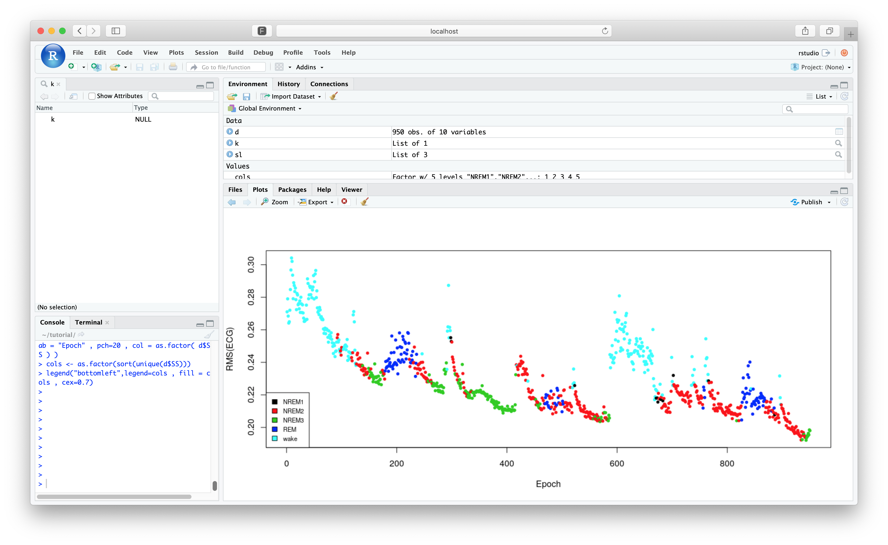
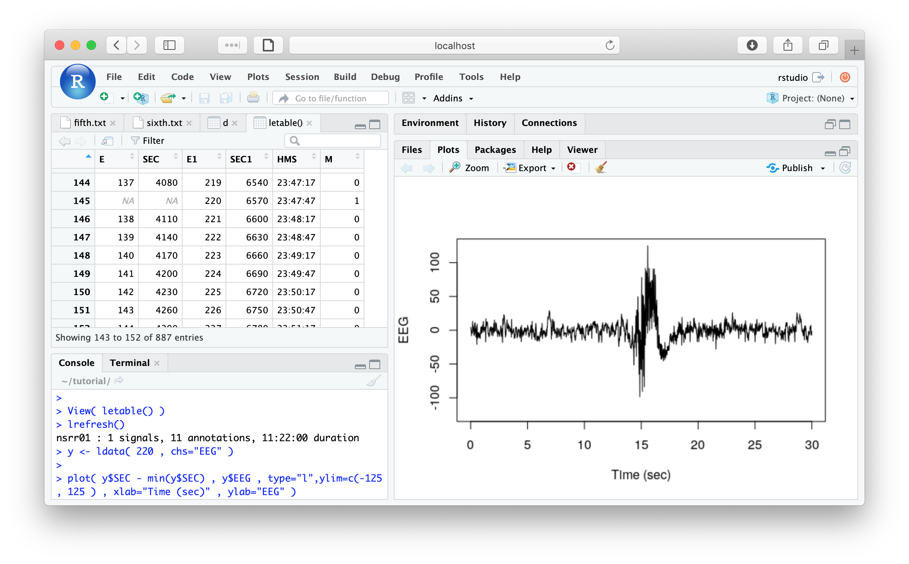
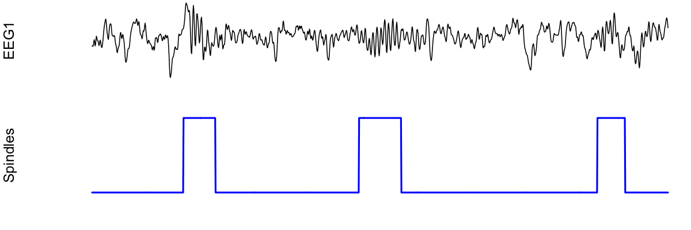

	
# /R/epeat

In this final section, we'll repeat the steps of the previous three
tutorial pages, but using [_lunaR_](../ext/R/index.md) instead of
[_lunaC_](../luna/args.md).  That is, these sections mirror the
sections from the past three tutorials, and we'll try to accomplish
the same goals but by different means..

For now, the easiest way to obtain _lunaR_ is via one of the [two
Docker images](../download/docker.md), in which both Luna and the
tutorial data are bundled with either classic R or RStudio.  Here
we'll use RStudio so that we can interactively view graphics created
along the way. (Aside from being able to view graphics immediately,
all other steps can be equally carried out via either route.)

As described in more detail on [this page](../download/docker.md),
once you've installed the free 
[Docker Desktop client](https://www.docker.com/products/docker-desktop), you can download
and initiate the container with a single command:

```
docker run -e PASSWORD=abc123 -p 8787:8787 remnrem/luna 
```

Docker will look for an image called `remnrem/luna` and if it is not
found locally (i.e. it won't be on you first running this command), it
will automatically download it, during which time you'll see something
like this:

```
Unable to find image 'remnrem/luna:latest' locally
latest: Pulling from remnrem/luna
22dbe790f715: Extracting [============================>     ]  37.62MB/45.34MB
4bda69fb795b: Downloading [=============>                   ]   66.1MB/204.9MB
a9bef4c97d96: Downloading [============================>    ]  98.37MB/122.1MB
90ec09c6bb70: Download complete 
b4333f4fff5d: Waiting 
8affb09c10ec: Waiting 
0d00367ae604: Waiting 
94ec4d08d2c2: Waiting 
954a0ad24247: Waiting 
fa5834f7ad81: Waiting 
```

The two other options on the command line above (i.e. `-e` and `-p`)
specified the new password you'll use when starting RStudio (for this
particular example, you can set it to anything) and mapped port 8787
from the container to your host machine.  When the above command has
finished running, go to your browser and go to the following URL:

```
http://localhost:8787
```

If it asks you for a username and password, login with user-name
`rstudio` and the password you specified above
(i.e. `abc123` in this example):

{width="100%"}

This will bring up the RStudio environment, which is running as a
server within the Docker container, and which you access via port
8787 and your web browser.  If you're not familiar with R or
RStudio, there are _lots_ of good tutorials available on-line if you
search around.

!!! Hint
    For macOS and Linux users with the [luna.docker](http://zzz.bwh.harvard.edu/dist/luna/luna.docker) 
    bash script installed, all the above can be accomplished with:
    ```
    luna.docker -rs abc123
    ```


## Obtaining the data

The tutorial data are pre-installed in this image, under the
`tutorial` folder.  Navigate to this in RStudio as follows:

```
setwd("/tutorial/")
```

We can confirm the files are present:
```
dir()
```
```
[1] "cmd"   "edfs"  "s.lst"
```

We'll also need to attach the _lunaR_ library with the following
command:

``` 
library(luna) 
```


## Displaying EDF files


!!! Info "Previous material"
    The [corresponding section](tut1.md#displaying-edf-files) of the original tutorial covered:
    
    - the `DESC` to obtain basic information on EDFs, essentially just stepping through this command: 

    ```
    luna s.lst -s DESC > res.txt
    ```

To mirror the previous operations, we must first load a
[_sample-list_](../luna/args.md#sample-lists) with _lunaR_'s
[`lsl()`](../ext/R/ref.md#lsl) function:

```
sl <- lsl( "s.lst" )
```

This function returns the sample-list as an R _list_ object, here
named `sl`.  We can use _lunaR_'s [`lattach()`](../ext/R/ref.md#lattach)
function to start working with the first individual, `nsrr01`, by
passing by the sample-list and the ID (or the line number) of the
individual we want to attach:

```
lattach( sl , "nsrr01" ) 
```

{width="100%"}


Mirroring how _lunaC_ processes a _script_ (i.e. a set of Luna
[commands](../ref/index.md) either after the `-s` option or from a
[_command file_](../luna/args.md#command-files)), in _lunaR_ we can
use the [`leval()`](../ext/R/ref.md/#leval) (or
[`leval.project()`](../ext/R/ref.md#levalproject)) commands to process
Luna commands such as `DESC`.  As for _lunaC_, the `DESC` command just
displays some information on the terminal, rather than sending output
to the formal output mechanism (i.e. a _lout_ database).  The same is
true in _lunaR_:

```
leval( "DESC" )
```
```
EDF filename      : edfs/learn-nsrr01.edf
ID                : nsrr01
Clock time        : 21:58:17 - 09:20:17
Duration          : 11:22:00
# signals         : 14
Signals           : SaO2[1] PR[1] EEG(sec)[125] ECG[250] EMG[125] EOG(L)[50] 
                    EOG(R)[50] EEG[125] AIRFLOW[10] THOR RES[10] ABDO RES[10] 
                    POSITION[1] LIGHT[1] OX STAT[1] 
```

To recap: here we've used a combination of _lunaR_ commands to
recapitulate the simple _lunaC_ statement above:

- `lsl()` to load a sample list called `s.lst`
- `lattach()` to tell Luna which EDF we're interested in
- `leval()` to evaluate a Luna command, the same as the `-s` option in _lunaC_


## Signal summary statistics

!!! info "Previous context"
    The [corresponding section](tut1.md#signal-summary-statistics) of the original tutorial covered:

    - running the `STATS` command for all three tutorial individuals
    - saving the output to a [_lout_ database](../luna/destrat.md)
    - querying it with [`destrat`](../luna/destrat.md#destrat)


One difference between _lunaC_ and _lunaR_ is that, with a few
exceptions, an attach EDF _persists_ in-memory after a `leval()`
function has been performed.  That is, the effects of any `leval()`
call that modifies the data (such as `FILTER` or `SIGNALS` or `MASK`)
will carry over for the next `leval()`, up until a new EDF is
`lattach()`-ed, or a `lrefresh()` command is issued to restore the EDF
to its original state.  Therefore, unless you did something to make it
otherwise, the EDF for `nsrr01` will still be in memory from the
previous analysis.  We can confirm what the currently attached EDF is
(if any) with the [`lstat()`](^lstat) command:

```
lstat()
```
```
nsrr01 : 14 signals, 11 annotations, 11:22:00 duration
```

To run the `STATS` command, we issue another `leval()`:

```
k <- leval( "STATS" )
```
```
evaluating...
nsrr01 : 14 signals, 11 annotations, 11:22:00 duration
```

{width="100%"}

Unlike the [`DESC`](../ref/summaries.md#desc) command,
[`STATS`](../ref/summaries.md#stats) returns information to the formal
output mechanism: this is why we've assigned the _return value_ of
`leval()` to be a new R object, called `k`.

!!! hint 
    `leval()` returns its output _silently_, in that you won't
    see anything printed to the console if you do not assign the
    output to another object.  This doesn't mean the commands
    weren't performed:  masks, filters, etc, will still
    modify the internal EDF.

The returned value `k` represents the same information that would have
been sent to the `out.db` database, if running this command in _lunaC_
from the command line.  Similar to how [`destrat`](../luna/destrat.md) 
summarizes a database, in _lunaR_ the [`lx()`](^lx) command gives a simple 
summary of a what `leval()` returns:

```
lx(k)
```
```
STATS : CH 
```

That is, in this simple example, we have one command (`STATS`) and
one output table (defined by channel, `CH`).  Using R's `str()`
function reveals more about the _structure_ of `k`:

```
str(k)
```
```
List of 1
 $ STATS:List of 1
  ..$ CH:'data.frame':	14 obs. of  23 variables:
  .. ..$ ID  : chr [1:14] "nsrr01" "nsrr01" "nsrr01" "nsrr01" ...
  .. ..$ CH  : chr [1:14] "ABDO_RES" "AIRFLOW" "ECG" "EEG" ...
  .. ..$ MAX : num [1:14] 0.992 0.992 1.25 125 125 ...
  .. ..$ MEAN: num [1:14] 0.0218 0.0664 0.0094 -0.3012 1.1856 ...
  .. ..$ MIN : num [1:14] -1 -1 -1.24 -124.02 -124.02 ...
  .. ..$ P01 : num [1:14] -0.71 -0.2 -1.24 -124.02 -124.02 ...
  .. ..$ P02 : num [1:14] -0.506 -0.129 -0.858 -124.02 -124.02 ...
  .. ..$ P05 : num [1:14] -0.3176 -0.0667 -0.1912 -70.098 -78.9216 ...
  .. ..$ P10 : num [1:14] -0.2 -0.0275 -0.0833 -24.0196 -20.098 ...
  .. ..$ P20 : num [1:14] -0.0902 0.0118 -0.0343 -9.3137 -7.3529 ...
  .. ..$ P30 : num [1:14] -0.0196 0.0353 -0.0049 -5.3922 -3.4314 ...
  .. ..$ P40 : num [1:14] 0.00392 0.05098 0.01471 -2.45098 -0.4902 ...
  .. ..$ P50 : num [1:14] 0.0196 0.0667 0.0245 -0.4902 1.4706 ...
  .. ..$ P60 : num [1:14] 0.0275 0.0745 0.0245 2.451 3.4314 ...
  .. ..$ P70 : num [1:14] 0.051 0.0902 0.0343 4.4118 6.3725 ...
  .. ..$ P80 : num [1:14] 0.098 0.1137 0.0343 8.3333 10.2941 ...
  .. ..$ P90 : num [1:14] 0.2627 0.1608 0.0833 23.0392 22.0588 ...
  .. ..$ P95 : num [1:14] 0.435 0.208 0.211 72.059 78.922 ...
  .. ..$ P98 : num [1:14] 0.663 0.278 0.828 125 125 ...
  .. ..$ P99 : num [1:14] 0.875 0.349 1.25 125 125 ...
  .. ..$ RMS : num [1:14] 0.236 0.122 0.267 37.801 40.325 ...
  .. ..$ SD  : num [1:14] 0.235 0.102 0.266 37.8 40.308 ...
  .. ..$ SKEW: num [1:14] 0.3348 0.1384 -0.1152 0.0862 -0.0688 ...
```

To see the entire list (that really only contains one data frame), just type `k`:

```
k
```
```
$STATS
$STATS$CH
       ID       CH      MAX      MEAN    MEDIAN      MIN     RMS      SD
1  nsrr01 ABDO RES   0.9921  0.021828  0.01960   -1.0000  0.2357  0.2347
2  nsrr01  AIRFLOW   0.9921  0.066441  0.06666   -1.0000  0.1219  0.1022
3  nsrr01      ECG   1.2500  0.009395  0.02450   -1.2401  0.2666  0.2664
4  nsrr01      EEG 125.0000 -0.301198 -0.49019 -124.0196 37.8013 37.8001
5  nsrr01 EEG(sec) 125.0000  1.185577  1.47058 -124.0196 40.3254 40.3079
6  nsrr01      EMG  31.5000 -6.855696 -4.81764  -31.2529 13.9700 12.1721
7  nsrr01   EOG(L) 125.0000  0.472550  0.49019 -124.0196 54.4618 54.4598
8  nsrr01   EOG(R) 125.0000  0.321446  0.49019 -124.0196 54.0092 54.0083
9  nsrr01    LIGHT   1.0000  0.997262  1.00000    0.0000  0.9986  0.0522
10 nsrr01  OX STAT   2.0000  0.428885  0.00000    0.0000  0.9261  0.8208
11 nsrr01 POSITION   3.0000  1.654423  1.00000    0.0000  1.9157  0.9659
12 nsrr01       PR 200.0000 57.348521 67.19157    0.2014 64.9523 30.4954
13 nsrr01     SaO2  99.1195 76.924249 95.11558    0.1007 85.5665 37.4743
14 nsrr01 THOR RES   0.9921  0.001188 -0.01176   -1.0000  0.1805  0.1805
```

That is, we have statistics for 14 channels from one tutorial
individual, `nsrr01`.  However, the original _lunaC_ command
calculated and compiled results _for all three studies in the project_.  
Obviously, we could write a simple loop to achieve this in R,
repeatedly calling `lattach()` and `leval()` and compiling results.
Alternatively, an easier way to do this is the [`leval.project()`](^levalproject) 
function instead, which performs pretty much the same series of
operations as _lunaC_ does.   That is, the _luna_C_ statement:

```
luna s.lst -o out.db -s STATS
```
is equivalent to the following in _lunaR_:
```
k <- leval.project( sl , "STATS" )
```

where `sl` is the the file `s.lst` (attached with `lsl()`) and `k` is
the equivalent of `out.db`.


The returned value, `k` now contains results for all three
individuals.  Although the overall structure is the same as before,
each data-frame now has additional rows for the additional individuals
(with the `ID` column indicating who's who).  In RStudio, you can
explore the results by clicking on `k` in the Environment tab, or by
typing

```
View(k)
```

{width="100%"}


To mirror the previous tutorial section, we need now to extract the
_"signal means for the ECG, EMG and SaO2".  Here we can use the
[`lx()`](^lx) function with an additional parameter (the command
name), which will, in this case (as there is only a single table
associated with this command's output) will return a data-frame with
the output:
```
d <- lx( k , "STATS" )
```
which contains the six variables including the mean (`MEAN`) along with 
`ID` and `CH` columns:
```
names(d)
```
```
[1] "ID"     "CH"     "MAX"    "MEAN"   "MEDIAN" "MIN"    "RMS"    "SKEW"  
```
Using R's basic row/column subsetting functions, we can pull out the required information as follows:
```
d[ d$CH %in% c("ECG","EMG","SaO2") , c("ID","CH","MEAN") ] 
```
```
       ID   CH         MEAN
7  nsrr01  ECG  0.009395566
8  nsrr02  ECG  0.005670678
9  nsrr03  ECG  0.003571143
16 nsrr01  EMG -6.855696298
17 nsrr02  EMG -0.609767419
18 nsrr03  EMG  3.013591554
37 nsrr01 SaO2 76.926126702
38 nsrr02 SaO2 77.874804354
39 nsrr03 SaO2 65.084439075
```


## Working with annotations

!!! Info "Previous material"
    The [corresponding section](tut1.md#working-with-annotations) of the original tutorial covered:
    
    - looking at the contents of an NSRR XML annotation file
    - counting the number of apnea events per individual, either for the whole night, or specific to REM sleep


When we attach an EDF with `lattach()`, if the sample list specified
any annotation files, they too are automatically loaded.  For example,
considering `nsrr01`, when we attach that dataset, we see there are 11
annotation classes are also attached (i.e. from the XML file specified
in `s.lst`):
    
```
lattach( sl , 1 )
```
```
nsrr01 : 14 signals, 11 annotations, 11:22:00 duration
```

To see what those annotations classes are, we can use the [`lannots()`](^lannots) command:
```
lannots()
```
```
 [1] "NREM1"             "NREM2"     "NREM3"          "NREM4"   "REM"
 [6] "apnea_obstructive" "arousal"   "artifact_SpO2"  "desat"   "hypopnea"
[11] "wake"  
```
Re-running `lannots()` with a single annotation class name as a parameter, we'll get a list of 
the intervals (in seconds elapsed since the start of the EDF):
```
lannots( "apnea_obstructive" )
```
```
[[1]]
[1] 2300.7 2310.7

[[2]]
[1] 2329.6 2343.1

[[3]]
[1] 4933.6 4953.2

[[4]]
[1] 5064.9 5095.1

[[5]]
[1] 5248.1 5265.5

... (cont'd) ...
```

That is, the first apnea event was from 2300.7 to 2310.7 seconds (10
seconds); the second was from 2329.6 to 2343.1 seconds (13.5 seconds),
etc.

Luna's [_masks_](../ref/masks.md) work in terms of
[_epochs_](../ref/epochs.md), which are fixed intervals spanning the
recording (by default, typically 30 seconds).  We can see how epochs
and annotations line up with the [`letable()`](^letable)
(_epoch_-table) command.  First, we need to specify epochs for this
record:
```
lepoch()
```
```
nsrr01 : 14 signals, 11 annotations, 11:22:00 duration, 1364 unmasked 30-sec epochs, and 0 masked
```

The output from `lstat()` now additionally includes information about
the number of epochs, and whether or not they are currently _masked_.

To explore the epoch structure in more detail, along-side annotation
information, we can use `letable()` to tabulate all epochs (when they
occur, whether they are masked or not, and, if the EDF has been
restructured, how that epoch maps to the original EDF):

```
a <- letable( annots = lannots() ) 
```

{width="100%"}


!!! info "Quickly summarizing sleep stages" 
    One other convenience
    function is [`lstages()`](^lstages), which is just a wrapper
    around the evaluation of the Luna
    [`STAGES`](../ref/hypnograms.md#stages) command and returns a
    vector of sleep stage labels (e..g NREM1, NREM2, etc) per
    epoch. Stage labels must exist as annotations (i.e. this command
    does not automatically infer sleep stage on-the-fly from the raw
    signal data_).  

    ```
    ss <- lstages()
    ```
    ```
    table( ss ) 
    ```
    ```
    NREM1 NREM2 NREM3 NREM4   REM  wake 
      109   523    16     1   238   477 
    ```

    All NSRR data have annotations formatted in such a
    way as to work with these commands, although it is easy to modify
    this to work with other formats.


Moving on the question of the original tutorial section: how can we
count the number of apneas per individual?  As previously, we'll use the
[`ANNOTS`](../ref/annotations.md#annots) command, combined with `leval.project()` to
apply this to each individual:
```
k <- leval.project( sl, "ANNOTS" )
```

As described on the [`ANNOTS` command page](../ref/annotations.md#annots), 
counts of annotation instances for each annotation class are in the table stratified by `ANNOT`:

```
lx(k)
```
```
ANNOTS : ANNOT ANNOT_INST ANNOT_INST_T1_T2 
```

We can simply extract this with `lx( k , "ANNOTS" , "ANNOT" )`, or
alternatively, just write it directly:

```
d <- k$ANNOTS$ANNOT
```

If we restrict to rows where the annotation class name is `apnea_obstructive`, we'll see that `COUNT`s 
for each individual.

```
d[ d$ANNOT == "apnea_obstructive" , ]
```
```
       ID             ANNOT COUNT    DUR
14 nsrr01 apnea_obstructive    37  824.5
15 nsrr02 apnea_obstructive     5   67.7
16 nsrr03 apnea_obstructive   163 3795.6
```

Reassuringly, these match what was obtained in the previous tutorial
section.  To consider only events during REM, we can re-run but including a 
[`MASK`](../ref/masks.md#mask) statement:

```
k <- leval.project( sl , "MASK ifnot=REM & ANNOTS" )
```

Repeating the above steps to extract the output:

```
d <- k$ANNOTS$ANNOT
```

```
d[ d$ANNOT == "apnea_obstructive" , ]
```
```
      ID             ANNOT COUNT   DUR
7 nsrr01 apnea_obstructive    27 668.4
8 nsrr02 apnea_obstructive     3  43.4
```

Again, these results match what we observed with _lunaC_.


## Putting it together

!!! Info "Previous material"
    The [corresponding section](tut1.md#putting-it-together) of the original tutorial covered:
    
    - running a command file (`cmd/first.txt`) in _lunaC_ 
    - using [_variables_](../luna/args.md#variables) in command files
    - tracking repeated runs of the same commands with [`TAG`](../ref/summaries.md#tag)s

Up to now, we've directly entered Luna commands as text on the R
command line.  We can also read [command
files](../luna/args.md#command-files) in the same way that _lunaC_
does, which is recommended for all non-trivial applications.  The _lunaR_ function [`lcmd()`](^lcmd) 
will read and parse a Luna-format command file, and return a vector where each instruction in one element:
```
lcmd( "cmd/first.txt" )
```
```
[1] "EPOCH len=30"           "TAG tag=STAGE/${stage}" "MASK ifnot=${stage}"   
[4] "RESTRUCTURE"            "STATS sig=EEG"
```

That is, `lcmd()` strips away comments (`%`) and blank lines, etc.  As
well as using `&` to concatenate Luna commands, `leval()` and
`leval.project()` functions accept vectors of commands, so we can pass
the output of `lcmd()` to `leval()`, etc.  However, you'll note from
looking at the commands above, we have one issue we need to first
resolve, namely the use of [_variables_](../luna/args.md#variables) in
the command file.  When using _lunaC_, we'd specify the value of
`${stage}` on the command line, as well as passing special variables such as 
`sig` to define the [signal list](../luna/args.md#signal-lists). For example, 

```
luna s.lst stage=NREM1 sig=EEG -o out.db < cmd/first.txt
```

In _lunaR_, we can set _Luna environment variables_ with the
[`lset()`](^lset) function:
```
lset( "stage","NREM1" )
```
```
setting [stage] to [NREM1]
```

We can query if a value exists, with [`lvar()`](^lvar):
```
lvar("stage")
```
```
[1] "NREM1"
```

We can use a similar approach with `sig`, to specify which signal(s)
this analysis is restricted to:

```
lset( "sig" , "EEG" )
```

However, as `sig` is a _special variable_, it is treated a little differently:
 
 - because it is not a user-defined variable, `lvar("sig")` will not
   show anything; the same is true when setting other _special
   variables_ such as `alias`

 - repeated calls setting to `sig` (or `alias`) variables do not
   overwrite the earlier values; rather, they append to that list

!!! info "Setting _special variables_ in _lunaR_"
    In other words, after the commands:
    ```
    lset( "sig" , "EEG1,EEG2" ) 
    lset( "sig" , "EEG3" )
    ```

    the _signal-list_ will comprise all three signals, not just `EEG3`.
    To clear the signal-list, use this special form:

    ```
    lset( "sig" , "." )
    ```
    or run
    ```
    lreset()
    ```
    which clears _all_ variables (both user-defined and special variables), and resets all Luna global parameters to their default values.

Having specified the value of `${stage}` as well as the signal-list
(i.e. to restrict analysis to just the `EEG` channel), we can run
`leval.project()`, using `lcmd()` to read in and parse the command
script we used previously with _lunaC_:

```
k <- leval.project( sl , lcmd( "cmd/first.txt" ) ) 
```
After this completes, we can confirm the structure of the output (`k`) with `lx()`, as before:
```
lx(k)
```
```
EPOCH : BL STAGE 
MASK : EMASK_STAGE 
RESTRUCTURE : STAGE 
STATS : CH_STAGE 
```

Note that each table also has `STAGE` as an additional factor, due to
the use of the [`TAG`](../ref/summaries.md#tag) command.  That is, these results 
are currently just for NREM1 sleep:
```
lx( k , "STATS" )
```
```
ID     CH  STAGE    MAX   MEAN  MEDIAN      MIN    RMS    SKEW
nsrr01 EEG NREM1  59.31 -0.295 -0.4901  -81.862  7.354   0.015
nsrr02 EEG NREM1  49.50  0.007  0.4901  -72.058 10.361  -0.487
nsrr03 EEG NREM1 125.00  0.198  0.4901 -124.019 12.302  -0.461
```

To obtain the values for other sleep stages, we can just repeat the
above procedures.  To facilitate this, and to make the output easier to
collate, we'll do the following.  First, we'll define the stages we
want to iterate over:

```
stgs <- c( "NREM1", "NREM2", "NREM3" , "REM"  )
```
We'll then define a _single_ (empty) list to hold results from _all_ stages:
```
k <- list()
```

We then can use a `for` loop in R to iterate over each stage, setting
the appropriate `${stage}` value, and then running the script:

```
for (s in stgs) {

 lset( "stage", s ) 

 k[[ s ]] <- leval.project( sl , lcmd( "cmd/first.txt" ) ) 

}
```

When this runs, you'll see a warning message displayed to the console:
```
Warning message:
In lreturnless_eval(x) :
  problem flag set and likely missing data for nsrr03
```

This is fine and as expected: as we previously saw, this is because
`nsrr03` doesn't have any REM epochs.  Therefore, when attempting to
subset to REM-only in this individual and run other commands, Luna
rightly complained and stopped.  This just means there will be missing
data for some output, but that is fine as destrat and R can handle
that.

!!! hint 
    Other reasons for getting similar types of warnings or errors
    may often be that you forgot to `lset()`/`lreset()` any
    _variables_, forgot to `lattach()` an individual, or need to
    `lrefresh()` the attached EDF when running a new command, i.e. if there are 
    no unmasked records left for that EDF.

Note that rather than saving the output of `leval.project()` directly
to `k`, we are writing it to a _sub-item_ of the existing list, using
sleep stage `s` as index an index.  (A technical point, but R uses
double brackets `[[` often when working with lists, to indicate any
single element _itself_, rather than `[`, which indicates _a list of
the selected elements_, 
e.g. see [here](https://stackoverflow.com/questions/1169456/the-difference-between-bracket-and-double-bracket-for-accessing-the-elem)).
 

!!! warning "Persistence of EDFs in `leval()` and `leval.project()`"
    When using `leval.project()`, _lunaR_ behaviors much more like _lunaC_ in terms of the persistence of in-memory 
    EDFs.  That is, each EDF in the sample list is attached and then dropped before moving to the next EDF in the list.  So, 
    unlike `leval()`, which does not detach the EDF, this means that after running the above, there will not be any currently attached EDF: 
    ```
    lstat()
    ```
    ```
    Error in lstat() : no EDF attached
    ```

    More importantly, it means that when running `leval.project()`
    inside a loop as above, any modifications made (e.g. from masks,
    filters, dropping or adding signals, etc), will _not_ be reflected
    when re-running the loop.  So, `leval.project()` is really like
    running a single _lunaC_ statement.  In contrast, `leval()` works
    more like the individual components that occur _within_ one
    _lunaC_ run for one individual.


Having run the above code successfully, we'll now have a slightly
different format for `k`.  Namely, it is a list with 4 elements,
correspond to the four sleep stages.  Each element is identical to the
output that would have come from a single run of `leval.project()`
(obviously... that is how we assigned it above).  

Therefore, `lx()` will work slightly differently, due to the structure of the output. By itself, 
rather than returning _each command_ as a row, along with a list of tables from that command, `lx()` 
will now return _each higher level group_ (i.e. `s` or sleep stage in this case), along with a list of the _commands_
performed:
```
lx(k)
```
```
NREM1 : EPOCH MASK RESTRUCTURE STATS 
NREM2 : EPOCH MASK RESTRUCTURE STATS 
NREM3 : EPOCH MASK RESTRUCTURE STATS 
REM : EPOCH MASK RESTRUCTURE STATS 
```

We cannot use `lx()` to extract a particular table from a particular
command however.  The alternative `lx2()` can be used in this
scenario, i.e. if and only if you've consciously structured the output in 
the way we have above.  So, instead if `lx( k , "STATS" )`, we'd run 
```
lx2( k , "STATS" )
```
which conveniently compiles all the similar results from different sleep stages into a _single_ table:
```
            ID  CH STAGE     MAX     MEAN   MEDIAN      MIN     RMS      SD
NREM1.1 nsrr01 EEG NREM1  59.313 -0.29545 -0.49019  -81.862  7.3549  7.3490
NREM1.2 nsrr02 EEG NREM1  49.509  0.00717  0.49019  -72.058 10.3615 10.3616
NREM1.3 nsrr03 EEG NREM1 125.000  0.19837  0.49019 -124.019 12.3021 12.3005
NREM2.1 nsrr01 EEG NREM2 125.000 -0.31312 -0.49019 -124.019 10.6460 10.6414
NREM2.2 nsrr02 EEG NREM2 125.000 -0.13494  0.49019 -124.019 14.7424 14.7418
NREM2.3 nsrr03 EEG NREM2 125.000  0.12660  0.49019 -124.019 14.4967 14.4961
NREM3.1 nsrr01 EEG NREM3 121.078 -0.47093 -0.49019 -112.254 13.2500 13.2417
NREM3.2 nsrr02 EEG NREM3 125.000 -0.13073  0.49019 -124.019 20.0546 20.0542
NREM3.3 nsrr03 EEG NREM3 125.000  0.17191  0.49019 -124.019 18.9800 18.9794
REM.1   nsrr01 EEG   REM  85.784 -0.37150 -0.49019  -82.843  7.5635  7.5544
REM.2   nsrr02 EEG   REM 125.000 -0.38422  0.49019 -124.019 14.1464 14.1412
```

Because we used `TAG` in the script, we have a variable named `STAGE`
that corresponds to this higher-level structure, making it easy to
keep track of results.
 
So, to extract the same information as previously (namely, signal RMS
for the EEG channel for all three individuals, stratified by sleep
stage), we could run the following:
```
d <- lx2( k , "STATS")
```
```
d[ , c("ID","STAGE","RMS")]
```
```
            ID STAGE       RMS
NREM1.1 nsrr01 NREM1  7.354944
NREM1.2 nsrr02 NREM1 10.361542
NREM1.3 nsrr03 NREM1 12.302106
NREM2.1 nsrr01 NREM2 10.646079
NREM2.2 nsrr02 NREM2 14.742420
NREM2.3 nsrr03 NREM2 14.496728
NREM3.1 nsrr01 NREM3 13.250009
NREM3.2 nsrr02 NREM3 20.054659
NREM3.3 nsrr03 NREM3 18.980088
REM.1   nsrr01   REM  7.563595
REM.2   nsrr02   REM 14.146456
```

To get a nice tabulation, we could do the following: 
(although there are [more efficient](https://www.r-bloggers.com/concatenating-a-list-of-data-frames/)
ways to do this, if needed):

```
with( d , tapply( RMS , list( ID , STAGE ) , mean ) )
```
```
           NREM1    NREM2    NREM3       REM
nsrr01  7.354944 10.64608 13.25001  7.563595
nsrr02 10.361542 14.74242 20.05466 14.146456
nsrr03 12.302106 14.49673 18.98009        NA
```


!!! hint "Something strange about the medians?"  
    You may have noted
    that in the tables above, the `MEDIAN` values of the EEG were all
    very similar numbers: either 0.49019 or -0.49019.  Did we do
    something wrong?  In this case, no we didn't, it is simply a property of the resolution of the data after 
    analog to digital conversion.  To use _lunaR_ to check this out, let's attach one individual:
    ```
    lattach( sl , 1 )
    ```

    To pull an entire signal we can use `ldata()` but we need to
    specify the interval in terms of epochs, so we must first epoch
    the data (here, saving the number of epochs in `ne`):

    ```
    ne <- lepoch()
    ```

    We can then request the entire (`1:ne`) `EEG` signal (note, we
    only keep the signal rather than the whole data frame returned by
    `ldata()`: we'll add more efficient ways to extract only signals in
    the future):

    ```
    x <- ldata( 1:ne , "EEG" )$EEG
    ```

    Let's check things are as expected: `length(x)` gives 5115000;
    given we have 1364 30-second epochs and a sampling rate of 125 Hz,
    this is good, as 1364 * 30 * 125 = 5115000.  Now, to check the median:

    ```
    median(x)
    ```
    ```
    -0.4901961
    ```

    We're seeing the same number as above in the stage-stratified
    analyses.  Looking at the distribution of the samples, we see this
    simply reflects the resolution of the digital signal:
    ```
    par(mfcol=c(2,1))
    hist(x , breaks=500)
    hist(x[x> -10 & x < 10 ] , breaks= 500 ) 
    ```

    {width="100%"}


## Using destrat

!!! Info "Previous material"
    The [corresponding section](tut2.md#using-destrat) of the original tutorial covered:
    
    - how to use the [`destrat`](../luna/destrat.md#destrat) tool to work with the _lout_ databases generated by _lunaC_'s `-o` option

In _lunaR_ we do not generate [_lout_ databases](../luna/destrat.md);
rather, any commands executed return their results directly as R list
objects.  (If you want to _save_ any of these, you can simply use R's
standard `save()` function, or similar.)  However, it is in fact
possible to _read_ _lout_ databases generated by _lunaC_ into _lunaR_,
with the [`ldb()`](^ldb) function.

As a quick example, within RStudio, switch to the "Terminal" tab
(instead of "Console").  This gives a prompt in a _bash_ (Bourne Again
Shell) where you can access the virtual Linux machine running RStudio: 

{width="100%"}

This should be in the same `tutorial/` folder (if you are not, run `cd
tutorial`).  Typing `ls` should show the `s.lst` file and the two
folders, `edfs` and `cmd`.  Now run a command that generates an `out.db` file: e.g. 
```
luna s.lst -o out.db -s "EPOCH & STATS sig=ECG,EEG epoch"
```
As before, you can use destrat to summarize and query this database:
```
destrat out.db
```
```
--------------------------------------------------------------------------------
out.db: 2 command(s), 3 individual(s), 15 variable(s), 47157 values
--------------------------------------------------------------------------------
  command #1:   c1      Thu Mar 21 19:33:09 2019        EPOCH
  command #2:   c2      Thu Mar 21 19:33:09 2019        STATS
--------------------------------------------------------------------------------
distinct strata group(s):
  commands      : factors           : levels        : variables
----------------:-------------------:---------------:---------------------------
  [EPOCH]       : .                 : 1 level(s)    : DUR INC NE
                :                   :               :
  [EPOCH]       : CH                : 1 level(s)    : DUR INC NE
                :                   :               :
  [STATS]       : CH                : 2 level(s)    : MAX MEAN MEDIAN MEDIAN.MEAN MEDIAN.MEDIAN
                :                   :               : MEDIAN.RMS MEDIAN.SD MIN NE NE1
                :                   :               : RMS SD
                :                   :               :
  [STATS]       : E CH              : (...)         : MAX MEAN MEDIAN MIN RMS SD
                :                   :               :
----------------:-------------------:---------------:---------------------------
```

Switching back to the RStudio _Console_ (i.e. back to the R prompt), you can read in that same output database

```
k <- ldb( "out.db" )
```

!!! note
    Not all return objects have to be named `k`, I'm just a creature of habit...


Using `lx()`, we should see the same structure and information: 

{width="100%"}


## Parameter files

!!! Info "Previous material"
    The [corresponding section](tut2.md#parameter-files) of the original tutorial covered:
    
    - using a [_parameter file_](../luna/args.md#parameter-files) to specify variables
    - executing the command file `cmd/second.txt` with the `cmd/vars.txt` parameter file

You can use the [`lset()`](^lset) function to read in variable assignments from a parameter file.  
We previously used the file `cmd/vars.txt`, which we can view within RStudio by navigating to the
tutorial folder and clicking on that file:

{width="100%"}


The previous section ran the command file `cmd/second.txt` for
`nsrr01`, which basically just wrote some stats for the two EEG
channels.  We'll start by attaching this EDF:

```
lattach( sl , "nsrr01" ) 
```
```
nsrr01 : 1 signals, 11 annotations, 11:22:00 duration
```

But wait!  Isn't there a problem?  This reads that only a single
signal is present, whereas there are 14 in that EDF.  This isn't an
error: rather, it reflects a previously set _Luna environment
variable_, i.e. namely `sig`, the signal-list, from section
above. Within the same session, _lunaR_ will remember these settings
(i.e.  it is as if we're running every command with `sig=EEG`
included). When starting a new analysis, it is therefore a good idea
to first _reset_ these variables, i.e. to start afresh. 

```
lreset()
```
```
lattach( sl , "nsrr01" ) 
```
```
nsrr01 : 14 signals, 11 annotations, 11:22:00 duration
```
That's better.  We can check those channel names with `lchs()`:
```
lchs()
```
```
 [1] "SaO2"     "PR"       "EEG(sec)" "ECG"     
 [5] "EMG"      "EOG(L)"   "EOG(R)"   "EEG"     
 [9] "AIRFLOW"  "THOR RES" "ABDO RES" "POSITION"
[13] "LIGHT"    "OX STAT" 
```


!!! note 
    Running `lrefresh()` re-attaches the current EDF, but doesn't
    change the environment variables.  An environment variable such as
    `sig` means that when the EDF is re-attached, it is re-attached
    with only the channels in the signal-list included.  Therefore,
    you need to `lreset()` to clear the environment variables.  (`lreset()` also drops any 
    currently attached EDF.)

We can now include the parameter file, `cmd/vars.txt`, by running
`lset()` with a single file name:

```
lset( "cmd/vars.txt" ) 
```
```
setting [alias] to [EEG1|EEG]
setting [alias] to [EEG2|EEG(sec)]
setting [alias] to [OXSTAT|OX STAT]
setting [eeg] to [EEG1,EEG2]
setting [myepoch] to [10]
setting [nrem] to [NREM1,NREM2,NREM3]
```

Note that if we now request `lchs()` again, Luna will automatically use the [_primary aliases_](../luna/args.md#aliases), i.e. `EEG1`, `EEG2` and `OXSTAT`:
```
lchs()
```
```
 [1] "SaO2"     "PR"       "EEG2"     "ECG"     
 [5] "EMG"      "EOG(L)"   "EOG(R)"   "EEG1"    
 [9] "AIRFLOW"  "THOR RES" "ABDO RES" "POSITION"
[13] "LIGHT"    "OXSTAT"  
```

That is, we can still refer to the original `EEG(sec)` as either
`EEG(sec)` or `EEG2`, but all output will use `EEG2`.

Finally, we can run the commands in `cmd/second.txt`:
```
EPOCH len=${myepoch}
MASK all
MASK unmask-if=${nrem}
RESTRUCTURE
STATS sig=${eeg}
```
As this is just for one individual, we'll use `leval()`:
```
k <- leval( lcmd( "cmd/second.txt" ) )
```

Using `lx()` to consider the output, it seems to have worked as
expected: 

```
lx( k , "STATS" ) 
```

```
      ID   CH MAX       MEAN     MEDIAN       MIN       RMS        SD
1 nsrr01 EEG1 125 -0.3140503 -0.4901961 -124.0196 10.242558 10.237744
2 nsrr01 EEG2 125  1.4411837  1.4705882 -124.0196  9.771271  9.664407
```

That is, we used the variable `${eeg}` which was set to `EEG1` and
`EEG2`, which were themselves _aliases_ for the original channel
names.  All of this was specified in the parameter file, which we
attached with `lset()`.


## Epoch-level summaries

!!! Info "Previous material"
    The [corresponding section](tut3.md#epoch-level-summaries) of the original tutorial covered:
    
    - using the `STATS` command to generate epoch-level summaries of signals for `nsrr02`

    - reading those summaries into R, in order to make per-epoch plots of the RMS for the ECG signal

We'll perform the same steps here, except it can be done all within R.   Start by clearing Luna's environment variables:

```
lreset()
```
Attach `nsrr02`:
```
lattach( sl , 2 ) 
```
Epoch the data:
```
lepoch()
```
Then run `STATS` for these signals (as per the previous tutorial section), requesting epoch-level output:
```
k <- leval( "STATS epoch sig=ECG" ) 
```
We next extract the epoch-level output from `STATS`:

```
d <- lx( k , "STATS" , "CH" , "E" ) 
``` 
```
head(d)
```
```
      ID  CH E  MAX        MEAN     MEDIAN        MIN       RMS        SD
1 nsrr02 ECG 1 1.25 0.005067974 0.03431373 -0.6519608 0.2710508 0.2710215
2 nsrr02 ECG 2 1.25 0.004716340 0.03431373 -0.7205882 0.2790225 0.2790012
3 nsrr02 ECG 3 1.25 0.003096732 0.04411765 -0.6519608 0.2684238 0.2684239
4 nsrr02 ECG 4 1.25 0.004414379 0.03431373 -0.7107843 0.2641340 0.2641148
5 nsrr02 ECG 5 1.25 0.004943791 0.02450980 -0.6911765 0.2649496 0.2649211
6 nsrr02 ECG 6 1.25 0.003168627 0.02450980 -0.7401961 0.2720457 0.2720454
```

As expected, `d` has 1195 rows, corresponding to the 1196 epochs (i.e. see `dim(d)`).

The aim is to plot the RMS of the ECG channel coloured by sleep stage.
To attach information on the sleep stage of an NSRR individual, we can
use the convenience function `lstages()`:

```
d$SS <- lstages()
```

!!! note
    As we can check, in this simple case we confirm that `d` is
    exactly 1195 rows and ordered by epoch, and so we can use
    `lstages()` (which returns a vector 1195 in length) to directly
    populate a "sleep stage" variable.  In practice, it is safer to
    use the full results of `leval("STAGE")` (for which `lstages()` is
    just a wrapper) and `merge()` based on `E` (or `ID` if necessary).

Following the previous tutorial section, we want to restrict the output to the first 950 rows (as the
end of the recording contains artifact):

```
d <- d[ 1:950 , ] 
```
We can then use standard R functions to generate the plots:
```
plot( d$E , d$RMS , ylab = "RMS(ECG)" , xlab = "Epoch" , pch=20 , col = as.factor( d$SS ) )
cols <- as.factor(sort(unique(d$SS)))
legend("bottomleft",legend=cols , fill = cols , cex=0.7)
```

{width="100%"}


## Hypnograms

!!! Info "Previous material"
    The [corresponding section](tut3.md#hypnograms) of the original tutorial covered:
    
    - using `HYPNO` to generate individual-level, cycle-level and epoch-level information about sleep architecture (based on manual staging)

Repeating these steps for `nsrr01`, we should first reset Luna's environment (just as a safety measure):

```
lreset()
```
And then attach the EDF of interest:

```
lattach(sl,1)
```
To get a very quick summary of sleep macro-architecture, we can tabulate the values of `lstages()`, e.g. to get minutes in each stage:
```
table( lstages()  ) / 2 
```
```
NREM1 NREM2 NREM3 NREM4   REM  wake 
 54.5 261.5   8.0   0.5 119.0 238.5 
```

Running the [`HYPNO`](../ref/hypnograms.md#hypno) command for all three individuals:

```
k <- leval.project( sl , "HYPNO epoch" )
```
Here we extract individual-level results (i.e. from the baseline or `BL` strata ):
```
d <- lx( k , "HYPNO" , "BL" )
```

!!! Hint 
    If you're unsure about which strata and variables are
    generated by a command, visit the its section in the
    [reference](../ref/index.md) part of this website: they are
    tabulated for every command.  You can also run `lx()` (or destrat,
    if on the command line).

To extract minutes of each stage from this output for all individuals:

```
d[ , c("ID" , "MINS_N1" , "MINS_N2" , "MINS_N3" , "MINS_REM" , "NREMC") ] 
```
```
      ID MINS_N1 MINS_N2 MINS_N3 MINS_REM NREMC
1 nsrr01    54.5   261.5     8.0      119     6
2 nsrr02     5.5   199.5    92.5       60     5
3 nsrr03    26.0   187.5    10.5        0     3
```

Cycle-level and epoch-level output can be extracted with the commands:

```
d <- lx( k , "HYPNO" , "C" ) 
```
and
```
d <- lx( k , "HYPNO" , "E" ) 
```


## Epoch-level masks

!!! Info "Previous material"
    The [corresponding section](tut3.md#epoch-level-masks) of the original tutorial covered:

    - used epoch-level [_masks_](../ref/masks.md) to select a particular subset of epochs for `nsrr01`

    - illustrated how to attach epoch-level annotations after an EDF has been attached
    

The corresponding section aimed to select epochs that met the
following criteria (made up simply to illustrate how the commands
operate):

- epochs of persistent sleep (i.e. at least 10 minutes of sleep prior)
- that occur between 11pm and 3am
- and are during stage 2 NREM sleep
- and do not contain any apnea or hypopnea events

Although we could run `cmd/third.txt` as in the previous section, in
order to introduce some new _lunaR_ commands, we'll do it a different
way.  As before, if we've been doing previous work with _lunaR_, we
should first reset the environment:

```
lreset()
```
We then attach the first individual:
```
lattach( sl , 1 ) 
```
and run the `HYPNO` command:
```
k <- leval( "HYPNO" ) 
```
from which we can identify epochs of _persistent sleep_, from the epoch-level output, here extracting it directly rather than using `lx()`:
```
ps <- k$HYPNO$E$PERSISTENT_SLEEP 
```
The variable `ps` is a vector of `0` and `1` (i.e. no or yes) with as many elements as epochs for `nsrr01`:
```
table( ps)
```
```
ps
  0   1 
980 384 
```

In _lunaR_, we can attach a new annotation with either the
`ladd.annot()` or `ladd.annot.file()` command.  The latter form can
read [any Luna annotation format](../ref/annotations.md), i.e XML,
`.annot` or `.eannot` files.  One option would be to save the
information about persistent sleep to a file, and load it with
`ladd.annot.file()` therefore.  However, given we are already in R, it
is easier to just directly specify the annotation, using
`ladd.annot()`, which expects as input an R _interval list_.  In this
context, an _interval list_ is something in the format we get out of
the `lannots()` command for example.

We can use the helper function `le2i()` to convert epoch numbers to
intervals, given a particular definition of epoch duration (and
overlap), the default is 30 second, non-overlapping epochs. For example: 

```
le2i( 1:4 ) 
```
```
> le2i( 1:10 )
[[1]]
[1]  0 30

[[2]]
[1] 30 60

[[3]]
[1] 60 90

[[4]]
[1]  90 120

```
We can therefore get a list of intervals (epoch start/stop times in seconds) for each epoch of persistent sleep (`ps==1`):

```
ps.ints <- le2i( which( ps == 1 ) ) 
```

This gives a list `ps.ints` which is 384 elements long.  We can add
this as a new annotation as follows (we assign the name
`persistent_sleep` but we could use anything):

```
ladd.annot( "persistent_sleep" , ps.ints ) 
```

We can check that it has been added as follows:

```
lannots()
```
```
 [1] "NREM1"             "NREM2"             "NREM3"            
 [4] "NREM4"             "REM"               "SleepStage"       
 [7] "apnea_obstructive" "arousal"           "artifact_SpO2"    
[10] "desat"             "hypopnea"          "persistent_sleep" 
[13] "wake"             
```

Finally, here we illustrate how to use multiple `leval()` statements
on the same attached EDF, to apply a series of masks (which could be
done in any order, in this example).  Although this is always the
default, we can start by ensuring that all epochs are included
(i.e. none are masked):

```
leval( "MASK none" ) 
```
```
nsrr01 : 14 signals, 13 annotations, 11:22:00 duration, 1364 unmasked 30-sec epochs, and 0 masked
```

Next, we mask epochs not between 11pm and 3am:

```
leval( "MASK hms=23:00:00-03:00:00" )
```
```
nsrr01 : 14 signals, 13 annotations, 11:22:00 duration, 481 unmasked 30-sec epochs, and 883 masked
```

We see that the number of epochs has dropped from 1364 to 481
_unmasked_ epochs.  As [previously noted](tut3.md#epoch-level-masks),
we have 481 and not 480 (i.e. 4 hours) because the epochs start on 17
and 47 seconds past the minute in this particular EDF, and so we
include an additional epoch that starts at 10:59:47 but overlaps the
requested period. (Also note that, at this point, none have actually
been removed; that will not happen until a
[`RESTRUCTURE`](../ref/masks.md#restructure) (or `RE`) command is
given.)

We next apply the persistent sleep mask:
```
leval( "MASK mask-ifnot=persistent_sleep" )
```
```
nsrr01 : 14 signals, 13 annotations, 11:22:00 duration, 152 unmasked 30-sec epochs, and 1212 masked
```
That takes us down to 152 epochs; we next restrict to NREM2 sleep only:
```
leval( "MASK mask-ifnot=NREM2" )
```
```
nsrr01 : 14 signals, 13 annotations, 11:22:00 duration, 142 unmasked 30-sec epochs, and 1222 masked
```
This takes us to 142 epochs; we next exclude epochs with any apnea or hypopnea events:
```
leval( "MASK mask-if=apnea_obstructive,hypopnea" )
```
```
nsrr01 : 14 signals, 13 annotations, 11:22:00 duration, 55 unmasked 30-sec epochs, and 1309 masked
```
This gives us 55 epochs, as per the previous example with _lunaC_.


We can confirm these steps by viewing the results of `letable()` and including these relevant annotations: 

```
d <- letable( annots = c( "persistent_sleep" , "NREM2" , "apnea_obstructive" , "hypopnea" ) )
```

We can view the epoch table here (if the image is too small, click to upon in a new browser tab):
```
View(d)
```

{width="100%"}

Epochs that are masked have `M` set to `1` and the epoch codes (`E`)
and start-time (`SEC`) are set to _NA_.  Luna tracks the original
epoch numbers, start times and clock-time however (`E0`, `SEC0` and
`HMS`).  For example, the first epoch to be included (the new epoch #1) was the old epoch #124, etc.

If we run a `RESTRUCTURE` command, all masked epochs are permanently dropped from the internal EDF, and so we'll 
end up with a 55-epoch (27.5 minutes) dataset, but for which there are no masked epochs:

```
leval( "RE" ) 
```
```
nsrr01 : 14 signals, 13 annotations, 00:27:30 duration, 55 unmasked 30-sec epochs, and 0 masked
```

Again, we can view the `letable()` for this:
```
d <- letable( annots = c( "persistent_sleep" , "NREM2" , "apnea_obstructive" , "hypopnea" ) )
```

All masked epochs have now been dropped, although Luna still retains the original time/epoch encoding in `E0`, etc.

{width="100%"}
 
## Manipulating EDFs


!!! Info "Previous material"
    The [corresponding section](tut3.md#manipulating-edfs) of the original tutorial covered:

    - filtering, resampling, relabeling and re-referencing signals
    - re-writing new EDFs 

The previous section basically involved running `cmd/fourth.txt`
through _lunaC_, which is as follows:
		 
```
mV 
RESAMPLE sr=100
FILTER bandpass=0.3,35 ripple=0.02 tw=1
REFERENCE ref=EEG1 sig=EEG2 
WRITE edf-tag=v2 edf-dir=newedfs/ sample-list=new.lst
```
The _lunaC_ command line was:
```
luna s.lst @cmd/vars.txt sig=EEG1,EEG2 < cmd/fourth.txt
```

To mirror this, we first need to load the environment variables in the parameter file:
```
lset( "cmd/vars.txt" )
```

Next, we need to specify that only signals `EEG1` and `EEG2` (these
are _aliases_ for `EEG` and `EEG(sec)`) be included:
```
lset( "sig" , "EEG1,EEG2" )
```
Finally, we need to execute the script:
```
k <- leval.project( sl, lcmd( "cmd/fourth.txt" ) )
```

If you go the the _Files_ tab in RStudio, you should be able to see
the newly created file and folder: `new.lst` and `newedfs`.  We can
load this sample list, say calling is `nsl` for _new_ sample-list:

```
nsl <- lsl("new.lst")
```
and then run the `DESC` command for all three individuals:

```
leval.project( nsl , "DESC" ) 
```

```
nsrr01 : 2 signals, 0 annotations, 11:22:00 duration
evaluating...
EDF filename      : newedfs/learn-nsrr01-v2.edf
ID                : nsrr01
Clock time        : 21:58:17 - 09:20:17
Duration          : 11:22:00
# signals         : 2
Signals           : EEG2[100] EEG1[100]

nsrr02 : 2 signals, 0 annotations, 09:57:30 duration
evaluating...
EDF filename      : newedfs/learn-nsrr02-v2.edf
ID                : nsrr02
Clock time        : 21:18:06 - 07:15:36
Duration          : 09:57:30
# signals         : 2
Signals           : EEG2[100] EEG1[100]

nsrr03 : 2 signals, 0 annotations, 11:22:00 duration
evaluating...
EDF filename      : newedfs/learn-nsrr03-v2.edf
ID                : nsrr03
Clock time        : 20:15:00 - 07:37:00
Duration          : 11:22:00
# signals         : 2
Signals           : EEG2[100] EEG1[100]
```

{width="100%"}

!!! note
    Annotation files are _not_ automatically transferred to new EDFs, as
    currently Luna only writes EDF, not EDF+.  As such, as timing information
    would be lost, if the EDF has been restructured.


## Artifact detection

!!! Info "Previous material"
    The [corresponding section](tut3.md#artifact-detection) of the original tutorial covered:

    - generating per-epoch statistics including RMS, Hjorth parameters and and index of signal-clipping

    - using these, alongside a second epoch-wise artifact detection
      algorithm based on spectral analysis, to flag likely aberrant
      epochs

    - visualizing these statistics across the night, and looking at
      raw EEG signals for an artifact-containing epoch

The corresponding section involved running `cmd/fifth.txt` to generate
the above-mentioned statistics, and then a slightly modified version
(`cmd/sixth.txt`) to actually mask potentially bad epochs, all for `nsrr01`.

Reset the Luna environment:
```
lreset()
```
Attach `nsrr01`:

```
lattach( sl , 1 ) 
```

Specify that we want to restrict analyses to the `EEG` channel (no
other variables were used in this script, so we didn't attach a
parameter file, and so we use `EEG` and not the alias `EEG1` here):

```
lset( "sig" , "EEG" )
```

Run the script:
```
k <- leval( lcmd( "cmd/fifth.txt" ) )
```
Extract channel-level (whole-night) statistics:
```
lx( k , "SIGSTATS" , "CH" )  
```
```
      ID   CH         CLIP       H1        H2        H3     RMS
1 nsrr01 EEG1 2.707194e-06 78.38342 0.3536182 0.8316128 8.53764
```

Extract epoch-level statistics:

```
d <- lx( k , "SIGSTATS" , "CH" , "E" ) 
```

We can now tabulate:
```
View(d)
```
and plot these statistics, coloured by sleep stage:
```
q <- leval( "STAGE" )
```
```
> ss <- lx(q,"STAGE")
> head(ss)
      ID  E CLOCK_TIME MINS STAGE STAGE_N
1 nsrr01 54   22:24:47 26.5 NREM1      -1
2 nsrr01 55   22:25:17 27.0 NREM1      -1
3 nsrr01 56   22:25:47 27.5 NREM1      -1
4 nsrr01 58   22:26:47 28.5 NREM1      -1
5 nsrr01 59   22:27:17 29.0 NREM1      -1
6 nsrr01 60   22:27:47 29.5 NREM1      -1
```
```
> dim(ss)
[1] 887   6
> dim(d)
[1] 887   8
```

```
m <- merge( d , ss , by="E" )
```

```
par(mfcol=c(3,1),mar=c(0,0,0,0))
plot( m$E , m$H1 , pch=20 , col = lstgcols( m$STAGE ) )
plot( m$E , m$H2 , pch=20 , col = lstgcols( m$STAGE ) )
plot( m$E , m$H3 , pch=20 , col = lstgcols( m$STAGE ) )
```

As well as clear evidence of ultradian dynamics (that correspond to sleep stage), we see evidence of some
outlier epochs in these plots (Hjorth parameters 1, 2 and 3 from top to bottom):

{width="100%"}


We'll now run the slightly modified script, that masks outlier epochs
based on these metrics. 

```
EPOCH 
MASK if=wake
RESTRUCTURE
FILTER bandpass=0.3,35 ripple=0.02 tw=1
ARTIFACTS mask
CHEP-MASK ep-th=3,3,3
CHEP epochs
DUMP-MASK
```

See [`ARTIFACTS`](../ref/artifacts.md#artifacts) and
[`CHEP-MASK`](../ref/artifacts.md#chep-mask) for details.

Because the previous `cmd/fifth.txt` script modified the internal EDF, we need to reattach or _refresh_ it:

```
lrefresh()
```
```
nsrr01 : 1 signals, 11 annotations, 11:22:00 duration
```

We don't need to `lreset()` as we want to keep the same `sig`
environment variable.  Because `sig` is still set, when re-attaching
we only load that single channel (i.e. it's not that `lrefresh()`
didn't work somehow here, as by itself would have led to in all
channels being read in).

Running this new script:
```
k <- leval( lcmd( "cmd/sixth.txt" ) ) 
```
```
nsrr01 : 1 signals, 11 annotations, 07:23:30 duration, 840 unmasked 30-sec epochs, and 47 masked
```

It appears from the above that 47 sleep epochs have been masked on the
basis of epoch-level artifact detection.  We can look at the `EMASK` variable in the
epoch-level output from the `DUMP-MASK` command:

```
d <- k$DUMP_MASK$E
table( d$EMASK )
```
```
  0   1 
840  47 
```


To see which epochs are masked:

```
head( d[ d$EMASK == 1 , ])
```
```
       ID   E   EMASK
14 nsrr01  78       1
16 nsrr01  80       1
20 nsrr01  85       1
24 nsrr01  89       1
80 nsrr01 145       1
81 nsrr01 146       1
```

!!! hint
    In _lunaR_, we could also use the `letable()` function to look at the current mask status:

    ```
    table( letable()$M ) 
    ```
    ```
      0   1 
    840  47 
    ```

Finally, to plot the Hjorth parameter statistics visually indicating which are masked:

```
h <- lx( k , "SIGSTATS" , "CH" , "E" ) 
```

```
m <- merge( d , h , by="E" , all = T ) 
```

To obtain the same plot: Hjorth parameters per epoch with a flag to indicate a mask

```
par(mfcol=c(3,1),mar=c(4,4,1,1)) 
plot( m$E , m$H1 , pch = 20 , xlab="Epoch" , ylab="H1" , col = m$EMASK + 1) 
plot( m$E , m$H2 , pch = 20 , xlab="Epoch" , ylab="H2" , col = m$EMASK + 1) 
plot( m$E , m$H3 , pch = 20 , xlab="Epoch" , ylab="H3" , col = m$EMASK + 1) 
```

{width="100%"}

From looking at `d`, we see that epoch #220 is one of the masked
epochs.  To view it, we can use the [`ldata()`](../ext/R/ref.md#ldata) function.  Naturally, we 
first need to refresh the EDF or clear the mask (i.e. as it is currently masked):

```
lrefresh()
```
We can then extract the EEG signal:
```
y <- ldata( 220 , chs="EEG" )  
```
And plot it:
```
plot( y$SEC - min(y$SEC) , y$EEG , type="l", 
      ylim=c(-125, 125 ) , xlab="Time (sec)" , ylab="EEG" )
```

{width="100%"}

## Spectral and spindle analyses

!!! Info "Previous material"
    The [corresponding section](tut3.md#spectral-and-spindle-analyses) of the original tutorial covered:

    - estimating power spectra for cleaned and raw EEG signals for all three tutorial individuals

    - additionally detecting fast and slow spindles 


In this final section, we'll re-run the `cmd/seventh.txt` script in _lunaR_:
```
EPOCH 
MASK ifnot=NREM2
RESTRUCTURE
FILTER bandpass=0.3,35 ripple=0.02 tw=1
ARTIFACTS mask
RESTRUCTURE
CHEP-MASK ep-th=3,3,3
CHEP epochs
RESTRUCTURE
PSD spectrum
SPINDLES fc=11,15  annots=spindles/
WRITE-ANNOTS annot=spindles file=edfs/spindles-^.annot
```

We'll first reset all environment variables:
```
lreset()
```
This also detaches any attached EDF:
```
lstat()
```
```
Error in lstat() : no EDF attached
```


We'll reload the original set of environment variables we've been using:

```
lset( "cmd/vars.txt" ) 
```
We'll also restrict this analysis to a single EEG channel:
```
lset( "sig" , "EEG1" ) 
```
We can then execute the script:

```
k <- leval.project( sl , lcmd( "cmd/seventh.txt" ) )
```

We can extract the PSD (which is stratified by channel and frequency):

```
d <- lx( k , "PSD" , "CH" , "F" ) 
```

For the plot, to mirror the previous tutorial, we'll restrict the plot
to frequencies of 0.5 Hz and above:

```
d <- d[ d$F >= 0.5 , ] 
```

Plots of power spectra; create 3 plots, on a log-scale, of

```
par(mfcol=c(1,3))
ids <- unique(d$ID)
for (i in ids) plot( d$F[ d$ID == i ] , log( d$PSD[ d$ID == i ] ) , 
  type="l" , xlab="Hz" , ylab="log(uV^2/Hz)" , lwd=2,main=i) 
```

{width="100%"}

Next, mirroring the previous tutorial section, we need to repeat
the PSD estimation, now for both channels and without the band-pass
filtering or artifact detection steps, and also showing the full spectra
(up to close to the Nyquist frequency);

We can _append_ the channel aliased by `EEG2` to the signal list (i.e. `EEG1` will remain):
```
lset( "sig" , "EEG2" ) 
```

We can specify the Luna commands on the R command line this time, instead of reading them from a file:

```
k2 <- leval.project( sl , "EPOCH & MASK if=wake & PSD spectrum max=62" ) 
```

Extracting the PSD:
```
d <- lx( k2 , "PSD" , "CH" , "F" ) 
```
And plotting:
```
par(mfrow=c(2,3))
ids <- unique(d$ID)
for (ch in c("EEG1","EEG2") )
 for (i in ids) 
   plot( d$F[ d$ID == i & d$CH == ch ] , log( d$PSD[ d$ID == i & d$CH == ch ] ) , 
            type="l" , xlab="Hz" , ylab="log(uV^2/Hz)" , lwd=2,main=paste(i,ch))
```

{width="100%"}


Now we'll turn to the spindle detection that was performed as part of `cmd/seventh.txt`.  
As described [here](../ref/spindles-so.md#spindles), the primary individual-level output of 
`SPINDLES` if stratified by channel (`CH`) and target frequency (`F`):

```
d <- lx( k , "SPINDLES" , "F" , "CH" ) 
```
There are many variables in the output, but here we restrict to spindle density (`DENS`):
```
d[ , c("ID","CH","F","DENS") ]
```
```
      ID   CH  F      DENS
1 nsrr01 EEG1 11 0.7223301
2 nsrr02 EEG1 11 1.2708861
3 nsrr03 EEG1 11 0.7019499

4 nsrr01 EEG1 15 0.6330097
5 nsrr02 EEG1 15 2.0151899
6 nsrr03 EEG1 15 0.1838440
```

We've now completed the steps of the previous _lunaC_ tutorial.  As
mentioned elsewhere, _lunaC_ is likely a better tool for running
analyses on a large number of studies.  The advantages of _lunaR_ are
primarily in terms of being able to leverage the power of the R
language and its graphical abilities.  Along these lines, we'll close
by using _lunaR_ to visualize the spindles detected on `nsrr02`, which
also illustrates some additional _lunaR_ functions.

We'll focus on `nsrr02`, in part because the other two studies had
relatively low rates of spindles detected.  This is not necessarily
unusual in older subjects, who may have fragmented sleep and/or
full-blown sleep disorders.  The presence of artifact can also
influence rates of spindles detected, of course, and so a more careful
analyses and inspection of the data would be required before making
any strong conclusions about these data.)

We'll restrict analyses to `EEG1`, by first reseting the signal list and then adding `EEG1`:

```
lset( "sig", "." )
lset( "sig" , "EEG1" ) 
```
We'll attach this EDF (the second subject in the sample list):

```
lattach( sl ,2 ) 
```
```
nsrr02 : 1 signals, 10 annotations, 09:57:30 duration
```

Re-running the script `cmd/seventh.txt` for this one individual
(i.e. using `level()` and not `leval.project()`):

```
k <- leval( lcmd( "cmd/seventh.txt" ) ) 
```

!!! hint
    If you get errors such as 
    ```
    Error in leval(lcmd("cmd/seventh.txt")) : 
       problem flag set: likely no unmasked records left? run lrefresh()
    ```      
    one possibility is that you forgot to include and/or reset the
    necessary variables via `lset()`; if in doubt, running `lreset()`,
    `lrefresh()` and repeating the commands is always a good idea.
    Also, using `lchs()` and `lstat()` can help to orient you, in
    terms of what has been "done" to the _in-memory_ EDF since it was
    attached.

```
lx(k)
```
```
ARTIFACTS : CH 
EPOCH : BL 
MASK : EMASK 
PSD : CH B_CH CH_F 
RESTRUCTURE : BL 
SIGSTATS : CH CH_E 
SPINDLES : CH_F CH_E_F CH_F_SPINDLE 
```


We can extract the time-points from the `SPINDLES` table that is stratified by `SPINDLE` as well as `CH` and `F` (i.e. the spindle-level results):
```
d <- lx( k , "SPINDLES" , "CH_F_SPINDLE" ) 
```

```
table( d$F ) 
```
```
 11  15 
251 398 
```

In other words, we detected 398 fast (15 Hz) spindles and 251 slow (11
Hz) spindles.  That variable `START` (and `START_SP`) reflects the
time in seconds (and in sample-points based on the current internal
EDF) on when each spindle started; `STOP` variables are similarly
defined. 

We can plot when the spindles occur, as follows (nb. obviously there
are many ways to do this and this isn't necessarily to most elegant or
visually informative...)

```	 
d11 <- d[ d$F == 11 , ]

d15 <- d[ d$F == 15 , ]

plot( d11$START/3600 , rep( 11, length(d11$START) ) , 
  pch="|" , ylim=c(10,16), col="orange",xlim=c(0,max(d$START)/3600), 
  xlab="Hours", ylab="Spindle target frequency" )

points( d15$START/3600 , rep( 15, length(d15$START) ) , 
  pch="|" , ylim=c(10,16), col="purple")
```

{width="100%"}

The `annot` option we used for the `SPINDLES` command means that
Luna will have written an [.annot file](../ref/annotations.md#annot) to the
`edfs/` folder.  We can load those annotation files in as new annotations
to be attached to the current EDF.  
```
ladd.annot.file( "edfs/spindles-nsrr01.annot" ) 
```

Now, when we ask for a list of attached annotations, we'll see a new one, `spindles`:

```
lannots()
```
```
 [1] "NREM1"             "NREM2"             "NREM3"            
 [4] "REM"               "apnea_obstructive" "arousal_standard" 
 [7] "artifact_SpO2"     "desat"             "hypopnea"         
[10] "spindles"          "wake"             
```

Here we'll focus on the fast spindles; for convenience, we'll save the
long annotation name as the variable `sp.label`:

```
sp.label <- "spindles"
```

We'll then use the `lannots()` function with a annotation _class_ name
specified, to get a list of intervals for that annotation:

```
sp.intervals <- lannots( sp.label )
```

This list is 998 elements in length, i.e. corresponding to the 998
spindles detected above:

```
length(sp.intervals)
```
```
[1] 998
```

Taking a peak at the contents of `sp.intervals`, we see each item is a
pair of numbers: the start and stop of the spindles in elapsed seconds
(from the EDF start time):

```
head( sp.intervals )
```

```
[[1]]
[1] 2706.560 2707.168

[[2]]
[1] 2751.304 2751.888

[[3]]
[1] 2764.040 2764.584

...
```

Note: this information is naturally the same as we saw in the output of
the `SPINDLES` command that we plotted above; here, we're just doing
this two ways to introduce various _lunaR_ commands.


Now let's take a look at some spindles in the raw EEG.  The
`ldata.intervals()` command will pull out the raw signal data (and
optionally other annotations) for one or more intervals.  Optionally,
we can also specify a _window_ (in seconds) around each annotation
interval.  Here we specify 5 seconds (`w=5`), meaning that this function
will return the raw signal corresponding to a spindle interval, _plus
and minus_ 5 seconds.  (If the EDF is discontinuous, i.e. due to
masking and restructuring, or if the interval abuts the start or end
of the recording, this window will be shortened as appropriate.)

Here, we request the raw signal data from the channel with alias
`EEG1` as well as the annotation channel `sp.label` (i.e. fast
spindles).  The first argument indicates which interval(s) we want to
look at -- for simplicity, here we'll request a single spindle, say
the 98th, with `sp.intervals[99]`:

```
d <- ldata.intervals( sp.intervals[ 98 ], chs="EEG1", annots=sp.label, w=5 )
```

<!---
The resulting data-frame is 1391 rows (from `dim(d)`), i.e. which,
given a sample rate of 125 Hz, corresponds to 10.8 seconds (5*2 seconds
plus a spindle of length 0.8 seconds):

```
> ( 1350 - 10 * 125 ) / 125
[1] 0.8
```

To check, we can consult the `DUR` of the first fast spindle in the previous output:

```
k$SPINDLES$CH_F_SPINDLE$DUR[ k$SPINDLES$CH_F_SPINDLE$F==15 ][ 98 ] 
```
```
[1] 0.8
```

--->


Looking at the `d` data frame returned by `ldata.intervals()`:		

```
head(d)
```
```
               INT      SEC      EEG1 spindles
1 4216.96->4228.09 4216.960   1.24806        0
2 4216.96->4228.09 4216.968 -14.29313        0
3 4216.96->4228.09 4216.976 -24.55900        0
4 4216.96->4228.09 4216.984 -27.47900        0
5 4216.96->4228.09 4216.992 -23.01936        0
6 4216.96->4228.09 4217.000 -13.69465        0
```

The annotation field (final column) is `0` or `1` to indicate the
presence or absence of that annotation (i.e. a fast spindle) at that
sample-point.  


To plot this spindle, we could use something like the following:

```
par(mfcol=c(2,1) , mar=c(2,4,0,0) )
plot( d$EEG1 , type="l" , xaxt = 'n' , yaxt='n' , axes=F , ylab="EEG1" )
plot( d[, sp.label ] , type="l" , lwd=2 , col="blue" , xaxt='n' , yaxt='n' , axes=F, ylab="Spindles" )
```

{width="100%"}


So far, so good.  Let's extend this to show some other information in
the plot: say, band-pass filtered versions of the original EEG signal.
We'll use the same approach as shown in the example for the
[`FILTER`](../ref/fir-filters.md#filter) command, whereby we made five
or so copies of a channel, and then band-pass filtered each copy to
correspond to delta, theta, alpha, sigma and beta power.  In fact,
_lunaR_ has a convenience function that does this automatically,
`lbands()`, which takes a channel names and creates five new channels
that are the band-pass filtered versions.  Running it with the
`nsrr02` EDF still attached (actually, at this point the _in-memory_
representation will reflect a masked and filtered version of `EEG1`
for NREM2 sleep only):

```
lbands( "EEG1" ) 
```

If we look at the list of channels present, we should now see the
following new channels (these are not saved to the on-disk EDF,
rather they exist only in the _in-memory_ representation):

```
lchs()
```

```
[1] "EEG1"       "EEG1_delta" "EEG1_theta" "EEG1_alpha" "EEG1_sigma"
[6] "EEG1_beta" 
```

We can now re-run the `ldata.intervals()` function, but this time
requesting all of these channels to be included in the output, by
setting `chs` equal to `lchs()` (i.e. all channels):

```
d <- ldata.intervals( sp.intervals[ 98 ], chs=lchs(), annots=sp.label, w=5 )
```

Run `head(d)` to confirm the structure of the new output.  We can now
augment the plotting code to include these additional channels:

```
par(mfcol=c(7,1) , mar=c(0,4,0,0) )
plot( d$EEG1 , type="l" , xaxt = 'n' , yaxt='n' , axes=F , ylab="EEG1" )
plot( d[, lsanitize( sp.label ) ] , type="l" , lwd=2 , col="blue" , xaxt='n' , yaxt='n' , axes=F, ylab="15Hz spindles" )
plot( d$EEG1_delta , type="l" , col=rgb(200,100,00,150,max=255) , axes=F , ylab="Delta" )
plot( d$EEG1_theta , type="l" , col=rgb(100,200,0,150,max=255) , axes=F , ylab="Theta" )
plot( d$EEG1_alpha , type="l" , col=rgb(0,200,100,150,max=255) , axes=F , ylab="Alpha" )
plot( d$EEG1_sigma , type="l" , col=rgb(0,0,100,150,max=255) , axes=F , ylab="Sigma" )
plot( d$EEG1_beta  ,  type="l" , col=rgb(100,0,100,150,max=255) , axes=F , ylab="Beta" )
```

{width="100%"}

(_Note:_ the above image is from a prior run with a different spindle example from the above: we'll fix these
tutorial pages soonish.)

Finally, rather than having to manually re-run this code for each
spindle, we can use the `literate()` function of Luna to automate this
process.  Given a list of intervals (or epoch-by-epoch), `literate()`
will iterate over each one, generate a data frame (by calling either
`ldata.intervals()` or `ldata()`) and then pass that data-frame to a
user-defined function.  We'll wrap our plotting code in a function
(`f1()`) as follows:


```
f1 <- function(d) { 
 par(mfcol=c(7,1) , mar=c(0,4,0,0) )
 plot( d$EEG1 , type="l" , xaxt = 'n' , yaxt='n' , axes=F , ylab="EEG1" )
 plot( d[, lsanitize( sp.label ) ] , type="l" , lwd=2 , col="blue" , xaxt='n' , yaxt='n' , axes=F, ylab="15Hz spindles" )
 plot( d$EEG1_delta , type="l" , col=rgb(200,100,00,150,max=255) , axes=F , ylab="Delta" )
 plot( d$EEG1_theta , type="l" , col=rgb(100,200,0,150,max=255) , axes=F , ylab="Theta" )
 plot( d$EEG1_alpha , type="l" , col=rgb(0,200,100,150,max=255) , axes=F , ylab="Alpha" )
 plot( d$EEG1_sigma , type="l" , col=rgb(0,0,100,150,max=255) , axes=F , ylab="Sigma" )
 plot( d$EEG1_beta  ,  type="l" , col=rgb(100,0,100,150,max=255) , axes=F , ylab="Beta" )
 cat( "spindle interval" , d$INT[1] , "\n" )
 readline(prompt="Press [enter] to continue")
}
```

That is, this is identical to the prior plotting code, simply inside a
function that also prints the spindle interval to the console, and
requests that the [enter] key be pressed to advance to the next
spindle.  We can then instruct _lunaR_ to iterate over the annotation
class `sp.label` (with `by.annot`), which will create a data-frame
similar to the ones above for each spindle, plus or minus 8 seconds in
this case (`w=8`), and then pass it to the newly-defined `f1()` function:  

```
literate( f1 , chs= lchs() , annots= sp.label ,  by.annot= sp.label , w = 8 ) 
```

!!! warning
    TODO: falling at the lasy hurdle... the above command is broken for this example...  need to fix. 

You could imagine easily adding some code to save each plot, or to make multiple plots
per page, etc, for easy reviewing of all spindles detected in an EDF.   Some example below:


{width="100%"}

{width="100%"}

{width="100%"}

{width="100%"}


That's the end of the tutorial.  If this was your first pass, there
may have been a lot of material. Consult the [command
reference](../ref/index.md) for more details about specific commands.
And visit these pages for more details on using
[_lunaC_](../luna/args.md) and [_lunaR_](../ext/R/index.md).

----

Feel free to explore the tutorial data more -- as with any dataset,
there are probably a few quirks that you might discover if you look
closely enough.  Have fun -- and if you get tired, remember _you can
always sleep on it and you'll probably understand it better the next
day :-)_
 
