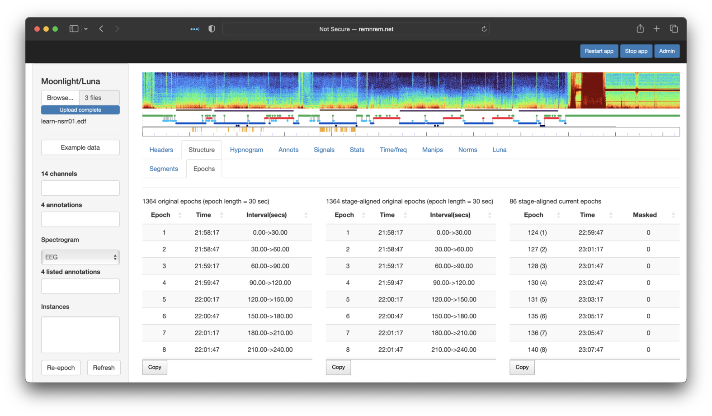
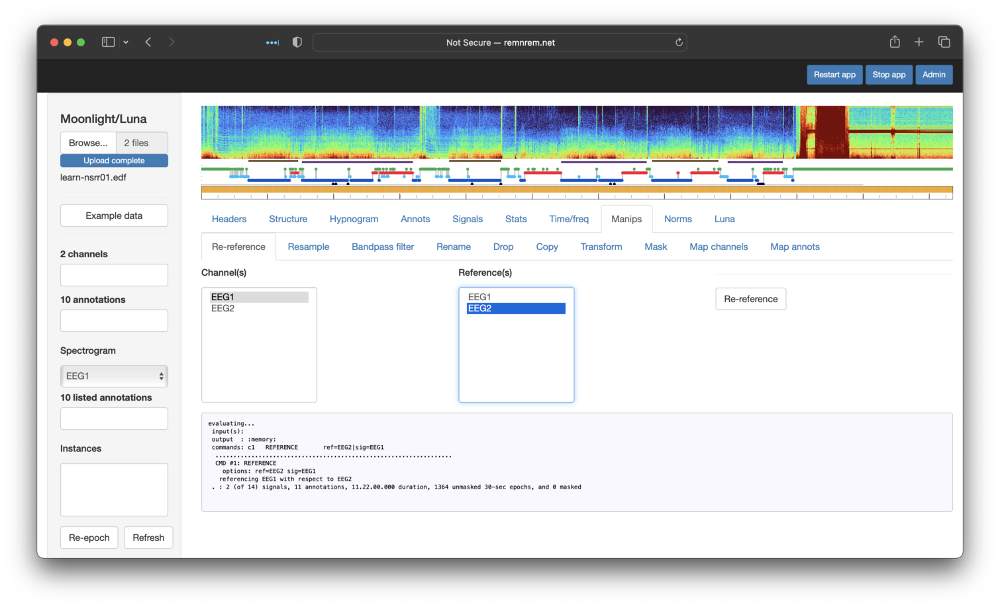

# Moonlight

In this final section, we'll repeat some (but not all) of the steps from
the previous tutorial
pages, using [_Moonlight_](../moonlight.md) instead of the
command-line ([_lunaC_](../luna/args.md)) or R
([_lunaR_](../ext/R/index.md)) packages.  As might be expected, this
makes some things easier, but other things harder: that is the reason
for both to exist, after all.

!!! hint "Moonlight: an interactive viewer, not a full analysis environment"
    Moonlight is an R/Shiny package wrapped around the Luna C/C++ library and the _lunaR_ R package.
    It is intended to be an _extended_ viewer for
    PSG signal data, with close bindings to some of Luna's
    functionality, e.g. for deriving hypnograms, for automated sleep
    staging, for spectral and other time-frequency analyses, for basic
    manipulations of datasets, and for embedding annotations alongside
    the signal data.  It is expressly _not intended_ to be a full
    analysis environment.  For a start, _Moonlight_ does not
    provide any mechanism for saving altered EDFs or annotation
    files.  Although we currently allow arbitrary Luna commands to be
    evaluated, this is primarily provided for didactic purposes
    (i.e. as an immediate way to see Luna commands in action).
        

## Display EDF files

If not already done, follow [these](tut1.md#obtaining-the-data) initial steps to download
the three tutorial EDF and annotation files.  From there, you can upload _one study at a time_
to _Moonlight_ for viewing and other functions.   There are several ways to run _Moonlight_, but
the option that is (initially) easiest is to use our hosted version at [http://remnrem.net/](http://remnrem.net/).
Open that link in a new browser window (i.e. to keep this page also visible) and click on the _Moonlight_ link
when it appears to start a new session.

!!! hint "Restrictions on the number of concurrent _Moonlight_ users at http://remnrem.net/"
    The [http://remnrem.net](http://remnrem.net) is a free service - hosted by the Purcell lab and NSRR
    using the AWS cloud.  As such, currently we
    necessarily have restrictions on the number of
    concurrent users this service is able to support.  If the app gives a message that the maximum number
    of users has been reached, try again later.  Alternatively, follow
    [these instructions](../moonlight-install.md) to use locally either a Dockerized
    version of _Moonlight_ or install and run it directly using _lunaR_.


As described in the original tutorial
([here](tut1.md#displaying-edf-files)), we used `DESC` and `HEADERS`
commands to review the contents of each EDF and any associated
annotations.  This is easily achieved using _Moonlight_: once you have
a running instance of the app, click the _Browse_ button (top-left
corner) and select the pair of EDF/annotation files (`.edf` and
`.xml`) for individual `nsrr01`. Both files must be selected at the
same time, and uploaded with a single click of the blue _Upload_
button: i.e. it is not possible to load multiple files sequentially. 


!!! hint "One EDF at a time"
    You can only view a single EDF at a time with _Moonlight_.  You can upload multiple annotation files,
    but they are all assumed to be associated with the same, single EDF.

!!! hint "Running _Moonlight_ locally"
    Faster uploads is another
    reason for installing _Moonlight_ locally, especially if working
    with larger PSG files (e.g. hdEEG), or with datasets containing
    PHI that cannot be shared. (Note that __absolutely no files or other
    derived data are stored on the server__ when using _Moonlight_, and
    we do not have access to any uploaded files).

The upload may take 5 or so seconds depending on your connection.
After upload has completed, you should see the following:


At the top of the page (and always present) is a spectrogram
(generated by the [`PSD`](../ref/power-spectra.md#PSD) command),
a hypnogram (generated by the [`HYPNO`](../ref/hypnograms.md#hypno)
command) and a so-called _mask bar plot_ (introduced
below). Underneath, with the _Headers_ tab selected, the lower panel
shows two tables, with information primarily generated by the
[`HEADERS`](../ref/summaries.md#headers) command.  These show the
signals present and some other basic properties of the EDF, such as
the length of the recording.

!!! hint "Channel/annotation alias/remapping"
    In the original tutorial, we used several options to specify
    channel lable aliases, that were applied on first loading new data.
    However, unlike command-line
    Luna, it is not possible to specify [_parameter
    files_](../luna/args.md#parameter-files) when uploading files
    to automatically remapping channel/annotation labels.  In
    large part, such remapping is typically not necessary in the
    context of an single-dataset, interactive viewer.  (Nonetheless,
    as shown below, it is possible to rename channels and remap
    annotations after upload, via some of the tools available in the
    _Manips_ panel.)

_Moonlight_ also supports viewing associated annotations (e.g. from one or more XML, `.annot` or
other files). As shown below, the annotations are also listed under
the _Annotations_ tab (fourth from the left).  In this example, the
list boxes in the leftmost panel show 14 channels (EDF signals) and 10
annotations:


Selecting specific annotations in the left menu will display them in
the _Annotations_ tab: as shown below, here we have selected `Hypopnea`,
`Arousal`, `Obstructive_Apnea` and `R` (REM sleep epochs). Note that the _Annotations_ tab contains two sub-panels: _Summary_ and
_Instances_.  Selecting the latter shows the specific events (with
start/stop times) for the set of selected annotations (as shown below - the _x_-axis
is hours from the EDF start).
The _Summary_ sub-panel (as shown in the image above) shows the number number and
total duration for each class of annotation.


If channels (interchangeably referred to as _signals_ here also)
and/or annotations are selected in the left _Channels_ and
_Annotations_ lists, the _Signals_ tab (fifth from the left) will show a
plot of the raw signals.  By default, this is centered on a 30-second
window, but can be expanded by clicking on _Out_ (or _All_).
If too long an area is selected, _Moonlight_ will not show
the signals, as this could involve plotting millions and millions
of datapoints (any selected annotations will still be shown, however).


Note the _reduced_ hypnogram just above the signal plots, with
color-coded bars indicating wake, NREM or REM epochs as green, blue or
red respectively. The black dot below it represents the currently displayed
epoch(s) of raw signal(s) in the main portion of the window.
Clicking on this bar moves the viewer to that position; the _Prev_ and _Next_ buttons
can also be used to shift the viewing window backwards and forwards in time.

## Signal summary statistics

The next step of the original tutorial, as described [here](tut1.md#signal-summary-statistics), was to estimate some basic
statistics for various channels - e.g. starting with the `SaO2` channel.   We can repeat that process by simply visiting the _Stats_
tab and selecting `SaO2` in the left _Channels_ list:


The table shows some of the whole-night statistics for this channel, calculated _on-the-fly_ and, as such, respecting
any _masks_ that are set, as shown below. Clicking on the _Epoch_ sub-panel shows epoch-level
equivalent metrics (not shown).

!!! note "Channel-wise versus epoch-wise statistics"
    If you look
    carefully, you'll see the original tutorial gave different means
    compared to these.  This reflects the fact that the _Stats_ module
    runs `STATS epoch` rather than simply `STATS` as per the original
    tutorial.  The `epoch` argument means that Luna estimates overall
    statistics (e.g. mean) as the _median of all epoch-level means_
    (as well as generating/reporting epoch-level statistics). That is,
    the values reported by _Moonlight_ reflect `MEDIAN.MEAN` from
    `STATS epoch` output, rather than `MEAN`.
    
## Working with annotations

We've seen above how the _Annotations_ tab provides a summary and tabulation of all annotations. We've further
seen how annotations can be integrated into the _Signals_ viewer.

As an additional check of the correspondence between what we saw in the [tutorial](tut1.md#working-with-annotations)
and what we see via _Moonlight_, consider that the first individual (`nsrr01`) had 37 `Obstructive_Apnea` events.
Indeed, from the screenshot shown in the prior section, we saw this was also the case here.

The next step in the tutorial asked how many 
events were observed during REM sleep (_N_=27). We can repeat this
in _Moonlight_ by taking advantage of the fact that the _Annotations_
tab respects any _masks_ currently set.   We can apply masks by going to the
_Manips_ (manipulations) tab, and selecting the _Mask_ sub-tab.  A box lists
the available annotations that can be used to either include or exclude epochs.
This feature is a simple wrapper around Luna's [`MASK`](../ref/manipulations.md#mask) command,
so be sure to review the details there.


The options above equate to

```
 MASK ifnot=R
```

Note that the _Expression_ box should be left empty if selecting annotation(s) from the list -- this box
provides a means for adding different options to `MASK` (as we see below when using the `hms` flag).

After clicking _Set_, you should see the following: 


Note that the bar underneath the top hypnogram is now striped gray and orange.   Gray means that
the mask has been set for that epoch -- whether or not a mask has been set corresponds to
whether or not that epoch is REM sleep (red in the hypnogram) or not.

If we go back to the _Annotations_ panel and select `Obstructive_Apnea` and `R` (REM),
you'll see that only apnea events that fall in REM are now shown:


An additional nuance covered in the original tutorial was to change the _definition of overlap_, 
to restrict to only counting events that _started_ in a REM epoch (rather than the default of including
all annotations with _any_ overlap.  Reflecting an inevitable trade-off between simplicity and flexibility,
the _Annotations_ panel does not support this additional option directly.

However, here we take this as an opportunity to see how the
_Luna_ panel (an advanced feature) allows us to recapitulate almost any Luna command within _Moonlight_.   As pictured below,
this panel allows an arbitrary series of Luna commands to be evaluated.  To mimic the behavior
of `ANNOTS start` in the original tutorial, we can type it in here and then click _Execute_:


If the evaluated command(s) generates output tables (i.e. as described [here](../luna/destrat.md), these will be listed
below the _Execute_ button.  The bottom table shows the currently selected table from this list:
here output from `ANNOTS` stratified by `ANNOT` (_annotation class_).  Here we see that there are 26
`Obstructive_Apnea` events under this definition (i.e. starting in REM), which matches the original Luna tutorial.


We can alternatively select the table that lists all individual events (starting in REM), as shown below:


Note that, as with most _Moonlight_ panels, these tables
have a _Copy_ button underneath - if clicked, the contents of that table are copied to the Clipboard, and can then be pasted
into a program such as Excel or otherwise saved to a text file. 


## Hypnograms

As shown above, if sleep stage annotations are recognized by Luna
(they will be mapped to the canonical forms `N1`, `N2`, `N3`, `R` and
`W`, as well as `?` and `L`), _Moonlight_ will draw a hypnogram under
the spectrogram when first attaching the new dataset.  The _Hypnogram_
tab (third from left) allows one to look at hypnogram-derived metrics
in _Moonlight_, including stage durations.

In the [original tutorial](tut3.md#hypnograms) we saw that the first
individual had 54.5, 261.5, 8.5 and 119 minutes of N1, N2, N3 and R
respectively. Selecting the _Hypnogram_/_Stages_ sub-panel, we see the same information
(along with some additional metrics):


Information on sleep cycles and epoch-level descriptions are also
available via the other _Hypnogram_ sub-panels.

## Epoch-level masks

To see how Luna masks are applied, it can be useful to
use _Moonlight_ to check that are doing what we assume they should:
To this end, we will reproduce [these
steps](tut3.md#epoch-level-masks) from the orignal tutorial, which involved
selecting epochs for the first individual that:

  - were in persistent sleep (at least 10 minutes of sleep prior)

  - occured between 11pm and 3am

  - were during stage 2 NREM sleep

  - did not contain any apnea or hypopnea events

!!! hint
    As noted above, Moonlight is not the ideal platform for
    implementing multi-step analyses - _if for no other reason, this
    type of GUI fundamentally violates the principles of reproducible
    research_.  

In the original tutorial we created an intermediate file
to flag epochs in _persistent sleep_ (named `ps-nsrr01.eannot`).
We can attach such [`.eannot` format](../ref/annotations.md#eannot-files)
files (here, a simple file of one line per
epoch, one label per line: here `PS0` or `PS1`), by additionally selecting it
when first uploading the EDF.  To do this, we need to reload the two original files (EDF and XML)
alongside this new annotation file.  (_Moonlight_ primarily
recognizes (NSRR format) XML, `.annot` and `.eannot` files as
annotation files.) One current limitation is that all files must be in
the same folder in order to be selected for upload, and so
we'll copy `ps-nrr01.eannot` into the `edfs/` folder (see the original
tutorial for how this file was created - it is also present under the
`cmd/` folder in `tutorial.zip`).

Re-uploading these three files (note: it is not necessary to have `nsrr01` as part of the filename -
all files attached at this step will be assumed to be associated with the same, single EDF):


We can now view the new `PS1` annotations alongside wake (`W`) epochs - as expected, no `W` epochs are `PS1`, but
not all sleep epochs are `PS1`, as per the definition of _persistent sleep_ used here:


To follow the steps of the original tutorial (which we'll do in the
same order - although they could be performed in any
order), we'll first restrict to epochs between 11pm and 3am.  This
involves using the [`hms`](../ref/masks.md#other-options) option as
part of a _mask_ (under the _Manips_ tab in _Moonlight_).  Note that
the syntax is the same as the original Luna commands.  After clicking
_Set_, you should see that the mask plot bar (under the top hypnogram)
nows shows that only epochs in this particular 4 hour interval are included
(colored orange, rather than gray):


To next restrict to persistent sleep `PS1` epochs only, we can use the same _Mask_ panel, but selecting
to _Include_ `PS1` epochs.  (We could equivalently
have selected to _Exclude_ `PS0` epochs).  This has the effect of further graying-out certain epochs in the mask plot bar:


Next, we restrict to N2 only, using a similar approach.  After this step, we'll see the following:


Finally, we'll exclude any epochs that have either an overlapping `Obstructive_Apnea` or `Hypopnea` event.  You can select multiple annotations to exclude
by holding down shift or control when selecting:


Then clicking on _Set_ should remove (more precisely, set the mask flag for) those epochs too.
The small gray box that shows the console output from Luna shows (final row) that we are left with
86 remaining epochs, which matches the original tutorial:


Having set this mask, we can _restructure_ the internal dataset, to
actually remove masked epochs rather than just flagging them. This
leaves us with what is effectively a discontinuous (EDF+D) in-memory
dataset.  Restructuring can be achieved by clicking `Re-epoch` in the
lower left corner of the screen.  Now the previously gray epochs
(i.e. with a _mask set but not removed_) will be now be white (i.e. _actually
removed_ from the in-memory dataset).  The _Structure/Segments_ tab (second
from the left) shows the structure of what is now a discontinuous recording/EDF+D:


That is, from the original recording, we selected (86/2)/60 = 0.72
hours of sleep. The table below the cartoon also shows where the
segments/gaps start/stop.  Selecting the adjavent _Structure/Epoch_ sub-panel
shows three breakdowns of epochs:



 - leftmost: original epochs (30 seconds by default) starting from the start of the EDF (for a continuous recording)

 - middle: epochs aligned with any sleep stage annotations - this may be different from the previous if sleep staging is not aligned with the start of the recording, e.g. the first staging annotation starts 28 minutes and 2 seconds into the recording, but for many datasets these will be identical to the left table

 - rightmost: the set of aligned epochs in the current in-memory dataset, i.e. following any masking/restructuring - here we see there are 86 epochs as expected.
 The numbers in brackets show the epoch count in the revised dataset (i.e. the first epoch in the extracted dataset was the 124th epoch in the original, etc).


To summarize, with the above steps we have recapitulated the following Luna commands, as per the original tutorial:

```
EPOCH
MASK none
MASK hms=23:00:00-03:00:00
EPOCH-ANNOT file=cmd/ps-nsrr01.eannot
MASK mask-if=PS0
MASK mask-ifnot=N2
MASK mask-if=Obstructive_Apena,Hypopnea
DUMP-MASK
RE
```


## Manipulating EDFs

The [next section](tut1.md#manipulating-edfs) of the original tutorial
showed some examples of manipulating signals: e.g. changing physical
units for EEGs, resampling, filtering and re-referencing. Although
_Moonlight_ is not the obvious tool for making such changes
(i.e. given that you cannot save/download EDFs), inasmuch as it might
be useful for certain viewing procedures (or as a prelude to automated
staging), the _Manips_ panel gives a selection of sub-panels to
perform these steps.  Each is a trivial wrapper around an underlying
Luna command, and so you should consult the appropriate Luna
documentation as needed:

| _Moonlight_ panel | Luna command | Description | 
|-----|------|------|
| _Re-reference_    | [`REFERENCE`](../ref/manipulations.md#reference) | Offline rereferencing one or more signals against a single reference |
| _Resample_        | [`RESAMPLE`](../ref/manipulations.md#resample) | Resample one or more signals | 
| _Bandpass filter_ | [`FILTER`](../ref/fir-filters.md#filter) | Apply bandpass filter | 
| _Rename_          | [`RENAME`](../ref/manipulations.md#rename) | Rename a single signal to something else |
| _Drop_            | [`SIGNALS drop`](../ref/manipulations.md#signals) | Remove one or more signals from the EDF |
| _Copy_            | [`COPY`](../ref/manipulations.md#copy) | Generate a copy of a single signal |
| _Transform_       | [`TRANS`](../ref/manipulations.md#trans) | Arbitrary transformations of signals | 
| _Mask_            | [`MASK`](../ref/masks.md#mask) | Set the epoch mask given various criteria |
| _Map channels_    | [`CANONICAL`](../ref/canonical.md#canonical) | Make new channels with specified labels/convntions | 
| _Map annots_      | [`REMAP`](../ref/annotations.md#remap) | Change annotation labels | 


 For example, to follow the (quite arbitrary) steps of the tutorial:

 - extratct two central EEGs only, and rename them as `EEG1` and `EEG2`

 - change physical units to milli-volts

 - resample to 100 Hz

 - bandpass filter to 0.3 - 35 Hz

 - re-reference `EEG1` against `EEG2`

We first use _Drop_, selecting all channels _except_ the EEGs:


We then use _Rename_ to set the labels to `EEG1` and `EEG2` (having to repeat this step for each):


There is no _Manips_ tab to change units _per se_, but we can use the _Luna_ tab to apply the simple `mV` command (no `sig`
is needed here, as we've already dropped all channels except the two EEGs, i.e. so `mV` will be applied to both):


Next, the _Resample_ tab (selecting both signals) to get 100 Hz signals:


Next, applying a bandpass filter to both EEGs:


And finally, re-referencing `EEG1` against `EEG2` (this is just to illustrate
the options available -- i.e. referencing two central, contralateral-mastoid referenced channels
against each other is not likely to be a meaningful operation in practice):


Having performed these steps, returning to the original _Headers_ table, it should have
updated to reflect these changes: i.e. it now just lists two signals
(`EEG1` and `EEG2`) that have _mV_ units (previously _uV_), etc.


We can also view these newly transformed signals as we would original signals.


Finally, when viewing we can apply on-the-fly bandpass filters to the
signals also - by selecting the desired frequency range and then
clicking _Filter_ (to toggle it on/off).  With the two EEGs filtered
in the sigma range, we see a clear periodic pattern (sigma power
bursts approximately every second in quite a regular manner),
particularly for `EEG1` which is likely artifact (as will be explored
in the next section).  This visualization shows that clear value of
visalizing signals.


       
## Artifact detection

!!! note
    Again, this example is presented with the caveat that the
    command-line Luna is a far superior tool for real data analysis.
    Here we present this for didactic value and to mirror the original
    Luna tutorial, in which we apply some very simple artifact
    detection approaches. Luna has a broader range of artifact
    detection and correction methods than is covered here, as
    described on [this page](../ref/artifacts.md)

The steps of the [original tutorial](tut3.md#artifact-detetion) basically ran through the following commands
(in `cmd/sixth.txt`):


```
EPOCH 
MASK if=W
RESTRUCTURE
FILTER bandpass=0.3,35 ripple=0.02 tw=1
ARTIFACTS mask
CHEP-MASK ep-th=3,3,3 epoch
CHEP epochs
DUMP-MASK
```

After first clicking `Refresh` (lower left panel) to clear any existing masks, etc,
for the attached `nsrr01` EDF, we can directly paste the above multi-step Luna script
into the _Luna_ panel, and select _Execute_ (note - the panel scrolls, so not all lines are shown here):


This produces all of the same output as the orignal Luna run, which is
accessible via the _Tables_ embedded in this page.  Here we see that five
tables have been generated.  By default, the first is automatically selected and shown: in this case, output
from `ARTIFACTS` stratified by `CH` (channel):


Looking at the other tables present, we can see that the `DUMP-MASK` command flags the mask epochs (not shown here).   As in the orignal tutorial,
we flagged a particular epoch (220) for visual review.  Indeed, if we look at the `DUMP-MASK` outputs, we'd see that epoch 220 is indeed
flagged as an artifact.    We can then directly use the viewer to look at this signal - i.e. giving the same view of the original tutorial:


Naturally, one advantage of using an explicit viewer like _Moonlight_ is that it is easier to click on other channels to see the broad picture of
what happens during this epoch:


## Spectral/spindle analyses

!!! note
    At the risk of repeating this one time too many: _Moonlight_ is absolutely
    not the optimal platform for full-blown analyses of sleep data -
    the command-line Luna is the preferred tool in that case.  With
    that aside, here we will repeat the final steps of the tutorial
    using _Moonlight_.


Finally, the original tutorial performed some limited spectral and NREM
spindle analyses of the sleep EEG. There is no single interface panel
for this - rather, we will use the _Luna_ panel to evaluate
arbitrary Luna commands - here the (slightly modified) text from
`cmd/seventh.txt`:


```
SIGNALS keep=EEG 
EPOCH 
MASK ifnot=N2
RESTRUCTURE
FILTER bandpass=0.3,35 ripple=0.02 tw=1 fft
ARTIFACTS mask
CHEP-MASK ep-th=3,3,3
CHEP epoch
RESTRUCTURE
PSD spectrum dB
SPINDLES fc=11,15 annot=spindles per-spindle
```

After copy-and-pasting the above into the appropriate place [which reads _(Enter Luna commands here)_] and clicking
_Execute_, you should see the following (assuming `nsrr01` was uploaded and/or you pressed `Refresh` after doing earlier
exercises):


That is, as per the standard output for Luna, we see the `CH` x `F`
table of the `SPINDLES` command (described
[here](../ref/spindles-so.md#spindles).  For example for the `EEG`
channel, we see the density (`DENS`) of both fast and slow spindles is
quite low (<1 spindle per minute).  Other metrics are scrolled off the
right side of the screen (you can scroll across the table with the
mouse).


!!! note "Displaying Luna tables"
    Unlike other parts of _Moonlight_,
    where it know the structure
    of the expected output and can easily
    format it nicely, the _Luna_ tab generates arbitary tables in
    terms of the columns, rows and header labels.  As such, it is not
    as straightforward to automatically format items for neat display.


Because we added the `annot=spindles` flag to `SPINDLES` it 
generated an annotation to indicate when the detected spindle events occurred.
These will be automatically added to the lists of available annotations, and
can be viewed in the _Signals_ tab along with other signals and annotations:


Note that we've selected the `spindles` annotation in both the top
_Annotations_ box (which controls which annotations are displayed) and
the lower _Listed Annotations_ also.  The latter box then lists the
individual events in the box below (lower left pabel).  Clicking on an
event will move the _Signals_ window to that position.  Note that
`spindles` must also be selected in the top box in order to see it in
the display.  You can zoom into the main display by selecting the
desired area with the mouse, e.g. to see the spindle close up (not shown). To
get back to the original view, perform a single-click anywhere in the display window.

As a final step (which goes beyond the original tutorial but underscores the value of visual
analysis), we'll revisit the issue of potential artificat in the `EEG` (`EEG1`)
signal as noted above.   If we turn on the _Filter_ set to the approximate sigma range (here 10.75 Hz - 18 Hz)
and also add the ECG channel to the display also, we can see a clear correspondence between spikes in the
EEGs and the ECGs:


Looking at the raw traces (toggling _Filter_ off) and zooming into (by selecting a region of the main view panel with the mouse)
we can see a clear correspondence between the QRS complex R peak in the ECG and what is seen in the EEG (here just showing one EEG channel).
This is a classic case of cardiac contamination in the EEG signal.  


We can attempt to attenuate this contamination with Luna's [`SUPPRESS-ECG`](../ref/artifacts.md#suppress-ecg) command, i.e. running the following
via the _Luna_ tab in _Moonlight_ (not shown):
```
SUPPRESS-ECG ecg=ECG sig=EEG
```

After performing the above and returning to the same region in the _Signals_ tab, we can see the artifact has been greatly (if perhaps not completely) removed:


Although beyond the scope of this tutorial, if one re-runs the
`SPINDLES command on the signals after dealing with cardiac
contamination effects, we typically see increased spindle density
estimates (as the cardiac contamination has the effect of increasing
baseline sigma activity, making it harder to detect spindles above the
increased noise).

---

__This concludes the _Moonlight_ tutorial, seeded on the original Luna
 (and _lunaR_) tutorials.  _Moonlight_ has a number of other
capabilities not even mentioned here. To learn about these other features (including
automated sleep staging) please visit [this page](../moonlight.md).__