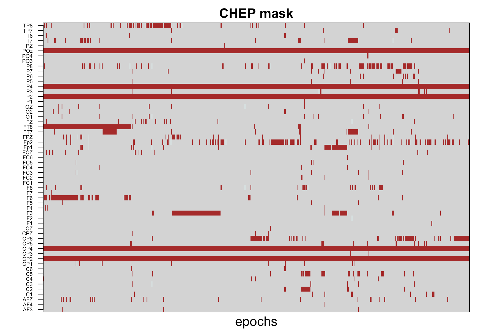
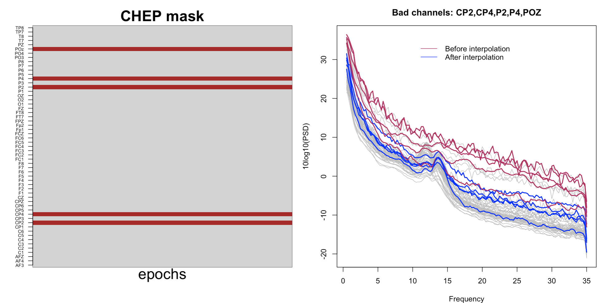
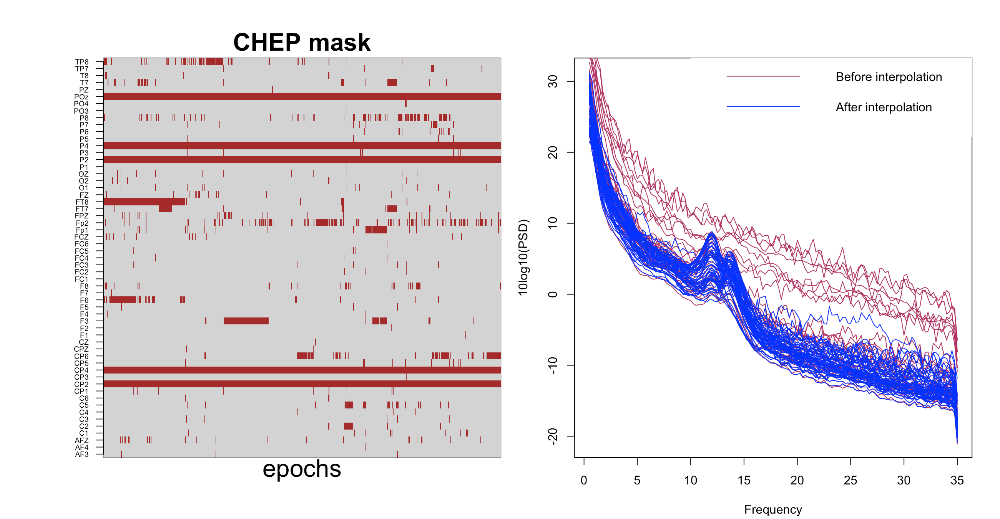

# Using Luna for automated artifact removal from high-density EEG

Some new features recently added to Luna provide a relatively easy
workflow for handling high-density EEG recordings, with a 
focus on artifact detection and cleaning.

These include:

 - detection of outlier epochs and/or channels
 - interpolation or removal of bad epochs and/or channels
 - ICA for artifact detection

In this vignette, we illustrate the first two of these features,
showing an example data-cleaning workflow (along with scripts for
visualization) as applied to a hdEEG sleep study.

## Initial raw data

We will use a 57-channel EEG dataset that combines manually-scored N2
and N3 sleep stages (in 30-second epochs).  These EEG data are
referenced to linked mastoids and have been previously band-pass
filtered 0.3-35 Hz and downsampled to 100 Hz.  The list of channels,
length of the recording, the sampling rate can be checked
with [`DESC`](../ref/summaries.md#desc) command:

```
luna Subj1.edf -s DESC
```

```
EDF filename      : Subj1.edf
ID                : Subj1.edf
Header start time : 21.30.23
Last observed time: 06.03.22
Duration          : 04:51:00
# signals         : 57
# EDF annotations : 1
Signals           : Fp1[100] Fp2[100] AF3[100] AF4[100] F7[100] F5[100]
                    F3[100] F1[100] F2[100] F4[100] F6[100] F8[100]
                    FT7[100] FC5[100] FC3[100] FC1[100] FC2[100] FC4[100]
                    FC6[100] FT8[100] T7[100] C5[100] C3[100] C1[100]
                    C2[100] C4[100] C6[100] T8[100] TP7[100] CP5[100]
                    CP3[100] CP1[100] CP2[100] CP4[100] CP6[100] TP8[100]
                    P7[100] P5[100] P3[100] P1[100] P2[100] P4[100]
                    P6[100] P8[100] PO3[100] PO4[100] O1[100] O2[100]
                    AFZ[100] FZ[100] FCZ[100] CZ[100] CPZ[100] PZ[100]
                    POz[100] OZ[100] FPZ[100]
```


In general, it is a good practice to look at the raw data before any
preprocessing steps, to get an idea about the quality of the data.  For
this purpose, let's compute Hjorth statistics and the (Welch) PSD using the
following command:

```
luna Subj1.edf -o ss_psd1.db -s 'SIGSTATS epoch & PSD spectrum max=35'
```

For visualization, we will use the R package and some of the
[lunaR](../ext/R/index.md) functions.  Using [this code](chep-viz.md#raw-data-psd),
we will plot the PSD from the output of the previous Luna run:


From the plot above, it is clear that there are quite a few noisy
channels, and based on the little topoplot in the top-right corner we
can approximately tell that most of the noisy channels (different
shades of pink) are located in the right hemisphere.

Another way to gain some insight on data quality is to look at
the Hjorth parameters computed with the 
[`SIGSTATS`](../ref/summaries.md#sigstats) command in the above Luna run.  Using
the [`lheatmap()` function](../ext/viz.md$lheatmap), we can visualize the
data using [this code](chep-viz.md#raw-data-hjorth-parameters):


In particular, based on the second Hjorth parameter (H2), it is evident that several channels
show unusual patterns in the latter two-thirds of the recording (red horizontal lines).  Vertical streaks
represent bad epochs, in which many channels showed unusual patterns (e.g. due to movement).


## Detecting bad channels

Luna provides a number of ways to detect bad channels, based on
different criteria such as a lack of correlation with other channels
(`CORREL`), low predictability of a channel based on other channels
(`L1OUT`), or being an outlier based on Hjorth parameters with respect
to other epochs.  In this vignette, we will focus on the latter
approach due to its simplicity and efficiency.

The full process involves four Luna commands:

* [`CHEP-MASK`](../ref/masks.md#chep-mask) - to compute Hjorth (or other) statistics and flag outlier channel/epoch pairs
* [`CHEP`](../ref/masks.md#chep) - to apply the mask generated by the previous command(s), masking epochs and/or channels
* [`CLOCS`](../ref/spatial.md#clocs) - to specify channel locations, which are needed by `INTERPOLATE`
* [`INTERPOLATE`](../ref/spatial.md#interpolate) - to interpolate (via spherical splines) all previously masked epochs

Let's first omit the interpolation component and focus on detecting
bad channels using the `CHEP-MASK` and `CHEP` commands.  In brief:
`CHEP-MASK` defines outlier CHannel/EPoch pairs, in one of three ways

 - __within-channel, between epochs:__ the `ep-th` option finds time series that are unusual with respect to all other epochs for that channel (i.e. searching across a row in the matrix plotted below)

 - __within-epoch, between channels:__ the `ch-th` option finds time series that are unusual with respect to all other channels for that epoch (i.e. searching across a column) 

 - __between-channels and between-epochs:__ : the `chep-th` option finds times series that are unusual with respect to all epochs across all channels (i.e. searching the whole matrix)

These three options take one or more standard deviation thresholds as
options, allowing for iterative outlier detection: e.g. `ep-th=5,3`
means to flag epochs that are 5 SDs away from the mean for any Hjorth
parameter, and then repeats the process (in the cleaned data) by further
marking epochs that are 3-SD outliers.  These three options can be
specified together within the same `CHEP-MASK` command, in which case they will be
performed in the order above.


To clarify some of the language used below:

 - a __channel__ is a row of this matrix
 - an __epoch__ is a column of this matrix
 - a ___chep___ (CHannel/EPoch pair) is a single cell of this matrix: these are the entities that are flagged by `CHEP-MASK`

By itself, the _cheps_ flagged by `CHEP-MASK` are not recognized by
most Luna commands (e.g. `PSD`, etc), although there are a few
exceptions: `CHEP` and `INTERPOLATE` being the primary ones that are
relevant here.  This principle is enforced because Luna expects that
most operations will require that multiple channels all align, in the
sense of corresponding to the same underlying set of epochs. In other
words, we typically want a dataset in which an epoch is either masked
or not, and in which a channel is either present or not.  One key role
of the `CHEP` command is to translate between this internal _CHEP_
mask, and the dropping of channels and/or epochs from the overall
dataset.

Coming back to our dataset: we'll use
[`CHEP-MASK`](../ref/masks.md#chep-mask) command with the option
`ch-th=2`, meaning that _cheps_ with any of the three Hjorth parameters
exceeding 2 SD with respect to other channels (for that same epoch) will be
defined as outliers.  Further, we'll use `CHEP` to take the
existing _CHEP_ mask (i.e. generated by the `CHEP-MASK` command) and
flag whole channels if a certain proportion (e.g. 30%) of _cheps_ have
been flagged as outliers. To do this, `CHEP` is called with the
option `channels=0.3` to mark a channel as bad (i.e. mask that channel for all epochs)
if more than 30% of its _cheps_ are outliers.  We'll also use the option `dump` to
save the newly generated mask into the output stream.

```
luna Subj1.edf -o chep_bchs.db -s 'CHEP-MASK ch-th=2 & CHEP channels=0.3 dump'
```

!!! Note "Other CHEP functionality"
    There are other options [described here](../ref/masks.md#chep) for
    `CHEP` such as loading, saving or clearing CHEP masks, masking epochs,
    etc.

We can now visualize this mask to see which epochs and channels were
marked as outliers by running [this R script](chep-viz.md#bad-channel-detection):



The plot above is a direct illustration of how the `CHEP` mask works
across channels and epochs, with the dark red color marking the
_cheps_ marked as outliers.  It is now apparent that 5 channels were
defined as "bad", with all epochs fully masked out (namely POz, P4, P2,
CP4 and CP2).  Also notice that those channels correspond to
the red lines we observed before on the H2 heatmap:


That is, the channels defined as bad had extreme values
for the latter part of the recording; further, the number of bad _cheps_ 
for those channels exceeded our threshold of a maximum
30% and thus were masked out completely.

## Interpolation

!!! Note
    The `INTERPOLATE` command needs information about channel locations, which can be attached via the [`CLOCS` command](../ref/spatial.md#clocs).


Now we will proceed to interpolate bad channels.  As well as channel
locations, the `INTERPOLATE` command requires a valid _CHEP_ mask to
be specified, in order to tell it what to interpolate.  One can either
create this in the same run as the interpolation (i.e. the _CHEP_ mask
resides in memory), or if wanting a multi-step approach, it is
possible to save the _CHEP_ mask to a file, and then reload it.  To
illustrate these possibilities, we'll adopt this second approach here.

First, we will re-run the `CHEP-MASK` and `CHEP` commands to generate a file that contains
the bad channels to be re-interpolated.   We'll make two changes to the above Luna commands:

 - using `save` instead of `dump`: this writes a simple text file that
   can be `load`ed back into Luna in a subsequent run

- adding the option `black-and-white` which modifies the behavior of
 the `channels` command: now, as well as "bad" (above threshold)
 channels having all _cheps_ set to bad, this option will also do the
 converse: all _cheps_ for "good channels" will be set to good: i.e. a
 channel is now either "all good" or "all bad".  This way, the
 subsequent interpolation will be operating at a whole-channel level
 (as described below, Luna's interpolation routine is not constrained
 to work at the whole-channel level in general).

```
luna Subj1.edf -o chep_bchs.db -s ' CHEP-MASK ch-th=2
                                  & CHEP channels=0.3
                                         black-and-white
                                         save=bad.chep'
```


Now we will use the text file we just saved from `CHEP` and reload it
to define the _CHEP_ mask.  (As noted above, we could simply have
re-run the `CHEP-MASK` and `CHEP` commands in this second run rather
than saving to a file: we are simply illustrating different modes of
operation here, some of which may be more natural in some scenarios.)
We will interpolate the bad channels, and compute
`SIGSTATS` and `PSD` once more to make sure that interpolated channels
look broadly acceptable.

```
luna Subj1.edf -o ss_psd2.db -s ' EPOCH
                                & CLOCS file=clocs
                                & CHEP load=bad.chep dump
                                & INTERPOLATE
                                & SIGSTATS epoch
                                & PSD spectrum max=35'
```	

    

Using [this R code](chep-viz.md#interpolating-bad-channels), we can generate the following visualization
showing the interpolated channels, and the resulting PSD (compared to beforehand for the bad channels):



!!! hint "Dropping channels instead of interpolating them"
    If you wished simply to remove the bad channels (instead of interpolating them), then replace `INTERPOLATE`
    with `RESTRUCTURE`.

!!! hint "Specifying channel labels"
    By default, Luna will feed all data channels into commands such as `CHEP-MASK`, `CHEP`, `INTERPOLATE`, etc.  If the EDF also contains non-EEG channels, or you only want a subset of the EEG
    channels to be considered, then add a `sig` option to any of these commands.  For example, if specified, the `CHEP` command uses the number of channels specified in `sig` as the denominator
    for deciding whether a given epoch should be flagged or not.


## Epoch-level interpolation

Based on the PSD above, the bad channels seem to have been interpolated
nicely, but are the data really clean enough?  We see that there are still
many channels with noisy PSD (in grey on the background in the above
plot).  Should we use a stricter threshold and define more channels as
bad?  That will potentially result in slightly cleaner data, but at
the same time, we will likely end up with a huge proportion of the data
final being interpolated, which is naturally undesirable.

This type of trade-off seems particularly relevant for sleep EEG
recordings, which are typically very long and so may contain both
hours of clean data but also signifcant periods of unusable data.
Further, the noisy periods may occur at different times for different
channels (meaning that one cannot simply remove a small portion of the
recording).  Rejecting hours of good EEG data seems wasteful.

To address this, Luna provides an option of interpolating all 
outlier _cheps_ and not only whole channels.  That is, Luna's
`INTERPOLATE` command works on an epoch-by-epoch basis, where the
channels being interpolated can vary between epochs (i.e. they are defined
by the appropriate column of the _CHEP_ mask).

As a demonstration, we will now interpolate all the _cheps_ which were
defined as outliers when we first ran `CHEP-MASK` and `CHEP` commands (rather than
extracting only a handful of bad channels).  The primary difference is that we do not
add the `black-and-white` option for the `CHEP` command:

```
luna Subj1.edf -o ss_psd3.db -s ' CHEP-MASK ch-th=2
                                & CHEP channels=0.3 dump
                                & CLOCS file=clocs 
                                & INTERPOLATE
                                & SIGSTATS epoch
                                & PSD spectrum max=35'
```

Visualizing the resulting PSD (using [this R code](chep-viz.md#epoch-level-interpolation)): 



This "patchwork" interpolation scheme results in a PSD plot that looks better (note, only 3% more _cheps_
were interpolated in addition to those arising from the 5 bad channels we defined
previously).

Of course, for some analyses, it is important to keep
track of which parts of the data were interpolated; this can be achieved
by saving the _CHEP_ mask, as plotted on the left-hand
side of the figure.  This records which
epochs and channels were interpolated, as well as the percentage of epochs
interpolated per channel, or percentage of channels for which a
particular chep was interpolated.

!!! hint "Saving cleaned EDFs"
    In these examples, we've run
    interpolation once but then typically just generated a `PSD` or
    some other statistic.  In practice, one would typically want to
    save these interpolated EDFs, e.g. using the [`WRITE` command](../ref/outputs.md#write).

## Final epoch-level pruning

Finally, we can add an extra round of epoch-level outlier detection,
to remove bad epochs (i.e. which could not be well-interpolated if too
many/all channels were affected by large artifact).  We'll repeat the
commands previously run but this time to identify unusual _cheps_,
using the option `ep-th=4,4` (outliers defined with respect to all
other epochs of a channel).  We then apply `CHEP epochs` to mask an
epoch across all channels if it was found to be an outlier in at least
one channel.  The `CHEP epochs` command sets the same epoch-level mask
that Luna uses in other contexts with the [`MASK`
command](../ref/masks.md), e.g. in which epochs are flagged if they
span certain sleep stages, etc (e.g. `MASK ifnot=N2`).  As such, this
channel-agnostic epoch-level mask pairs with the `RESTRUCTURE`
command, to fully remove from those epochs from the internal
representation of the EDF.   That is, think of the _CHEP_ mask and this epoch-level
mask as two intrinsically different entities, but where the latter can be set the former
by using the `CHEP epochs` command:

```
luna Subj1.edf -o ss_psd4.db
               -s ' CHEP-MASK ch-th=2
                  & CHEP channels=0.3
                  & CLOCS file=clocs 
                  & INTERPOLATE
                  & CHEP clear
                  & CHEP-MASK ep-th=4,4
                  & CHEP epochs dump 
                  & RESTRUCTURE
                  & SIGSTATS epoch
                  & PSD spectrum max=35'
```

!!! Note "Using `TAG`s to track output"
    This time we will dump the `CHEP` mask only from the second time we run
    `CHEP` command.  If one wanted to output the same measures from two or more
    runs of the same command, in order to be able to distinguish them in the output,
    it would be necessary to add a [`TAG` statement](../ref/summaries.md#tag).

Now we can visualize which epochs were removed and how the final data
look using [this R code](chep-viz.md#masking-remaining-outlier-epochs):


Unlike all previous commands, the above command now results in a
slightly shorted recording. Evidently, by removing relatively few
epochs (to be exact, 43 epochs, about 7% of our data) we ended up with
nice and smooth PSD across all channels.  A direct comparison of the
initial and cleaned data is below:


## Concluding remarks

In this vignette, we used some of Luna's commands for
automatic artifact detection and removal.  The goal was to develop an
understanding of the basic steps and logic behind them

It is important to note that the thresholds, and the order of running
the commands can have a large impact, and different datasets with
different patterns of artifact may have different optimal
strategies. Naturally, there are other diagnostics other than Hjorth
parameters one can imagine using to flag bad epochs (in fact, the
`CHEP-MASK` commands implements some of these, including diagnostics
for flat signals, clipped signals, or above-threshold amplitudes).

!!! hint "Epoch duration"
    Another variable in artifact detection is epoch lengh: although this is 30 seconds by default, this can be specified
    to be any different value; e.g. it might make sense to clean data using a smaller 5-second window which would improve
    both the sensitivity to detect shorter artifacts, and decrease the amount of bad data that needs to be discarded/interpolated.
    This is achieved by adding this command to the start of the above scripts:
    ```
    EPOCH dur=5
    ```

It is also important to remember that some downstream analyses will be
more sensitive to bad data than others; also, some analyses may
require that more of the original data be preserved (e.g.  if looking
at ultradian dynamics, it will not be sufficient to extract only 30
minutes of data, no matter how prestine it is). In other words, there
is not necessarily a one-size-fits-all approach that we can suggest.
Using the scripting approaches above, it is obviously possible to
tweak a number of these features, however, that when combined with
appropriate visualization, can be used to build an artifact detection
pipeline that is hopefully more suitable for a given dataset.

In future vignettes we'll consider other sources of artifact
(e.g. ocular and cardiac physiological artifacts) as well as
alternative or complementary approaches to detecting and correcting
them as implemented in Luna (e.g. ICA).
