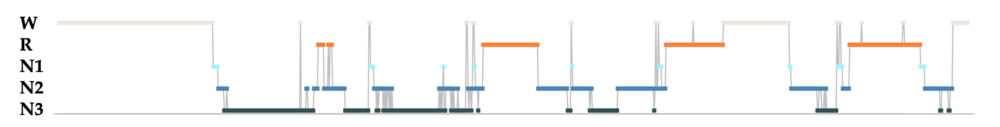
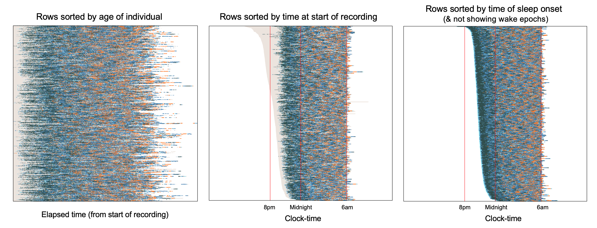
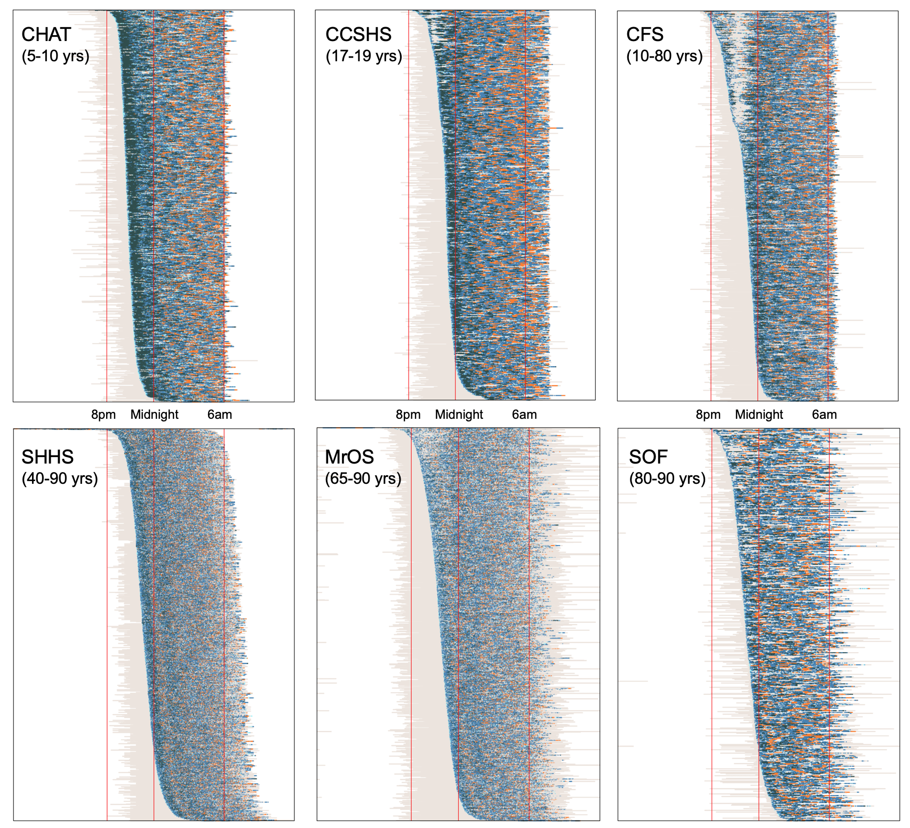
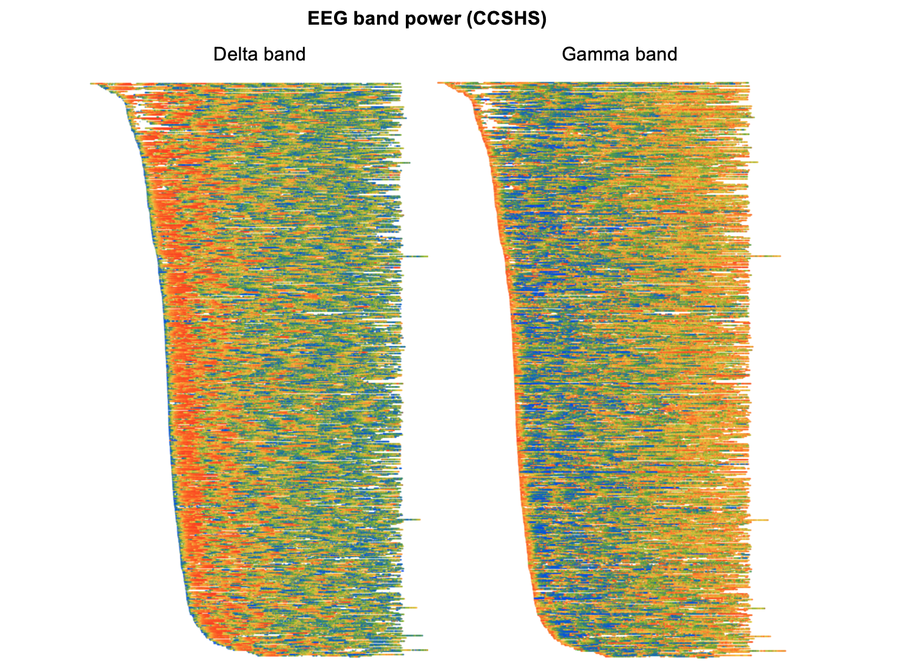
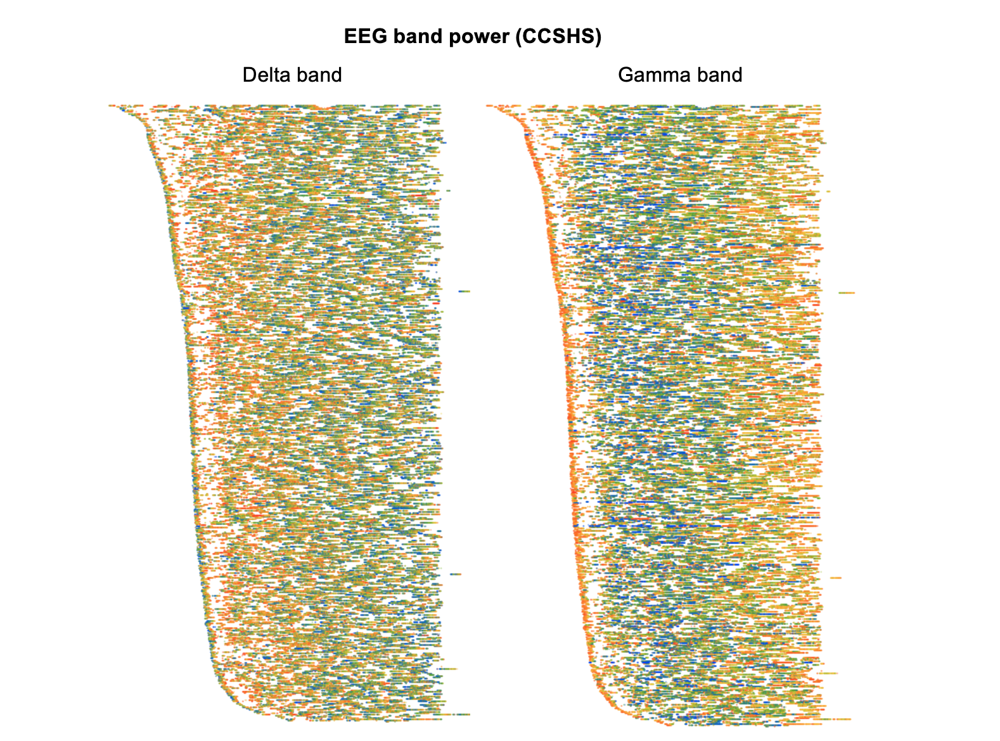
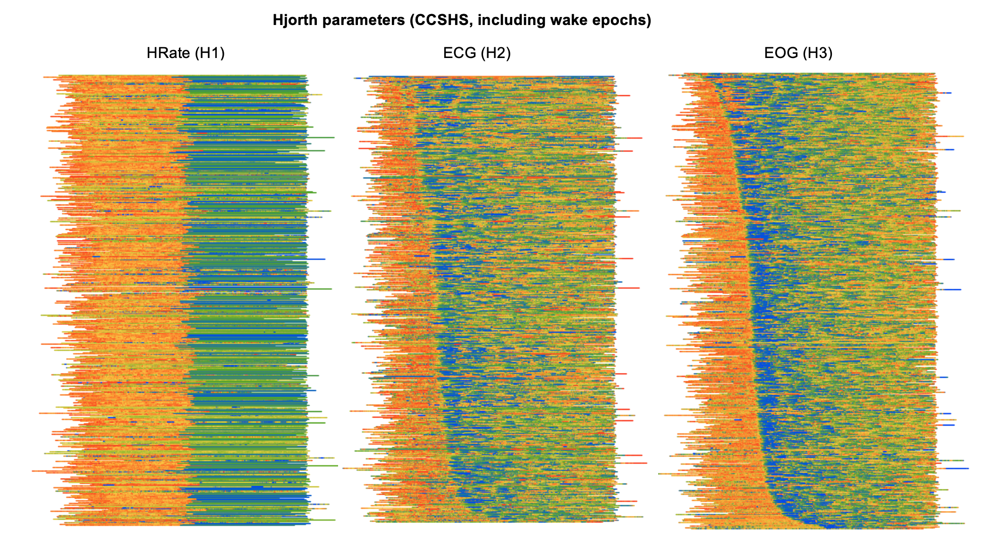
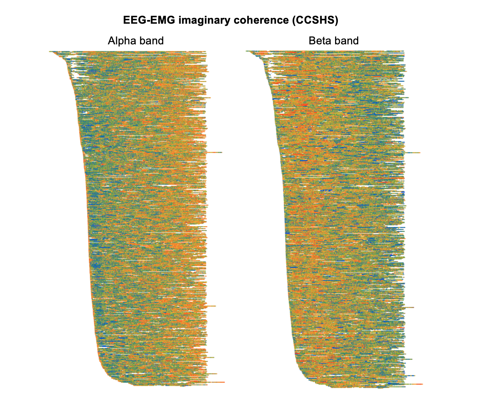

# NSRR whole-dataset visualizations

To paraphrase the adage, _a picture is worth a thousand numbers_.  In
order to investigate some basic properties of NSRR datasets, here we
generate a number of whole-dataset visualizations.  To make sense of
these images, we’ll employ a remarkably complex computational pattern
recognition and dimension reduction framework, a.k.a. the human visual
system.  We'll illustrate how visualization can __highlight temporal, ultradian
patterns__ in sleep across many individuals; more generally, we'll also
see how it can __point to oddity and artifact__ in datasets, as well as
acting as an __hypothesis-generating tool__, especially for complex,
multi-modal datasets.

## Sleep stage timing

For a single individual, the _hypnogram_ is a common way of
representing sleep dynamics defined in terms of wake and sleep
stages. Below is a hypnogram for one individual, randomly selected from 
the [CHAT](http://sleepdata.org/datasets/chat/) study:

{width="100%"}

Each point represents the manually-assigned stage for a 30-second
epoch: REM (orange), NREM 1, 2 and 3 (light, mid and dark blue
respectivly) and wake (cream).  As is typical in young sleepers, we
see about four _cycles_ of successive NREM and REM bouts, with
progressively longer REM bouts towards the end of the night.

In the plots below, we'll compress a single hypnogram to become a single line,
using only color to denote the changes between sleep state.  Here is the 
hypnogram above represented this way:

{width="100%"}

### Ultradian dynamics

We'll now stack many hypnograms (i.e. individuals) on top of each
other, to obtain the gestalt of an entire dataset.  Below are three
plots, each of 779 individuals from the non-randomized arm of the
CHAT study.  In the __leftmost plot__, rows (i.e. children) are ordered by
age (approximately between 5 and 10 years); the _x_-axis is
_elapsed time_ from the start of the recording.

{width="100%"}

Especially at this resolution, it isn't necessarily easy to make out specific
features when the data are shown this way, although we do see
generally more REM (orange) in the second half of the night.

!!! hint
    Open the image in a new browser tab to see more details.

Alternatively, it can sometimes be useful to instead organize the
_x_-axis to represent _clock-time_ rather than elapsed time: that is,
we line up hypnograms such that each column of the plot shows data
from the same clock-time, irrespective of when each study started.
The __middle plot__ above shows this representation of the data, but
now with rows ordered by the time at which the recording started,
rather than age.  That is, the upper lines are individuals whose sleep
recordings started around 6pm, whereas lower lines are individuals
whose recordings started around 11pm.

The __rightmost__ of the above plots also has clock-time as the
_x_-axis, but orders individuals by (the clock-time of) sleep onset,
rather than the start of the recording.  It also only shows sleep, not
wake, epochs.  Arguably this third representation gives the clearest
reflection of the above-mentioned ultradian dynamic, namely a
preponderance of deep sleep (N3, dark navy blue) towards the start of
the night, followed by increasingly more REM sleep later in the night
(orange).

### Impact of study protocols

These two _clock-time_ plots above also make evident another aspect of
the CHAT study: although children went to bed at different times,
studies typically stopped recording (whether or not the child was
awake by then) at about 6am. That is:

 - compared to recording start time, there are only very limited
   individual differences in recording stop time, i.e. there is an
   almost straight line formed along the righthand edge of the lines
   for the __middle__ and __rightmost__ plots

 - as shown in the __middle__ plot, as recordings typically stopped
   prior to final wake, the total sleep time estimated for these studies
   (and indeed many other related related parameters) will be a
   biased, truncated estimate of typical sleep duration

 
### Cross-cohort comparisons

For five other NSRR datasets (including adolescents, middle-aged and
elderly adults) as well as CHAT, the figure below shows plots of both
sleep and wake epochs, with clock-time as the _x_-axis and
individuals ordered by clock-time of sleep onset:

{width="100%"}

Comparing plots between cohorts illustrates a
number of physiological and technical differences.  

- Some studies (e.g. SHHS and MrOS) contain an order-of-magnitude greater number of 
  individuals compared to others (e.g. CHAT and SOF), and so when
  plotted at this resolution and scale, there is unavoidably more
  "smoothing" of points (which are plotted in a semi-transparent way)
  in the larger cohorts, i.e. as we can't get >5000 rows/pixels in one
  plot and still have it fit on a typical monitor.  This makes the
  (important) point that __different ways of visualizing data can induce
  or mask differences__ between datasets; e.g. to study SHHS dynamics more
  carefully, we'd need to plot this differently.

- Nonetheless, certain other between-cohort differences are still
  clear.  For example, as expected, there is generally __less deep
  sleep in the older cohorts__, compared to CHAT and CCSHS.

- Comparing the adults cohorts to CHAT, CCHS and CFS, we see these
  studies have a more typical __distribution of recording stop times__:
  i.e. especially in SHHS, it is clear that individuals who go to bed
  later also tend to end their sleep later, as not all studies finish
  at the same time.  In the SHHS, individuals were instructed to go to
  bed at their typical bed times, and so we might, to some extent,
  expect differences in sleep midpoint to reflect differences in
  chronotype (morning versus evening types). If we were to study sleep
  midpoint (i.e. the point midway between sleep onset time and final
  wake/end of recording), e.g. assuming it might reflect chronotype,
  a naive analysis in CHAT, CCSHS and CFS would report large but
  artifical _negative_ correlations between sleep duration and sleep
  midpoint.  That is, because of the design of the study, people who
  went to bed later will appear to have less sleep, as the recordings
  stop all around the same time in the morning.  In contrast, in SHHS
  there is _no significant correlation_ between sleep midpoint and total
  sleep time.

- We might guess that in the SHHS, recordings stopped at the final
  wake, even though final wake is not included in the EDFs. In
  contrast, __MrOS and SOF include epochs of final wake__ in many
  recordings.

- In CFS (and less so CCSHS) there is a strange pattern
  whereby the people with the earliest sleep onset all tend to wake
  for about an hour or so (i.e. the top third of the CFS plot). On
  reviewing the CFS study's protocol, this reflects the fact that
  recordings were performed in a hospital setting, and __CFS participants
  had blood draws or other tests scheduled at set times, i.e. around
  10pm__.  This means that some individuals who fell asleep earlier were
  then awakened by study staff.  This will naturally have some impact,
  e.g. likely inducing an artificial correlation between WASO and
  sleep onset time.  Any analyses focussing on the timing and/or
  dynamics of sleep (e.g. modeling dissipation of delta power as a
  marker of homeostatic sleep pressure) should be particularly aware
  of this aspect of the data, which could otherwise confound things.

  In any case, the point for our current purposes is simply to note
  that different visualizations of datasets can bring out feautures
  that otherwise might not be obvious but might nonetheless be
  important for a given analysis.

## Signal dynamics

All the plots above represented sleep stage across the night using the
color of points.  Naturally, we can use the same framework to
represent epoch-by-epoch changes in _any_ sleep metric, e.g. for
continuous metrics using a rainbow/heatmap scheme (here
red/yellow/green/blue to reflect highest/higher/lower/lowest values).
The plots below are all based on the CCSHS dataset, and consider
spectral power in the EEG, Hjorth parameters for other signals, and
finally, a more "exotic" metric from polysomnography (corticomuscular
coherence, or synchrony between brain activity and muscle).

As above, the intention is simply to highlight one or two ways in
which visualizations of data can be useful, both to highlight temporal
dynamics in sleep signals and to spot potential artifacts and
oddities.  Of course, in many cases we could achieve much the same end
result by plotting simple means as a function of clock time or elapsed
time or sleep cycle, etc., rather than these temporally-aligned
individual-level heatmaps. Nonetheless, the approach here may be
useful if the ordering of individuals (i.e. _y_-axis) is chosen to be
a relevant factor, e.g. if it modulates patterns of temporal dynamics.
(And, of course, they are also more colorful!)

### EEG spectral power

Here we see clearly how, in the left plot, absolute __delta power__ in the EEG is highest near the
start of the night and then dissipates.  (Note that in these
particular plots, we've normalized each individual to have similar
whole-night levels, in order to highlight _within-individual_ dynamics
rather than _between-individual_ differences.  We'd still see the same
basic pattern, in either case, though.)

The right plot shows changes in absolute __gamma power__, which shows
an almost inverse dynamic compared to delta power. That is, around the
first few minutes of sleep onset gamma power is high,then drops
quickly, and then slowly builds up over the second half of the night:

{width="100%"}

By definition, EEG power changes with sleep stage.  Recreating the
above two figures but only for N2 epochs (below) we can still
observe similar dynamics for delta and gamma power _within nominally
similar epochs_ however.  (All epochs that are something other than N2
sleep are left a white/not plotted.) That is, the quantitative EEG
metrics are capturing systematic differences in sleep above and beyond
what is represented by traditional staging:

{width="100%"}

### Dynamics and artifacts

Especially for sleep signals other than the EEG (for which spectral
band power characteristics are familiar), Hjorth parameters are a
convenient way to reflect their gross properties.  The three
parameters H1, H2 and H3 reflect _activity_ (basically, a signal's
typical amplitude), _mobility_ (it's frequency) and _complexity_ (it's
variability).  Here, we've generated plots for all wake as well as
sleep epochs, to highlight some wake/sleep differences, but with the
rows/individuals still ordered as above (i.e. by clock-time of sleep
onset):

{width="100%"}

The __leftmost__ plot shows _activity_ (H1) for the `HRate` (derived
heart rate) channel in CCSHS. Clearly, there is an abrupt change that
occurs halfway through the recording. In fact, on inspection, we see
that this channel basically flat-lines at almost exactly the halfway
point of each recording, thus the apparent loss in information
content/variability for the second half of the night.  So, in this
instance, __visualization has helped to flag an obvious error with the
recording/data__. (These derived channels will be removed from
subsequent releases of the CCSHS data.)

The other two plots show how different metrics for different signals
(ECG and EOG) show wake/sleep differences, but also clear ultradian
dynamics, e.g. the tendency for heart rate (as measured indirectly by
the _mobility_ of the ECG) to dip during deep sleep.  That is, even
though not explicitly indicated on the plots, the pattern of when
sleep onset occurs (i.e. which will mirror the above plots) is
readily apparent for both these metrics.

### Other ultradian dynamics

Finally, polysomnography offers are rich set of possibities for
investigating the interplay between different body systems.  As a
somewhat random and entirely data-driven exercise, here we look at the
coupling between brain (EEG) and muscle activity (chin EMG), known as
[corticomuscular
coherence](https://en.wikipedia.org/wiki/Corticomuscular_coherence).
Typically studied in the context of explicit movements/motor commands,
it can be indexed by spectral coherence.  Here we show epoch-level
_imaginary coherence_ (which avoids volume conduction artifact) in the
_alpha_ (left plot) and _beta_ (right plot) power bands.  As with many
of the above examples, there are clear temporal dynamics in this
measure, that appear to track across all subjects, and show
qualitatively different patterns for alpha and beta power;
furthermore, this effect is seen if looking just within N2 sleep, and
so reflects dynamic processes at a finer granularity than traditional
staging.  

{width="100%"}

What does this particular result mean? Is it interesting?  Personally,
I've currently no idea...  Again, the purpose here is to demonstrate the
__hypothesis-generating value__ of data visualization, inasmuch as
different views of a dataset can bring what might otherwise be
unappreciated features and facets to the fore. 

_So, the bottom line -- be sure to look at any data you download from the NSRR!_

