# Aligning recordings from independent sensors

Luna's [`INSERT`](../ref/exp.md#insert) command exists for a practical
reason: independent recording systems rarely agree perfectly about
time.  This can make aligning concurrently recorded signals -- for
example, from a wearable and a traditional PSG performed on the same
night -- difficult.

To illustrate some of these issues, here we use a real example from
Nox and X-trodes recordings of the same subject on the same night. The
Nox EDF starts at `22:00:01` and the X-trodes EDF starts at
`22:26:09`: that is, the EDF headers alone imply a start offset of
just over 26 minutes (1,568 seconds) that must be accounted for.  We
merged the two recordings to make a single EDF, assuming the two original
EDF header times were accurate (using the [`INSERT`](../ref/manipulations.md#insert) command, as shown
below).

Here's header information for the Nox recording:
```
luna nox.edf -s DESC
```
```
 duration 10.00.30, 36030s | time 22.00.01 - 08.00.31 | date 17.07.23
```
and for X-trodes:
```
luna xtrodes.edf -s DESC
```
```
 duration 08.56.40, 32200s | time 22.26.09 - 07.22.49 | date 17.07.23
```

We'll initially compare the two frontal channels (F3-M2 and F4-M1)
from the Nox device with the two frontal X-trodes channels
(approximately positioned near AF3/Fp1 and AF4/Fp2).  A cursory visual
review of the signals (using
[Lunascope](https://zzz.nyspi.org/lunascope)) shows nontrivial issues
in aligning these two recordings.

At a broad, zoomed-out level we see the expected correspondence
between devices: the two Nox frontal channels are shown in the lower
two traces, and the two X-trodes channels are shown in the top two
traces. Here, we've delta-band filtered the signals to highlight the
ultradian variation in slow wave sleep over the night, making their
correspondence clearer (note the high-amplitude noise at the start/end of the Nox recording while
X-trodes was not recording reflect movement during the pre-lights out period):

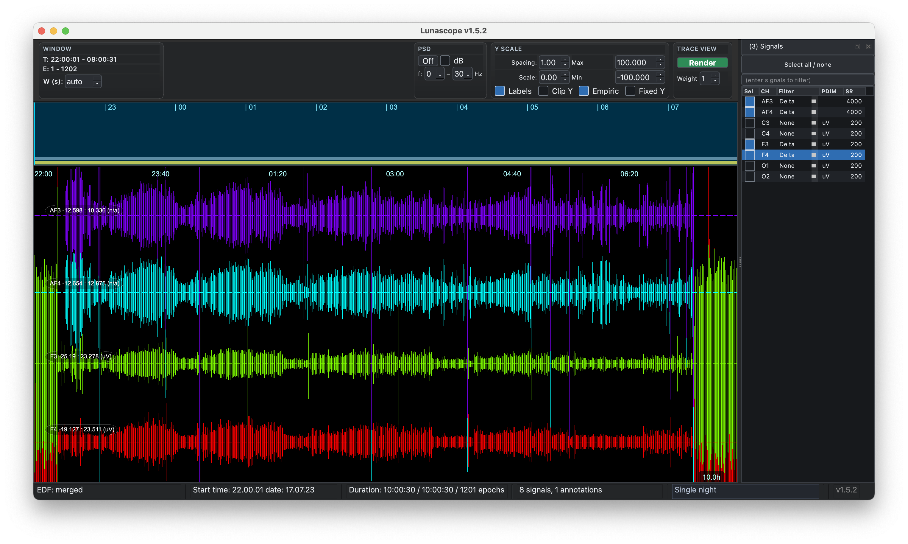

However, zooming in we see a clear divergence in the signals around
`23:05:22`, early in the recording, even after adjusting for the different start times (as per the EDF headers).
Naturally these are different channels and are
not expected to align completely, but visual review around this area makes the relative timing
of the signals quite clear. (Open the picture in a separate tab to zoom in and see it more clearly.)

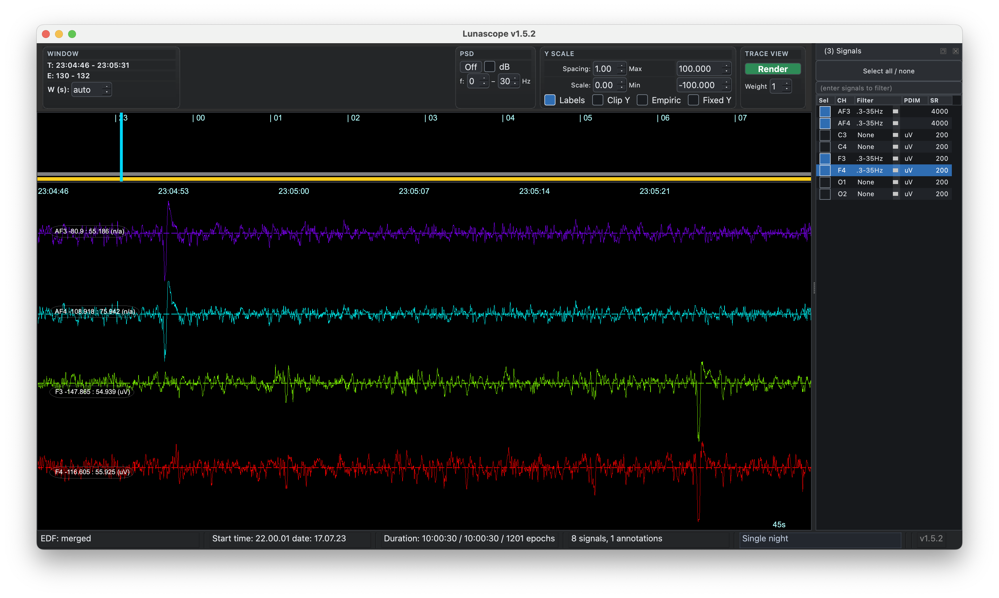

In this case, there is a difference of approximately 31.0 seconds -
even after correcting for the EDF header start times - with the
X-trodes signals coming earlier than expected, relative to the Nox. Here we measure the
time difference with Lunascope's probe option:

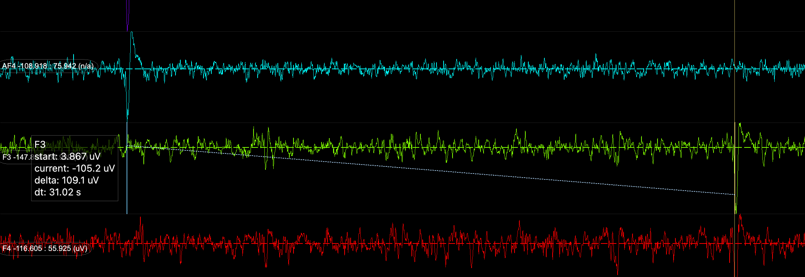

This might simply suggest that one (or both) of the clocks was not
properly synchronized, and so the times in the EDF header are not
fully accurate. Naturally this is important to note and correct in
any case - but further review suggests something else going on between
these recordings.  When looking at other clear 'landmark' points later
in the night, we find the gap has shrunk - and by quite a lot.  Here
at `04:26:16`, the gap is almost 8 seconds shorter, with only 23.1
seconds between points.

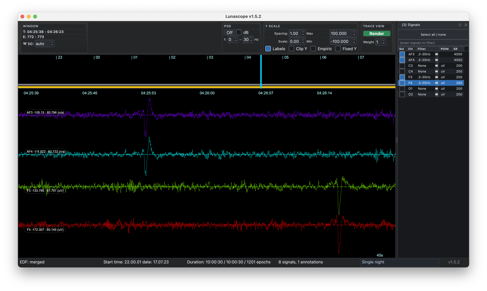

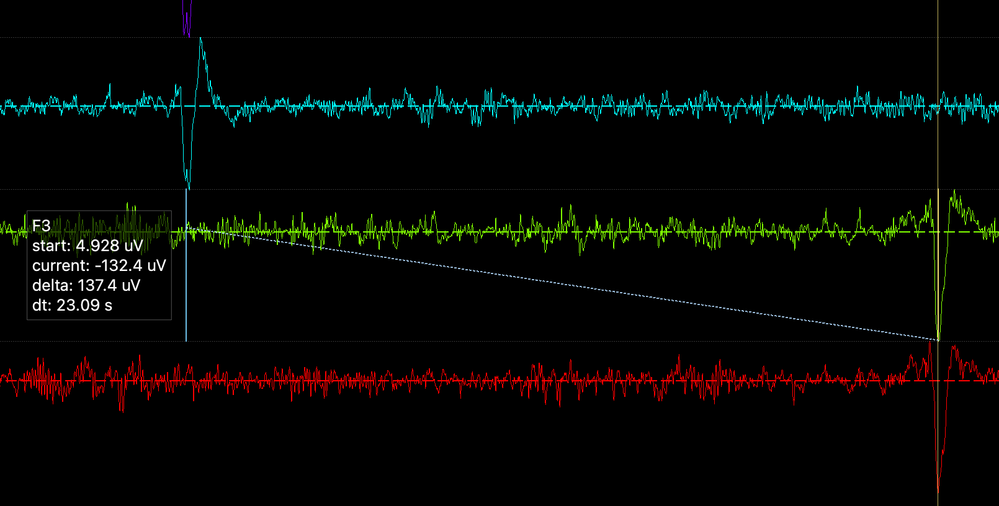

This change of almost 8 seconds over a period of
almost 20,000 seconds (from 11pm to 4:30am) corresponds to a drift rate
between clocks of 0.04% - around 400 ppm.  If this reflected a
continuous drift due to different effective sampling rates, this would
imply the __nominal rate of 200 Hz is more like 200.08 Hz__ for X-trodes
(here assuming the Nox device is exactly 200 Hz, although of course
from this comparison alone we can only determine a difference; we
cannot make absolute statements about which device is the more
accurate).

---

This preliminary visual review begs several questions:

 - are the EDF header clocks really not well specified?

 - is there a continuous drift between device clocks?

 - or was there perhaps a gap in recording for one of the devices that occurred between these two time points?

 - how do we fix this? 

This is the motivation for the [`INSERT`](../ref/manipulations.md#insert) command.


## Sources of misalignment

In general, there are several potential sources of discrepancy between EDF-based recordings:

 - standard EDF headers only encode start time to **1 second** resolution
 - unsynchronized clocks
 - manual header edits or offsets
 - unannotated gaps or pauses in recording 
 - nominal sample rates that are not quite the true sample rates

Considering this last issue: whereas two devices may have nominal
sampling rates of 200 Hz, in practice they may vary by small amounts -
both between each other and within themselves over time. The stability
of a quartz oscillator clock can vary depending on factors such as
temperature, the age of the crystal, mechanical stress, humidity,
power supply voltage, magnetic fields, and so on.  Most consumer or
mid-grade electronic devices likely have quartz oscillators that have
a tolerance around 10 - 50 ppm (parts per million) or worse. For a
signal sampled at 200 Hz, this might correspond to an error around
0.01 Hz.

On top of the quartz oscillator, analog-to-digital converters (ADC)
and other factors may impose further discrepancies, further
compounding differences between devices. Especially in wearables,
sampling may be triggered by software-specific factors such as
interrupts, the OS scheduler, buffer filling, etc., which may introduce
jitter and occasionally dropped or duplicated samples.  Suboptimal
anti-aliasing/digital filtering or data transmission artifacts can
further degrade the accuracy and stability of the true sampling rate.

Over long recordings, tiny timing mismatches can become visible if
they accumulate, meaning that the two clocks will appear to
systematically and continuously _drift_ relative to each
other. Practically, for most analyses this will likely not matter.
However, when comparing or merging signals across different sensors,
such effects can matter a great deal: a few seconds of drift can
completely stop channels from lining up.  Depending on the scale of
drift and the nature of the recording, attempts to align EEG
transients (e.g. spindles) will be impacted, and possibly even
epoch-level comparisons too.


## INSERT command

Rather than trusting a single header timestamp, the [`INSERT`](../ref/manipulations.md#insert) command is designed to
align two EDFs empirically, and merge them in a way that adjusts for certain types
of timing artifact.  Specifically, it:

 1. takes a set of _similar_ signal pairs across the two EDFs

 2. estimates the best local lag in many windows by cross-correlation

 3. fits the linear change in lag over time

 4. optionally, uses that fitted offset plus drift to insert the
    secondary signal on the primary EDF timeline

Even when there is no real timing problem to correct, [`INSERT`](../ref/manipulations.md#insert) can still be a useful way to merge EDFs. It supports sub-second fractional alignment, allows the inserted signals to have different sample rates from the reference EDF, and can handle recordings that only partially overlap in time; where inserted signals extend into uncovered regions, those gaps are zero-padded. One practical consequence is that the output is always defined on the reference EDF timeline, and so has the same duration as the reference EDF. In that sense, the operation is asymmetric: one EDF is the timeline anchor, and the other is inserted into it.


## Simulated data examples

Before applying [`INSERT`](../ref/manipulations.md#insert) to real data, let's first apply it to data
where we know the ground truth by design.  We'll extract only the
O1-M2 channel from the Nox device and then create several copies that
introduce different types of timing differences:

 1. an exact copy, perfectly aligned

 2. a version that is __filtered__ - and so no longer
 digitally identical - but is still aligned in time with itself (n.b. all
 subsequent copies are based on this filtered copy too)

 3. a version where we introduce an __offset__ between the two signals (by misspecifying the start time)

 4. a version where we introduce a __drift__ between the two signals (by misspecifying the sample rate for one)

 5. a version with a multi-second __region spliced out__ - so that one signal drops some data but would appear to jump ahead relative to the other original

 6. a version with __all the above__: a time offset, a gap/jump and a drift
 

### Self comparisons

We start by extracting the O1-M2 channel from `nox.edf` and saving a
new reference EDF `r0.edf`, renamed to just `O1`
(although we could have just used the original `nox.edf` in these examples):

```
luna nox.edf sig=O1 -s WRITE edf=r0 
```

We create an identical version by simply copying the file `r0.edf` to
`r-copy.edf` (although we could have just used `r0.edf` twice in the
example below too).

We run [`INSERT`](../ref/manipulations.md#insert) specifying the comparison `edf` and the `pairs` of channels used (here, both `O1`):

```
luna r0.edf -o out.db -s INSERT edf=r-copy.edf pairs=O1,O1 
```
```
  header-derived offset: -0 seconds (negative = edf2 starts after edf1)
  using header-derived offset-range: -60 to 60 seconds
  method: xcorr, bandpass 0.5-30 Hz;  300s windows every 60s,  range 3603-32427s

  summary across 481 window(s):
    quality          accepted=481/481 (100%)  peak median=1  mean=1  min=1  max=1
    waveform_shift   median=0s  mean=0s  min=0s  max=0s  range=0s
    offset           -0s (waveform_shift=0s, header_offset=-0s)
    drift            slope=0 s/s  (0 s/hr)  intercept=0s  R2=1
    implied SR of secondary: 200 Hz  (nominal: 200 Hz)
    (positive slope = secondary clock running faster than primary)
  per-pair drift:
    O1..O1:  slope=0 s/s (0 s/hr)  intercept=0s  implied SR=200 Hz
```

As noted in the console log, by default [`INSERT`](../ref/manipulations.md#insert) looks at 300s windows spaced
one minute apart across most of the night (skipping periods near the
start and end, which tend to be artifact-ridden, and are more likely
to not have a matching partner in the other recording, if recordings
were of different durations).

Based on the cross-correlation between signals, this analysis
correctly suggests that there is no drift or offset between the recordings -
all windows have a perfect cross correlation (under the `quality`
line) with an implied `offset` of 0s.  That is, when similar signals truly align,
this command correctly suggests that.

### Filtered data

Next, we'll make a filtered (2 - 20 Hz) copy of the signal and save it as `r-flt.edf`:

```
luna r0.edf -s ' FILTER bandpass=2,20 tw=2 ripple=0.01 & WRITE edf=r-flt '
```

Re-running [`INSERT`](../ref/manipulations.md#insert) between `r0.edf` and `r-flt.edf`:
```
  header-derived offset: -0 seconds (negative = edf2 starts after edf1)
  using header-derived offset-range: -60 to 60 seconds
  method: xcorr, bandpass 0.5-30 Hz;  300s windows every 60s,  range 3603-32427s
  summary across 438 window(s):
    quality          accepted=438/481 (91.0603%)  peak median=0.75  mean=0.67  min=0.20  max=0.90
    waveform_shift   median=0s  mean=0s  min=0s  max=0s  range=0s
    offset           -0s (waveform_shift=0s, header_offset=-0s)
    drift            slope=0 s/s  (0 s/hr)  intercept=0s  R2=1
    implied SR of secondary: 200 Hz  (nominal: 200 Hz)
    (positive slope = secondary clock running faster than primary)
  per-pair drift:
    O1..O1:  slope=0 s/s (0 s/hr)  intercept=0s  implied SR=200 Hz
```

We now see that the cross-correlations vary between 0.2 and 0.9,
reflecting the impact of filtering.  Correspondingly, some windows
were deemed not to have sufficiently high cross correlations to
accurately determine their offset - here, almost 10% of windows were
dropped (under the `quality` row).  However, across every retained
window the offset is still exactly 0s, correctly implying that there
is no drift or offset between these signals.


For illustration, we can push this a step further such that we'd expect the
correspondence of the two signals to break down - here we arbitrarily impose a very strict (30-31 Hz)
filter, essentially removing almost all of the physiological variation in this copy: 

```
luna r0.edf -s 'FILTER bandpass=30,31 tw=2 ripple=0.01 & WRITE edf=r-flt '
```

Re-running [`INSERT`](../ref/manipulations.md#insert) with this noise comparison, we now see a different pattern:

```
  header-derived offset: -0 seconds (negative = edf2 starts after edf1)
  using header-derived offset-range: -60 to 60 seconds
  method: xcorr, bandpass 0.5-30 Hz;  300s windows every 60s,  range 3603-32427s
  summary across 5 window(s):
    quality          accepted=5/481 (1.0395%)  peak median=0.096  mean=0.11  min=0.07  max=0.36
    waveform_shift   median=0.57s  mean=0.503s  min=0.235s  max=0.57s  range=0.335s
    offset           -30.9914s (waveform_shift=30.9914s, header_offset=-0s)
    drift            slope=-0.00111667 s/s  (-4.02 s/hr)  intercept=30.9914s  R2=0.5
    implied SR of secondary: 199.777 Hz  (nominal: 200 Hz)
    (positive slope = secondary clock running faster than primary)
  warning: alignment quality may be poor: P_OK=0.010395 < 0.5; median peak=0.0962119 < 0.35
  hint: try a smaller len window; also try a wider offset-range (e.g. offset-range=-360,360) or full-search
  per-pair drift:
    O1..O1:  slope=-0.00111667 s/s (-4.02 s/hr)  intercept=30.9914s  implied SR=199.777 Hz
```

Of note:

 - most significantly, only 5 (of 481) windows met the default
   criteria for showing a sufficient correlation:

 - because of this, we see a warning is issued (`warning: alignment
   quality may be poor`)

 - there is a range of offsets in those 5 windows

 - there is a nonzero slope (for the estimate of potential drift) but
   this has a relatively low `R2` of 0.5 and, most importantly,
   is only based on the 5 windows, and so should not be trusted

It is possible for this type of message to reflect two
recordings that are extremely misaligned (e.g. with an offset
of tens of minutes), meaning that the default windowing strategy
missed them (this is why the warning also gives hints about
extending the search space to capture search issues).

However -- as in this example -- this can also reflect that the pairs
of signals used to align the data are fundamentally too different and
so cannot be meaningfully aligned.  If this is the case, then not much
can be done except to use different signals if they are available, or
to post-process both signals to be more comparable.

__Bottom line:__ [`INSERT`](../ref/manipulations.md#insert) is agnostic to the type of signals
used (they do not have to be EEGs, for example), but it
is premised on the signals a) showing meaningful _variability over the night_,
and b) being _roughly similar_ across the two recordings.

### Offset

Next, using the "lightly" filtered copy from the last section, we'll create a timing offset between the two recordings,
by changing only the EDF header start time for the second EDF, advancing it from 22.00.01 by 12 seconds:

```
luna r-flt.edf -s ' SET-HEADERS start-time=22.00.13 & WRITE edf=r-offset '
```
Re-running [`INSERT`](../ref/manipulations.md#insert):
```
luna r0.edf -o out.db -s ' INSERT edf=r-offset.edf pairs=O1,O1 '
```
```
  header-derived offset: -12 seconds (negative = edf2 starts after edf1)
  using header-derived offset-range: -72 to 48 seconds
  method: xcorr, bandpass 0.5-30 Hz;  300s windows every 60s,  range 3603-32427s
  summary across 438 window(s):
    quality          accepted=438/481 (91.0603%)  peak median=0.75  mean=0.66  min=0.20  max=0.89
    waveform_shift   median=0s  mean=0s  min=0s  max=0s  range=0s
    offset           -12s (waveform_shift=0s, header_offset=-12s)
    drift            slope=0 s/s  (0 s/hr)  intercept=0s  R2=1
    implied SR of secondary: 200 Hz  (nominal: 200 Hz)
    (positive slope = secondary clock running faster than primary)
  per-pair drift:
    O1..O1:  slope=0 s/s (0 s/hr)  intercept=0s  implied SR=200 Hz
```

We now see the offset of -12 seconds, correctly inferred from the EDF
headers. (The `offset` is negative, as it reflects the correction to
add to the secondary timeline to align it to the primary one.)

The `waveform_shift` values are derived from the cross correlation
analyses, meaning that after adjusting for the header difference, no
further waveform shifts are necessary.  To illustrate these different
effects, consider another offset example:

```
luna r-flt.edf -s ' SET-HEADERS start-time=22.01.00
                    MASK mask-epoch=1 & RE
                    WRITE edf=r-offset '
```

That is, the EDF header is shifted now 59 seconds forward (from `22.00.01` to
`22.01.00`) but we also chop off the first epoch. Luna's [`WRITE`](../ref/outputs.md#write) will
adjust the EDF header time by a further +30 seconds to account for
this - so `r-offset.edf` will have a final time start of `22.01.30` ,
but will _actually_ start at `22.00.31`, i.e the _true_ time (based on
the original signal) for the start of the second epoch.

Now re-running [`INSERT`](../ref/manipulations.md#insert):

```
  header-derived offset: -89 seconds (negative = edf2 starts after edf1)
  using header-derived offset-range: -149 to -29 seconds
  method: xcorr, bandpass 0.5-30 Hz;  300s windows every 60s,  range 3600-32400s
  summary across 437 window(s):
    quality          accepted=437/481 (90.8524%)  peak median=0.75  mean=0.67  min=0.20  max=0.89
    waveform_shift   median=-30s  mean=-30s  min=-30s  max=-30s  range=0s
    offset           -59s (waveform_shift=-30s, header_offset=-89s)
    drift            slope=0 s/s  (0 s/hr)  intercept=-30s  R2=1
    implied SR of secondary: 200 Hz  (nominal: 200 Hz)
    (positive slope = secondary clock running faster than primary)
  per-pair drift:
    O1..O1:  slope=0 s/s (0 s/hr)  intercept=-30s  implied SR=200 Hz
```

We see the apparent 89s header offset has been corrected by -30s,
resulting in the final, correct -59s offset.  If you trust [`INSERT`](../ref/manipulations.md#insert) you don't need to look
at these outputs in too much detail, but briefly:

 - `header_offset` is the known timing difference from the EDF start times alone

 - `waveform_shift` is the additional correction still needed after
  accounting for that header difference, estimated from the signals themselves by cross-correlation

 - `offset` is the net timing correction (these two previous offsets combined) that must be applied to the
   secondary recording to align it to the primary. Negative means shift the secondary
   earlier; positive means shift it later
 
### Drift

Next, we create _drift_ in one of the signals, by misspecifying the true sampling rate.  We take
the filtered 200 Hz signal, resample it to 200.1 Hz and then save it as a text file (`s.txt`, which
has just one numeric value per row):

```
luna r-flt.edf -s ' RESAMPLE sr=200.1 & MATRIX file=s.txt min '
```
Next we create an EDF from this sample _but specify a nominal rate of exactly 200 Hz_ when reading it in:

```
luna s.txt --fs=200 --time=22.00.01 --date=17.07.23 --chs=O1 -s WRITE edf=r-drift
```

This trick (using an intermediate text representation of the signal
that, unlike EDF, loses explicit information about sampling rate)
lets us effectively mimic a clock that is "too fast" here.  Note that
we specify the start time/date to match the original - i.e.  there is
no further _offset_ here, just clock drift. This is a 0.05%
(500 ppm) drift effect, which is relatively large, leading to a drift
of almost 15 seconds over an 8 hour recording.

We now run [`INSERT`](../ref/manipulations.md#insert) on `r-drift.edf` - i.e. the file that has a signal
labelled as 200 Hz but it is in fact 200.1 Hz.  Using the default invocation
we actually hit a warning:
```
luna r0.edf -o out.db -s ' INSERT edf=r-drift.edf pairs=O1,O1 '
```
```
  header-derived offset: -0 seconds (negative = edf2 starts after edf1)
  using header-derived offset-range: -60 to 60 seconds
  method: xcorr, bandpass 0.5-15 Hz;  300s windows every 60s,  range 3603-32427s
  summary across 4 window(s):
    quality          accepted=4/481 (0.831601%)  peak median=0.18  mean=0.18 min=0.008  max=0.33
    waveform_shift   median=14.27s  mean=13.2975s  min=10.365s  max=14.69s  range=4.325s
    offset           -0.199976s (start_shift=0.199976s, header_offset=-0s)
    drift            slope=0.000494937 s/s  (1.78177 s/hr)  intercept=0.199976s  R2=0.999552
    implied SR of secondary: 200.099 Hz  (nominal: 200 Hz)
    (positive slope = secondary clock running faster than primary)
  warning: alignment quality may be poor: P_OK=0.00831601 < 0.5; median peak=0.189887 < 0.35
  hint: try a smaller len window; also try a wider offset-range (e.g. offset-range=-360,360) or full-search
  per-pair drift:
    O1..O1:  slope=0.000494937 s/s (1.78177 s/hr)  intercept=0.199976s  implied SR=200.099 Hz
```

It closely estimates the slope (reflecting drift implying a
sampling rate of 200.099 Hz, instead of true 200.1 Hz), but it only
considers 4 valid windows to do this.  The drop out of windows is
actually driven by the relatively large simulated drift effect here.
That is, at 200.1 Hz, even within a single 300s window (the default
unit of the cross correlation analyses) there can be non-negligible
drift (0.15s, or 30 samples) which can attenuate cross
correlations.

[`INSERT`](../ref/manipulations.md#insert)'s behavior can be modified to handle these "low quality"
situations better: in this case, a) using a shorter window, and/or b)
excluding high-frequency content, as it will be more impacted by
drift (by default, [`INSERT`](../ref/manipulations.md#insert) pre-filters signals using a passband of  0.5 - 15 Hz).
Either change "fixes" the issue here, we'll just present the
results for the combined set:

```
luna r0.edf -o out.db -s ' INSERT edf=r-drift.edf pairs=O1,O1 filt-high=4 len=30 '
```
```
  header-derived offset: -0 seconds (negative = edf2 starts after edf1)
  using header-derived offset-range: -60 to 60 seconds
  method: xcorr, bandpass 0.5-4 Hz;  30s windows every 60s,  range 3603-32427s
  summary across 444 window(s):
    quality          accepted=444/481 (92.3077%)  peak median=0.57  mean=0.54  min=0.03  max=0.77
    waveform_shift   median=9.305s  mean=9.15167s  min=1.84s  max=16.205s  range=14.365s
    offset           -0.00796436s (start_shift=0.00796436s, header_offset=-0s)
    drift            slope=0.000499825 s/s  (1.79937 s/hr)  intercept=0.00796436s  R2=1
    implied SR of secondary: 200.1 Hz  (nominal: 200 Hz)
    (positive slope = secondary clock running faster than primary)
  per-pair drift:
    O1..O1:  slope=0.000499825 s/s (1.79937 s/hr)  intercept=0.00796436s  implied SR=200.1 Hz
```

We now see the vast majority of windows are included, and the estimate
of the sample rate is 200.1 Hz exactly.  Importantly, the `drift` line
in the console output above shows the R2 of the fit of offset by time
over the night is very high (`1.0`).  This indicates that the change
in offset really does reflect a linear change over the night -
i.e. drift.  We can see this most clearly by plotting the offsets (and other information)
window-by-window.  We can extract as a text file (some columns removed for clarity):
```
destrat out.db +INSERT -r WIN > o.tsv
```
```
ID  WIN   DSEC  FIT_OUTLIER   PEAK    T1_HMS     T2_HMS      TOT_SEC
r0  3603  0      -1           0.240   23:00:02   23:00:04    -1.81
r0  3663  0       0           0.303   23:01:02   23:01:04    -1.84
r0  3723  0.03    0           0.395   23:02:02   23:02:04    -1.87
r0  3783  0.06    0           0.559   23:03:02   23:03:04    -1.9
r0  3843  0.09    0           0.703   23:04:02   23:04:04    -1.93
r0  3903  0.12    0           0.719   23:05:02   23:05:04    -1.96
r0  3963  0.145   0           0.737   23:06:02   23:06:04    -1.985
r0  4023  0.18    0           0.744   23:07:01   23:07:04    -2.02
r0  4083  0.21    0           0.679   23:08:01   23:08:04    -2.05
...
```

Plotting `PEAK` (Cross correlation) and `TOT_SEC` (Offset) against window (Time in seconds):

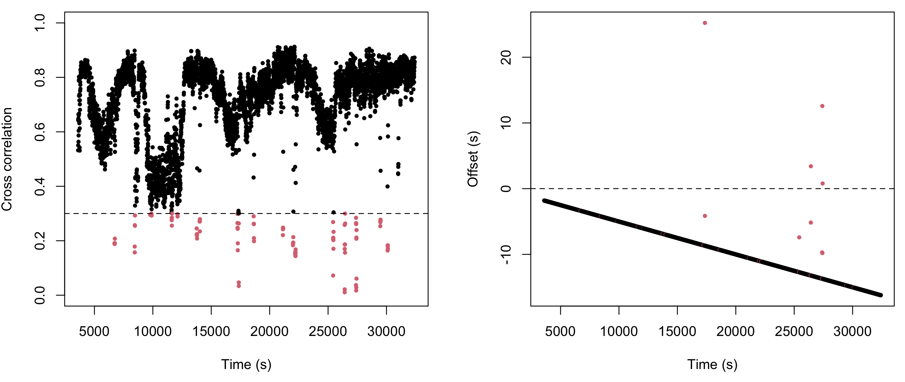

The left panel shows the cross-correlation per window.  Those in red are "low quality" and
excluded from the drift slope fit.   The panel on the left shows the high quality window
offset estimates as a function of time; here the red points also include those flagged as outliers
in the residual space after regressing on time (this 3SD outlier step is repeated twice).
Despite the offsets being independently estimated, there is a very clear - almost perfect -
linear trend - which points to linear drift accumulating steadily across the night (as we know to
be true in this simulated example). Note that it does not start exactly at 0s offset, as we have excluded the
initial (and ending) parts of the recording, given the default value of the `start` argument.


### Gap/jump

As well as continuous drift, one can also imagine the offset changing across the night due to
more discrete jumps/gaps.  This has implications for how one might try to fix the issue.  Here
we simulate a jump of 12 seconds midway through the study.

First, we output the 200 Hz signal as is, as a text file `s.txt`: 
```
luna r-flt.edf -s ' MATRIX file=s.txt min '
```
This `awk` command splices in 12 extra seconds (2400 samples at 200 Hz) at some point midway through the night (5 hours in, i.e. 200 x 60 x 60 x 5),
i.e. corresponding to an implied "gap" in the reference EDF:
```
awk 'NR==3600000{for(i=1;i<=2400;i++) print "0"} {print}' s.txt > s_gap.txt
```
We then make an EDF of this: reading from the text file, Luna "won't know" about the gap/jump we've introduced:
```
luna s_gap.txt --fs=200 --time=22.00.01 --date=17.07.23 --chs=O1 -s WRITE edf=r-gap
```
Finally, we'll run [`INSERT`](../ref/manipulations.md#insert) to compare original and gapped recordings:
```
luna r0.edf -o out.db -s ' INSERT edf=r-gap.edf pairs=O1,O1 '
```
Reviewing the output - it looks _similar_ to the previous case (which also accrued an offset of over 10 seconds by the end of the night),
but there are some subtle differences:
```
  header-derived offset: -0 seconds (negative = edf2 starts after edf1)
  using header-derived offset-range: -60 to 60 seconds
  method: xcorr, bandpass 0.5-15 Hz;  300s windows every 60s,  range 3603-32427s
  summary across 437 window(s):
    quality          accepted=437/481 (90.8524%)  peak median=0.76  mean=0.67  min=0.19  max=0.92
    waveform_shift   median=0s  mean=5.90389s  min=0s  max=12s  range=12s
    offset           5.1157s (start_shift=-5.1157s, header_offset=-0s)
    drift            slope=0.00062 s/s  (2.23 s/hr)  intercept=-5.12s  R2=0.754
    implied SR of secondary: 200.124 Hz  (nominal: 200 Hz)
    (positive slope = secondary clock running faster than primary)
  per-pair drift:
    O1..O1:  slope=0.000619329 s/s (2.22958 s/hr)  intercept=-5.1157s  implied SR=200.124 Hz
```

While it suggests an accelerated clock (200.124 Hz), most importantly,
the `R2` value for this fit is meaningfully less than 1.0 (at 0.754).  Also, the
median `waveform_shift` is very different from the mean.  But we can
most clearly diagnose the issue simply by making the same plot as
above:

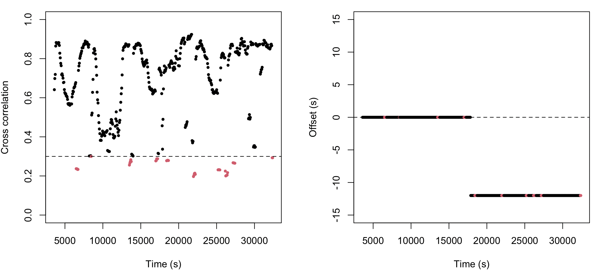

The cross correlations (left panel) look broadly similar (a little
more stable, as based on a larger window size - but also exhibiting the same
ultradian fluctuation that tracks with sleep stage in this recording).  However,
the implied pattern of offset across the night is markedly different - a clear _step function_
that corresponds to the 12 second gap that was introduced.   Although the slope `R2` is still much
higher than 0 (i.e. here there is a gap that happens midway through the recording, and so there
is a significant change), it very clearly doesn't reflect the type of continuous drift we might
expect from miscalibrated clocks. 


### All the above

What if we put all these things together - can [`INSERT`](../ref/manipulations.md#insert) still yield a
clear representation of offset dynamics over the night?

We follow a similar approach as above, first resampling to 200.1 Hz or
(as a sanity check) to 199.9 Hz, and saving as text files, i.e.:
```
luna r-flt.edf -s ' RESAMPLE sr=200.1 & MATRIX file=s201.1.txt min '
luna r-flt.edf -s ' RESAMPLE sr=199.9 & MATRIX file=s199.9.txt min '
```
We then insert a 12 second interval midway:
```
awk 'NR==3600000 {for(i=1;i<=2400;i++) print "0"} {print}' s201.1.txt > s201.1_gap.txt
awk 'NR==3600000 {for(i=1;i<=2400;i++) print "0"} {print}' s199.9.txt > s199.9_gap.txt
```
We then read these back as EDF, but _assuming_ the nominal 200 Hz sample rate; here, also changing the
header offset by 42 seconds (i.e. 21.59.19 instead of 22.00.01):
```
luna s201.1_gap.txt --fs=200 --time=21.59.19 --date=17.07.23 --chs=O1 -s WRITE edf=r-all-fast
luna s199.9_gap.txt --fs=200 --time=21.59.19 --date=17.07.23 --chs=O1 -s WRITE edf=r-all-slow
```
In summary we have:

 - the EDF header time is off by 42 seconds
 - one recording has a 12 second gap midway
 - one recording has an effective sample rate of 200.1 Hz (or 199.9 Hz) instead of 200 Hz exactly

How does [`INSERT`](../ref/manipulations.md#insert) do?  As before, the default run points to low
quality alignments, so we run all analyses a) using shorter windows,
and b) expanding the search-window of allowable offsets (to account
for possibly large differences resulting from these multiple sources
of offset):

```
  len=30 offset-range=-360,360 
```

For the 200.1 Hz example:
```
  header-derived offset: 42 seconds (negative = edf2 starts after edf1)
  method: xcorr, bandpass 0.5-15 Hz;  30s windows every 60s,  range 3603-32427s
  summary across 390 window(s):
    quality          accepted=390/481 (81.0811%)  peak median=0.70  mean=0.60  min=0.018  max=0.91
    waveform_shift   median=7.835s  mean=12.7193s  min=1.81s  max=27.66s  range=25.85s
    offset           48.0691s (start_shift=-6.06914s, header_offset=42s)
    drift            slope=0.00119159 s/s  (4.28971 s/hr)  intercept=-6.06914s  R2=0.881854
    implied SR of secondary: 200.239 Hz  (nominal: 200 Hz)
    (positive slope = secondary clock running faster than primary)
  per-pair drift:
    O1..O1:  slope=0.00119159 s/s (4.28971 s/hr)  intercept=-6.06914s  implied SR=200.239 Hz
```
The slope/SR estimate of course confounds the drift and gap together, but visualizing the offset dynamics makes this clearer:

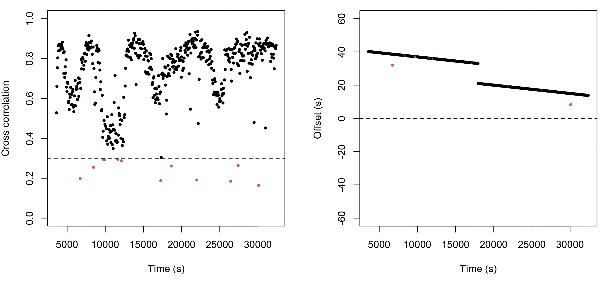

That is, this clearly picks up a) the initial header offset, b) the increased speed (i.e. the leads to the lag being reduced) and c) the gap
of 12 seconds midway.

And for the 199.9 Hz case:
```
  header-derived offset: 42 seconds (negative = edf2 starts after edf1)
  method: xcorr, bandpass 0.5-15 Hz;  30s windows every 60s,  range 3602.3-32420.7s
  summary across 471 window(s):
    quality          accepted=471/481 (97.921%)  peak median=0.78  mean=0.73  min=0.14  max=0.92
    waveform_shift   median=-3.04s  mean=-3.02235s  min=-8.98s  max=2.99s  range=11.97s
    offset           47.2273s (start_shift=-5.22733s, header_offset=42s)
    drift            slope=0.000122834 s/s  (0.442202 s/hr)  intercept=-5.22733s  R2=0.104502
    implied SR of secondary: 200.025 Hz  (nominal: 200 Hz)
    (positive slope = secondary clock running faster than primary)
  warning: alignment quality may be poor: R2=0.104502 < 0.5
  hint: try a smaller len window; also try a wider offset-range (e.g. offset-range=-360,360) or full-search
  per-pair drift:
    O1..O1:  slope=0.000122834 s/s (0.442202 s/hr)  intercept=-5.22733s  implied SR=200.025 Hz
```

Note the warning stating that the `R2` of the drift estimate is very
low - meaning we should not trust the implied SR of 200.025 Hz.
Again, looking at the plot makes it clear why this is - as the gap and
the drift effectively 'cancel out':

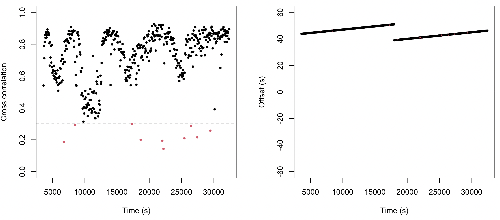


## Real data example

Now we've oriented ourselves to the [`INSERT`](../ref/manipulations.md#insert) command, we can return to the real world Nox/X-trodes example.

We'll run this with two pairs of channels: `F3` with `AF3` and `F4`
with `AF4`. This has the advantage of reporting alignment statistics
per channel pair, to give a sense of consistency.  As these are now
genuinely different signals - not just filtered versions of the same
signal - we might expect the results to be noisier.

```
luna nox.edf -o out.db -s ' INSERT edf=xtrodes.edf pairs=F3,AF3,F4,AF4 '
```
```
  header-derived offset: -1568 seconds (negative = edf2 starts after edf1)
  using header-derived offset-range: -1628 to -1508 seconds
  method: xcorr, bandpass 0.5-15 Hz;  300s windows every 60s,  range 3220-28980s
  summary across 370 window(s) (20 outlier(s) removed from slope fit):
    quality          accepted=370/430 (86.0465%)  peak median=0.45  mean=0.44  min=0.072  max=0.65
    waveform_shift   median=-1594.02s  mean=-1593.67s  min=-1602.95s  max=-1582.07s  range=20.89s
    offset           31.8992s (start_shift=-1599.9s, header_offset=-1568s)
    drift            slope=0.000412497 s/s  (1.48499 s/hr)  intercept=-1599.9s  R2=0.998052
    implied SR of secondary: 200.083 Hz  (nominal: 200 Hz)
    (positive slope = secondary clock running faster than primary)
  per-pair drift:
    F3..AF3:  slope=0.000412535 s/s (1.48513 s/hr)  intercept=-1599.87s  implied SR=200.083 Hz  [13 outlier(s) removed]
    F4..AF4:  slope=0.000395787 s/s (1.42483 s/hr)  intercept=-1599.51s  implied SR=200.079 Hz  [17 outlier(s) removed]
```

Most windows (86%) are accepted as high quality.  Here we see an
implied drift of around __200.08 Hz__, consistent across both channel
pairs -- and in fact identical to the estimate we made simply by
looking at the top apparent landmarks at the start of this vignette!
The `R2` for the drift slope is very high (0.998). In addition -- as
noted in the plots -- we see an average offset around 30 seconds,
suggesting that the EDF headers (which we knew were set at different
start times) were also not consistently aligned with each other (i.e.
at least one was not using the true clock time).  Plotting the
results:

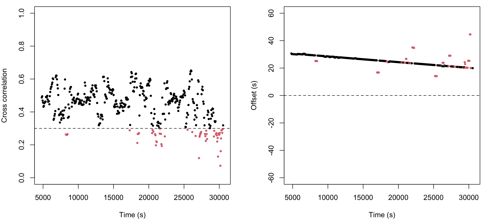

For this recording, the fit was:

- header-derived offset: `-1568` s
- median signal-based lag: `-1593.94` s
- extra lag beyond the header offset: about `30.6` s early in the night and `23.0` s near `04:26`
- fitted drift: `0.000417` s/s, or `1.501` s/hr
- implied X-trodes sample rate after correction: `200.083` Hz
- accepted windows: `370/430` with `R2=0.998052`

The point is not only that there is a start offset, but that the
residual offset changes across the night. Even after accounting for
the EDF start times, the two clocks keep sliding relative to each
other.

## Fixing the alignment

Once the offset and drift have been estimated, the actual corrected insert is straightforward:

```
luna nox.edf -s ' INSERT edf=xtrodes.edf pairs=F3,AF3,F4,AF4 insert & WRITE edf=aligned '
```

That is: we add the `insert` option and then [`WRITE`](../ref/outputs.md#write) out a new EDF,
which will have the new signals included.  

We can now look at `aligned.edf` in Lunascope, revisiting the two visually clear misalignments
shown above.  Both regions are now very closely aligned: 

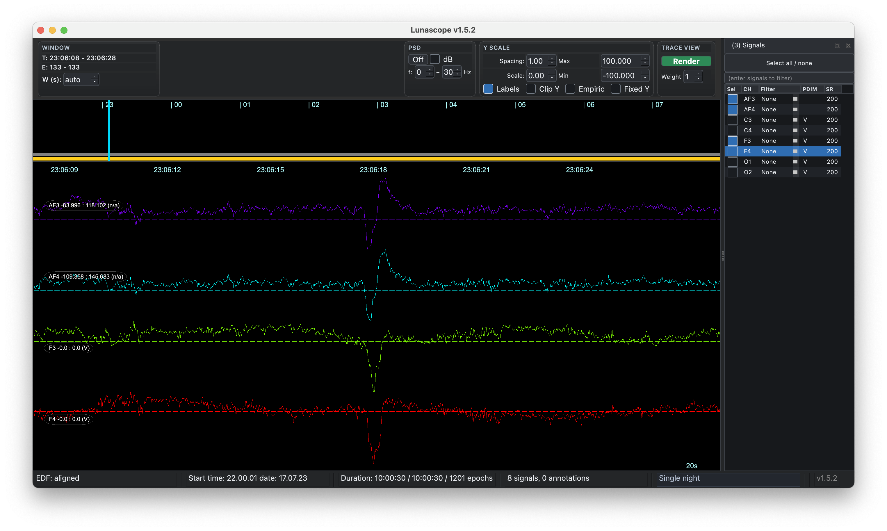

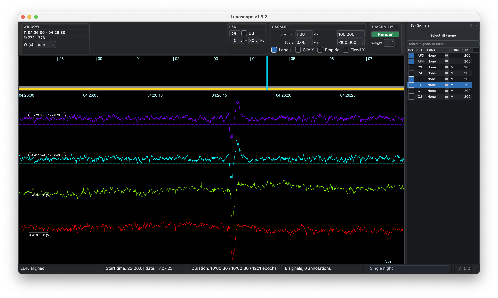

This is the real utility of [`INSERT`](../ref/manipulations.md#insert): not simply to merge EDFs, but to
make long, multi-sensor recordings meaningfully comparable on a common
timeline.

!!!note "Inserting new signals"
    It is also possible to specify the offset (and drift) explicitly rather than estimate them from
    data (i.e. this may be possible if other sources of time-marking exist).  In this case, we can do a direct merge (as used
    to make the EDF for the original plots at the top of this vignette):
    ```
    luna nox.edf -s ' INSERT edf=xtrodes.edf offset=-1568 & WRITE edf=merged '
    ```
    Note that although the sampling rates of signals used by `pairs` must be similar, in general, [`INSERT`](../ref/manipulations.md#insert) can insert
    signals of any sampling rate - i.e. in the original plots of `merged.edf`, the X-trodes signals had very high sampling rates
    (4000 Hz).  If one wanted to retain that in `aligned.edf`, then based on the empirical cross-correlation analyses one could duplicate
    those samples in the EDF, resampling one set to use for alignment.


Importantly, the "fix" presented here only corrects for a) an
offset/intercept and b) a linear slope.  It does this via cubic spline
interpolation when making the new signals, appropriately
time-stretching drifting signals.  In contrast, it cannot handle
gaps/jumps or other non-linear types of effect.  In those cases,
reviewing the discontinuities from the plots as above, splitting the
recordings, and doing piecewise correction would be the solution:
[`INSERT`](../ref/manipulations.md#insert) could be used in that scenario, but not in a single,
automated manner.

## Sensitivity analyses

Choice of alignment `pairs` matters. More similar sensors give cleaner
cross-correlation peaks and a more stable fit. In this example we
compared F3/F4 to the wearable frontal channels, with good results.
What if we instead used the two central channels, or even the two
occipital Nox channels (e.g.  if those were all we had).  (Note: you
can specify that one channel is paired with multiple others as needed,
e.g. if we only had Fz in the Nox recording, we could use
`pairs=Fz,AF3,Fz,AF4`.)

Re-running with `pairs=C3,AF3,C4,AF4` gives:
```
  header-derived offset: -1568 seconds (negative = edf2 starts after edf1)
  using header-derived offset-range: -1628 to -1508 seconds
  method: xcorr, bandpass 0.5-15 Hz;  300s windows every 60s,  range 3220-28980s
  summary across 236 window(s) (17 outlier(s) removed from slope fit):
    quality          accepted=236/430 (54.8837%)  peak median=0.31  mean=0.30  min=0.068  max=0.65
    waveform_shift   median=-1594.47s  mean=-1594.14s  min=-1618.38s  max=-1582.12s  range=36.27s
    offset           31.7927s (start_shift=-1599.79s, header_offset=-1568s)
    drift            slope=0.000394674 s/s  (1.42083 s/hr)  intercept=-1599.79s  R2=0.868484
    implied SR of secondary: 200.079 Hz  (nominal: 200 Hz)
    (positive slope = secondary clock running faster than primary)
  warning: alignment quality may be poor: median peak=0.311815 < 0.35
  hint: try a smaller len window; also try a wider offset-range (e.g. offset-range=-360,360) or full-search
  per-pair drift:
    C3..AF3:  slope=0.000416638 s/s (1.4999 s/hr)  intercept=-1599.92s  implied SR=200.083 Hz  [20 outlier(s) removed]
    C4..AF4:  slope=0.000476251 s/s (1.71451 s/hr)  intercept=-1600.06s  implied SR=200.095 Hz  [14 outlier(s) removed]
```

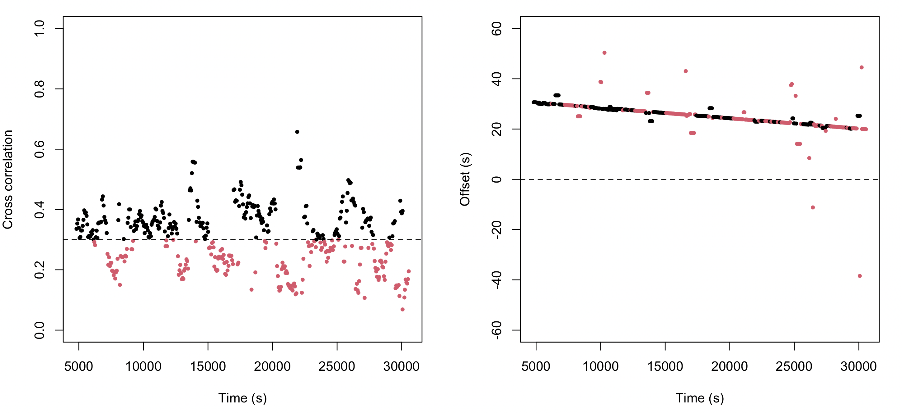

Only 50% of windows are deemed to be good here, which is worse than the frontal case.  We'll skip it here, but you can
alter the parameters in search of a better fit: the `auto-try` command and its variants can be helpful by scanning across
different parameter values. Here we see that shorter windows (but longer than 30s) may be helpful:

```
    start=3220s len=30s inc=6s  accepted=732/4294  P_OK=0.17047  peak=0.210921  R2=0.0762092  score=0.00274016
    start=3220s len=75s inc=15s  accepted=1069/1718  P_OK=0.622235  peak=0.334893  R2=0.996392  score=0.20763
    start=3220s len=150s inc=30s  accepted=526/859  P_OK=0.61234  peak=0.329588  R2=0.993572  score=0.200523
    start=3220s len=300s inc=60s  accepted=236/430  P_OK=0.548837  peak=0.311815  R2=0.868484  score=0.148629
```

For the occipital channels, as expected, the ability to align studies diminishes - but not completely:

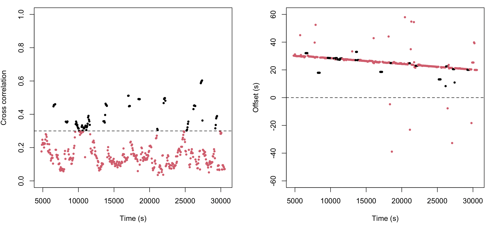


Overall, the ranking is exactly what you expected: frontal performed best, central was usable but clearly weaker, and occipital was poor.

- Frontal (F3/F4 vs AF3/AF4) was the strongest run: high acceptance
  (370/430, 86%), the best median peak (0.457), and an excellent drift
  fit (R2=0.998).  The implied SR was also very consistent at about
  200.083 Hz, and the two pairwise slopes matched closely.

- Central (C3/C4 vs AF3/AF4) degraded substantially: acceptance
  dropped to 55%, median peak fell to 0.312, and R2 dropped to 0.868,
  enough to trigger the low-peak warning. The overall offset/drift
  estimate stayed in the same ballpark, but the fit was clearly less
  stable and the pairwise SR estimates spread more.

- Occipital (O1/O2 vs AF3/AF4) was weak enough to be unreliable:
  only 19% of windows were accepted, median peak was just 0.154, and
  R2 fell to 0.437, with warnings on all three quality criteria. The
  offset estimate still landed near the same value, but that looks
  more like the constrained search plus the shared long-timescale
  trend than a trustworthy channel match.

Even for the occipital case, visual review of the offset over time
was strongly suggestive of the same drift that we saw for the other
channels - this alone is sufficient to suggest that we are still
picking up information relevant to assessing drift from this comparison.
This is in large part because the most informative features may be movement
artifacts and so on that are shared between channels.  Ironically, this
means that noisier data may be easier to fix, if there are timing issues.
The extent to which other types of signals (e.g. ECG, EMG) can be used
is an open question - but one that can be approached empirically, using
the type of simulations as above. 

## Parameter tuning

For modest offsets and drift, the defaults are often fine. If the
signals differ a lot, or the clocks are substantially off, it helps to
try a range of settings:

- `pairs=`: the most important choice. Use the most similar channels you can.
- `offset-margin=`: when EDF header times are roughly right, search around that implied offset.
- `offset-range=`: use this when the header is unreliable and you need a wider absolute search window.
- `len=`: shorter windows can tolerate larger local drift; longer windows can sharpen the xcorr peak when the mismatch is small.
- `start=`: skipping the start of the file can avoid unstable initial segments.
- `inc=`: smaller increments give more windows and a denser fit, at the cost of more computation.
- `auto-try`: useful when you expect that one fixed `start/len/inc` choice may not be optimal.

In general, if the offset is large, begin by broadening `offset-range`
or `offset-margin`; if the xcorr peaks are smeared by drift, shorten
`len`; if the fit is unstable, try more similar channels, move `start`
away from noisy leading segments, or let `auto-try` search a local
grid.

## Conclusion

[`INSERT`](../ref/manipulations.md#insert) is most useful when two recordings are clearly related but do not share a trustworthy timeline. In the examples above, it distinguishes simple header offsets from continuous drift and from discrete gaps, and it shows when a single linear correction is likely to be valid. In practice, the workflow is straightforward: choose the most comparable channel pairs, inspect the quality metrics and offset-by-time plots, and then apply the empirical correction only when the fit is coherent.

The key limitation is also clear from these examples: [`INSERT`](../ref/manipulations.md#insert) can correct a start offset and linear drift, but it does not by itself resolve non-linear timing problems such as gaps or jumps. When those are present, the diagnostic plots are still informative, but correction needs to be done in pieces rather than through one automatic alignment step.
