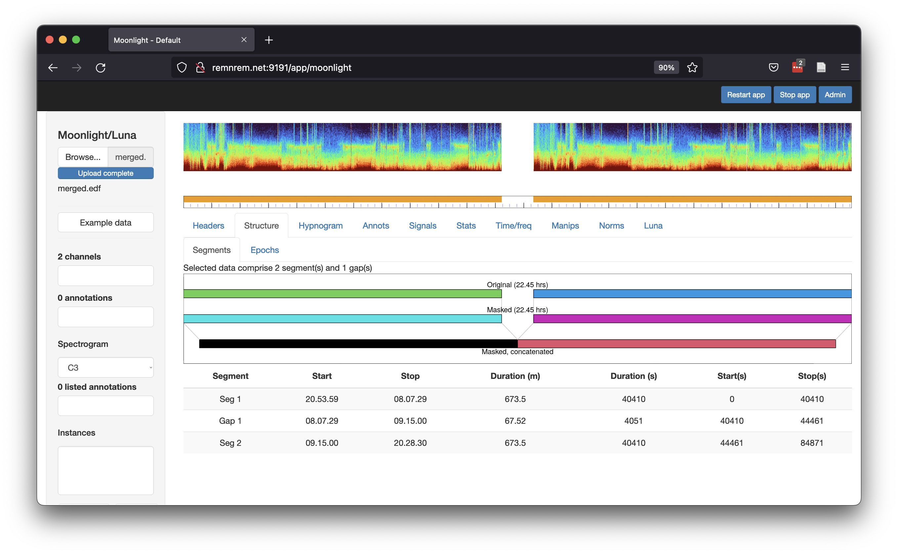
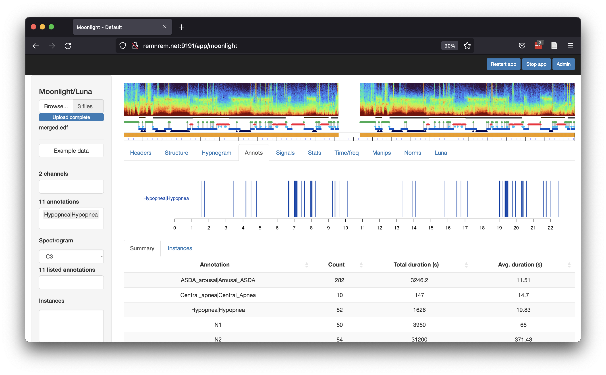
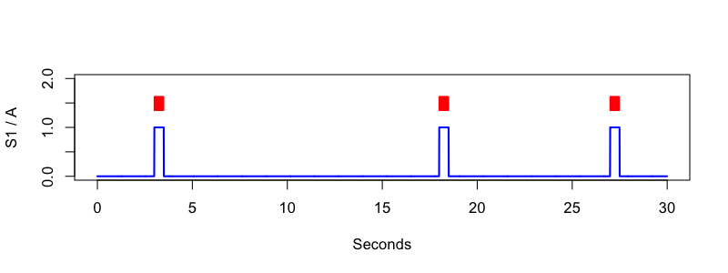
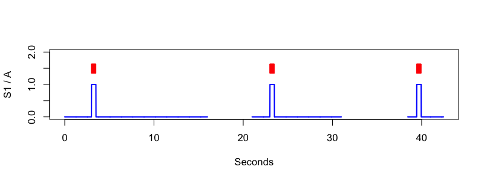
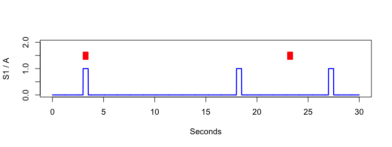
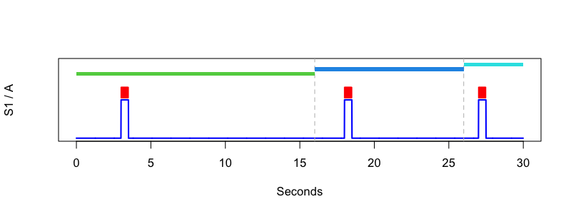

# Merging and converting EDFs

In this vignette, we illustrate how to use Luna to merge multiple EDFs
into a single EDF including any associated annotations, using the [`--merge`](../ref/helpers.md#-merge) command.
This procedure allows for gaps between component EDFs, in which case a
_discontinuous_ EDF+D file will be emitted.  The second part of this vignette shows
how to convert an EDF+D (whether from `--merge` or any other source) to a standard EDF,
once again appropriately handling any associated annotations.


## Merging multiple EDFs

Luna's [`--merge`](../ref/helpers.md#-merge) command can concatenate two or more EDFs, under
certain conditions:

 - all concatenated EDFs must have similar EDF headers: i.e. the same number and order of channels and sample rates
 - the physical/digital min/max values can be different - these will be rescaled in the final merged EDF
 - EDFs can have gaps between them, but they are not allowed to overlap in time 
 - currently, only standard EDFs (not EDF+) files can be concatenated

The basic use of this command, here to join three EDFs, is as follows:

```
luna --merge file1.edf file2.edf file3.edf
```

which will generate a new EDF called (by default) `merged.edf`.  To explicitly specify an EDF filename (and Patient ID too),
add `edf` and ``id` arguments:  to save as `f001.edf`, use the following:
```
luna --merge edf=f001.edf id=id001 file1.edf file2.edf file3.edf
```

The merge command can run in two modes: one in which EDF start times
are effectively ignored: all EDFs are directly concatenated in the
order as given on the command line (the resulting merged EDF will have
a start time/date based on the earliest EDF.  This mode (which is
enabled by adding the argument `fixed=T` to the options of `--merge`)
will always generate a standard EDF file (i.e. no gaps) but will
potentially lose information about the timing between EDFs.

In contrast, the default mode for `--merge` is to examine the start
dates/times of all EDFs, to check that they do not overlap, and then
assemble them into a single EDF.  If gaps are implied between EDFs,
the resulting merged EDF will be an EDF+D (i.e to represent the
discontinuities between input EDFs). Otherwise, a standard EDF will be
emitted as above.

### Example

To generate a trivial example for merging two EDFs, for convenience we'll take a single (whole-night) EDF and simply try concatenating
it to itself, i.e. to generate a file that is two nights' worth of data stacked into one.  Consider a starting EDF called `f.edf`, which contains only two EEG channels in this contrived example:

```
luna f.edf -s DESC
```
```
EDF filename      : f.edf
ID                : f
Clock time        : 20.53.59 - 08.07.29
Duration          : 11:13:30  40410 sec
Signals           : C3[128] C4[128]
```

If we initially attempt to merge it with itself as is, Luna will correctly complain:

``` 
luna --merge f.edf f.edf
```

```
  attached 2 EDFs
  writing merged data:
     ID           : merged1
     EDF filename : merged.edf
 ------------------------------------------------------------
 extracting start times from EDFs --> seconds since 1/1/85 00:00
  EDF 0  date: 01.01.85 time: 20.53.59 days: 0 --> secs:75239
  EDF 1  date: 01.01.85 time: 20.53.59 days: 0 --> secs:75239
error : EDFs with identical start times specified: 01.01.85 20.53.59
```

As noted above, we can use the `fixed=T` option to ignore start times
of EDFs – in which case Luna will join the EDFs in the order specified
after the `-—merge` (although, in this contrived example, these are
identical of course):

``` 
luna --merge fixed=T f.edf f.edf
```
```
  attached 2 EDFs
  writing merged data:
     ID           : merged1
     EDF filename : merged.edf
  good, all EDFs have merge-compatible headers
  expecting 80820 records (each of 1 sec) in the new EDF
  adding timeline
  adding 80820 empty records...
  compiling channel C3
  compiling channel C4
  writing merged EDF as merged.edf
  data are not truly discontinuous
  writing as a standard EDF
  writing 2 channels
  saved new EDF, merged.edf
```

### Aligned EDFs

For a more realistic example, we'll create two EDFs (both from
`f.edf`) with different start dates and times, but that are aligned in
the sense that the second follows directly after the first ends.  As
noted above, the original EDF had a start time of `20.53.59` and was
40,410 seconds in duration. We will generate one EDF with the same
start time, but we'll also explicitly set a non-null start date too,
using `SET-HEADERS` followed by `WRITE` to make a new EDF:

```
luna f.edf -s 'SET-HEADERS start-date=22.02.22 start-time=20.53.59 & WRITE edf=pt1'
```
which generates a file `pt1.edf`:
```
luna pt1.edf -s DESC
```
```
Clock time        : 20.53.59 - 08.07.29
Duration          : 11:13:30  40410 sec
```

Next, we'll generate a second EDF that starts _exactly_ after the first one ends, i.e. `08.07.29`.

(Note that the end time given by `DESC` is one time point past the end
of the interval, consistent with how Luna expects intervals for
annotations, i.e. meaning _up until but not including_ that time. That
is, the last record starts at `08.07.29` and is 1 second long.)

```
luna f.edf -s 'SET-HEADERS start-date=23.02.22 start-time=08.07.29 & WRITE edf=pt2'
```
Note that this starts one day after the first one (the 23rd of February rather than
the 22nd), i.e. the morning after the initial study.  If we now merge these two files
(that now have distinct start times):
```
luna --merge pt1.edf pt2.edf
```
``` 
  attached 2 EDFs
  writing merged data:
     ID           : merged1
     EDF filename : merged.edf
 ------------------------------------------------------------
 extracting start times from EDFs --> seconds since 1/1/85 00:00
  EDF 0  date: 22.02.22 time: 20.53.59 days: 13566 --> secs:1172177639
  EDF 1  date: 23.02.22 time: 08.07.29 days: 13567 --> secs:1172218049
------------------------------------------------------------
  ordered EDFs (seconds past 1/1/1985 00:00:00)
  ordered EDFs : prev start = 1172177639 ; this start = 1172218049
    implied duration of previous based on # records         = 40410
    implied duration of previous based on current EDF start = 40410
   implies exactly contiguous EDFs

 no gaps found between EDFs - will generate an EDF (or EDF+C)
  good, all EDFs have merge-compatible headers
  expecting 80820 records (each of 1 sec) in the new EDF
  adding timeline
  adding 80820 empty records...
  compiling channel C3
  compiling channel C4
  writing merged EDF as merged.edf
  data are not truly discontinuous
  writing as a standard EDF
  writing 2 channels
  saved new EDF, merged.edf
```

That is, Luna can see that the resulting concatenated EDF is not
_actually_ discontinuous (as the stop of `pt1.edf` and the start of
`pt2.edf` are exactly aligned) and so saves it as a standard EDF. The
duration is now 80,820 seconds, i.e. twice 40,410 seconds,
the duration of each original EDF.

```
luna merged.edf -s DESC
```
```
EDF filename      : merged.edf
ID                : merged
Clock time        : 20.53.59 - 19.20.59
Duration          : 22:27:00  80820 sec
# signals         : 2
Signals           : C3[128] C4[128]
```


### Overlapping EDFs

Here we specify some overlap between the two EDFs and _attempt_ to merge:  we'll set the
start time of `pt2.edf` to be 6am, i.e. about two hours before `pt1.edf` actually ends:

``` 
luna f.edf -s 'SET-HEADERS start-date=23.02.22 start-time=06.00.00 & WRITE edf=pt2'
```

If we now try to merge:
```
luna --merge pt1.edf pt2.edf
```
```
  attached 2 EDFs
  writing merged data:
     ID           : merged1
     EDF filename : merged.edf
 ------------------------------------------------------------
 extracting start times from EDFs --> seconds since 1/1/85 00:00
  EDF 0  date: 22.02.22 time: 20.53.59 days: 13566 --> secs:1172177639
  EDF 1  date: 23.02.22 time: 06.00.00 days: 13567 --> secs:1172210400
------------------------------------------------------------
  ordered EDFs (seconds past 1/1/1985 00:00:00)
  ordered EDFs : prev start = 1172177639 ; this start = 1172210400
    implied duration of previous based on # records         = 32761
    implied duration of previous based on current EDF start = 40410
  *** warning -- overlapping EDFs implied

error : found overlapping EDFs -- bailing, cannot merge
```

That is, Luna correctly points to the issue and refuses to do anything further (after giving some
output that shows the implied overlap).

!!! info
    Internally, Luna uses seconds past midnight at 1/1/1985 to
    compare EDF start date/time combinations, i.e. this is what
    `secs:1172177639` above refers to.
    

### Gapped EDFs 

Third, we will introduce a gap between recordings, as might typically occur if a
recording is paused for some reason.  Here, we will set the second EDF
to start an hour or so after the first one ends (`09:15:00` instead of
`08:07:29`):

``` 
luna f.edf -s 'SET-HEADERS start-date=23.02.22 start-time=09.15.00 & WRITE edf=pt2'
```

Now the merge will generate an EDF+D with a gap:

```
luna --merge pt1.edf pt2.edf
```
```
  attached 2 EDFs
  writing merged data:
     ID           : merged1
     EDF filename : merged.edf
 ------------------------------------------------------------
 extracting start times from EDFs --> seconds since 1/1/85 00:00
  EDF 0  date: 22.02.22 time: 20.53.59 days: 13566 --> secs:1172177639
  EDF 1  date: 23.02.22 time: 09.15.00 days: 13567 --> secs:1172222100
------------------------------------------------------------
  ordered EDFs (seconds past 1/1/1985 00:00:00)
  ordered EDFs : prev start = 1172177639 ; this start = 1172222100
    implied duration of previous based on # records         = 44461
    implied duration of previous based on current EDF start = 40410
  implies gap between previous and current - will output an EDF+D

 found gaps between EDFs - will generate an EDF+D
  good, all EDFs have merge-compatible headers
  expecting 80820 records (each of 1 sec) in the new EDF
  adding timeline
  adding 80820 empty records...
  compiling channel C3
  compiling channel C4
  set EDF+D timeline for 80820 records
  writing merged EDF as merged.edf
  data are truly discontinuous
  writing 3 channels
  saved new EDF+D, merged.edf
```

That is, the emitted EDF+D file contains an `EDF Annotations` channel that specifies the start time of each EDF record
relative to the header start time.   Now when we look at the `DESC`, Luna will give some extra information describing the
EDF+D features:
```
luna merged.edf -s DESC
```
```
EDF filename      : merged.edf
ID                : merged
Header start time : 20.53.59
Last observed time: 20.28.30
Duration          : 22:27:00  80820 sec
Duration (w/ gaps): 23.34.31  84871 sec
# signals         : 2
# EDF annotations : 1
Signals           : C3[128] C4[128]
```

That is, although the duration of observed records is still 80,820
seconds, the total time spanned (i.e. including gaps) is longer
(84,871 seconds).  We can also look at the structure of a discontinuous EDF+D more
explicitly with the [`SEGMENTS`](../ref/outputs/#segments)
command:
 
```
luna merged.edf -o out.db -s SEGMENTS
```
That is, there are two segments and one gap:
```
destrat out.db +SEGMENTS
```
```
ID       NGAPS   NSEGS
merged   1       2
```
The segments have the following properties (i.e. both 40,410 seconds long):
```
destrat out.db +SEGMENTS -r SEG
```
```
ID      SEG  DUR_HR  DUR_MIN DUR_SEC  START   START_HMS   STOP   STOP_HMS
merged  1    11.225  673.5   40410    0       20.53.59    40410  08.07.29
merged  2    11.225  673.5   40410    44461   09.15.00    84871  20.28.30
```
The gap is, as expected, identified as between `08.07.29` and `09.15.00`:
```
destrat out.db +SEGMENTS -r GAP
```
```
ID      GAP  DUR_HR  DUR_MIN DUR_SEC  START   START_HMS   STOP   STOP_HMS
merged  1    1.12527 67.5167 4051     40410   08.07.29    44461  09.15.00
```

Alternatively, we can use the [_Moonlight_](../moonlight.md) viewer (public test version
available at [http://remnrem.net](http://remnrem.net)) to view the structure of an
EDF+D. After uploading `merged.edf` to this tool, the
_Strucutre/Segments_ tab shows:



Note how the spectrogram is broken in the middle, indicating the gap
between the two segments; also note how the first and second segments
have identical spectrograms, as expected in this contrived example.


### Merging annotations

The `--merge` command only concatenates EDF signal data.  Typically,
we'll have associated annotation files (e.g. manual sleep staging)
that also require combining.  Particularly if using Luna [`.annot`](../ref/annotations.md#-annot) format,
this is a trivial process, although some practical considerations still apply, as described here.

Although `.annot` files can be simply combined (e.g. via the command
line `cat` utility), if annotations files specify event times relative to
an EDF start (i.e. in elapsed seconds), these will need to be
adjusted prior to merging.  Indeed, in our example we also have an XML
annotation file (`f.xml`) that contains sleep stage
annotations, with the intervals _encoded as elapsed seconds from the
start_ of `f.edf` (i.e. seconds after `20.53.59`).

Following from the above example, we can copy `f.xml` to produce two sets of annotations:

```
cp f.xml pt1.xml
cp f.xml pt2.xml
```

The most direct way to handle merging annotations is to use absolute
clock-time rather than elapsed time in each annotation file. (An
alternative not considered here is to manually add in the second
offsets, which is why `--merge` actually generates these offsets for
each file and outputs them.)  We can generate clock-based
annotations using Luna's `WRITE-ANONTS` command, to generate (in this
case) two `.annot` files that have _hh:mm:ss_ times.  For the first
one:

```
luna pt1.edf annot-file=pt1.xml -s WRITE-ANNOTS file=pt1.annot minimal hms
```

For example, the first N1 epoch now in `pt1.annot` reads as
follows: 

```
N1      .       .       21:40:59        21:41:59        .
```

starting at `21:40:59` and lasting one minute (two epochs) until
`21:41:59`. In contrast, if exported without the `hms` flag, the same
line would have read (which mirrors how the event is stored in the original
EDF):

```
N1      .       .       2820.000        2880.000        .
```

i.e. 2820 seconds (2820/60=47 minutes) after `20.53.59` is `21:40:59`.

From v0.28, Luna also supports explicit date-time strings in
annotation files, which can be helpful to reduce ambiguity in longer
recordings that use clock-time (including multi-day/night recordings).
If we add `dhms` instead of `hms`, then `WRITE-ANNOTS` would instead
output this for this particular line:

```
N1      .       .       22-2-2022-21:40:59      22-2-2022-21:41:59      .
```

i.e. in the form `dd-mm-yyyy-hh:mm:ss`.  For this particular example -
as the merged EDF is almost 24 hours long - we will use this explicit
date-time representation, which should always be safer.  (Note: in the
context of _anonymized_ EDFs with dates set to `1/1/85` as per the EDF spec, for
multi-day recordings, we suggest to start with `2/1/85` instead, which as a _non-null_ date value
will allow dates to be specified in annotation files, and will roll forwards as expected, `3/1/85`, etc.)

Running the same process for the second EDF:
```
luna pt2.edf annot-file=pt2.xml -s WRITE-ANNOTS file=pt2.annot minimal dhms
```
we obtain `pt2.annot` which has the following for the corresponding line:

```
N1      .       .       23-2-2022-10:02:00      23-2-2022-10:03:00      .
```

as `10:02:00` is 47 minutes after the `09:15` start time of `pt2`.  That is,
although `pt1.xml` and `pt2.xml` were identical files, the newly
encoded `.annot` files explicitly reflect dates and times from the two EDFs,
and so can now be merged without loss of information or introducing ambiguity.

Note that we also specified the `minimal` option for `WRITE-ANNOTS` - this skips the header rows, which
makes it easier to combine the `.annot` files with a single `cat` command:
```
cat pt1.annot pt2.annot > merged.annot
```

Note that we do not even have to combine the annotation files, i.e. we can specify them individuals (on the command line, or in a sample list):
```
luna merged.edf annot-file=pt1.annot,pt2.annot ...
```

If we upload both `merged.edf` and `merged.annot` to [_Moonlight_](../moonlight.md), we can now see the annotations are appropriately aligned
with the signal data (i.e. see the extended hypnogram is now added beneath the spectrogram):



Again - in this contrived example we  have the unusual situation of duplicated, identical whole-night recordings.
Typically, `--merge` would expect single-night recordings but where the EDFs are fragmented across two or more files, e.g.
due to pauses in the recording, or idiosyncrasies of the EDF export process, etc.   Still, the principles are the same from
`--merge`'s perspective.


## EDF+D to EDF conversion

In the second part of this vignette, we consider how to work with
EDF+D files - that is, in the context of sleep recordings, this
typically means recordings that contain _gaps_.

Note that [this older vignette](annots.md) also contains information
on working with EDF+D files.  The primary focus of this section is how
to convert an EDF+D to a standard (continuous) EDF file.  In many
cases, standard EDFs can be easier to work with.  Indeed, some tools
might not accept EDF+(D) files at all.  Below we a) use Luna to
artificially generate a toy EDF+D dataset, and then b) use Luna to
convert it back to a standard EDF, i.e. splicing out the gaps.
Although the principal conversion is straightforward, the primary
issue covered here is how to keep annotations aligned with transformed
files.

### Simulating data

Here we use the simple `SIGGEN` command to simulate a 30-second dataset with
three simple _pulses_, each lasting 50 samples (0.5 seconds, given a sample rate of 100 Hz):

```
luna . --nr=30 --rs=1 \
  -s ' SIGGEN sig=S1 sr=100 impulse=0.1,1,50,0.6,1,50,0.9,1,50
     & S2A sig=S1 encoding=A,1
     & WRITE edf=standard
     & WRITE-ANNOTS file=standard.annot '
```

That is, the `.` indicates an [empty EDF](../luna/args.md#empty-edfs)
of 30 records, each 1 second long; we then generate a signal called
`S1` with 100 Hz sample rate, and pulses (values of 1 versus 0)
starting at 10%, 60% and 90% of the recording (i.e.  3 seconds, 18
seconds and 27 seconds from the EDF start).

We next add an annotation that corresponds to these pulses using the
[`S2A`](../ref/annotations.md#s2a) command, called `A`.  Finally, we
write the signal data to a standard EDF file (called `standard.edf`)
and the annotation to a file called `standard.annot`.  The upshot of
this is visually depicted here, i.e. plotting data in the file `f.0`
generated by the `MATRIX` command:

```
luna standard.edf annot-file=standard.annot -s 'MATRIX sig=S1 annot=A file=f.0 '
```



### Making an EDF+D

So far, we have generated a standard EDF (30 seconds in duration) and
a simple annotation file, with three events corresponding to the
pulses in the signal `S1`.  The next step is to make this an EDF+D
with gaps (i.e. so that we can show the process of converting it back
again to standard EDF).  For this, we can use Luna's helper command [`SET-TIMESTAMPS`]()
to explicitly assign the offset of each EDF record, taking data from a file.  Implicitly,
the standard EDF has records that start at 0, 1, 2, ... seconds past the EDF start.  We
will generate a similar explicit file, but with two gaps insert (an extra 5 seconds between the 16th
and 17th records using base-0 counting, and an extra 7.4525 seconds between the 26th and 27th records).  Although we use `awk` here,
one could simply type out the numbers generated below instead:

```
echo | awk ' BEGIN { s = 0 }
                   { for (i=0; i<30; i++)
                     { print s ; s += 1 ;
                       if ( i == 15 ) s += 5 ;
                       if ( i == 25 ) s += 7.4525 } }  ' > ts.txt
```

The contents of `ts.txt` then has 30 rows, which specify the new EDF start times for the records in `standard.edf`:
```
0
1
2
3
4
5
6
7
8
9
10
11
12
13
14
15
21
22
23
24
25
26
27
28
29
30
38.4525
39.4525
40.4525
41.4525
```

Here we apply those new times and write a new EDF
```
luna standard.edf -s ' SET-TIMESTAMPS file=ts.txt & WRITE edf=plus ' 	   
```
From `SET-TIMESTAMPS` we see the following:
```
  read 30 timestamps
  set EDF+D timeline for 30 records
  updated EDF+D time-track
```
and from `WRITE`:
```
  data are truly discontinuous
  writing 2 channels
  saved new EDF+D, plus.edf
```
That is, Luna has detected gaps in the EDF and so writes an EDF+D. We can check the new file `plus.edf`
is as expected:

```
luna plus.edf -s ' DESC & RECS '
```

```
EDF filename      : plus.edf
ID                : plus
Header start time : 00.00.00
Last observed time: 00.00.42
Duration          : 00:00:30  30 sec
Duration (w/ gaps): 00.00.42  42.4525 sec
# signals         : 1
# EDF annotations : 1
Signals           : S1[100]
```

That is, we have 30 seconds of data (30 1 second records) and an extra 5+7.4525 = 12.4525 seconds of gaps,
leading to the total duration of 42.4525 seconds.

The `RECS` command dumps the EDF record structure/times to the console
- we see a pattern of times that mirrors those specified in `ts.txt`
(some columns omitted here for clarity, and the two empty rows inserted manually, to show
the gaps):


```
Record  Time
1       0.0000->1.0000
2       1.0000->2.0000
3       2.0000->3.0000
4       3.0000->4.0000
5       4.0000->5.0000
6       5.0000->6.0000
7       6.0000->7.0000
8       7.0000->8.0000
9       8.0000->9.0000
10      9.0000->10.0000
11      10.0000->11.0000
12      11.0000->12.0000
13      12.0000->13.0000
14      13.0000->14.0000
15      14.0000->15.0000
16      15.0000->16.0000 

17      21.0000->22.0000 
18      22.0000->23.0000
19      23.0000->24.0000
20      24.0000->25.0000
21      25.0000->26.0000
22      26.0000->27.0000
23      27.0000->28.0000
24      28.0000->29.0000
25      29.0000->30.0000
26      30.0000->31.0000

27      38.4525->39.4525
28      39.4525->40.4525
29      40.4525->41.4525
30      41.4525->42.4525
```


!!! note
    Note, instead of using `SET-TIMESTAMPS` we could have simply
    generated an EDF+D file using a _mask_ and _restructuring_ an
    in-memory dataset, as after any restucturing Luna's in-memory EDF
    is effectively an EDF+D, i.e. in that it explicitly represents
    gaps by tracking the start time of each EDF record explicitly.
    For example (noting that we need to set a smaller epoch size here,
    given the total recording length for this toy dataset is only 30
    seconds:
    
    ```
    luna standard.edf -s ' EPOCH dur=1 & MASK epoch=1-10,15-30 & RE & WRITE edf=plus '
    ```
    Here we used the former approach to allow us to insert a gap that was not an even multiple of the 1-second EDF record size
    (i.e. 7.4525 seconds as above) to show the generality of the approach below, as gaps will typically not correspond exactly to EDF
    record size specifications.


Finally, we can also alter the annotations originally created, 

```
cat standard.annot
```
```
class  instance  channel   start     stop      meta
A      .         S1        3.000     3.500     .
A      .         S1        18.000    18.500    .
A      .         S1        27.000    27.500    .
```

Here we add in gaps between the _pulse_ events that mirror the gaps inserted above in the signal. 

```
awk ' NR < 3  { print $0 }
      NR == 3 { print $1,$2,$3,$4+5,$5+5,$6 }
      NR == 4 { print $1,$2,$3,$4+12.4525,$5+12.4525,$6 } ' OFS="\t" standard.annot > plus.annot
```      

```
cat plus.annot
```
```
class  instance   channel   start    stop     meta
A      .          S1        3.000    3.500    .
A      .          S1        23       23.5     .
A      .          S1        39.4525  39.9525  .
```

__The details of the above are not important:__ the bottom line of all this is that we now have an EDF+D with gaps, and
some annotations that are temporally aligned with the signal data, as shown here:




### Conversion back to EDF

Now, force the EDF+D to a standard EDF

```
luna plus.edf -s 'WRITE edf=standard2 force-edf '
```

```
EDF filename      : standard2.edf
ID                : standard2
Clock time        : 00.00.00 - 00.00.29
Duration          : 00:00:30  30 sec
# signals         : 1
Signals           : S1[100]
```


```
luna standard.edf annot-file=plus.annot -s 'EPOCH dur=1 & MATRIX sig=S1 annot=A file=f.2 '
```




To get the annotations to align, we must add the `collapse` flag to `WRITE-ANNOTS` 

```
luna plus.edf annot-file=plus.annot -s 'WRITE-ANNOTS collapse file=standard2.annot '
```

```
cat standard2.annot
```
```
class  instance   channel   start    stop     meta
A      .          S1        3.000    3.500    .
A      .          S1        18.000   18.500   .
A      .          S1        27.000   27.500   .
```


```
luna standard2.edf annot-file=standard2.annot -s 'MATRIX sig=S1 annot=A file=f.3 '
```


Finally, it is also possible to use the `SEGMENTS` command with an EDF+D (whether a true EDF+D file, or
an in-memory EDF+D, i.e constructed after setting masks and calling `RESTRUCTURE`) to generate new annotations
that reflect the segments (and gaps) in an EDF+D file:

```
luna plus.edf -o out.db -s ' EPOCH dur=1 & SEGMENTS annot & ANNOTS ' 
```

!!! hint
    As above, some commands implicitly use epochs to iterate over data, including the `ANNOTS` command.  Because we are working with
    an artificially short recording, that does not have any individual segments greater than 30 seconds in length, it is necessary
    to set a shorter epoch length (here 1 second) so that those commands produce any output


```
destrat out.db +ANNOTS -r ANNOT INST T -v START STOP 
```
```
ID     ANNOT     INST   T                        START    STOP
plus   segment   1      0_16000000000            0        16
plus   gap       1      16000000000_21000000001  16       21.000000001
plus   segment   2      21000000000_31000000000  21       31
plus   gap       2      31000000000_38452500001  31       38.452500001
plus   segment   3      38452500000_42452500000  38.4525  42.4525
```

Note that `gap` annotations are actually expanded - one _time-point_ past the end
of the gap (1e-09 seconds).  This is done purposefully, so that we used with
`WRITE-ANNOTS collapse`, the `gap` annotations are not entirely spliced out,
but rather form single annotations at the end and start of the respective flanking segments,
as above.  Also note that the _instance ID_ (`INST`) is set to the
number of the segment/gap.

### Bottom line

Wrapping this all together, starting from an EDF+D with annotations, in order to produce a) a
standard EDF containing only contiguous EDF records, b) a shifted set of annotations, that are aligned
with the spliced-out EDF signals, and c) a set of new annotations for the new standard EDF that show where
there were discontinuities in the original EDF+D, we can do the following, single command:

```
luna plus.edf annot-file=plus.annot -s 'SEGMENTS annot & WRITE-ANNOTS collapse file=new.annot & WRITE force-edf edf=new'
```

```
cat new.annot 
```
```
class     instance   channel    start      stop       meta
segment   1          .          0.000      16.000     .
A         .          S1         3.000      3.500      .
gap       1          .          16.000     16.000     .
segment   2          .          16.000     26.000     .
A         .          S1         18.000     18.500     .
gap       2          .          26.000     26.000     .
segment   3          .          26.000     30.000     .
A         .          S1         27.000     27.500     .
```

We can now visualize the new dataset. This is optional, but we can make a new sample
list to group the EDF and annotation files, instead of using `annot-file` each time:

```
luna --build . | grep new.edf > s.lst
```



For reference, here was the R code to generate this figure:

```
lattach( lsl( "s.lst" ) , 1 )
d <- ldata( 1 , "S1" , "A" )
png( file = "edfplus-f4.png" , width=800 , height=300 , units="px" , res=100)
plot( d$SEC , d$S1  , type="l" , ylim=c(0,2) , lwd=2 , col="blue" , xlab = "Seconds" , ylab = "S1 / A" , yaxt='n' ) 
points( d$SEC[ d$A == 1 ]  , d$A[ d$A == 1 ]+0.2  , type="p" , pch="|" , col = "red" )
abline( v = unique( unlist( lannots( "gap" ))) , lty=2, col="gray" )
segs <- lannots( "segment" )
for (s in 1:length(segs) ) {
 seg <- segs[[s]]
 rect( seg[1] , 1.5 + s/8 , seg[2] , 1.6+s/8 , col=s+2 ,border=NA)
}
dev.off()
```


