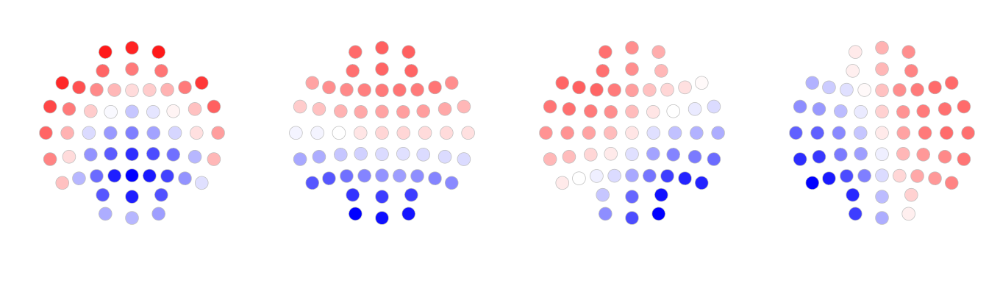
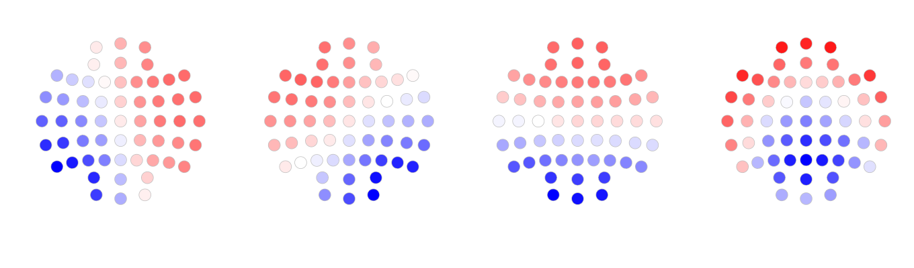
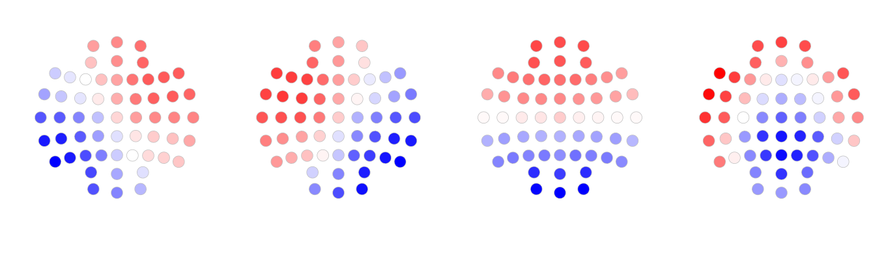
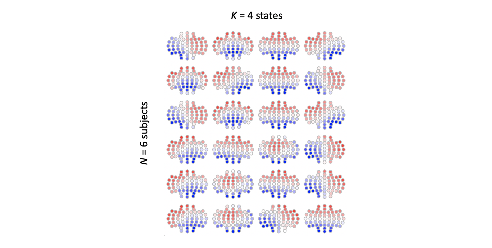

# Using Luna for EEG Microstate Analysis

In this vignette, we illustrate how to analyze [EEG microstates](../ref/ms.md) using
Luna.  We also compare the microstate maps generated by Luna to those
generated by [Cartool (version 3.80)](https://sites.google.com/site/cartoolcommunity/),
which is widely used in the microstate literature.

EEG microstate analyses consist of three parts:

 - segmentation/clustering

 - fitting maps obtained from segmentation to the original data (_backfitting_)

 - analysis of microstate transitions (_kmers_)

!!! Note
    This tutorial assumes a Linux/macOS command line environment, and the
    bash shell. You can use the [Luna Docker image](../download/docker.md)
    if you do not have access to a local workstation with either of these
    environments.

## Data

We will use a 57-channel EEG dataset, previously band-pass filtered in
the 1-40 Hz frequency range.  

| ZIP archive (60Mb) |
| ------------------------------------------------------------ |
| [http://zzz.bwh.harvard.edu/dist/luna/microstates/luna-ms-edfs.zip](http://zzz.bwh.harvard.edu/dist/luna/microstates/luna-ms-edfs.zip) | 

After downloading and extracting these data, we'll first build a [sample list](../luna/args.md#sample-lists) using the following command:


```
luna --build ./edf > s.lst 
```

We can confirm the EDFs have been transferred without error:
```
luna s.lst -s DESC
```
This should give some basic information about the contents of each EDF: e.g.
```
EDF filename      : ./edf/subject1.edf
ID                : subject1
Clock time        : 17.35.48 - 17.39.51
Duration          : 00:04:04  244 sec
# signals         : 57
Signals           : Fp1[500] Fp2[500] AF3[500] AF4[500] F7[500] F5[500]
                    F3[500] F1[500] F2[500] F4[500] F6[500] F8[500]
                    FT7[500] FC5[500] FC3[500] FC1[500] FC2[500] FC4[500]
                    FC6[500] FT8[500] T7[500] C5[500] C3[500] C1[500]
                    C2[500] C4[500] C6[500] T8[500] TP7[500] CP5[500]
                    CP3[500] CP1[500] CP2[500] CP4[500] CP6[500] TP8[500]
                    P7[500] P5[500] P3[500] P1[500] P2[500] P4[500]
                    P6[500] P8[500] PO3[500] PO4[500] O1[500] O2[500]
                    AFZ[500] FZ[500] FCZ[500] CZ[500] CPZ[500] PZ[500]
                    POz[500] OZ[500] FPZ[500]
```

!!! note "A note on the example EDFs"
    For the purpose of this tutorial, please note that this ZIP contains six EDFs but these
    are only from two individuals; that is, `subject2` and `subject3`
    are identical copies of `subject1`; likewise for the other three
    EDFs.

## Preprocessing

It is important to set the reference to average reference before
running microstate segmentation. If your EDF files contain non-EEG
channels such as EMG or EOG channels, it is not necessary to remove
them because Luna can select EEG channels for each operation. (In
contrast, Cartool requires the data files to contain only EEG
channels.)

!!! hint "Creating the average-referenced EEG dataset"
    The EDF files included in this vignette contain only EEG channels and
    have already been average referenced. The following commands are
    provided if you need to set an average reference and keep only the EEG
    channels for your own EDF files.
    
    1) Create a folder to store the processed EDF files:
    ```
    mkdir edf_ave_57ch
    ```
    2) Set the average reference and keep only the EEG channels, writing new EDFs (this will process each EDF, one at a time):
    ```
    luna s.lst -s ' REFERENCE sig=${eeg} ref=${eeg}
                    & SIGNALS keep=${eeg}
                    & WRITE edf-dir=./edf_ave_57ch edf-tag=ave-57ch force-edf '
    ```
    3) Rebuild the sample list:

    ```    
    luna --build ./edf_ave_57ch > s.lst
    ```

It will typically also be critical to apply other pre-processing steps (e.g. removing bad epochs and/or channels, and interpolating, etc) but
this is outside the scope of this vignette.   For the present purposes, we simply assume that we have relatively _clean_ data.

## Extracting and compiling GFP peaks

As described [here](../ref/ms.md), segmentation of EEG microstates
(i.e. finding the small number of prototypical _maps_ that best
describe all the variation in the EEG) can be performed using either
the whole recording, or only the data points that correspond to the
peaks of _global field power_ (GFP).  To learn what GFP is and why GFP
peaks are used for segmentation, see this [Sapian Labs article](https://sapienlabs.org/an-introduction-to-eeg-microstates/).
by Narayan P Subramaniyam.


Although it may be reasonable to segment individuals one-by-one, here
we want to derive clusters using all individuals simultanesouly.  As
the typical Luna workflow involves sequential processing of EDFs
(individuals), we need to perform an initial step to merge studies, by
creating a single EDF (called `peaks.edf`) that only contains the GFP
peaks from each subject.

Let's first ensure there is no file existing named `peaks.edf` in the working
directory:

```
rm -rf peaks.edf
```

We'll extract GFP peaks using the following code; Luna iterates over
every subject in the `s.lst` and appends the GPF peaks to the end of
`peaks.edf`.


```
luna s.lst -s ' MS sig=${eeg} peaks=peaks.edf gfp-max=3 gfp-min=1 gfp-kurt=1 npeaks=2500 pmin=-250 pmax=250 '
```

If copying-and-pasting from the code block, the text must be on one line;  the core `MS` command from above is shown here below, formatted
differently, just to make it easier to read:

```
MS sig=${eeg}
   peaks=peaks.edf
   gfp-max=3
   gfp-min=1
   gfp-kurt=1
   npeaks=2500
   pmin=-250
   pmax=250 '
```

Stepping through the key parameters:

 - `npeaks` sets the number of GFP peaks to extract. If the
input value for `npeaks` is greater than the number of GFP peaks in
the input EEG data, all GFP peaks will be extracted. If the input
value for `npeaks` is less than the number of GFP peaks in the input
EEG data, GFP peaks will be randomly sampled.

 - `gfp-max=3` excludes GFP peaks with amplitude 3 SD units above
the mean

 - `gfp-min=1` excludes GFP peaks with amplitude 1 SD units below
the mean

 - `gfp-kurt=1` excludes GFP peaks with spatial kurtosis 1 SD
above the mean

 - `pmin` and `pmax` set the physical min/max values we
expect to see across all subjects.

 - `sig=${eeg}` causes Luna to perform the operation on all EEG channels (based on the list of recognized labels, e.g. `C3`, etc).


This creates a new EDF `peaks.edf` that is a composite of all GFP
peaks from the six studies.  The `peaks.edf` does not contain
meaningful time-series data, it is only an intermediate for use with
the `MS` command. You can see basic information using normal Luna
commands, e.g.:

```
luna peaks.edf -s DESC
```

This will indicate, among other things, that the EDF is 15,000 seconds
long, and has the same 57 channels, but will note a sampling rate of 1
Hz.  That is, we are co-opting the typical EDF format to here be a
store of maps (i.e. 6 times 2,500 = 15,000, which is why the EDF is
15,000 seconds duration, given the arbitrary 1 Hz sample rate that has
been set).

## Segmentation/clustering

We'll next perform the microstate segmentation.  The microstate
literature typically suggests there are 4-7 "canonical" microstates; the
majority of studies report 4 canonical microstates [Michel & Koenig (2018)](https://www.sciencedirect.com/science/article/pii/S105381191731008X). You should select
the _K_ values based on your own research goals. You may also test
different _K_ values and compare the resulting maps. Here, we set _K = 4_.

Luna performs segmentation using the modified _k_-means clustering approach
as originally described by [Pascual-Marqui et al. (1995)](https://pubmed.ncbi.nlm.nih.gov/7622149/);
also see the guide and code by [Poulsen et al](https://www.biorxiv.org/content/10.1101/289850v1.full).

Here, we perform segmentation and write the solutions (i.e. the _K=4_
maps) to a file called `maps.txt`. (In the official Luna
documentation, the solutions are written in `sol.4` instead: you can
choose any filename you wish).

```
luna peaks.edf -o out.db -s MS segment=maps.txt k=4
```

This generate a file with a channel column and then four other columns,
each of which describes the prototypical map across the 57 channels (rows):
```
head maps.txt
```
```
CH     1           2          3          4
Fp1    0.193479    1.65726    1.21655    1.24549
Fp2    0.943825    1.64454    1.31543    0.731862
AF3    0.138468    1.0961     1.16978    1.24765
AF4    0.995642    0.999654   1.28505    0.651705
F7    -0.609393    1.56179    0.752841   1.3105
F5    -0.409298    1.26486    0.924439   1.37332
F3    -0.258709    0.848638   0.962335   1.31036
F1     0.033264    0.526441   1.0312     1.15652
F2     0.913384    0.356978   1.13398    0.556686
...
```

We can visualize these maps using the following R code (which uses default channel
locations) and the [`ltopo.rb()`](../../ext/R/viz/#ltoporb): 

```
library("luna")
data <- read.table("maps.txt", header=TRUE)

png( "maps.png", height=400, width=340 * 4 )
par(mfcol=c(1,4))
for (K in c("X1","X2","X3","X4")){
    print(K)
    ltopo.rb(data$CH, data[,K], sz=5)
}
dev.off()
```

Below are the visualization of the maps.

{:width="100%"} 

These maps maps are broadly similar to the four canonical microstate
maps reported in the literature. They are in this order: from left to right, they
are D, C, B and A respectively.

We use the following code to rename the maps from 1, 2, 3, 4 to D, C,
B, A. The results are written to `maps_renamed.txt`. (You could of course just
manually edit the files.)

```
echo | awk ' { printf "CH\tD\tC\tB\tA\n" } ' > maps_renamed.txt
awk ' NR != 1 ' maps.txt >> maps_renamed.txt
```

Below, the maps are re-plotted, in the canonical order of A, B, C, and D:

{:width="100%"}

We also used Cartool to perform the segmentation of the same data set
(The parameters used are listed in this file [GC data.04.(04).vrb](http://zzz.bwh.harvard.edu/dist/luna/microstates/GC_data.txt).  Below are the maps generated by
Cartool.

{:width="100%"}

As appears to be the case visually, here the maps generated by Luna
are highly correlated with the maps generated by Cartool:

| Map  | Correlation between Luna map and Cartool map |
| ---- | -------------------------------------------- |
| A    | 0.96                                         |
| B    | 0.94                                         |
| C    | 0.98                                         |
| D    | 0.96                                         |


Both Luna and Cartool have various other options that may be particularly useful in other contexts. That
is, there is no guarantee that solutions will always be near
identical.  The simple point here is that, for this small dataset and
_K=4_ solution at least, it is reassuring that two implementations of
fundamentally similar algorithms yield comparable results.

## Back-fitting maps to the original data

Here we _backfit_ the solutions/maps obtained above to the original
data set to obtain various measurements of each microstate.  That is,
now for every single time point in the original datasets (not just the
GFP peaks) we attempt to classify it as either A, B, C or D.

This command also writes out the sequences of states for each individual, as text files in the folder `states`: 
```
mkdir states
luna s.lst -o fit.db -s 'MS sig=${eeg} min-msec=20 backfit=maps_renamed.txt write-states=states/states-^'
```
As above, here we reformat the core `MS` command for readbility:
```
MS sig=${eeg}
   backfit=maps_renamed.txt
   min-msec=20
   write-states=states/states-^'
```

Note that this command is applied back to the original EDFs (i.e. as
specified by `s.lst`) rather than using `peaks.edf`.

The parameter `min-msec` sets the minimum duration of each microstate:
shorter segments will be rejected. We set it to 20 msec here.

Also note, the `write-states` option gives the filename for the state sequences; here, the `^`
character is a special symbol which means to swap in the ID for that individual.  Each file is a single
line for one individual: the ID, followed by the sequence of states: e.g.
```
subject1        CBABABABABABDBABABDABDADBAB....
```

## Microstate statistics

The previous _backfitting_ step also calculates a number of statistics that describe
the distribution of microstates for that individial.   We can extract them from the `fit.db`
[output file](../luna/args.md#lunout-databases)

The following command extracts, for each of the four states:

 - mean microstate duration (`DUR`),
 - time coverage/proportion of points spanned (`COV`)
 - occurrence per second (`OCC`)
 - mean spatial correlation to the maps (`SPC`)
 - global explained variance (`GEV`)
 - and global field power (`GFP`)

and writes these to a text file `ms.txt`:
```
destrat fit.db +MS -r K -v DUR COV OCC SPC GEV GFP > ms.txt
```

You can use the tools of your choice to summarize and plot the data in `ms.txt`

Extracting just a few rows and columns from `ms.txt` for `subject1`,
we see that C has the highest coverage, D has the lowest, and A and B
are intermediate:

```
ID        K   COV 
subject1  A   0.2684
subject1  B   0.2663
subject1  C   0.2867
subject1  D   0.1784
```

## Comparing maps

Rather than fitting a single segmentation/clustering to peaks
aggregated across all individuals (i.e. and so forcing a single
solution to be applied to all subjects), we can perform the
segmentation separately for each individual and ask whether or not the maps generated (for
a given number of states, _K_) are similar or not, between
individuals and/or groups.  If we were to find meaningful differences,
this might mean that statistics based on a unified map are not easily
interpretable (i.e. it is not an apples-to-apples comparison of, say,
duration of microstate C, if the "true" microstate C is
topographically different in one group versus another).

Here we just use the `MS` command applied to the whole sample list,
with the prior steps of first selecting GFP peaks, clustering and
then back-fitting.  There is just a single command:

```
luna s.lst -o ms.db -s 'MS k=4 min-msec=20 npeaks=2500 gfp-max=3 gfp-min=1 gfp-kurt=1 ' 
```

Note we tell Luna to apply the same criteria as before to select GFP
peaks for clustering (within individual). Looking at the console gives
a sense of how this proceeds for `subject1`:

```
  ...
  calculating GFP for sample
  given mean GFP of 8.78094, applying threshold to require:
  - GFP < 18.8539 [ mean(GFP) + 3 * SD(GFP) ]
  - GFP > 5.42328 [ mean(GFP) - 1 * SD(GFP) ]
  keeping 7542 of 8368 peaks, dropping 73 for gfp-max, dropping 753 for gfp-min
  applying GFP kurtosis threshold, to require : kurtosis < mean(kurtosis) + 1 * SD(kurtosis)
  dropping 612 GFP peaks, to leave 6930
  randomly selected 2500 of 6930 peaks
  extracted 2500 peaks from 122000 samples (2%)
  segmenting peaks to microstates
  ...
```

That is, of 8368 peaks initially detected, 6930 are left after
dropping peaks that are too large, too small, or associated with a
very topograpically skewed spatial map.  Of these, 2500 are selected
at random for the segmentation for that individual.


Although in this toy example, subjects 1-3 and subjects 4-6 are in fact
the identical recording, for the purpose of this application, we note
that a different subset of 2500 GFP peaks will be selected (because
the selection is at random) and therefore the maps are not obligated
to be identical when derived in this way (individual-by-individual).

This analysis generates both the maps and statistics in a single file:
```
--------------------------------------------------------------------------------
distinct strata group(s):
  commands      : factors           : levels        : variables 
----------------:-------------------:---------------:---------------------------
  [MS]          : .                 : 1 level(s)    : AMBIG GEV GFP_MEAN GFP_SD LZW NP
                :                   :               : NP0 OPT_K
                :                   :               : 
  [MS]          : K                 : 4 level(s)    : COV COV2 DUR GEV GFP N OCC OCC2
                :                   :               : SPC WGT
                :                   :               : 
  [MS]          : NK                : 1 level(s)    : MSE R2 SIG2 SIG2_MCV
                :                   :               : 
  [MS]          : CH K              : 228 level(s)  : A
                :                   :               : 
  [MS]          : K1 K2             : 16 level(s)   : SPC
                :                   :               : 
  [MS]          : PRE POST          : 20 level(s)   : P
                :                   :               : 
  [MS]          : CH K KN           : 228 level(s)  : A
                :                   :               : 
----------------:-------------------:---------------:---------------------------
```

We can extract the maps (`A` matrix) for each individual as follows (here `KN` is always 4 because we specified the number of states to be 4):

```
destrat ms.db +MS -r CH KN -c K -p 4 > maps_indiv.txt
```
```
ID          CH    KN     A.K_1     A.K_2     A.K_3     A.K_4
subject1    Fp1    4     0.0134    0.1942    0.1703    0.1691
subject1    Fp2    4     0.1147    0.1863    0.1742    0.0927
subject1    AF3    4     0.0253    0.1268    0.1618    0.1589
subject1    AF4    4     0.1390    0.1198    0.1706    0.0791
subject1    F7     4    -0.1035    0.2065    0.1153    0.1880
subject1    F5     4    -0.0573    0.1646    0.1418    0.1899
subject1    F3     4    -0.0237    0.0976    0.1382    0.1734
subject1    F1     4     0.0310    0.0460    0.1402    0.1407
subject1    F2     4     0.1353    0.0328    0.1413    0.0584
...
```
which gives a channel-by-state matrix (for each subject separately).  We can plot these using the following R code:

```
library(luna)
d <- read.table("maps_indiv.txt",header=T, stringsAsFactors=F )
par( mfrow=c(6,4) , mar=c(0,0,0,0) )
for (id in unique( d$ID ) )
 for (i in 1:4 )
  ltopo.rb( d$CH[ d$ID == id ] , d[ d$ID == id , 3 + i ] ) 
```

{width="100%"}

There are two things to note from this:

 - as expected, the ordering of maps is arbitrary, and so the
 "1","2","3" or "4" label for one subject does not necessarily
 correspond to another subject, even if the underlying maps were
 identical (this is one pragmatic advantage of performing the
 clustering jointly across all individuals)

 - beyond that, it isn't hard to see broad similarity between the four
   maps for each individual (remembering that subjects 1-3 and 4-6
   where different GFP peaks selected from the same individual), but
   still, there are a few minor albeit noticeable differences between
   solutions

Now question is how to quantify whether these solutions are "similar"
or not between individuals.  Luna provides a utility function
`--cmp-maps` which can be used to compare maps between individuals
and/or groups.  Specifically, it first builds an _N_-by-_N_ similarity
matrix, between all pairs of individuals.  For each pair of
individuals, the similarity measure is defined as the pairing of maps
that maximizes the sum of the spatial correlations between individuals.

For example, if we have 4 maps each for two individuals, we can write out a matrix
of spatial (polarity invariant) correlations between maps.  Rather than using 1,2,3, and 4, to
make clear whether the map is from the first or second individual, 
say we label the four maps for the first individual in the pair as _{ I, J, K , L }_ and _{ W, X, Y, Z }_ for the second:
```
   I         J         K         L
W  0.365381  0.119695  0.334492  0.892299
X  0.928951  0.453187  0.607328  0.699779
Y  0.791022  0.588412  0.937068  0.061216
Z  0.901084  0.688471  0.468684  0.708884
```

Each cell is the spatial correlation between one of subject 1's maps
and one of subject 2's.  The global similarity measure for this pair
of individuals is obtained by pairing maps between people in a way
that maximises the total correlation. In this example, it looks like this:

```
   I         J         K         L
W  .         .         .         0.892299
X  0.928951  .         .         .
Y            .         0.937068  .
Z  .         0.688471  .         .
```
which implies that W-L, X-I, Y-K and Z-J are paired between these two individuals
(and presumably each of those pairs would typically map to one of the canonical states
A, B, C and D as defined by the literature). The global similarity measure is then the mean of these 4 spatial correlations _S_ = ( 0.937 + 0.928 +  0.892 + 0.688 ) / 4 .

Following this approach for all pairs of individuals, we can then construct the _N_-by-_N_ similarirty matrix.
Given binary group labels assigned to each individual, we can ask whether the similarity within groups
is greater than the similarity between groups, which would imply a group difference.  Specifically, we define the
statistic:
```
 mean( concordant pair similarity ) / mean( discordant pair similarity )
```
We obtain the null distribution of this metric by randomly label swapping group codes, and recalculating
this value in the permuted datasets to get an empirical p-value, for a test of the null hypothesis that 
cases and controls, on average, have similar maps.

In this framework, we actually report four statistics (arbitrarily labelling the two groups as `case` and `control`, but
they could of course represent any binary partition of the sample):

 - whether mean within-case similarity is greater than expected
 - whether mean within-control similarity is greater than expected
 - whether absolute difference of mean within-case and mean within-control similarity is greater than expected
 - whether the above concordant pairs / discordant pairs measure is greater than expected


The `--cmp-maps` function expects these data in a slightly different format than we extracted above: just four columns: `ID`, `CH`, `K` and `A`
```
destrat ms.db +MS -r CH KN K | awk ' { print $1,$2,$3,$5 } ' OFS="\t"  > maps_indiv.txt
```
```
head maps_indiv.txt
```
```
ID          CH     K    A
subject1    Fp1    1    0.0133545046064995
subject1    Fp1    2    0.194216838954667
subject1    Fp1    3    0.170259662484421
subject1    Fp1    4    0.169083573514372
subject1    Fp2    1    0.114702891130699
subject1    Fp2    2    0.186326562871713
subject1    Fp2    3    0.174216793137071
subject1    Fp2    4    0.0926918112431818
subject1    AF3    1    0.0253096835482578
...
```

We then run the test as follows, here with 1000 permutations, and
using `vars` and `phe` to specify the binary partitioning.  Here
we'll use the `grouping.txt` file (which actually maps onto the
distinction between the two distinct individuals in this sample):

```
echo "file=maps_indiv.txt vars=grouping.txt phe=PHE nreps=1000" | luna --cmp-maps -o out.db 
```
```
===================================================================
+++ luna | v0.26.0, 11-Nov-2021 | starting 01-Dec-2021 13:01:47 +++
===================================================================
 running CMP-MAPS
  of 6 total individuals, for PHE 3 cases, 3 controls and 0 unknown
  creating individual-by-individual global similarity matrix
  within-case similarity                       : 0.66656 p = 0.113886
  within-control similarity                    : 0.666666 p = 0.0539461
  | within-case - within-control | similarity  : 0.000105589 p = 0.521479
  concordant / discordant pair similarity      : 0.668478 p = 0.113886
```

We see that (in this contrived example) there is no suggestion that
the two "groups" (i.e. _individuals_) have statistically different
maps from each other.  In practice, this type of analysis would be
more meaningful when applied to larger groups of truly independent
individuals, of course.

Finally, Luna also calculates the average _S_ measure per individual.  These
values can be useful in identifying outlier individuals, e.g. with bad data and
so very atypical solutions (even if the final analysis will be based on a joint segmentation).


```
destrat out.db +CMP-MAPS 
```
```
ID         S
subject1   0.99829
subject2   0.99833
subject3   0.99834
subject4   0.99814
subject5   0.99837
subject6   0.99826
```


## k-mer analysis of microstate transitions 

Apart from estimating typical microstate metrics (e.g. occurrence, coverage, duration, etc.), Luna offers a way to study the transitions of microstates in great detail. For example, the previously generated output file _fit.db_ (based on the group clustering) contains posterior probabilities of moving to state _J_ given you are currently in state _I_:
```
destrat fit.db -i subject1 +MS -r PRE -c POST
```
Extracting this _transition matrix_ for `subject1` (i.e. each row sums to 1.0):
```
ID       PRE   P.POST_A   P.POST_B   P.POST_C   P.POST_D
subject1   A   NA         0.393      0.349      0.258
subject1   B   0.371      NA         0.381      0.248
subject1   C   0.361      0.378      NA         0.261
subject1   D   0.327      0.332      0.340      NA
```


Luna also provides a method called _k-mer_ analysis.  K-mers are short
sequences of fixed lengths, such as `ABCD` and `ABAB` for _k_ = 4
(perhaps confusingly, note that in this context _k_ is not the same
_K_ as mentioned above, i.e. the number of distinct states).

Luna searches for k-mers within the microstate sequences of each
subject (i.e. the data in `states/`) and tests whether any k-mers are
enriched or depleted compared to chance expectation.  This is done by
shuffling the states in a way that preserves the overall frequencies
of each state, and also ensures that similar states are not adjacent
in the shuffled data (i.e. as in the real data, we never see `AAAA` as
that would simply be a single state `A` in the state sequence file).
Luna can also test whether k-mers are more or less enriched/depleted
in one group of subjects compared to another group.

Let's first write the microstate segment sequences from all the
subjects in one file named `state.txt`:

```
cat states/* > states.txt
```

We then use the `--kmer` command to run this analysis.  The
grouping information are provided in `grouping.txt`, which is also in the ZIP archive:
```
cat grouping.txt
```
```
ID	PHE
subject1	0
subject2	0
subject3	0
subject4	1
subject5	1
subject6	1
```

Subject 1-3 belong to one group and are coded `0`. Subject 4-6 belong to another group and are coded `1`.  (Note, as mentioned above,
in this vignette the subjects in each group are in fact identical copies of each other, included here only to illustrate how these
commands would be applied in the context of real data). One common use case is to code the control group as 0 and the case group as 1. 

```
echo "file=states.txt vars=grouping.txt phe=PHE k1=4 k2=4 nreps=100" | luna --kmer -o kmer.db
```

 Where the specific options are:

 - `file` points to the aggregated set of states for all six individuals

 - `vars` points to the file with the group/phenotype (`PHE`) information, which is indexed by a column `ID` that should match the EDF IDs
   (i.e. first column of `states.txt` )

 - `phe` specifies a column name with group/phenotype labels 

 - the parameters `k1` and `k2` set the range of the lengths of k-mers
you want to search for. Setting `k1=2` and `k2=4` would search for all
the k-mers with the lengths of 2, 3 or 4. Here we set `k1=4` and
`k2=4` to study only the k-mers of length 4

 - `nreps` is the numner of random permutations (shuffling of
   sequences) to perform (these are performed within each individual)

Looking at the output generated:

```
destrat kmer.db
```
```
--------------------------------------------------------------------------------
distinct strata group(s):
  commands      : factors           : levels        : variables 
----------------:-------------------:---------------:---------------------------
  [KMER]        : L S               : 108 level(s)  : EXP NG OBS P RAT SG Z
                :                   :               : 
  [KMER]        : L SG              : 19 level(s)   : EXP NG OBS P RAT Z
                :                   :               : 
  [KMER]        : L S PHE           : 324 level(s)  : EXP NG OBS P RAT SG Z
                :                   :               : 
  [KMER]        : L PHE SG          : 57 level(s)   : EXP NG OBS P RAT Z
                :                   :               : 
----------------:-------------------:---------------:---------------------------
```

In each case, `OBS` is the observed rate of a given k-mer, `EXP` is
the expected (chance) rate. The ratio of these is `RAT`, and the
`Z` and `P` metrics are Z-scores and empirical p-value, as estimated
by the shuffling procedure. 

The four rows of output above reflect enrichment of k-mers length `L`, based on
either the exact sequence (`S`), or the _equivalence group_ (`SG`).    Equivalence groups
are basically just groups of sequences that share the same counts of states:
```
  {  ABAC , ACAB, BACA , CABA , ABCA , ACBA }
```

These six sequences belong to the same equivalence group, which is
given the label of the "first" sequence (alphabetically, i.e. `ABAC`).
Statistics of counts based on equivalence groups are for the set of
those sequences.   The equivalence group for ABAB includes
ABAB and BABA (note two adjacent states cannot be the same in a
kmer. AABB is just the same as AB).


The outputs also differ by whether they are stratified by a phenotype
(`PHE`) or not.  If not, the enrichment statistics are based over all
individuals; otherwise, statistics are given separately by two groups,
as well as tests for whether the enrichment differs between groups.

Looking at the basic statistics:
```
destrat kmer.db +KMER -r L S -v  EXP OBS P RAT Z 
```
```
ID  L   S       EXP     OBS     P       RAT     Z
.   4   ABAB    0.012   0.015   0.0099  1.24    5.45
.   4   ABAC    0.013   0.011   0.75    0.87    -1.51
.   4   ABAD    0.012   0.013   0.22    1.03    0.81
.   4   ABCA    0.012   0.011   0.58    0.99    -0.08

....
.   4   BABA    0.012   0.015   0.0099  1.16    3.48

```
we see that, for example, `ABAB` is enriched (Z = 5.45, p < 0.01). In other words, whereas we'd expect a rate of `ABAB` occurrence to be 0.012 (`EXP`), the observed rate was `0.015` (`OBS`), a 1.24-fold `RAT` increase (note, you might not get the exact same results because GFP peaks are randomly selected each time and statistical outputs are generated based on random permutations but in general the results should look similar). 
Likewise, `BABA` shows similar enrichment.  Both sequences belong to
the equivalance group `ABAB`, and the output stratified by `-r L SG`
also shows this group is enriched:

```
destrat kmer.db +KMER -r L SG -v EXP OBS P RAT Z 
```
```
ID  L   SG      EXP     OBS     P       RAT     Z
.   4   ABAB    0.025   0.030   0.0099  1.20    5.19
.   4   ABAC    0.079   0.073   1       0.92    -4.49
.   4   ABAD    0.072   0.070   0.89    0.98    -1.14
.   4   ABCB    0.059   0.065   0.0099  1.10    5.10
.   4   ABCD    0.208   0.177   0.0099  0.85   -11.56

```
 In contrast, the equivalance group
`ABCD` (i.e any k-mer that has all four states, in any order) appears
under-represented, Z = -11.56 (expected 0.208, observed 0.177).


The following commands extract all statistics from the k-mer analysis:

```
destrat kmer.db +KMER -r S L > kmer1.txt
destrat kmer.db +KMER -r S L PHE > kmer2.txt
destrat kmer.db +KMER -r SG L > equiv1.txt
destrat kmer.db +KMER -r SG L PHE  > equiv2.txt
```

As noted, `kmer1.txt` contains the statistics regarding the overall
enrichment/depletion of kmers. `kmer2.txt` contains the statistics
regarding the enrichment/depletion of kmers in each group and the
differences between group 1 and group 0.

The formats in `equiv1.txt` and `equiv2.txt` are similar to that of
`kmer1` and `kmer2`. The difference is that these two files contain
statistics for the equivalence groups of kmers rather than individual
kmers.

You can use the tools of your choice to summarize and plot the data in
`kmer1.txt`, `kmer2.txt`, `equiv1.txt`, and `equiv2.txt`.  In real data,
the `Z` scores associated with the `DIFF` level of the `PHE` factor would be
meaningful, as indicating differences between groups in terms of motif enrichment.


## Conclusion

We have demonstrated that the microstate maps generated by Luna are
similar to the reported canonical microstate maps and are highly
correlated to the ones generated by Cartool. Furthermore, Luna
provides the kmer analysis to study the transitions of microstates.
The obvious advantage of using Luna to perform microstate analysis is
that it integrates better with a script-based analysis pipeline and
enables automated analysis for large datasets. Based on our
personal experience, Luna runs significantly faster than Cartool for
the segmentation of the microstates of ~100 subjects (less than one
hour using Luna vs days using Cartool).  (For this very small dataset,
the joint segmentation analyses above, and kmer enrichment
permutation-based analysis, took ~20 seconds on a laptop.)

