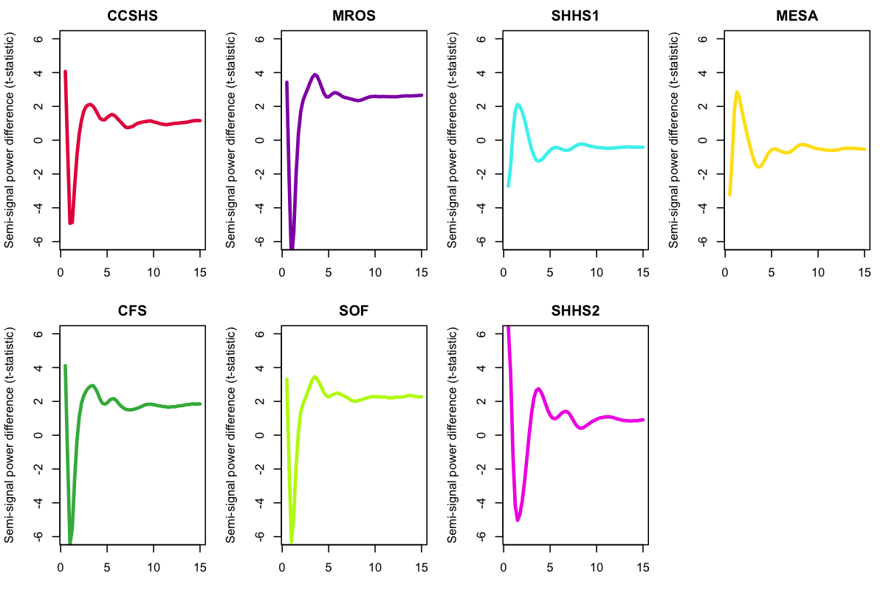

# Polarity issues in the NSRR 

Many analyses of sleep EEG data are effectively agnostic to the
_polarity_ of the EEG signal.  That is, you could _flip_ the signal
(i.e. multiply every sample value by -1) and still obtain equivalent
results, e.g. from most spectral analyses.  For certain analyses that
consider the _phase_ of a signal, however, it _will matter_ that the
polarity of the signal is correct.  As described below, one such case
is the temporal coupling between spindles and slow oscillations.  

Key points covered in this vignette:

 - we discovered some issues with the polarity of EEG signals in some
   NSRR studies (i.e. that they were flipped or upside-down:
   positive-to-negative and vice versa)

 - we tracked the source of the issue to an error in one of the older
   tools used upstream in the NSRR workflow (which might impact not
   just EEG signals, although that is not explored here)

 - we considered some approaches to flag whether
   a sleep EEG channel is likely to be flipped

 - __bottom line: if you are performing analyses that depend on phase
   relationships in NSRR data, you should attend to this issue!__

## The data

We considered seven NSRR datasets:
[_CCSHS_](https://sleepdata.org/datasets/ccshs),
[_CFS_](https://sleepdata.org/datasets/cfs),
[_SHHS_](https://sleepdata.org/datasets/shhs) (waves 1 and 2),
[_MESA_](https://sleepdata.org/datasets/mesa),
[_MrOS_](https://sleepdata.org/datasets/mros) and
[_SOF_](https://sleepdata.org/datasets/sof). For the purpose of this
vignette, we'll consider the two EEG channels (`C3`, `C4`) from each
study, along with the two EOG channels (`LOC` and `ROC`), on a total
of 15,048 sleep studies.  


## Cross-channel correlations

Perhaps the easiest way to jump into this is by considering the
distribution of cross-channel correlations (`C3` by `C4`, each
referenced to the contralateral mastoid) in individuals from the above
studies.  (Actually, the _MESA_ study is not included in this first
set of correlational analyses, as it does not have a `C3` channel.)
Using the [`CORREL`](../ref/cc.md#correl) command, we
observed the following:

{width="100%"}

Even given that we are averaging across heterogeneous studies, this
_tri-modal_ distribution is surprising, as it includes a peak of
_negative_ correlations.  Typically, one would expect positive
correlations, if any, between ~nearby electrodes, given the typical
nature of functional coherence and globally-operating elements of
sleep micro-architecture, not to mention volume conductance in
the scalp EEG.

!!! info 
    Correlations are the Pearson's correlation coefficient,
    calculated epoch-by-epoch between the two time series, then
    averaged over all epochs for a given individual.

When splitting out the above histogram by study, we observed that the
preponderance of negative C3-C4 correlations came from _SHHS1_, as shown
below.  Given that we did not see this effect in _SHHS2_ (or any of the
other studies) and given that it is highly unlikely to reflect a
genuine physiological effect, we assumed some kind of artifact (or
analytic error) was at play here:

{width="100%"}


!!! info "SHHS positive correlations" 
    Although beyond the scope of
    this vignette, also note that both SHHS studies tended to have
    lower positive mode (leading to the bimodality when combining 
    all cohorts, as in the first plot).  Although some of this effect
    could reflect genuine physiological differences, it more likely 
    reflects other technical and methodological differences between studies, 
    e.g. the placement of electrodes and the quality of the recording.

Going back to the full dataset (but still excluding _MESA_ for now), we
next looked at the EOG channels.  Specifically, what did the
distribution of EOG-EOG and (ipsilateral) EEG-EOG correlations look
like?  Here we saw another unexpected set of multi-modal distributions:

{width="100%"}

Splitting one of the EEG-EOG correlations (`C3-LOC`) by study, we
again saw that _SHHS1_ appeared to be an outlier, in having a
preponderance of _negative_ EEG-EOG correlations.  In other words, for
those people, when the EEG channel showed a _positive deflection_, more
often than not the (ipsilateral) EOG showed a _negative deflection_,
and vice versa, despite having similar reference electrodes.
 
{width="100%"}

Looking only at _SHHS1_, we plotted all four correlations (EEG-EEG,
EOG-EOG and the two ipsilateral EEG-EOG comparisons) as a function of
the position in the dataset (i.e. with each of ~5700 individuals as a
point, ordered left-to-right on the x-axis according to their _SHHS_
ID).  In each case, the y-axis goes from +1 (at the top) to -1 (at the
bottom of each of the four plots):

{width="100%"}

The apparent _banding_ turns out to largely map onto different parent
studies and collection clinics in _SHHS1_, which are not randomly
distributed with respect to sample ID.  To summarize this plot, we see
in _SHHS1_:

- both EOG channels are almost always concordant (i.e. have a _positive_ correlations) 

- most, but not all, individuals have a _negative_ correlation between C3 and LOC

- most, but not all, individuals have a _negative_ correlation between C4 and ROC

- most, but not all, individuals have a _positive_ correlation between C3 and C4

- the people who have a _positive_ C4-ROC correlation but a _negative_
  C3-LOC correlation tended to have a _negative_ C3-C4 correlation

___This is consistent with the polarity being swapped for either 0, 1 or
2 EEG channels, if we assume all EOG channels have correct polarity.___

After some further detective work, it indeed transpired that an early version
of the NSRR's
[`edf-editor-translator`](https://github.com/nsrr/edf-editor-translator)
tool appeared to have an issue in its [EDF validation
code](https://github.com/nsrr/edf-editor-translator/blob/master/src/validator/fix/ValidateEDF.java)
that would have caused some signals to be flipped.  

!!! detail "The cause of flipped polarities in NSRR"  
    Specifically, it seems that the `edf-editor-translator` checked for 
    whether the EDF had a _physical maximum_ (in the EDF
    header) that was smaller the the _physical minimum_.  Although this in itself is
    not necessarily an error for an EDF, the tool nonetheless swapped the physical 
    min/max header values, _but did not change any of the corresponding 
    sample points or the digital min/max_.  This effectively flips the
    polarity of the signal, in any case where the EDF signal happened
    to be encoded with negative gain.

The NSRR team is in the process of looking at the upstream processing
of EDF files.  If they are able to re-process these legacy datasets 
in a timely manner from scratch, then new EDFs with corrected polarities 
will be posted to the NSRR. This is no trivial task, however, as the original 
work involved manual steps to extract the thousands of EDFs from the proprietary 
formats, and not all intermediate files were saved.

_In the mean time_, for the rest of this vignette we first ask: _so
what?_ Does it matter that polarities may be flipped?  Second, in the
absence of re-processed data, we consider the type of heuristic that
might flag sleep signals that are likely to be flipped.


## Spindle/slow oscillation coupling

The particular case where we first encountered this polarity issue was
when looking at spindle/slow oscillation coupling in some of the NSRR
datasets.  From previous work, although not necessarily a precise
relationship (and one that is also age-dependent), we broadly expect
_on average_ for fast (e.g. 14 or 15 Hz) spindles to tend to occur on
the rising slope of slow oscillations, with their peak (maximum
spindle peak-to-peak amplitude) occurring near the positive peak of
the slow oscillation.  It is important to note that these
relationships, as well as changing with age, may well be dependent on
the particular approach to analysis (i.e. how spindles and/or slow
oscillations are defined) and/or stage of sleep, so _by
themselves_ spindle/SO coupling cannot unambiguous identify whether a
channel is flipped.  However, it certainly _is_ the case that any
polarity flips will impact analyses of spindle/SO
coupling.  In particular, indications of strong _bimodality_ in
coupling metrics, in an otherwise comparable set of samples, can
likely be informative about polarity flips, especially if the coupling
metrics are also related to other indices of polarity issues (e.g. the
cross-channel correlations as noted above).

In these NSRR datasets, we detected fast spindles and then, for each
individual, estimated the (circular) mean _phase_ of delta-band
activity (via a filter-Hilbert method) across all spindle peaks.  If
the polarity of the EEG was flipped, we'd predict an "inverted"
(i.e. phase-shifted by 180 degrees) spindle/SO-coupling relationship
for that individual.

In the plots below, slow wave phase is on the x-axis, which goes from
0 (positive-to-negative zero-crossing, `+-`), to the negative peak
(`-` at 90 degrees), to the negative-to-positive zero-crossing (`-+`
at 180 degrees, with the dotted line), to the positive peak (`+` at
270 degrees), and back to the positive-to-negative zero-crossing (`+-`
at 360/0 degrees).  The histogram represents the number of individuals
whose mean phase at spindle peak was at that value:

{width="100%"}

Wow! These certainly are some unexpected - _and bimodal_ -
distributions in the mean SO phase at spindle-peak for _SHHS1_, but
also _CCSHS_ and _CFS_.  In contrast, _SHHS2_, _MrOS_ and _SOF_ had
unimodal distributions, with most individuals having values somewhere
around 230-270 degrees, i.e.  on the _positive_ peak of the slow
oscillation as expected.  In _CCSHS_, _CFS_ and especially in _SHHS1_,
we saw a clear mode around the _negative_ peak (~90 degrees in these
plots, and so phase-shifted approximately 180 degrees), consistent
with a possible flip in EEG polarity.  Is this what's going on?

!!! info 
    We are only plotting spindle/SO coupling metrics 
    for individuals with _nominally significant tests_ for non-uniform
    phase distribution.  For many older individuals, in whom we
    often observe relatively few spindles, neither spindle, nor
    SO, nor their coupling relationships are necessarily clear-cut. As such, 
    we cannot rely on spindle/SO coupling to unambiguously identify a
    flipped channel, _even if_ we were to make the (very strong)
    assumption that only one of these modes was physiologically
    possible. 


Focusing on _SHHS1_ for the moment: if we take individuals with a
negative C4-ROC correlation (these were only found in _SHHS1_), and
_assume_ that their C4 channel was flipped, how does that change
spindle/SO coupling (in _SHHS1_), i.e. if we phase-shift their
spindle/SO mean phase by 180 degrees?

{width="100%"}

Good, this clears up the _SHHS1_ distribution somewhat.  In other
words, people with a negative EEG-EOG correlation also tended to show
reversed spindle/SO coupling phase, consistent with a polarity flip in
the EEG.  There is still a small bump of _SHHS1_ individuals with
seemingly reversed phase (most likely because thresholding the
correlation at 0 is an imprecise way to identify the flips).
Nonetheless, in _SHHS1_ these analyses seem have identified the likely
problem, and pointed to a ~95% fix.  Looking at this another way, the
scatter plot between the C4-ROC correlation and mean SO/delta phase at
spindle peak shows a clear relationship, suggesting that these two
metrics are getting at the same thing (that is, flipped EEG polarity):

{width="100%"}


But what about _CCSHS_ and _CFS_?  Note that we previously did not
observe any negative EEG-EEG or EEG-EOG correlations in _CCSHS_ or
_CFS_, only _SHHS1_.  This does not mean that all individuals in
_CCSHS_ and _CFS_ had correct EEG polarities, however: it could simply
reflect that _both_ EEG _and_ EOG signals were flipped in some
individuals.  In that case, the flips would naturally be invisible in
terms of cross-channel correlations (which only detect when _one_
channel is flipped relative to another).  Indeed, as we saw in
_SHHS1_, there are clearly some individuals for whom both EEG channels
were flipped, as well as some individuals for whom only one channel
was flipped.  In other words, we cannot rely on cross-channel
correlations alone to indicate whether a given channel is flipped.

Furthermore, what would one do in the case of a sample that _only_ had
a single EEG channel available?  For example, we didn't consider the
_MESA_ study in the analyses above, because it didn't have a C3 channel.
What does the distribution of SO phase at spindle peak look like in
_MESA_?

{width="100%"}

Hmmmm... here it seems that almost all individuals are showing the
unexpected, "flipped" spindle/SO phase distribution, which we've
previously shown is consistent with a flipped channel.  In the case of
_MESA_, I was able to see the pre-NSRR EDFs, and confirm that the
aforementioned `edf-translator-tool` issue was the culprit, and that
in this case it impacted _every_ EDF in _MESA_.  Thus, for _MESA_ the fix
is easy: one must flip the polarity of all EEG channels (this is for
the `EEG3` channel, which is C4-M1).

For the other samples, short of re-processing from scratch (which is,
of course, the ultimate solution), is there anything we can do to
complement the insights from spindle/SO coupling?  Given that
spindle/SO coupling is, in itself, a trait of considerable
neurophysiological interest, it might understandably make one a bit
squeamish to "fix" the signals on the basis of the "expected" result
for a likely predictor/outcome variable (especially as we know we
don't expect to see an unambiguous signal for everybody in any
case...).
 

## Single-channel polarity heuristic

Although far from a perfect fix, here we consider one complementary
heuristic to flag potentially flipped EEG signals, that is independent
of spindle/SO coupling _per se_, and is _self-contained_ in the sense
that it only looks at one signal at a time.  The basic idea is to take
advantage of the fact that slow oscillations during NREM sleep tend to
be asymmetric, with sharper negative than positive peaks.  Rather than
detect slow oscillations explicitly (which is certainly possible, and
would likely yield similar or even better results), we implemented a
slightly different approach (that may or may not have any advantages
relative to other similar ideas), as follows.  Consider an example
epoch of EEG from NREM sleep:

{width="100%"}

We first standardize the signal, band-pass filter in the delta-band,
and then identify all positive (red) versus negative (blue)
sample-points:

{width="100%"}

We then identify the even/odd positive components (labeling them red
and orange), and we do the same for the negative components (blue and
black):

{width="100%"}

Next, we split the original signal into two _semi-signals_,
corresponding to the upper and lower portions of the original signal.
We flip the polarity of odd (i.e. orange/black) components within each
semi-signal, in order to create two new signals, as follows:

{width="100%"}

The fundamental idea is that if the original signal is completely
"symmetric", then the two resulting semi-signals should have similar
spectral properties, both to each other and to the original (filtered)
signal.  Inasmuch as the original signal has systematic differences in
the positive or negative peaks, then we'd expect differences between
the two semi-signals, in terms of their spectral (or other)
properties.  

In this particular illustrative case, we've taken all positive and
negative components, but in practice the method (implemented in the
under-development [`POL`](../ref/exp.md#pol) command, only considers
peaks that are at least some threshold (e.g. 1 SD) above or below the
mean.  There are a bunch of other options that can be tweaked also,
but describing these is beyond the scope of this vignette.  In this
example, we use the difference in the semi-signal Hjorth parameters as
a measure of asymmetry (averaged over all NREM epochs for each
individual).

The plots below show the mean _difference_ in spectral power for the
upper versus the lower semi-signal, calculated across all NREM epochs
and all individuals in each cohort:

{width="100%"}

For the cohorts where we do not suspect any EEG polarity flips
(i.e. _SHHS2_, _MrOS_ and _SOF_, based on the correlational analyses
as well as the spindle/SO coupling), we see a characteristic downward
dip around 2 Hz in these _spectra difference_ plots, indicative of the
more pronounced negative peaks associated with slow oscillations and
slow wave activity in general.  In contrast, for _MESA_ (where we know
every record was flipped) we see the opposite pattern.  From the
spindle/SO analyses above, we might suspect that most _SHHS1_
individuals have a flipped C4 channel, and we do indeed see an
_average_ profile that is indicative of a flipped signal. 

The above plots are looking at sample _averages_, however.  Can these
statistics be used to indicate individual-by-individual whether or not
a signal was flipped?  Below we super-impose the difference statistics
for each individual within each cohort:

{width="100%"}

The individual traces are a little hard to make out, but in _SHHS1_
there is clear evidence for _both_ types of profile, i.e. indicative
of some individuals being swapped.  For each individual, instead of
looking at semi-signal power spectra differences, we can calculate the
difference in Hjorth parameters between upper and lower semi-signals,
as an index of asymmetry.  These correlate highly with both EEG-EOG
correlations (e.g. _r_ = 0.72 in _SHHS1_ and the spindle/SO phase
metric (_r_ = 0.83).  In fact, in a regression of the spindle/SO
metric for _all_ 15,048 individuals on the three semi-signal
difference Hjorth parameters (with _study_ as a dummy-coded
covariate), we find highly significant associations of all three
metrics (_p_ << 10<sup>-15</sup>, _p_ << 10<sup>-15</sup> and _p_ =
10<sup>-8</sup> respectively).

We'll combine the three Hjorth parameter _difference_ scores for each
individual, as they are nonetheless quite highly correlated, such that
a total score is scaled to indicate a likely polarity flip (a negative
score).  For _SHHS1_ individuals only, here we plot the original
EEG-EOG correlations and these new _POL_ scores, for C3 (left column)
and C4 (right column). Within channel, individuals with a negative
_POL_ score are coloured red. Bearing in mind that some of the _EOG_
channels may themselves be flipped (i.e. which will attenuate this
relationship), we can see a clear correspondence between the _POL_
score and how EEG and EOG were correlated.

{width="100%"}

Do the _POL_ scores help to clear up the _CFS_ and _CCSHS_ data in
terms of the spindle/SO phase relationships? Here, we phase-shift (180
degrees) individuals with a negative _POL_ score:

{width="100%"}

This seems to be going in the right direction, although it isn't
perfect.  For _SHHS1_, we seem to do better using the _POL_ score
compared to the EEG-EOG correlations, as above.  This also seems to
reduce the issue in _CCSHS_ and _CFS_, where it appears likely that
the EOG signals were flipped as well as the EEG.

## Summary

We wanted to flag an issue with some of the NSRR EEG (and other)
signals, in which the polarity of certain signals has been flipped.
This most obviously impacts SHHS1, because there appears to have been
inconsistent flipping of polarities for different signals within the
same individual, which makes the issue easier to spot.  Based on
looking at spindle/SO coupling, and at asymmetries in slow wave
activity in the NREM EEG, it appears that subsets of other studies
(i.e. here _CCSHS_, _CFS_ and _MESA_) were also affected, although it
was less obvious because it seems that EEG and EOG channels were
consistently flipped (or not flipped) within an individual.  This
would just come down to how the recording and EDF export was
calibrated for a particular study.


For many analyses this issue will not matter at all, _although for
some analyses it will matter greatly, as shown above._ Fixing the data
is the ultimate solution. But, acknowledging that this might not
always be immediately possible, the types of approaches outlined here
would seem to offer a reasonable _sanity-check_, at least on the
whole-sample level. These approaches appear to fall short of unambiguously resolving
issues on an individual-by-individual basis, however, and so care is
needed if performing analyses where phase/polarity matters.  Perhaps
conservatively removing individuals with ambiguous (i.e. near zero)
_POL_ scores is one approach.  The performance of _POL_ is
unfortunately likely to vary as a function of real differences in the
sleep EEG, i.e. if slow wave activity is attenuated.

___If you know of another, easier or more powerful approach, please let us know!___


## Luna command script used 

For reference, here is the Luna command script used to generate the
metrics that all the above analyses were based on:

```
EPOCH epoch=30 require=10

MASK all
MASK unmask-if=NREM2
MASK unmask-if=NREM3
MASK mask-if=${artifact}
MASK mask-if=${arousal}

RESTRUCTURE 

EPOCH epoch=30 require=10

uV signal=${eeg},${eog}

RESAMPLE sig=${eeg} sr=100

ARTIFACTS mask signal=${eeg}

SIGSTATS mask threshold=3,3,3 signal=${eeg},${eog}

RESTRUCTURE 

EPOCH epoch=30 require=10

% set flim to include spindle/SW range
POL sig=${eeg} flim=15

SPINDLES sig=${eeg} fc=15 sw q=0.3 f-lwr=0.3 f-upr=4 uV-neg=-40 uV-p2p=75 t-neg-lwr=0.3 t-neg-upr=1.5 t-pos-lwr=0 t-pos-upr=1

% need to ensure same SR
CORREL sig=${eeg},${eog} sr=100
```
