# Visualizing the NSRR with UMAP

[Uniform Manifold Approximation and
Projection](https://arxiv.org/pdf/1802.03426.pdf) (or UMAP) is a new
dimension reduction technique that can be used to visualize patterns
of clustering in high-dimensional data.  Unlike PCA (but similar to
other approaches such as [t-SNE](https://lvdmaaten.github.io/tsne/)),
it is focused on _local_ clustering, meaning that whilst "similar"
observations should be grouped together, it does not attempt to
preserve the exact global structure between all observations.
Seemingly, in many contexts this property can make for more intuitive
(and visually interesting) representations of data.  (Think of sorting
Lego blocks into piles based on their shape and size: you'd likely
only care that similar blocks are in the same pile, and not about the
relative positions of the different piles to each other.)

This approach has been used widely on [single-cell RNA sequencing
data](https://www.nature.com/articles/nbt.4314) to delineate cell
types, as well as [population genetic
data](https://www.biorxiv.org/content/10.1101/423632v1), to reveal
fine scale ethnic and geographical structure in human populations at
different scales.  And, conveniently, UMAP is _very computationally
efficient_.

___Sounds great -- so what does the NSRR look like through the lens of UMAP?___

Purely to explore some NSRR data and to generate a few images for their
own sake, we applied UMAP (as implemented in the
[umap](https://cran.r-project.org/package=umap) R package and making
_absolutely no effort_ to use anything other than its default settings) to EEG power
spectra from over 10 million epochs of sleep.

## The data

We considered nine NSRR datasets:
[_CHAT_](https://sleepdata.org/datasets/chat) (baseline and follow-up
datasets), [_CCSHS_](https://sleepdata.org/datasets/ccshs),
[_CFS_](https://sleepdata.org/datasets/cfs),
[_SHHS_](https://sleepdata.org/datasets/shhs) (waves 1 and 2),
[_MESA_](https://sleepdata.org/datasets/mesa),
[_MrOS_](https://sleepdata.org/datasets/mros) and
[_SOF_](https://sleepdata.org/datasets/sof).  We extracted all _sleep_
epochs (30-second epochs, based on NSRR's manual staging), removing
epochs with any manually-annotated _arousal_ or _gross artifact_.  We then estimated
the power spectral density ([`PSD`](../ref/power-spectra.md#psd)) for
the C4-M1 EEG channel for every epoch.  In total, this analysis
calculated power spectra for 10,389,017 epochs in 16,722 individuals.
Parallelizing jobs on a compute cluster, the Luna analyses took about
1.5 hours to run.

## Clustering individuals

As a broad initial sanity-check, we first considered the average power
spectra per cohort, _for all sleep epochs_ (i.e. merging both REM and
NREM). After removing outliers, we obtained the following:

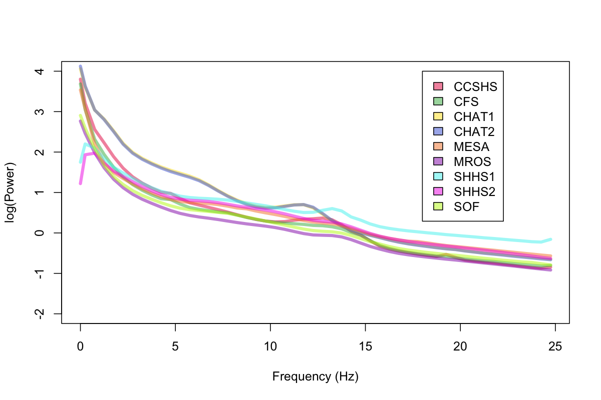

The PSD of the two _CHAT_ studies (which are studies of younger children) almost completely
overlap (these are the two lines with the highest theta power,
although they look like a single line because of the overlap).  Also
of note: we can see bumps in the sigma range for a number of studies
(bearing in mind here we've averaged over REM as well as NREM epochs).
We can also see that _SHHS1_ and _SHHS2_ seem to have had
low-frequency activity filtered out at the hardware level (as we did
not apply any bandpass or high-pass filtering for these analyses).  In
any case, these spectra look broadly as expected.

Using each individual's average absolute log-scaled power spectra as
the input to UMAP for dimension reduction, this is a snapshot of the
"NSRR sleep EEG".  Each point represents a single individual, with the
colors indicating the cohort:

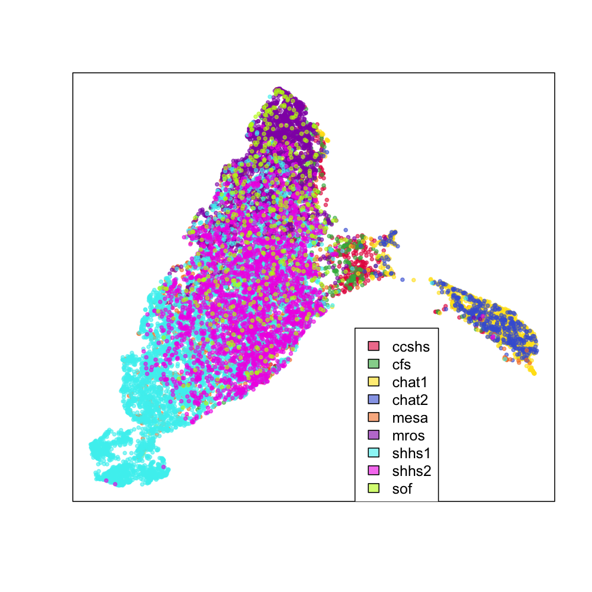

We see the two _CHAT_ studies (blue and yellow) form their own
cluster, but otherwise most individuals fall into a single large
cluster.  There does seem to be some indication that different cohorts
are differently distributed within this mass, however, as the next
series of plots makes clearer.  These represent exactly the same data
as above, but split by cohort (i.e. for the top-left _CCSHS_ plot,
all non-_CCSHS_ individuals are in gray).

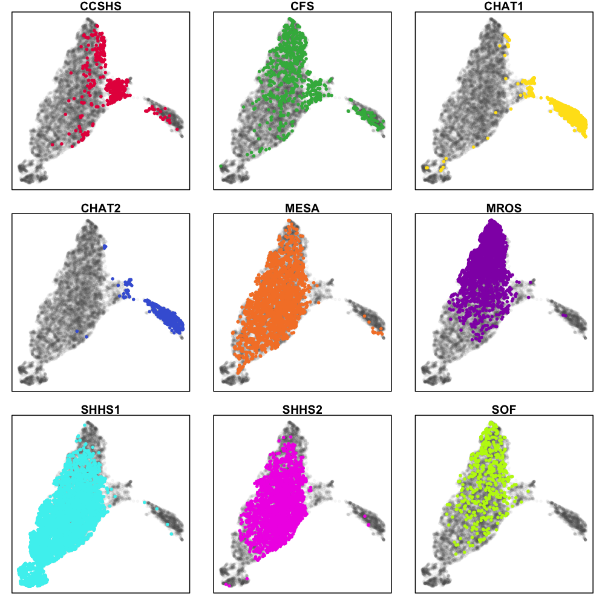

The distribution of _CCSHS_ (16-18 year old adolescents, coloured red)
is interesting, in that they largely form their own cluster, in
between the children and the adults, although some _CCSHS_ individuals
appear to cluster more closely with either the children or the adults.
Makes sense, I suppose.  The _CFS_ study contains a broad range of
individuals, including older children as well as middle-aged adults.

Also of note, _SHHS1_ and _MrOS_ seem to occupy different ends of the
main cluster.  This (most likely) could reflect technical differences:
in fact, we should be very clear that all these types of analyses will
likely represent some (possibly hard-to-determine) mixture of
technical effects (between and within cohort) as well true differences
in sleep macro- and micro-architecture.

We can repeat the previous UMAP analyses, but now on one cohort at a
time, i.e. to focus only on _intra_-cohort differences.  These plots
are largely uninteresting, perhaps with the exception of _SHHS1_,
where (as evident in the early plots) there appear to be some
_substructure_ within the _SHHS1_ samples:

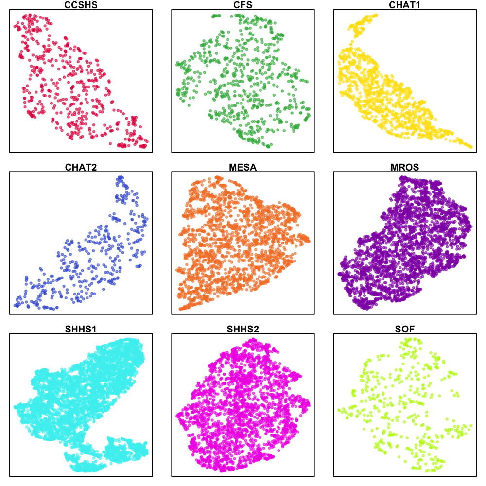

What's going on with _SHHS1_?  Looking only at this cohort, we can
flag individuals in the two lower clusters as _red_ and _blue_, and
then look at their power spectra (both as the mean, and also showing
every individual's PSD; in all cases, the gray PSD is the mean for the
rest of the _SHHS1_ cohort):

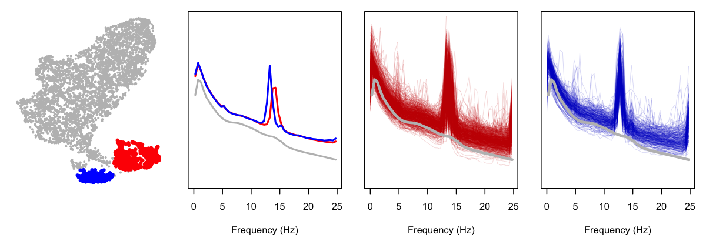

As is clear from these plots, the PSD for these subgroups contain
strong spikes (at two slightly different locations, thus the
appearance of more than one subgroup).  Is there something terribly
wrong with these studies?  Not really, as a little further exploration
shows, although this is also a reminder of why it is important to
perform statistical [artifact detection](../ref/artifacts.md) on these
(and other) sleep EEGs.  Based on a handful of studies selected at
random, it appears that these studies contain high levels of artifact
_at the end of the study_ for the C4-M1 channel.  Below, we show the
power spectra for three of the "blue" individuals, along with their
sleep spectrograms (i.e. epochs of sleep on the x-axis):

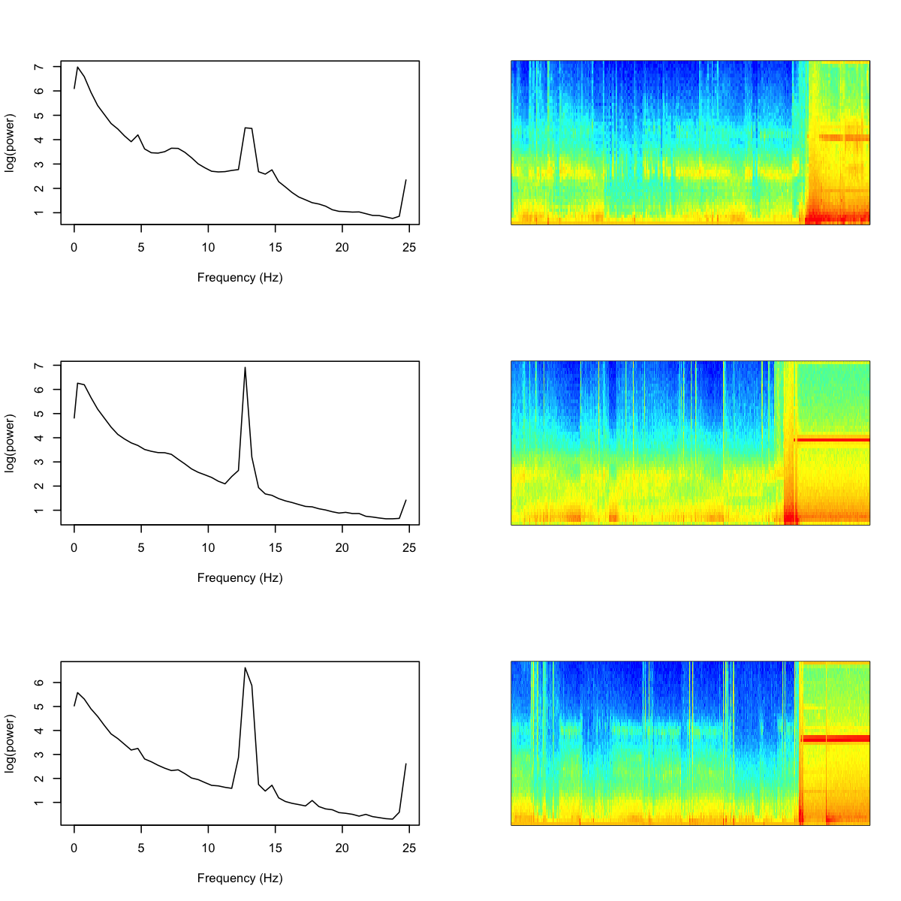

Clearly this channel has become corrupted towards the end of the
recording (although these are all manually annotated as _sleep_
epochs, meaning the other EEG channel was quite possibly still good).
Note that in this analysis _we purposely did not perform statistical
artifact detection_, as we wanted to visualize both artifactual as
well as physiological sources of variation in the sleep EEG.

## Clustering stages

So far, so good.  But obviously we know that the sleep EEG is highly
dynamic and changes with sleep stage (i.e. it is used to _define_
sleep stage...).  Averaging over all sleep epochs is not really an
ideal way to consider these data, therefore.  Here, we estimate the
mean _stage-specific_ PSD per individual, and use UMAP to cluster
these _4N_ observations. That is, these plots therefore represent
differences between stages as well as differences between individuals.
N1, N2 and N3 are coloured light blue, blue and black; REM sleep is
coloured orange.  Looking at all nine NSRR cohorts together:

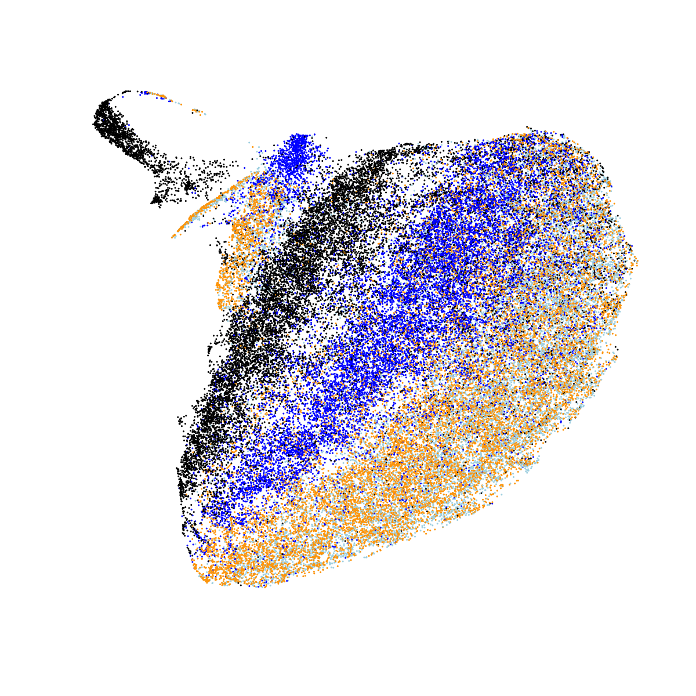

In the above plot, we see clear evidence of clustering both by
stage and by cohort (largely _CHAT_ versus _non-CHAT_), as expected.
Plotting the same data separately for each of the nine cohorts:
 
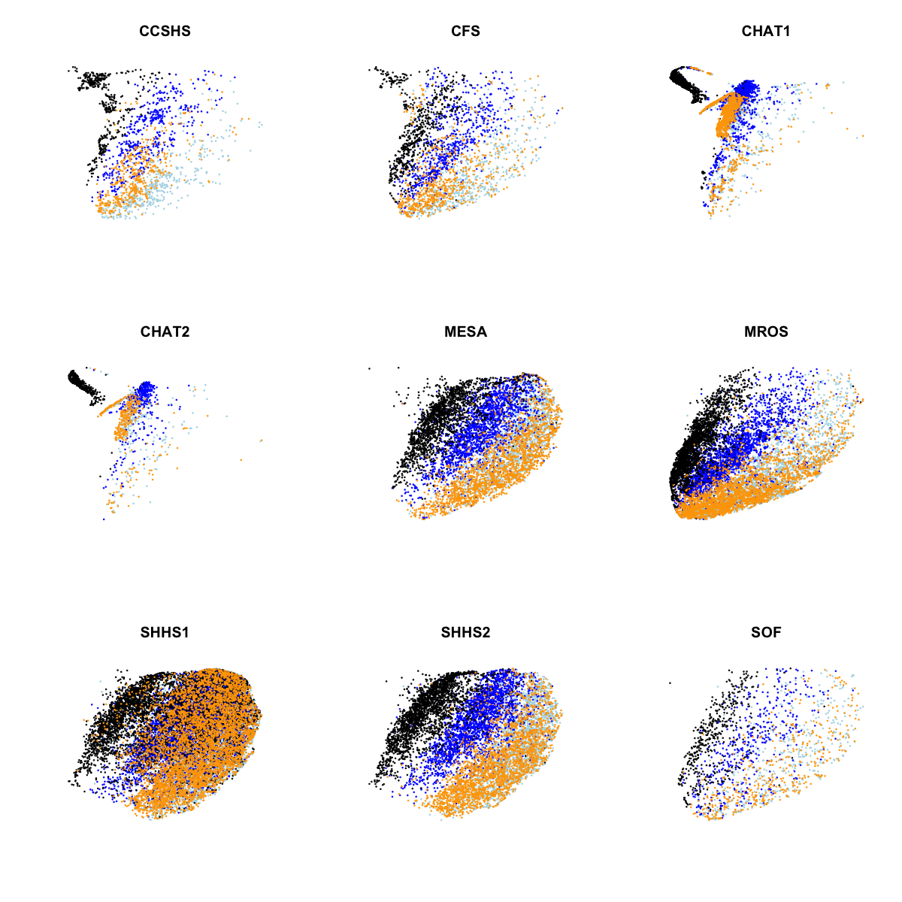

Aside from the _CHAT_ studies, perhaps the other noteworthy point here
is that _SHHS1_ clustering with respect to manually-assigned stage
doesn't appear as clear as for some of the other comparable cohorts
(most obviously _SHHS2_).  Although to some extent this could be a
visual artifact arising from plotting twice the number of observations
in one plot (_SHHS1_ is by far the largest study), it's still a bit
curious.
 

## Clustering epochs

Finally, we'll use UMAP to cluster on an epoch-by-epoch basis, here
within single individuals randomly selected from some of the above
cohorts: _CHAT_ (children), _CCSHS_ (adolescents), _MrOS_ (older adult
males) and _SOF_ (elderly females).  In each case we show the results
of a _within-individual_ UMAP analysis, for 25 randomly selected
individuals.  As before, N1, N2 and N3 are light blue, blue and black
respectively, and REM is orange:

<h3>CHAT (children)</h3>

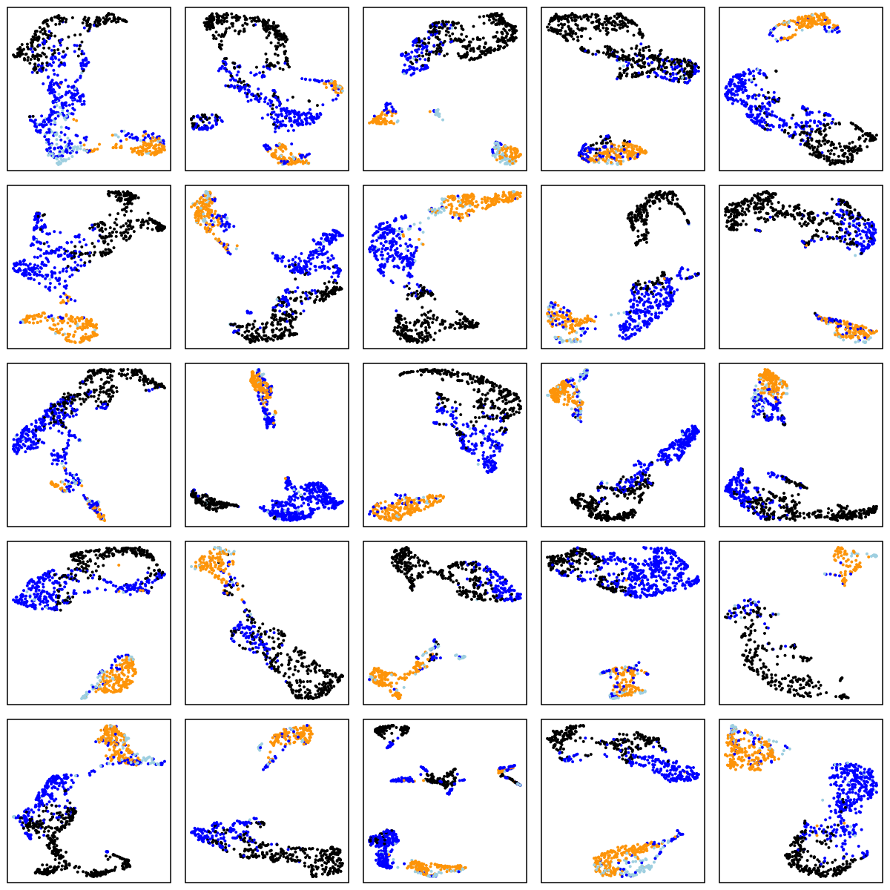

<h3>CCSHS (adolescents)</h3>
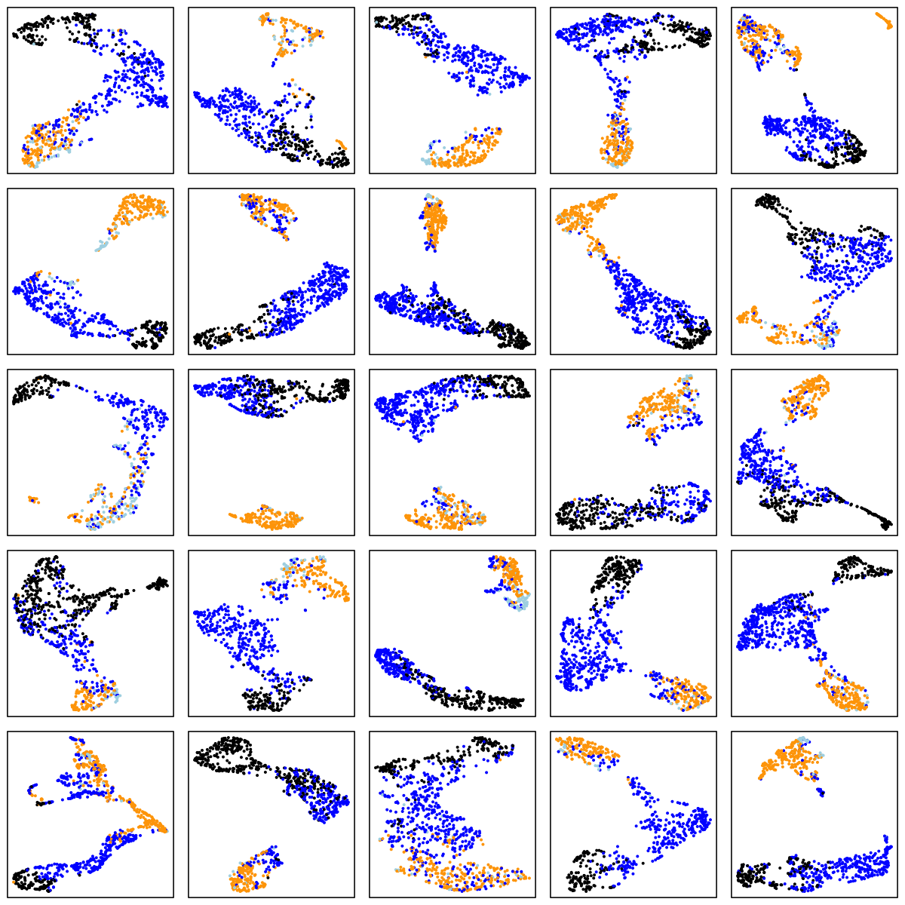

<h3>MrOS (older adult males)</h3>
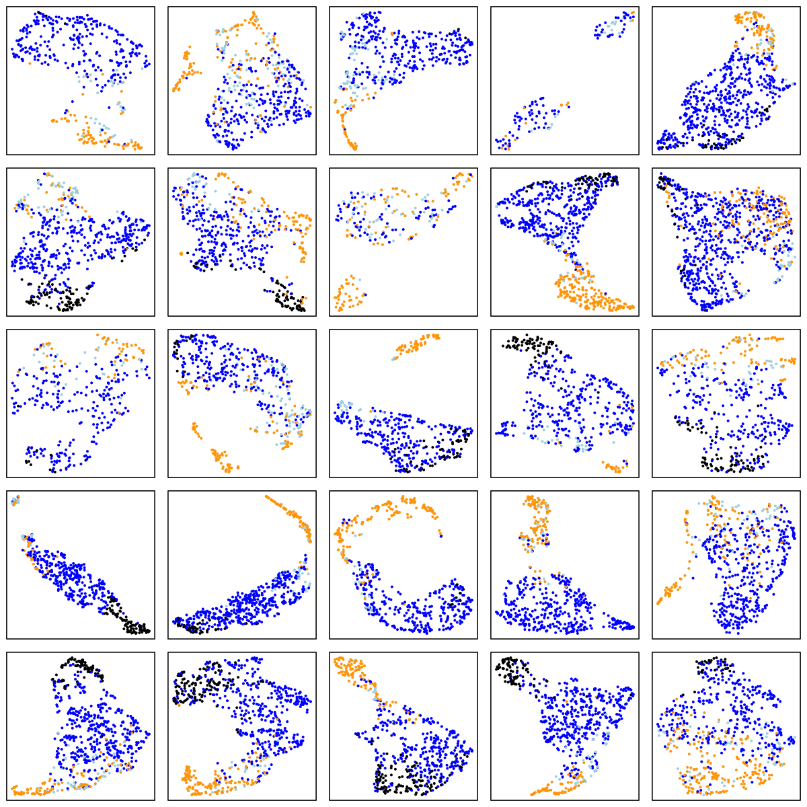

<h3>SOF (elderly females)</h3>

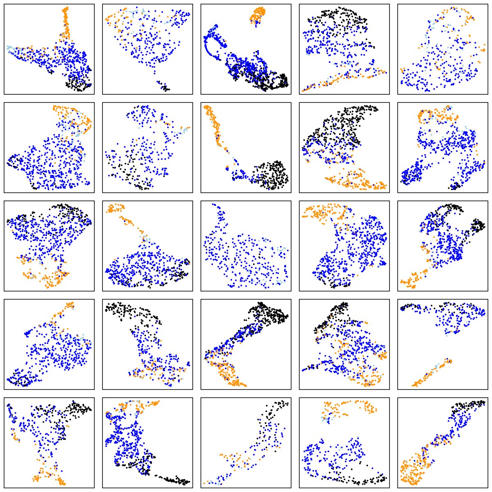

There are a number of things to note in the above plots.  Perhaps most
obviously is the impact of ageing on the sleep EEG: as well as fewer
data-points in the two older cohorts (i.e. _less sleep!_), there is
far less structure and separation between manually-assigned stages,
and even ignoring the manual stage (as the actual UMAP analysis does),
there is less evidence of substructure in each individual's sleep.

Looking at the _CHAT_ and _CCSHS_ plots (noting this is a very
unscientific random selection of 25 individuals only from each
cohort), it is interesting to note that some individuals appear to
have a clear separation between N2 and N3 epochs, whereas others do
not.  In these latter cases, N2 and N3 epochs are often not completely
overlapping, but it appears as if there is a continuum of intermediate
states (which effectively acts to "join" the two stages), rather than
these states being completely distinct.  Often REM sleep clusters very
obviously apart from N2 and N3 sleep, although of course note that (on
the basis of a single EEG), REM sleep will often be not easy to
distinguish between N1 and wake (we removed all wake epochs prior to
the UMAP analyses).

There are also cases where artifact perhaps, or changes in the
recording parameters throughout the night, seems to create
substructure in these epoch-level plots. Finally, _at least on the
basis of this one EEG channel_ there appear to be a modest but
non-negligible number of instances whether the manually assigned stages
do not seem to agree with the data-driven patterns of clustering we
see in the sleep EEG.
 
## Conclusion

As per our stated intention, we used UMAP to visualize some NSRR data.
Aside from generating some nice images summarizing approximately two
months worth of sleep EEG, we haven't necessarily learned that much
new. But hopefully it gives some appreciation of how artifactual and
genuine sources of variation come together in "big data" analyses, and
that you should always take care to tease them apart.

But perhaps the most obvious take-away: if you're developing an
automated staging algorithm, it will make your performance look _much
better_ if you train and test in young samples ;-)
